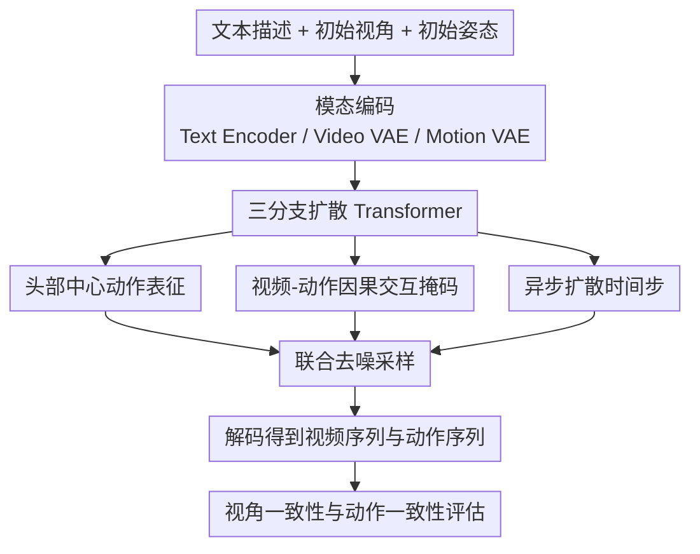

# EgoTwin: Dreaming Body and View in First Person

**会议**: ICLR 2026  
**OpenReview**: [https://openreview.net/forum?id=QFJkvv3zMi](https://openreview.net/forum?id=QFJkvv3zMi)  
**代码**: https://egotwin.pages.dev/（项目页，代码仓库未明确公开）  
**领域**: 视频生成 / 人体运动生成 / Egocentric 生成建模  
**关键词**: 第一人称视频生成, 视频-动作联合建模, 扩散 Transformer, 头部中心表征, 跨模态时序一致性

## 一句话总结
EgoTwin 把“第一人称视频生成”和“人体动作生成”放在同一个扩散 Transformer 里联合建模，通过头部中心动作表征与带因果约束的跨模态注意力，让生成的视频视角轨迹和人体运动在时间上同步、在几何上对齐。

## 研究背景与动机
**领域现状**：视频生成近两年主要突破集中在第三人称（exocentric）场景，模型能根据文本或图像条件生成高质量、时序连贯的视频；人体动作生成则在 text-to-motion 方向快速成熟，形成了独立的数据表示、VAE 压缩和扩散建模范式。

**现有痛点**：第一人称（egocentric）视频并不是“换个摄像机位置”的简单版本。相机安装在佩戴者头部，画面变化由头部和全身动作共同驱动。如果只做视频生成，模型容易产生“镜头在动但身体逻辑不成立”的结果；如果只做动作生成，也无法保证动作对应的视觉观测真实可见。

**核心矛盾**：传统 camera-control 视频方法依赖预设相机轨迹，但 egocentric 场景里轨迹本身就是待生成结果；同时，常见 root-centric 动作表征把“头部姿态”埋在复杂运动学链条里，视频分支难以直接读出与视角最相关的信息。

**本文目标**：作者把问题拆成两个必须同时满足的子目标：一是视角对齐（Viewpoint Alignment），即视频里的相机轨迹要和动作里的头部轨迹一致；二是因果耦合（Causal Interplay），即当前画面影响下一步动作，动作反过来改变后续画面。

**切入角度**：EgoTwin 的切入点不是给视频分支“额外喂一个相机条件”，而是让视频与动作在同一生成过程中互相约束，并把最关键的头部状态显式放进动作表示，使两模态在 token 级别建立可学习的时间因果关系。

**核心 idea**：用“头部中心动作表征 + 结构化跨模态注意力掩码 + 异步扩散”替代“松耦合的全连接联合生成”，把第一人称视频与人体动作作为一个闭环系统共同生成。

## 方法详解

### 整体框架
EgoTwin 是一个三分支扩散 Transformer：文本分支负责语义条件，视频分支负责 egocentric 画面生成，动作分支负责人体姿态序列生成。三者通过联合注意力进行信息交换，但视频-动作之间不是全连接，而是按“观测-动作”的时间因果关系选择性连边。

训练和推理都围绕“联合分布”展开。给定初始姿态、初始第一视角观测和文本指令，模型同时采样视频 latent 与动作 latent。这样，视频中的相机运动不再是外部给定，而是由生成的动作序列内生决定。

### 关键设计
**1. 头部中心动作表征：把第一人称相关信息从隐式运动学中显式解耦**

传统 root-centric 表示通常用根节点角速度、平移速度、局部关节位置与旋转等量描述全身，这对通用动作生成很有效，但对 egocentric 联合生成不友好。因为视频分支真正需要的是“头部如何移动、如何转向”，而这在 root-centric 里需要先积分根运动，再做前向运动学（FK）层层传播才能恢复。

EgoTwin 改成 head-centric 表示，直接包含头部绝对/相对旋转 $(h_r, \dot{h}_r)$ 与头部绝对/相对位置 $(h_p, \dot{h}_p)$，并把其他关节量改写到 head space。这样视频分支可直接对齐“相机视角变化 ↔ 头部姿态变化”，降低学习难度并提升几何一致性。论文消融也证明，去掉这项改造后跨模态指标明显下滑。

**2. 因果交互掩码：把观测-动作闭环写进注意力结构**

作者不是让视频 token 与动作 token 全互相注意，而是按照 forward dynamics 和 inverse dynamics 设计掩码。若把视频帧视作观测 $O_i$、动作片段视作 $A_i$，则遵循 $\{O_i, A_i\} \to O_{i+1}$ 与 $\{O_i, O_{i+1}\} \to A_i$ 的关系构造可见性：视频 token 重点看前序动作，动作 token 重点看当前和后续视频变化。

该设计直接编码“看见什么会做什么、做了什么会看到什么”的闭环逻辑。相比全连接注意力，这种结构化约束更容易形成逐帧同步关系，特别是在开门、转身、进入房间这类强因果场景中，能减少视觉变化与动作变化不同步的现象。

**3. 异步扩散：允许视频与动作在不同噪声时刻交互**

EgoTwin 对视频分支和动作分支分别采样时间步 $t_v, t_m$，并联合输入去噪网络优化：

$$
\mathcal{L}_{DiT}=\mathbb{E}\left[\lVert \epsilon_v-\epsilon^\theta_v(\cdot)\rVert_2^2 + \lVert \epsilon_m-\epsilon^\theta_m(\cdot)\rVert_2^2\right].
$$

直观上，异步扩散让两模态在不同“去噪成熟度”下交换信息，能覆盖更丰富的跨模态依赖。同步扩散（同一时间步）更简单，但会压缩可交互状态空间。消融里去掉异步扩散后，视频质量、动作质量和一致性都出现稳定退化。

**4. 三阶段训练：先补齐动作分支能力，再做联合建模**

训练分三段：先训 Motion VAE；再做 text-to-motion 预训练（冻结文本分支）；最后加入视频做 text-video-motion 联训。这个顺序的关键价值在于，动作分支从零开始时不至于被超长视频 token 淹没，且能尽早把动作嵌入对齐到预训练 text-video 表征空间。最终联合训练阶段再学习跨模态闭环，使稳定性和效果兼得。

### 一个完整示例
以提示词“进入娱乐室，右转并打开通向院子的门”为例，可把生成过程理解为以下链条：

1. 初始帧给出门与室内布局，文本给出目标动作序列（进入-转向-开门）。
2. 动作分支先生成“向前移动 + 右转”的头部与全身姿态变化，视频分支据此生成视角右偏和门位置变化。
3. 当画面中门把手进入可交互区域，动作分支生成抬手与躯干微调，视频分支同步出现门被拉开的视觉反馈。
4. 开门后新视野（院子区域）又反过来约束后续动作，形成新的观测-动作循环。

这个例子说明，EgoTwin 不是先“拍视频”再“补动作”，而是两条序列在每个阶段共同演化。

### 损失函数 / 训练策略
Motion VAE 使用重建损失与 KL 正则的加权和，并对 head3D、head6D、joint3D、joint6D 四组分量分开计算后平均，避免维度较高分量主导优化。联合扩散阶段采用文本条件随机丢弃（CFG 训练范式）以支持条件/无条件混合采样。

推理时除了 T2VM（文本到视频+动作联合生成），还支持 TM2V（文本+动作到视频）和 TV2M（文本+视频到动作），说明模型学到的是联合分布而非单向映射。

## 实验关键数据

### 主实验
论文在 Nymeria 数据集上与 VidMLD 基线对比。EgoTwin 在视频质量、动作质量、视频-动作一致性三类指标上全面领先。

| 方法 | I-FID ↓ | FVD ↓ | CLIP-SIM ↑ | M-FID ↓ | R-Prec ↑ | MM-Dist ↓ | TransErr ↓ | RotErr ↓ | HandScore ↑ |
|------|--------:|------:|-----------:|--------:|---------:|----------:|-----------:|---------:|------------:|
| VidMLD | 157.86 | 1547.28 | 25.58 | 45.09 | 0.47 | 19.12 | 1.28 | 1.53 | 0.36 |
| EgoTwin | **98.17** | **1033.52** | **27.34** | **41.80** | **0.62** | **15.05** | **0.67** | **0.46** | **0.81** |

从一致性指标看改进最显著：TransErr 从 1.28 降到 0.67，RotErr 从 1.53 降到 0.46，HandScore 从 0.36 提升到 0.81，说明模型确实学到“第一视角变化与人体动作同步”的核心能力，而不只是单模态质量提升。

### 消融实验
作者分别移除 Motion Reformulation（MR）、Interaction Mechanism（IM）、Asynchronous Diffusion（AD），结果均劣于完整模型。

| 变体 | I-FID ↓ | FVD ↓ | M-FID ↓ | R-Prec ↑ | TransErr ↓ | RotErr ↓ | HandScore ↑ |
|------|--------:|------:|--------:|---------:|-----------:|---------:|------------:|
| w/o MR | 134.27 | 1356.81 | 43.65 | 0.56 | 0.96 | 1.22 | 0.44 |
| w/o IM | 117.54 | 1237.58 | 44.01 | 0.59 | 0.85 | 0.89 | 0.57 |
| w/o AD | 109.73 | 1124.19 | 42.58 | 0.53 | 0.74 | 0.62 | 0.73 |
| EgoTwin | **98.17** | **1033.52** | **41.80** | **0.62** | **0.67** | **0.46** | **0.81** |

此外，跨数据集评测（Ego-Exo4D）中，EgoTwin 相比基线仍保持明显优势，说明其跨模态耦合能力并非只在训练分布内成立。

### 关键发现
- 对这个任务影响最大的不是某个单独 decoder 细节，而是“表征 + 交互结构 + 扩散时序”的系统性协同设计。
- 头部中心表征对一致性指标贡献很大，说明 egocentric 任务中“头部状态可见性”是第一优先级。
- 因果交互掩码显著改善旋转与手部一致性，提示逐帧关系建模比全局语义对齐更关键。
- 联合建模还能反向提升单模态质量（视频与动作指标都更好），体现了跨模态互补收益。

## 亮点与洞察
- 亮点 1：把“第一人称视频生成”从纯视觉问题提升为“观测-动作闭环生成”问题，问题定义本身就更接近具身智能真实场景。
- 亮点 2：头部中心动作表示非常务实。它不是追求更复杂网络，而是降低跨模态对齐所需的推理链长度，属于高性价比建模改造。
- 亮点 3：交互掩码把因果先验显式写进注意力图，避免模型在大规模 token 中自己“盲学”时序约束，工程上可解释、可迁移。
- 亮点 4：支持 T2VM / TM2V / TV2M 三种采样模式，说明模型具备较强条件组合能力，为后续交互式内容生成留出接口。

## 局限与展望
- 数据依赖仍然很重。论文训练基于约 170K 的 text-video-motion 片段，这类高质量同步采集成本高，限制了方法在更多动作域的扩展速度。
- 评测管线中部分一致性指标依赖外部估计器（如 SLAM 估相机位姿），当估计误差较大时会影响指标绝对值，结论主要看相对比较更稳妥。
- 当前 5 秒片段为主，长时程任务（跨房间、多阶段目标、失败恢复）下闭环一致性能否持续仍需验证。
- 未来可结合物理先验或可交互场景状态表示，把“看见-行动-环境变化”进一步从统计相关推进到显式可控的物理一致性。

## 相关工作与启发
- **vs CameraCtrl / 传统 camera-control 视频生成**：后者需要给定或可计算的相机轨迹，适合“镜头是条件”的任务；EgoTwin 把轨迹当生成结果，并通过动作分支内生决定视角变化，更适合 egocentric 语境。
- **vs MLD 等 text-to-motion 方法**：MLD 在动作质量上强，但不建模同步视觉观测；EgoTwin 引入视频分支后，动作不仅要“像人”，还要“和看到的画面一致”。
- **vs 一般多模态扩散（MM-DiT）**：标准 MM-DiT 偏全局对齐，EgoTwin 的价值在于把跨模态时序关系结构化，尤其是 token 级因果掩码这一步。
- **对后续研究的启发**：在机器人第一视角数据、AR 导航数据、可穿戴相机数据上，都可以沿用“关键状态显式化 + 因果交互掩码”的思路，把联合生成用于仿真数据合成和策略预训练。

## 评分
- 新颖性: ⭐⭐⭐⭐⭐ 首次系统性提出第一人称视频与人体动作的联合生成设定，并给出成套方法与评测基准。
- 实验充分度: ⭐⭐⭐⭐☆ 主结果、消融、跨数据集和应用展示比较完整，但长时程与更多开放场景验证仍可加强。
- 写作质量: ⭐⭐⭐⭐⭐ 问题定义清晰，方法与指标闭环完整，关键设计的因果逻辑表达到位。
- 价值: ⭐⭐⭐⭐⭐ 对 egocentric 生成、具身智能数据合成和可控多模态生成都有直接参考价值。

<!-- RELATED:START -->

## 相关论文

- [\[ICLR 2026\] Generative View Stitching](generative_view_stitching.md)
- [\[ICLR 2026\] Anchor Frame Bridging for Coherent First-Last Frame Video Generation](anchor_frame_bridging_for_coherent_first-last_frame_video_generation.md)
- [\[CVPR 2026\] EgoControl: Controllable Egocentric Video Generation via 3D Full-Body Poses](../../CVPR2026/video_generation/egocontrol_controllable_egocentric_video_generation_via_3d_full-body_poses.md)
- [\[ICLR 2026\] Controllable First-Frame-Guided Video Editing via Mask-Aware LoRA Fine-Tuning](controllable_first-frame-guided_video_editing_via_mask-aware_lora_fine-tuning.md)
- [\[CVPR 2026\] ConsID-Gen: View-Consistent and Identity-Preserving Image-to-Video Generation](../../CVPR2026/video_generation/consid-gen_view-consistent_and_identity-preserving_image-to-video_generation.md)

<!-- RELATED:END -->
