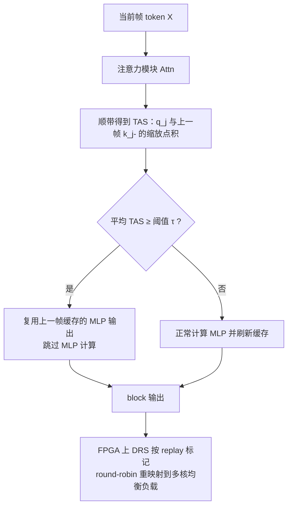

# FastCar: Cache Attentive Replay for Fast Auto-Regressive Video Generation on the Edge

**会议**: ICLR 2026  
**OpenReview**: [https://openreview.net/forum?id=9f3Nukn6BA](https://openreview.net/forum?id=9f3Nukn6BA)  
**代码**: [https://github.com/shawnricecake/fast-car](https://github.com/shawnricecake/fast-car)  
**领域**: 视频生成 / 自回归生成加速 / 软硬件协同  
**关键词**: 自回归视频生成, MLP 复用, 时间冗余, Temporal Attention Score, FPGA 加速器, 边缘推理  

## 一句话总结
针对自回归（AR）视频生成解码阶段被 MLP 模块主导、且相邻帧 MLP 输出高度相似的现象，FastCar 用「时间注意力分数（TAS）」判定何时直接复用上一帧缓存的 MLP 输出来跳过计算，并配套设计带动态资源调度的 FPGA 加速器，在边缘端实现 2.1× 以上的解码加速且画质几乎不掉。

## 研究背景与动机
**领域现状**：自回归框架从语言生成迁移到视觉生成后表现亮眼，逐 token 预测的图像 AR 模型在感知保真度上常常超过扩散模型，并被进一步推广到视频生成。但视频要生成时序连贯的多帧，token 数量远超图像（本文设置为 8 帧 × 256 token），解码开销巨大，难以部署到移动端、FPGA 这类对能效和内存有严格约束的边缘平台。

**现有痛点**：以往的高效化工作几乎都围绕「空间冗余」展开——稀疏注意力（SA）减少注意力计算、高效采样减少 token 数。但这些手段都假设瓶颈在注意力模块，这对扩散 Transformer 成立（所有 token 一次性迭代去噪，注意力是主瓶颈），对 AR 模型却不成立：**AR 逐 token 串行生成时注意力贡献很小，真正主导延迟的是 MLP 模块**。因此把优化精力放在注意力上对 AR 视频生成基本无效。

**核心矛盾**：视频天然带有「时间冗余」——相邻帧内容高度相似，但这一冗余在 AR 视频生成里几乎没被利用过。作者通过两项剖析锁定机会：(i) 解码阶段远比预填充阶段耗时，且其中 MLP 模块在各种序列长度下都稳定主导延迟；(ii) 对全部 32 个 MLP 模块测量发现，每个 MLP 的输出与最近一帧的余弦相似度很高，呈现强时间冗余。

**本文目标**：在不重训模型的前提下，利用时间冗余跳过大量 MLP 计算，实现边缘端 AR 视频生成的实质性加速，同时保住画质。

**核心 idea**：**用注意力里现成的 query/key 点积构造 TAS 作为「相似度信号」**，当某个 token 与上一帧对齐 token 的 TAS 超过阈值时，直接复用上一帧缓存的 MLP 输出（「缓存注意力回放」），跳过本帧该 token 的 MLP 计算；并用理论证明 TAS 能控制相邻帧 MLP 输出的差异上界，从而为「按 TAS 决定是否回放」提供数学依据。

## 方法详解

### 整体框架
把一段视频展平为长度 $n = T \cdot N$ 的 token 序列（$T$ 帧、每帧 $N$ 个 token），对齐关系满足 $(t-1, i) = (t, i) - N$，即当前帧 token 与上一帧同一空间位置 token 一一对应。每个 Transformer block 含一个注意力模块和一个 MLP 模块；FastCar 在每个 block 内插入「TAS 判定 → 回放或正常计算」的逻辑：注意力照常算（同时顺手得到 TAS），到 MLP 时先看 TAS，超阈值就复用上一帧缓存输出、否则正常算并更新缓存。配套的 FPGA 加速器再用动态资源调度（DRS）把「不同 batch 跳不跳 MLP」带来的负载不均摊平到多核上。

### 关键设计

**1. Temporal Attention Score（TAS）：零成本拿到的复用信号。** 方法的根基是给「该不该复用」找一个既便宜又可靠的判据。作者把 token $j=(t,i)$ 的 query 与其上一帧对齐 token $j^-=(t-1,i)$ 的 key 做缩放点积，定义时间注意力分数 $s_{t,i} = \frac{\langle q_j, k_{j^-}\rangle}{\sqrt{d}}$。关键在于：因果解码下这个点积本来就在注意力模块里算过，TAS 是「顺手」拿到的，**不引入任何额外计算**。多头时取各头均值 $\bar{s}_{t,i} = \frac{1}{h}\sum_{m=1}^h s^{(m)}_{t,i}$ 作为该 token 的最终判据。直观上，TAS 高意味着当前 token 在表征上与上一帧对齐 token 很「黏」，对应的 MLP 输出也该很接近。

**2. 缓存注意力回放（Cache Attentive Replay）：超阈值就直接搬上一帧。** 在每个 block，先把上一帧 token 的 MLP 输出缓存下来 $Y_{(t-1,i),:} = \mathrm{MLP}\big((\mathrm{Attn}(X)+X)_{(t-1,i),:}\big)$；当前帧逐 token 判定——若 $\bar{s}_{t,i} \ge \tau$ 则直接令 $Y_{(t,i),:} = Y_{(t-1,i),:}$（回放），否则正常算 MLP。即
$$Y_{(t,i),:} = \begin{cases} Y_{(t-1,i),:}, & \bar{s}_{t,i} \ge \tau \\ \mathrm{MLP}\big((\mathrm{Attn}(X)+X)_{(t,i),:}\big), & \text{otherwise} \end{cases}$$
阈值 $\tau$ 由人工设定，用来在「加速比」与「画质」之间权衡。由于 MLP 是延迟主导项，这种选择性跳过能直接把整体计算量砍下来——实验里 80% 回放比可省 45% 计算。

**3. TAS 控制 MLP 输出差异的理论保证：让回放有依据。** 作者用三步定理把「TAS 高」与「跳过安全」联系起来。先证注意力输出差异受 TAS 控制：在 query/key 归一化、投影矩阵有界等假设下，$\|\mathrm{Attn}(X)_{j,:} - \mathrm{Attn}(X)_{j^-,:}\|_2 \le C\big(\sqrt{1-s_{t,i}} + \gamma M\big)$，TAS 越大该差异越小。再由 MLP 的 Lipschitz 连续性，把 MLP 输出差异 bound 到「输入差异 + 注意力输出差异」之和。两步合并得到核心结论：$\|Y_{j,:} - Y_{j^-,:}\|_2 \le C\big(\|X_{j,:}-X_{j^-,:}\|_2 + \sqrt{1-s_{t,i}} + \gamma M\big)$，即高 TAS 加上输入相似就保证相邻帧 MLP 输出偏差小，从理论上为「按 TAS 阈值动态跳过」背书。作者还指出 TAS 只依赖当前层的局部 q/k、与模型深度无关，因此是个稳定、细粒度、可逐层就地复用的运行时信号（这也解释了为何「各层一致阈值」效果更好）。

**4. 动态资源调度 DRS：把回放造成的负载不均摊平到 FPGA 多核。** FastCar 是「数据相关」的——不同 batch 跳过的 MLP 数量在推理时才确定且难以预测，而多核加速器原本按 batch 静态映射到核，会造成各核负载严重不均；若把所有可能情形都预编译又会撑爆指令存储。DRS 的做法是：算完 TAS 后建一张片上映射表——用 32 位 Index Register 记录每个 batch 的状态（0=回放、1=计算），再用 32 个 Mapping Register（每个 $\log_2(\text{num cores})$ 位）决定 batch 由哪个核执行，并按 round-robin 把需要真正计算的 batch 均匀分到各核。预编译指令到达后，DRS 查 Index Register 决定是丢弃被回放 batch 的指令还是按 Mapping Register 派发到对应核，整个调度只花几百到几千周期，相对实际执行可忽略，从而把动态稀疏带来的不均衡转成了均衡利用。

## 实验关键数据

实验基于唯一可用的开源 AR 视频生成模型 VILA-U，生成 8 帧 256×256 视频（每帧 256 token），用 VBench 评质量、PSNR/SSIM/LPIPS 评相似度，A100 上跑生成、Xilinx Alveo U280 FPGA 上测延迟与能效。由于这是全新方向无直接 baseline，主要对比稀疏注意力方法 StreamingLLM。

### 主实验表格（vs 稀疏注意力，节选）

| 方法 | Replay/Local | PSNR↑ | SSIM↑ | LPIPS↓ | VBench Total↑ | 延迟(s)↓ | 能效↑ |
|------|------|------|------|------|------|------|------|
| Dense（基线） | — | — | — | — | 74.1% | 689.7 (1×) | 1.47 |
| Sparse Attn. | Local 256 | 18.25 | 51.54 | 33.59 | 72.1% | 670.5 (1.02×) | 1.51 |
| Sparse Attn. | Local 16 | 13.30 | 32.02 | 53.75 | 64.5% | 662.7 (1.04×) | 1.53 |
| **FastCar** | Replay 20% | 17.94 | 51.01 | 27.57 | 73.2% | 556.8 (1.24×) | 1.82 |
| **FastCar** | Replay 50% | 17.85 | 50.11 | 28.08 | 71.5% | 475.3 (1.45×) | 2.13 |
| **FastCar** | Replay 80% | 17.71 | 49.01 | 29.50 | 71.5% | 390.7 (1.76×) | 2.59 |

稀疏注意力几乎无法加速（只优化了非瓶颈的注意力），且收紧 local size 画质崩塌（LPIPS 飙到 50+）；FastCar 在 80% 回放下省 45% 计算、1.76× 加速、能效 2.59，画质却仅边际下降。

### 消融实验表格（与稀疏注意力组合，87% 回放）

| 方法 | Replay/Local | PSNR↑ | LPIPS↓ | VBench Total↑ | 延迟(s)↓ | 能效↑ |
|------|------|------|------|------|------|------|
| Dense | — | — | — | 74.1% | 689.7 (1×) | 1.47 |
| Ours+SA | 87% / 256 | 17.44 | 31.27 | 71.8% | 354.5 (1.95×) | 2.85 |
| Ours+SA | 87% / 16 | 17.27 | 32.37 | 71.6% | 324.3 (2.13×) | 3.12 |

FastCar 与稀疏注意力正交互补：组合后把稀疏注意力的画质从崩塌拉回 71%+，同时达到 2.1× 以上加速、能效 3.12，并缓解了稀疏注意力的「drifting」漂移问题。

### 关键发现
- **阈值要各层一致**：在相同总回放比下，逐层一致阈值比逐层不同阈值的 LPIPS 更低、VBench 更高，验证了 TAS 与深度无关的理论判断。
- **阈值鲁棒**：当 $\tau \le -2.5$ 时继续降低 $\tau$，画质不再下降但稀疏度/速度持续提升；$\tau \approx -8$ 时回放比高达 **87%**，意味着实际只有约 13% 的 MLP 模块是必需的。
- **回放分布有结构**：浅层和深层更倾向回放，中间层很少回放——说明中间层承担了捕捉时间动态、决定生成质量的关键作用。

## 亮点与洞察
- **找对瓶颈是最大贡献**：颠覆「注意力是瓶颈」的扩散式直觉，用剖析指出 AR 视频生成里 MLP 才是延迟主导项，把优化对象从注意力换到 MLP，这是整个方法成立的前提。
- **复用信号零成本**：TAS 复用因果解码本就算好的 q·k，不增加任何计算就拿到判据，工程上极其干净。
- **理论闭环**：三步定理把「TAS 高 → 注意力输出近 → MLP 输出近」串成可证的上界，让 training-free 的跳过不是拍脑袋而是有数学保证。
- **软硬件协同**：不止于算法，DRS 直面动态稀疏在多核硬件上的负载不均这一真实落地难题，给出可在边缘 FPGA 跑的完整方案。
- **正交互补**：FastCar 攻时间冗余、稀疏注意力攻空间冗余，二者叠加既加速又反而修复了稀疏注意力的漂移。

## 局限与展望
- **单一模型验证**：实验只在 VILA-U 上做，因为这是当时唯一开源的 AR 视频生成模型；方法在更大、更长视频的 AR 模型上的普适性尚待验证。
- **阈值需手工设定**：$\tau$ 目前靠人工调，缺乏按内容/场景自适应的机制，复杂剧烈运动场景下固定阈值可能过度回放。
- **分辨率与时长有限**：评测停在 8 帧 256×256，论文虽宣称利于高分辨率长视频，但更高分辨率、更长时序下漂移累积的实证还不充分。
- **理论假设偏理想**：定理依赖 q/k 严格归一化、投影矩阵有界等假设，与实际网络存在 gap，bound 中的 $\gamma M$ 偏移项在实践中的紧致程度未深究。

## 相关工作与启发
- **自回归视觉生成**：VAR 的 next-scale prediction、以及把 AR 框架推广到图像/视频生成的一系列工作，是 FastCar 的应用土壤。
- **高效化技术**：模型剪枝/量化攻参数冗余，稀疏注意力（StreamingLLM 等）与高效采样攻空间冗余——FastCar 补上了被忽视的「时间冗余」这一维，并能与它们叠加。
- **启发**：本文的范式价值在于「先剖析定位真瓶颈，再用现成信号 + 理论保证做 training-free 跳过，最后软硬件协同落地」。这套思路可迁移到其他 AR 生成任务（如音频、长序列），凡是相邻步输出高度相似的场景，都可考虑用「现成注意力分数当复用判据」来省算。

## 评分
- **新颖性**: ⭐⭐⭐⭐⭐ 首次系统利用 AR 视频生成的时间冗余，指出 MLP 才是瓶颈并给出 TAS 零成本判据 + 理论保证，方向新、切口准。
- **实验充分度**: ⭐⭐⭐⭐ 主实验/消融/与稀疏注意力组合/层级分布/真实 FPGA 能效都有覆盖；但受限于仅 VILA-U 一个模型、8 帧 256×256，规模与多样性略不足。
- **写作质量**: ⭐⭐⭐⭐ 逻辑清晰，「剖析→方法→理论→硬件→实验」环环相扣，公式与图表配合得当。
- **价值**: ⭐⭐⭐⭐⭐ 直击边缘端 AR 视频生成落地的真实痛点，2.1× 加速 + 能效翻倍 + 与现有方法正交，软硬件协同的完整性使其工程价值突出。

<!-- RELATED:START -->

## 相关论文

- [\[ICML 2026\] Quant VideoGen: Auto-Regressive Long Video Generation via 2-Bit KV-Cache Quantization](../../ICML2026/video_generation/quant_videogen_auto-regressive_long_video_generation_via_2-bit_kv-cache_quantiza.md)
- [\[CVPR 2026\] Towards Holistic Modeling for Video Frame Interpolation with Auto-regressive Diffusion Transformers](../../CVPR2026/video_generation/towards_holistic_modeling_for_video_frame_interpolation_with_auto-regressive_dif.md)
- [\[NeurIPS 2025\] MagCache: Fast Video Generation with Magnitude-Aware Cache](../../NeurIPS2025/video_generation/magcache_fast_video_generation_with_magnitudeaware_cache.md)
- [\[ICLR 2026\] Flow Caching for Autoregressive Video Generation](flow_caching_for_autoregressive_video_generation.md)
- [\[ICLR 2026\] MoGA: Mixture-of-Groups Attention for End-to-End Long Video Generation](moga_mixture-of-groups_attention_for_end-to-end_long_video_generation.md)

<!-- RELATED:END -->
