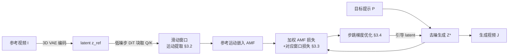

# FastVMT: Eliminating Redundancy in Video Motion Transfer

**会议**: ICLR 2026  
**OpenReview**: [https://openreview.net/forum?id=ILdBjlgibb](https://openreview.net/forum?id=ILdBjlgibb)  
**代码**: 待确认  
**领域**: 视频生成 / 运动迁移  
**关键词**: Video Motion Transfer, Diffusion Transformer, Training-Free, Attention Redundancy, Gradient Reuse  

## 一句话总结
通过识别并消除训练无关视频运动迁移流水线中的两类冗余——注意力的"运动冗余"与优化过程的"梯度冗余"，FastVMT 用滑动窗口运动提取 + 步跳梯度优化，在几乎不损失保真度与时序一致性的前提下实现平均 3.43× 加速（最高 14.91×）。

## 研究背景与动机
**领域现状**：视频运动迁移（video motion transfer）要在遵循文本提示生成内容的同时，把参考视频的运动模式（物体动作、相机轨迹）迁移到目标视频。近年方法普遍构建在 Diffusion Transformer（DiT）骨干之上。训练式方法（MotionDirector、DeT 等）用双路 LoRA 微调骨干来解耦运动与外观，但对每条新参考视频都要重新过拟合，单条视频在 A100 上耗时可达 2 小时，无法用于开放域和实时场景。训练无关（training-free）方法转而在推理时把参考视频反演（inversion）到 DiT 嵌入空间提取运动特征，再用源/目标运动嵌入间的梯度引导去噪，省去逐视频微调，把生成时间压到约 10 分钟。

**现有痛点**：即便是训练无关流水线，仍存在两处结构性低效。其一，运动嵌入提取阶段沿用全局 token 相似度——每个 token 都要和下一帧注意力图中所有 token 算相似度，开销巨大；其二，去噪阶段在每个内层优化步都重算全部梯度。已有加速工作只在算子层面优化，没有触及这些**结构性**的冗余来源。

**核心矛盾**：DiT 的通用注意力机制并不反映视频的物理先验——帧间运动幅度小且局部平滑，对应 token 只会出现在邻域而非全图；同样，去噪轨迹上的梯度变化缓慢，相邻优化步梯度高度相似。沿用"全算"的实现等于在已知冗余上反复浪费算力。

**本文目标**：在不增加训练、不牺牲视觉保真与时序一致性的前提下，系统性削减训练无关运动迁移的计算量。

**核心 idea**：**[运动冗余 → 局部窗口]** 把运动提取的注意力计算约束到时空局部窗口；**[梯度冗余 → 步跳复用]** 让梯度只在选定优化步重算、其余步复用最近一次缓存的梯度。

## 方法详解

### 整体框架
给定输入视频 $I=[I_1,\dots,I_n]$ 与目标内容提示 $P$，FastVMT 以 WAN-2.1 这类 DiT 视频生成模型为底座，分三段工作：**反演阶段**用滑动窗口从注意力中提取参考运动嵌入；**去噪阶段**计算对齐损失并用步跳梯度优化引导生成；其间用一个对应窗口损失约束时序一致性。三处设计分别对应"提运动更快""提运动更准""更新更省"。

### 关键设计

**1. 滑动窗口运动提取：用局部性把帧对匹配从 $O(F^2)$ 降到 $O(F)$。** 作者先指出运动信号天然藏在 DiT 自注意力的 query-key 交互里——跨帧相关内容会被注意力捕获。于是把参考 latent 在低去噪步（$t=0$）送入特定 DiT 块取出 Q、K，并将空间维度切成 $(t_h,t_w)$ 的 tile。对每个 tile 取中心代表 query，与目标帧所有 key 算一张代表性注意力图 $A^{rep}_{ij}=\mathrm{softmax}\big(Q^{(i)}_{rep}(K^{(j)})^T/\sqrt{D_h}\cdot\tau\big)$，再用它估计每个 tile 的窗口中心 $c^{(ij)}_{uv}=\sum_s A^{rep}_{ij}[s]\cdot\mathrm{pos}(s)$。基于"有限运动速度下最相关的 key 只在局部"这一观察，正式的 AMF 计算被同时约束在时间窗 $T_{window}(q_i)=\{q_j: j\in[i,\min(i+s_f,N)]\}$ 和空间窗 $S_{window}$ 之内，块级窗口中心由 $c^{(ij)}_{block}=P_{block}+\arg\max_{(h,w)}(Q^{(i)}_{rep}(K^{(j)})^T)_{h,w}$ 给出。这样时间复杂度从 $O(F^2)$ 降到 $O(F)$，空间上也只在局部窗口算最相关的 key。一个额外好处是：局部约束反而能纠正全局匹配时容易出现的错对应（如把狗鼻子错配到马路上），从而提升运动一致性。

**2. 对应窗口损失：让运动既对齐又时序稳定。** 仅提取窗口还不够，作者用两项损失约束生成。加权 AMF 损失对齐参考与生成视频的位移矩阵：$L_{AMF}=\frac{1}{|F|}\sum_{(i,j)\in F} w_{|j-i|}\cdot\|\Delta^{ref}_{ij}-\Delta^{gen}_{ij}\|_2^2$，其中权重按帧距线性衰减 $w_d=1.0-\alpha\frac{d-1}{s_f-1}$（$\alpha=0.2$），越近的帧对权重越高、贡献越大。对应窗口损失则惩罚相邻帧间窗口内 key 表示的不一致：$L_{window}=\frac{1}{F}\sum_i\frac{1}{P}\sum_p\frac{1}{N_i-1}\sum_t\|\bar K^{(p)}_{i\to j_{t+1}}-\bar K^{(p)}_{i\to j_t}\|_2^2$，把同一 tile 锚定不同目标帧时的平均 key 拉平滑。总损失 $L_{total}=\lambda_{AMF}L_{AMF}+\lambda_{window}L_{window}$（$\lambda_{AMF}=5$ 强调运动对齐，$\lambda_{window}=1$ 平衡时序）。消融显示去掉对应窗口损失会让运动保真度从 0.7471 跌到 0.5942，证明它是运动准确性的关键。

**3. 步跳梯度优化：把内层优化的梯度计算量缩到约 $1/\Delta$。** 作者用 PCA 分析发现，同一去噪时间步内、相邻内层优化步的梯度高度相似（"稳定梯度优化"现象），类比 DDPM→DDIM 把随机采样改为确定性采样的思路。于是引入固定间隔 $\Delta$ 的梯度复用：第 $j$ 步只有当 $j\bmod\Delta=0$（或处于完整 AMF 模式）时才真正反传计算梯度，否则直接复用最近一次缓存的梯度，$L_j=\nabla_x L_{total}(x_j)$ 仅在选定步触发、其余步用 $x_j\cdot g_{cached}$，缓存按 $g_{cached}=g_j\ (j\bmod\Delta=0)$ 更新。这把每次引导的梯度计算从 $J$ 次降到约 $\lceil J/\Delta\rceil$ 次。实测 1/2/3 步跳逐级提速（284.3s→186.7s→173.9s→160.6s），但 3 步跳时运动保真度明显塌陷（92.4→71.8），说明优化轨迹只在小间隔内保持相似——作者据此选取保守的跳步设置以守住质量。

## 实验关键数据

底座为开源 WAN-2.1，50 去噪步，输出 480×832、81 帧；前 20% 外层去噪步开启滑窗 AMF 引导，每步跑 10 步内层 latent 优化（AdamW，学习率 0.003→0.002 线性衰减），从第 15 个 DiT 块取 Q/K。评测用 DAVIS 选 50 条高质量视频，外加 40 条真实 + 40 条生成视频。

### 主实验表格

| 方法 | 类别 | Text Sim.↑ | Motion Fid.↑ | Temp. Cons.↑ | Time(s)↓ | Sub. Cons.↑ | Motion Smooth.↑ |
|------|------|-----------|-------------|-------------|---------|------------|----------------|
| MotionInversion | 训练式 | 0.2388 | 0.6515 | 0.9605 | 632.41 | 0.9339 | 0.9532 |
| MotionDirector | 训练式 | 0.2336 | 0.4524 | 0.9531 | 806.64 | 0.9173 | 0.9633 |
| DeT | 训练式 | 0.2187 | 0.6116 | 0.9818 | 2745.60 | 0.9787 | 0.9598 |
| MOFT | 训练无关 | 0.2297 | 0.6511 | 0.9797 | 595.81 | 0.9593 | 0.9716 |
| MotionClone | 训练无关 | 0.2304 | 0.7315 | 0.9722 | 397.05 | 0.9601 | 0.9616 |
| SMM | 训练无关 | 0.2374 | 0.7353 | 0.9366 | 809.70 | 0.8907 | 0.9702 |
| DiTFlow | 训练无关 | 0.2091 | 0.4062 | 0.9822 | 626.83 | 0.9557 | 0.9801 |
| **Ours** | 训练无关 | **0.2422** | **0.7471** | **0.9865** | **184.18** | **0.9809** | **0.9891** |

FastVMT 在所有指标上取得最佳或并列最佳，同时是最快的方法：相对 DiTFlow 约 3.4×、相对 SMM 约 4.4×、相对 DeT 约 14.9× 加速。

### 消融实验表格

| 配置 | Text Sim.↑ | Motion Fid.↑ | Temp. Cons.↑ | Time(s)↓ |
|------|-----------|-------------|-------------|---------|
| w/o 滑动窗口 | 0.2352 | 0.6912 | 0.9654 | 227 |
| w/o 对应窗口损失 | 0.2345 | 0.5942 | 0.9762 | 183 |
| w/o 步跳优化 | 0.2317 | 0.7044 | 0.9881 | 302 |
| **完整** | **0.2422** | **0.7471** | **0.9865** | **184** |

### 关键发现
- 去掉滑动窗口不仅运动保真度下降（0.7471→0.6912），时间反而从 184s 涨到 227s——局部约束既省算力又提质量。
- 对应窗口损失对运动保真度影响最大（0.7471→0.5942），却只带来 <1% 的时间开销，性价比极高。
- 步跳优化是主要的时间来源：去掉后时间从 184s 涨到 302s，而质量基本持平，验证了梯度复用的有效性。
- 注意力运动提取在 DiT 的中间层（第 15 块）最准确。

## 亮点与洞察
- **把"物理先验"翻译成"计算约束"**：帧间运动小且平滑 → 注意力局部窗口；去噪梯度变化慢 → 步跳复用。两类冗余都先用可视化（注意力对应、PCA）证实，再对症下药，论证链条干净。
- **加速不靠牺牲质量**：3.43× 近无损，14.91× 仍领先，说明削的是真冗余而非有效计算——这与单纯量化/蒸馏的"省算掉点"路线不同。
- **局部约束的意外收益**：滑动窗口本是为提速，却顺带修正了全局匹配的错对应，反而提升了运动一致性，是难得的"既快又好"。

## 局限与展望
- 步跳间隔存在硬上限：3 步跳时运动保真度从 92.4 崩到 71.8，说明梯度相似性只在小间隔内成立，跳步策略偏保守，自适应跳步仍有空间。
- 方法绑定具体底座（WAN-2.1）与特定 DiT 块（第 15 层）、特定超参（前 20% 步引导、$\lambda_{AMF}=5$），跨骨干/分辨率的鲁棒性未充分验证。
- 评测分辨率与帧数受基线限制（32 帧、830×480 对齐评测），更长视频、更剧烈/多主体交互运动下的极限尚未探明。
- 滑动窗口大小 $l$、时间跨度 $s_f$ 等需人工设定，对超快或大位移运动可能需要更大窗口，存在窗口与速度不匹配的失败风险。

## 相关工作与启发
- **训练式运动迁移**（MotionDirector、DreamMotion、DeT）：双路 LoRA 解耦运动与外观，质量高但逐视频微调昂贵、不可复用——FastVMT 正是为绕开这一代价走训练无关路线。
- **训练无关运动迁移**（DiTFlow、MOFT、MotionClone、SMM）：DiTFlow 提出注意力运动流（AMF）优化，FastVMT 直接在其基础上识别并消除冗余，是"对已有训练无关流水线做结构性提效"的范式。
- **确定性采样思想**（DDPM→DDIM）：步跳梯度复用借鉴了"相邻步高度相似可跳过"的直觉，把它从采样轨迹迁移到优化轨迹，是一个漂亮的跨场景类比。
- 对后续工作的启发：把"通用架构 vs 任务物理先验"的错配显式量化为冗余，再用轻量约束消除，是一条普适的训练无关提效思路，可推广到其他基于注意力引导的可控生成任务。

## 评分
- **新颖性**: ⭐⭐⭐⭐ — 不提新骨干，但"识别两类结构性冗余 + 局部窗口/步跳复用"的组合切口清晰，跨场景类比（DDIM→优化轨迹）有巧思。
- **实验充分度**: ⭐⭐⭐⭐ — 7 个基线、自动指标 + VBench + 用户研究、三模块消融齐全；但底座/分辨率较单一，长视频与极端运动覆盖有限。
- **写作质量**: ⭐⭐⭐⭐ — 动机—观察—方法—验证逻辑顺畅，公式与可视化（注意力对应、PCA、步跳轨迹）支撑充分，易读。
- **价值**: ⭐⭐⭐⭐ — 3.43× 近无损、14.91× 仍领先，直接降低训练无关运动迁移的落地门槛，对实时/开放域内容创作实用价值高。

<!-- RELATED:START -->

## 相关论文

- [\[ICLR 2026\] EffiVMT: Video Motion Transfer via Efficient Spatial-Temporal Decoupled Finetuning](effivmt_video_motion_transfer_via_efficient_spatial-temporal_decoupled_finetunin.md)
- [\[CVPR 2026\] FlowMotion: Training-Free Flow Guidance for Video Motion Transfer](../../CVPR2026/video_generation/flowmotion_training-free_flow_guidance_for_video_motion_transfer.md)
- [\[CVPR 2025\] DiTFlow: Video Motion Transfer with Diffusion Transformers](../../CVPR2025/video_generation/video_motion_transfer_with_diffusion_transformers.md)
- [\[ICCV 2025\] MotionShot: Adaptive Motion Transfer across Arbitrary Objects for Text-to-Video Generation](../../ICCV2025/video_generation/motionshot_adaptive_motion_transfer_across_arbitrary_objects_for_text-to-video_g.md)
- [\[NeurIPS 2025\] DisMo: Disentangled Motion Representations for Open-World Motion Transfer](../../NeurIPS2025/video_generation/dismo_disentangled_motion_representations_for_openworld_moti.md)

<!-- RELATED:END -->
