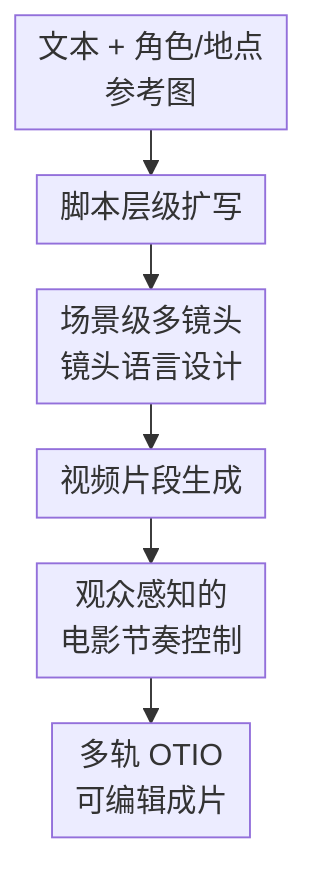

# FilMaster: Bridging Cinematic Principles and Generative AI for Automated Film Generation

**会议**: ICLR2026  
**OpenReview**: [https://openreview.net/forum?id=ovSDneawKY](https://openreview.net/forum?id=ovSDneawKY)  
**代码**: 无  
**领域**: 视频生成  
**关键词**: 自动电影生成, 视频生成, 电影语言, 场景级RAG, 视听节奏

## 一句话总结
FilMaster 是一个从文本和角色/场景参考图自动生成可编辑电影的端到端系统，它把真实电影中的镜头语言和专业后期流程显式引入生成管线，在 camera language 与 cinematic rhythm 两个维度上明显优于 Anim-Director、MovieAgent 和 LTX-Studio。

## 研究背景与动机
**领域现状**：视频生成模型已经能合成越来越高质量的画面，Sora、HunyuanVideo、WanVideo、Veo、Runway、MovieGen 等系统都把单段视频的视觉质量推到了很高水平。另一方面，LLM/MLLM 也开始被用于脚本扩写、分镜规划、多 agent 协作和自动电影制作，典型系统包括 Anim-Director、MovieAgent、FilmAgent 与商业化的 LTX-Studio。

**现有痛点**：这些系统的问题不只是“画面不够清晰”，而是更接近电影制作里的两个专业缺口。第一，镜头语言往往由 LLM 凭空想象，常见输出是静态机位、模板化视角，或者相邻镜头之间运动方式突变，导致同一个场景缺乏连贯的视觉叙事。第二，很多系统只是把生成片段拼起来，最多加一条简单旁白或音效，缺少剪辑节奏、声音层次和视听同步，因此成片看起来像素材串联，而不是有节奏的电影。

**核心矛盾**：自动视频生成与专业电影之间的差距，根本上来自“像素生成能力”和“电影原则执行能力”的脱节。视频模型可以根据 prompt 生成单个 clip，但它不知道一个场景中多个 shot 应该如何共同服务叙事目标；LLM 可以写分镜，但没有真实电影经验作为参照时，很容易产出泛化、平淡或不稳定的 camera plan。

**本文目标**：作者希望做一个 script-to-screen 的自动电影生成系统：输入一段文本，以及可选的角色和地点参考图，系统不仅要生成视频片段，还要规划镜头语言、完成粗剪/精剪、设计多轨音频，并输出能被专业剪辑软件继续编辑的结构化时间线。

**切入角度**：FilMaster 选择从电影工业的两个真实原则入手。镜头语言不是让 LLM 从零发明，而是从大量真实电影片段中检索并学习；电影节奏也不是简单拼接，而是模仿后期制作中的 Rough Cut、观众反馈、Fine Cut 和声音设计流程。

**核心 idea**：用“场景级真实电影参考检索”指导多镜头 camera planning，再用“模拟观众反馈驱动的后期协调”控制剪辑和多轨声音，从而把生成式 AI 的视频能力接到更接近专业电影生产的工作流上。

## 方法详解
FilMaster 的方法可以理解为两个阶段：Generation Stage 负责把输入文本和参考图转成原始视频片段，Coordination Stage 负责把这些片段剪成有节奏、带多层声音、可继续编辑的电影。它不是提出一个新的底层视频扩散模型，而是提出一个系统级生成框架：上游用 LLM/MLLM 做脚本、镜头和后期决策，下游调用视频生成、音频检索/生成和时间线封装工具。

### 整体框架
给定文本 $T$、角色参考图集合 $I_c$ 和地点参考图集合 $I_l$，系统先用 LLM 做粗到细的脚本扩写，把输入从 synopsis 逐步展开成 storyboard，再切分为带有时间、地点、角色、视觉元素和叙事目标的 scene。随后，FilMaster 对每个 scene 做场景级镜头语言设计，生成带 camera movement、shot type、angle 和 atmosphere 的 shot prompts，并调用视频模型生成 raw clips。最后，Coordination Stage 先拼出 Rough Cut，再用模拟目标观众的 MLLM 给出反馈，驱动 Fine Cut 的结构/时长调整和多轨声音设计，输出 OpenTimelineIO 格式的可编辑电影。

形式化地说，Generation Stage 记为 $G$，Coordination Stage 记为 $C$。系统先生成原始视频片段集合 $V_{clips}=G(T,I_c,I_l)$，再把这些片段协调成最终电影 $F_{film}=C(V_{clips})$。最终的 $F_{film}$ 不是单个压扁的视频文件，而是包含视频轨与多条音频轨的 OTIO timeline，这一点让它更接近实际后期制作资产。

### 关键设计
**1. 场景级多镜头镜头语言设计：用同一个叙事上下文规划整组 shot**

FilMaster 最关键的观察是：电影里的镜头语言通常服务于一个 scene，而不是孤立服务于单个 shot。一个场景内的多个镜头共享时间、地点、角色和叙事目标，如果每个 shot 独立检索参考片段，就容易出现第一个镜头 orbit、第二个镜头 pan、第三个镜头突然 close-up 的跳变，视觉上不连贯，叙事上也缺少共同方向。

因此作者提出 scene-level RAG。对一个场景 $S$，系统把原始 shot prompts $P$、时空上下文 $C$ 和叙事目标 $O$ 拼成统一查询：$q=E(S)=E((P,C,O))$。同一个 embedding model 也会把 44 万条真实电影片段文本描述 $D_{film}=\{d_i\}_{i=1}^{N}$ 编码成向量库 $V_{db}=\{v_i\mid v_i=E(d_i)\}$。检索时不是对每个 shot 分别找参考，而是用整个 scene 的 query 找 top-$K$ 语义相似电影片段，得到参考集合 $R=\{d_i\mid i\in I\}$。这些真实电影参考再和原始场景描述一起交给 LLM，生成整组带 camera language 的 $P_{camera}=\pi_{re-plan}(S,R)$。

这个设计的价值在于把“电影感”从泛泛的 prompt 形容词落到可参考的真实片段上，同时把规划粒度从 shot 提升到 scene。这样 LLM 不是独立地给每个镜头塞一个看起来高级的机位，而是在同一个 narrative objective 下协调 zoom in、close-up、pull back 等运动，让镜头之间形成递进关系。

**2. 观众感知的电影节奏控制：把后期制作拆成 Rough Cut、反馈和 Fine Cut**

FilMaster 的第二个核心点是把 cinematic rhythm 当成后期问题处理，而不是把视频片段直接拼接。系统先把生成好的 raw clips 和占位音频描述拼成 Rough Cut $T_{rough}$，再指定一个目标观众画像 $A_{target}$，例如“短剧观众”。LLM 会先借助搜索生成该人群的偏好画像 $P_{audience}$，随后 MLLM 以模拟观众身份观看 Rough Cut，给出关于 pacing、structure 和 audio 的 critiques $F_{critique}$。

这些 critique 还会被另一个 LLM 转成可执行建议 $R_{actions}$，覆盖结构组织、镜头时长、音频连贯性等维度。视频编辑模块据此在 rough video track 上执行 $O=\{rearrange, trim, accelerate\}$ 这类操作，得到 picture-locked 的 Fine Cut $V_{fine}$。作者在附录的鲁棒性实验里指出，如果把 review 和 correction 合成一个 MLLM 任务，模型容易被多目标任务压垮；如果去掉 audience perspective，系统又容易沿用“导演视角”认为粗剪已经足够好，缺少面向真实受众的修正动力。

**3. 多尺度视听同步：按 scene、shot、event 三个时间尺度设计声音**

多数自动电影系统的声音很薄，常见做法是加一条旁白或一类音效。FilMaster 把声音拆成 background ambiance、musical scoring、voice-over、foley 和 sound effects 五类，并按不同时间尺度生成或检索。背景氛围和配乐服务于 scene-level 的情绪与空间感；VO 对齐到 shot-level，帮助叙事信息跟画面同步；foley 和 SFX 则进入 intra-shot 级别，由 MLLM 分析具体秒级动作和环境事件，再匹配相应声音。

为了避免多轨音频堆在一起变乱，系统还使用一个包含 46,826 个声音资产的音频库做 RAG，其中包括 5,877 条 music tracks 和 40,949 条其他音频资产。生成或检索后的音轨会经过响度、频段和动态均衡处理，例如语音轨保持更高可懂度，背景轨降低响度并避开与人声冲突的频段。这个模块的重点不是“有声音”，而是让声音在正确时间尺度上贴合画面与叙事节奏。

**4. 可编辑结构化输出：把生成结果交回专业工作流**

FilMaster 不是只输出一个不可拆的视频，而是把成片封装成 OpenTimelineIO timeline，包含视频轨和多条音频轨。这个选择看似工程细节，但对“自动电影生成”很重要：专业创作往往不会接受一个完全黑盒、不能修改的结果，创作者需要能继续调整 shot 顺序、clip duration、音轨混音和素材结构。

因此，系统输出的可编辑性与前面的后期模拟逻辑是一体的。Rough Cut、Fine Cut、音轨分层和 OTIO 封装都让 FilMaster 更像一个自动化 assistant，而不是单次生成器。它把生成 AI 产物组织成可以被 DaVinci Resolve 等软件继续接管的生产资产，降低了从研究 demo 到真实制作流程之间的摩擦。

### 一个完整示例
论文用“小王子和白狐在太空旅途中遇到悲伤玫瑰”的输入展示流程。系统先把短文本扩写成多个 scene，其中一个 scene 是“小王子和白狐站在小行星上，周围星光闪烁，叙事目标是强调角色在宇宙背景下的渺小”。这时，scene-level RAG 不会只给某个 shot 找一个孤立参考，而是把这个场景的 prompt、时间地点、角色、视觉元素和 objective 合成查询，从真实电影库里检索类似的宇宙/孤独/奇幻镜头参考。

LLM 随后把这个场景重规划成更有电影语言的 shot prompt：镜头从广阔太空的 wide sweeping shot 开始，慢慢 zoom in 到小行星，再环绕捕捉小王子的惊奇表情。视频模型根据这些 prompt 和参考图生成片段。进入后期后，模拟短剧观众会指出开场如果过慢会削弱吸引力，于是 Fine Cut 把该片段放到开头并加速到约 3 秒，用更快节奏建立角色和空间。声音设计则为同一片段添加星空中的 gentle whooshing、远处闪烁声、旁白、背景氛围和柔和配乐，形成五轨音频。

这个例子说明 FilMaster 的各模块不是并列堆砌：scene-level RAG 决定“怎么看”，视频生成模型决定“画面怎么出来”，audience-aware editing 决定“什么时候看、看多久”，多轨 sound design 决定“听到什么、何时同步”。最终成片的电影感来自这些决策的耦合，而不是某一个模型单独变强。

### 损失函数 / 训练策略
这篇论文没有训练新的端到端视频生成模型，也没有提出一个需要反向传播优化的 loss。系统主要通过模块化调用现有模型与工具实现：GPT-4o 用于脚本生成、RAG、视频编辑和部分声音设计；Gemini-2.0-Flash 用于 audience-aware review 以及 foley/SFX 相关设计；Kling Elements 1.6 作为视频生成模型；text-embed-3-small 作为文本 embedding 模型，检索 top-$K$ 时设置 $K=3$。

从“策略”角度看，训练替代为明确的过程约束：脚本扩写采用 synopsis、simplified storyboard、detailed storyboard、scene 的粗到细链式流程；镜头设计采用 scene-level query + real film reference；后期阶段把视觉感知与推理编辑拆开，先由 MLLM 生成视频文本 caption，再让 LLM 基于 caption、脚本和占位声音描述做更复杂的编辑决策。附录显示，这种多模态信息解耦能显著提升后期修正的成功率。

## 实验关键数据

### 主实验
论文构建了 FilmEval，用 6 个高层维度评估自动电影生成：Narrative and Script、Audiovisuals and Techniques、Aesthetics and Expression、Rhythm and Flow、Emotional and Engagement、Overall Experience，并进一步拆成 12 个细则。Camera Language (CL) 和 Cinematic Rhythm (CRh) 是从这些维度组合得到的派生指标。

| 方法 | CL ↑ | CRh ↑ | 说明 |
|------|------|-------|------|
| Anim-Director | 2.96 | 1.94 | 有脚本设计，但缺少镜头语言与音频 |
| Anim-Director† | 3.02 | 2.38 | 换用同一视频模型后仍缺少后期节奏 |
| MovieAgent | 2.74 | 1.74 | 多 agent 规划，但 camera 与 audio 较模板化 |
| MovieAgent† | 2.55 | 1.98 | 同视频模型下仍明显低于本文 |
| LTX-Studio* | 3.74 | 3.62 | 商业系统，画面较强但节奏和同步有限 |
| FilMaster† | 4.50 | 4.32 | 本文方法，两个核心维度均最高 |

| 方法 | NS ↑ | AT ↑ | AE ↑ | RF ↑ | EE ↑ | OE ↑ | CL ↑ | CRh ↑ | Avg ↑ |
|------|------|------|------|------|------|------|------|-------|-------|
| Anim-Director | 1.94 | 2.16 | 1.94 | 2.12 | 2.12 | 2.36 | 2.15 | 2.04 | 2.11 |
| Anim-Director† | 1.94 | 2.35 | 1.44 | 1.94 | 1.84 | 2.20 | 2.16 | 1.85 | 1.95 |
| MovieAgent | 1.57 | 1.63 | 1.70 | 1.70 | 2.20 | 2.27 | 1.66 | 1.83 | 1.84 |
| MovieAgent† | 1.32 | 2.38 | 1.68 | 2.02 | 1.96 | 1.92 | 2.01 | 1.89 | 1.88 |
| LTX-Studio* | 2.28 | 3.04 | 3.22 | 2.90 | 3.16 | 2.96 | 2.80 | 3.05 | 2.92 |
| FilMaster† | 3.70 | 3.80 | 3.80 | 3.73 | 3.93 | 3.87 | 3.76 | 3.82 | 3.79 |

自动评测里，FilMaster 的 CL 达到 4.50、CRh 达到 4.32；用户研究中，FilMaster 平均分 3.79，显著高于 LTX-Studio 的 2.92，也高于所有开源 baseline。论文报告的人类评分提升为 camera language 平均提升 74.17%，cinematic rhythm 平均提升 79.26%。

### 消融实验
| 配置 | Avg ↑ | 说明 |
|------|-------|------|
| w/o Camera + Rhythm | 3.75 | 去掉镜头语言设计和电影节奏控制，只保留更基础的生成流程 |
| w/o Rhythm | 4.17 | 保留 camera language，但不使用观众感知的后期节奏控制 |
| Ours | 4.67 | 完整系统，同时使用场景级镜头设计和电影节奏控制 |

| 配置 | Corrected Ratio ↑ | Success Ratio ↑ | 说明 |
|------|-------------------|-----------------|------|
| Analysis and Correct | 60% | 50% | 一个模型同时分析和修正，任务过重 |
| w/o Audience Perspective | 50% | 50% | 去掉观众视角后，系统较少主动修正粗剪 |
| Ours (Full System) | 100% | 100% | 分离 review/edit，并引入目标观众反馈 |
| Directly addressing multimodal info | 100% | 0% | 直接处理多模态信息会产生不可靠修正 |
| Ours (Separating multimodal info) | 100% | 90% | 先视觉 caption，再文本推理，后期决策更稳 |

### 关键发现
- 场景级 RAG 的作用主要体现在镜头连贯性上。图 5 的定性消融显示，scene-level 方案会形成 zoom in、close-up、pull back 这类相互配合的运动链，而 shot-level RAG 会产生 orbit、pan across 等互不协调的跳变。
- 电影节奏模块对总体评分贡献很大。只去掉 Rhythm 时 Avg 从 4.67 降到 4.17，说明即使生成内容相似，剪辑时长、结构顺序和声音同步也会显著改变观感。
- 观众视角不是装饰性 prompt。去掉 audience perspective 后 corrected ratio 只有 50%，说明系统容易从“导演/生成者视角”认为现有粗剪已经合理，而目标观众反馈能迫使它按受众偏好调整节奏。
- 多模态解耦是后期阶段的关键工程选择。直接让 MLLM 同时处理视频、音频、文本会出现 0% success ratio；先把视频转成文字 caption，再由 LLM 做编辑推理，成功率升到 90%。

## 亮点与洞察
- FilMaster 把电影原则显式变成系统模块，而不是只在 prompt 里写“cinematic”。这一点很有价值，因为 camera language 和 rhythm 都有可检查的中间产物：检索参考、shot re-plan、Rough Cut feedback、Fine Cut decision、多轨音频 timeline。
- 场景级 RAG 的粒度选择很聪明。它既比整部电影检索更局部、更容易匹配，又比 shot-level 检索更能保留同一场景内的时空与叙事一致性，适合迁移到广告、短剧、故事板生成和游戏 cutscene 规划。
- 论文把“自动生成”与“可编辑输出”放在一起考虑。OTIO timeline 让生成系统的结果可以进入真实剪辑软件，这比只追求最终 demo 视频更接近生产流程。
- FilmEval 也有启发意义。现有视频生成指标大多评估画质、物理一致性或文本对齐，而自动电影需要评价叙事、节奏、情绪、视听同步和整体体验；这个 benchmark 体现了任务定义正在从 clip generation 向 film production 扩展。

## 局限与展望
- 系统依赖强商业模型和闭源组件，包括 GPT-4o、Gemini、Kling Elements 1.6 和 ElevenLabs，这会影响复现成本，也让不同实验环境下的结果不容易完全对齐。
- 真实电影参考库来自商业电影短片段，论文说明数据仅用于学术研究且不会公开。这样能理解，但也限制了外部研究者复现实验、验证检索库质量或分析潜在版权/偏见问题。
- FilmEval 虽然比传统视频指标更贴近电影任务，但自动评测仍由 Gemini-1.5-Flash 承担，可能继承 MLLM 的审美偏差、语言偏差和对电影专业性的理解边界。
- 系统级方法的消融主要围绕少量案例和模块开关展开，仍需要更大规模、多类型题材、不同文化语境和更长视频长度上的验证。尤其当电影长度从几十秒扩展到数分钟甚至更长时，角色一致性、剧情伏笔、节奏曲线和声音主题的长期一致性会更难。
- 后续可以把 scene-level RAG 扩展成可控的风格库或导演风格库，让创作者指定“希区柯克式悬疑”“纪录片手持感”“短剧强钩子”等目标风格，同时提供可解释的参考来源与可编辑参数。

## 相关工作与启发
- **vs Anim-Director**: Anim-Director 侧重用大多模态模型扩写输入并生成动画视频，但缺少真实电影参考驱动的镜头语言，也没有完整的多轨后期节奏控制。FilMaster 的优势在于把 camera planning 和 post-production 都作为核心模块处理。
- **vs MovieAgent**: MovieAgent 通过多 agent CoT 做电影生成规划，能自动组织场景和 camera settings，但镜头语言仍容易模板化，声音通常较单薄。FilMaster 用 scene-level RAG 让镜头规划有真实电影样本支撑，并用 audience-aware Fine Cut 修正节奏。
- **vs LTX-Studio**: LTX-Studio 是商业自动创作平台，支持可编辑输出，但论文指出其 camera movement 和 audio design 仍有限，尤其叙事节奏可能慢且重复。FilMaster 在可编辑性之外进一步强调多轨声音、受众反馈和视听同步。
- **vs 传统 virtual cinematography**: 传统虚拟摄影多在 3D 环境中优化 camera placement 或 camera control，适合明确几何场景。FilMaster 不直接求解几何机位，而是从真实电影文本描述中检索 cinematography patterns，再交给 LLM 规划生成视频的 shot prompt，更贴合当前文本/图像条件的视频生成生态。

## 评分
- 新颖性: ⭐⭐⭐⭐⭐ 不是单点模型改进，而是把真实电影参考、场景级 RAG、模拟观众后期和可编辑时间线整合成一个清晰的自动电影生成框架。
- 实验充分度: ⭐⭐⭐⭐☆ 有自动评测、用户研究、定性比较和多组鲁棒性消融，但受限于测试案例数量、闭源模型和非公开电影/音频库。
- 写作质量: ⭐⭐⭐⭐☆ 主线很清楚，图 3 把系统流程解释得直观；不足是系统组件多，部分实现细节分散在附录，复现者需要来回查找。
- 价值: ⭐⭐⭐⭐⭐ 对自动视频生成很有启发，因为它把问题从“生成一个 clip”推进到“生成一条可剪辑、可听、节奏合理的电影时间线”。

<!-- RELATED:START -->

## 相关论文

- [\[ICLR 2026\] Anchor Frame Bridging for Coherent First-Last Frame Video Generation](anchor_frame_bridging_for_coherent_first-last_frame_video_generation.md)
- [\[CVPR 2026\] STAGE: Storyboard-Anchored Generation for Cinematic Multi-shot Narrative](../../CVPR2026/video_generation/stage_storyboard-anchored_generation_for_cinematic_multi-shot_narrative.md)
- [\[AAAI 2026\] GenVidBench: A 6-Million Benchmark for AI-Generated Video Detection](../../AAAI2026/video_generation/genvidbench_a_6-million_benchmark_for_ai-generated_video_detection.md)
- [\[CVPR 2026\] CineScene: Implicit 3D as Effective Scene Representation for Cinematic Video Generation](../../CVPR2026/video_generation/cinescene_implicit_3d_as_effective_scene_representation_for_cinematic_video_gene.md)
- [\[CVPR 2026\] HoloCine: Holistic Generation of Cinematic Multi-Shot Long Video Narratives](../../CVPR2026/video_generation/holocine_holistic_generation_of_cinematic_multi-shot_long_video_narratives.md)

<!-- RELATED:END -->
