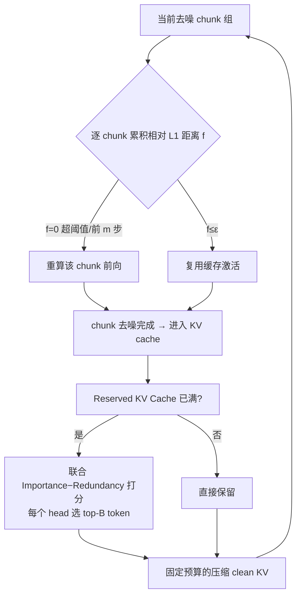

# Flow Caching for Autoregressive Video Generation

**会议**: ICLR 2026  
**OpenReview**: [https://openreview.net/forum?id=vko4DuhKbh](https://openreview.net/forum?id=vko4DuhKbh)  
**代码**: [https://github.com/mikeallen39/FlowCache](https://github.com/mikeallen39/FlowCache)  
**领域**: 视频生成 / 推理加速  
**关键词**: 自回归视频生成, 特征缓存, KV Cache 压缩, Diffusion Transformer, 训练无关加速  

## 一句话总结
FlowCache 指出自回归视频生成中不同 chunk 在同一时间步处于异质去噪状态，因此放弃"全帧统一缓存"，改为给每个 chunk 配独立的逐块自适应缓存策略，并配套一个联合重要性—冗余的 KV cache 压缩，在 MAGI-1 和 SkyReels-V2 上分别取得 2.38× / 6.7× 提速且画质几乎无损。

## 研究背景与动机
- **领域现状**：自回归视频模型（MAGI-1、SkyReels-V2）把超长视频切成固定帧数的 chunk，对每个 chunk 做 Causal Diffusion-Forcing 式去噪，把长视频推理的复杂度从二次降到线性，被视为实时超长视频生成的可行路径。但高分辨率下仍极慢——MAGI-1-4.5B-distill 在 A800 上生成 10 秒 720×720 视频要约 32GB 显存、50 分钟。
- **现有痛点**：训练无关的特征缓存（TeaCache、ToCa、DiCache 等）能加速传统 DiT 扩散，但它们都默认"同一时间步所有帧去噪程度一致"，因此对所有内容用同一套 reuse/recompute 决策。这一假设在自回归模型里直接失效。
- **核心矛盾**：作者实测 MAGI-1 / SkyReels-V2 的相邻时间步相对 L1 距离，发现三条规律——(i) 越接近干净视频，相邻步相似度越差（去噪后期不能复用）；(ii) **同一时间步不同 chunk 处于不同去噪阶段，相似度差异巨大**；(iii) 模型输入与采样输出全程高度相似。统一缓存无法兼顾"已接近干净、必须重算的 chunk"和"还在噪声阶段、可大胆复用的 chunk"。
- **本文目标**：设计首个面向自回归视频生成的缓存框架，让每个 chunk 拥有独立缓存策略，同时控制随生成增长的 KV cache 显存。
- **核心 idea**：**[逐块独立缓存]** 把视频 chunk 类比成 LLM 的 token，按各自的相对 L1 距离轨迹独立决定算/复用；**[联合重要性—冗余的 KV 压缩]** 在固定显存预算下既保留对当前去噪重要、又彼此不冗余的历史 token。

## 方法详解

### 整体框架
FlowCache 是训练无关的两件套：去噪侧用 **chunkwise 自适应缓存** 替代统一缓存，逐 chunk 累积相对 L1 距离决定该步重算还是复用；显存侧用 **联合重要性—冗余的 KV cache 压缩** 把已完成去噪的 clean chunk 压进固定预算的缓存区，维持长程时序一致性。前者由 Theorem 1 + Corollary 1 在理论上证明"必须按 chunk 分开缓存"，后者解决自回归生成中 KV cache 随 chunk 数线性膨胀的显存问题。

### 关键设计

**1. 逐块相对 L1 距离与单调性定理：为什么必须分 chunk 缓存。** 在自回归设定下，第 $i$ 个 chunk 在时间步 $t$ 的相对 L1 距离可写成更新量的归一化形式 $L1_{rel}(X,t,i)=\frac{\lVert X^i_{t-1}-X^i_t\rVert_1}{\lVert X^i_t\rVert_1}=\frac{\lVert v_\theta(X^i_t,t,c)\cdot\Delta t\rVert_1}{\lVert X^i_t\rVert_1}$。作者证明的 Theorem 1 指出：当模型收敛到流匹配最优速度场、调度函数取幂律 $\sigma(t)=(t/T)^p$ 时，$L1_{rel}$ 随去噪推进单调增大——即 chunk 越接近真实视频，相邻步越不相似、越不该复用。Corollary 1 进一步说明，只要不同 chunk 内容异质（状态范数 $\lVert X^i_t\rVert_1\neq\lVert X^j_t\rVert_1$）而更新幅度近似相同，则同一 $t$ 下它们的 $L1_{rel}$ 必然不等。这就把"统一缓存不合理"从经验观察上升为理论结论，奠定了逐块独立策略的必要性。

**2. Chunkwise 自适应缓存决策。** 对每个 chunk 维护一个递归累积量 $f(X,t,i)$ 来决定算还是复用：前 $m$ 个时间步强制重算（$f=0$），其余时间步若 $f(X,t+1,i)+L1_{rel}(X,t,i)>\epsilon$ 则触发重算并清零，否则继续累加并复用缓存激活。直觉是把"自上次重算以来累积的变化量"和阈值 $\epsilon$ 比较——靠近高斯噪声的 chunk 变化慢，可连续复用多步；靠近干净视频的 chunk 变化快，频繁触发重算。$m$（MAGI-1 取 5、SkyReels-V2 取 4）保护去噪早期质量，$\epsilon$ 区分 slow/fast 档位（如 MAGI-slow 0.01、MAGI-fast 0.015、SkyReels-slow 0.1、fast 0.15）。每个 chunk 的轨迹独立，这正是相对 TeaCache 等统一策略能同时提速又保质的关键。

**3. 联合重要性—冗余的 KV cache 压缩。** 自回归视频里已去噪完成的 clean chunk 全部进 KV cache 供后续 chunk 注意，显存随生成线性膨胀。LLM 里只按重要性（注意力分数）选 top token 在视频上失效——视频时空高度冗余，高分 token 往往彼此几乎相同，导致缓存被冗余内容塞满、丢失多样历史。FlowCache 把固定缓冲 $B_{total}$ 切成压缩 clean 区 $B_{budget}$ 和当前去噪区 $B_{active}$，满了就合并新完成的 chunk 再压缩。打分同时考虑两项：重要性 $\widetilde{Imp}^{(h)}$ 由当前去噪 query 对 clean key 的注意力 softmax、跨 query 平均再做 1D max-pooling 得到；冗余性 $Red^{(h)}_j=\mathrm{softmax}\big(\frac1{L_k}\sum_i S^{(h)}_{ij}\big)$ 由 $\ell_2$ 归一化 key 的余弦相似度（对角置零）跨 token 平均得到。最终每个 head 的选择分数 $Score^{(h)}_j=\lambda\cdot\widetilde{Imp}^{(h)}_j-(1-\lambda)\cdot Red^{(h)}_j$，每个 head 取 top-B token 保留。这样在固定预算内既留对当前去噪相关、又彼此不冗余的历史，保住长程时序一致性。

## 实验关键数据

### 主实验表格（推理效率与画质，A800）

| Model | Method | PFLOPs↓ | Speedup↑ | Latency(s)↓ | VBench↑ | LPIPS↓ | SSIM↑ | PSNR↑ |
|---|---|---|---|---|---|---|---|---|
| MAGI-1 | Vanilla | 306 | 1× | 2873 | 77.06 | - | - | - |
| | TeaCache-fast | 225 | 1.44× | 1998 | 70.11 | 0.816 | 0.114 | 8.94 |
| | **FlowCache-slow** | 161 | 1.86× | 1546 | **78.96** | 0.316 | 0.650 | 22.34 |
| | **FlowCache-fast** | 140 | **2.38×** | 1209 | 77.93 | 0.431 | 0.514 | 19.27 |
| SkyReels-V2 | Vanilla | 113 | 1× | 1540 | 83.84 | - | - | - |
| | TeaCache-fast | 49 | 2.2× | 686 | 80.06 | 0.306 | 0.612 | 18.39 |
| | **FlowCache-slow** | 36 | 5.88× | 262 | 83.12 | 0.123 | 0.789 | 23.74 |
| | **FlowCache-fast** | 28 | **6.7×** | 230 | 83.05 | 0.147 | 0.764 | 22.95 |

### 消融实验表格（fast 档，拆 reuse 策略 vs KV 压缩）

| Model | Reuse Strategy | KV Compression | VBench↑ | LPIPS↓ | SSIM↑ | PSNR↑ |
|---|---|---|---|---|---|---|
| MAGI-1 | TeaCache | - | 70.11 | 0.816 | 0.114 | 8.94 |
| | ChunkWise | - | 77.66 | 0.421 | 0.523 | 19.89 |
| | ChunkWise | Enabled | 77.93 | 0.431 | 0.514 | 19.27 |
| SkyReels-V2 | TeaCache | - | 80.06 | 0.306 | 0.612 | 18.39 |
| | ChunkWise | - | 83.12 | 0.123 | 0.789 | 23.74 |
| | ChunkWise | Enabled | 83.01 | 0.157 | 0.743 | 22.61 |

### 关键发现
- **逐块缓存是质量主因**：在 MAGI-1 上 TeaCache-fast 把 VBench 从 77.50 砸到 70.11，而 chunkwise reuse 几乎维持原始水平（77.66），证明统一缓存正是自回归场景画质崩坏的根源。
- **KV 压缩几乎零损**：开启 KV cache 压缩后 VBench 仅微动（MAGI-1 77.66→77.93，SkyReels-V2 83.12→83.01），说明联合重要性—冗余筛选能在固定显存下保住质量。
- **越复杂的自回归结构收益越大**：SkyReels-V2（chunk 内再分 block、块间非均匀去噪）异质性更强，FlowCache 提速到 6.7× 仍优于 TeaCache 2.2×，印证"异质性越强，逐块缓存优势越明显"。

## 亮点与洞察
- 把"统一缓存为何在自回归视频上失效"从经验观察提升为理论结论（Theorem 1 单调性 + Corollary 1 跨 chunk 不等），让逐块独立缓存有了可证依据。
- 视角迁移巧妙：把 video chunk 类比 LLM token，从而既能借鉴 LLM 的 KV cache 压缩思路，又点明视频时空冗余使"纯重要性"选择失效，引出重要性—冗余联合打分。
- 训练无关、可直接挂载到已有自回归视频模型，slow/fast 双档让用户在质量与速度间灵活取舍。

## 局限与展望
- 阈值 $\epsilon$、保护步数 $m$、混合系数 $\lambda$ 等需按模型手工调（不同模型/档位取值差异大），缺乏自适应设定。
- Theorem 1 依赖"模型已收敛到最优速度场 + 幂律调度"等理想假设，实际蒸馏/非标准采样器下的严格性待验证。
- 仅在 MAGI-1、SkyReels-V2 两个模型上评估，对更多自回归范式（不同窗口/块划分）的普适性还需更广验证；KV 压缩对超长（数分钟级）视频的累积误差未深入分析。

## 相关工作与启发
- **特征缓存**：TeaCache（时间步嵌入调制 + 多项式拟合估计输出差）、ToCa（token 级冗余/误差敏感度）、DiCache（浅层 probe 在线估计输出变化）——均假设全帧同步去噪，本文证明其在自回归下的失配。
- **KV cache 压缩**：H2O（heavy-hitter 高累计注意力 token）、SnapKV（prompt 末尾观测窗预选）、D2O（跨层动态分配 + 补偿）面向 LLM；R-KV 在推理模型里联合重要性与冗余，是本文 KV 压缩打分的直接灵感来源。
- 启发：当一个统一加速假设迁移到新范式时，先实测分布差异（这里是逐 chunk 的相对 L1 轨迹），往往能找到"按单元解耦策略"的突破口；同时同一加速技术（缓存/KV 压缩）在不同模态下的失效模式各异，需结合模态特性（视频的时空冗余）重设计准则。

## 评分
- **新颖性**: ⭐⭐⭐⭐ 首个面向自回归视频生成的缓存框架，逐块独立缓存 + 理论单调性证明是清晰且站得住的新切入点。
- **实验充分度**: ⭐⭐⭐⭐ 两个代表性自回归模型、slow/fast 双档、FLOPs/延迟/VBench/LPIPS/SSIM/PSNR 全覆盖，并拆分两组件消融；模型多样性可再扩。
- **写作质量**: ⭐⭐⭐⭐ 动机—观察—理论—方法链条连贯，图 2/图 3 把异质性与策略对比讲得直观。
- **价值**: ⭐⭐⭐⭐ 训练无关、即插即用，6.7× 提速且画质几乎无损，对实时超长视频生成落地有实际意义。

<!-- RELATED:START -->

## 相关论文

- [\[ICLR 2026\] BWCache: Accelerating Video Diffusion Transformers through Block-Wise Caching](bwcache_accelerating_video_diffusion_transformers_through_block-wise_caching.md)
- [\[ICLR 2026\] PreciseCache: Precise Feature Caching for Efficient and High-fidelity Video Generation](precisecache_precise_feature_caching_for_efficient_and_high-fidelity_video_gener.md)
- [\[CVPR 2026\] Accelerating Diffusion-based Video Editing via Heterogeneous Caching: Beyond Full Computing at Sampled Denoising Timestep](../../CVPR2026/video_generation/accelerating_diffusion-based_video_editing_via_heterogeneous_caching_beyond_full.md)
- [\[ICLR 2026\] Streaming Autoregressive Video Generation via Diagonal Distillation](streaming_autoregressive_video_generation_via_diagonal_distillation.md)
- [\[ICLR 2026\] Lumos-1: On Autoregressive Video Generation with Discrete Diffusion from a Unified Model Perspective](lumos-1_on_autoregressive_video_generation_with_discrete_diffusion_from_a_unifie.md)

<!-- RELATED:END -->
