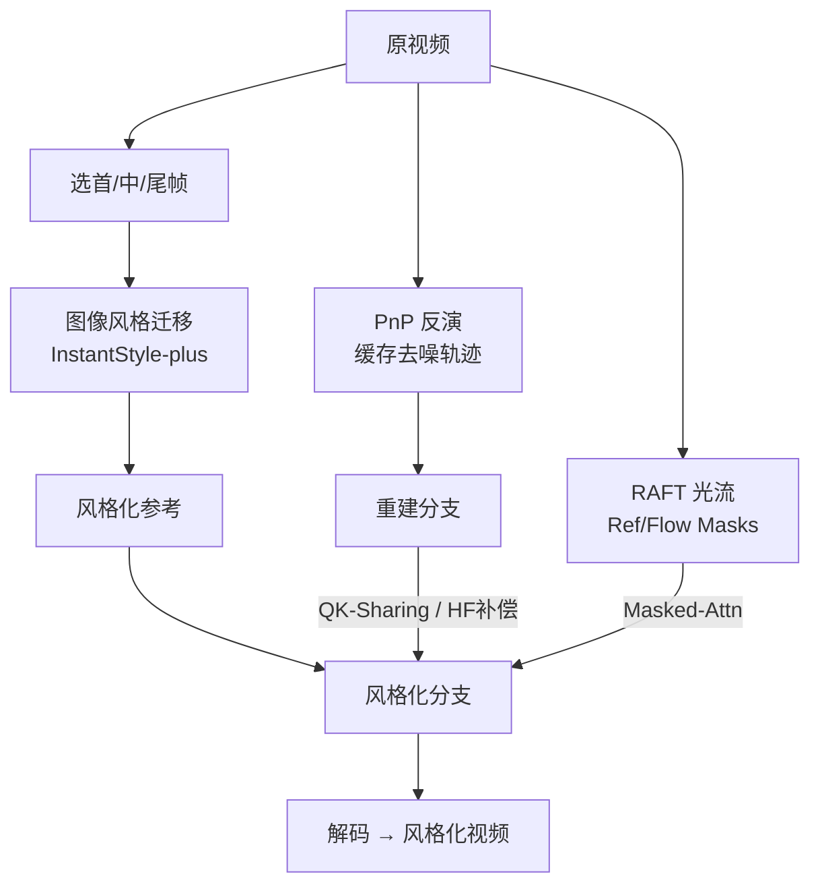

# FreeViS: Training-free Video Stylization with Inconsistent References

**会议**: ICLR 2026  
**OpenReview**: [https://openreview.net/forum?id=SiYNm21ifi](https://openreview.net/forum?id=SiYNm21ifi)  
**项目主页**: [https://xujiacong.github.io/FreeViS/](https://xujiacong.github.io/FreeViS/)  
**领域**: 视频生成 / 视频风格化  
**关键词**: 视频风格化, 训练无关, 扩散反演, I2V 模型, 多参考帧, 光流引导  

## 一句话总结
FreeViS 把多张「彼此不一致」的风格化参考帧塞进预训练 I2V 扩散模型，用隔离注意力 + 高频补偿 + 光流引导三件套，在完全无需训练的条件下解决了单参考帧方法的风格传播误差，做出风格细节丰富又时序连贯的视频风格化。

## 研究背景与动机
- **领域现状**：图像风格迁移已经很成熟，但视频风格化严重落后。逐帧套用图像风格化会带来剧烈闪烁、时序不一致；专门训练视频风格化模型又需要成对的「原视频—风格视频」数据，几乎拿不到，且 DiT 全量微调代价巨大。
- **现有痛点**：参考式编辑方法（如 AnyV2V）先把首帧风格化，再用预训练 I2V 模型把首帧「传播」到后续帧。但 I2V 模型训练时没见过风格化帧，首帧属于分布外输入，无法正确解析并传播风格图案——当后续内容与首帧差异大时，风格传不过去，产生明显的**传播误差**（propagation error）。
- **核心矛盾**：单参考帧信息不足以覆盖整段视频，但**朴素地拼接多个参考帧**到 noise latent 上又会引发严重的闪烁和卡顿（stutter），因为额外参考是独立编码的、缺乏与主视频共享的动态信息。
- **本文目标**：在**完全无需训练**（仅靠扩散反演）的前提下，引入跨整段视频的多参考帧，既消除传播误差，又不引入闪烁卡顿，做到高保真风格 + 强时序一致。
- **核心 idea**：**多个不一致参考 + 隔离注意力 + 频域解耦**。一方面观测到 I2V latent 中 LF 控外观/颜色、HF 控布局/运动，于是只回注 HF 差异来约束结构而不污染风格颜色；另一方面把「外观」和「动态」从参考与重建的 value 中解耦，只给静态参考注入共享动态，从而让多张不一致参考能协同工作。

## 方法详解

### 整体框架
FreeViS 以预训练 I2V 扩散模型为骨干，给定风格图后先用图像风格迁移模型把若干选定内容帧（首/中/尾）风格化，得到一组**彼此不一致**的参考帧。整个 pipeline 走双分支：**重建分支**（reconstruction）和**风格化分支**（stylization），二者共享反演得到的去噪轨迹与初始噪声。重建分支在每个 DiT block 把 query/key/value 传给风格化分支；每步去噪后把目标 latent 与重建 latent 之差的高频分量加到风格化 latent 上，并把动态线索注入到额外参考的 value 矩阵中。

### 关键设计

**1. 间接高频补偿（IHC）：只纠结构、不动颜色。** PnP 反演会把目标 latent 与重建 latent 的差直接补到两条分支，能近乎精确重建，但这种强校正会把风格化 latent 的信息整体拉回原始内容，导致颜色从风格态退回原视频。作者根据「LF 管外观/颜色、HF 管布局/运动」的观测，提出只把**高频差异**注入风格化 latent：先对 $x_t$ 和 $x_t^r$ 做 AdaIN 把颜色统计对齐到风格 latent $x_t^s$，再做空间 FFT、用低通滤波器 $H_{LP}$ 取出高频部分、经 iFFT 加回：

$$x_t^s = \lambda \cdot \mathcal{F}^{-1}\big(\mathcal{F}(\mathcal{T}(x_t) - \mathcal{T}(x_t^r)) \cdot (1 - H_{LP})\big) + x_t^s$$

其中截止频率经验设为 0.2，在风格保真与内容重建间取得最佳折中；$\lambda$ 随时间步线性衰减。重建分支则用完整补偿 $x_t^r = \lambda(x_t - x_t^r) + x_t^r$ 恢复内容。这一招在大幅相机运动、后续帧与首帧差异大的场景里既保住了风格颜色纹理，又修正了空间布局与运动。

**2. 额外不一致参考 + 隔离注意力（Isolated-Attn）：让多参考协同而不打架。** 现有 I2V 模型只支持单参考，朴素拼接多参考会闪烁。重建分支用 Isolated-Attn 隔离辅助参考 $x_R^r$ 的影响：重建 token $x^r$ 走标准自注意力，参考 token $x_R^r$ 则同时 attend 到重建与参考的 K/V，使参考随去噪同步演化、模拟全自注意力行为：

$$\text{Out}^r = A(Q^r, K^r, V^r) \oplus A(Q_R^r, K^r \oplus K_R^r, V^r \oplus V_R^r)$$

风格化分支需要全 token 信息交换，但独立编码的风格参考 value $V_R^s$ 缺动态信息会导致卡顿。作者发现动态信息在风格 value $V^s$ 和重建 value $V^r$ 间是共享的，于是把动态残差解耦出来、只把动态分量注入 $V_R^s$：

$$V_R^s = V_R^s + \xi \cdot (V^s[i_R] - V_R^s) + (1 - \xi) \cdot (V^r[i_R] - V_R^r)$$

$\xi$ 随时间步从 0 线性增到 1——早期更依赖重建分支的动态，末期收敛到 $V^s[i_R]$ 以保证输出一致。由于参考之间天然不一致、同一区域外观可能不同会引起时变伪影，作者再用 RAFT 光流从首参考帧追踪到后续参考帧，构造参考掩码 $M_{Ref}$（若某像素可由前序参考到达则标 False），在掩码注意力中屏蔽冲突区域：

$$\text{Out}_1^s = A_{Masked}(Q^s, K^s \oplus K_R^s, V^s \oplus V_R^s, M_{Ref}) \oplus A(Q_R^s, K^s \oplus K_R^s, V^s \oplus V_R^s)$$

进一步借鉴 UNet 把重建特征前传给编辑分支的思路，做 **QK-Sharing**：用重建分支的 Q/K 替换风格化分支（得到 $\text{Out}_2^s$），因为重建 Q/K 定义了跨内容视频的时空对应关系，对风格传播与时序一致更关键。

**3. 显式光流引导（EOG）：在平坦区救回消失的纹理。** 当相机/物体大幅运动时，少显著特征的平坦区域里风格纹理会消失或时变，根源是时序远帧间的注意力图不准、扩散到错误区域。EOG 用前后向光流追踪每个像素跨帧的对应：若帧 $s$ 的像素 $p_{i,j}^s$ 映射到帧 $t$ 的 $p_{m,n}^t$，则光流掩码 $M_{Flow}$ 在对应索引置 True（并做膨胀容忍光流误差），再做掩码注意力把注意力区域约束到一致区域：

$$\text{Out}_3^s = A_{Masked}(Q^s \oplus Q_R^s, K^s \oplus K_R^s, V^s \oplus V_R^s, M_{Flow} \wedge M_{Ref})$$

最后把三种注意力模式按权聚合后再进 cross-attention：

$$\text{Out}^s = (1 - \beta - \gamma) \cdot \text{Out}_1^s + \beta \cdot \text{Out}_2^s + \gamma \cdot \text{Out}_3^s$$

其中 $\gamma$ 只在去噪末期（模型聚焦局部纹理细化时）取非零值。Cross-attention 侧则把所有参考帧的 CLIP 特征拼接并做 QK-Sharing 增强语言对齐注入。参考排布上，考虑到 I2V 模型多限于短视频（约 81 帧），经验性地只选**首/中/尾**三帧作参考，每个参考 token 复用对应帧的位置嵌入以保证时空传播正确。

## 实验关键数据

### 主实验：视频风格迁移（200 个在线视频 + WikiArt 风格图）

| 方法 | CSD↑ | ArtFID↓ | FID↓ | LPIPS↓ | SC↑ | MS↑ | FC↓ | HP↑ |
|------|------|---------|------|--------|-----|-----|-----|-----|
| Reference（锚） | 0.508 | 31.62 | 20.28 | 0.486 | 0.918 | 0.986 | 0.000 | - |
| TokenFlow | 0.111 | 37.87 | 27.94 | 0.309 | 0.915 | 0.976 | 1.092 | 2.179 |
| VACE | 0.138 | 35.53 | 27.77 | 0.240 | 0.910 | 0.984 | 0.554 | 2.895 |
| I2VEdit | 0.331 | 38.72 | 22.53 | 0.653 | 0.738 | 0.975 | 2.074 | 2.538 |
| AnyV2V | 0.267 | 35.84 | 23.52 | 0.471 | 0.753 | 0.961 | 1.715 | 2.443 |
| AnyV2V*（同底座） | 0.270 | 34.81 | 27.59 | 0.218 | 0.675 | 0.983 | 1.103 | 3.372 |
| **Ours** | **0.448** | **21.62** | 0.479 | **0.898** | 0.978 | 0.641 | **4.113** |

FreeViS 的 CSD 风格分（0.448）远超所有基线、最接近参考锚，ArtFID 最低（21.62），风格一致性 SC（0.898）几乎追平锚点，人类偏好（4.113）大幅领先。VACE/TokenFlow 的 MS/FC 看似好是因为它们主要改颜色、不生成新纹理，且 MS/FC 用自然视频预训练的光流模型计算，对风格化的分布外样本估计不准。

### 主实验：风格化 T2V 生成（Wan2.1 生成基底 + FreeViS 风格化）

| 方法 | CSD↑ | FID↓ | CLIP-Text↑ | DQ↑ | MS↑ | BC↑ | IQ↑ | HP↑ |
|------|------|------|-----------|-----|-----|-----|-----|-----|
| StyleCrafter | 0.515 | 22.62 | 0.211 | 0.368 | 0.965 | 0.951 | 0.578 | 2.83 |
| StyleMaster | 0.221 | 26.04 | 0.243 | 0.123 | 0.985 | 0.945 | 0.667 | 2.55 |
| **Ours+Wan** | 0.437 | 24.63 | **0.264** | **0.509** | 0.941 | **0.691** | **3.97** |

FreeViS+Wan 在 CLIP-Text 对齐、动态质量 DQ、成像质量 IQ、人类偏好上全面领先，达成风格保真与内容对齐的最佳折中（StyleCrafter 风格强但动态弱、prompt 对齐差；StyleMaster 反之）。

### 消融实验
逐组件验证（Figure 7）：去掉 **IHC** → 场景布局重建不准、出现结构伪影（屋顶重建错误）；去掉 **额外参考** → 末帧只有颜色偏移、丢失风格纹理细节；去掉 **EOG** → 视觉同质区域纹理流失、光流一致性下降。三者分别对应布局重建、风格一致、平坦区纹理保持。

### 关键发现
- 频域观测：I2V latent 中 LF 主导外观/颜色，HF 编码布局/运动——这是 IHC 只回注高频的依据。
- 注意力观测：I2V 模型呈自因果（auto-causal）注意力，紧邻参考帧的第二帧全程获得高注意力，说明参考帧通过强引导第二帧间接影响所有后续帧；远帧像素级注意力会扩散到错误区域，需外部约束（EOG）。
- FreeViS 的风格化上限受所用图像风格迁移方法约束（本文用 InstantStyle-plus）。

## 亮点与洞察
- **「不一致参考」反而是特性而非缺陷**：标题点出 inconsistent references——作者不强求多参考帧彼此一致，而是用光流掩码 + 动态解耦让它们各自补充覆盖，规避了强行对齐的代价。
- **频域解耦做风格/结构分离很优雅**：把「颜色风格」和「布局运动」分别绑到 LF/HF，让结构约束（HF 补偿）不会把风格颜色拉回原态，是个干净的物理直觉驱动设计。
- **完全训练无关**：只靠扩散反演 + 注意力工程，无需任何成对视频数据或微调，工程落地成本低。
- **动态残差注入**化解了多参考拼接的卡顿核心难题，$\xi$ 的时间步调度把「早期借动态、末期收敛外观」表达得很自然。

## 局限与展望
- **风格上限被图像风格化模型卡死**：FreeViS 自身不生成新风格，整体保真度受 InstantStyle-plus 等前置模块上限约束。
- **参考帧数受限于短视频窗口**：I2V 模型一般只到 ~81 帧，只能选首/中/尾三帧；长视频或剧烈内容变化下覆盖可能不足。
- **依赖光流质量**：EOG 与参考掩码都基于 RAFT 光流，分布外的风格化帧上光流估计本身可能不准（论文也承认 MS/FC 指标因此失真），需靠膨胀容错。
- **超参较多**：$\lambda$、截止频率 0.2、$\xi$、$\beta$、$\gamma$ 等需调，且 $\gamma$ 只在末期开启，调参经验性较强。
- 展望：自适应选择参考帧数/位置、端到端联合风格化而非依赖外部图像模型、对长视频的扩展是自然方向。

## 相关工作与启发
- **参考式视频编辑**：AnyV2V、I2VEdit 用单首帧传播，本文直接针对其传播误差痛点；FreeViS 可视为「多参考 + 注意力隔离」版的升级。
- **视频扩散架构**：从 UNet（分离时空层）转向 DiT 全自注意力（Wan、HunyuanVideo），本文的跨帧注意力分析与隔离注意力都建立在 DiT 全注意力之上。
- **PnP 反演 / 频域编辑**：借鉴图像编辑中「HF 决定空间布局」的发现并迁移到 I2V，是频域 latent 操控思路在视频上的扩展。
- **启发**：在不重训大模型的前提下，通过「观测 latent 的物理语义（频域、注意力模式）→ 设计针对性的注意力/频域干预」来解锁新能力，是一条性价比很高的 training-free 范式，可迁移到其他视频编辑任务（换内容、inpainting）。

## 评分
- **新颖性**: ⭐⭐⭐⭐ — 多不一致参考 + 频域解耦 + 动态残差注入的组合是新的，针对传播误差的解法有洞察；单点技术多为已有思路（PnP、AdaIN、光流掩码）的巧妙复用。
- **实验充分度**: ⭐⭐⭐⭐ — 自建 200 视频数据集，覆盖风格迁移与 T2V 两大任务，指标全面（CSD/ArtFID/SC/人类偏好），消融清晰；但缺少 StyleMaster V2V（代码未放）等部分对比。
- **写作质量**: ⭐⭐⭐⭐ — 观测→动机→方法逻辑顺，公式与符号体系完整，三大模块对应三个痛点讲得清楚；符号略密集，pipeline 图信息量大需对照阅读。
- **价值**: ⭐⭐⭐⭐ — 训练无关、工程落地成本低、效果领先，对内容创作场景实用性强；受限于前置图像风格化模型上限。

<!-- RELATED:START -->

## 相关论文

- [\[ICLR 2026\] LightCtrl: Training-free Controllable Video Relighting](lightctrl_training-free_controllable_video_relighting.md)
- [\[CVPR 2026\] DreamStyle: A Unified Framework for Video Stylization](../../CVPR2026/video_generation/dreamstyle_a_unified_framework_for_video_stylization.md)
- [\[ICLR 2026\] Frame Guidance: Training-Free Guidance for Frame-Level Control in Video Diffusion Models](frame_guidance_training-free_guidance_for_frame-level_control_in_video_diffusion.md)
- [\[CVPR 2026\] FlowPortal: Residual-Corrected Flow for Training-Free Video Relighting and Background Replacement](../../CVPR2026/video_generation/flowportal_residual-corrected_flow_for_training-free_video_relighting_and_backgr.md)
- [\[CVPR 2026\] FlowMotion: Training-Free Flow Guidance for Video Motion Transfer](../../CVPR2026/video_generation/flowmotion_training-free_flow_guidance_for_video_motion_transfer.md)

<!-- RELATED:END -->
