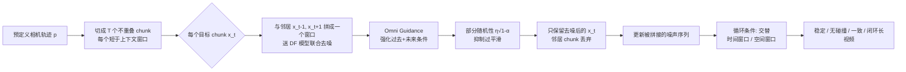

# Generative View Stitching

**会议**: ICLR 2026  
**OpenReview**: [https://openreview.net/forum?id=fpQpQbFPCU](https://openreview.net/forum?id=fpQpQbFPCU)  
**代码**: [https://andrewsonga.github.io/gvs/](https://andrewsonga.github.io/gvs/)（项目主页，含视频结果）  
**领域**: 视频生成 / 相机引导长视频 / 扩散采样  
**关键词**: 视频扩散, 相机引导, 扩散拼接 (Diffusion Stitching), Diffusion Forcing, 闭环一致性, 免训练采样  

## 一句话总结
GVS 把"机器人规划里的扩散拼接"搬到视频生成上：用一个免训练的并行采样算法，让任意 Diffusion Forcing 视频模型沿预定义相机轨迹生成长视频，同时让当前帧能"看到未来"，从而避免撞墙、保持一致并闭合回环。

## 研究背景与动机
**领域现状**：视频扩散模型一般只能生成 5–10 秒短片，要生成更长视频通常靠把短窗口模型"自回归滚动"（autoregressive, AR）地往后续写，配合 history guidance、检索增强等技巧可以做到几百帧稳定、与过去一致，甚至实时交互。

**现有痛点**：AR 采样有个根本缺陷——它只能看过去、看不到未来。当任务是"沿一条**预定义相机轨迹**拍一段长视频"（离线、需要高层规划的场景，如一镜到底的运镜、自动驾驶合成数据）时，AR 模型会先生成一堵墙、随后又被轨迹逼着"穿墙而过"，画面立刻 out-of-distribution、自回归迅速崩溃（exposure bias）。

**核心矛盾**：要避免撞墙，当前帧的生成必须**以未来的相机条件为约束**；但现成视频模型和 AR 采样都不提供"以未来为条件"的机制。已有的扩散拼接（diffusion stitching）方法虽然能并行生成整段序列、原则上能看未来，却要么（StochSync）缺乏视频所需的时序一致性、要么（CompDiffuser）需要专门训练一个带特殊条件通路的定制模型——给视频重训代价无法接受。

**本文目标**：做出**第一个面向相机引导视频生成的扩散拼接方法**，要求免训练、即插即用于任意现成模型，并且稳定、无碰撞、帧间一致、能闭环。

**核心 idea**：**关键观察标签** —— 广泛使用的 Diffusion Forcing (DF) 训练框架（每个 token 独立加噪、采样时可选择性地用噪声 mask 部分上下文）**天生就具备拼接所需的全部能力**，无需任何定制架构。在此之上叠加 **Omni Guidance**（同时强化对过去和未来的条件）与**循环条件 (cyclic conditioning)** 闭环机制，就能把免训练拼接做成稳定的长视频生成。

## 方法详解

### 整体框架
GVS 把目标长视频切成若干**不重叠**、长度短于上下文窗口的 chunk，然后对每个目标 chunk 连同它的相邻 chunk 一起送进 DF 模型**联合去噪**——这样目标 chunk 就同时被"过去邻居"和"未来邻居"约束；每步只保留去噪后的目标 chunk 用来更新被拼接序列，邻居 chunk 用完即弃。在这个并行采样骨架上，再用 Omni Guidance 修正条件强度、用部分随机性抑制过平滑、用循环条件实现回环闭合。

### 关键设计

**1. 用 Diffusion Forcing 实现免训练拼接：把"未来条件"做成同一输入序列里的联合去噪。** CompDiffuser 把视频的轨迹分布写成只依赖时序邻居的组合分布 $p_\theta(x|x_{\text{start}},x_{\text{goal}}) \propto \prod_t p_t(x_t|x_{t-1},x_{t+1})$，但它必须训练一个定制网络 $\epsilon_\theta(x_t^k,k|x_{t-1}^k,x_{t+1}^k)$，通过特殊编码器 + AdaLN 把"共同演化的噪声邻居 chunk"作为单独条件注入——这条特殊路径正是不能套用到现成模型的原因。GVS 的关键转念是：DF 模型本来就支持"每个 token 独立噪声等级、可对一部分上下文加噪 mask"，所以根本不用单独的条件通路，直接把目标 chunk 与邻居拼成一个序列 $[x_{t-1}^k, x_t^k, x_{t+1}^k]$ 喂进去联合去噪即可，输出里只拿目标 chunk $x_t^{k-1}$ 去更新被拼接序列、把邻居 $x_{t-1}^{k-1}, x_{t+1}^{k-1}$ 丢掉。这版"vanilla GVS"实现极简、兼容任意 DF 视频模型，对应的组合分布为 $p_\theta(x|p) \propto \prod_{t=0}^{T-1} p_t(x_t|x_{t-1},x_{t+1},p_{t-1},p_t,p_{t+1})$。

**2. Omni Guidance：修正"目标与邻居一样噪"导致的弱条件。** vanilla GVS 一致性差，根因是它用的是联合分布 $p(x_{t-1},x_t,x_{t+1})$ 的 score，而非本意的条件分布 $p(x_t|x_{t-1},x_{t+1})$；AR 采样里"过去上下文比目标干净得多"，而拼接里目标 chunk 和它的邻居**一样噪**，条件信号因此很弱。Omni Guidance 借鉴 Inner Guidance，直接把采样分布往"与邻居及相机轨迹一致"的方向掰，引入两个引导尺度 $\gamma_1$（对相机轨迹的依从）和 $\gamma_2$（与时序邻居的一致），并在实践中合并为单一 $\gamma$，把 score 改成 $\tilde\epsilon_\theta = (1+\gamma)\,\epsilon_\theta(x_{t-1:t+1}^k|p_{t-1:t+1}) - \gamma\,\epsilon_\theta(\varnothing, x_t^k, \varnothing|\varnothing,\varnothing,\varnothing)$。其中无条件项靠"把邻居 chunk 换成纯高斯噪声、噪声等级设为最大"来算——这一步完全是 DF backbone 白送的能力，可看作 Fractional History Guidance 的推广（区别在于邻居 chunk 的噪声等级在拼接过程中是动态变化的，而历史引导里是固定的）。

**3. 部分随机性：在"一致"与"过平滑"之间找平衡。** 先前工作 StochSync 提出用**最大随机性** $\sigma_k = \sqrt{1-\alpha_{k-1}}$ 当作纠错机制（消掉预测噪声项、把随机噪声项拉满）来增强一致性。GVS 发现它确实能提升时序一致性，但会把画面"洗平"（oversmoothing），细节丢失。配合 Omni Guidance 后，GVS 可以改用**部分随机性** $\sigma_k = \eta\sqrt{1-\alpha_{k-1}},\ \eta \in (0,1)$（实践取 $\eta=0.9$），两者协同既保住一致性又显著减轻过平滑。

**4. 循环条件实现闭环：给"空间近、时间远"的 chunk 补一组上下文窗口。** 理论上拼接每步会让感受野不断扩张、最终覆盖全局（类似 CNN 深度方向感受野增长），按理能零样本闭环；但实际很长的生成并不会"视觉上回到原地"，信息没传得够远。GVS 于是在组合分布里**额外加因子**：对每个目标 chunk 再denoise一组"时间上很远但空间上很近"的邻居窗口（spatial window），与原来的"时间邻居窗口"（temporal window）**逐去噪步交替**使用——这一过程称为循环条件。如此一来目标 chunk 在整个去噪过程中同时被时序邻居和空间邻居约束，最终成功闭合回环（包括能画出 Reutersvärd 的"不可能阶梯"）；没有空间邻居的 chunk 则只用时间窗口。

## 实验关键数据

**设置**：所有方法都用 Song et al. (2025) 开源的同一个相机条件视频模型（在 RealEstate10K 上训练的 Diffusion-Forcing Transformer，8 帧上下文窗口）。基准包含 Panorama / Circle / Straight line / Stairs / Staircase circuit 等专门设计来考验长度外推、闭环、避碰的轨迹。指标：F2FC（帧间一致性，↓）、LRC（长程/闭环一致性，↓）、IQ/AQ（VBench 画质，↑）、CA（碰撞率，↓），均为 40 次生成的平均。

### 主实验表格（与基线对比，节选）

| 轨迹 | 方法 | F2FC↓ | LRC↓ | IQ↑ | CA↓ |
|------|------|-------|------|-----|-----|
| Panorama 1-loop | Autoregressive | 0.168 | 0.339 | 0.458 | N/A |
| | StochSync | 0.183 | 0.164 | 0.515 | N/A |
| | **GVS (Ours)** | **0.138** | **0.141** | **0.537** | N/A |
| Circle 1-loop | Autoregressive | 0.220 | 0.411 | 0.432 | 0.625 |
| | StochSync | 0.204 | 0.258 | 0.546 | **0** |
| | **GVS (Ours)** | **0.160** | **0.244** | 0.546 | **0** |
| Straight line | Autoregressive | 0.138 | N/A | 0.456 | 0.325 |
| | StochSync | 0.124 | N/A | 0.544 | **0** |
| | **GVS (Ours)** | **0.080** | N/A | **0.615** | **0** |
| Staircase circuit | Autoregressive | 0.132 | 0.449 | 0.397 | 0.625 |
| | StochSync | 0.179 | 0.221 | 0.563 | **0** |
| | **GVS (Ours)** | **0.129** | **0.176** | **0.607** | **0** |

GVS 在帧间一致性、长程一致性、避碰三项上全面领先，画质相当。StochSync 虽然碰撞率也是 0，但它是靠"让场景变形 (shape-shifting)"换来的，反映在它差得多的 F2FC 上。

### 消融实验表格（Omni Guidance × 随机性 η，Straight line）

| η | 无 Omni Guidance F2FC↓ / IQ↑ | 有 Omni Guidance F2FC↓ / IQ↑ |
|---|------|------|
| 0 | 0.153 / 0.537 | 0.138 / 0.553 |
| 0.5 | 0.124 / 0.499 | 0.110 / 0.556 |
| 0.9 | 0.084 / 0.458 | 0.080 / **0.615** |
| 1.0 | 0.061 / 0.422 | 0.071 / 0.610 |

### 关键发现
- **随机性单独用是把双刃剑**：不加 Omni Guidance 时，提升 η 一致地改善 F2FC，但 IQ/AQ/IS 全面下滑（过平滑）。
- **Omni Guidance 解耦了"一致"和"画质"**：加上后，在大范围 η 上都能提升一致性，让 η=0.9 这种"高一致 + 不过平滑"的甜点变得可用（IQ 从 0.458 升到 0.615）。
- **闭环必须显式做**：另一组消融显示，仅靠 Omni Guidance、不开循环条件时 LRC 高达 0.95 左右（回环失败），说明"理论全局感受野"在实践里并不自动闭环，循环条件不可或缺。

## 亮点与洞察
- **"未来条件"这一缺口被点得很准**：把 AR 视频生成的失败归因为"看不到未来 → 撞墙 → exposure bias 崩溃"，并用并行拼接从根上解决，问题定义清晰。
- **免训练 + 即插即用**：只改采样、不改架构/训练，能直接 piggy-back 在任意 DF backbone 上，未来更长上下文的模型一出现就能被 GVS 进一步外推。
- **把规划领域的工具迁移到视频**：本质是把机器人规划里的 diffusion stitching（CompDiffuser/StochSync）成功移植，并指出 DF 自带拼接 affordance 这一非平凡观察。
- **"不可能阶梯"是很有说服力的 demo**：能闭合 Penrose 不可能阶梯回路，直观证明了全局一致 + 闭环能力。

## 局限与展望
- **依赖 DF 类 backbone**：方法的核心 affordance（独立 token 噪声、可对部分上下文加噪 mask）来自 Diffusion Forcing，对非 DF 训练的视频模型不直接适用。
- **采样成本**：每个目标 chunk 要联合去噪邻居、循环条件还要额外去噪空间窗口，并行拼接的算力/显存开销高于朴素 AR，论文未深入讨论实时性。
- **空间窗口需要先验**：循环条件依赖"哪些 chunk 空间近"的信息（基于相机视场重叠），对相机位姿未知/无预定义轨迹的开放生成不直接适用。
- **画质受限于 backbone**：评测都基于 8 帧窗口的 RealEstate10K 模型，分辨率/场景多样性受限；在更强 backbone 上的表现待验证。
- **展望**：与更长上下文模型、3D 先验在线规划结合，或扩展到非相机引导的其他"未来条件"（如目标帧、文本剧本）任务。

## 相关工作与启发
- **Diffusion Forcing (Chen et al., 2024)** 与 **History Guidance / DFoT (Song et al., 2025)**：GVS 的 backbone 与"过去条件引导"的直接前身，Omni Guidance 是 Fractional History Guidance 的推广。
- **扩散拼接谱系**：CompDiffuser（需定制训练）、StochSync（图像/全景拼接、最大随机性）是直接对照与被超越的对象。
- **Inner Guidance (Chefer et al., 2025)**：Omni Guidance 借其思路解决"条件信号依赖模型权重、打破 CFG 独立性假设"的问题。
- **启发**：当一个采样目标（看未来 / 闭环）看似需要重训模型时，先审视现有训练框架是否已隐含所需 affordance——往往一个免训练的采样改造就能解锁新能力；"全局感受野"理论上成立不代表实践会自动收敛，显式机制（循环条件）仍可能是必需的。

## 评分
- **新颖性**: ⭐⭐⭐⭐ 首个面向相机引导视频生成的免训练扩散拼接方法，"DF 自带拼接能力"是非平凡观察，Omni Guidance + 循环条件设计巧妙。
- **实验充分度**: ⭐⭐⭐⭐ 多类挑战轨迹 + 两个强基线 + 系统消融（Omni Guidance × 随机性 × 闭环），指标覆盖一致性/避碰/画质；但仅在单一 8 帧 backbone 上验证，缺成本与更大模型分析。
- **写作质量**: ⭐⭐⭐⭐ 问题动机（撞墙/exposure bias）讲得清楚，方法循序渐进（vanilla→随机性→Omni Guidance→闭环），图示充分。
- **价值**: ⭐⭐⭐⭐ 即插即用、能 piggy-back 未来更强模型，对一镜到底运镜、自动驾驶合成数据等离线高层规划任务有实际意义。

<!-- RELATED:START -->

## 相关论文

- [\[ICLR 2026\] EgoTwin: Dreaming Body and View in First Person](egotwin_dreaming_body_and_view_in_first_person.md)
- [\[ICLR 2026\] Arbitrary Generative Video Interpolation](arbitrary_generative_video_interpolation.md)
- [\[ICLR 2026\] ToonComposer: Streamlining Cartoon Production with Generative Post-Keyframing](tooncomposer_streamlining_cartoon_production_with_generative_post-keyframing.md)
- [\[ICLR 2026\] Light-X: Generative 4D Video Rendering with Camera and Illumination Control](light-x_generative_4d_video_rendering_with_camera_and_illumination_control.md)
- [\[CVPR 2026\] 3D-Aware Implicit Motion Control for View-Adaptive Human Video Generation](../../CVPR2026/video_generation/3d-aware_implicit_motion_control_for_view-adaptive_human_video_generation.md)

<!-- RELATED:END -->
