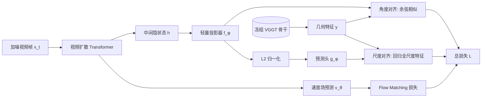

# Geometry Forcing: Marrying Video Diffusion and 3D Representation for Consistent World Modeling

**会议**: ICLR 2026  
**OpenReview**: [https://openreview.net/forum?id=ULXYZCms41](https://openreview.net/forum?id=ULXYZCms41)  
**代码**: [https://GeometryForcing.github.io](https://GeometryForcing.github.io)  
**领域**: 视频生成 / 世界模型 / 3D 表示对齐  
**关键词**: 视频扩散, 表示对齐, 3D 基础模型, VGGT, 世界模型, 几何一致性  

## 一句话总结
通过把视频扩散模型的中间特征对齐到 3D 基础模型 VGGT 的几何表示（角度对齐 + 尺度对齐两个解耦目标），让纯视频数据训练的扩散模型"内化"3D 结构，从而显著提升长时视频生成的几何与时序一致性，并能在推理时反推出显式 3D 几何。

## 研究背景与动机
**领域现状**：视频扩散模型已能从大规模视频数据直接模拟世界、生成可被相机轨迹或动作信号控制的逼真画面，成为世界模型的主流路线。但这些模型本质上只在 2D 像素空间建模帧分布。

**现有痛点**：视频本是动态 3D 世界的 2D 投影，纯像素建模忽视了这一根本属性。作者做了一个探针实验——冻结预训练视频扩散模型（DFoT），在其中间特征上训练一个 DPT 深度预测头，结果发现这些特征**几乎无法重建出有意义的几何结构**。这说明仅靠原始视频数据，模型并没有隐式学到 3D 信息，导致自回归长时生成中几何漂移、误差累积、无法在 360° 旋转后回到初始视角。

**核心矛盾**：要补 3D 信息，最直接的做法是把 RGB 与几何（如 point map）联合端到端建模，但这严重依赖稀缺的 3D 标注，破坏了视频数据的可扩展性与泛化性。如何在**不引入显式 3D 监督、不改变视频训练范式**的前提下注入几何先验，是核心难题。

**本文目标**：让视频扩散模型在训练中自然内化 3D 表示，既保留纯视频训练的可扩展性，又获得几何一致性。

**核心 idea**：受图像扩散里 REPA（语义表示对齐）启发，作者提出 **Geometry Forcing**——把扩散模型的中间隐状态对齐到预训练 **3D 基础模型 VGGT** 的几何特征，用表示层面的结构监督替代显式 3D 标注，并把对齐拆成**方向（角度）**与**尺度**两个解耦目标以稳定训练。

## 方法详解

### 整体框架
Geometry Forcing 建立在自回归视频扩散模型（Flow Matching + Transformer 骨干，逐帧独立加噪）之上。训练时取扩散模型某中间层的隐状态 $h$，用轻量投影器映射后，对齐到 VGGT 骨干输出的几何特征 $y$；对齐通过两个互补损失实现，与原本的 Flow Matching 损失联合优化。VGGT 仅作为冻结的"几何老师"提供监督信号，推理时无需 VGGT，但对齐后的特征可被一个几何头反推出显式深度/点云。

### 关键设计

**1. 角度对齐（Angular Alignment）：先把"几何方向"对齐。** VGGT 骨干的中间特征 $y \in \mathbb{R}^{L\times N\times P\times D}$（层数 × 帧数 × patch 数 × 维度）同时保留了每帧的局部与全局信息，且足以重建多种显式几何，因此被选作对齐目标。作者用一个轻量投影器 $f_\phi$ 把扩散隐状态 $h\in\mathbb{R}^{N\times P'\times D'}$ 映射到 $y$ 的形状，再在帧级与 patch 级上逐点最大化余弦相似度：

$$\mathcal{L}_{\text{Angular}} = -\frac{1}{LNP}\sum_{\ell=1}^{L}\sum_{n=1}^{N}\sum_{p=1}^{P} \cos\big(y_{\ell,n,p},\, f_\phi(h_{n,p})\big)$$

由于 VGGT 骨干自带跨帧注意力，全局一致性已隐含在 $y$ 中，因此损失里不再额外强加跨帧约束，只逐帧逐 patch 对齐方向即可。

**2. 尺度对齐（Scale Alignment）：再把"幅度信息"补回来，但要躲开崩塌。** 角度对齐只管方向、丢掉了特征幅度，而幅度本身也编码几何信息。直接对 $h$ 与 $y$ 用 MSE 监督幅度会因两个模型固有的尺度差异引发优化不稳与模型崩塌（消融里 MSE 让 FVD 飙到 1648）。作者的巧思是把幅度监督"解耦"出来：先把投影后的特征归一化到单位长度 $\hat{h}=f_\phi(h)/\|f_\phi(h)\|_2$，再用另一个轻量预测头 $g_\phi$ 从归一化输入去回归**带尺度的完整目标特征**：

$$\mathcal{L}_{\text{Scale}} = \frac{1}{LNP}\sum_{\ell=1}^{L}\sum_{n=1}^{N}\sum_{p=1}^{P} \big\|\, g_\phi(\hat{h}_{\ell,n,p}) - y_{\ell,n,p}\,\big\|_2^2$$

这样扩散特征自身的幅度不被强行拉扯（避免后续层崩塌），尺度信息却通过一个独立预测头被学到，方向与尺度各司其职，既稳定又表达充分。

**3. 联合训练目标与"免费"的显式几何。** 总损失把几何对齐当作正则项加到原始扩散损失上：$\mathcal{L} = \mathcal{L}_{\text{FM}} + \lambda_{\text{Angular}}\mathcal{L}_{\text{Angular}} + \lambda_{\text{Scale}}\mathcal{L}_{\text{Scale}}$（实验取 $\lambda_{\text{Angular}}=0.5,\ \lambda_{\text{Scale}}=0.05$）。这一设计完全不需要 3D 标注，可直接套用在任意自回归视频扩散模型上。一个意外收获是：既然中间特征已与 VGGT 几何特征对齐，推理时挂一个几何头就能从中间特征**反推出显式 3D 几何**，统一了视频生成与 4D 生成，也为长时世界建模提供了一种可解释的"结构化记忆"。

**4. 对齐位置选在中层。** 消融（图 3）显示对齐扩散模型的**中层特征**对视频质量提升最显著——太浅的特征几何信息不足，太深则离生成头太近、约束反而干扰生成。

## 实验关键数据
两个任务：RealEstate10K 上的**相机视角条件**生成（套在 DFoT 上）、Minecraft 上的**动作条件**生成（套在 NFD 上）。除常规 FVD/LPIPS/SSIM/PSNR 外，还引入 RPE（重投影误差，多视图几何一致性）和 RVE（重访误差，绕一圈相机后回到起点的一致性）衡量 3D 一致性。

### 主实验表格（RealEstate10K，256 帧长时生成）

| 方法 | FVD↓ | LPIPS↓ | SSIM↑ | PSNR↑ | RPE↓ |
|---|---|---|---|---|---|
| Cosmos* | 934 | 0.68 | 0.20 | 10.25 | – |
| DFoT (baseline) | 364 | 0.55 | 0.36 | 11.40 | 0.3575 |
| REPA | 297 | 0.54 | 0.36 | 11.51 | 0.3337 |
| VideoREPA | 455 | 0.56 | 0.35 | 11.50 | 0.3823 |
| **Geometry Forcing** | **243** | **0.51** | **0.38** | 11.87 | 0.3337 |
| **GF + REPA** | **237** | 0.51 | 0.37 | **12.10** | **0.3264** |

16 帧短时设置下 GF 把 FVD 从 252（DFoT）降到 193，GF+REPA 进一步到 179，全面优于 REPA(221)/VideoREPA(210)。动作条件任务（Minecraft，16 帧）NFD 加 GF 后 FVD 从 216 降到 205，验证了对域外分布的泛化。

### 消融实验表格

| 消融维度 | 设置 | FVD-256↓ |
|---|---|---|
| 对齐目标 | Baseline | 364 |
|  | DINOv2 (语义) | 297 |
|  | VGGT (几何) | 243 |
|  | VGGT + DINOv2 | 237 |
| 对齐损失 | Angular only | 253 |
|  | Angular + Scale | 243 |
|  | MSE (朴素) | 1648 |
| 几何注入方式 | 显式（渲染图 ControlNet 条件） | 280 |
|  | 隐式内化（GF） | 243 |

### 关键发现
- **几何对齐 > 语义对齐**：对齐 VGGT（243）显著优于对齐 DINOv2（297），证明几何先验比纯 2D 语义更利于一致性；两者正交，叠加还能再降到 237。
- **MSE 会崩塌，解耦才稳**：直接 MSE 让 FVD 爆到 1648，而角度+尺度解耦稳定收敛到 243，印证 Scale Alignment 设计的必要性。
- **内化优于显式条件**：用同样的 VGGT 特征，把几何渲染成图当 ControlNet 条件（280）不如直接在特征层对齐（243）——内部对齐提供了更强的结构监督。
- **缓解曝光偏差**：长时生成中 GF 在 100 帧之后 FVD 明显低于 baseline，且 360° 旋转能回到初始视角，而 DFoT/REPA/VideoREPA 都做不到。

## 亮点与洞察
- **诊断驱动方法**：用"冻结特征 + DPT 探针"先实证了纯视频扩散模型缺乏 3D 表示，让"补几何"这一动机非常扎实，而非凭空提出。
- **把 REPA 从语义推广到几何**：REPA 用 DINOv2 对齐语义，本文换成 VGGT 对齐几何，并指出二者正交可叠加——一个干净的范式迁移。
- **角度/尺度解耦是真正的技术核心**：识别出"直接 MSE 会因尺度差异崩塌"，用归一化 + 独立尺度预测头优雅绕开，是方法能 work 的关键。
- **训练即正则、推理出几何**：仅作为正则项加入，不改动主干、不需 3D 标注、可即插即用到 DFoT/NFD；副产品是推理时能反推显式 3D，打通视频与 4D。

## 局限与展望
- **依赖 3D 基础模型的质量上限**：几何监督完全来自 VGGT，VGGT 在动态/非刚体/极端域（如 Minecraft 与真实世界的巨大分布差）上的几何估计误差会直接传导给扩散模型。
- **训练步数与规模偏小**：实验只在 2000–2500 步、A100×8 的小规模微调上验证，是否在从头大规模预训练中同样有效仍待考。
- **几何记忆未落地**：论文反复强调"可反推显式几何 → 结构化记忆 → 长时世界建模"，但基于几何的记忆机制本身留作未来工作，尚未实现。
- **超参敏感性**：$\lambda_{\text{Angular}}/\lambda_{\text{Scale}}$ 与对齐层位置需要调，跨模型迁移时的鲁棒性未充分讨论。

## 相关工作与启发
- **REPA / VideoREPA**：表示对齐加速扩散训练的同源思路，本文把对齐目标从语义基础模型换成几何基础模型，是直接前驱。
- **Diffusion Forcing / Self Forcing**：解决自回归视频扩散的逐帧加噪与曝光偏差问题，与 GF 正交——它们改训练范式，GF 改表示结构，可结合。
- **VGGT 等 3D 基础模型**：前馈直出相机位姿/深度/点云的几何基础模型，是 GF 的监督来源，也提示"用基础模型蒸馏先验"是注入领域知识的通用手段。
- **联合 RGB+point map 建模（如 Zhang et al. 2025a）**：显式建几何的对照路线，本文用隐式对齐避开了对 3D 标注的依赖，可扩展性更好。
- **启发**：当某类生成模型缺乏某种结构能力时，"对齐到一个掌握该结构的冻结基础模型的中间特征"是一条低成本、可扩展、可即插即用的注入路径；而对齐时把**方向与尺度解耦**是避免特征尺度冲突崩塌的实用技巧。

## 评分
- **新颖性**: ⭐⭐⭐⭐ — REPA 思路向几何域的迁移虽不算颠覆，但"角度/尺度解耦对齐"和"探针诊断 + 推理反推几何"的组合有清晰增量与洞见。
- **实验充分度**: ⭐⭐⭐⭐ — 两任务、两骨干、多指标 + RPE/RVE 几何度量 + 用户研究，消融覆盖目标/损失/注入方式/对齐层；但训练规模偏小、缺大规模预训练验证。
- **写作质量**: ⭐⭐⭐⭐⭐ — 动机由探针实验引出、方法解耦清晰、公式与消融紧扣，叙事完整易读。
- **价值**: ⭐⭐⭐⭐ — 即插即用、不需 3D 标注、对长时一致性提升明显，对世界模型/4D 生成有实际推动；几何记忆落地后潜力更大。

<!-- RELATED:START -->

## 相关论文

- [\[ICLR 2026\] Vid2World: Crafting Video Diffusion Models to Interactive World Models](vid2world_crafting_video_diffusion_models_to_interactive_world_models.md)
- [\[CVPR 2026\] WorldReel: 4D Video Generation with Consistent Geometry and Motion Modeling](../../CVPR2026/video_generation/worldreel_4d_video_generation_with_consistent_geometry_and_motion_modeling.md)
- [\[CVPR 2025\] World-Consistent Video Diffusion with Explicit 3D Modeling](../../CVPR2025/video_generation/world-consistent_video_diffusion_with_explicit_3d_modeling.md)
- [\[ICLR 2026\] NeRV-Diffusion: Diffuse Implicit Neural Representation for Video Synthesis](nerv-diffusion_diffuse_implicit_neural_representation_for_video_synthesis.md)
- [\[CVPR 2026\] Geometry-as-context: Modulating Explicit 3D in Scene-consistent Video Generation to Geometry Context](../../CVPR2026/video_generation/geometry-as-context_modulating_explicit_3d_in_scene-consistent_video_generation_.md)

<!-- RELATED:END -->
