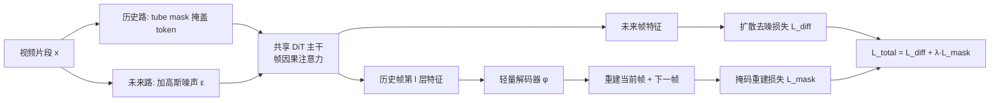

# Improving Autoregressive Video Modeling with History Understanding

**会议**: ICLR 2026  
**OpenReview**: [https://openreview.net/forum?id=kd2V5Bkw1D](https://openreview.net/forum?id=kd2V5Bkw1D)  
**代码**: 待确认  
**领域**: 视频生成 / 自回归视频建模  
**关键词**: VideoAR, 扩散模型, 掩码建模, 历史表征, 自监督表征学习  

## 一句话总结
本文指出扩散式自回归视频生成（VideoAR）中"历史帧的内部表征质量"是一个被忽视的关键变量，并提出 **MiMo（Masked History Modeling）**——在扩散去噪目标之外，对干净历史帧做掩码重建，自监督地学到更强的历史表征，在不依赖视觉基础模型（VFM）的前提下显著提升收敛速度与生成质量。

## 研究背景与动机
- **领域现状**：VideoAR 顺序地"给定历史帧→预测未来帧"，天然契合视频因果结构并支持变长生成。早期 AR 方法显著落后于非 AR 方法，而近期扩散式 VideoAR（DFoT、ACDiT、MAGI、FAR）通过迭代去噪近似复杂条件分布，把 AR 重新拉回竞争行列。
- **现有痛点**：在 T2I/T2V、类别条件生成里，"更强的条件表征"几乎总能提升生成质量；但在 VideoAR 里，作为条件信号的**历史帧表征**几乎只靠扩散目标被动学习，从未被专门研究或优化。而扩散目标要求建模未来帧的低层细节，这本身会**干扰表征学习**，导致好的历史表征"不会自发涌现"。
- **核心矛盾**：一条捷径是直接蒸馏 VFM 特征（如 REPA），但 VFM 训练成本高、在新视频域上有 OOD 风险。如何在**不引入 VFM、不大改架构**的前提下，让模型自己学到语义对齐、可预测、鲁棒的历史表征？
- **本文目标**：系统验证"历史表征质量↔VideoAR 性能"的因果关系，并设计一个无 VFM、轻量级的表征学习目标无缝融入扩散式 VideoAR。
- **核心 idea（加粗标签）**：**把历史帧一物两用**——既作为去噪未来帧的干净条件，又作为掩码自监督重建的输入；通过对干净历史帧做掩码建模（而非对含噪输入做），既学到强表征又不干扰扩散去噪。

## 方法详解

### 整体框架
MiMo 沿用 Complete Teacher Forcing（CTF）的训练范式——训练时直接给模型看**干净（无噪）历史帧**，消除 diffusion forcing 的训练/测试分布差异。一段视频被复制成两路：一路作为历史帧 $h$ 被随机 tube mask 掩盖部分 token，一路作为未来帧 $f$ 被加高斯噪声。模型在标准扩散去噪损失之外，额外用一个轻量解码器从被掩历史帧的中间层特征重建出当前帧与下一帧，两个目标联合训练。推理时丢弃解码器，按标准 AR + KV cache 逐帧去噪生成。

### 关键设计

**1. 历史表征确实是杠杆：先做对照实验立论。** 方法之所以成立，建立在一组前置分析之上。作者在 K600 视频预测上用线性探测精度与 CKNNA（衡量模型内部表征与 VFM 表征相似度）量化历史表征质量，发现它与生成 FVD 正相关，且训练中始终与预训练表征存在显著差距——好表征不会自发涌现。更关键的对照（Table 1）用 ACDiT-B 分别把表征增强施加在历史帧、未来帧、或两者：只增强历史帧 FVD 从 54.8 降到 40.0，只增强含噪未来帧降到 40.3，**两者同时增强才进一步降到 36.5**。这说明历史帧含有未来帧表征无法替代的独特语义，仅靠"改善含噪未来帧表征"（如 REPA 单作用于未来）不足以拿到全部收益，从而为"专门给历史帧设计表征目标"提供了依据。

**2. 对干净历史帧做掩码建模，而非对含噪输入。** 这是 MiMo 与以往"masked diffusion"的根本分野。过去把掩码目标加在扩散的含噪输入上（Gao et al. 2023、Wei et al. 2023）会损害去噪、需要复杂技巧补救。MiMo 把 tube mask（比例 $r$）只施加在干净历史帧 $h^{\mathcal{M}}_{1:t}$ 上，扩散损失仍正常作用于未来帧：

$$\mathcal{L}_{\text{diff}}=\mathbb{E}\big[\lVert \alpha_\tau\epsilon_t-\sigma_\tau f_t-v_\theta(f^{(\tau)}_t;\tau,h^{\mathcal{M}}_{1:t})\rVert_2^2\big]$$

由于掩码作用于条件信号而非去噪对象，它几乎不干扰未来预测，因此无需任何特殊架构改造，只在主干上加 QK 归一化、RoPE 与历史帧独立 LayerNorm 等极小改动即可。

**3. 灵活的重建目标：预测"当前帧 + 下一帧"。** 与扩散损失只能恢复"被加噪当前帧的干净版本"不同，掩码历史建模可以让被掩的历史 token 去重建一组目标帧 $\mathcal{T}_t=\{t,\,t+1\}$，即当前帧与下一帧：

$$\mathcal{L}_{\text{mask}}=\mathbb{E}\Big[\tfrac{1}{|\mathcal{T}_t|}\sum_{t'\in\mathcal{T}_t}\lVert h_{t'}-\varphi_\theta(t'-t,\,v^{h,l}_\theta(f^{(\tau)}_t;\tau,h^{\mathcal{M}}_{1:t}))\rVert_2^2\Big]$$

其中 $\varphi_\theta$ 是只在训练时存在的轻量解码器（4 个 DiT block），从主干第 $l$ 层的历史帧特征 $v^{h,l}_\theta$ 取信号。"预测下一帧"这一项强迫历史表征具备**预测性/动态感**而不只是重建当下，消融显示它比只预测当前帧更优（37.8→36.6）；再往后预测第三帧则收益递减。

**4. 统一目标与无缝推理。** 最终训练目标 $\mathcal{L}_{\text{total}}=\mathcal{L}_{\text{diff}}+\lambda\mathcal{L}_{\text{mask}}$（$\lambda=0.5$ 最优）。因为掩码遮住了部分 token，训练计算量反而比 ACDiT 基线略降。推理阶段解码器被整体丢弃，模型退化为标准的扩散式 AR：给定干净历史帧迭代去噪出下一帧、追加进上下文、再生成后续帧，天然支持变长生成，且对历史扰动更鲁棒。

## 实验关键数据

### 主实验表格（系统对比，FVD↓）

| 方法 | 类型 | Kinetics 预测 | UCF 无条件 | UCF 类条件 |
|---|---|---|---|---|
| DFoT-XL† | AR | 11.1 | – | – |
| MAGI-XL | AR | 11.5 | 298 | – |
| ACDiT-XL | AR | – | – | 111 |
| FAR-XL | AR | – | 279 | 108 |
| **MiMo-XL** | AR | **8.3** | **240** | **98** |
| VAE 重建（上界） | – | 3.7 | 15 | 15 |

三项任务全部刷新 AR SOTA：Kinetics 预测 11.1→8.3；UCF 无条件较 FAR 提升近 40 点（240 vs 279）、较同用 CTF 的 MAGI 提升 58 点；UCF 类条件 98 vs FAR 108、vs ACDiT 111。三处都与对手共用同一 VAE/tokenizer，差异主要来自历史建模本身。

### 消融实验表格（DiT-B，Kinetics 100K 步）

| 消融维度 | 配置 | FVD↓ |
|---|---|---|
| 基线 | ACDiT（无掩码历史建模） | 54.8 |
| 与 REPA 对比 | REPA-History / Future / Both | 40.0 / 40.3 / 36.5 |
| | **MiMo（无 VFM）** | 36.6 |
| | MiMo + REPA-Both | **34.1** |
| 重建目标 | 当前帧 / 下一帧 / 当前+下一(MiMo) | 41.8 / 37.8 / 36.6 |
| | 当前+下一+再下一 | 36.3 |
| 解码器位置 $l$（共12层） | 12 / 11 / 10 / 9 | 36.6 / 35.8 / 35.8 / 37.6 |
| 架构 | Vanilla / +RoPE / +独立 LN | 37.8 / 37.3 / 36.6 |
| 超参 λ | 0.1 / 0.5 / 1.0 / 2.0 | 40.2 / 36.6 / 37.4 / 38.9 |

### 关键发现
- **无 VFM 也能打平甚至超过 VFM 蒸馏**：MiMo（36.6）与 REPA-Both（36.5）持平，且二者互补——MiMo+REPA 进一步降到 34.1，说明自监督动态学习与 VFM 语义先验捕获了不同侧面。
- **收敛大幅加速**：Figure 1 显示相对基线约 1.77×～2.14× 的收敛加速。
- **计算几乎免费**：MiMo-XL wall-clock 0.750s，比 ACDiT（0.788s）还快 5%，仅比 FAR 慢约 10%。
- **鲁棒性好**：解码器位置、λ、掩码比例（0.25～0.5）在合理范围内性能平稳，超参不敏感。

## 亮点与洞察
- **问对了问题**：把研究焦点从"如何去噪未来帧"转到"条件信号（历史帧表征）质量"，并用线性探测/CKNNA + 对照实验严谨地论证"历史表征是独立且必要的杠杆"，立论扎实。
- **巧在作用对象**：掩码建模施加于**干净历史帧条件**而非含噪去噪对象，绕开了 masked diffusion 损害去噪、需复杂补救的老问题，几乎零架构代价。
- **"预测下一帧"是点睛之笔**：让历史表征带上预测性/动态性，而非单纯重建当下，契合视频的因果结构。
- **实用性强**：在 VFM 不可得的新视频域里是即插即用的替代品；与 REPA 还能叠加。

## 局限与展望
- 主要在 K600 / UCF-101 这类相对受控的预测/生成基准上验证，缺少大规模开放域文生视频场景的检验。
- 把 MAE 目标迁到含噪未来帧的尝试失败（与 Gao et al. 报告一致），说明该路线尚未打通；扩展到 DINO/JEPA 等其他自监督目标仅作为 future work。
- 更高掩码比例（>0.5）需要额外的"无掩码微调"才能恢复性能，存在一定调参负担。
- 解码器虽轻量，但仍引入额外训练期分支与 λ 调节。

## 相关工作与启发
- **扩散式 VideoAR**：DFoT/diffusion forcing（含噪历史，存在训练/测试差异）→ CTF（ACDiT、MAGI、Zhou et al.，干净历史）；MiMo 站在 CTF 之上补齐"历史表征学习"这一缺口。
- **表征对齐**：REPA 把 VFM 特征蒸馏进扩散模型；MiMo 给出无 VFM 的自监督替代，并证明二者互补。
- **掩码建模**：BERT/MAE/VideoMAE 的掩码重建思想被巧妙嫁接到"条件信号"而非"生成对象"上，是其能与扩散和谐共处的关键。
- **启发**：在任何"条件生成"框架里，条件编码器的表征质量可能是被低估的免费午餐——与其堆生成端，不如审视条件端是否被充分学习。

## 评分
- **新颖性**: ⭐⭐⭐⭐ — "对干净历史条件做掩码自监督"这一切入点新颖，且把被忽视的历史表征问题系统化论证，超出简单的目标拼接。
- **实验充分度**: ⭐⭐⭐⭐ — 三任务 SOTA + 线性探测/CKNNA 分析 + 大量消融（目标/位置/λ/掩码比/计算量），证据链完整；扣分于基准规模偏受控、缺开放域大模型验证。
- **写作质量**: ⭐⭐⭐⭐ — 从"提问→对照立论→方法→消融"逻辑清晰，图 1/图 3 直观，公式与设计动机对应明确。
- **价值**: ⭐⭐⭐⭐ — 无 VFM、近零计算代价即可显著加速收敛并刷新 AR SOTA，对扩散式 VideoAR 是实用且可复用的改进。

<!-- RELATED:START -->

## 相关论文

- [\[CVPR 2026\] Accelerating Autoregressive Video Diffusion via History-Guided Cache and Residual Correction](../../CVPR2026/video_generation/accelerating_autoregressive_video_diffusion_via_history-guided_cache_and_residua.md)
- [\[CVPR 2025\] Mimir: Improving Video Diffusion Models for Precise Text Understanding](../../CVPR2025/video_generation/mimir_improving_video_diffusion_models_for_precise_text_understanding.md)
- [\[ICLR 2026\] Flow Caching for Autoregressive Video Generation](flow_caching_for_autoregressive_video_generation.md)
- [\[CVPR 2026\] STARFlow-V: End-to-End Video Generative Modeling with Autoregressive Normalizing Flows](../../CVPR2026/video_generation/starflow-v_end-to-end_video_generative_modeling_with_autoregressive_normalizing_.md)
- [\[ICLR 2026\] LikePhys: Evaluating Intuitive Physics Understanding in Video Diffusion Models via Likelihood Preference](likephys_evaluating_intuitive_physics_understanding_in_video_diffusion_models_vi.md)

<!-- RELATED:END -->
