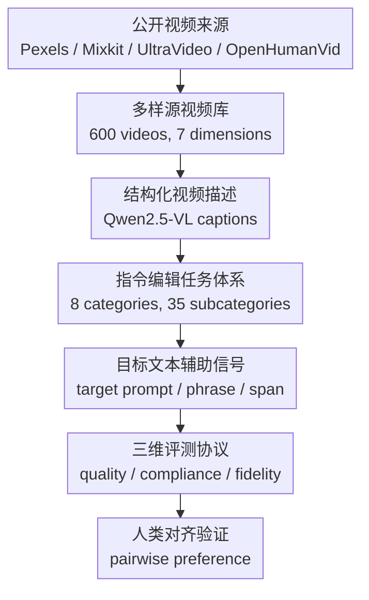

# IVEBench: Modern Benchmark Suite for Instruction-Guided Video Editing Assessment

**会议**: ICLR 2026  
**OpenReview**: [https://openreview.net/forum?id=n0wVbCxcob](https://openreview.net/forum?id=n0wVbCxcob)  
**代码**: 待发布  
**领域**: 视频生成 / 指令引导视频编辑评测  
**关键词**: 指令引导视频编辑, 视频编辑评测, 多模态大模型评估, 视频保真度, Benchmark  

## 一句话总结
IVEBench 构建了一个专门面向 instruction-guided video editing 的现代评测套件，用 600 个高质量源视频、8 大类 35 小类编辑指令和视频质量 / 指令遵循 / 视频保真度三维指标，系统暴露了现有视频编辑模型在复杂指令遵循和高保真编辑上的短板。

## 研究背景与动机
**领域现状**：视频编辑正在从“给源视频和目标文本 prompt，让模型把视频改成目标描述”转向“用户直接用自然语言说编辑需求”。后一种 instruction-guided video editing 更接近真实使用方式：用户通常不会写完整的目标视频 caption，而是说“把视角改成高角度”“让人物站起来”“把水瓶换成报纸”这类操作性指令。

**现有痛点**：问题是，评测体系还停留在旧范式。VE-Bench、EditBoard、FiVE、TDVE-Assessor 等近期 benchmark 对视频编辑质量有推进，但多数仍围绕 source-target prompt-based editing 设计，任务覆盖集中在主体替换、属性改变、风格迁移等接近图像编辑的类别。对于视频特有的编辑需求，例如主体运动、相机运动、相机角度变化、视觉转场、数量变化，它们覆盖不足，导致一个模型即使只能做少数简单编辑，也可能在现有评测里看起来不错。

**核心矛盾**：指令引导视频编辑的难点不只是“生成一段好看的视频”，而是同时满足三件事：目标视频要自然清晰，编辑指令要真正被执行，未被编辑的内容还要尽量保持源视频一致。传统指标往往只看画质或全局文本-视频相似度，无法区分“模型改得漂亮但改错了”“指令满足了但把背景也毁了”“视频很稳定但几乎没编辑”这几种完全不同的失败模式。

**本文目标**：作者希望建立一个更贴近 IVE 任务本身的 benchmark：一方面让源视频足够多样，覆盖不同语义主题、时长和分辨率；另一方面让编辑指令覆盖真实用户会提出的多种视频编辑操作；最后用多维指标把视频质量、指令遵循和视频保真度拆开评估，而不是用单一相似度给出含混分数。

**切入角度**：本文的观察是，视频编辑评测需要同时升级“数据、任务、指标”三层。只增加视频数量但指令单一，无法测出模型的编辑边界；只增加任务但没有源视频多样性，结论容易依赖少数场景；只靠传统 CLIP 相似度，难以判断复杂运动和视角编辑是否真的执行。因此 IVEBench 把数据采集、指令生成和 MLLM 辅助评估作为一个整体来设计。

**核心 idea**：IVEBench 用系统化的视频库、细粒度指令类别和三维评价协议，把指令引导视频编辑从“零散样例展示”推进到可比较、可诊断、与人类偏好高度一致的 benchmark。

## 方法详解

### 整体框架
IVEBench 不是训练一个新的视频编辑模型，而是构建一个完整评测套件。它先收集并筛选 600 个高质量源视频，再为每个视频设计一条指令式编辑 prompt，同时生成 target prompt、target phrase 等辅助文本，最后用 12 个指标从视频质量、指令遵循和视频保真度三个维度评估不同 IVE 模型。

整体流程可以理解为“源视频多样化 → 指令任务体系化 → 指标分维度诊断 → 人类对齐验证”。这条流程的关键在于，benchmark 的每一层都对应 IVE 的一个核心风险：源视频太窄会高估泛化，指令太窄会高估编辑能力，指标太粗会混淆画质、遵循和保真。

数据侧，作者先定义 7 个语义维度，并细分出 30 个 topic，再从 Pexels、Mixkit、UltraVideo 和 OpenHumanVid 收集高分辨率候选视频。候选视频经过自动预处理和人工筛选，去除黑边、字幕、低质量内容，并确保视频内容适合编辑。最终数据集包含 400 个短视频和 200 个长视频，短视频长度为 32 到 128 帧，长视频长度为 129 到 1024 帧，这让 benchmark 能同时考察常规短片和长序列编辑能力。

指令侧，IVEBench 使用 Qwen2.5-VL-72B 为源视频生成结构化 caption，描述主体、背景、动作、情绪氛围、视觉风格、相机视角和运动等可编辑元素。随后用 Doubao-1.5-pro 根据这些 caption 自动选择合适的编辑类别并生成 edit prompt，同时生成 target prompt、target phrase 和 target span 等辅助字段。所有类别和 prompt 还经过人工审查与修正，以保证指令清晰、任务合理、类别分布不过度偏斜。

指标侧，作者把一次编辑实例定义为三元组：源视频、编辑指令和目标视频。目标视频要被从三个关系上检查：它自己是否是高质量视频，它和编辑指令是否一致，它和源视频的未编辑内容是否保持一致。这个拆分很重要，因为 IVE 的失败经常不是单一维度上的失败，而是几个目标互相牵扯。

### 关键设计
**1. 多样源视频库：把评测从少数静态场景扩展到真实视频分布**

现有 benchmark 的一个根本问题是源视频太少、场景太窄，模型可能只在少数风格化片段上表现还可以，一遇到长视频、人类主体、复杂运动或高分辨率素材就失效。IVEBench 因此不是简单抓取视频，而是先定义 7 个语义维度，再覆盖 30 个细粒度 topic，从多个公开视频来源收集素材，并将视频分为短序列和长序列两部分。

这种设计的价值在于让“编辑能力”不再只对应单帧外观变化。长视频子集迫使模型面对内存、延迟和时序一致性；OpenHumanVid 等人类视频来源增加了人体动作、姿态和主体变化；高分辨率来源则使画质和细节保真更接近真实用户素材。也就是说，数据分布本身就在逼模型回答一个更实际的问题：它能不能在复杂视频上稳定执行编辑，而不是只在精心挑选的短 clip 上成功。

**2. 八类三十五小类编辑指令：把视频特有编辑纳入测试范围**

很多旧评测把视频编辑当成图像编辑的逐帧版本，主要测主体、属性和风格。这会低估视频编辑的特殊难点，因为视频里的核心操作经常发生在时间轴和镜头运动上。IVEBench 把编辑任务扩展到 8 大类 35 小类，包括 style editing、subject editing、attribute editing、quantity editing、subject motion editing、visual effect editing、camera motion editing 和 camera angle editing。

这里最关键的是后几类。比如“让人物站起来”“把相机拉近”“改成高角度视角”“加入波浪泡沫转场”都不是单帧贴图能解决的任务，它们要求模型理解动作、镜头和事件在时间中的变化。作者还为每条指令配套 target prompt、target phrase 和 target span：target prompt 描述目标视频整体语义，target phrase 聚焦被编辑对象或操作，target span 用于数量类任务检测。这样 IVEBench 既能支持 instruction-guided 方法，也能兼容部分 text-driven editing 方法，评测接口更通用。

**3. 三维十二指标协议：把画质、遵循和保真拆开诊断**

IVEBench 的指标设计不是追求一个“万能总分”，而是先拆出 Video Quality、Instruction Compliance 和 Video Fidelity 三个维度。Video Quality 关注目标视频本身，包含 Subject Consistency、Background Consistency、Temporal Flickering、Motion Smoothness 和 Video Training Suitability Score。前四个指标从跨帧一致性、闪烁和运动平滑性看时序质量，VTSS 则整合构图、审美、清晰度、色彩、自然性和运动稳定等空间质量信号。

Instruction Compliance 关注“有没有按指令改”。OSC 用 VideoCLIP-XL2 计算目标视频和 target prompt 的整体语义一致性，PSC 用 target phrase 聚焦局部编辑目标，IS 让 Qwen2.5-VL 根据 edit prompt 和目标视频打 1 到 5 分，处理主体运动、相机运动、相机角度这类传统相似度难以判断的操作。Quantity Accuracy 则针对数量编辑，用 target span 驱动 Grounding DINO 检测目标对象数量，正确为 1，错误为 0。

Video Fidelity 关注“没有要求改的地方有没有被保住”。SF 用 VideoCLIP-XL2 比较源视频和目标视频的语义特征，MF 用 CoTracker3 估计源视频与目标视频的运动轨迹相似度，CF 则用 Qwen2.5-VL 根据 source prompt、edit prompt 和目标视频判断未编辑内容是否保持。这个维度能识别常见的过度编辑：模型可能满足了“变成低多边形风格”，但把主体身份、背景结构或运动关系也破坏掉。

**4. 人类对齐与统一加权：让自动指标可解释而不是自说自话**

自动指标如果不和人类判断对齐，就很容易变成 benchmark 自己的偏好。IVEBench 用三种视频编辑模型在 30 个源视频上生成结果，对每个视频形成三两 pairwise comparison，并招募 30 名参与者在指定指标维度下做偏好选择。随后作者计算每个指标的自动分数与人类偏好的 Spearman 相关系数。

结果显示 12 个指标都和人类判断高度一致，例如 VTSS 的 $\rho=0.9985$，Instruction Satisfaction 的 $\rho=0.9834$，Content Fidelity 的 $\rho=0.9892$，多数传统一致性与保真指标也在 $0.88$ 以上。作者还报告 Fleiss' Kappa 为 $0.78$，说明标注者之间达到 substantial agreement。统一总分方面，每个维度分数按指标权重加权平均：$S_D=\frac{\sum_i w_i m_i}{\sum_i w_i}$；总分再对三个维度加权平均。参与者给出的重要性权重中，VTSS 权重为 5，IS 和 CF 权重为 3，其他指标权重为 1，三个维度权重相同。

### 损失函数 / 训练策略
这篇论文不提出新的可训练视频编辑模型，因此没有常规意义上的损失函数。与训练策略对应的是 benchmark 的评分与验证策略：指标先在具体任务上计算，再按适用性聚合到视频、子集和模型层面；不适用的指标会被省略，避免把数量编辑指标强行用于非数量任务。

Motion Fidelity 的计算比较有代表性。作者用 CoTracker3 在源视频和目标视频中提取网格点轨迹，并把不同长度的视频轨迹插值到同步长度 $T=\min(T_1,T_2)$。对一对轨迹计算位置距离和速度距离，再用轨迹空间跨度归一化，将距离转成相似度：$s_t=0.7s^{pos}_t+0.3s^{vel}_t$，并按可见性加权。轨迹之间通过 Hungarian matching 建立一对一对应，只保留相似度大于 0.3 的匹配，最后得到视频级 MF，再对数据集求均值。

统一评分方面，维度分数采用加权平均，公式是 $S_D=\frac{\sum_{i=1}^{n_D}w_i m_i}{\sum_{i=1}^{n_D}w_i}$。总分将 Video Quality、Instruction Compliance 和 Video Fidelity 三个维度作为高层指标继续加权平均；由于人类评分给三个维度的权重都为 4，实际相当于三维等权。这种评分方式比直接把 12 个指标简单平均更合理，因为它保留了维度语义，也允许人类认为更重要的指标在维度内部占更高权重。

## 实验关键数据

### 主实验
IVEBench 对 InsV2V、AnyV2V、StableV2V、VACE、Lucy-Edit-Dev、Omni-Video、ICVE 和 Ditto 等 8 个方法做了系统评测。短视频与长视频子集分开报告，能够看到模型在不同序列长度下的稳定性、显存压力和编辑能力变化。

| 子集 | 代表方法 | Video Quality | Instruction Compliance | Video Fidelity | 总分 |
|------|----------|---------------|------------------------|----------------|------|
| Short | InsV2V | 0.67 | 0.80 | 0.39 | 0.82 |
| Short | Lucy-Edit-Dev | 0.64 | 0.82 | 0.34 | 0.75 |
| Short | Ditto | 0.67 | 0.78 | 0.49 | 0.73 |
| Short | VACE | 0.63 | 0.80 | 0.25 | 0.83 |
| Long | InsV2V | 0.66 | 0.80 | 0.37 | 0.79 |
| Long | Lucy-Edit-Dev | 0.65 | 0.82 | 0.32 | 0.81 |
| Long | Ditto | 0.66 | 0.78 | 0.48 | 0.72 |
| Long | VACE | 0.62 | 0.80 | 0.27 | 0.78 |

需要注意，论文的表格同时列出了维度分数、12 个单项指标和 Total Score。上表保留最能说明总体趋势的维度分数与总分：现有模型在 Video Quality 上差距不算极端，但 Video Fidelity 普遍偏低，说明编辑后很容易破坏源视频未编辑内容。作者在正文中还指出，归一化后的整体能力仍然不高，尤其 Instruction Compliance 不超过 0.5，复杂指令遵循仍是当前 IVE 的核心瓶颈。

| 子集 | 方法 | 每帧耗时 | 峰值显存 | 输出分辨率 | 备注 |
|------|------|----------|----------|------------|------|
| Short | Lucy-Edit-Dev | 1.52s | 32.21GB | 832×480 | 速度最快 |
| Short | InsV2V | 3.96s | 12.81GB | 512×512 | 显存较低、较均衡 |
| Short | VACE | 27.03s | 122.18GB | 1280×720 | 分辨率高但成本极大 |
| Short | Ditto | 19.69s | 38.49GB | 832×480 | 编辑能力强但慢 |
| Long | Lucy-Edit-Dev | 2.23s | 34.33GB | 832×480 | 长视频仍较快 |
| Long | InsV2V | 4.05s | 13.48GB | 512×512 | chunked inference 带来可扩展性 |
| Long | AnyV2V | 11.47s | 63.15GB | 512×512 | 65 个长视频 OOM |
| Long | StableV2V | 3.72s | 49.82GB | 512×512 | 102 个长视频 OOM |
| Long | VACE | 51.00s | 132.90GB | 1280×720 | 高分辨率代价明显 |

效率表揭示了另一个现实问题：不少方法不是单纯“分数低”，而是无法稳定处理长视频。AnyV2V 和 StableV2V 在长视频上出现大量 OOM，VACE 虽然支持 720P 输出，但需要两张 H20 且每帧耗时很高。InsV2V 的 chunked inference 策略在长序列上更稳，说明真正可用的视频编辑模型不仅要会改，还要能在几百到上千帧上控制显存增长。

### 消融实验
IVEBench 作为 benchmark 论文没有传统模型消融，但有两类验证实验可以看作对评测设计的消融式支撑：一类是与已有 benchmark 的覆盖对比，另一类是自动指标与人类偏好的相关性验证。

| Benchmark | 视频数 | Prompt 数 | 数量编辑 | 主体运动 | 相机编辑 | 视觉效果 | MLLM 指标 |
|-----------|--------|-----------|----------|----------|----------|----------|-----------|
| VE-Bench | 169 | 148 | ✘ | ✘ | ✘ | ✘ | ✘ |
| EditBoard | 40 | 80 | ✘ | ✘ | ✘ | ✘ | ✘ |
| VACE-Benchmark | 240 | 480 | ✘ | ✔ | ✘ | ✘ | ✘ |
| FiVE | 100 | 420 | ✘ | ✘ | ✘ | ✘ | ✔ |
| TDVE-Assessor | 180 | 340 | ✘ | ✔ | ✘ | ✘ | ✔ |
| IVEBench | 600 | 600 | ✔ | ✔ | ✔ | ✔ | ✔ |

这个对比说明 IVEBench 的主要新增价值不只是“600 个视频更多”，而是覆盖了此前经常缺席的视频特有编辑任务。特别是相机运动、相机角度、视觉效果和数量编辑，使 benchmark 能区分“会做图像式局部修改”和“真正具备视频编辑能力”的模型。

| 指标维度 | 指标 | 与人类偏好 Spearman $\rho$ | 解读 |
|----------|------|-----------------------------|------|
| Video Quality | SC | 0.9536 | 主体跨帧一致性和人工判断高度一致 |
| Video Quality | MS | 0.9774 | 运动平滑度能较好反映人眼感受 |
| Video Quality | VTSS | 0.9985 | 综合空间质量几乎完全贴合人工排序 |
| Instruction Compliance | OSC | 0.7210 | 全局语义相似度有帮助但不够强 |
| Instruction Compliance | IS | 0.9834 | MLLM 对指令执行判断非常接近人工偏好 |
| Instruction Compliance | QA | 0.8104 | 数量检测对数量编辑有效但仍受检测误差影响 |
| Video Fidelity | SF | 0.9453 | 语义保真和人工判断一致性高 |
| Video Fidelity | CF | 0.9892 | MLLM 对未编辑内容保留判断很强 |

从这组结果可以看出，传统相似度指标仍有价值，但在复杂指令遵循和内容保真上，MLLM 辅助指标明显更接近人类判断。OSC 的相关性只有 0.7210，也提醒我们：单纯视频-文本全局相似度不足以判断编辑指令是否被正确执行。

### 关键发现
- 现有方法普遍能维持一定跨帧一致性，但单帧质量和细节保真仍不足。论文的定性结果显示，几何扭曲、语义泄漏、边界模糊和纹理闪烁是常见问题，这些问题会直接拖低 Video Fidelity。
- 指令遵循是最大短板。多数模型能较好处理风格、属性和简单主体编辑，但对数量变化、主体运动、视觉效果、相机运动和相机角度变化支持有限，导致 compliance 相关指标整体偏低。
- 不同模型有不同失败倾向。StableV2V 更激进，容易满足部分 prompt 但破坏未编辑内容；InsV2V 更保守，面对陌生指令时倾向保留源视频；VACE 不是原生 IVE 方法，因此经常不能正确执行指令。
- 长视频可扩展性仍是现实瓶颈。许多方法显存和延迟随帧数近似线性增长，难以处理几百帧以上视频；InsV2V 的分块推理在长序列上更稳，但分辨率仍偏低。
- 当前 IVE 输出分辨率普遍低于真实用户素材。512×512 或 832×480 对社交视频、专业剪辑和 1080P 以上素材都不够，低分辨率会放大纹理模糊和边缘退化问题。

## 亮点与洞察
- IVEBench 最清晰的贡献是把 IVE 评测拆成“数据、任务、指标”三层同时补齐。很多 benchmark 只强化其中一层，因此很难定位模型到底是不会理解指令、不会保持时序，还是不会保留源内容。
- 三维指标拆分很实用。Video Quality、Instruction Compliance 和 Video Fidelity 对应视频编辑的三种目标，能避免一个总分掩盖具体失败模式；对模型开发者来说，这比单一排行榜更有诊断价值。
- MLLM 被用在最该用的地方，而不是替代全部评测。作者仍保留 DINO、CLIP、VideoCLIP-XL2、CoTracker3、Grounding DINO 等传统或专用工具，只在复杂语义判断、指令满足和内容保真上引入 Qwen2.5-VL，这种混合指标比纯 LLM-as-a-judge 更稳。
- 长短视频分组是一个很重要但容易被忽略的设计。视频编辑模型在 32 帧上能跑，不代表能处理 1024 帧；IVEBench 把长序列显存、速度和失败样例纳入统计，使工程可用性进入评测视野。
- 这篇论文对后续模型训练也有启发。未来 IVE 模型如果只优化“改得像不像 target prompt”，很可能继续牺牲未编辑区域；更合理的训练目标应该显式建模 instruction compliance 与 source fidelity 的分离。

## 局限与展望
- IVEBench 当前规模为 600 个视频，已经大于多数现有 benchmark，但对快速增长的视频编辑模型生态来说仍然有限。作者也承认未来会随着开源 IVE 模型增多继续纳入更多模型，并在算力提升后扩展评测数据规模。
- 评测依赖多个强模型和工具链，包括 Qwen2.5-VL、VideoCLIP-XL2、Grounding DINO、CoTracker3 等。这样能提高语义判断能力，但也会引入评估器自身偏差；如果评估器对某些风格、主体或文化内容理解不足，分数仍可能偏移。
- 指令是由 LLM 生成再人工修正的，清晰度和覆盖面较好，但和真实用户自由输入仍有差距。真实用户可能给出含糊、多轮、带约束冲突或包含审美偏好的编辑需求，这些还没有被充分覆盖。
- Benchmark 重点在离线自动评测，没有覆盖交互式视频编辑流程。实际应用中用户会多轮修改、撤销、局部调整，并关心编辑时间和可控性；这些维度可以成为 IVEBench 后续扩展方向。
- MLLM 五分制判断虽然和人类偏好高度相关，但可复现性依赖提示词、采样设置和模型版本。若后续替换评估 MLLM，需要重新验证人类对齐与指标独立性。

## 相关工作与启发
- **vs VE-Bench / EditBoard**: 这些 benchmark 已经关注文本驱动视频编辑评估，但规模和任务覆盖都较窄，主要仍围绕主体、属性和风格。IVEBench 的区别在于直接面向 instruction-guided setting，并纳入数量、主体运动、相机运动、相机角度和视觉效果等更视频化的任务。
- **vs FiVE / TDVE-Assessor**: FiVE 和 TDVE-Assessor 引入了更细粒度或 MLLM-based 的评测思路，但任务覆盖仍不完整。IVEBench 继承了 MLLM 评估的优势，同时把视频源、指令类别和保真度指标做成统一套件。
- **vs VBench / T2V-CompBench**: VBench 和 T2V-CompBench 是视频生成评测的重要基础，但它们主要评估从文本生成视频的质量与组合能力。IVEBench 借鉴视频质量指标，同时增加源视频-目标视频之间的 fidelity 维度，这是视频编辑相对生成任务最关键的差异。
- **vs InsV2V / AnyV2V / Ditto 等 IVE 方法**: 这些方法是 IVEBench 的被测对象。IVEBench 的实验显示，方法论文里的成功样例不足以说明真实编辑能力，尤其复杂指令、长视频和未编辑内容保真需要系统化评估。
- 对研究者的启发是，视频编辑模型的进步不能只靠更强生成器，还需要更明确地建模“哪里该变、哪里不该变、变化如何沿时间传播”。IVEBench 提供的三维诊断可以直接转化为训练数据构造、损失设计和模型架构改进的方向。

## 评分
- 新颖性: ⭐⭐⭐⭐ Benchmark 的基本形态不新，但面向 instruction-guided video editing 同时补齐任务覆盖、三维指标和人类对齐验证，切入非常及时。
- 实验充分度: ⭐⭐⭐⭐⭐ 覆盖 8 个代表性方法、短长视频两类子集、12 个指标、效率统计、人类对齐和指标独立性分析，作为评测论文相当完整。
- 写作质量: ⭐⭐⭐⭐ 结构清楚，图表信息密度高；但主表指标很多，读者需要反复对照维度含义才能完全消化。
- 价值: ⭐⭐⭐⭐⭐ 对 IVE 方向很有基础设施价值，尤其能帮助社区从少数 demo 式展示转向可诊断、可复现、贴近真实需求的评测。

<!-- RELATED:START -->

## 相关论文

- [\[CVPR 2026\] VIVA: VLM-Guided Instruction-Based Video Editing with Reward Optimization](../../CVPR2026/video_generation/viva_vlm-guided_instruction-based_video_editing_with_reward_optimization.md)
- [\[ICLR 2026\] DrivingGen: A Comprehensive Benchmark for Generative Video World Models in Autonomous Driving](drivinggen_a_comprehensive_benchmark_for_generative_video_world_models_in_autono.md)
- [\[CVPR 2026\] EasyV2V: A High-quality Instruction-based Video Editing Framework](../../CVPR2026/video_generation/easyv2v_a_high-quality_instruction-based_video_editing_framework.md)
- [\[CVPR 2026\] Scaling Instruction-Based Video Editing with a High-Quality Synthetic Dataset](../../CVPR2026/video_generation/scaling_instruction-based_video_editing_with_a_high-quality_synthetic_dataset.md)
- [\[CVPR 2026\] CoT-Edit: Let CoT Guide Instruction Video Editing](../../CVPR2026/video_generation/cot-edit_let_cot_guide_instruction_video_editing.md)

<!-- RELATED:END -->
