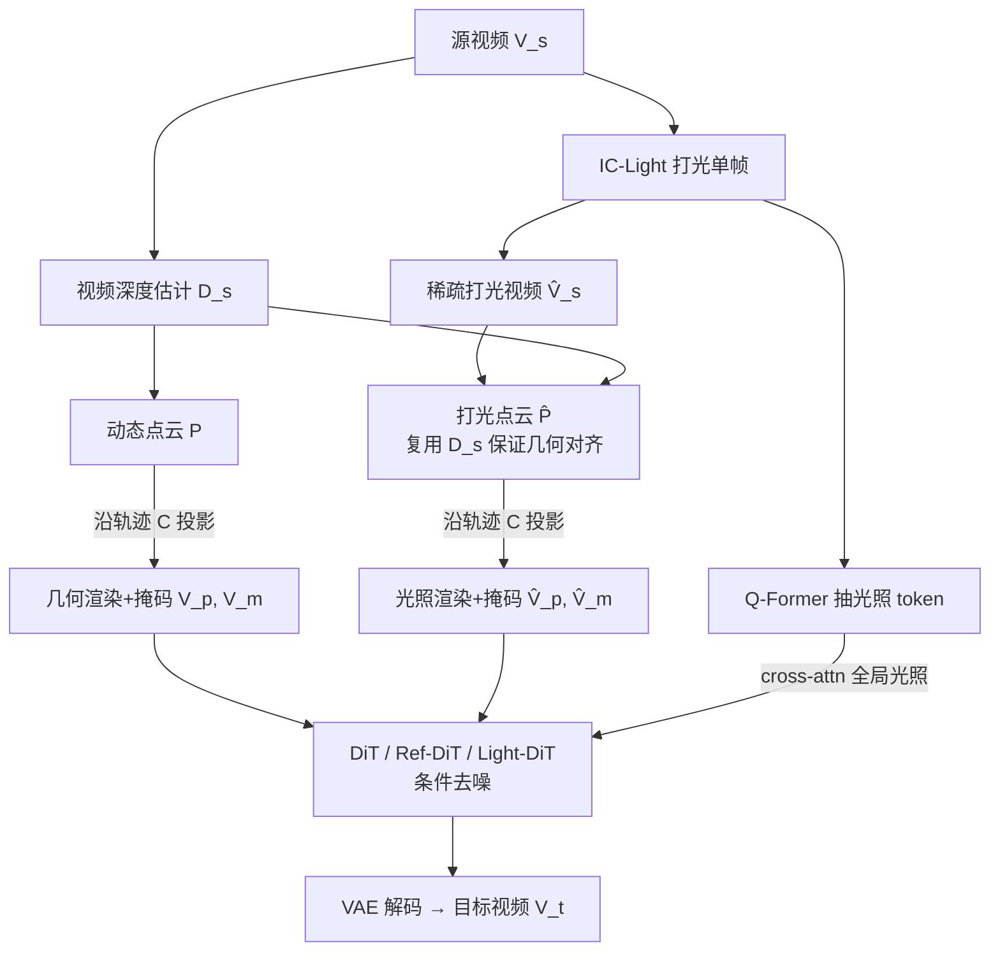

# Light-X: Generative 4D Video Rendering with Camera and Illumination Control

**会议**: ICLR 2026  
**OpenReview**: [https://openreview.net/forum?id=VBew6vESGL](https://openreview.net/forum?id=VBew6vESGL)  
**项目主页**: [https://lightx-ai.github.io/](https://lightx-ai.github.io/)  
**代码**: 待确认  
**领域**: 视频生成 / 可控视频渲染  
**关键词**: 视频重打光, 相机轨迹控制, 4D 视频生成, 视频扩散模型, 几何-光照解耦  

## 一句话总结
Light-X 把"相机视角"和"场景光照"两条原本割裂的可控视频生成路线第一次统一进同一个扩散模型里——通过把几何/运动与光照分别投影成两组点云作为细粒度条件来实现解耦，并用一条"退化+逆映射"的数据合成管线（Light-Syn）凭空造出真实世界几乎拿不到的"多视角×多光照"配对训练数据。

## 研究背景与动机
**领域现状**：从单目视频出发"重新渲染"真实场景一直沿着两条几乎不相交的路线走。一条是视频重打光（video relighting），多数是把单图方法（如 IC-Light）扩展到视频，要么靠免训练的跨帧融合（Light-A-Video），要么改架构加时序注意力（RelightVid）；另一条是相机可控视频生成（如 TrajectoryCrafter），能精确控制视角并保持时空一致，但完全不碰光照。

**现有痛点**：重打光方法被一个根本性的"光照保真度 vs 时序一致性"权衡卡住——单帧打光好看了，连起来就闪烁；压住闪烁，光照又变弱变假；而且它们都不支持相机控制。相机可控方法反过来只会换视角、不会改光。

**核心矛盾**：真实场景的视觉动态是几何、运动、光照**联合**塑造的，但现有方法只能控制其中一维。要做"联合控制"，必须既把几何/运动/光照**解耦**开来独立操作，又要让它们在最终画面里**协调一致**——视角一动，原本就难平衡的光照权衡会被进一步放大。更要命的是，要训练这种联合控制，需要"同一动态场景在不同视角×不同光照下"的配对视频，而这种数据在现实里几乎采集不到。

**本文目标**：构建第一个能从单目视频出发、**同时**控制相机轨迹与光照的视频生成模型。

**核心 idea**：
- **几何-光照解耦的细粒度条件**：用动态点云沿用户轨迹投影提供几何/运动线索，用"打光后的单帧"投影进同一套几何提供光照线索，让模型在几何对齐的空间里同时拿到这两组互补且解耦的显式提示。
- **退化+逆映射造数据（Light-Syn）**：把现成的野外视频当作"目标"，主动退化成"输入"并记录退化变换，再用其逆变换把目标的几何与光照"搬"回输入视角，从而凭空合成几何对齐的配对训练数据。

## 方法详解

### 整体框架
给定单目源视频 $V^s=\{I^s_i\}_{i=1}^f$，目标是在用户指定的相机轨迹 $C=\{[R_i,t_i]\}$ 和光照条件 $L$（可以是文本、HDR 环境贴图或参考图）下，重新渲染出同一动态场景的视频 $V^t$。Light-X 先用 IC-Light 给某一帧打光得到"稀疏打光视频"，再分别从源视频和打光帧估计深度、反投影成**动态点云**与**打光点云**，两套点云沿目标轨迹投影出几何对齐的渲染图与可见性掩码，连同 Q-Former 抽取的光照 token 一起喂进 DiT 做条件去噪，最后 VAE 解码出忠实于目标轨迹和光照的高保真视频。

### 关键设计

**1. 相机-光照解耦：两套点云分头承载几何与光照。** 这是整个方法的地基。相机控制走"几何"分支：从源视频估计深度 $D^s$，把每帧反投影成 3D 动态点云 $P_i=\Phi^{-1}(I^s_i, D^s_i; K)$，再沿用户轨迹投影回目标视角，得到几何对齐视图与可见性掩码 $I^p_i, M^p_i=\Phi(R_iP_i+t_i; K)$，作为约束视角运动的强几何先验。光照控制走"打光"分支：先用 IC-Light 按文本提示给任意一帧打光，构造一段只有那一帧有内容、其余全空白的稀疏打光视频 $\hat V^s$，再**复用源视频的深度** $D^s$（而不是重新估计）把打光帧反投影成打光点云 $\hat P_i=\Phi^{-1}(\hat I^s_i, D^s_i; K)$。复用深度是点睛之笔——它保证打光内容和原始内容落在**完全相同的几何**上，二者沿同一轨迹投影后天然像素对齐。如此一来几何/运动由 $V^p$ 携带、光照由 $\hat V^p$ 携带，两个因子被放进同一个几何对齐空间里既解耦又协调，模型拿到的是显式、细粒度、可独立操控的提示。

**2. 细粒度条件 + 全局光照控制：补住"离打光帧越远光越弱"的漏洞。** 投影出的四组线索 $V^p, V^m, \hat V^p, \hat V^m$ 先过 VAE 编码、与噪声沿通道拼接、patchify 成视觉 token，再和源视频抽取的文本 token 融合后进 DiT 去噪——其中 $V^p$ 扛场景内容/几何/运动，$\hat V^p$ 扛光照。但作者观察到一个实际问题：合成帧离那一帧"打光帧"越远，光照强度会逐渐衰减。为此他们加了**全局光照控制**：把打光帧单独 VAE 编码成 $T_{relit}$，用一组可学习光照 token $T^{(0)}_{illum}$ 作 query、$T_{relit}$ 作 key/value 经 Q-Former 抽出全局光照表示 $T_{illum}$，再通过 cross-attention 注入新增的 Light-DiT 层：$T'_{vision}=\mathrm{CrossAttn}(Q=T_{vision}, K=V=T_{illum})$。同时保留原 TrajectoryCrafter 的 DiT 与 Ref-DiT 模块分别聚合文本-视觉信息、维持与源视频的 4D 一致性。细粒度条件管"局部哪里该怎么打光"，全局控制管"整段视频光照别飘"，两者一上一下把光照保真和稳定一起兜住。

**3. Light-Syn：退化+逆映射，把"目标"造成"输入"。** 联合控制需要"多视角×多光照"配对视频，现实里采不到，作者反着来：拿一段高质量野外视频直接当**目标** $V^t$，主动**退化**它（如打光、编辑）得到**输入** $V^s$ 并记录退化变换，再施加这些变换的**逆映射**，把 $V^t$ 的几何与光照"搬运"到 $V^s$ 视角，生成空间对齐的条件线索 $(V^p, V^m)$ 和 $(\hat V^p, \hat V^m)$。监督信号天然来自原始高保真视频（"退化版当输入、原版当监督"）。数据来自三类互补来源：静态场景（8k，提供准确多视角对）、动态场景（8k，提供真实运动）、AI 生成视频（2k，丰富光照多样性），共同满足训练需求。

**4. 软掩码实现"一模型通吃多种光照条件"。** 训练数据虽为联合控制而造，但解耦+掩码机制天然支持独立使用：要纯相机控制就把打光帧换回原始帧以保留光照；要纯重打光就令 $V^p=V^s$、$V^m$ 全可见、用稀疏打光视频替换 $\hat V^p$。更进一步，框架可吃 HDR 环境贴图、参考图等多样光照提示——关键技巧是给不同模态的条件赋不同强度的**软掩码** $(\hat V^p,\hat V^m)=(V_k,\alpha_k\mathbf{1})$，其中 $\alpha_{ref}=0.25$、$\alpha_{hdr}=0.50$。这些软掩码充当"域指示器"，让单个模型在文本、背景图、HDR、参考图等多种光照条件间泛化而不互相干扰。

## 实验关键数据

### 主实验：联合相机-光照控制
由于没有现成方法做联合控制，作者用组合 baseline 对比（TC=TrajectoryCrafter，LAV=Light-A-Video，TL-Free=免训练）：

| 方法 | FID ↓ | Aesthetic ↑ | Motion Pres. ↓ | CLIP ↑ | 用户偏好(选 Ours %) | 耗时 ↓ |
|---|---|---|---|---|---|---|
| TC+IC-Light | / | 0.573 | 6.558 | 0.976 | 88~92 | 3.25 min |
| TC+LAV | 138.89 | 0.574 | 4.327 | 0.986 | 84~89 | 4.33 min |
| LAV+TC | 144.61 | 0.596 | 5.027 | 0.987 | 85~89 | 4.33 min |
| TL-Free | 122.73 | 0.595 | 3.356 | 0.987 | 88~89 | 5.50 min |
| **Ours** | **101.06** | **0.623** | **2.007** | **0.989** | / | **1.83 min** |

用真实野外视频作 GT 的额外评测（Table 2）：Ours 取得 PSNR 13.96 / SSIM 0.582 / LPIPS 0.378 / FVD 45.91，全面优于最强 baseline TL-Free（13.49 / 0.547 / 0.418 / 54.44）。Light-X 不仅指标最好，耗时还最短。

### 视频重打光（文本条件）

| 方法 | FID ↓ | Aesthetic ↑ | Motion Pres. ↓ | CLIP ↑ |
|---|---|---|---|---|
| IC-Light | / | 0.632 | 3.293 | 0.983 |
| LAV | 112.45 | 0.614 | 2.115 | 0.991 |
| **Ours** | **83.65** | **0.645** | **1.137** | **0.993** |

真实视频作 GT 时（Table 4）Ours 也全面领先（PSNR 13.84 / SSIM 0.581 / LPIPS 0.369 / FVD 56.60）。背景图条件的前景重打光（Table 5）同样取得最优 FID 61.75 与最低 Motion Pres. 0.220。

### 消融实验

| 消融项 | FID ↓ | Aesthetic ↑ | Motion Pres. ↓ |
|---|---|---|---|
| (a.i) 去静态数据 | 123.35 | 0.594 | 3.749 |
| (a.ii) 去动态数据 | 108.70 | 0.621 | 2.635 |
| (a.iii) 去 AI 生成数据 | 102.09 | 0.613 | 2.498 |
| (b.i) 去细粒度光照线索 | 143.02 | 0.602 | 2.242 |
| (b.ii) 去全局光照控制 | 103.13 | 0.612 | 2.348 |
| (b.iii) 光照+文本拼接(替代) | 137.05 | 0.596 | 2.654 |
| (c.i) 用算法输出当 GT | 137.83 | 0.524 | 4.066 |
| (c.ii) 打光全部帧 | 71.10 | 0.571 | 4.238 |
| (c.iii) 去软掩码 | 148.51 | 0.545 | 2.879 |
| **Ours** | **101.06** | **0.623** | **2.007** |

### 关键发现
- **细粒度光照线索是命门**：去掉后 FID 从 101 暴涨到 143，光照先验完全用不上；用简单的"光照+文本拼接"（RelightVid 做法）也救不回来。
- **"只打一帧"胜过"打全部帧"**：c.ii 把所有帧都打光虽然 FID（71.10）更低，但 Motion Pres. 飙到 4.238、时序一致性崩坏——这印证了"稀疏打光+点云传播"设计的合理性，单帧光照经几何对齐传播反而更稳。
- **软掩码不可省**：去掉后 FID 高达 148.51，不同光照域混在一起互相干扰。
- **数据三件套各司其职**：静态数据撑跨视角合成、动态数据防运动伪影、AI 生成数据兜住霓虹等稀有光照的鲁棒性。

## 亮点与洞察
- **"复用深度"这个小动作四两拨千斤**：打光点云不重新估深度而是借用源视频的深度，一句话就把"打光内容 ↔ 原始几何"对齐问题解决了，这是解耦能成立的隐形支点。
- **把数据稀缺问题转化为"可逆退化"问题**：Light-Syn 的逆映射思路很优雅——既然采不到"多视角×多光照"配对，就反过来从高质量目标主动造退化输入，监督信号天然干净（原版即 GT），还能从静态/动态/AI 三类来源各取所需。
- **统一性强**：解耦+软掩码让一个模型同时覆盖联合控制、纯相机控制、纯重打光、HDR/参考图条件等多种任务，而不是为每个任务训一个模型。
- **效率反直觉地好**：作为扩散方法却比所有组合 baseline 都快（1.83 min vs 3~5.5 min），因为联合控制一步到位、省掉了"先打光再换视角"的串联开销。

## 局限与展望
- **受单图打光先验拖累**：光照线索来自 IC-Light，若其在某些场景打光质量差，会连累后续视频生成质量——属于"地基决定上限"的依赖。
- **依赖点云做新视角先验**：深度估计不准会导致几何偏差进而降质；且受限于 3D 线索稀疏和视频扩散的生成长度，难以应付 360° 等大幅相机运动。
- **细节与算力老问题**：手部等精细细节仍难处理，多步去噪计算开销大。作者展望换更强 backbone（Wan2.2）、渐进式点云扩展支持大范围相机、以及 Diffusion Forcing / Self Forcing 延长视频长度。

## 相关工作与启发
- **承接两条独立路线并把它们焊在一起**：视频重打光（IC-Light → Light-A-Video → RelightVid）专注光照却不控相机；相机可控生成（TrajectoryCrafter 等用深度/tracking 显式几何线索）专注视角却不控光。Light-X 的贡献正是论证了"几何对齐空间里的显式点云条件"能同时承载这两维。
- **对做可控生成的启发**：当两个控制因子难以联合建模时，与其在隐空间里硬解耦，不如把它们各自渲染成几何对齐的显式条件——显式、细粒度、空间对齐的提示比抽象 embedding 更好学、更可独立操控。
- **对数据匮乏任务的启发**："退化+逆映射"是一种通用的配对数据合成范式：当正向采集不可行时，从高质量样本反向构造输入，可同时获得干净监督与对齐条件。

## 评分
- **新颖性**: ⭐⭐⭐⭐⭐ 第一个把相机轨迹与光照联合控制统一进单一视频扩散模型；几何对齐双点云解耦 + Light-Syn 逆映射造数据两个设计都很有原创性。
- **实验充分度**: ⭐⭐⭐⭐ 覆盖联合控制 + 文本/背景/HDR/参考图多种重打光设置，含组合 baseline、真实视频 GT 评测、用户研究和详尽的三维度消融；缺点是无现成联合控制 baseline 只能靠组合方法对比。
- **写作质量**: ⭐⭐⭐⭐ 动机与挑战梳理清晰，方法图（Fig.2/3）把解耦流程讲得直观；公式与符号略密集但逻辑自洽。
- **价值**: ⭐⭐⭐⭐ 面向 AR/VR、影视后期等"重渲染真实素材"的实际场景，统一框架 + 数据合成管线都具备可复用价值，为可控生成式 4D 渲染开了个方向。

<!-- RELATED:START -->

## 相关论文

- [\[CVPR 2026\] LaVR: Scene Latent Conditioned Generative Video Trajectory Re-Rendering using Large 4D Reconstruction Models](../../CVPR2026/video_generation/lavr_scene_latent_conditioned_generative_video_trajectory_re-rendering_using_lar.md)
- [\[ICCV 2025\] ReCamMaster: Camera-Controlled Generative Rendering from A Single Video](../../ICCV2025/video_generation/recammaster_camera-controlled_generative_rendering_from_a_single_video.md)
- [\[CVPR 2026\] LightMover: Generative Light Movement with Color and Intensity Controls](../../CVPR2026/video_generation/lightmover_generative_light_movement_with_color_and_intensity_controls.md)
- [\[ICLR 2026\] MoCa: Modeling Object Consistency for 3D Camera Control in Video Generation](moca_modeling_object_consistency_for_3d_camera_control_in_video_generation.md)
- [\[CVPR 2026\] SpaceTimePilot: Generative Rendering of Dynamic Scenes Across Space and Time](../../CVPR2026/video_generation/spacetimepilot_generative_rendering_of_dynamic_scenes_across_space_and_time.md)

<!-- RELATED:END -->
