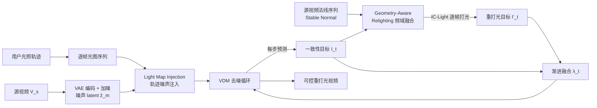

# LightCtrl: Training-free Controllable Video Relighting

**会议**: ICLR 2026  
**OpenReview**: [https://openreview.net/forum?id=5ft8vd9rwc](https://openreview.net/forum?id=5ft8vd9rwc)  
**代码**: [https://github.com/GVCLab/LightCtrl](https://github.com/GVCLab/LightCtrl)  
**领域**: 视频生成 / 可控视频重打光  
**关键词**: 视频重打光, 光照轨迹控制, 训练无关, 扩散先验, 频域融合  

## 一句话总结
LightCtrl 把"图像重打光模型逐帧打光 + 视频扩散先验保时序一致"的训练无关范式，扩展成第一个支持**用户自定义光照轨迹**的可控视频重打光方法——靠光图注入（Light Map Injection）和几何感知重打光（Geometry-Aware Relighting）两个模块，让生成视频的光照沿着用户画的轨迹动起来，同时压住源视频原有光照的干扰。

## 研究背景与动机
**领域现状**：扩散模型在图像重打光上已经很成熟，IC-Light 直接微调预训练 T2I 生成器、按给定光照条件重打光成为 SOTA；这套成功很快被复制到视频上——RelightVid 通过构造高质量多光照视频数据集训练视频扩散模型（VDM），Light-A-Video 则走训练无关路线，把图像模型逐帧打光的结果渐进地融进 VDM 的去噪过程换取时序一致。

**现有痛点**：这些方法只能"换个光照风格"，**无法显式控制光照在视频里怎么动**。RelightVid 这类训练方法依赖昂贵的数据制作；Light-A-Video 这类训练无关方法虽然便宜，但它的强时序一致约束反而把光照"摊平"了，面对左到右、自上而下、圆周运动这类多样轨迹时控制力严重不足。更关键的是，现有工作忽视了**局部光影动态变化对视频叙事和情绪表达的作用**——一束光打在角落能强调角色内心张力，一道突然的光能点亮关键剧情。

**核心矛盾**：可控性 ↔ 时序一致性。逐帧 IC-Light 控制力强但帧间闪烁；加 VDM 先验能压住闪烁，但强一致约束会把用户想要的光照运动也一起抹掉。

**本文目标**：定义**可控视频重打光（controllable video relighting）**任务——给一段源视频、一个重打光 prompt、一条用户自定义光照轨迹，生成新光照的视频，光照精确跟随轨迹逐帧变化，同时保留源视频内容、维持时序一致，且**全程训练无关**。

**核心 idea**：**[轨迹即控制信号]** 把用户画的光照轨迹合成成逐帧光图（light map）序列，再以两种方式注入——一是作为噪声先验注入 VDM 的初始 latent 引导光照运动，二是借助源视频法线图在频域里抑制原始光照泄漏——从而在零训练成本下拿到显式可控的光照动态。

## 方法详解

### 整体框架
LightCtrl 沿用训练无关视频编辑范式（SDEdit 式）：把 $l$ 帧源视频 $V_s$ 编码成 latent $\hat z_0$，加 $T_m$ 步噪声得到噪声 latent $\hat z_m$；再用 **Light Map Injection 模块**把用户轨迹注入进去得到 $z_m$，让后续去噪先天带上"生成对应光照轨迹"的先验。之后进入 VDM 去噪循环：每个去噪步 $t$ 先预测 0 步无噪 latent $\hat z_{0\leftarrow t}$ 并解码成一致性目标 $I_t=D(z_{0\leftarrow t})$，送入 **Geometry-Aware Relighting 模块**做逐帧重打光得到 $I'_t$，最后用随去噪推进而递减的权重 $\lambda_t$ 做渐进融合 $\bar I_t=(1-\lambda_t)I_t+\lambda_t I'_t$，再编码回 latent 引导下一步去噪。这样 VDM 负责时序一致，IC-Light 负责高质量逐帧打光，两者互补。

### 关键设计

**1. Light Map Injection：把光照轨迹写进初始噪声。** 单靠 IC-Light 把光图当背景参考做逐帧打光，只能在帧级实现弱控制，面对 VDM 多步去噪很快被"洗掉"。受 FreeTraj 用噪声引导物体运动的启发，作者把这一思路迁移到"引导光照运动"上。具体做法是：根据用户轨迹（比如圆形光源，用户给出起止半径和位置，逐帧线性插值出半径和位置）合成逐帧光图掩码 $M$，在光图覆盖区域采样一团随机高斯噪声 $\epsilon_{random}$ 注入初始噪声 latent。但直接用 $\epsilon_{random}$ 替换掩码区会产生严重视觉伪影，于是用加权融合：

$$
z^k_m = \begin{cases} \hat z^k_m & M_k[i,j]=0 \\ \omega\cdot\epsilon_{random} + (1-\omega)\cdot\hat z^k_m & M_k[i,j]=1 \end{cases}
$$

其中 $\omega$ 是精细调过的融合权重，平衡局部随机噪声与原始噪声以保证平滑过渡。这样轨迹信息同时注入到图像模型和视频模型，显著提升生成光照对输入轨迹的贴合度。

**2. Geometry-Aware Relighting：用法线在频域里压住源光照泄漏。** 光图注入虽能控制光怎么动，但源视频自身的光环境会泄漏到输出——比如光照方向从左切到右时，人脸左侧还残留着错误的亮部。作者引入表面法线图作为几何先验来修正：法线 latent 含有更强的结构信息且能零样本利用，但若直接拿来融合会因预训练模型导致模糊、损细节，于是改在频域做动态融合。每个去噪步用 Stable Normal 预测逐帧法线 $N$，把法线 latent $z_{normal}$ 和一致性 latent $z_{0\leftarrow t}$ 都经 3D FFT 变到频域，用一个截止频率为 $\alpha$ 的动态 3D Butterworth 滤波器 $H_\alpha(t)$ 分离高低频：

$$
\tilde z_t = \text{IFFT}_{3D}\big(\text{FFT}_{3D}(z_{normal})\odot H_\alpha(t) + \text{FFT}_{3D}(z_{0\leftarrow t})\odot(1-H_\alpha(t))\big)
$$

去噪循环里 $\alpha$ 线性递减，$H_\alpha(t)$ 从全通逐渐变成低通：去噪初期完全采用法线 latent 来"洗掉"原始光照分布，后期只保留法线的低频结构、逐步补回一致性 latent 的高频细节。融合结果 $\tilde z_t$ 喂给逐帧 IC-Light 打光，既消除干扰光照又保住细节。

**3. 渐进融合与初始细节残差：兼顾打光强度与内容保真。** 为了避免 VDM 渐进去噪过程中源视频细节流失，作者在第一步解码图 $I_m$ 和源视频 $V_s$ 之间逐像素算初始细节残差 $\Delta d$，加回一致性目标后再送入打光模块。融合权重 $\lambda_t=1-t/T_m$ 随去噪推进递减（同时也作为频域截止频率 $\alpha=\lambda_t$），让早期更依赖重打光结果建立光照、后期更依赖一致性目标稳定内容，在打光力度和时序连贯之间取得平衡。

## 实验关键数据

设置：测试集 50 段视频（主要来自 Pixabay），每段套用 6 种预定义光照轨迹（左到右、自上而下、圆周运动等，含半径与轨迹变化）。图像模型用 IC-Light，VDM 用 AnimateDiff，$T_m=25$。基线包括逐帧 IC-Light、IC-Light+SDEdit（噪声 0.2 / 0.6）、以及把轨迹光图作背景喂给 Light-A-Video 的 LAV-Traj。指标含视频质量（AQ↑、FVD↓）、控制力（PSNR$_y$↑、PSNR$_{light}$↑），以及 40 人用户研究四维偏好（VS 平滑度 / LC 可控性 / LQ 光照质量 / ALT 光文一致）。

### 主实验表格

| 方法 | AQ↑ | FVD↓ | PSNR$_y$↑ | PSNR$_{light}$↑ | VS↑ | LC↑ | LQ↑ | ALT↑ |
|------|-----|------|-----------|------------------|-----|-----|-----|------|
| IC-Light | 0.5937 | 1018.5 | 11.059 | 15.850 | 1.00% | 15.00% | 3.00% | 9.73% |
| IC-Light+SDEdit-0.2 | 0.5907 | 1134.8 | 11.009 | 16.249 | 2.50% | 2.00% | 0.50% | 3.00% |
| IC-Light+SDEdit-0.6 | 0.5681 | 1630.9 | 10.980 | 16.385 | 4.75% | 1.09% | 0.50% | 3.27% |
| LAV-Traj | **0.6157** | 1077.4 | 11.043 | 17.755 | 23.50% | 4.00% | 20.00% | 10.27% |
| **LightCtrl (Ours)** | 0.6114 | **993.1** | **11.768** | **18.532** | **68.25%** | **77.91%** | **74.86%** | **73.73%** |

### 消融实验表格

| 配置 | 效果（定性，Fig. 5） |
|------|------|
| LAV-Traj（基线） | 强时序一致约束 → 无法处理连续变化的光照轨迹 |
| + Geometry-Aware Relighting | 人脸光照更合理，不受源视频光照分布影响；去掉 GAR 时草坪等背景仍被源光照错误高亮（红框） |
| + Light Map Injection | 注入轨迹噪声后光照更可控，同时更好保留视频整体细节 |

### 关键发现
- **可控性指标全面领先**：LightCtrl 在 PSNR$_y$ 和 PSNR$_{light}$ 上都拿最高，说明掩码区光照最接近"纯白"（光最足）且光图叠加一致性最好。
- **质量与可控性的平衡**：LAV-Traj 凭强一致约束拿到最高 AQ，但代价是可控性垮掉；LightCtrl 在 FVD 上最低、AQ 接近最优，做到了"既可控又一致"。
- **用户研究压倒性偏好**：四个维度（平滑度/可控性/光照质量/光文一致）LightCtrl 均拿 68%–78% 的偏好，远超所有基线。
- **SDEdit 不是解法**：单纯加噪去噪只能平滑视频、无法对光照施加一致性约束，质量和可控性指标全低。

## 亮点与洞察
- **任务定义本身是贡献**：把"可控视频重打光（用户自定义光照轨迹）"作为一个新任务提出来，抓住了现有重打光方法忽视的"局部光影动态服务叙事"这个真实创作需求。
- **训练无关却拿到显式控制**：不训练任何模块，纯靠在初始噪声里注入轨迹 + 频域几何修正，就把"光照怎么动"这件事控制住了，复用成本极低。
- **"噪声引导运动"思路的迁移很巧**：把 FreeTraj 用噪声引导物体运动的经验迁移到引导光照运动，揭示了扩散初始噪声对生成动态的强先验作用。
- **频域动态滤波解耦光照与细节**：用随去噪推进从全通滑向低通的 Butterworth 滤波器，让法线先洗光照、后期再补细节，是一个干净的"先去污后补细节"调度。

## 局限与展望
- **依赖底座能力**：方法建立在现成图像打光模型和 VDM 之上，性能受其上限约束；当光路扫过前景时人脸会出现异常闪烁。
- **缺乏 3D 光路感知**：当前不能对光路做 3D 理解，难以处理真实空间中的光照遮挡关系。
- **强阴影难消除**：即便用了几何感知信息，源视频里明显的阴影仍残留（如"猫"案例右侧阴影在重打光后依然存在）。
- **展望**：作者计划接入更新的视频生成底座、设计更高级的网络，以获得更高质量的可控光照。

## 相关工作与启发
- **图像重打光**：IC-Light（本文的逐帧打光底座，靠光传输一致性约束微调 SD）、DiLightNet、SwitchLight、Relightful Harmonization 等——但逐帧套用到视频会时序不一致。
- **视频重打光**：RelightVid（训练式，靠高质量数据集）、Light-A-Video（训练无关，本文范式来源与主要对比对象 LAV-Traj 的基础）。
- **可控视频生成 / 训练无关控制**：FreeTraj（频域融合对齐轨迹与框，本文"噪声注入引导光照运动"的直接灵感）、Trailblazer、Peekaboo、ControlNet 系——启发了"用注入式信号在不训练的前提下拿控制"的整体思路。
- **启发**：扩散模型的"初始噪声"是被低估的可控性入口；把别处（物体运动控制）验证过的噪声/频域技巧迁移到新任务（光照控制），是低成本拿到新能力的高性价比路线。

## 评分
- **新颖性**: ⭐⭐⭐⭐ 首次定义并解决"用户自定义光照轨迹的可控视频重打光"，光图注入 + 频域几何修正的组合在训练无关设定下颇有巧思，但底层技巧（噪声引导、频域融合、逐帧打光+VDM）多为已有思路的迁移组合。
- **实验充分度**: ⭐⭐⭐ 50 视频 × 6 轨迹 + 40 人用户研究，定量定性都做了，消融清晰；但测试集偏小、缺乏与训练式 RelightVid 的直接定量对比，指标设计（PSNR vs 纯白）也较间接。
- **写作质量**: ⭐⭐⭐⭐ 动机讲得有画面感（局部光影服务叙事），两个模块的 pipeline 和频域调度交代清楚，公式与图配合到位。
- **价值**: ⭐⭐⭐⭐ 面向视频创作的真实需求，训练无关意味着易复用、可即插现成模型，对内容创作工具链有实际落地价值。

<!-- RELATED:START -->

## 相关论文

- [\[CVPR 2026\] FlowPortal: Residual-Corrected Flow for Training-Free Video Relighting and Background Replacement](../../CVPR2026/video_generation/flowportal_residual-corrected_flow_for_training-free_video_relighting_and_backgr.md)
- [\[ICLR 2026\] FreeViS: Training-free Video Stylization with Inconsistent References](freevis_training-free_video_stylization_with_inconsistent_references.md)
- [\[ICLR 2026\] Frame Guidance: Training-Free Guidance for Frame-Level Control in Video Diffusion Models](frame_guidance_training-free_guidance_for_frame-level_control_in_video_diffusion.md)
- [\[CVPR 2026\] FlowMotion: Training-Free Flow Guidance for Video Motion Transfer](../../CVPR2026/video_generation/flowmotion_training-free_flow_guidance_for_video_motion_transfer.md)
- [\[ICLR 2026\] Real-Time Motion-Controllable Autoregressive Video Diffusion](real-time_motion-controllable_autoregressive_video_diffusion.md)

<!-- RELATED:END -->
