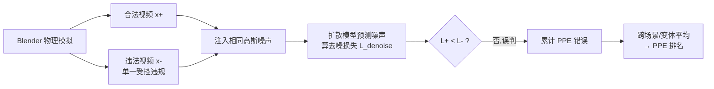

# LikePhys: Evaluating Intuitive Physics Understanding in Video Diffusion Models via Likelihood Preference

**会议**: ICLR 2026  
**OpenReview**: [https://openreview.net/forum?id=6UJf6B8RZ8](https://openreview.net/forum?id=6UJf6B8RZ8)  
**代码**: [https://yuanjianhao508.github.io/LikePhys/](https://yuanjianhao508.github.io/LikePhys/)  
**领域**: 视频生成 / 直觉物理评测  
**关键词**: 视频扩散模型, 直觉物理, 似然偏好, 违反预期范式, 世界模型, 训练无关评测  

## 一句话总结
LikePhys 把扩散模型的去噪损失当作 ELBO 似然代理，在「物理合法 vs 不合法」的成对合成视频上比较谁的似然更高，从而免训练地量化视频扩散模型的直觉物理理解能力，并给出与人类偏好高度一致的 PPE 评测指标。

## 研究背景与动机
- **领域现状**：视频扩散模型（VDM）已能生成视觉上以假乱真的视频，并被寄望成为机器人、自动驾驶的通用「世界模型」，但它们仍频繁产出违反物理常识的内容（超弹性反弹、物体穿模、影子错位等）。
- **现有痛点**：怎么客观地度量一个 VDM「懂不懂物理」很难。一类方法用 VLM 做问答式打分（VideoPhy 系列），但会被不同模型的视觉风格偏差、prompt 模板差异和判官主观性污染；另一类（Physics-IQ、Morpheus）靠真实视频做像素/物理量对齐，但依赖图像条件生成，无法迁移到纯文本到视频的 VDM。
- **核心矛盾**：评测时**物理正确性**和**视觉外观**纠缠在一起——一个看起来很精美的视频未必物理合理，反之亦然，现有指标难以把两者解耦。
- **本文目标**：提出一个模型无关、外观无关、免训练的协议，直接探测 VDM 学到的物理分布，而不是去看它生成了什么。
- **核心 idea**：**【似然即理解】** 借鉴认知科学的「违反预期范式」，假设——一个真正学懂物理的扩散模型，应对合法样本赋予更高似然、对违法样本赋予更低似然；而去噪损失恰好是负对数似然的 ELBO 上界代理，于是「合法样本去噪损失更低」就成了物理理解的可测信号。

## 方法详解

### 整体框架
LikePhys 用 Blender 渲染「合法/违法」成对视频（仅物理合规性不同，外观严格一致），向两段视频注入相同高斯噪声，喂进待测扩散模型预测噪声并算去噪损失，比较哪段损失更低；统计模型在所有成对样本上「把更高似然误判给违法样本」的比例，得到单一标量指标 PPE（Plausibility Preference Error，越低越好）。整套流程零样本、不微调任何模型。

### 关键设计

**1. 把去噪损失当似然代理，将物理理解形式化为似然偏好：** 论文从分布视角定义物理理解。记 $p_{\rm phys}(x)$ 为严格遵守物理定律的视频分布，合法样本 $x^+$ 落在其支撑集内、违法样本 $x^-$ 在外。一个完美理解物理的模型 $p_\theta$ 应对每一对都满足 $p_\theta(x^+) > p_\theta(x^-)$。由扩散的训练目标可知去噪损失是负对数似然的 ELBO 代理：$\mathcal{L}_{\rm denoise}(\theta;x_t) = \mathbb{E}_{t,\epsilon}\|\epsilon - \epsilon_\theta(x_t,t)\|^2 \ge \mathbb{E}_{x_0}[-\log p_\theta(x_0)] + \text{const}$，于是似然比较可等价转写为损失比较：$p_\theta(x^+) > p_\theta(x^-) \Longleftrightarrow \mathcal{L}_{\rm denoise}(\theta;x^+) < \mathcal{L}_{\rm denoise}(\theta;x^-)$。这把抽象的「懂物理」落到一个可计算、可比较的损失差上，且不需要模型具备判别头或图像条件。

**2. Plausibility Preference Error（PPE）指标：** 对每个物理场景构造 $R=10$ 个变体（变化物理参数与外观干扰因子），每个变体内有 $M$ 个合法、$N$ 个违法样本。对成对样本注入同一时刻的同一噪声、跨多个 DDIM 时间步平均去噪损失，再统计模型把更高似然（更低损失）误派给违法样本的比例：$\text{PPE} = \frac{1}{R}\sum_{r=1}^{R}\frac{1}{M_r N_r}\sum_{j,k}\mathbf{1}[\mathcal{L}_{\rm denoise}(\theta;x_{r,j}^+) \ge \mathcal{L}_{\rm denoise}(\theta;x_{r,k}^-)]$。50% 即随机猜测的临界线，低于它才说明模型真正偏好物理合法的视频。由于成对样本视觉外观一致，因视觉风格带来的似然差会在配对比较中相互抵消，从而把物理正确性从外观中解耦。

**3. 外观受控的成对合成基准：** 真实世界拿不到「只违反物理、其余全同」的配对，论文用 Blender 在 512×512、60 帧下渲染 12 个场景、覆盖刚体力学、连续介质力学、流体力学、光学效应四大物理域。每个变体内固定相机、光照、纹理、几何，合法样本守恒动量/能量、自由落体，违法样本只引入单一受控违规（超弹反弹、瞬移、反向流动、影子错位等）。这种「单变量」设计保证测得的似然差只能归因于物理违规，使指标天然外观无关、模型无关。

## 实验关键数据

### 主实验：12 个 VDM 的 PPE 排名（%，越低越好，节选）

| 模型 | 架构 | 平均 PPE |
|------|------|---------|
| Hunyuan T2V | DiT | **43.6** |
| Wan2.1-T2V-14B | DiT | 43.8 |
| CogVideoX1.5-5B | DiT | 43.8 |
| LTX v0.9.5 | DiT | 44.7 |
| CogVideoX-2B | DiT | 48.2 |
| Mochi | DiT | 51.9 |
| ModelScope | UNet | 52.9 |
| ZeroScope | UNet | 53.3 |
| AnimateDiff | UNet | 60.8 |

→ DiT 架构整体优于早期 UNet 架构，但即便最好模型 PPE 仍接近 44%，离 50% 随机线不远，说明物理理解远未成熟。

### 与人类偏好的一致性（Kendall's τ，越高越好）

| 评测器 | 总体 τ |
|--------|--------|
| VideoPhy | 38.9 |
| VideoPhy2 | -8.5 |
| Qwen2.5-VL | 33.3 |
| **LikePhys (PPE)** | **44.4** |

→ PPE 在不使用任何下游模型生成视频的情况下，与人类物理一致性打分的相关性最高。

### 与视觉质量解耦（PPE 与 VBench 指标的 Pearson 相关）

| 视觉指标 | 相关系数 |
|---------|---------|
| 美学质量 | -0.05 |
| 主体一致性 | -0.01 |
| 背景一致性 | -0.01 |
| 运动平滑度 | 0.15 |
| 时序闪烁 | 0.12 |

→ PPE 与美学/一致性几乎零相关，证明它度量的是与视觉质量正交的物理维度。

### 关键发现
- **模型/数据/帧数缩放有效**：模型越大、训练数据越多、输出帧数越多，PPE 越低；最大模型几乎全是 DiT 架构。
- **CFG 强度几乎无影响**：物理理解主要由学到的分布决定，推理期的 CFG 标定只起边际作用——可放心为视觉质量调 CFG 而不损物理。
- **域间差异显著**：流体力学误差最高且方差最大（复杂河流常超 70%），光学效应误差最低（大规模图像先验强约束几何/光度规律）。
- **物理定律层面**：时序连续性方差最大、能量/质量守恒误差高（标准训练目标缺全局约束），几何不变性与光学一致性满足得最好。
- **协议鲁棒**：均匀采样 10 个时间步即可稳定估计；对 8 种 prompt 变体的判别性能无显著变化。

## 亮点与洞察
- **视角新颖**：跳出「让模型生成再打分」的主流路线，转而直接读取模型内部的似然分布，把生成模型当密度估计器用，绕开了生成质量对评测的干扰。
- **解耦优雅**：用「外观一致的成对样本 + 配对比较」让视觉风格的似然偏置自动抵消，是把物理从外观中剥离的关键巧思。
- **免训练、模型无关**：不需微调判官、不需图像条件，可零样本套到任何文本到视频扩散模型上，工程门槛极低。
- **诊断价值**：不仅给排名，还能拆解到物理域和物理定律，指出 VDM 在流体/时序连续性/守恒律上的系统性短板，为下一步「物理感知训练」指方向。

## 局限与展望
- **依赖合成数据**：基准全部在 Blender 渲染，场景被刻意设计得简单且单一违规，真实世界复杂、多违规、混沌动力学的物理理解未必能等价外推。
- **绑定扩散框架**：方法以去噪损失为似然代理，对非扩散类生成器（如自回归视频模型、流匹配的非标准目标）的适配性需另行验证。
- **指标天花板**：PPE 衡量的是「偏好方向是否正确」，无法刻画错误的严重程度，也不能直接转化为如何修复物理错误的可操作信号。
- **展望**：作者建议未来工作走向更长上下文训练、多尺度记忆，以及显式促进守恒与连续性的物理感知训练目标。

## 相关工作与启发
- **违反预期范式（VoE）**：源自认知科学（Spelke、Baillargeon）与 IntPhys1/2，用受控成对视频测物理理解；LikePhys 把它从判别式视觉模型迁移到生成式 VDM，并去掉了对条件生成/像素对齐的依赖。
- **VLM 打分路线**：VideoPhy1/2、Qwen-VL 等用问答模板评物理；LikePhys 以更高的人类相关性证明「读似然」比「读生成」更稳更省。
- **像素/物理量对齐路线**：Physics-IQ、Morpheus 靠真实视频对齐物理量，但需图像条件；LikePhys 的纯文本、外观无关设计是对该路线的补位。
- **启发**：扩散模型的去噪损失作为似然代理这一思路，可推广到「评测生成模型是否学到某类结构性先验」的更广问题，例如几何一致性、因果性、可供性等。

## 评分
- **新颖性**: ⭐⭐⭐⭐⭐ 把去噪损失当似然代理、用违反预期范式评 VDM 物理理解，视角清新且把「物理 vs 外观」解耦做得干净。
- **实验充分度**: ⭐⭐⭐⭐ 覆盖 12 个 SOTA 模型、4 物理域、人类偏好对齐、视觉解耦、缩放因子、协议鲁棒性多维度验证，较完整；但基准局限于合成简单场景。
- **写作质量**: ⭐⭐⭐⭐ 动机—形式化—指标—基准逻辑清晰，公式与图示配合到位，物理域/定律分析有洞察。
- **价值**: ⭐⭐⭐⭐⭐ 为「VDM 作为世界模型」提供了一把免训练、可解耦、人类对齐的物理理解标尺，对物理感知视频生成的研究有直接指导意义。

<!-- RELATED:START -->

## 相关论文

- [\[CVPR 2026\] LocalDPO: Direct Localized Detail Preference Optimization for Video Diffusion Models](../../CVPR2026/video_generation/mind_the_generative_details_direct_localized_detail_preference_optimization_for_.md)
- [\[ICLR 2026\] Vid2World: Crafting Video Diffusion Models to Interactive World Models](vid2world_crafting_video_diffusion_models_to_interactive_world_models.md)
- [\[ICLR 2026\] Target-Aware Video Diffusion Models](target-aware_video_diffusion_models.md)
- [\[ICLR 2026\] VMoBA: Mixture-of-Block Attention for Video Diffusion Models](vmoba_mixture-of-block_attention_for_video_diffusion_models.md)
- [\[AAAI 2026\] OmniVDiff: Omni Controllable Video Diffusion for Generation and Understanding](../../AAAI2026/video_generation/omnivdiff_omni_controllable_video_diffusion_for_generation_and_understanding.md)

<!-- RELATED:END -->
