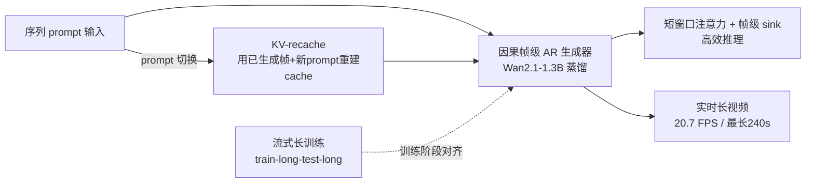

# LongLive: Real-time Interactive Long Video Generation

**会议**: ICLR 2026  
**代码**: [https://github.com/NVlabs/LongLive](https://github.com/NVlabs/LongLive)  
**领域**: 视频生成 / 自回归长视频 / 实时交互生成  
**关键词**: 长视频生成, 帧级自回归, KV-recache, 流式长训练, 注意力 sink, 实时交互  

## 一句话总结
LongLive 用帧级因果自回归框架，配合 KV-recache、流式长训练（train-long-test-long）和短窗口注意力 + 帧级 attention sink 三件套，把 1.3B 短片模型在 32 GPU-天内微调成能在单张 H100 上以 20.7 FPS 实时生成、支持随时切换 prompt、最长 240 秒的交互式长视频生成器。

## 研究背景与动机
**领域现状**：长视频生成对叙事、教育、影视都有价值，但现有路线各有死穴。扩散模型与 diffusion-forcing 模型画质好，却依赖双向注意力、无法用 KV cache，导致推理极慢——SkyReels-V2 生成 60 秒视频要在 H100 上跑约 50 分钟。因果注意力的自回归（AR）模型能复用 KV cache 加速推理，但受制于长视频训练的显存压力，普遍采用 train-short-test-long 策略，导致视频越长质量越崩。

**现有痛点**：除了"长"，真正实用的长视频还需要"可交互"——用户在生成过程中流式输入新 prompt 来实时引导叙事。但 prompt 切换会引入新难题：要么丢弃全部 KV cache 以贴合新 prompt（导致画面突变、时序断裂），要么保留全部 cache 维持连贯（导致模型被旧 prompt 语义"惯性"绑架，迟迟不响应新 prompt）。两者不可兼得。

**核心矛盾**：交互式长视频生成同时被**质量**（prompt 切换的平滑性 vs 贴合度、长程一致性）和**效率**（注意力随长度二次增长，180 秒视频 token 数破百万）两端夹击，而 AR 模型的 train-short-test-long 训练-推理鸿沟又让长程质量持续衰减。

**本文目标**：构建一个真正实时、可交互、长程稳定的长视频生成框架。**核心idea**：以因果帧级 AR 为骨架继承 KV cache 的效率，再用三个针对性设计分别拆解"prompt 切换""长训练鸿沟""推理加速"三个矛盾——**KV-recache 解决切换时的平滑-贴合两难，流式长训练对齐训练与推理，短窗口注意力 + 帧级 sink 在保持一致性的前提下提速**。

## 方法详解

### 整体框架
LongLive 基于 Wan2.1-T2V-1.3B 的因果帧级 AR 生成器，先用改进的 self-forcing DMD 流程蒸馏成少步因果模型，再叠加三个关键模块完成长视频能力升级。三者职责清晰：KV-recache 管交互切换，流式长训练管"敢于训练长序列"，短窗口注意力 + 帧 sink 管推理提速，且后两者深度耦合——只有先用长训练消除长程崩塌，sink 才开始起作用。

### 关键设计

**1. KV-recache：在切换边界用"旧画面 + 新 prompt"重建缓存，破解平滑-贴合两难。** 作者先诊断病因：在 DiT 架构里 cross-attention 与 self-attention 交替，生成过程中前一个 prompt 的大量信息通过 cross-attention 反复注入、再由 self-attention 向前传播，最终被写进运行中的 KV cache；于是切换 prompt 后，cache 里仍残留旧 prompt 语义，造成对新 prompt 的"惯性"或延迟响应。KV-recache 的做法是：在切换边界处，把**已生成的视频前缀作为视觉上下文**，与**新 prompt 配对重新计算 KV cache**——既擦除旧 prompt 的残留语义，又保留运动与视觉线索保证时序连续。对 $n+1$ 个 prompt、$n$ 个切换点的交互推理，生成器因果滚动、在每个边界做一次 recache 即可泛化（训练时每条样本只含一次切换）。为消除训练-推理失配，recache 被整合进训练循环：一旦某次迭代含切换，就（i）做一次 recache，（ii）用更新后的 cache 继续 rollout，（iii）蒸馏时也给 teacher 喂新 prompt，让 student 在推理时将面对的"切换后条件"下受监督。代价极小——10 秒单切换视频仅增加约 6% 时间。

**2. 流式长训练（Streaming Long Tuning）：滚动复用历史 KV cache 逐段监督，实现 train-long-test-long。** AR 模型只在短片上训练，推理时靠滚动固定窗口反复喂自己的输出，误差累积使上下文越来越脏，train-short-test-long 导致内容漂移。直接在长序列上训练又有两个拦路虎：teacher 本身只擅长短片、无法可靠监督整条长序列；朴素展开并反传整条长序列极易 OOM。LongLive 的做法是把长训练拆成滚动的局部步骤：第一次迭代从零采样一个 5 秒短片并施加 DMD 监督；后续每次迭代基于上一轮存下的 KV cache 续生成下一个 5 秒短片，再只对这个**新生成片段**施加 DMD，直到达到预设最大长度（如 60 秒）后取新 batch 重启。关键技巧是**把已生成帧 detach 成常量因果上下文**，梯度只在当前片段上计算，于是显存只受片段时长限制（$O(W+T+S)$，不随总长增长），既避免 OOM，又让 teacher 始终在它擅长的短片上提供可靠监督，逐片监督累积成对整条序列的全局指导。作者还发现：长训练不仅对长视频质量关键，更是高效推理策略（窗口注意力 + 帧 sink）能生效的前提。

**3. 短窗口注意力 + 帧级 attention sink：在短窗口下用全局锚点恢复长程一致性。** 因为视频存在时序局部性（邻近帧对预测下一帧贡献更大），推理与流式训练都采用局部窗口注意力，把注意力复杂度从随序列长度增长降为正比于窗口大小、KV cache 也只需窗口大小。但窗口越短越省、长程一致性越差，存在质量-效率权衡。作者的洞察是：以往工作发现单纯加 attention sink 无法阻止长 rollout 崩塌，但**一旦先用流式长训练消除了长程崩塌，sink 就开始有效**。具体把视频的**第一个帧块固定为全局 sink token**，永久保留在 KV cache 中并拼接到每个注意力块的 key/value 上，即使局部窗口注意力也能全局可见，其余 cache 用短滚动窗口正常淘汰。训练与推理统一：保留前序上下文最后 $W$ 帧（无梯度）+ 当前监督片段 $T$ 帧全 cache（有梯度）+ $S$ 个永不淘汰的 sink（前两帧）。实测 9 局部帧 + 3 sink 帧（有效窗口 12）能逼近 21 帧窗口的一致性，同时把端到端计算时间降 28%、峰值显存降 17%。

## 实验关键数据

### 主实验表格
短视频生成（VBench 官方 prompt，5 秒片段，单 H100 FPS）：

| 模型 | #参数 | 吞吐(FPS)↑ | Total↑ | Quality↑ | Semantic↑ |
|---|---|---|---|---|---|
| Wan2.1（扩散） | 1.3B | 0.78 | 84.26 | 85.30 | 80.09 |
| SkyReels-V2（AR） | 1.3B | 0.49 | 82.67 | 84.70 | 74.53 |
| CausVid | 1.3B | 17.0 | 81.20 | 84.05 | 69.80 |
| Self-Forcing (chunk) | 1.3B | 17.0 | 84.31 | 85.07 | 81.28 |
| **LongLive** | 1.3B | **20.7** | **84.34** | **85.72** | 79.62 |

单 prompt 30 秒长视频（VBench-Long）：

| 模型 | Total↑ | Quality↑ | Semantic↑ | FPS↑ |
|---|---|---|---|---|
| SkyReels-V2 | 75.29 | 80.77 | 53.37 | 0.49 |
| FramePack | 81.95 | 83.61 | 75.32 | 0.92 |
| Self-Forcing | 81.59 | 83.82 | 72.70 | 17.0 |
| **LongLive** | **83.52** | **85.44** | **75.82** | **20.7** |

交互式 60 秒长视频（整段 Quality + 分段 CLIP，部分段）：

| 方法 | Quality↑ | CLIP 0–10s | CLIP 30–40s | CLIP 50–60s |
|---|---|---|---|---|
| SkyReels-V2 | 79.85 | 21.34 | 17.95 | 19.25 |
| Self-Forcing | 82.15 | 27.92 | 22.45 | 23.55 |
| **LongLive** | **85.02** | **29.45** | **24.85** | **24.65** |

### 消融实验表格
KV-recache 消融（10 秒视频，5 秒处单切换）：

| 策略 | 背景一致性↑ | 主体一致性↑ | CLIP↑ | FPS↑ |
|---|---|---|---|---|
| 无 KV cache（清空） | 92.75 | 89.59 | **28.95** | 22.8 |
| 保留 KV cache | 94.77 | 93.69 | 25.92 | 21.9 |
| **KV-recache** | **94.81** | **94.04** | 27.87 | 20.7 |

短窗口 + 帧 sink 消融：9 局部 + 3 sink（有效窗口 12）的一致性接近 21 帧窗口，而保持短窗口的速度与显存。

### 关键发现
- **效率**：训练侧 32 GPU-天（64×H100 约 12 小时）把 1.3B 模型微调成分钟级长视频；推理侧 20.7 FPS，比 SkyReels-V2 快 41×。
- **质量不退化**：短片质量与最强 baseline 持平，长视频与交互场景下显著领先，且 CLIP 分在 60 秒全程衰减最小。
- **KV-recache 取舍**：清空 cache 的 CLIP 最高（最贴新 prompt）但一致性最差；recache 在几乎不损失贴合度的前提下拿到最佳一致性。
- **长训练是 sink 的前提**：先消除长程崩塌后，frame sink 才能把短窗口一致性救回到接近大窗口。
- **额外能力**：支持 240 秒视频、INT8 量化推理（2.7GB→1.4GB，质量仅边际损失），并已在线性注意力 AR 模型 SANA-Video 上验证可迁移。

## 亮点与洞察
- **把"为什么 prompt 切换难"诊断到 cross/self-attention 把旧语义写进 KV cache 这一层**，再对症下药用 recache 擦除残留语义而保留视觉线索，定位精准。
- **"长训练是高效推理的前提"是反直觉但有价值的发现**：sink 失效不是 sink 本身的问题，而是没先解决长程崩塌；这把三个模块从"并列技巧"升级成"有因果依赖的系统设计"。
- **流式长训练用 detach + 逐片监督把长序列训练的显存压回片段级**，绕开 OOM 与 teacher 短板，工程上很务实。
- **真正的端到端实时交互**：20.7 FPS + 随时切 prompt，把长视频生成从"离线渲染"推向"可实时引导的创作工具"。

## 局限与展望
- 基座为 1.3B、832×480/16FPS，分辨率与帧率仍有限，是否能无损扩到更大模型/更高清晰度待验证。
- 训练时每条长序列只含一次 prompt 切换，多次切换靠推理泛化，密集快速切换下的稳定性未充分压测。
- 帧 sink 固定第一帧块作为全局锚点，长视频若需大幅度场景/身份切换，sink 可能反而成为约束。
- 交互长视频缺乏标准评测协议，作者自建 160 条 60 秒验证集，跨工作可比性有待社区统一基准。

## 相关工作与启发
- **AR 长视频与 train-test 鸿沟**：Self-Forcing 在训练时模拟推理条件、用 KV cache rollout 并条件于自身输出，是本文短训练对照与蒸馏 pipeline 的直接基础；MAGI-1 把 AR 扩到大模型但 prompt 切换需手动调 KV 窗口。LongLive 用流式长训练 + recache 把这两点系统化。
- **扩散×AR 中间范式**：SkyReels-V2（diffusion forcing + 影片结构规划）、FramePack 等画质强但慢，凸显双向注意力无法 KV cache 的效率代价。
- **注意力 sink 的再发现**：借鉴 LLM 中 attention sink 思想，但纠正了"视频里 sink 无效"的旧结论——关键在先用长训练打底，对后续做长上下文视频/世界模型的工作有启发。
- **流式生成**：StreamDiT（窗口注意力扩散，但有漂移）、AAPT（对抗后训练做 1-NFE 实时流式、相机/姿态交互）走的是 GAN 路线，LongLive 则坚持 distribution-matching + 长训练蒸馏的文本驱动多分钟生成。

## 评分
- 新颖性: ⭐⭐⭐⭐ —— KV-recache 与"长训练是高效推理前提"的发现都新颖，三模块构成有因果依赖的系统设计而非堆叠技巧。
- 实验充分度: ⭐⭐⭐⭐ —— 短/长/交互三套场景 + 多 baseline + 逐模块消融 + 用户研究 + INT8/SANA-Video 迁移，相当完整；交互评测缺统一基准略减分。
- 写作质量: ⭐⭐⭐⭐ —— 动机-诊断-方法的逻辑链清晰，图示（KV-recache、流式训练 pipeline、窗口/sink 对比）到位。
- 价值: ⭐⭐⭐⭐⭐ —— 单 H100 上 20.7 FPS 实时、可交互、240 秒长视频 + 开源代码，把长视频生成从离线推向实时创作工具，工程与产品价值都高。

<!-- RELATED:START -->

## 相关论文

- [\[ICLR 2026\] MotionStream: Real-Time Video Generation with Interactive Motion Controls](motionstream_real-time_video_generation_with_interactive_motion_controls.md)
- [\[CVPR 2026\] Endless World: Real-Time 3D-Aware Long Video Generation](../../CVPR2026/video_generation/endless_world_real-time_3d-aware_long_video_generation.md)
- [\[NeurIPS 2025\] Autoregressive Adversarial Post-Training for Real-Time Interactive Video Generation](../../NeurIPS2025/video_generation/autoregressive_adversarial_posttraining_for_realtime_interac.md)
- [\[ICLR 2026\] Real-Time Motion-Controllable Autoregressive Video Diffusion](real-time_motion-controllable_autoregressive_video_diffusion.md)
- [\[ICLR 2026\] Mixture of Contexts for Long Video Generation](mixture_of_contexts_for_long_video_generation.md)

<!-- RELATED:END -->
