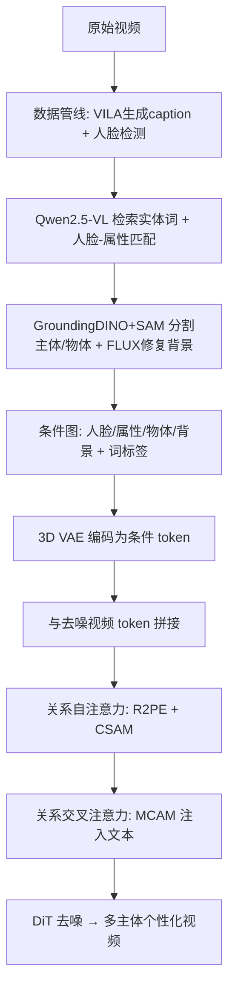

# LumosX: Relate Any Identities with Their Attributes for Personalized Video Generation

**会议**: ICLR 2026  
**OpenReview**: [https://openreview.net/forum?id=r5o6PWgzav](https://openreview.net/forum?id=r5o6PWgzav)  
**代码**: [项目主页](https://jiazheng-xing.github.io/lumosx-home/)  
**领域**: 视频生成 / 个性化多主体定制  
**关键词**: 多主体视频生成, 人脸-属性绑定, DiT, 旋转位置编码, 注意力掩码, Wan2.1  

## 一句话总结
LumosX 在 Wan2.1 视频 DiT 上引入「关系自注意力」与「关系交叉注意力」，通过关系旋转位置编码、因果自注意力掩码和多级交叉注意力掩码，把每张人脸与其属性（衣着、配饰、发型）显式绑成一个主体组，配合一套带人脸-属性依赖标注的数据管线，解决了多主体个性化视频生成中长期存在的「属性张冠李戴」问题。

## 研究背景与动机
**领域现状**：扩散模型与 DiT 架构把文生视频推到了新高度，个性化定制也从单主体人脸保真，发展到能同时控制前景多主体与背景的高自由度生成（Phantom、SkyReels-A2 等）。

**现有痛点**：当前多主体方法把不同主体的条件信号（人脸样例 + 属性描述，如「男人：金发、白T恤、墨镜」）简单拼接后一股脑喂进 DiT，缺乏显式机制保证「哪张脸配哪些属性」。当 caption 里出现同名主体（"左边的男人……右边的男人……"）时，主体-属性关联极易混淆，导致**属性纠缠（attribute entanglement）**或**人脸-属性错配（face–attribute misalignment）**。

**核心矛盾**：靠文本 caption 做隐式建模无法消除同名主体的歧义；而要做显式约束，既缺少带人脸-属性依赖标注的公开数据集，也缺少在模型层面强制「组内绑定、组间隔离」的机制——**数据与模型两侧都缺位**。

**本文目标**：实现开放集（open-set）的、身份一致且语义对齐的个性化多主体视频生成，让每个主体的脸与其属性精确配对，同时保持时序连贯与身份保真。

**核心 idea**：作者提出**「显式绑定 face-attribute 依赖」**这一主线，在数据侧用 MLLM 推断并标注每张脸归属哪些属性、构建带依赖结构的训练集与 benchmark；在模型侧把每个人脸-属性对绑成独立主体组，**用位置编码 + 注意力掩码同时增强组内相关、抑制组间干扰**。

## 方法详解

### 整体框架
LumosX 以 Wan2.1 T2V(1.3B) 为骨干：所有条件图（人脸、属性、物体、背景）经 3D VAE 编码成图像 token，与去噪视频 token 拼接后送入 DiT block。在每个 block 内，**关系自注意力**（含 R2PE 与因果自注意力掩码 CSAM）负责在位置编码与时空自注意力阶段建立依赖；**关系交叉注意力**（含多级交叉注意力掩码 MCAM）负责注入文本条件、增强视觉 token 的语义表达并对齐人脸-属性关系。整套方法靠一条三步数据管线提供带人脸-属性依赖标注的训练数据。

### 关键设计

**1. 数据管线：用 MLLM 自动标注人脸-属性依赖**
公开数据集没有依赖结构标注，作者从原始视频（Panda70M）出发设计三步管线。第一步用视觉语言模型 VILA 重新生成更丰富的 caption，并在 5%/50%/95% 三个位置帧上做人脸检测取出人体主体。第二步是关键：用多模态大模型 Qwen2.5-VL 从 caption 检索实体词，分为「带属性的人物主体（man: 黑衬衫、黑手表）/ 物体（餐具）/ 背景（茂盛花园）」三类，并借助人脸检测的视觉先验，把每个属性精确分配给对应主体——即便 caption 里出现多个同名词也能靠视觉信息消歧。第三步用 SAM 抠属性掩码、GroundingDINO+SAM 分割物体、FLUX 修复出干净背景，最终每个实体随机选一帧的图作为条件图（与推理时单参考图一致）。最终得到 157 万样本（单主体 131 万 / 双主体 23 万 / 三主体 3 万），并定义 identity-consistent 与 subject-consistent 两个评测任务。

**2. 关系旋转位置编码 R2PE：让同组人脸与属性共享时间索引**
原始 3D-RoPE 给视频 token $z \in \mathbb{R}^{T \times HW \times C}$ 按序分配位置索引 $(i,j,k)$。当扩展到条件图时，作者要求**保留 face-attribute 依赖**。对拼接 token $z' = [z; z_c]$，背景与物体 token 沿 $i$ 轴顺序延展；而对主体 token（人脸 $z_{face}$ + 属性 $z_{attr}$），同一组内的人脸与其属性**共享同一个 $i$ 索引**，仅沿 $j$、$k$ 索引展开：

$$
(i', j', k') = \begin{cases} (i_{bg/obj} + T,\ j,\ k), & z_{bg}, z_{obj} \\ (i_{sub} + T + N_{bg/obj},\ j + W\!\cdot\!N^g_{i_{sub}},\ k + H\!\cdot\!N^g_{i_{sub}}), & z_{sub} \end{cases}
$$

共享 $i$ 索引意味着在旋转位置编码这一隐式相对位置层面，同组人脸与属性天然被「拉近」，模型从位置编码起就知道它们属于同一主体，从源头避免人脸混淆。消融显示仅加 R2PE 就让 ArcSim 从 0.316 升到 0.363。

**3. 因果自注意力掩码 CSAM：组内绑定、单向聚合条件**
CSAM 是一个布尔矩阵，遵循两条规则：一是计算限制在各条件分支内部，人脸与其对应属性被视为统一的主体条件分支；二是视频去噪 token 对条件 token 只做**单向注意力**。掩码定义为：

$$
M^{SA}_{q,k} = \begin{cases} \text{True}, & q \in z \ \text{或}\ q = k \ \text{或}\ q,k \in z^g_{sub} \\ \text{False}, & \text{otherwise} \end{cases}
$$

其中 $z^g_{sub}$ 是同一主体组内的人脸/属性 token。这样去噪分支能独立聚合各条件信号，又能在条件分支内部高效绑定人脸-属性依赖，同时阻断条件分支对去噪分支的反向干扰。实现上借助 MagiAttention 加速。R2PE 是「拉近同组」，CSAM 则是「隔离异组、单向取信号」，二者互补——加上 CSAM 后 CLIP-T 从 0.178 回升到 0.182。

**4. 多级交叉注意力掩码 MCAM：强化语义对齐、动态校准强度**
交叉注意力里所有视觉 token 都和文本 token 交互，但定制任务下每个视觉条件其实有对应文本（人脸图 → "man"）。MCAM 是一个数值掩码，定义三档相关性：强相关(+1) 用于视觉条件与其对应文本、以及同组主体视觉 token 与组内所有文本；弱相关(−1) 用于主体视觉 token 与不同组的文本；其余为普通相关(0)：

$$
M^{CA}_{q,k} = \begin{cases} +1, & q,k \ \text{属于同一语义实体或主体组} \\ -1, & q,k \ \text{属于不同主体组} \\ 0, & \text{otherwise} \end{cases}
$$

掩码注入方式为 $\text{Softmax}\!\left(\frac{QK^\top + M^{CA}_{q,k}\cdot s\cdot r}{\sqrt{d_K}}\right)V$，其中 $r$ 控制约束强度。由于不同位置的相似度量级不同，统一模板不能直接加，作者引入**动态缩放因子** $s$ 逐位置校准。理想做法是用相似度矩阵绝对值，但加速注意力模块不支持自定义数值掩码、外部重算又太贵；于是用近似法在注意力外计算：$s = \text{Repeat}(Q_{ds}K^\top, \text{shape}(QK^\top))$，其中 $Q_{ds}$ 是 $Q$ 在空间维做 $d\times d$ 局部平均池化下采样后的版本。消融中 $r=0.5$ 时 ArcSim 达 0.429（远超无掩码的 0.316），是提升最显著的单一模块。

## 实验关键数据

### 主实验表格

单人脸身份一致生成（220 视频）：

| 方法 | ArcSim ↑ | CurSim ↑ | ViCLIP-T ↑ |
|------|----------|----------|------------|
| ConsisID (CogVideoX-5B) | 0.458 | 0.474 | 0.263 |
| Concat-ID (Wan2.1-1.3B) | 0.467 | 0.485 | 0.261 |
| **LumosX (1.3B)** | **0.542** | **0.575** | 0.262 |

多主体身份一致生成（全测试集 500 视频）：

| 方法 | ArcSim ↑ | CurSim ↑ | ViCLIP-T ↑ |
|------|----------|----------|------------|
| SkyReels-A2 (Wan2.1-14B) | 0.382 | 0.401 | 0.261 |
| Phantom (Wan2.1-1.3B) | 0.508 | 0.536 | 0.264 |
| **LumosX (1.3B)** | **0.510** | **0.540** | 0.262 |

主体一致生成（整段视频 + 抽取主体两层评估）：

| 方法 | Dynamic ↑ | ViCLIP-T ↑ | ViCLIP-V ↑ | CLIP-T ↑ | CLIP-I ↑ | DINO-I ↑ | ArcSim ↑ | CurSim ↑ |
|------|-----------|------------|------------|----------|----------|----------|----------|----------|
| SkyReels-A2 | 0.671 | 0.251 | 0.839 | 0.178 | 0.606 | 0.192 | 0.271 | 0.290 |
| Phantom | 0.661 | 0.254 | 0.865 | 0.185 | 0.647 | 0.216 | 0.444 | 0.477 |
| **LumosX** | **0.723** | **0.260** | **0.932** | **0.201** | **0.692** | **0.261** | **0.454** | **0.483** |

LumosX 仅用 1.3B 参数即在主体一致任务上全面领先，甚至超过 14B 的 SkyReels-A2。

### 消融实验表格

主体一致生成消融（轻量设置：300K 样本、240p）：

| 配置 | CLIP-T ↑ | ArcSim ↑ |
|------|----------|----------|
| None | 0.184 | 0.316 |
| +R2PE | 0.178 | 0.363 |
| +R2PE+CSAM | 0.182 | 0.363 |
| +R2PE+CSAM+MCAM (r=0.1) | 0.182 | 0.364 |
| **+R2PE+CSAM+MCAM (r=0.5)** | 0.186 | **0.429** |
| +R2PE+CSAM+MCAM (r=1.0) | **0.187** | 0.384 |

### 关键发现
- **R2PE 主要拉高身份保真**：单加 R2PE 让 ArcSim 大涨（0.316→0.363），但因共享 T-idx 略损单实体语义表达，CLIP-T 微降。
- **CSAM 修复语义损失**：隔离异组条件后 CLIP-T 回升，说明组间干扰确实是语义混淆的来源。
- **MCAM 与 $r$ 的权衡**：ArcSim 在 $r=0.5$ 最佳，CLIP-T 在 $r=1.0$ 最佳；由于 ArcSim 更能反映人脸-属性归属准确度，最终取 $r=0.5$。
- **训练成本**：两阶段训练（15k 单主体 + 16k 混合多主体），约需 883 GPU-days（H20）。

## 亮点与洞察
- **把「人脸-属性绑定」做成第一性问题**：以往多主体方法默认拼接即可，本文指出同名主体歧义这一被忽视的失效模式，并从数据与模型两端同时显式建模，定位精准。
- **位置编码 + 注意力掩码的双重正交约束**：R2PE 在相对位置层面「拉近同组」，CSAM/MCAM 在注意力层面「隔离异组、强化语义」，三者各司其职、消融可分离，设计干净。
- **以小搏大**：1.3B 的 LumosX 在主体一致任务上压过 14B 的 SkyReels-A2，说明显式关系建模比单纯堆参数更能解决错配问题。
- **数据管线即 benchmark**：同一套 MLLM 标注管线既产训练数据又造评测集，并设计了 identity/subject 两类任务、引入 ArcSim/DINO-I 等细粒度指标专门衡量人脸-属性归属。

## 局限与展望
- **属性数量受限**：训练时每个主体最多关联 3 个属性，推理也建议不超过 3 个，超出可能掉一致性。
- **依赖 MLLM 标注质量**：Qwen2.5-VL 的人脸-属性匹配若出错会污染训练数据，开放集复杂场景下的鲁棒性未充分讨论。
- **分辨率与时长有限**：主实验 480p / 81 帧（5 秒），消融甚至降到 240p，更长更高清场景下方法是否仍稳健待验证。
- **MCAM 近似缩放因子**：用下采样相似度近似 $s$ 是精度-效率折衷，极端情况下近似误差对结果的影响未量化。

## 相关工作与启发
- **多主体定制谱系**：从 ID 一致（Magic-Me、ConsisID、Concat-ID）到任意主体（VideoBooth、DreamVideo）再到多主体 DiT（Phantom、SkyReels-A2），本文补上了「显式建模主体间依赖结构」这一缺失环节。
- **对注意力可控生成的启发**：用结构化掩码（布尔 + 数值多级）在注意力内部编码语义关系，是一种比微调更轻量、可即插即用的可控生成思路，可迁移到图像多概念合成、布局可控生成等任务。
- **位置编码承载语义绑定**：通过共享 RoPE 索引让同组 token 相对靠近，提示位置编码不只是几何工具，也能编码语义归属关系。

## 评分
- **新颖性**: ⭐⭐⭐⭐ — 把人脸-属性绑定从隐式做成显式，R2PE/CSAM/MCAM 的组合在多主体视频定制里是清晰且首创性的贡献。
- **实验充分度**: ⭐⭐⭐⭐ — 自建 benchmark + 两类任务 + 多个细粒度指标，主实验与消融完整；但缺乏更高分辨率/更多主体/更长时长的扩展性验证。
- **写作质量**: ⭐⭐⭐⭐ — 动机与失效模式刻画清晰，方法图（数据管线、掩码示意）直观，公式与消融逻辑自洽。
- **价值**: ⭐⭐⭐⭐ — 解决了多主体个性化生成的真实痛点，1.3B 模型即达 SOTA，数据管线与 benchmark 对社区有复用价值。

<!-- RELATED:START -->

## 相关论文

- [\[ICLR 2026\] ReactID: Synchronizing Realistic Actions and Identity in Personalized Video Generation](reactid_synchronizing_realistic_actions_and_identity_in_personalized_video_gener.md)
- [\[CVPR 2026\] Lynx: Towards High-Fidelity Personalized Video Generation](../../CVPR2026/video_generation/lynx_towards_high-fidelity_personalized_video_generation.md)
- [\[ICLR 2026\] MAGREF: Masked Guidance for Any-Reference Video Generation with Subject Disentanglement](magref_masked_guidance_for_any-reference_video_generation_with_subject_disentang.md)
- [\[CVPR 2026\] DreamShot: Personalized Storyboard Synthesis with Video Diffusion Prior](../../CVPR2026/video_generation/dreamshot_storyboard_synthesis.md)
- [\[ICLR 2026\] Any-to-Bokeh: Arbitrary-Subject Video Refocusing with Video Diffusion Model](any-to-bokeh_arbitrary-subject_video_refocusing_with_video_diffusion_model.md)

<!-- RELATED:END -->
