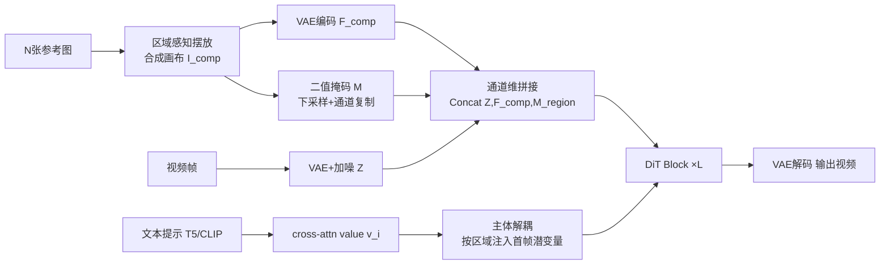

# MAGREF: Masked Guidance for Any-Reference Video Generation with Subject Disentanglement

**会议**: ICLR 2026  
**OpenReview**: [https://openreview.net/forum?id=Nbl43eAVaE](https://openreview.net/forum?id=Nbl43eAVaE)  
**代码**: 待确认（补充材料含 demo）  
**领域**: 视频生成 / 主体驱动生成  
**关键词**: any-reference video generation, masked guidance, subject disentanglement, multi-subject, identity preservation  

## 一句话总结
MAGREF 用「区域感知掩码 + 像素级通道拼接」把任意数量、任意类别的参考主体注入预训练 I2V 骨干，并用「主体解耦」把每个文本词的语义值注射到对应视觉区域，在不改架构的前提下实现高保真、可控的任意参考视频生成。

## 研究背景与动机
**领域现状**：扩散模型已能根据文本或单张参考图生成时序连贯的视频，业界对「用多张参考图细粒度控制外观与身份」的需求快速上升，催生了 any-reference video generation（任意参考视频生成）这一任务——给定任意类别、任意组合的参考主体（人、动物、服饰、配饰、环境）加文本提示，合成一致且个性化的视频。

**现有痛点**：把视频生成同时条件化在文本与多张参考图上会急剧放大条件空间，带来三大顽疾——(1) **身份不一致**，面部结构、配饰等细节跨帧漂移；(2) **多主体纠缠**，不同参考图的身份被混淆或混合；(3) **copy-paste 伪影**，把参考图生硬贴进画面破坏真实感。已有工作要么依赖外置身份模块且只支持单图（如 ConsisID），扩展性差；要么沿 token 维拼接视觉 token（如 ConcatID、VACE、Phantom），需要海量数据且身份保持/泛化都不好；SkyReels-A2 沿通道维拼接带时序掩码，仍未统一解决上述问题。

**核心矛盾**：要在「保留预训练骨干的强先验、不改架构」与「精确区分任意数量未知主体、把每个主体绑定到正确文本」之间取得平衡——沿 token 维拼接要从零重学身份一致性，沿时序维拼接又破坏 I2V 的首帧一致性。

**本文目标**：构建一个统一、无需架构改动的框架，同时解决身份一致、主体解耦、消除 copy-paste 三大问题。

**核心 idea**：**[像素级条件]** 把多张参考图拼成一张合成画布、用 VAE 编码后沿通道维与噪声潜变量拼接（而非 token 维），最大化复用预训练 I2V 骨干的图像保持能力；**[语义锚定]** 把每个文本词的 cross-attention value 注射进对应主体的空间区域，从扩散第一步就建立「图像区域↔文本词」的紧耦合；**[数据治理]** 用四阶段数据流水线构造跨配对训练样本压制 copy-paste 伪影。

## 方法详解

### 整体框架
MAGREF 建立在 Wan2.1 的 I2V 骨干之上，不改任何网络结构。输入端把 N 张参考图按位置摆到一张空白画布上形成合成图 $I_{comp}$，连同一张二值区域掩码一起经 VAE 编码，沿通道维与加噪视频潜变量拼接送入 DiT；在每个 DiT 层，主体解耦模块再把文本词的 value 嵌入按区域注入首帧潜变量，强制每个主体与其文本标签对齐。训练数据由四阶段流水线产出跨配对样本。

### 关键设计

**1. 区域感知掩码：把多主体压成一张 I2V 友好的合成参考帧**。任意参考设定的难点是主体数量与分布未知，难以套进标准 I2V 流程。MAGREF 不沿时序维逐帧堆参考图（vanilla 掩码，会破坏首帧一致性），而是把 N 张参考图 $\{I_k\}_{k=1}^N$ 按各自位置 $p_k=(x_k,y_k)$ 拼到一张画布上，每个像素取占据该位置的源图值：$I_{comp}(i,j)=\sum_{k=1}^N I_k(i-y_k,j-x_k)\cdot\mathbb{1}_{(i,j)\in R_k}$，其中 $R_k$ 是第 $k$ 张图占据的矩形区域。这张合成图被当作单张参考帧，从而直接继承骨干原生的 I2V 能力。同时构造二值掩码 $M(i,j)=\mathbb{1}_{(i,j)\in\bigcup_k R_k}$ 给出每个主体的精确空间先验。训练时随机打乱主体位置以缓解位置偏置。

**2. 像素级通道拼接：在像素层保留细粒度外观、复用骨干保持能力**。沿 token 维拼接或在 patch 化后拼视觉 token，都迫使模型从零重学身份一致性，尤其参考图数量变化时需要海量域内数据。MAGREF 改在像素层做文章：合成图 $I_{comp}\in\mathbb{R}^{1\times C_{in}\times H\times W}$ 先沿时序轴零填充到视频帧维度得 $\tilde I_{comp}$，再用同一 VAE 编码得 $F_{comp}=\mathcal{E}(\tilde I_{comp})\in\mathbb{R}^{T\times C\times H\times W}$；二值掩码 $M$ 下采样到 $F_{comp}$ 分辨率并沿通道复制成 $M_{region}\in\mathbb{R}^{T\times C_m\times H\times W}$；原视频帧经同一 VAE 加噪得 $Z$。三者沿通道维拼接成最终输入 $F_{input}=\mathrm{Concat}(Z,F_{comp},M_{region})\in\mathbb{R}^{T\times(2C+C_m)\times H\times W}$。这样参考表示在时序上与视频帧对齐，骨干无需改结构即可在任意参考设定下保持细粒度外观。

**3. 主体解耦：把文本词语义值按区域注射进首帧潜变量**。仅有区域掩码做到视觉分离还不够，多主体生成需要图像与文本之间更强的耦合，否则属性会泄漏、跨主体纠缠。MAGREF 先从文本条件解析出对应各参考主体的词标签 $\{w_i\}$，取其在 cross-attention 层的 value 嵌入 $V=\{v_i\}_{i=1}^K,\ v_i\in\mathbb{R}^D$；再为每个主体构造区域掩码 $M_{sub}^k(i,j)=\mathbb{1}_{(i,j)\in R_k}$，把对应 value 注入首帧潜变量 $z_0$：$z_0'=z_0+\alpha\sum_{i=1}^K(M_{sub}^i\odot v_i)$，其中 $\odot$ 为带广播的逐元素积。从扩散起点就把指定图像区域与关联文本词绑死，有效抑制属性泄漏、防止跨主体干扰（图 3 显示去掉该机制后 Man/Woman 与文本对齐变得模糊纠缠）。

**4. 四阶段数据流水线：构造跨配对样本压制 copy-paste 伪影**。为任意参考任务定制：Stage 1 用场景切分分段、丢弃低质/少动片段，用 Qwen2.5-VL 生成偏运动的字幕；Stage 2 从字幕识别物体，用 GroundingDINO 定位、SAM2 分割成干净参考图；Stage 3 用 InsightFace 检测人脸、按姿态过滤并按质量排名选取固定数量高质量脸；Stage 4 用 SOTA 图像生成模型对人脸/物体/背景做生成式增广（变姿态、外观、上下文）。最终样本形如 $R_i=\{V_i,C_i,(I_i^{Face},I_i^{Face'}),(I_{i,1}^{Obj},I_{i,1}^{Obj'}),\dots,I_i^{Bg}\}$，原图与变体配成「跨配对」迫使模型学外观本质而非直接复制，从而压制 copy-paste 伪影。

## 实验关键数据

评测集 120 对 reference-text，单 ID 与多主体各半；单 ID 用 ID-Sim/Aesthetic/Motion/GmeScore，多主体额外加 Subj-Sim/Bg-Sim。骨干基于 Wan2.1，H100 80GB + FusedAdam 训练。

### 主实验表格

单 ID 评测（节选）：

| Model | ID-Sim | Aesthetic | Motion | GmeScore | Total |
|---|---|---|---|---|---|
| HunyuanCustom | 0.592 | 0.497 | 0.848 | 0.697 | 0.659 |
| Phantom | 0.492 | 0.504 | **0.952** | 0.722 | 0.668 |
| VACE | 0.577 | 0.524 | 0.949 | 0.696 | 0.687 |
| Hailuo (闭源) | 0.537 | **0.527** | 0.941 | 0.714 | 0.680 |
| **MAGREF** | **0.595** | 0.516 | **0.956** | 0.710 | **0.694** |

多主体评测（节选）：

| Model | ID-Sim | Subj-Sim | Bg-Sim | Aesthetic | Motion | GmeScore | Total |
|---|---|---|---|---|---|---|---|
| Phantom | 0.481 | 0.364 | 0.460 | 0.458 | **0.976** | 0.713 | 0.575 |
| VACE | 0.345 | 0.463 | 0.615 | 0.467 | 0.968 | 0.680 | 0.590 |
| Kling1.6 (闭源) | 0.387 | 0.411 | 0.571 | 0.458 | 0.864 | 0.655 | 0.558 |
| **MAGREF** | **0.542** | **0.496** | **0.622** | **0.478** | 0.945 | 0.681 | **0.627** |

MAGREF 在单 ID 与多主体两种设定下都拿到最高 Total Score，主体一致性（ID-Sim、Subj-Sim）全面领先开源与闭源对手。

### 消融实验表格

训练范式与掩码策略（表 3）：

| 方法 | ID-Sim | Subj-Sim | Bg-Sim | Total |
|---|---|---|---|---|
| 从 T2V 骨干训练 | 0.428 | 0.403 | 0.468 | 0.550 |
| I2V + Vanilla 掩码 | 0.458 | 0.431 | 0.492 | 0.558 |
| **I2V + 区域感知掩码** | **0.504** | **0.452** | **0.526** | **0.587** |

整体流水线消融（表 4）：

| 方法 | ID-Sim | Subj-Sim | Bg-Sim | Total |
|---|---|---|---|---|
| w/o 区域感知掩码 | 0.470 | 0.452 | 0.530 | 0.570 |
| w/o 跨配对数据策略 | 0.462 | 0.447 | 0.524 | 0.574 |
| w/o 主体解耦 | 0.493 | 0.417 | 0.518 | 0.580 |
| **完整 MAGREF** | **0.542** | **0.496** | **0.622** | **0.627** |

### 关键发现
- 从 T2V 骨干训练或用 vanilla 掩码都明显损害身份/主体一致性，区域感知掩码 + 复用 I2V 首帧能力是性能基石（Total 0.550/0.558 → 0.587）。
- 三个组件去掉任一都掉点：去区域感知掩码掉最多（Total −0.057），去跨配对数据主要恶化 copy-paste 抑制，去主体解耦则 ID-Sim/Subj-Sim 显著下降，印证「图像-文本紧绑定」对多主体的关键作用。

## 亮点与洞察
- **不改架构是最大卖点**：通道维拼接 + 复用 I2V 首帧机制，让任意参考能力「白嫖」预训练骨干的强外观先验，避免 token 维拼接从零重学一致性，工程上极易落地。
- **合成画布是巧思**：把「未知数量主体」这个开放问题硬塞进「单参考帧 I2V」这个成熟范式，掩码再补上空间先验——用范式复用换掉了复杂的多分支条件注入。
- **主体解耦把对齐前置到扩散起点**：在 $z_0$ 上注入文本 value，而非靠后续 cross-attention 慢慢收敛，从源头切断属性泄漏。

## 局限与展望
- 评测集仅 120 对、每例 ≤3 张参考图，更大规模主体组合（密集人群、强遮挡）下的鲁棒性未充分验证。
- 主体解耦依赖从文本准确解析出主体词标签并取得对应 value，提示词模糊或主体词缺失时绑定可能失效。
- 合成画布把多主体压进单帧，参考图过多时空间分辨率被稀释，细粒度细节保持可能受限。
- Motion 指标略逊于 Phantom，强主体约束与大幅运动之间的权衡仍有提升空间。

## 相关工作与启发
- **单 ID 保持**：ConsisID（频率分解保面部一致）、EchoVideo、FantasyID 依赖外置身份模块、单图条件，扩展性受限。
- **多概念定制**：ConceptMaster、VideoAlchemy 用 CLIP+Q-Former 融合视觉-文本；HunyuanCustom 引入 MLLM 增强提示-参考交互。
- **参考条件化（基于 Wan2.1）**：ConcatID 沿 token 维拼接、VACE/Phantom 注入参考特征、SkyReels-A2 沿通道维拼接带时序掩码——MAGREF 与它们的本质差异在「像素级通道拼接 + 区域掩码复用 I2V 首帧 + 文本 value 区域注射」三件套。
- **启发**：把「条件信号塞回预训练范式擅长的输入形态」（这里是合成参考帧）往往比新增条件分支更省数据、更稳；区域级的文本-视觉绑定是多主体解耦的通用思路，可迁移到多主体图像编辑、可控生成等任务。

## 评分
- **新颖性**: ⭐⭐⭐⭐ — 像素级通道拼接 + 合成画布复用 I2V、首帧 value 注射做主体解耦的组合是新的，单点不算颠覆但工程整合巧妙。
- **实验充分度**: ⭐⭐⭐⭐ — 单 ID/多主体双设定、覆盖开源与闭源 SOTA、三组件消融完整；评测集规模偏小是减分项。
- **写作质量**: ⭐⭐⭐⭐ — 三大挑战→三组件对应清晰，公式与流水线图齐全，可读性好。
- **价值**: ⭐⭐⭐⭐ — 无需改架构即插任意参考能力，对工业级可控视频生成有较强落地价值。

<!-- RELATED:START -->

## 相关论文

- [\[ICLR 2026\] Any-to-Bokeh: Arbitrary-Subject Video Refocusing with Video Diffusion Model](any-to-bokeh_arbitrary-subject_video_refocusing_with_video_diffusion_model.md)
- [\[ICLR 2026\] DreamSwapV: Mask-guided Subject Swapping for Any Customized Video Editing](dreamswapv_mask-guided_subject_swapping_for_any_customized_video_editing.md)
- [\[ICLR 2026\] Frame Guidance: Training-Free Guidance for Frame-Level Control in Video Diffusion Models](frame_guidance_training-free_guidance_for_frame-level_control_in_video_diffusion.md)
- [\[ICLR 2026\] Phantom-Data: Towards a General Subject-Consistent Video Generation Dataset](phantom-data_towards_a_general_subject-consistent_video_generation_dataset.md)
- [\[ICLR 2026\] BindWeave: Subject-Consistent Video Generation via Cross-Modal Integration](bindweave_subject-consistent_video_generation_via_cross-modal_integration.md)

<!-- RELATED:END -->
