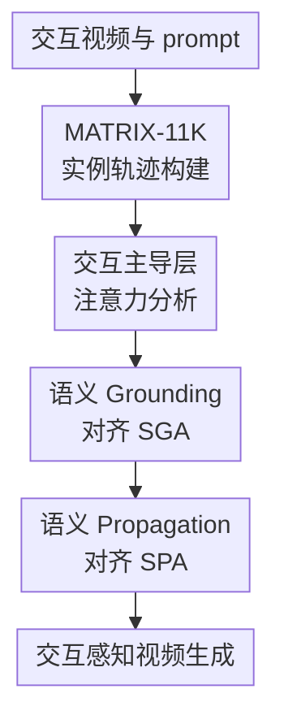

# MATRIX: Mask Track Alignment for Interaction-aware Video Generation

**会议**: ICLR2026  
**OpenReview**: [https://openreview.net/forum?id=lhVrFEssk5](https://openreview.net/forum?id=lhVrFEssk5)  
**代码**: 待确认  
**领域**: 视频生成  
**关键词**: 交互感知视频生成, 视频扩散 Transformer, 注意力对齐, 实例 mask track, 语义传播

## 一句话总结
MATRIX 发现视频 DiT 的主体、客体与动作关系主要编码在少数交互主导注意力层里，并用多实例 mask track 去正则这些层的 grounding 与 propagation attention，从而显著提升文本到视频生成中的交互保真度与时序一致性。

## 研究背景与动机
**领域现状**：文本到视频生成已经从早期 UNet 扩散逐渐走向 Video DiT，CogVideoX、Open-Sora、Wan 等模型通过 3D full attention 同时建模文本 token 与视频 token，使模型能够生成更长、更清晰、更连贯的视频。与此同时，图像到视频与可控视频生成也开始引入首帧、轨迹、深度、bbox、mask 等控制信号，让用户能指定场景中的对象或运动趋势。

**现有痛点**：这些模型在“一个物体动起来”或“一个人做动作”上已经不错，但一旦 prompt 里出现多实例交互，就容易出错。典型失败包括：主体和客体位置对不上，动词没有真正落到两者之间，杯子被多生成一个，人物身份在中途漂移，或者本该发生接触的动作变成悬空靠近。换句话说，模型可能知道 prompt 中有“boy”“green lid bottle”和“reaches for”，却没有稳定回答“谁在对谁做什么”。

**核心矛盾**：交互生成不是单纯的全局文本-视频相似度问题，而是一个绑定问题。名词 token 需要绑定到对应实例区域，动词 token 需要绑定到主体-客体的联合交互区域，这种绑定还必须跨帧保持。如果只看 CLIPScore、视频质量或整体 caption matching，模型可以生成看起来合理但交互关系错误的视频；如果只给首帧控制，又无法保证后续帧中身份和关系不漂移。

**本文目标**：作者想回答两个问题。第一，Video DiT 内部到底在哪里表示主体、客体和动作交互？第二，如果这些表示能被定位出来，能否用带时序 ID 的实例 mask track 去监督这些注意力，让生成结果更懂交互？因此论文同时做了数据集、内部表征分析、训练正则和评测协议四件事。

**切入角度**：作者观察到 3D full attention 本身就包含可解释的四块关系，其中 video-to-text attention 可以看作视频 token 对文本 token 的 grounding，video-to-video attention 可以看作视频内部跨帧传播。若成功样本里这些 attention 会集中在正确实例和交互区域，而失败样本里会散掉或错位，那么 attention 就不只是可视化工具，也可以成为训练时可对齐的中间监督对象。

**核心 idea**：用带稳定实例 ID 的 mask track 作为参照，先找出 Video DiT 中真正影响交互成败的 attention 层，再只在这些层上施加语义 grounding 与语义 propagation 对齐损失。

## 方法详解
MATRIX 的方法可以分成三层：先构建 MATRIX-11K，让每段视频同时有交互 caption 和多实例 mask track；再分析 Video DiT 的 attention，找出哪些层负责主体/客体 grounding 与跨帧传播；最后用 SGA 和 SPA 两个损失只正则这些交互主导层。这样做的关键不是把 mask 当作普通条件图塞进模型，而是让模型内部负责绑定交互关系的注意力对齐到真实实例轨迹。

### 整体框架
输入是一张首帧图像、文本 prompt、首帧多实例 ID map，以及训练时可用的整段视频 mask tracks。模型以 CogVideoX-5B-I2V 为主要 backbone，通过 LoRA 微调少数层；在前向过程中，作者抽取 interaction-dominant layers 里的 video-to-text attention 与 video-to-video attention，经轻量 causal decoder 上采样到像素级 mask track 分辨率，再分别用 SGA 与 SPA 对齐到主体、客体和交互区域。

这里的首帧 ID map 用 palette-indexed 的方式聚合每个实例的二值 mask，保证同一个实例在条件中有稳定 ID。训练时 backbone 大部分参数冻结，只更新选中层的 LoRA、输入投影层和轻量 decoder；推理时用户可以用现成分割器得到首帧实例 mask，再让模型生成更稳定的主体-动作-客体交互视频。

### 关键设计
**1. MATRIX-11K：把交互 caption 和实例 mask track 对齐到同一个监督空间**

论文首先补齐了这个任务最缺的一环：既要知道文本里有哪些交互，也要知道视频中每个参与实例在每帧在哪里。MATRIX-11K 的 caption 处理由 LLM 完成，先识别交互动词并给主体、客体分配稳定 ID，例如得到 $\langle k_{sub}, verb, k_{obj}\rangle$；再根据 Contactness 和 Dynamism 过滤掉不够物理接触或时序变化不明显的关系；最后为每个 ID 提取外观描述，用于区分同类实例。

mask track 的构建则从 GroundingDINO 候选框开始，用 VLM 验证候选框是否匹配“类别 + 外观描述”，通过验证后再用 SAM2 从 anchor frame 向整段视频传播得到每个 ID 的 per-frame mask。这个流程的价值在于，mask 不只是某一帧的 bbox，而是带 persistent ID 的时序轨迹；主体、客体各有自己的轨迹，动词对应的交互区域则可定义为两者 mask 的逐帧并集。后面的 attention 分析与训练损失都依赖这个精确参照。

**2. 交互主导层分析：把“模型哪里懂交互”变成可测量问题**

作者把 DiT 的 3D full attention 拆成四块：video-to-video、video-to-text、text-to-video、text-to-text。本文重点看 $A_{v2t}$ 和 $A_{v2v}$。对 grounding 来说，名词 token 的 $A_{v2t}$ 应该落在对应主体或客体 mask 上，动词 token 的 $A_{v2t}$ 应该落在主体-客体 union 上；对 propagation 来说，第一帧主体或客体 mask 内的 query 通过 $A_{v2v}$ 看到后续帧时，也应该持续关注同一个实例轨迹。

为此论文定义 Attention Alignment Score，核心形式是把 attention heatmap 与目标 mask 相乘求和：$AAS=\sum_{f,h,w}(A\odot m)(f,h,w)$。作者在 CogVideoX-5B-I2V 的 42 层、50 个 denoising timestep 上统计 noun grounding、verb grounding、noun propagation、verb propagation 四类 AAS。先看哪些层频繁进入 top-10，再用成功样本和失败样本的 AAS gap 找出能区分成败的层。这个设计很关键：它不是平均所有层做正则，而是把监督集中到“成功时强、失败时弱”的 interaction-dominant layers。

**3. SGA：让文本 token 真正落到主体、客体和交互区域上**

Semantic Grounding Alignment 监督的是 video-to-text attention。对主体和客体，作者聚合 head noun 及其 modifiers 的 attention，得到 $A^{v2t}_{sub}$ 与 $A^{v2t}_{obj}$；对动词，聚合 verb token 及 auxiliary/particle，得到 $A^{v2t}_{verb}$。监督目标分别是主体 mask、客体 mask，以及主体和客体的 union mask。这样一来，模型不仅要在全局上符合 prompt，还要在内部 attention 上把“man”“wine glass”“takes a sip”绑定到正确区域。

直接把 latent attention 与像素级 mask 比较会有尺度错位，所以论文引入轻量 causal decoder $D_\phi$，模仿 3D VAE 的时间和空间上采样节奏，把 latent-level attention map 解码成像素级 mask track 预测 $\hat{A}^{v2t}_e=D_\phi(A^{v2t}_e)$。SGA 使用 BCE、soft DICE 和 L2 的组合损失，让 attention 既覆盖正确区域，又避免只在少数点上尖锐响应。

**4. SPA：让第一帧绑定关系跨帧保持，不在生成中漂移或复制**

Semantic Propagation Alignment 监督的是 video-to-video attention。具体做法是把第一帧主体或客体 mask 下采样到 latent grid，取其中 mask 为 1 的位置作为 query set $Q_e$，再平均这些 query 指向所有时空 token 的 attention，得到 $A^{v2v}_e\in\mathbb{R}^{F\times H\times W}$。如果模型真的保持了同一实例的身份，这张 propagation map 应该沿着目标实例的 mask track 移动，而不是扩散到背景、另一个同类人物或凭空新实例。

SPA 与 SGA 共用同一种 mask 对齐损失，但论文主文中 SPA 对 $e\in\{sub,obj\}$ 施加约束，重点保证主体和客体的 identity track 稳定。它补的是 SGA 不足的一半：SGA 能告诉模型每帧里名词和动词该看哪里，但生成视频还需要跨帧持续追踪同一对象。两者合在一起，才同时约束“语义绑定是否正确”和“绑定是否随时间保留”。

### 一个完整示例
假设 prompt 是“穿灰色西装的男人把玻璃门向外推开”。MATRIX-11K 的处理会先把“男人”标成主体 ID，把“玻璃门”标成客体 ID，把“push open”标成交互动词，并过滤确认这是有接触和动态变化的交互。随后 GroundingDINO 在若干采样帧中提出候选框，VLM 根据“灰色西装男人”“玻璃门”等描述验证对应实例，SAM2 再把主体和客体 mask 传播成完整 track。

训练时，首帧图像和首帧 ID map 告诉模型从哪些实例开始生成。进入交互主导层后，SGA 检查 video token 对“man”的 attention 是否落在男人 mask 上，对“glass door”的 attention 是否落在门上，对“push open”的 attention 是否落在男人和门的 union 区域上。SPA 则检查第一帧男人区域发出的 video-to-video attention 在后续帧是否仍沿着同一个男人移动，门区域是否仍沿着同一扇门移动。若 baseline 在中途让男人手臂漂到背景或把门复制成两扇，mask track 对齐损失会直接惩罚这种错位。

### 损失函数 / 训练策略
MATRIX 的单个 mask 对齐损失写作：

$$
\ell(X,Y)=\beta_{bce}BCE(X,Y)+\beta_{dice}(1-Dice(X,Y))+\beta_2\lVert X-Y\rVert_2^2.
$$

其中 $X$ 是 decoder 输出的 attention mask prediction，$Y$ 是目标 mask track。SGA 和 SPA 分别为：

$$
L_{SGA}=\sum_{e\in\{sub,obj,verb\}}\ell(\hat{A}^{v2t}_e,M_e),\quad
L_{SPA}=\sum_{e\in\{sub,obj\}}\ell(\hat{A}^{v2v}_e,M_e).
$$

总训练目标是在扩散 denoising loss 上加两个正则项：

$$
L_{total}=L_{DM}+\lambda_{SGA}L_{SGA}+\lambda_{SPA}L_{SPA}.
$$

实现上，作者主要在 CogVideoX-5B-I2V 上用 LoRA 微调，并且只更新选中的 LoRA 层、输入投影层和轻量 decoder，其他 backbone 参数冻结。附录给出的实现细节显示 LoRA rank 为 128、$\alpha=64$，SGA 监督 video-to-text 的第 7 和第 11 个 block，SPA 监督 video-to-video 的第 12 个 block。这个选择与前面的交互主导层分析对应，说明训练目标不是任意外挂，而是由内部表征分析推出来的。

## 实验关键数据

### 主实验
论文构建了合成域和真实域两个评测集：合成域包含 60 个 image-prompt pair，真实域包含 58 个来自开源数据集的 image-prompt pair。InterGenEval 用结构化 QA 检查关键交互，其中 KISA 关注交互前、中、后三个阶段是否语义成立，SGI 关注主体、客体和动词 union 是否正确 grounding，二者都会乘以 SPI 这一时序一致性因子，最终 IF 是 KISA 与 SGI 的平均。

| 方法 | KISA ↑ | SGI ↑ | IF ↑ | HA ↑ | MS ↑ | IQ ↑ |
|------|--------|-------|------|------|------|------|
| CogVideoX-2B-I2V | 0.420 | 0.470 | 0.445 | 0.937 | 0.993 | 69.69 |
| CogVideoX-5B-I2V | 0.406 | 0.491 | 0.449 | 0.936 | 0.987 | 69.66 |
| Open-Sora-11B-I2V | 0.453 | 0.508 | 0.480 | 0.891 | 0.992 | 63.32 |
| TaVid | 0.465 | 0.522 | 0.494 | 0.917 | 0.991 | 68.90 |
| MATRIX | 0.546 | 0.641 | 0.593 | 0.954 | 0.994 | 69.73 |

主表最重要的结果是，MATRIX 在交互相关指标上明显领先：相比 CogVideoX-5B-I2V，KISA 从 0.406 提升到 0.546，SGI 从 0.491 提升到 0.641，IF 从 0.449 提升到 0.593。同时它没有牺牲视频质量，HA、MS、IQ 也都保持在很高水平。论文的定性结果显示，baseline 常见问题是动作没有完成、接触关系悬空、身份漂移或多出实例，而 MATRIX 更能保持正确绑定和轨迹。

### 消融实验
| 配置 | KISA ↑ | SGI ↑ | IF ↑ | HA ↑ | MS ↑ | IQ ↑ | 说明 |
|------|--------|-------|------|------|------|------|------|
| Baseline CogVideoX-5B-I2V | 0.406 | 0.491 | 0.449 | 0.936 | 0.987 | 69.66 | 没有交互监督 |
| TaVid | 0.465 | 0.522 | 0.494 | 0.917 | 0.991 | 68.90 | 单实例 cue 有帮助但传播不足 |
| LoRA + MATRIX-11K | 0.445 | 0.526 | 0.486 | 0.940 | 0.994 | 69.77 | 只靠数据微调有中等收益 |
| + SPA loss | 0.451 | 0.540 | 0.496 | 0.937 | 0.995 | 70.26 | 改善传播，但 grounding 提升有限 |
| + SGA loss in $A_{t2v}$ | 0.486 | 0.578 | 0.531 | 0.935 | 0.993 | 70.03 | text-to-video 约束不如 video-to-text 稳定 |
| + SGA loss in $A_{v2t}$ | 0.509 | 0.592 | 0.550 | 0.952 | 0.994 | 69.62 | grounding 收益更稳定 |
| + SPA + SGA, MATRIX | 0.546 | 0.641 | 0.593 | 0.954 | 0.994 | 69.73 | 两类对齐互补，整体最佳 |

### 关键发现
- 只用 MATRIX-11K 做 LoRA 微调已经能把 IF 从 0.449 提到 0.486，说明数据集本身提供了更强的交互分布，但没有注意力监督时还不足以解决绑定和传播。
- SPA 单独加入后更偏向改善时序稳定性，MS 和 IQ 很高，但 KISA/SGI 仍不如 SGA，因为模型还没有被显式要求把名词和动词落到正确空间区域。
- SGA 放在 $A_{v2t}$ 比放在 $A_{t2v}$ 更有效。论文解释是，一个文本 token 可能对应多个空间位置，直接约束 text-to-video 容易不稳定；video-to-text 以正在生成的空间 token 为 query，监督信号更贴近生成区域。
- SGA 与 SPA 合并后达到最佳 IF=0.593，说明交互视频生成必须同时解决“每帧看对对象”和“跨帧别换对象”两个问题。
- MATRIX 还在 Wan2.1-14B-I2V 上做了定性验证，显示这个框架不是只服务 CogVideoX，而是可迁移到采用 3D full attention 的其他 Video DiT backbone。

## 亮点与洞察
- 论文最漂亮的地方是把 attention 可解释性和训练正则闭环起来。很多工作只展示 attention map 说明模型可能懂了什么，MATRIX 则进一步问：哪些 attention 层真的和成功/失败相关，能不能只监督这些层？这让方法比“全层加 loss”更有因果感。
- mask track 的选择非常贴合交互问题。单帧 mask 只能说明对象在哪里，track 才能说明同一对象在时间中如何延续；而主体和客体 union 又自然对应动词交互区域。这个表示同时服务数据集、分析、训练和评测，贯穿得很一致。
- InterGenEval 针对交互生成的盲区设计得比较具体。KISA 看动作阶段是否成立，SGI 看主体/客体/动词是否 grounding，SPI 再惩罚对象忽隐忽现，这比只问“视频是否符合 prompt”更能抓住交互失败。
- SGA 中 $A_{v2t}$ 优于 $A_{t2v}$ 的消融有启发性：多模态注意力的方向不是随便选的，谁作为 query 决定了监督落在“正在生成的空间位置”还是“抽象文本 token”上。这一点可以迁移到图像生成、视频编辑和多对象控制任务。
- 方法没有重训大模型，而是冻结 backbone、只在交互主导层上用 LoRA 和 decoder 做轻量适配。这对后续把类似机制接到更大 Video DiT 上很有实际价值。

## 局限与展望
- MATRIX 依赖高质量 mask track 和交互 caption。MATRIX-11K 的构建需要 LLM、GroundingDINO、VLM、SAM2 和人工过滤，成本不低；如果 mask track 有漂移或实例验证错了，attention 对齐损失会把错误监督直接写进模型。
- 当前方法更适合有明确主体、客体和动词的交互。对于群体行为、隐式社交关系、非接触心理互动，或者没有清晰物理接触但语义复杂的场景，union mask 未必能充分表示动词关系。
- 训练和评估都围绕 image-to-video setting 展开，首帧 ID map 给了模型很强的实例起点。纯 text-to-video 场景下没有首帧实例 mask，如何自动建立可控实例 ID 仍需要额外模块。
- InterGenEval 依赖自动生成 QA 和视觉问答判断，虽然比全局指标更精细，但仍可能受 VLM 评估器偏差影响。后续可以加入人工校准集，或者把评估问题扩展到遮挡、手部接触、物体状态变化等更细粒度维度。
- SPA 主文主要监督 subject/object 的 propagation，对 verb interaction region 的长期动态约束相对弱。未来可以考虑显式建模接触状态、相对位姿或 affordance 变化，而不只用主体和客体 mask 的空间轨迹。

## 相关工作与启发
- **vs CogVideoX / Open-Sora / Wan 等 Video DiT**: 这些模型提供强大的 3D full attention backbone，但原始训练目标没有显式要求主体、客体、动词在空间和时间上绑定。MATRIX 的贡献是在不重写架构的情况下，找到可监督的内部 attention 层并加入交互正则。
- **vs 可控视频生成方法**: bbox、轨迹、深度、光流和 mask 控制可以改善几何或运动，但很多方法对文本里的“谁对谁做什么”不敏感。MATRIX 不只是给实例位置控制，而是把文本 token、实例区域和跨帧 track 对齐起来。
- **vs human-object interaction / relation-specific video generation**: 一些方法针对固定动词或关系训练专门模块，适合窄域交互但难以开放词表泛化。MATRIX 用 LLM 提取开放式交互 triplet，并用 attention 对齐监督，不需要为每个动词单独设计动作先验。
- **vs 扩散模型 attention 解释工作**: 既有工作常分析图像扩散或 UNet attention 的语义区域，MATRIX 把这个思路推进到 Video DiT 的 3D full attention，并把分析结果转化为训练目标。对其他生成模型来说，这提示我们可以先找“表现成败最敏感的内部层”，再做局部正则。

## 评分
- 新颖性: ⭐⭐⭐⭐⭐ 论文把交互 mask track、Video DiT 内部 attention 分析和训练对齐连成一条线，比单纯控制信号或单纯指标设计更完整。
- 实验充分度: ⭐⭐⭐⭐ 主实验、消融、跨 backbone 定性和新评测协议都比较扎实，但自动评估器偏差和更复杂开放场景还需要更多验证。
- 写作质量: ⭐⭐⭐⭐ 论文主线清楚，图示对 grounding 与 propagation 的解释很有帮助；少数实现细节主要放在附录，读主文时需要来回对照。
- 价值: ⭐⭐⭐⭐⭐ 交互一致性是视频生成走向真实应用的关键短板，MATRIX 提供了可迁移的诊断和正则化范式，值得后续视频生成和多对象控制工作借鉴。

<!-- RELATED:START -->

## 相关论文

- [\[ICLR 2026\] MIMIC: Mask-Injected Manipulation Video Generation with Interaction Control](mimic_mask-injected_manipulation_video_generation_with_interaction_control.md)
- [\[AAAI 2026\] Mask2IV: Interaction-Centric Video Generation via Mask Trajectories](../../AAAI2026/video_generation/mask2iv_interaction-centric_video_generation_via_mask_trajectories.md)
- [\[ICLR 2026\] Controllable First-Frame-Guided Video Editing via Mask-Aware LoRA Fine-Tuning](controllable_first-frame-guided_video_editing_via_mask-aware_lora_fine-tuning.md)
- [\[ICLR 2026\] DreamSwapV: Mask-guided Subject Swapping for Any Customized Video Editing](dreamswapv_mask-guided_subject_swapping_for_any_customized_video_editing.md)
- [\[CVPR 2026\] Open-world Hand-Object Interaction Video Generation Based on Structure and Contact-aware Representation](../../CVPR2026/video_generation/open-world_hand-object_interaction_video_generation_based_on_structure_and_conta.md)

<!-- RELATED:END -->
