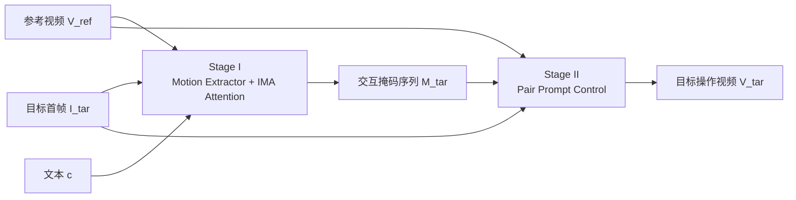

# MIMIC: Mask-Injected Manipulation Video Generation with Interaction Control

**会议**: ICLR 2026  
**OpenReview**: [https://openreview.net/forum?id=COrUdVuInH](https://openreview.net/forum?id=COrUdVuInH)  
**代码**: 待确认  
**领域**: 视频生成 / 具身操作 / 可控视频扩散  
**关键词**: 操作视频生成, 参考视频驱动, 交互掩码, 图生视频扩散, 运动解耦  

## 一句话总结
MIMIC 把"生成操作视频"拆成两阶段——先用交互-运动感知（IMA）注意力从参考视频里学出一串语义掩码作为运动轨迹，再用 Pair Prompt Control 把掩码渲染成画面，从而在保留接触丰富的操作语义的同时生成高保真、可控的操作视频。

## 研究背景与动机
**领域现状**：具身智能受制于大规模交互数据稀缺，而操作视频天然编码了丰富的手-物交互线索，因此用视频生成模型合成新的操作视频被视为扩充训练数据、提升机器人泛化的可行路径。语言提示足以描述"叠衣服"这类高层语义，但无法刻画接触动力学中细微的运动与受力变化。

**现有痛点**：当前 I2V 视频扩散模型在操作场景里难以同时兼顾抽象语义理解与细粒度视觉细节。为了约束运动，一类方法显式注入强控制信号（拖拽点、物体深度、手部网格、bounding box），灵活性差且容易生成物理上不合理的结果；另一类（如 FlexiAct）用参考视频抽全局运动表示，但面对操作场景里多物体复杂运动时会出现尺度不准、交互建模错误——因为参考场景与目标场景在被操作物体、初始位姿、背景上往往严重错位，且模型死板地服从控制信号、忽略真实交互的因果依赖。

**核心矛盾**：操作视频生成既要求跨场景的结构对齐（把参考里的语义迁移到错位的目标场景），又要求对交互物理动力学的显式推理，单阶段黑盒生成两头都顾不好。

**本文目标**：打开单阶段生成的黑盒，显式注入"以操作为中心"的理解能力，提升可解释性与可控性，让模型既能认出该操作哪个物体，又能合成时序连贯、物理合理的交互运动。

**核心idea**：**给模型看一个参考示例**——参考视频同时携带高层语义（叠衣服）和细粒度交互线索，用它联合文本来驱动扩散模型；并把"理解运动"与"渲染画面"解耦成两个阶段，中间用一串掩码作为可控、像素级、且能容忍非刚性形变的运动轨迹表示。

## 方法详解

### 整体框架
MIMIC 以 DynamiCrafter（基于 UNet 的 I2V 扩散模型）为底座，输入参考操作视频 $V_{ref}$、目标场景首帧 $I_{tar}$ 和文本 $c$，输出目标环境下的操作视频 $V_{tar}$。生成被显式拆成两阶段：Stage I 联合"识别目标首帧中被操作物体"与"合成时序连贯的运动轨迹"，把轨迹表示为掩码序列 $M_{tar}$；Stage II 以预测掩码加目标首帧为条件，配合 Pair Prompt Control 渲染出最终高保真视频。

### 关键设计

**1. 交互-运动感知（IMA）注意力：把参考视频的交互语义注入掩码生成** Stage I 要解决的是"怎么把参考视频里既抽象又具体的操作意图喂给扩散模型"。作者用冻结的 CLIP 视觉编码器 $\Phi$ 从参考视频和参考交互掩码分别抽出语义嵌入 $f^V_{ref}$ 和 $f^M_{ref}$，再配一个轻量 Motion Extractor 注入运动线索。关键在于把可学习 query $q$ 与掩码嵌入逐元素相加得到 $q_m = q + f^M_{ref}$，让 query 自带"要关注哪些交互区域"的先验，然后与冻结的视频嵌入做交叉注意力得到 IMA 嵌入：

$$f^{IMA}_{ref} = \mathrm{FFN}(\mathrm{CA}(q_m, f^V_{ref}, f^V_{ref}))$$

这个 $f^{IMA}_{ref}$ 再通过另一个交叉注意力层注入去噪 UNet，从而让扩散过程被操作语义引导；为稳定训练，该注意力层的输出投影零初始化并加残差连接。训练上采用两步法：先用"首帧重复成静态视频"让模型专注于学会识别首帧里的手-物交互，再恢复时序动态去学运动生成，两阶段都优化同一扩散损失。

**2. Pair Prompt Control：用参考对解耦物体运动与相机运动** Stage II 面临的核心难题是——只用掩码做控制信号本质上是有歧义的：掩码只说"哪里发生交互"，无法区分是物体在动还是相机在动，也无法刻画操作如何展开，结果常导致交互轨迹一致性差、手/夹爪渲染失真。作者提出 Pair Prompt Control，让渲染同时以目标掩码序列 $M_{tar}$ 和一个参考对 $\langle M_{ref}, V_{ref}\rangle$ 为条件：目标掩码提供空间对齐，参考对提供语义与运动先验，从而消解掩码歧义。架构上采用 ControlNet 风格的控制分支，用轻量卷积的 Query Encoder 和 Pair Encoder 分别处理目标掩码和参考对，在控制模块里融合后把多尺度引导注入 UNet 主干。这样背景信息得以补全，模型能把物体运动从相机运动里剥离出来，生成尊重全局场景动态的连贯视频。

**3. 掩码图像条件 + 自适应区域损失：聚焦交互区提升保真度** 为了让生成在交互区域更清晰一致，作者用 Stage I 预测掩码与目标图相乘得到只保留交互区的掩码图 $I_{masked} = I^1_{tar} \odot m^1_{tar}$，与原始目标图拼接后送入扩散模型作为显式外观引导。同时对扩散损失重加权，用当前帧掩码 $m^f_{tar}$ 与首帧掩码 $m^1_{tar}$（沿时间复制）构造区域损失，强调跨时间的掩码对齐区：

$$L_{region} = \left(\frac{S}{S_{M_{tar}}}M_{tar} + \frac{S}{S_{M^1_{tar}}}M^1_{tar}\right) \odot L_{diff}$$

最终目标把非交互区与交互区分开加权：

$$L_{final} = (1 - M_{tar} - M^1_{tar}) \odot L_{diff} + \lambda L_{region}$$

这一组合让学习聚焦相关区域，减少残影鬼影，提升视觉保真与时序一致性。

## 实验关键数据

### 主实验表格
在自建操作视频基准（240 评估样本，参考/目标均训练中未见）上，与 I2V 运动迁移方法对比：

| 方法 | 免额外微调 | 文本对齐↑ | 外观一致↑ | 主体一致↑ | 背景稳定↑ | 交互合理性↑ | 语义相似↑ | 人类偏好 |
|------|:---:|---:|---:|---:|---:|---:|---:|---:|
| DynamiCrafter | ✗ | 0.2684 | 0.8784 | 0.9185 | 0.9331 | 3.0543 | 2.4348 | 8.86% |
| CogVideoX | ✗ | 0.2667 | 0.8537 | 0.8128 | 0.9200 | 3.1318 | 2.3736 | 18.78% |
| MotionClone | ✓ | **0.2947** | 0.7400 | 0.6833 | 0.8569 | 3.0957 | 2.1277 | 0.90% |
| MotionDirector | ✗ | 0.2658 | 0.8336 | 0.8542 | 0.9160 | 3.1489 | 2.4149 | 0.96% |
| FlexiAct | ✗ | 0.2694 | 0.8999 | 0.8921 | 0.9220 | 3.5529 | 2.5238 | 27.8% |
| **MIMIC** | ✓ | 0.2721 | **0.9084** | **0.9291** | **0.9385** | **4.1381** | **2.9127** | **42.88%** |

（"免额外微调"列含义：除 MotionClone 外的基线均需对每个参考视频额外微调；MIMIC 无需。）MIMIC 在时序质量、外观一致性上全面领先，文本对齐仅次于 MotionClone，但后者在其余指标和输入图保真上明显垫底。MLLM 评估的交互合理性（4.14）与语义相似（2.91）大幅超出所有基线，人类偏好率 42.88% 也是绝对多数。

### 消融实验表格

| 变体 | 文本对齐↑ | 外观一致↑ | 主体一致↑ | 交互合理性↑ | 语义相似↑ |
|------|---:|---:|---:|---:|---:|
| One-Stage（单阶段直生） | 0.2688 | 0.8709 | 0.8591 | 3.6170 | 2.4468 |
| w/o IMA Attention | 0.2548 | 0.8537 | 0.8418 | 3.6216 | 2.4134 |
| w/o Pair Prompt Control | 0.2677 | 0.8862 | 0.9172 | 3.8789 | 2.7526 |
| **MIMIC（完整）** | 0.2721 | 0.9084 | 0.9291 | 4.1381 | 2.9127 |

### 关键发现
- **两阶段优于单阶段**：单阶段直接生视频出现严重视觉质量问题，但其传达的交互运动大体与参考一致，印证了"先用 Stage I 学运动模式（生成掩码）、再渲染画面"的合理性。
- **IMA 决定语义正确性**：去掉 IMA 后语义相似从 2.91 跌到 2.41，Stage I 预测的掩码质量下降，模型会误解提示去操作错误物体。
- **Pair Prompt Control 解耦相机运动**：去掉后背景会跟着掩码一起漂移，看起来像相机在动而非手-物交互；加上后背景保持稳定，变化只来自真实运动。

## 亮点与洞察
- **把"理解"从"渲染"中显式剥离**：用掩码序列作为中间表示，既是像素级可控信号、又能容忍非刚性形变，是对单阶段黑盒生成的一种可解释化改造。
- **参考对（pair）作为歧义消解器**：洞察到单掩码缺背景信息会耦合物体/相机运动，用 $\langle M_{ref}, V_{ref}\rangle$ 补全先验，是个轻巧但切中要害的设计。
- **评测方法务实**：传统像素对齐指标难判"是否抬起了正确姿态的物体"，引入 MLLM 评估交互合理性 + 人类 top2 偏好，让操作语义层面的优劣更可信。

## 局限与展望
- **依赖模板配对采样**：训练时从同一操作模板里随机取两条视频做参考/目标，对训练中未见的全新操作类别或跨模板大跨度迁移的泛化能力尚未充分验证。
- **掩码质量上限**：无标注数据用 Grounding-SAM2 生成掩码，分割误差会直接传导到 Stage I 的运动轨迹与最终画面。
- **算力与规模**：16 帧 320×512、两张 H100 训练，长视频、高分辨率及更复杂多物体长程操作的扩展性有待观察。
- **物理合理性仍是隐式学习**：相比强约束方法，本文靠数据隐式学交互动力学，对未见接触模式的物理可信度缺乏显式保证。

## 相关工作与启发
- **I2V 扩散底座**：AnimateDiff、SVD、DynamiCrafter（本文 backbone）、CogVideoX、Wan2.1 等提供强视频先验，本文继承其先验并显式建模手-物交互。
- **视频运动定制**：Tune-A-Video、MotionDirector、MotionInversion、FlexiAct（最接近的参考视频策略）等多走"训练运动专用模块/全局运动表示"路线；本文转向 in-context 范式，从参考视频解耦多种运动特征作为控制信号。
- **交互视频生成**：AnchorCrafter（手网格+深度）、Re-Hold（手物框）、CosHand/InterDyn（手掩码）、Taste-Rob（手关键点）等用细粒度信号；Img2Flow2Act、FLIP 等用 coarse-to-fine 先预测轨迹再生成。本文的"掩码序列+参考对"避免了复杂输入，又比单一控制信号更能完整刻画操作过程。

## 评分
- **新颖性**: ⭐⭐⭐⭐ 两阶段"掩码作运动中介 + IMA 注意力 + Pair Prompt Control 解耦相机运动"组合针对操作视频生成的痛点，思路清晰且有针对性，虽各组件多沿用既有范式但拼装巧妙。
- **实验充分度**: ⭐⭐⭐⭐ 自建基准 + 5 个代表性基线 + 传统/MLLM/人类三类指标 + 三组消融（两阶段、IMA、Pair Prompt Control），论证较完整；跨数据集泛化与失败案例分析稍欠。
- **写作质量**: ⭐⭐⭐⭐ 动机—矛盾—方法链条顺畅，公式与图示配合清楚，方法各模块职责界定明确。
- **价值**: ⭐⭐⭐⭐ 为具身操作数据扩充提供可控、可解释的视频生成范式，对机器人学习数据合成有实际意义。

<!-- RELATED:START -->

## 相关论文

- [\[ICLR 2026\] Learning Video Generation for Robotic Manipulation with Collaborative Trajectory Control](learning_video_generation_for_robotic_manipulation_with_collaborative_trajectory.md)
- [\[AAAI 2026\] Mask2IV: Interaction-Centric Video Generation via Mask Trajectories](../../AAAI2026/video_generation/mask2iv_interaction-centric_video_generation_via_mask_trajectories.md)
- [\[ICLR 2026\] Geometry-aware 4D Video Generation for Robot Manipulation](geometry-aware_4d_video_generation_for_robot_manipulation.md)
- [\[ICLR 2026\] MoCa: Modeling Object Consistency for 3D Camera Control in Video Generation](moca_modeling_object_consistency_for_3d_camera_control_in_video_generation.md)
- [\[ICLR 2026\] Streaming Drag-Oriented Interactive Video Manipulation: Drag Anything, Anytime!](streaming_drag-oriented_interactive_video_manipulation_drag_anything_anytime.md)

<!-- RELATED:END -->
