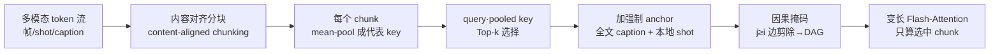

# Mixture of Contexts for Long Video Generation

**会议**: ICLR 2026  
**代码**: [https://primecai.github.io/moc/](https://primecai.github.io/moc/)  
**领域**: 视频生成 / 长视频 / 稀疏注意力  
**关键词**: 长视频生成, Diffusion Transformer, 稀疏注意力, 可学习路由, 长程记忆, MoC  

## 一句话总结
把长视频生成重新表述为"内部信息检索"问题，提出一个无参数但可训练的稀疏注意力路由模块 MoC——让每个 query 动态选取少量相关 chunk 加上强制 anchor（文本 + 本地窗口），并用因果掩码避免回路，从而在剪掉 85% token 对、注意力 FLOPs 降 7× 的同时，把分钟级视频的身份/动作/场景一致性维持住甚至做得更好。

## 研究背景与动机
**领域现状**：基于 Diffusion Transformer（DiT）的视频生成已能合成几秒钟逼真片段，但要推到分钟乃至小时级，真正的瓶颈不是画质而是**长程记忆**——模型必须在不漂移、不崩塌、不丢身份的前提下跨长时间线检索关键事件。而自注意力 $O(L^2)$ 的代价让长序列既算不动也学不动：480p、1 分钟视频展开后约 18 万 token。

**现有痛点**：以往工作走两条路压成本。一是**把历史压成紧凑表示**（关键帧、frame pack、隐状态如 FramePack/TTTVideo），代价是有损压缩丢细节；二是**强加固定稀疏/选择模式**（Radial Attention、SparseVideoGen 等），但静态稀疏无法适应"此刻到底哪段历史重要"。最接近的 LCT 把 DiT 的上下文窗扩到 8 个 shot，但保持全 dense 注意力，FLOPs/显存仍随 $(8L_{shot})^2$ 爆炸。

**核心矛盾**：效率与保真被硬编码成一个折中——压缩摘要丢细节、静态稀疏选不准，二者都限制了长程依赖与叙事连贯。

**本文目标**：在**不改 diffusion backbone、不改训练配方**的前提下，让模型自己学会"在正确的时刻召回正确的上下文"，把分钟级记忆做到接近短视频的成本。

**核心 idea**：**【重新定义任务】** 把长视频生成看成 token 级的"内部 in-context 检索"——每个 query 通过可学习的稀疏路由，只访问最相关的那几个上下文片段；效率不是目标而是检索的副产品。

## 方法详解

### 整体框架
MoC 用一个内容对齐的稀疏路由层替换 DiT 的 dense 注意力，三件事：(i) 把多模态 token 流沿帧/shot/caption 切成语义同质的 chunk，(ii) 每个 query 用无参数 top-k router 只路由到少数相关 chunk 外加强制 anchor，(iii) 用因果掩码强制信息严格前向流动。选中的 key 直接喂给变长 Flash-Attention kernel，其余全部跳过，得到近线性而非二次的计算/显存。

### 关键设计
**1. 动态 Top-k 路由：用无参数点积当检索引擎。** 给定所有 chunk 集合 $\Phi$，每个 query $q_i$ 只挑相关性最高的 $k$ 个 chunk 参与注意力：$\Omega(q_i)=\big[\arg\max_{\Omega^*}\sum_{\omega\in\Omega^*} q_i^\top \phi(K_\omega)\big]$，其中 $|\Omega^*|=k$，描述子 $\phi$ 就用对 chunk 内 key 做**均值池化**。注意力随即只在选中集合上算：$\mathrm{Attn}(q_i,K,V)=\mathrm{Softmax}\!\big(q_i K_{\Omega(q_i)}^\top/\sqrt d\big)\cdot V_{\Omega(q_i)}$。关键在于：top-k 虽不可导，但路由器本身**无参数**，学习信号通过被选中 chunk 的注意力反传——若选错 chunk，梯度会流回它的 key/value 并削弱其表示，从而把 query/key 投影塑造得更具判别力。这种"自纠正"靠的是 DiT 特征本身（如 DDAE 所示，去噪自编码器天然学到语义可分的表示），所以对空间相邻、时间相邻往往冗余的视频 token，均值就足以抓住主导语义。

**2. 内容对齐分块 + 双强制 anchor：把稀疏预算花在长程上。** 视频 DiT 是异构 3D+模态格点，简单按固定窗切会把背景静态 patch 和高熵运动 token 混在一起、污染均值池化的 key。MoC 改沿**帧/shot/模态条带**切分，让每个 chunk 语义同质、几何局部。在动态路由之外再插两条**强制边**：(a) **跨模态 sink**——每个视觉 query 必须 attend 全部文本 token（文本占比 <1% 却编码风格/身份/关键动作，充当低熵 anchor 和梯度高速路，显著抑制 prompt-drift 与稀有属性词消退）；(b) **本地 shot 窗**——每个 token 总是 attend 自己所属 shot，保住物体轨迹、光照连续等局部线索。这样真正长程的依赖才有 budget 去检索，而非把额度浪费在冗余的局部建模上。

**3. 因果路由掩码：把交互图变成 DAG 防回路。** 稀疏路由天然引入方向性，无序约束下会退化成病态闭环——消融中观察到 shot 9 强路由到 shot 11、shot 11 又路由回 shot 9，形成孤立两节点环，使两者与更早 shot 失联、表现为运动停滞或重复帧。MoC 在路由阶段加因果掩码：任何 $(i\to j)$ 满足 $j\ge i$ 的边在 top-k 前就被剪掉，使路由图成为有向无环图，信息严格前向流动，既消除反馈对又促成更丰富的长程依赖、训练更稳。

**4. 鲁棒性与效率工程：drop-off/drop-in + 逐头路由 + Flash kernel。** 借鉴 MoE 的"死专家"问题，**context drop-off** 随机丢掉 top-k 中 $\lfloor p_{drop}\cdot k\rfloor$ 个 chunk（$p_{drop}\sim\mathrm{Uniform}(0,p_{max})$）逼模型对偶发缺失也鲁棒，**context drop-in** 用 $m\sim\mathrm{Poisson}(\lambda)$ 注入额外 chunk 激活欠用路径、平衡路由分布。路由在**每层每个 head 独立**进行，相当于 $L_{layers}\times H_{heads}$ 个路由器的集成——单 head 严格稀疏，但跨 head/层的并集覆盖大得多的上下文，避免静态全局选择的信息瓶颈。实现上用 `torch.bucketize` + 前缀和表得到变长 chunk，`segment_reduce` 在线均值池化避免物化整块，最后打包成单次变长 Flash-Attention 调用；所有操作 head 独立、可张量并行。FLOPs 上 MoC 约 $Ld+2LCd+4Lk\bar m d$，对比 dense 的 $4L^2d$，比值 $\approx 2L/(Cd+2k\bar m)$ 随序列长线性增长。

## 实验关键数据

### 主实验表格
基座为 LCT（3B MMDiT，唯一支持长多 shot 通用场景的架构），在 8-shot、每 shot 8 秒 480p 12fps（约 18 万 token / 64 秒场景）上用 VBench 评测：

| 方法 | Subject↑ | Background↑ | Motion Smooth↑ | Dynamic Degree↑ | Aesthetic↑ | Image↑ | Sparsity↑ | FLOPs↓ |
|------|----------|-------------|----------------|-----------------|-----------|--------|-----------|--------|
| LCT (dense) | 0.9378 | 0.9526 | 0.9859 | 0.4583 | 0.5436 | 0.5140 | 0% | 1.7×10¹³ |
| **MoC (Ours)** | **0.9421** | **0.9535** | **0.9920** | **0.5625** | **0.5454** | 0.5003 | **85%** | **2.3×10¹²** |

在 85% 稀疏度下 FLOPs 降 >7×、端到端 2.2× 加速，多数指标反而提升。

### 消融实验表格

| 设计 | 去掉后的现象 |
|------|--------------|
| 因果掩码 | 出现两节点回路（shot 9↔11），运动停滞/重复帧、身份漂移（Fig. 2） |
| 内容对齐分块 | 均值池化 key 被污染，top-k 浪费在内部不一致的 key 上 |
| 跨模态 sink / 本地 shot 窗 | prompt-drift 加剧、稀疏属性词消退、scene cut 处语义断裂 |

### 关键发现
- **效率是检索的副产品**：剪掉 85% token 对后，计算从冗余帧重分配到关键视觉事件，Dynamic Degree 从 0.46 升到 0.56，画质仅轻微下降。
- **均值池化够用**：patch embedding 后局部 token 首主成分常解释 >90% 方差，算术均值就是该主成分估计；零样本直接套到预训练模型也有效。
- **质性上与 dense 难以区分**：剪掉 3/4 以上注意力计算，结果与 LCT 视觉上几乎无差异，跨数百乃至上千帧仍保住小细节与抽象语义。

## 亮点与洞察
- **范式转换**：第一个证明"可学习稀疏上下文路由"能当长程记忆引擎，且记忆/一致性是随数据规模与逐步稀疏化**涌现**出来的，无需 3D 先验或 FoV 这类显式启发式。
- **无参数却可学习**：路由器零额外参数，学习信号借道注意力反传，巧妙绕开 top-k 不可导。
- **即插即用**：不动 backbone、不改训练配方，从 LCT 权重初始化直接替换注意力层 fine-tune，工程落地友好；强制跨模态边还顺带提升文本引导编辑的可控性。

## 局限与展望
- **依赖基座 LCT**：实验只在唯一可用的多 shot 架构上验证，泛化到其他视频 DiT 仍待考。
- **appearance fidelity 轻微下降**：Image Quality 从 0.514 略降到 0.500，动作预算增大与外观保真之间仍有 trade-off。
- **均值池化描述子较粗**：对内部高熵 chunk 可能不够判别，更强的 chunk 描述子或可进一步提点。
- **评测维度有限**：主要靠 VBench 自动指标，缺人类偏好/叙事连贯的系统评估；分钟级以上（小时级）尚未验证。

## 相关工作与启发
- **长视频生成**：TECO、NUWA-XL、CausVid、MAGI-1、SkyReels-V2 走自回归/层级，FramePack/TTTVideo 走定长隐状态压缩，均有损；LCT 扩 dense 窗但二次代价。
- **视频稀疏注意力**：SparseVideoGen、STA、Radial Attention、VMoBA、VSA 多为剪 dense map 或固定稀疏先验，侧重加速短视频；MoC 端到端学习上下文源路由、聚焦长程记忆。
- **视觉生成的上下文学习**：WorldMem、Context-as-Memory、VMem 用外部 memory bank + FoV 检索，IC-LoRA/OminiControl/FLUX-Context 证明 DiT 的 in-context 能力；MoC 把"在多上下文源间端到端学路由"接到这条线上。
- **启发**：LLM 的 MoBA/NSA 稀疏注意力思想可迁移到异构多模态视频，但分块/anchor/因果必须针对视频结构重新设计。

## 评分
- **新颖性**: ⭐⭐⭐⭐⭐ 把长视频生成重述为内部检索 + 无参数可学习路由，且记忆能力涌现，思路新颖。
- **实验充分度**: ⭐⭐⭐⭐ 核心对比 + 关键消融（因果/分块）扎实，但仅单一基座、缺人类评测与小时级验证。
- **写作质量**: ⭐⭐⭐⭐ 动机清晰、公式与 FLOPs 推导完整、Fig.2 回路可视化有说服力。
- **价值**: ⭐⭐⭐⭐⭐ 即插即用把分钟级记忆做到短视频成本，对长视频生成落地价值大。

<!-- RELATED:START -->

## 相关论文

- [\[ICLR 2026\] MoGA: Mixture-of-Groups Attention for End-to-End Long Video Generation](moga_mixture-of-groups_attention_for_end-to-end_long_video_generation.md)
- [\[ICLR 2026\] VMoBA: Mixture-of-Block Attention for Video Diffusion Models](vmoba_mixture-of-block_attention_for_video_diffusion_models.md)
- [\[ICLR 2026\] NarrLV: Towards a Comprehensive Narrative-Centric Evaluation for Long Video Generation](narrlv_towards_a_comprehensive_narrative-centric_evaluation_for_long_video_gener.md)
- [\[ICLR 2026\] LongLive: Real-time Interactive Long Video Generation](longlive_real-time_interactive_long_video_generation.md)
- [\[CVPR 2026\] Free-Lunch Long Video Generation via Layer-Adaptive O.O.D Correction](../../CVPR2026/video_generation/free-lunch_long_video_generation_via_layer-adaptive_ood_correction.md)

<!-- RELATED:END -->
