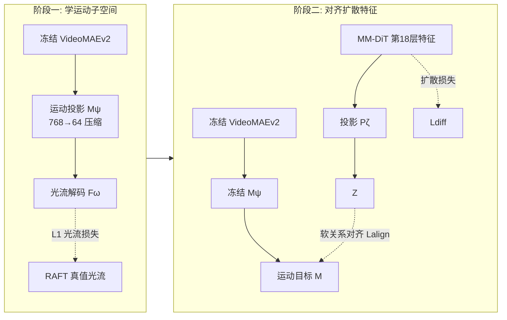

# MoAlign: Motion-Centric Representation Alignment for Video Diffusion Models

**会议**: ICLR 2026  
**OpenReview**: [https://openreview.net/forum?id=OR0ySm4l9h](https://openreview.net/forum?id=OR0ySm4l9h)  
**代码**: 待确认  
**领域**: 视频生成 / 视频扩散模型  
**关键词**: 文生视频, 视频扩散模型, 表征对齐, 运动解耦, 光流监督, 物理合理性  

## 一句话总结
MoAlign 从冻结的视频编码器里**蒸馏出一个只编码运动、不掺外观的低维子空间**（用光流监督逼出来），再用软关系对齐把文生视频扩散模型的中层特征对齐到这个运动子空间，让模型在不加任何推理期条件/仿真的情况下生成物理上更合理的视频。

## 研究背景与动机
**领域现状**：CogVideoX、Wan2.1、HunyuanVideo 这些 DiT 架构的文生视频模型已经能合成视觉质量很高的画面，但生成的运动经常违反物理常识——硬币悬浮在空中、碰撞穿模、轨迹跳变。问题根源在于模型对运动动力学的理解不足，**latent 空间里运动信息被严重欠编码**，哪怕单帧看起来很真实。

**现有痛点**：改善物理合理性的三条路线各有硬伤——(i) 仿真类方法接物理引擎/可微仿真器，效果好但算力重、领域窄、难扩展到开放世界；(ii) 条件控制类方法靠光流/轨迹/姿态做引导，推理时要额外输入和预处理，纯文生场景用不了；(iii) 表征对齐类方法（REPA、VideoREPA）把扩散特征对齐到预训练编码器，但这些编码器的特征**把外观和动力学纠缠在一起**，对齐时容易退化成匹配静态外观，运动该学的没学到；而且硬匹配会破坏预训练表征的稳定性。

**核心矛盾**：想把运动理解直接灌进模型 latent 空间，但又面临两难——对齐目标特征本身运动外观纠缠（学不到纯运动），硬对齐又会失稳。

**本文目标**：设计一种微调策略，**显式地只盯着运动动力学**，既不引入推理期额外开销，也不破坏模型稳定性。

**核心 idea**：先从预训练视频编码器里学一个**用光流监督、被维度瓶颈压出来的纯运动子空间**（disentangled motion subspace），再用**软关系对齐**（蒸馏 token 间的相似性结构而非硬匹配特征）把扩散模型对齐过去，把运动先验内化进生成模型本身。

## 方法详解

### 整体框架
MoAlign 是一个两阶段微调框架，基座是 CogVideoX-2B（MM-DiT，3D VAE latent）。**阶段一**先从冻结的 VideoMAEv2 提时空特征，过一个可学投影头压到低维并用真值光流监督，逼出一个只含运动的"教师"子空间；**阶段二**冻结这个教师，把 CogVideoX 某一中层（第 18 层）的 latent 特征经投影后，用软关系对齐 loss 对齐到运动子空间，和标准扩散 loss 联合训练。推理时整套对齐组件全部丢掉，生成接口与原始 CogVideoX 完全一致、零额外成本。

### 关键设计

**1. 用光流监督+维度瓶颈逼出"纯运动"子空间：把外观挤出去。** 直接拿视频编码器的特征做对齐目标的问题是运动和外观纠缠——没有显式监督，没法保证学到的表征隔离出运动。MoAlign 的做法是给冻结 VideoMAEv2 提出的时空特征 $S = V(x_0)$ 接一个可学投影头 $M = M_\psi(S) \in \mathbb{R}^{F''\times H''\times W''\times D_m}$，其中 $D_m \ll D_v$（实现里从 768 压到 64）。这个**维度瓶颈是关键**：容量被压缩后模型只能保留最显著的信息，而判别静态内容需要的容量被砍掉，于是被迫偏向运动。光是压缩还不够，再用一个轻量解码器 $F_\omega$ 把 $M$ 解成稠密光流 $\hat{O}$，用 L1 损失对齐 RAFT 算的真值光流 $L_{\text{flow}}=\|\hat{O}-O\|_1$。光流提供的是稠密、底层、逐像素的运动监督，强迫压缩后的特征去预测光流，就把子空间钉死在动力学结构而非静态语义上。

**2. 软关系对齐而非硬特征匹配：稳住预训练表征。** 阶段二要把扩散特征对齐到运动子空间，但 REPA 式的硬匹配（直接最大化逐 token 余弦相似度）会破坏预训练 DiT 的表征稳定性。MoAlign 改用源自 VideoREPA 的 Token Relation Distillation——不匹配特征本身，而是匹配 token 之间的**相似性结构**。把扩散第 18 层特征 $Y_t$ 经投影 $P_\zeta$ 得到与 $M$ 同尺寸的 $Z$，分别在空间和时间维计算 token 两两余弦相似度矩阵 $S^{\text{spatial}}_Z, S^{\text{temporal}}_Z$，再让它们去逼近教师的对应矩阵。这种"对齐关系而非对齐数值"的软方式，既把运动几何灌进去，又不直接覆写预训练特征，避免失稳。

**3. 时间加权强调跨帧动力学：让对齐更看重相邻帧的运动一致性。** 运动本质是帧间变化，所以对齐要重点压住跨帧关系而非帧内静态。MoAlign 在时间相似度上排除帧内 token 对，并引入一个按帧距离衰减的权重矩阵：当两 token 所属帧距离 $\Delta_{ij}\neq 0$ 时 $W_{ij}=\exp(-\Delta_{ij}/\tau)$，否则为 0（$\tau$ 为温度）。最终对齐损失把空间项和加权时间项相加：
$$L_{\text{align}}=\frac{1}{F''}\sum_{f=1}^{F''}\|S^{\text{spatial}}_Z(f)-S^{\text{spatial}}_M(f)\|_1+\|W\odot S^{\text{temporal}}_Z - W\odot S^{\text{temporal}}_M\|_1$$
总目标为 $L_{\text{total}}=L_{\text{diff}}+\lambda L_{\text{align}}$（$\lambda=0.5,\tau=10$）。相比 VideoREPA 原始的 TRD loss，这个时间加权额外强调了局部邻域的时序一致性，是把"短时运动连贯"显式编码进损失的关键一笔。

## 实验关键数据

### 主实验表格

**VideoPhy2（动作中心，人-物交互，591 prompt，SA=语义贴合/PC=物理常识/Joint=主指标）**

| 方法 | SA | PC | Joint |
|---|---|---|---|
| CogVideoX-2B | 27.1 | 64.5 | 22.3 |
| 静态基线(重复首帧) | 15.6 | 91.0 | 15.1 |
| CogVideoX-2B (FT) | 26.4 | 73.1 | 22.8 |
| VideoREPA-2B (复现) | 26.1 | 73.3 | 23.0 |
| **MoAlign-2B (ours)** | **28.8** | **75.0** | **24.9** |

> 静态基线 PC 高达 91 但 Joint 极低，说明只看 PC 会被"不动就不违反物理"骗到，必须看 Joint。MoAlign 在 SA、PC、Joint 三项全面领先，VideoREPA 提了 PC 却掉了 SA。

**VideoPhy（材料中心，三类物质交互，343 prompt，整体 Overall）**

| 方法 | Overall SA | Overall PC |
|---|---|---|
| CogVideoX-2B | 49.8 | 23.9 |
| CogVideoX-2B (FT) | 44.9 | 34.1 |
| VideoREPA-2B (复现) | 46.7 | 37.9 |
| **MoAlign-2B (ours)** | **49.3** | **39.4** |

> 在该数据上所有微调模型 SA 都会掉（训练集缺相关样本），但 MoAlign 掉得最少、PC 最高，三类交互全拿最高 PC。

**通用质量（VBench / VBench-2.0 Total）**

| 方法 | VBench Total | VBench-2.0 Total |
|---|---|---|
| CogVideoX-2B | 80.6 | 54.9 |
| VideoREPA-2B | 80.5 | 55.0 |
| **MoAlign-2B (ours)** | **81.3** | **55.9** |

> 各方法 VBench 基本持平（没牺牲技术质量），VBench-2.0 上 MoAlign 提升主要来自 Commonsense、Human Fidelity（实例保持、动态空间关系、人体解剖）。

### 消融实验表格

**组件消融（VideoPhy2）**

| 配置 | SA | PC | Joint |
|---|---|---|---|
| REPA loss | 25.7 | 71.9 | 22.3 |
| CogVideoX (FT) | 26.4 | 73.1 | 22.8 |
| VideoREPA | 26.1 | 73.3 | 23.0 |
| MoAlign w/o 运动特征 | 27.8 | 73.8 | 23.5 |
| MoAlign w/o 软-TRD loss | 28.2 | 74.4 | 24.1 |
| **MoAlign (完整)** | **28.8** | **75.0** | **24.9** |

> 两个组件各自单独都能超过 VideoREPA；同时去掉两者就退化成 VideoREPA。经典 REPA 硬对齐最差，连单纯微调都打不过。

**对齐层选择（VideoPhy2 Joint）**：层 10→22 中，第 18 层 Joint 最高（24.9），太浅太深都掉，说明运动相关的关系结构集中在中深度 block。

**用户研究（672 对偏好）**：MoAlign vs CogVideoX-2B 偏好率 **68% : 32%**；vs VideoREPA-2B **78% : 22%**。

### 关键发现
- **解耦运动 > 纠缠特征**：VideoREPA 对齐纠缠特征会以牺牲 prompt 贴合度（SA）换物理真实感，MoAlign 对齐纯运动子空间则 SA 和 PC 双升。
- **关系蒸馏 > 硬匹配**：REPA 式硬对齐失稳，结果最差；软关系对齐既灌运动又保稳定。
- **单中层对齐最优**：把 loss 摊到多层反而变差，过宽的正则会扰乱去噪轨迹。

## 亮点与洞察
- **"先逼出纯运动子空间再对齐"这一步是真正的差异点**：用光流监督+维度瓶颈把运动从外观里挤出来，直击 REPA/VideoREPA 特征纠缠的病根，思路干净。
- **零推理期成本**：和 VideoJAM（推理期靠 inner-guidance 注入运动、扩了输出空间）不同，MoAlign 推理时整套对齐组件丢掉，生成接口零改动，工程友好。
- **评测设计有自省意识**：用静态基线戳破"只看 PC 会被骗"的陷阱，强调 Joint 才是有意义指标，方法论上诚实。
- **训练极轻**：阶段二只训 4000 iter，对齐发生在单层，改动面很小却换来跨多个 benchmark 的一致提升。

## 局限与展望
- **受训练数据覆盖面限制**：在 VideoPhy（材料/热力学交互）和 VBench-2.0 的 Physics 维度上所有微调模型都掉分，作者明说是训练集缺相关样本（thermotics、materials）所致——方法本身的天花板被数据钉死。
- **只在 CogVideoX-2B（少量 Wan2.1-1.3B 验证）上做**：更大规模、更新架构的扩散模型上能否同样奏效未充分验证。
- **依赖外部光流真值（RAFT）和 VideoMAEv2**：运动子空间质量受这些现成组件上限约束，光流本身在复杂遮挡/快速运动下也不可靠。
- **单层、固定超参**：第 18 层、$\lambda=0.5$、$\tau=10$ 是针对该模型调出来的，跨模型迁移可能要重新搜参。

## 相关工作与启发
- **REPA（Yu et al. 2025）**：图像扩散表征对齐的源头，把 DiT 中层对齐到 DINOv2 特征加速收敛——MoAlign 的对齐范式根基，但指出其图像中心、纯空间、硬匹配不适合视频运动。
- **VideoREPA（Zhang et al. 2025b）**：把 REPA 扩到视频，用 Token Relation Distillation 蒸馏时空关系——MoAlign 直接复用其 TRD loss，但批评它对齐的是纠缠特征，并加了时间加权。
- **VideoJAM（Chefer et al. 2025）/ Track4Gen（Jeong et al. 2025）**：同样用光流改善运动，但 VideoJAM 要推理期 inner-guidance、扩输出空间，Track4Gen 是 I2V 单 block 局部对应——MoAlign 强调自己不预测流、不改推理接口的差异化定位。
- **启发**：把"解耦目标表征"作为对齐前置步骤（而非直接拿现成编码器特征对齐），是表征对齐类方法一个可推广的范式；想灌什么先验，就先用对应的弱监督（这里是光流）把那个先验从纠缠特征里蒸出来。

## 评分
- **新颖性**: ⭐⭐⭐⭐ — "先用光流监督逼出纯运动子空间再做软关系对齐"是对 REPA/VideoREPA 特征纠缠问题的精准回应，组合新颖；但底层 TRD loss、REPA 范式都是借用，是巧妙改进而非全新框架。
- **实验充分度**: ⭐⭐⭐⭐ — 覆盖物理(VideoPhy/2)、通用质量(VBench/2.0)、用户研究三轴，组件/对齐层消融完整，静态基线对照诚实；扣分在主要只在 2B 模型上验证、VideoPhy 上 SA 普遍下降未彻底解决。
- **写作质量**: ⭐⭐⭐⭐ — 动机链条清晰（三路线痛点→两难→解法），公式与图示到位，对自身评测陷阱有自省；个别处依赖附录。
- **价值**: ⭐⭐⭐⭐ — 零推理期成本、工程友好、跨多 benchmark 一致提升物理合理性，对追求"既要物理真实又要纯文生"的视频生成实践有直接参考价值。

<!-- RELATED:START -->

## 相关论文

- [\[CVPR 2026\] SMRABooth: Subject and Motion Representation Alignment for Customized Video Generation](../../CVPR2026/video_generation/smrabooth_subject_and_motion_representation_alignment_for_customized_video_gener.md)
- [\[ICLR 2026\] Target-Aware Video Diffusion Models](target-aware_video_diffusion_models.md)
- [\[ICLR 2026\] VMoBA: Mixture-of-Block Attention for Video Diffusion Models](vmoba_mixture-of-block_attention_for_video_diffusion_models.md)
- [\[ICLR 2026\] NeRV-Diffusion: Diffuse Implicit Neural Representation for Video Synthesis](nerv-diffusion_diffuse_implicit_neural_representation_for_video_synthesis.md)
- [\[CVPR 2026\] Inference-time Physics Alignment of Video Generative Models with Latent World Models](../../CVPR2026/video_generation/inference-time_physics_alignment_of_video_generative_models_with_latent_world_mo.md)

<!-- RELATED:END -->
