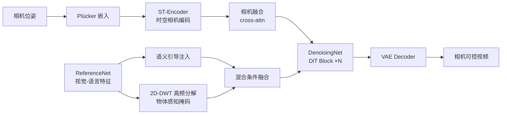

# MoCa: Modeling Object Consistency for 3D Camera Control in Video Generation

**会议**: ICLR 2026  
**OpenReview**: [https://openreview.net/forum?id=DZcpnudp7f](https://openreview.net/forum?id=DZcpnudp7f)  
**代码**: 待确认  
**领域**: 视频生成 / 相机控制  
**关键词**: 相机可控视频生成, 物体一致性, Plücker 嵌入, 运动解耦, 双分支扩散  

## 一句话总结
MoCa 不去显式重建 3D，而是把"平滑相机运动会让 2D 帧里的物体在视角、外观、运动上保持一致"这一观察拆成三类一致性约束，用双分支扩散框架同时管住相机轨迹、外观稳定和物体运动解耦，从而隐式学到相机与场景的 3D 关系。

## 研究背景与动机
**领域现状**：文生视频扩散模型已经能产出高保真画面，但要做"相机可控生成"——按给定的相机轨迹移动视角、合成新视图——就要求模型理解 2D 像素与 3D 场景之间的空间关系。形式上，标准 T2V 学的是 $f(P)\to V^{X\times Y\times T}$，而相机控制把映射复杂化成 $f(P,C)\to V^{X\times Y\times Z\times T}$，多出来的 $Z$ 维正是相机运动带来的、必须始终保持一致的 3D 空间关系。

**现有痛点**：两条主流路线各有死穴。一类（MotionCtrl、CameraCtrl）把相机参数当成额外条件，靠时序注意力或逐元素相加塞进去噪 U-Net，但没有 3D 空间感知，常出现物体消失、纹理崩坏、运动不自然等伪影；另一类（VidCRAFT3、ViewCrafter、I2VControl-Camera）把帧转成点云或 RGB-D 来显式监督 3D，效果更几何一致，却严重依赖精确的 3D 估计，泛化性和实用性都受限。

**核心矛盾**：两种失败都源自同一个根：**2D 像素空间与底层 3D 世界之间的鸿沟**。直接在 2D 域里硬塞相机条件会破坏几何，强行引入显式 3D 又被估计误差和数据稀缺拖累。

**本文目标**：在不依赖显式 3D 重建、不构建专门动态视频数据集的前提下，做到精确相机控制的同时保住画质，并且让前景物体的动态运动自然可信。

**核心 idea**：作者的关键观察是——一段相机可控的视频本质是 3D 场景的 2D 投影，平滑的相机运动必然让物体在帧间表现出**视角一致、外观一致、运动一致**。**[隐式 3D 桥梁]** 反过来，只要在 2D 帧上强约束这三类一致性，模型就能隐式学到相机与场景的 3D 关系，绕开显式重建。

## 方法详解

### 整体框架
MoCa 是一个 dual-branch 双分支扩散框架，基座是 CogVideoX 这样的 DiT 视频模型，由结构相同、权重均继承自预训练 DiT 的 **ReferenceNet** 与 **DenoisingNet** 组成。三类一致性各对应一个模块：相机条件模块（Camera Condition Module）用 Plücker 嵌入管视角一致；语义引导策略（Semantic Guidance）从 ReferenceNet 注入视觉-语言特征管外观一致；运动解耦（Motion Disentanglement）用频域分析把物体运动从相机运动里剥出来管运动一致。三者协同，让模型在隐式层面学会"相机怎么动、场景怎么变"。

### 关键设计

**1. 相机条件模块：用 Plücker 嵌入把轨迹绑到像素级，守住视角一致。** 作者用 Plücker 嵌入而非裸相机参数来表示轨迹，因为它带强几何解释、信息细到每个像素。给定外参 $E=[R;t]\in\mathbb{R}^{3\times4}$ 和内参 $K\in\mathbb{R}^{3\times3}$，对每个像素 $(u,v)$ 算出射线方向 $d=RK^{-1}[u,v,1]^T+t$，归一化得 $d'$，再拼成 $p=(o\times d', d')$（$o$ 为相机中心），最终每帧得到 $P_i\in\mathbb{R}^{6\times h\times w}$ 的几何嵌入。光有几何表示还不够，要让它和视觉 latent 在时空上对齐：**Spatial-Temporal Camera Encoder (ST-Encoder)** 在空间域用下采样+卷积+残差的渐进卷积结构抽像素级相机运动特征，在时间域加专门的时序卷积建模帧间动态。最后相机表示通过每个 DiT block 里的 cross-attention 融进去噪过程（即 Camera Fusion Module），让模型按时空相机条件动态调制视觉特征，保证相机视角和语义物体对齐，减少"文本描述的前景没出现"这类视角失配。

**2. 语义引导策略：拿冻结基座的视觉-语言特征当锚，稳住外观一致。** 作者发现一旦塞进额外相机信号，会削弱基座模型本身的生成能力，导致复杂动态场景、剧烈相机运动下物体扭曲、纹理崩坏。对策是从 ReferenceNet 每个 DiT block 的视觉分支抽出视觉-语言特征，注入到 DenoisingNet 对应的每个 DiT block。这些特征在视觉与语义空间都对齐，相当于整个场景的"持久全局信息"，给相机条件下的视觉特征融合提供稳定的外观参照，从而抑制物体畸变和纹理坍塌。由于 ReferenceNet 与 DenoisingNet 同构、同源初始化，这种 reference-style 注入能有效维持物体身份与纹理一致。

**3. 运动解耦：频域高频掩码把物体动态从相机运动里剥离，换来运动一致。** 现有方法常在"全局相机运动"和"局部物体运动"之间二选一——相机一动起来，鱼就不游、人就不走，因为扩散模型把物体运动和相机运动纠缠在一起。MoCa 把整段视频运动分解为相机运动（已由相机条件模块处理）+ 物体运动，重点解决后者。具体做法是 **High-Frequency Object-Aware Masking**：对基座模型给出的视觉-语言特征做多级 2D 离散小波变换（2D-DWT），在不同方向上提取高频分量，高频正好对应前景物体的结构与边缘区域，于是这些分量就成了隐式的"物体感知掩码"，精确定位前景。再通过 **Hybrid Condition Fusion** 把物体感知掩码和相机条件视觉特征融合：用 cross-attention 做空间条件融合、用 temporal attention 强制帧间一致，让模型既精确执行相机运动，又保住物体自身的自然动态。这样即便文本要求的物体运动方向与相机平移方向相冲突（如"鸟从右往左飞"而相机右移），物体运动也不会被相机运动覆盖或扭曲。

## 实验关键数据

训练：从 CogVideoX 微调，数据用 RealEstate10K（约 6.5 万带逐帧相机参数的片段，静态场景为主）；评测同时在 RealEstate10K 与 VidGen（动态场景为主）上做。指标涵盖 FID/FVD/CLIPSIM（画质与对齐）、TransErr/RotErr（相机精度，基于 Mega-SAM 重建轨迹）、以及 VBench 的 OC/BC/MS（前景物体/背景/运动平滑一致性）。

### 主实验表格

| 数据集 | 方法 | FID↓ | FVD↓ | CLIPSIM↑ | TransErr↓ | RotErr↓ | OC↑ | BC↑ | MS↑ |
|---|---|---|---|---|---|---|---|---|---|
| RealEstate10K | MotionCtrl | 246.6 | 870.8 | 0.309 | 0.716 | 0.213 | 94.6% | 95.8% | 97.8% |
| | CameraCtrl | 255.8 | 931.5 | 0.305 | 0.708 | 0.204 | 94.3% | 94.7% | 97.7% |
| | AC3D | 225.2 | 683.4 | 0.309 | 0.695 | **0.196** | **95.1%** | 95.3% | 98.5% |
| | **MoCa** | **207.4** | **667.9** | **0.312** | 0.703 | 0.208 | 94.9% | **96.4%** | **98.5%** |
| VidGen | MotionCtrl | 274.0 | 1858.2 | 0.333 | 0.722 | 0.107 | 92.6% | 93.2% | 97.1% |
| | CameraCtrl | 266.3 | 1905.1 | 0.339 | 0.731 | 0.089 | 92.9% | 93.1% | 96.9% |
| | AC3D | **228.4** | 1712.0 | 0.345 | 0.727 | 0.084 | 93.5% | 94.7% | 97.7% |
| | **MoCa** | 232.2 | **1643.7** | **0.349** | 0.724 | **0.081** | **94.7%** | **95.1%** | **98.3%** |

静态场景（RealEstate10K）画质指标全面领先；动态场景（VidGen）在 CLIPSIM、OC、MS、RotErr、FVD 上领先，FID/TransErr 取得次优。核心卖点是动态场景下运动平滑度 MS 不退化（98.3% vs 其他方法显著掉点）。

### 消融实验表格（RealEstate10K）

| 配置 | FID↓ | FVD↓ | TransErr↓ | OC↑ | BC↑ | MS↑ |
|---|---|---|---|---|---|---|
| w/o Plücker 嵌入 | 225.8 | 694.7 | 0.758 | 93.5% | 95.1% | 98.4% |
| w/o 语义引导 | 243.1 | 705.6 | 0.722 | 94.1% | 95.8% | 97.9% |
| w/o 高频建模 | 235.4 | 649.8 | 0.744 | 94.5% | 94.9% | 98.0% |
| Full（加法融合） | 236.2 | 771.8 | 0.738 | 94.6% | 95.1% | 98.2% |
| **Full（注意力融合）** | **207.4** | **667.9** | **0.703** | **94.9%** | **96.4%** | **98.5%** |

### 关键发现
- **Plücker 嵌入不可替换为裸参数**：直接用相机外/内参数值会破坏几何关系，TransErr 从 0.703 恶化到 0.758，相机精度和一致性都掉。
- **语义引导防外观崩坏**：去掉后海龟等物体在剧烈相机运动下出现明显几何畸变，FID 从 207.4 升到 243.1。
- **高频掩码撑运动平滑**：去掉高频分解、直接融合视觉-语言特征，物体/背景一致性显著下降，动态场景的运动平滑度尤其受损。
- **cross-attention 融合优于逐元素相加**：注意力融合在几乎所有指标上压过加法融合（FID 207.4 vs 236.2），说明动态调制比静态相加更能保几何。
- **冲突运动验证解耦**：当文本运动方向与相机方向相反时，MoCa 能让物体逆相机方向运动而不被覆盖，其他方法则物体运动被相机运动同化。

## 亮点与洞察
- **观察驱动的设计哲学**：把抽象的"2D-3D 鸿沟"翻译成三条可在 2D 帧上直接约束的一致性（视角/外观/运动），既避开显式 3D 重建的估计误差，又比纯条件注入更有结构性，是很干净的 problem reframing。
- **复用基座能力而非对抗它**：相机条件会削弱生成能力，作者不去硬调，而是用同构 ReferenceNet 的视觉-语言特征把基座的外观先验"接回来"，思路务实。
- **频域做隐式分割**：用 2D-DWT 高频分量当物体感知掩码，是无需额外分割标注就拿到前景定位的轻巧手段，把运动解耦落到可操作的实现上。
- **无需专门动态数据集**：仅在以静态为主的 RealEstate10K 上微调，却能泛化到 VidGen 动态场景并保住运动平滑，说明三类一致性约束确实学到了可迁移的相机-场景关系。

## 局限与展望
- **动态场景画质非全面最优**：VidGen 上 FID 与 TransErr 只是次优，说明在剧烈物体运动下画质与相机精度仍有取舍空间。
- **依赖基座的视觉-语言特征质量**：语义引导和高频掩码都建立在冻结基座抽出的特征上，若基座对某类物体语义不强，外观稳定和前景定位都会受连带影响。
- **相机精度未夺冠**：RotErr/TransErr 多处落后于 AC3D，方法更偏"物体一致性"而非极致相机精度，二者的平衡仍可继续优化。
- **评测分辨率与帧数受限**：实验统一下采样到 16 帧、固定尺寸，长视频、高分辨率下三类一致性能否维持尚待验证。

## 相关工作与启发
- **条件注入路线**（MotionCtrl、CameraCtrl）：把相机当额外条件塞进 U-Net，MoCa 继承了 Plücker 表示但换成 DiT + cross-attention 融合并补上三类一致性约束。
- **显式 3D 路线**（VidCRAFT3、ViewCrafter、I2VControl-Camera、CamTrol）：靠点云/RGB-D 做几何监督，MoCa 的反命题是"用 2D 一致性隐式学 3D"，规避估计误差。
- **DiT 相机控制**（AC3D、Bahmani et al.）：MoCa 沿用其往每个 DiT block 注入控制信号的融合范式，主要竞品也是 AC3D。
- **Reference-style 一致性**（AnimateAnyone 类的 ReferenceNet 结构）：MoCa 把维持身份一致的 reference 思路迁移到相机控制场景做外观稳定，是一次跨任务借用。

## 评分
- **新颖性**: ⭐⭐⭐⭐ — "三类一致性隐式桥接 2D-3D"的 reframing 很清晰，频域高频掩码做运动解耦也不落俗套；但各组件（Plücker、ReferenceNet、cross-attn 融合）多为已有技术的组合。
- **实验充分度**: ⭐⭐⭐⭐ — 静态/动态双数据集、完整消融、冲突运动专项验证都到位；不足是缺更大规模/高分辨率/长视频与用户研究。
- **写作质量**: ⭐⭐⭐⭐ — 从观察到设计的逻辑链顺畅，三类一致性贯穿全文，图表对应清楚；个别表述略重复。
- **价值**: ⭐⭐⭐⭐ — 不需专门动态数据集就能在动态场景保住运动平滑，对实用相机可控视频生成是有吸引力的方案。

<!-- RELATED:START -->

## 相关论文

- [\[ICLR 2026\] 3D Scene Prompting for Scene-Consistent Camera-Controllable Video Generation](3d_scene_prompting_for_scene-consistent_camera-controllable_video_generation.md)
- [\[CVPR 2026\] SymphoMotion: Joint Control of Camera Motion and Object Dynamics for Coherent Video Generation](../../CVPR2026/video_generation/symphomotion_joint_control_of_camera_motion_and_object_dynamics_for_coherent_vid.md)
- [\[ICLR 2026\] Light-X: Generative 4D Video Rendering with Camera and Illumination Control](light-x_generative_4d_video_rendering_with_camera_and_illumination_control.md)
- [\[ICLR 2026\] Geometry Forcing: Marrying Video Diffusion and 3D Representation for Consistent World Modeling](geometry_forcing_marrying_video_diffusion_and_3d_representation_for_consistent_w.md)
- [\[ICLR 2026\] MIMIC: Mask-Injected Manipulation Video Generation with Interaction Control](mimic_mask-injected_manipulation_video_generation_with_interaction_control.md)

<!-- RELATED:END -->
