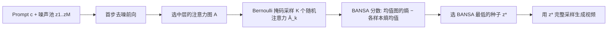

# Model Already Knows the Best Noise: Bayesian Active Noise Selection via Attention in Video Diffusion Model

**会议**: ICLR 2026  
**OpenReview**: [https://openreview.net/forum?id=11dzFZ2UM1](https://openreview.net/forum?id=11dzFZ2UM1)  
**代码/项目页**: [https://anse-project.github.io/anse-project/](https://anse-project.github.io/anse-project/)  
**领域**: 视频生成 / 文本到视频扩散 / 噪声初始化  
**关键词**: 视频扩散, 噪声选择, 贝叶斯主动学习, 注意力不确定性, BALD, 推理时缩放  

## 一句话总结
本文提出 ANSE 框架及其核心打分函数 BANSA，把"贝叶斯主动学习(BALD)"从分类任务迁移到扩散模型的**注意力空间**，通过度量多次随机扰动下注意力图的熵分歧来量化模型对某个初始噪声种子的"确信度"，从而在**不重训、不跑完整去噪**的前提下、仅用首步的部分注意力层就挑出更好的初始噪声种子。

## 研究背景与动机
- **领域现状**：文本到视频(T2V)扩散模型质量飞涨，但同一 prompt 换一个随机种子，生成结果的质量、时序一致性、文本对齐可能天差地别。初始噪声的选择对结果影响巨大，"挑一个好种子"是一条与架构设计正交的推理时增益方向，契合当前 inference-time scaling 的潮流。
- **现有痛点**：现有噪声初始化方法(FreeInit、FreqPrior、FreeNoise、PYoCo)都依赖**外部先验**——频率滤波保留低频成分、帧间平滑、高斯型先验等——并且需要**反复跑完整扩散过程**来精修噪声，代价极高(FreeInit 高达 +200% 推理时间，FreqPrior +105%)。
- **核心矛盾**：这些方法把噪声当成一个需要被外部规则"修好"的对象，却**忽略了模型自身的内部信号**——其实模型在前向时已经隐含地"知道"哪些种子让它行为更确信、更一致。如何无需外部先验、无需完整采样就读出这个内部信号，是关键。
- **本文目标**：构建一个 **model-aware(模型自知)** 的噪声选择框架，仅靠模型内部的不确定性度量来给种子排序，开销控制在 +15% 以内。
- **核心 idea**：**【把 BALD 搬到注意力空间】** 经典主动学习里 BALD 用分类 logits 的互信息度量认知不确定性(epistemic uncertainty)；扩散模型没有显式预测分布，但**注意力图**是文本与视觉 token 对齐的最信息丰富的信号。于是用"多次随机注意力样本的熵分歧"来代替分类 logits，BANSA 分数越低代表模型对该种子的注意力越确信、越一致，经验上对应更连贯的视频。

## 方法详解

### 整体框架
ANSE 的流程很直接：给定 prompt，先采样一个噪声池 $Z=\{z_1,\dots,z_M\}$，对每个种子在**早期某一去噪步**用 Bernoulli 掩码注意力快速估出它的 BANSA 分数，再选分数最低(最确信、最一致)的种子 $z^*$ 去做完整生成。三个组件层层为"高效"服务：BANSA 定义不确定性准则(Sec 3.1)、Bernoulli 掩码把 $K$ 次前向压成一次(Sec 3.2)、相关性探针只保留少数信息丰富的层(Sec 3.3)。

### 关键设计

**1. BANSA 分数：把"均值熵 vs 熵均值"之差当作注意力不确定性。** 这是全文的心脏。给定种子 $z$、prompt $c$、时间步 $t$，注意力图为 $A(z,c,t)=\mathrm{Softmax}(QK^\top)\in\mathbb{R}^{N\times N}$。在随机扰动下取 $K$ 个样本 $\{A^{(1)},\dots,A^{(K)}\}$，BANSA 定义为

$$\mathrm{BANSA}(z,c,t):=H\!\left(\frac{1}{K}\sum_{k=1}^{K}A^{(k)}\right)-\frac{1}{K}\sum_{k=1}^{K}H\!\left(A^{(k)}\right),$$

其中 $H(A)=\frac{1}{N}\sum_{i,j}-A_{ij}\log A_{ij}$。这与 BALD 的结构完全对应：第一项是"平均注意力图的熵"，第二项是"各次注意力图熵的平均"。两者之差同时刻画了**confidence(单次注意力是否够锐利)**与**consistency(多次注意力是否彼此一致)**。论文证明了一条干净的性质(Proposition 1)：$\mathrm{BANSA}=0 \iff A^{(1)}=\cdots=A^{(K)}$,即所有注意力样本完全一致时分数为零。选种子就是 $z^*=\arg\min_{z\in Z}\mathrm{BANSA}(z,c,t)$。注意框架不追求一个普适"黄金种子"——好坏是 prompt 依赖的,同一个种子对 prompt B 有益却可能拖垮 prompt C。

**2. Bernoulli 掩码注意力：把 $K$ 次独立前向压缩成单次前向。** 朴素地对每个种子跑 $K$ 次前向太贵。作者不重复前向,而是直接在注意力分数里注入随机性:对每个 $k$ 采一个二值掩码 $m_k\sim\mathrm{Bernoulli}(p)$,得到 $\hat{A}^{(k)}=A\odot m_k$ 并按行重新归一化,这样一次前向就能造出 $K$ 个随机注意力样本。代入得近似分数 $\mathrm{BANSA\text{-}E}$,由熵的凹性保证 $\ge 0$。消融表明 Bernoulli 掩码($p=0.2$)比 dropout 更贴合模型结构,捕捉注意力级不确定性更准。

**3. 累积相关性的层选择:只保留前 $d^*$ 层。** BANSA 可在任意层算,但逐层行为不同、用全部层仍然贵。作者按深度做累积平均 $\widehat{\mathrm{BANSA\text{-}E}}_{\le d}=\frac{1}{d}\sum_{l=1}^{d}\mathrm{BANSA\text{-}E}^{(l)}$,再用 Pearson 相关挑出最小的 $d^*$,使得前 $d^*$ 层的累积分数与全层分数的相关性 $\ge\tau$。实践中相关性在中等深度就迅速饱和,因此每个模型固定一个 $d^*$ 即可,在运行时几乎不增加成本却能稳定逼近全层分数。

**4. 早步 + 单步评估:把噪声选择放在去噪最开始。** 与需要"跑完整扩散再回头精修"的外部先验法相反,ANSE 只在**首个(早期)去噪步**评估种子。开销只来自种子打分阶段,采样过程与显存占用完全不变——这正是它能把额外开销压到 +15% 以内、做到即插即用的根本原因。

## 实验关键数据

### 主实验(VBench,AnimateDiff / CogVideoX)

| Backbone | Method | Quality | Semantic | Total | Inference Time |
|---|---|---|---|---|---|
| AnimateDiff | Vanilla | 80.22 | 69.03 | 77.98 | 28.23s |
| AnimateDiff | + Ours | 81.66 | 71.09 | 79.33 | 31.33s (+10.98%) |
| AnimateDiff | FreqPrior | 81.22 | 70.45 | 79.07 | 58.01s (+105%) |
| AnimateDiff | FreqPrior + Ours | 82.23 | 73.23 | **80.43** | 61.12s (+5.36%) |
| CogVideoX-2B | Vanilla / +Ours | 82.08 / 82.56 | 76.83 / 78.06 | 81.03 / 81.66 | 247.8s → +8.67% |
| CogVideoX-5B | Vanilla / +Ours | 82.53 / 82.70 | 77.50 / 78.10 | 81.52 / 81.71 | 667.3s → +13.1% |

在更先进的 MMDiT 架构(CogVideoX-2B/5B)上质量/语义/总分全面提升,且与 FreqPrior 完全兼容、叠加后分数更高。HunyuanVideo / Wan2.1 上的六个质量维度同样普涨(如 Subject Consistency 0.9562→0.9612),开销 +14%~+16%。在 MSR-VTT 上的 FVMD 运动保真度指标也一致下降(Wan2.1 16495→14306),印证运动质量增益。

### 消融实验

| 采集函数 (CogVideoX-2B) | Quality | Semantic | Total |
|---|---|---|---|
| Random | 82.08 | 76.83 | 81.03 |
| Entropy | 82.23 | 76.73 | 81.13 |
| BANSA (Dropout) | 82.43 | 76.91 | 81.33 |
| **BANSA (Bernoulli)** | **82.56** | **78.06** | **81.66** |

| 集成数 K | Subject Cons. | Background Cons. |
|---|---|---|
| 1 / 3 / 5 / 7 / 10 | 0.9618 → 0.9641 | 0.9788 → 0.9811 |

反向选种(选 BANSA 最**高**的种子)使 Quality 从 82.08 掉到 81.93,而正常选低分种子升到 82.56,验证了分数方向的因果性:低 BANSA 确实对应更好生成。$K$ 在 10 处饱和,故默认 $K=10$。

### 关键发现
- **分数有可解释的物理意义**:三个分析实验显示低 BANSA 种子(1)注意力图组内 Euclidean 距离更小(更稳定);(2)latent 轨迹方差更低但帧内方差更高(更平滑却更有表现力);(3)增益是 prompt 依赖的——没有"万能种子",只有"对当前 prompt 最确信的种子"。
- **开销可控且即插即用**:相比 FreeInit(+200%)、FreqPrior(+105%)需多次完整前向,ANSE 只多一次首步打分,全系 backbone 开销 <+15%,采样过程与显存不变。

## 亮点与洞察
- **视角转换最值钱**:把"修噪声"问题重构为"选噪声"问题,并指出最好的选择信号其实藏在模型自身的注意力里("model already knows")。这是一个干净、可迁移的观念。
- **理论-工程结合优雅**:BANSA 继承 BALD 的数学骨架,Proposition 1 给出零点充要条件让"分数=不确定性"有了严格意义;Bernoulli 掩码 + 层截断两步工程化把原本昂贵的 MC 估计压到单次前向、少数层,落地性强。
- **强泛化与正交性**:从 U-Net(AnimateDiff)到 MMDiT(CogVideoX/Wan2.1/Hunyuan)全谱适用,且与频率先验法可叠加,而非互斥。

## 局限与展望
- **仍需一个噪声池**:要从 $M=10$ 个候选里挑,意味着每个 prompt 多 10 次首步前向打分,虽便宜但非零成本;池子大小与质量增益的权衡未充分探讨。
- **超参数依赖**:Bernoulli 概率 $p$、截断层 $d^*$、阈值 $\tau$ 都需按模型预先校准;跨模型的自适应选择尚未自动化。
- **prompt 依赖性是双刃剑**:框架明确不追求普适种子,这保证了精准但也意味着无法预先离线挑出"通用好种子"缓存复用。
- **评估范围**:HunyuanVideo/Wan2.1 因算力只评了 6 个质量维度未做语义维度;统计显著性放在附录。

## 相关工作与启发
- **噪声初始化先验**:PYoCo(帧间相关噪声,需重训)、FreeNoise(噪声重调度)、FreeInit(频率滤波保低频)、FreqPrior(高斯型先验+部分采样)——本文与它们正交且可叠加,定位为"选择器"而非"精修器"。
- **贝叶斯主动学习**:BALD/Houlsby 系列用互信息度量认知不确定性,本文是把这套采集函数从图像分类首次系统迁移到生成式扩散的注意力空间,且无需额外模型或重训。
- **推理时缩放**:与 LLM 的 test-time scaling、扩散采样路径搜索同源,启发是——在生成任务里,"挑一个好起点"可能比"精修一个起点"性价比更高,而起点的好坏可以由模型内部信号自评。

## 评分
- **新颖性**: ⭐⭐⭐⭐⭐ 把 BALD 迁到扩散注意力空间做噪声选择,视角("model already knows")清新且首创,Proposition 1 让度量有理论根基。
- **实验充分度**: ⭐⭐⭐⭐ 覆盖 U-Net 到 MMDiT 五个 backbone + VBench/FVMD 双评测 + 反向选种因果验证 + 三个分析实验,较完整;噪声池规模权衡与跨模型自适应略欠。
- **写作质量**: ⭐⭐⭐⭐ 动机-方法-分析逻辑顺畅,图 2/3 概念对比清晰;个别表述与拼写小瑕疵(如 "signicanse")。
- **价值**: ⭐⭐⭐⭐⭐ 即插即用、<+15% 开销、与现有先验兼容、跨架构泛化,对实际 T2V 推理是高性价比的免费午餐。

<!-- RELATED:START -->

## 相关论文

- [\[ICLR 2026\] TPDiff: Temporal Pyramid Video Diffusion Model](tpdiff_temporal_pyramid_video_diffusion_model.md)
- [\[ICLR 2026\] QuantSparse: Comprehensively Compressing Video Diffusion Transformer with Model Quantization and Attention Sparsification](quantsparse_comprehensively_compressing_video_diffusion_transformer_with_model_q.md)
- [\[ICLR 2026\] Lumos-1: On Autoregressive Video Generation with Discrete Diffusion from a Unified Model Perspective](lumos-1_on_autoregressive_video_generation_with_discrete_diffusion_from_a_unifie.md)
- [\[ECCV 2024\] Videoshop: Localized Semantic Video Editing with Noise-Extrapolated Diffusion Inversion](../../ECCV2024/video_generation/videoshop_localized_semantic_video_editing_with_noise-extrapolated_diffusion_inv.md)
- [\[ICLR 2026\] Any-to-Bokeh: Arbitrary-Subject Video Refocusing with Video Diffusion Model](any-to-bokeh_arbitrary-subject_video_refocusing_with_video_diffusion_model.md)

<!-- RELATED:END -->
