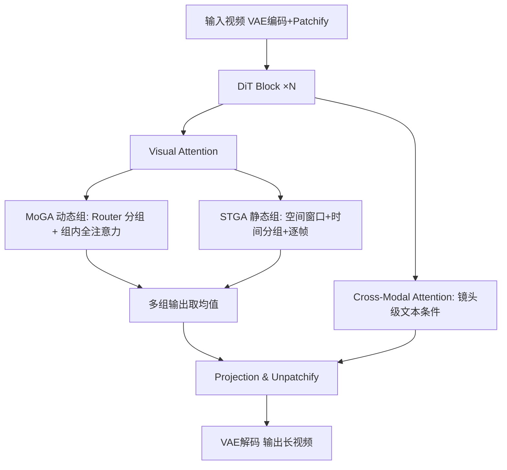

# MoGA: Mixture-of-Groups Attention for End-to-End Long Video Generation

**会议**: ICLR 2026  
**OpenReview**: [https://openreview.net/forum?id=0hy9kJ1ULB](https://openreview.net/forum?id=0hy9kJ1ULB)  
**代码**: [项目主页](https://jiawn-creator.github.io/mixture-of-groups-attention/)  
**领域**: 视频生成 / 长视频生成 / 稀疏注意力  
**关键词**: Long Video Generation, Sparse Attention, Diffusion Transformer, Token Routing, Multi-Shot  

## 一句话总结
MoGA 用一个轻量可学习的 token router 把 token 按语义分组、组内做全注意力，省掉了块稀疏注意力的"粗估块得分"环节，从而以约 58 万的上下文长度端到端生成分钟级、多镜头、480p/24fps 的长视频。

## 研究背景与动机

**领域现状**：用 Diffusion Transformer(DiT) 做视频生成时，全注意力的计算量随序列长度二次增长。长视频(分钟级、多镜头)的上下文动辄几十万 token——文中举例 1 分钟 480p、16fps 视频就有约 38.4 万 token——直接做全注意力不可行。而视频天然适合稀疏化：邻近 token 强局部相关，真正跨帧持续的全局语义只占少数，绝大多数 query-key 对几乎没贡献。

**现有痛点**：现有长视频方案各有硬伤。多阶段流水线(先生成关键帧再补中间帧)目标割裂、不直接面向最终任务，导致阶段间误差累积，还引入手工归纳偏置、难以 scaling。压缩历史内容的端到端方法(循环层、FramePack)必然丢信息。稀疏注意力里，静态选择(局部时空窗口)抓不住动态长程依赖；动态选择的"粗到细"方案要先估块级重要度再 top-k 选块、块内细注意力——但块越大、top-k 越小虽然省了粗估开销，选择精度却越差，块大小直接卡死了精度-效率的折中。

**核心矛盾**：块稀疏的"块级粗估"既是省钱手段又是精度瓶颈——块粒度决定了你既无法精确分配每个 token，又无法摆脱粗估阶段本身的开销。

**本文目标**：去掉块级粗估，让每个 token 被**精确**分配到该去的地方，同时保持与 FlashAttention、序列并行等现代注意力栈的兼容，端到端产出分钟级多镜头长视频。

**核心 idea**：**[路由替代块估]** 借鉴 MoE 的思路——MoE 把 token 路由到不同的专家 FFN 来 scale 参数量，MoGA 则把 token 路由到不同的注意力组来 scale 序列长度。一个线性层 router 把语义相关的 token 分到同组、组内做全注意力，router 权重相当于隐式聚类中心，无需任何全局相似度估计就能把 token 直接分配到可学习的锚点上。

## 方法详解

### 整体框架
模型采用 DiT 架构，交替堆叠 Visual Attention 块和 Cross-Modal Attention 块。Visual Attention 内部把动态的 **MoGA**(抓长程一致性) 与静态的 **Spatial-Temporal Group Attention(STGA)**(抓局部连续性) 组合，互补地兼顾全局与局部；Cross-Modal Attention 用 cross-attention 或 MMDiT 实现镜头级文本条件控制。配套一条多镜头长视频数据流水线产出训练样本。

### 关键设计

**1. Mixture-of-Groups Attention：用线性 router 把 token 精确分组、组内全注意力**。给定 token $x\in\mathbb{R}^d$ 和预设组数 $M$，router 是一个线性投影加 softmax gating，算出路由分数 $r=\text{Router}(x)$，组分配概率 $p(i|x)=\text{softmax}(r)_i$，token 被硬分配到概率最高的组 $g(x)=\arg\max_i p(i|x)$。随后在每组内部独立做自注意力，输出为 $\text{MoGA}(x)=p(g(x)|x)\cdot\text{SA}(q, K_{g(x)}, V_{g(x)})$，即用该组的 key/value 做注意力再乘上路由概率(让 router 可微)。这把复杂度从 $O(N^2)$ 降到理论下界 $O(N^2/M)$(均匀分组时)。可视化显示训练后 router 会把人物的头、手、衣服等语义连贯的结构分到同组、且跨镜头边界保持——说明它学到了语义感知的分组而非简单的空间邻近。关键是这条路径不需要块级估计，每个 token 都被精确分配。

**2. FlashAttention 兼容与序列并行：kernel-free 的工程友好性**。MoGA 是 kernel-free 的——它不改注意力内核，只在注意力前对 token 按组做 permute，把同组 token 排到一起，喂给标准 flash_attn(配合 cu_seq_len/max_seq_len 描述各组边界)，算完再 repermute 恢复原始 token 位置。这意味着它能直接套用 FlashAttention 而无需写定制 CUDA。对序列并行也兼容：在每层注意力的 sequence gather 和 head scatter 之前，MoGA 先对(整头的)token 算路由分数并跨 token 聚合路由结果，从而和现有的序列并行栈无缝衔接。相比 VMoBA 等块机制带来的额外显存开销，MoGA 不引入额外显存消耗。

**3. Group Balancing Loss：防止 router 坍缩退化成全注意力**。token 分配的隐患是 router 把大多数 token 都路由到少数几个组，这样 MoGA 就退化回了全注意力。借鉴 MoE 的 load balancing loss，引入辅助的组平衡损失 $L_{gb}=\alpha\cdot M\cdot\sum_{i=1}^{M}F_i\cdot P_i$，其中 $F_i=\frac{1}{N}\sum_x \mathbb{1}(g(x)=i)$ 是分到组 $i$ 的 token 比例，$P_i$ 是组 $i$ 的平均路由概率。该目标在均匀分布下取最小，因此最小化它会鼓励 token 在各组间均匀分配，保住稀疏性。论文中 $\alpha=0.1$、$M=5$(MMDiT 版 $M=20$)。

**4. Spatial-Temporal Group Attention：补足 MoGA 缺失的局部连续性**。MoGA 抓长程一致但缺局部连续，于是用静态预定义组的 STGA 来补。先把潜在视频切成固定空间窗口、再沿时间轴把帧分组，且不同镜头的帧分到不同时间组。作者发现完全切断跨镜头交互会导致镜头切换后第一帧闪烁，于是在算组注意力时给 key/value(不动 query)补上相邻镜头的两个潜在帧,以极小代价保住镜头边界的连续性。此外还做逐帧注意力实现帧内信息交换。每个 token 因此同时收到多组输出(一个动态组 + 两个静态组),取均值作为最终输出——这正是整体框架里"动态 MoGA + 静态 STGA"互补的落地方式。

## 实验关键数据

训练设置：在开源 Wan2.1(1.3B/14B) 上用 rectified flow 目标微调，稳定生成 477 帧/16fps(30 秒)/480p、上下文 187k；MMDiT 版生成 1441 帧/24fps(60 秒)/480p、上下文 578k。$M=5$、空间 2×2 分组，多阶段训练(10 秒 3k 步 + 30 秒 1k 步)。

### 主实验表格

5 秒单镜头短视频(与稀疏注意力 baseline 对比，VBench 指标)：

| 方法 | Base Model | Subject Consist.↑ | Aesthetic↑ | Image Quality↑ | Sparsity |
|------|-----------|------|------|------|------|
| Wan (原始全注意力) | Wan2.1-14B | 0.9611 | 0.5807 | 0.6680 | 0% |
| DiTFastAttn | Wan2.1-14B | 0.9456 | 0.5269 | 0.6466 | 50% |
| SVG (training-free) | Wan2.1-14B | 0.9002 | 0.5370 | 0.6357 | 50% |
| VMoBA (training-free) | Wan2.1-14B | 0.8605 | 0.5369 | 0.6111 | 31% |
| **MoGA** | Wan2.1-14B | **0.9699** | **0.5810** | **0.6994** | **71.25%** |

10 秒多镜头(跨镜头一致性指标)：

| 方法 | Base Model | Cross-Shots DINO↑ | Cross-Shots CLIP↑ |
|------|-----------|------|------|
| IC-Lora+Wan | Wan2.1-1.3B | 0.4669 | 0.7169 |
| EchoShot | Wan2.1-1.3B | 0.5961 | 0.8469 |
| **MoGA** | Wan2.1-1.3B | **0.6623** | **0.8654** |
| **MoGA** | Wan2.1-14B | **0.6703** | 0.8629 |

30 秒多镜头长视频：MoGA(Wan2.1-14B) Subject Consistency 0.9572 大幅超过 IC-Lora+Wan(14B) 的 0.8946；MMDiT 版即便极高稀疏度仍保持高保真。

### 消融实验表格

组数 $M$ 对一致性与算力的影响(Wan2.1-1.3B, 10s)：

| 组数 M | Cross-shot CLIP↑ | Cross-shot DINO↑ | Sparsity | PFlops |
|------|------|------|------|------|
| 1 | 0.8206 | 0.5919 | 0% | 0.88 |
| 2 | 0.8589 | 0.6761 | 41.25% | 0.59 |
| 4 | **0.8672** | 0.6853 | 66.25% | 0.42 |
| 8 | 0.8606 | **0.6910** | 78.75% | 0.36 |
| 16 | 0.8569 | 0.6896 | 81.25% | 0.35 |

一致性随组数呈"先升后降"——适度分组稀疏在全局一致与效率间取得最佳平衡。

### 关键发现
- **稀疏反而更好**：MoGA 在 71.25% 稀疏度下多个 VBench 维度仍能匹配甚至超过全注意力的原始 Wan/EchoShot，说明保留显著 token 间交互不仅省 FLOPs，还抑制了无关内容的噪声，带来更强身份一致与时序连贯。
- **计算收益**：30 秒视频 $M=5$ 时 MoGA 2.26 PFlops vs 全注意力 6.94 PFlops，训练/推理均约 1.7× 加速，且无额外显存开销。
- **MoGA 与 STGA 互补**：只用 MoGA 缺局部交换、产不出有意义内容；只用 STGA 缺长程交互、跨镜头一致性差；二者结合才达成强跨镜头一致。
- **router 学到语义分割**：把 router 分组当无监督语义分割、用 SAM2 掩码做 GT，训练后 MoGA IoU 28.6%，远超随机/未训练 router(15.6%/18.5%)；中间层最强(达 31.0%)，且随去噪 timestep 推进 IoU 从 17.6% 升到 28.6% 后稳定。

## 亮点与洞察
- **把 MoE 的路由思想从"scale 参数"迁移到"scale 序列长度"**，视角新颖：router 权重即隐式聚类中心，token 直接对齐到可学习锚点，彻底绕开块级相似度估计这个精度-效率瓶颈。
- **kernel-free + permute/repermute 的工程设计**让方法能直接复用 FlashAttention 和序列并行，落地成本极低，这是它敢上 578k 上下文的关键。
- **动态(MoGA)+静态(STGA)双轨**把"长程语义一致"和"局部细节连续"解耦到两类组里，再用补相邻镜头 key/value 的小技巧消除镜头切换闪烁，工程细节扎实。

## 局限与展望
- 硬分配(arg max)路由+组平衡损失依赖超参($\alpha$、$M$)，组数需按时长/分辨率手调，缺乏自适应组数机制。
- 评测主要在 480p、最长 60 秒，更高分辨率、更长时长(数分钟级电影)下路由质量与一致性是否保持仍需验证。
- 每个 token 取动态组+两静态组输出的均值是经验设计，不同组贡献的加权方式有进一步优化空间。
- 路由的语义分割质量(IoU 28.6%)虽超 baseline 但绝对值不高，分组的语义纯度还有提升余地。

## 相关工作与启发
长视频生成此前收敛到三大范式：多阶段(如 Captain Cinema 的层级规划)引入手工偏置、难端到端;自回归(Diffusion Forcing、CausVid、StreamingT2V)按段顺序合成;压缩历史(FramePack、循环层)必丢信息。稀疏注意力侧，静态窗口抓不住动态长程,块稀疏(VMoBA/SVG/MInference 类)受块粒度制约。MoGA 的启发在于:**稀疏选择不一定要"先估再选"——可学习路由能把"选哪些 token 交互"变成一个可端到端训练、且与高性能内核兼容的分组问题**,这对其他长序列模态(长文档、3D、音频)的高效注意力设计同样有借鉴意义。

## 评分
- **新颖性**: ⭐⭐⭐⭐ — 把 MoE 路由迁移到序列长度维度、用线性 router 取代块级粗估，是稀疏注意力路线里一个干净且有说服力的新视角。
- **实验充分度**: ⭐⭐⭐⭐ — 覆盖 5s/10s/30s/60s 多设置、对比多类 baseline、消融组数/MoGA-STGA/路由语义分割齐全；但缺更高分辨率与更长时长的压力测试。
- **写作质量**: ⭐⭐⭐⭐ — 动机图(全注意力/块稀疏/MoGA 三联)清晰,方法与工程细节交代到位,叙述连贯。
- **价值**: ⭐⭐⭐⭐ — 端到端 580k 上下文、分钟级多镜头长视频且 1.7× 加速、kernel-free 易落地,对长视频生成的实用价值高。

<!-- RELATED:START -->

## 相关论文

- [\[ICLR 2026\] Mixture of Contexts for Long Video Generation](mixture_of_contexts_for_long_video_generation.md)
- [\[CVPR 2026\] STARFlow-V: End-to-End Video Generative Modeling with Autoregressive Normalizing Flows](../../CVPR2026/video_generation/starflow-v_end-to-end_video_generative_modeling_with_autoregressive_normalizing_.md)
- [\[CVPR 2026\] MoCha: End-to-End Video Character Replacement without Structural Guidance](../../CVPR2026/video_generation/mocha_end-to-end_video_character_replacement_without_structural_guidance.md)
- [\[ICLR 2026\] VMoBA: Mixture-of-Block Attention for Video Diffusion Models](vmoba_mixture-of-block_attention_for_video_diffusion_models.md)
- [\[CVPR 2026\] EasyOmnimatte: Taming Pretrained Inpainting Diffusion Models for End-to-End Video Layered Decomposition](../../CVPR2026/video_generation/easyomnimatte_taming_pretrained_inpainting_diffusion_models_for_end-to-end_video.md)

<!-- RELATED:END -->
