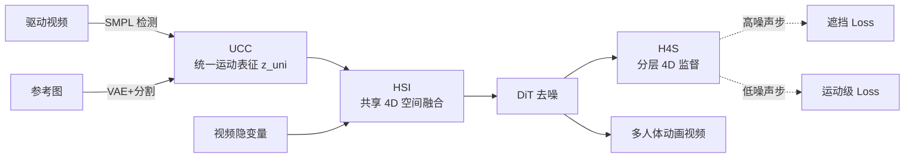

# MotionWeaver: Holistic 4D-Anchored Framework for Multi-Humanoid Image Animation

**会议**: ICLR 2026  
**OpenReview**: [https://openreview.net/forum?id=KjlLwRsiUE](https://openreview.net/forum?id=KjlLwRsiUE)  
**代码**: 待确认  
**领域**: 视频生成 / 角色图像动画 (Character Image Animation)  
**关键词**: 多人体动画, 4D 表征, SMPL, 遮挡建模, Diffusion Transformer, 运动-外观解耦  

## 一句话总结
MotionWeaver 把角色图像动画从单人扩展到多人体（机器人、拟人动物、游戏角色）场景，靠"提取身份无关的统一运动表征 + 在一个共享 4D 空间里融合运动与视频隐变量 + 分层 4D 监督"三件套，专治多角色互动里的身份混淆与遮挡。

## 研究背景与动机

**领域现状**：角色图像动画（给一张参考角色图 + 一段驱动姿态视频，合成该角色按姿态运动的视频）在单人场景已经很成熟，电影、电商、沉浸式内容都在用。主流做法从 GAN 转向 diffusion，用骨架图 / SMPL 渲染 / dense pose 作为控制信号注入 DiT。

**现有痛点**：这些方法几乎全卡在单人，一到多人体场景就崩，作者归纳出三个根因：
- **运动表征不够纯**：骨架图、SMPL 渲染天然携带身体比例、体型等外观信息，没法泛化到形态各异的"humanoid"（机器人、动物、avatar）；而且多角色的控制信号常被拼进同一张图，导致身份混淆。
- **缺乏显式 4D 建模**：现有方法直接把视频隐变量和控制信号做朴素 cross-attention，不显式建模角色之间、角色与场景之间的时空关系。**尤其没有深度信息**，既解不了遮挡，也分不清"真的是个小个子"还是"离镜头远显得小"。
- **训练策略次优**：普遍只用 2D 像素级 MSE loss，对 4D 运动没有任何显式监督，还把运动和外观耦在一起，让模型变成"无脑渲染控制信号的渲染器"而非"被运动信息引导的生成器"。

**核心矛盾**：要在只有人类训练数据的前提下，让模型学会泛化到各种 humanoid 形态、并在多角色密集互动 + 频繁遮挡下保持身份与运动一致——本质是**运动该被纯化成与形态无关的通用信号，且整个 pipeline 都要扎根在 4D 世界里**。

**本文目标**：构建端到端框架，支持多人体动画，鲁棒处理互动与遮挡。

**核心 idea**：**统一运动表征 + 全 4D 锚定范式**——运动提取、运动-隐变量融合、训练监督三个环节全部统一锚定在 4D 空间，让模型真正"理解"运动动态而非死记外观。

## 方法详解

### 整体框架
MotionWeaver 建立在预训练 I2V 模型（Wan2.1-I2V-14B）之上，由三个串联模块构成：先用 **Unified-Choreography Core (UCC)** 从驱动视频里抽出身份无关的运动 token 并绑定到对应角色，得到统一运动表征 $z_{uni}$；再用 **Hyper-Scene Integrator (HSI)** 把 $z_{uni}$ 和视频隐变量放进一个共享 4D 空间做融合（每隔 4 个 DiT block 插入一次）；最后用 **Hierarchical-4D Supervision (H4S)** 在不同噪声步上给 4D 运动以分层监督。base 模型全程冻结，只训练 group attention 和 HSI。

### 关键设计

**1. Unified-Choreography Core：把运动从形态里"剥"出来再绑回角色。** UCC 解决"运动表征不纯 + 身份混淆"两个病。第一步**提取身份无关运动 token**：用姿态检测器从驱动视频抽 SMPL 参数转成关节坐标 $\chi \in \mathbb{R}^{P\times F\times J\times 3}$，再映射到一套**标准化骨架** $\rho$（强制相邻关节间欧氏距离固定），抹掉骨长、体型这些 human-specific 偏置，得到 $\bar\chi$；最后过一个时序下采样的 tokenizer $\Phi_{tok}$ 抑制帧级噪声，产出运动 token $z_{mo}=\Phi_{tok}(\text{Map}(\chi,\rho))$。第二步**绑定运动与身份**：从参考帧用 mask 分割出各角色，过 base 模型的 VAE+patchify 得到身份 token $z_{id}$，再用一个 group attention 把两者关联——对每个角色 $p$，运动 token 作 query、身份 token 作 key/value：$z_{uni}[p]=\text{GroupAttn}(Q(z_{mo}[p]),K(z_{id}[p]),V(z_{id}[p]))$。这样即便角色互换位置也不会身份错配。

**2. Hyper-Scene Integrator：在共享 4D 空间里融合，深度单独伺候。** HSI 解决朴素 cross-attention 不建模时空关系、尤其缺深度的问题。它先给每个 motion-unit $z_{uni}[p,t]$ 定一个 4D 全局位置 $\Psi[p,t]\in\mathbb{R}^4$（取 SMPL 平移 $(x,y,z)$ 的时序均值再拼上隐时刻 $t$）。作者认为深度 $z$ 既关键又最难学、且视频隐变量天然缺深度线索，于是用两套互补机制：(a) **深度感知注意力**——把 $z$ 坐标做正弦编码成 depth token $z_{depth}$，与运动 token 拼接过 $\text{MLP}_K$ 得到 z-aware key，视频隐变量过 $\text{MLP}_Q$ 得 z-aware query，并由后文的遮挡 loss 监督，保证深度排序与可见性正确；(b) **动态 C-RoPE**（Cross-Attention Shared RoPE）——给 $(t,x,y)$ 三轴各分一段旋转矩阵 $\tilde{R}^d_{\Theta,t,x,y}=\text{diag}(R^{d/3}_{\Theta,t},R^{d/3}_{\Theta,x},R^{d/3}_{\Theta,y})$，key 依据 motion-unit 的全局位置 $\Psi$ 动态选取旋转矩阵，query 依据自身像素位置旋转（注意 $(x,y)$ 还要从相机空间投到像素透视面对齐），从而让模型快速捕捉角色间与场景的时空相对关系。

**3. 遮挡 Loss：把深度 attention 训成"谁挡谁"的判官。** 这是 DAA 能学到深度的关键监督。从 cross-attention 拿到注意力得分矩阵 $H$，对第 $p$ 个角色沿 $T、J$ 维求和得到角色专属注意力图 $h_p$；再构造 ground-truth mask $m_p$——在角色重叠区域，**把深度更远的那个角色的 mask 强制置零**，显式编码遮挡关系。优化 $L_{OCC}=\frac{1}{TP}\sum_i \text{MSE}(h_i,m_i)$，逼模型学对前后遮挡。

**4. Hierarchical-4D Supervision：按噪声步切换监督目标。** H4S 顺着 diffusion"先学全局布局、后抠细节"的特性设计动态 loss：$L_{H4S}=L_{MSE}+\lambda_1 L_{OCC}$（当 $t\ge\alpha T$，高噪声步），$=L_{MSE}+\lambda_2 L_{MO}$（当 $t<\alpha T$，低噪声步）。高噪声阶段叠遮挡 loss，让模型从去噪一开始就建立正确遮挡关系；低噪声阶段换成**运动级 loss** $L_{MO}$——此时去噪隐变量已近精确，VAE 解码后过预训练 4D 姿态检测器抽运动特征，与 GT 对齐做 MSE，把强 4D 运动先验灌进 HSI。再配可训练的 timestep-conditioned AdaLN + gating 调制 HSI，增强时序敏感度。$\alpha=0.6,\lambda_1=\lambda_2=1$。

此外作者为这套设置造了数据：**MultiHuman46**（46 小时多人互动视频，含拳击/击剑/舞蹈等，多阶段过滤保证 SMPL 精度）作训练集，**DualDynamics**（300 段双 humanoid 互动视频，专业动画团队制作）作多人体评测基准。

## 实验关键数据

### 主实验表格（DualDynamics 基准，双人体）

| Method | FVD↓ | FID-VID↓ | FID↓ | L1↓ | PSNR↑ | SSIM↑ | LPIPS↓ | CLIP↑ |
|---|---|---|---|---|---|---|---|---|
| MimicMotion | 312.4 | 74.23 | 71.72 | 0.6098 | 26.04 | 0.5165 | 0.4319 | 0.7842 |
| MusePose | 298.3 | 59.14 | 60.46 | 0.5741 | 28.12 | 0.5301 | 0.3416 | 0.8109 |
| StableAnimator | 262.5 | 35.19 | 34.97 | 0.5261 | 27.11 | 0.5341 | 0.3721 | 0.7741 |
| Animate-X | 230.1 | 32.47 | 30.22 | 0.5361 | 28.15 | 0.5276 | 0.3780 | 0.8539 |
| HumanVid | 174.6 | 29.12 | 31.58 | 0.5122 | 27.03 | 0.4576 | 0.4197 | 0.8214 |
| UniAnimate-DiT | 172.3 | 24.98 | 22.87 | 0.5743 | 29.11 | 0.5399 | 0.3482 | 0.8601 |
| RealisDance-DiT | 164.6 | 22.12 | 23.26 | 0.5341 | 29.06 | 0.5216 | 0.3271 | 0.8813 |
| **Ours** | **145.7** | **20.34** | **19.41** | **0.4836** | **29.19** | **0.5428** | **0.3213** | **0.9041** |

九项指标全面领先，FVD 从次优的 164.6 降到 145.7，CLIP 从 0.8813 升到 0.9041。

### 消融实验表格（DualDynamics）

| Method | FVD↓ | FID-VID↓ | FID↓ | L1↓ | PSNR↑ | SSIM↑ | CLIP↑ |
|---|---|---|---|---|---|---|---|
| w/o MNP（运动归一化） | 198.5 | 27.28 | 25.29 | 0.5524 | 26.34 | 0.519 | 0.7801 |
| w/o GAM（group attention） | 183.2 | 25.76 | 24.45 | 0.5343 | 27.98 | 0.537 | 0.8941 |
| w/o DAA（深度感知注意力） | 167.1 | 21.80 | 22.03 | 0.5252 | 28.64 | 0.522 | 0.8921 |
| w/o DCR（动态 C-RoPE） | 225.6 | 27.31 | 25.29 | 0.5541 | 26.28 | 0.511 | 0.8270 |
| w/o H4S（分层监督） | 174.3 | 24.22 | 21.46 | 0.5011 | 29.04 | 0.524 | 0.8714 |
| **Ours** | **145.7** | **20.34** | **19.41** | **0.4836** | **29.19** | **0.5428** | **0.9041** |

### 关键发现
- **动态 C-RoPE（DCR）最关键**：去掉后 FVD 飙到 225.6（最差），训练不稳、收敛慢，说明显式给 $(t,x,y)$ 位置编码是 4D 融合的地基。
- **运动归一化（MNP）次重要**：去掉后 FVD 198.5，且当参考角色体型偏离运动源时出现不真实肢体，印证标准化骨架对跨形态泛化的作用。
- **GAM 管身份**：移除后多角色互换位置时运动-角色错配。
- **DAA + 遮挡 loss 管遮挡**：移除后无法正确处理角色间遮挡。
- **可扩展性**：训练只用双人数据，推理却能泛化到 >2 个角色，验证 4D 锚定范式的通用性。

## 亮点与洞察
- **"全 4D 锚定"是一以贯之的方法论**：不是临时加一个深度 loss，而是把运动提取（标准化骨架 token）、融合（共享 4D 空间 + C-RoPE + 深度注意力）、监督（遮挡 loss + 运动级 loss）三个环节统一锚到 4D，逻辑闭环很漂亮。
- **遮挡 loss 的构造很巧**：直接用 attention 得分图对齐"远者置零"的 mask，把"谁挡谁"变成可监督信号，比单纯堆深度图更直接。
- **顺着 diffusion 噪声调度切监督**：高噪声步管全局遮挡布局、低噪声步管精细运动，与"先布局后细节"的扩散先验对齐，是个值得借鉴的训练 trick。
- **标准化骨架解耦运动与形态**：用固定关节间距抹掉体型，是让"机器人/动物/avatar"共享同一运动表征的关键一招。

## 局限与展望
- **强依赖 SMPL 与多人姿态检测器**：整条 pipeline 建在 CoMotion 估计的 SMPL 参数与 mask 上，姿态检测在极端遮挡/罕见形态下的误差会直接传导到生成。
- **humanoid 仍受限于人形拓扑**：标准化骨架基于 24 关节 SMPL，对偏离人形拓扑（如多足、非人骨架）的角色泛化未验证。
- **评测基准较新**：DualDynamics 为自建基准、规模 300 视频且全是双人，跨基准、>2 人的定量对比还不充分（论文里 >2 人多为定性）。
- **训练成本不低**：8×H100、需要先训 4D tokenizer 再训 HSI，复现门槛较高。
- 论文未给与 base 模型的推理速度/参数量对比，实际部署开销待评估。

## 相关工作与启发
- **3D/4D 控制信号路线**：MTVCrafter 用 3D 运动数据做无损控制，但静态 RoPE + 朴素融合解不了位置互换与遮挡；本文用动态 C-RoPE + 深度注意力正面回应。
- **多角色动画路线**：DanceTogether、Structural Video Diffusion 也碰多人场景，但重度依赖精确人体 mask 且要求参考与驱动严格对齐，难扩到多形态；本文的统一运动表征更通用。
- **启发**：把"位置/深度"作为一等公民显式编码进 attention（而非塞进控制图）、并按扩散噪声步分层施加结构化监督，这套思路可迁移到其他需要多实体时空一致性的生成任务（多物体视频生成、人-物交互合成）。

## 评分
- **新颖性**: ⭐⭐⭐⭐ 把多人体图像动画系统性地拽进 4D 视角，统一运动表征 + 共享 4D 空间 + 分层 4D 监督三件套配合紧凑，遮挡 loss 与动态 C-RoPE 都有原创性。
- **实验充分度**: ⭐⭐⭐⭐ 九指标全面领先 + 五项消融逐一拆解 + 可扩展到 >2 人，较扎实；扣分在基准为自建单一、>2 人多为定性、缺效率对比。
- **写作质量**: ⭐⭐⭐⭐ 痛点-动机-方法逻辑清晰，三因素归纳到位，公式与图示完整；符号偏多、部分细节甩到附录。
- **价值**: ⭐⭐⭐⭐ 填了多人体动画的空白，配套 MultiHuman46 数据集 + DualDynamics 基准对社区有实际推动作用，方法论可迁移性强。

<!-- RELATED:START -->

## 相关论文

- [\[ICLR 2026\] MTVCraft: Tokenizing 4D Motion for Arbitrary Character Animation](mtvcraft_tokenizing_4d_motion_for_arbitrary_character_animation.md)
- [\[CVPR 2026\] STAGE: Storyboard-Anchored Generation for Cinematic Multi-shot Narrative](../../CVPR2026/video_generation/stage_storyboard-anchored_generation_for_cinematic_multi-shot_narrative.md)
- [\[ICCV 2025\] Multi-identity Human Image Animation with Structural Video Diffusion](../../ICCV2025/video_generation/multi-identity_human_image_animation_with_structural_video_diffusion.md)
- [\[CVPR 2026\] MultiAnimate: Pose-Guided Image Animation Made Extensible](../../CVPR2026/video_generation/multianimate_pose-guided_image_animation_made_extensible.md)
- [\[CVPR 2026\] HoloCine: Holistic Generation of Cinematic Multi-Shot Long Video Narratives](../../CVPR2026/video_generation/holocine_holistic_generation_of_cinematic_multi-shot_long_video_narratives.md)

<!-- RELATED:END -->
