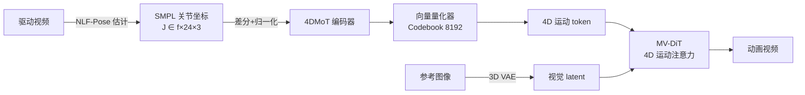

# MTVCraft: Tokenizing 4D Motion for Arbitrary Character Animation

**会议**: ICLR 2026  
**OpenReview**: [https://openreview.net/forum?id=m7AQM9H6wa](https://openreview.net/forum?id=m7AQM9H6wa)  
**代码**: [https://github.com/DINGYANB/MTVCrafter](https://github.com/DINGYANB/MTVCrafter)  
**领域**: 角色动画 / 姿态引导视频生成  
**关键词**: 4D 运动 token、SMPL、VQVAE、Diffusion Transformer、运动注意力、零样本泛化  

## 一句话总结
MTVCraft 把驱动视频里的 3D 关节坐标序列（4D 运动）直接量化成离散 token，配合带 4D 位置编码的运动注意力 DiT，绕开了传统 2D 渲染姿态图的像素对齐束缚，实现可任意角色（含非人物体）的高质量姿态引导动画。

## 研究背景与动机
**领域现状**：角色图像动画（给一张参考图，按驱动视频的姿态序列合成视频）随数字人需求爆发而快速发展，从早期 GAN 走向扩散模型，AnimateAnyone、MimicMotion、StableAnimator、UniAnimate-DiT 等方法层出不穷。

**现有痛点**：几乎所有方法都依赖**2D 渲染的姿态图**（骨架图、SMPL mesh 渲染、深度图）来提供运动引导。这带来两个根本缺陷——其一，2D 姿态图丢弃了真实 4D 世界里丰富的时空运动信息，难以合成物理合理、富表现力的复杂动作（如体操）；其二，姿态以图像形式给出时，模型倾向于**逐像素照抄固定形状的姿态**而不理解运动语义，一旦驱动视频姿态与参考角色在形状/位置上偏差较大（如绿巨人 Hulk），就会出现扭曲和伪影。

**核心矛盾**：2D 渲染姿态图既是引导信号的来源，又是信息损失和像素对齐僵化的根源——越想精确控制就越绑死在像素对齐上，越通用就越丢失 3D 几何。

**本文目标**：跳过 2D 渲染这一中间环节，直接对原始 4D 运动（随时间变化的 3D 关节坐标）建模，做到既保留时空几何又解耦形状与绝对位置。

**核心 idea**：**[运动 token 化]** 把 SMPL 关节坐标序列用 VQVAE 量化成紧凑离散的 4D 运动 token；**[运动感知 DiT]** 让这些 token 通过带 4D RoPE 的运动注意力作为视觉 token 的上下文，从而把"渲染姿态图 + 像素对齐"换成"token 检索 + 语义引导"。

## 方法详解

### 整体框架
MTVCraft 分两阶段：先用 **4DMoT（4D 运动 tokenizer）** 把驱动视频抽取的 SMPL 关节坐标序列量化为离散运动 token，再用 **MV-DiT（运动感知视频 DiT）** 以这些 token 为条件、参考图为身份锚点生成动画视频。整套设计可无缝挂到不同规模的视频扩散骨干上（CogVideoX-5B → 6B 版，Wan-2.1-14B → 18B 版）。

### 关键设计

**1. 4DMoT：差分坐标的 VQVAE 量化，把运动从形状与位置中解耦。** 作者刻意选择量化**关节坐标**而非 SMPL 旋转参数——坐标与像素级生成天然对齐、能自然写成差分形式，且避免了轴角表示的不连续与歧义。具体做法是：先用标准中性 SMPL 形状（而非逐帧预测的体型）做前向运动学算出 3D 关节坐标 $J_t \in \mathbb{R}^{24\times3}$，从源头剥离个体体型；再减去首帧得到差分表示 $M$（首帧坐标全零），让模型学相对运动模式而非绝对位置。编码器在帧轴 $f$ 与关节轴 $j$ 构成的 2D 平面上用残差块+平均池化下采样得到连续 latent，向量量化器在可学习码本 $\{C_n\}_{n=1}^{s}$ 里做最近邻查找，并配 EMA 更新与码本重置维持利用率。训练目标是重建损失加 commitment 损失：

$$L_{vq} = \|M - \hat{M}\|_1 + \beta \|E - \mathrm{sg}[C]\|_2^2$$

其中 $\mathrm{sg}[\cdot]$ 是 stop-gradient，$E$、$C$ 分别为量化前后的 latent。这样得到的 token 既紧凑又去噪，把"形状/位置无关的纯运动动态"压进离散空间。

**2. 4D 位置编码：把 3D RoPE 扩成 4D，让运动与视觉 token 共享几何语义。** 标准视频 DiT 的视觉 token 用 3D RoPE $P_{3D}=\mathrm{Concat}(R_t, R_h, R_w)$，但运动 token 本质活在"随时间演化的结构化 3D 空间"里，二者几何语义不对齐就没法有意义地交互。作者把它统一扩展为：

$$P_{4D} = \mathrm{Concat}(R_t, R_x, R_y, R_z)$$

对运动 token，坐标取 $(t, x, y, z)$，其中 $t$ 是帧索引，$(x,y,z)$ 用**数据集上对所有帧平均**的 24 个关节位置——用平均位置而非逐帧位置给出一个稳定统一的参考系，加速收敛；对缺少深度轴的视觉 token，用 $(t, h, w)$ 并令深度方向 $z=0$，既保留原 3D RoPE 行为又与运动 token 兼容。消融显示这一设计的位置编码是性能命门（去掉 PE 后 FVD 从 317 暴涨到 548）。

**3. 4D 运动注意力 + repeat-concat 身份保持：视觉做 query、运动做 key/value。** 在每隔两个 DiT block 插入一个运动注意力模块，让视觉 token 主动"检索"运动线索：

$$Q = \mathrm{RoPE}(\mathrm{LN}(W_q z_{vision}), P_{4D}^{vision}),\quad K = \mathrm{RoPE}(\mathrm{LN}(W_k z_{motion}), P_{4D}^{motion}),\quad V = \mathrm{LN}(W_v z_{motion})$$

$$\mathrm{Attention}(Q,K,V) = \mathrm{Softmax}\!\left(\frac{QK^\top}{\sqrt{d_k}}\right)V$$

注意力输出以残差加回 $z_{vision}$，在保持视频时空一致性的同时做运动调制。身份保持上摒弃了额外的 reference network，改用极简的 repeat-and-concatenate：把参考图 latent 沿时间复制 $f$ 份与噪声视频 latent 拼接，$z_{vision}=\mathrm{Concat}(z_0, \mathrm{Repeat}(z_{ref}, f))$，靠 DiT 自带的 3D 全自注意力就能逐帧注入身份信息。

**4. 运动感知 CFG 与可扩展性：用可学习的无条件运动 token 把控制强度做大。** 运动 token 没有天然的"无条件"形式，作者引入可学习的无条件运动 token $c_{mo\varnothing}$，训练时按概率随机替换条件 token（只在被用到时才更新），从而联合学习有/无条件生成，推理时对运动用 3.0、文本用 6.0 的 guidance scale。扩到 18B 时直接复用 4DMoT 与无条件 token 不重训，仅对维度 3072 的运动 token 做 zero-padding 对齐到 Wan-2.1 的 5120 维，并额外加一条文本控制分支，大幅降低扩展成本。

## 实验关键数据

### 主实验（TikTok benchmark）

| Model | PSNR↑ | SSIM↑ | LPIPS↓ | FID↓ | FVD↓ | FID-VID↓ |
|---|---|---|---|---|---|---|
| MimicMotion | 19.30 | 0.751 | 0.220 | 34.88 | 472.51 | 9.30 |
| RealisDance-DiT | 17.55 | 0.717 | 0.261 | 30.39 | 458.81 | - |
| UniAnimate-DiT | 19.35 | 0.765 | 0.235 | 28.47 | 402.14 | 9.12 |
| **MTVCraft-6B** | 19.35 | 0.760 | 0.219 | 23.58 | 317.21 | 8.56 |
| **MTVCraft-18B** | **19.84** | **0.779** | **0.217** | **20.70** | **276.65** | **7.31** |

6B 版在 FID/FVD 上已全面超过此前最强的 UniAnimate-DiT（FVD 317 vs 402），18B 版进一步把 FVD 压到 276，全指标 SOTA。

### 消融实验（TikTok，FID↓ / FVD↓）

| 组件 | 变体 | FID↓ | FVD↓ |
|---|---|---|---|
| 4D 运动 tokenizer | w/o quantize | 24.04 | 332.97 |
| | w/o differential motion | 24.37 | 325.40 |
| | w/ 3D quantization (无 z) | 23.94 | 329.86 |
| 4D 运动注意力 | w/ dynamic PE | 28.24 | 383.22 |
| | w/ learnable PE | 28.69 | 397.64 |
| | w/ 1D temporal RoPE | 29.45 | 458.29 |
| | w/o PE | 32.56 | 548.31 |
| **Default** | — | **23.58** | **317.21** |

### 关键发现
- **量化与差分都不可省**：去掉量化退化成普通 autoencoder、去掉差分表示都会明显掉点，证明离散 token + 相对位移是稳定运动学习的关键。
- **z 轴有用**：从 3D 量化加到 4D（含深度）带来一致改善，说明深度几何信息对动画质量有贡献。
- **位置编码是命门**：完全去掉 PE 后 FVD 从 317 飙到 548，任何降维的 RoPE（1D/2D/3D）都不如完整 4D。
- **强零样本泛化**：仅在人体数据上训练，却能驱动动物乃至无生命物体；当目标姿态与参考图严重错位（如猫头鹰）时仍稳健，而对比方法失败——印证了运动从驱动视频解耦的有效性。

## 亮点与洞察
- **范式转换**：第一个把"2D 渲染姿态图引导"换成"原始 4D 运动 token 引导"的角色动画框架，从根上解决了像素对齐僵化与 3D 信息损失两大顽疾。
- **坐标 vs 参数的取舍很有洞见**：量化关节坐标而非 SMPL 旋转参数，既对齐像素生成又规避轴角不连续，差分形式还顺手解耦了位置——一个选择同时解决多个问题。
- **统一几何语义**：用 4D RoPE 把运动 token 与视觉 token 拉进同一坐标系，是让跨模态注意力"讲同一种几何语言"的关键，消融数据强力支撑。
- **工程友好**：repeat-concat 身份保持省掉 reference network，4DMoT 跨骨干复用免重训，已商业部署，落地性强。

## 局限与展望
- **依赖 SMPL 估计质量**：运动来自 NLF-Pose 估计的 SMPL，遇到遮挡、极端视角或非标准人体拓扑时上游误差会传导到动画。
- **以人体骨架为中心**：虽展示了非人物体的零样本能力，但运动表示仍绑定 24 关节人体 SMPL，对四足、多肢或柔体对象缺乏原生骨架，泛化更多靠"借用人体运动语义"。
- **训练数据偏 human-centric**：30K 高质量 SMPL-视频对仍以人为主，更广义的物体/场景交互运动有待扩充。
- **位置编码用数据集平均关节位**：稳定但偏静态，未来或可探索在稳定性与个体姿态自适应之间更优的折中。

## 相关工作与启发
- **运动生成的 token 化**：借鉴 T2M-GPT、MotionGPT 等把 SMPL 参数量化用于运动生成的思路，但本文转向坐标量化并服务视频生成，是 token 化思想的跨任务迁移。
- **姿态引导动画**：相较 AnimateAnyone、MimicMotion、StableAnimator、UniAnimate-DiT 等依赖 2D 姿态图的路线，本文给出"不渲染、直接 token"的新方向。
- **可控扩散**：与 ControlNet/ControlNeXt 的结构控制一脉相承，但把控制信号从 2D 图像换成 4D 离散 token，启发后续把更多 3D/4D 物理信号 token 化注入生成模型。

## 评分
- **新颖性**: ⭐⭐⭐⭐⭐ 首个直接 token 化 4D 运动做角色动画的框架，范式层面的创新，坐标量化、4D RoPE、运动注意力组合自洽且有洞见。
- **实验充分度**: ⭐⭐⭐⭐ 两 benchmark SOTA、消融覆盖量化/差分/各种 PE，零样本案例丰富；稍欠更大规模定量泛化评测与失败案例分析。
- **写作质量**: ⭐⭐⭐⭐ 动机图（2D vs 4D）与架构图清晰，逻辑层层递进，公式与设计动机交代到位。
- **价值**: ⭐⭐⭐⭐⭐ 解决真实痛点、已商业部署、为姿态引导生成开辟新方向，可扩展性强，复用价值高。

<!-- RELATED:START -->

## 相关论文

- [\[ICLR 2026\] MotionWeaver: Holistic 4D-Anchored Framework for Multi-Humanoid Image Animation](motionweaver_holistic_4d-anchored_framework_for_multi-humanoid_image_animation.md)
- [\[CVPR 2026\] LottieGPT: Tokenizing Vector Animation for Autoregressive Generation](../../CVPR2026/video_generation/lottiegpt_vector_animation_generation.md)
- [\[ICLR 2026\] Arbitrary Generative Video Interpolation](arbitrary_generative_video_interpolation.md)
- [\[CVPR 2026\] One-to-All Animation: Alignment-Free Character Animation and Image Pose Transfer](../../CVPR2026/video_generation/one-to-all_animation_alignment-free_character_animation_and_image_pose_transfer.md)
- [\[ICLR 2026\] FastVMT: Eliminating Redundancy in Video Motion Transfer](fastvmt_eliminating_redundancy_in_video_motion_transfer.md)

<!-- RELATED:END -->
