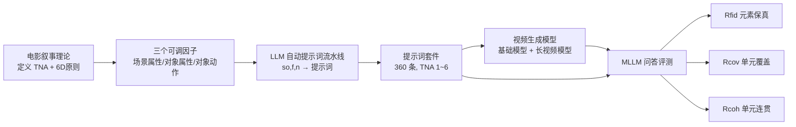

# NarrLV: Towards a Comprehensive Narrative-Centric Evaluation for Long Video Generation

**会议**: ICLR 2026  
**OpenReview**: [https://openreview.net/forum?id=Qh3CQBTB1g](https://openreview.net/forum?id=Qh3CQBTB1g)  
**项目主页**: [https://amap-ml.github.io/NarrLV-Website/](https://amap-ml.github.io/NarrLV-Website/)  
**领域**: 视频生成 / 评测基准  
**关键词**: 长视频生成, 叙事评测, Benchmark, 时序叙事原子(TNA), MLLM 问答评估  

## 一句话总结
NarrLV 提出"时序叙事原子(TNA)"作为量化叙事丰富度的基本单位，配合可任意扩展 TNA 数量的提示词套件和基于 MLLM 问答的三级渐进式评测指标，首次系统地衡量长视频生成模型"讲故事"的能力，并发现现有模型最多只能稳定表达约 2 个叙事单元。

## 研究背景与动机

**领域现状**：基础视频生成模型（Wan、HunyuanVideo、CogVideoX 等）受算力限制只能产出短视频，于是涌现出一批长视频生成模型（FreeNoise、Presto、RIFLEx、FreeLong 等），它们通过改造去噪模块、注入分段文本来延长时长并表达随时间演化的叙事。学界逐渐意识到：长视频生成的目标不只是"更长"，更在于在更长的画面里**准确表达更丰富的叙事内容**。

**现有痛点**：评测严重滞后。早期靠 FID/FVD/CLIP-SIM 等通用指标，与人类判断脱节；后来的 VBench、TC-Bench、StoryEval 等基准虽然维度丰富，但它们的提示词叙事都很简单——TNA 数量集中在很窄的低值区间（VBench 多为 1，TC-Bench 聚焦 2，StoryEval 也只覆盖 2–4 个事件）。结果是长视频模型只能"将就"在为短视频设计的 VBench 上评测，无法暴露其真正的叙事表达边界。

**核心矛盾**：长视频生成追求的是"叙事丰富度"这一抽象能力，而现有基准既缺乏量化叙事丰富度的统一单位，也缺乏能随叙事复杂度灵活扩展的提示词与评测协议。

**本文目标**：构建首个面向长视频生成、专门评估**叙事表达能力**的基准 NarrLV，做到提示词可按叙事丰富度任意扩展、评测指标与人类偏好高度对齐，并据此刻画当前模型的能力边界。

**核心 idea**：**【量化叙事的最小单位】** 借鉴电影叙事学中"Beat"的概念，把"维持连续视觉呈现的最小叙事单元"定义为时序叙事原子 TNA，用 TNA 数量直接度量叙事丰富度；**【从理论锚定可调因子】** 基于电影叙事 6D 原则锁定影响 TNA 数量的三个可调因子（场景属性、对象属性、对象动作）；**【渐进式 MLLM 问答评测】** 把叙事表达拆成"元素保真→单元覆盖→单元连贯"三个递进层次，用 MLLM 问答框架计算。

## 方法详解

### 整体框架

NarrLV 由三部分串联：先从电影叙事理论出发定义 TNA 并锁定三个可调因子；再据此搭建一条 LLM 驱动的自动提示词生成流水线，产出 TNA 数量可灵活扩展的提示词套件；最后用 MLLM 问答框架，沿"元素保真度 / 单元覆盖率 / 单元连贯性"三个渐进维度对生成视频打分，并验证其与人类偏好的对齐。

### 关键设计

**1. 时序叙事原子 TNA 与三个可调因子：把"叙事丰富度"落成可数的量。** 叙事丰富度本是抽象概念，论文借电影叙事学的 Beat 把"连续视觉呈现下的最小叙事单元"定义为 TNA，TNA 越多叙事越丰富（如"老师上台→板书→讲解→擦写→下台"含 5 个 TNA）。进一步追问"什么决定 TNA 数量"，作者引用电影叙事 6D 原则（总帧数、时间连续性、空间连续性、场景、动作、对象）：在视频生成设定下，总帧数由模型固有时长决定，时空连续性又被训练数据强制保证（剔除镜头切换等不连续样本），因此真正可调的只剩场景、对象、动作三项，形式化为因子集 $F = [s_{att}, t_{att}, t_{act}]$（场景属性、对象属性、对象动作）。这一步把模糊的"会不会讲故事"转化为"能表达多少个 TNA"，为后续提示词扩展和指标设计提供了统一标尺。

**2. 可扩展的 TNA 驱动提示词套件：自动批量造出叙事可控的测试集。** 为避免人工设计的高成本，作者用 LLM 搭建自动流水线。先从用户向数据集 VideoUFO-1M 与富叙事数据集 DropletVideo-1M 各随机采样 10 万条文本，用 Qwen2.5-32B 抽取每条的场景 $s$ 与主要对象列表 $o$，同场景下合并对象列表得到场景-对象对集合 $SO$。生成时取一个实例 $so$、随机采 1–2 个对象，指定 TNA 数量 $n$ 与变化因子 $f$，由 GPT-4o 补全属性/动作的演化过程产出提示词：
$$(so, f, n) \xrightarrow{\text{LLM}} p_{f,n}, \quad so \in SO,\ f \in F,\ n \in [1, N_{tna}]$$
后处理阶段把 $SO$ 归为 14 个大类，每个因子-数量组合从各大类选 1–3 个 $so$，最终每组取 20 条；设 $N_{tna}=6$、3 个因子，共得 $20\times 6\times 3 = 360$ 条评测提示词。整条流水线天然可扩展——未来要评更长视频，只需把 $N_{tna}$ 调大重跑即可。

**3. 渐进式三级评测指标 + 五次投票去噪：让 MLLM 问答可靠地量化叙事。** 评测沿"基本元素→它们构成的叙事单元"递进展开，对每条提示词 $p_{f,n}$，模型生成视频 $v$，LLM 据语义生成维度专属问题集 $Q$，MLLM 回答得 $A$ 再映射为结果 $R$：$(p_{f,n})\xrightarrow{m}v,\ (p_{f,n})\xrightarrow{\text{LLM}}Q,\ (Q,v)\xrightarrow{\text{MLLM}}A\to R$。三个维度为：**叙事元素保真度** $R_{fid}$，对场景类别/属性、对象类别/属性/动作/初始布局等元素逐个生成二元判断题；**叙事单元覆盖率** $R_{cov}$，对每个 TNA 问"是否出现"，问题数随 $n$ 增长；**叙事单元连贯性** $R_{coh}$，对相邻 TNA 对问"是否存在过渡"。针对 MLLM 对不确定问题答案不稳定的现象，对同一 $(Q,v)$ 让 MLLM 连答五次取占比作为单题分：
$$r^k_{fid} = \frac{1}{5}\sum_{t=1}^{5}\delta(a^{k,t}_{fid}, a^k_{pos}), \quad R_{fid} = \frac{1}{N_{fid}}\sum_{k=1}^{N_{fid}} r^k_{fid}$$
连贯性还引入 TNA 存在比例 $\rho_{tna}$ 做前提约束（先存在才谈过渡）：
$$\rho_{tna} = \frac{1}{N_{cov}}\sum_{k=1}^{N_{cov}}\Theta(r^k_{cov}-\tau_{cov}), \quad R_{coh} = \frac{1}{2}(R'_{coh}+\rho_{tna})$$
其中 $\tau_{cov}=0.3$。这一渐进式问答设计相比"一次性整体打分"更能定位模型在叙事各层级上的具体短板。

## 实验关键数据

### 主实验表格

在三种变化因子下，各模型三维指标得分（节选 Table 1，数值越大越好）：

| 模型 | Rfid(satt/tatt/tact) | Rcov(satt/tatt/tact) | Rcoh(satt/tatt/tact) |
|------|------|------|------|
| Wan（基础） | 74.9/77.8/82.5 | 68.8/72.7/70.3 | 50.1/52.4/54.5 |
| HunyuanVideo | 74.4/77.2/76.9 | 64.3/64.6/57.9 | 44.7/44.2/40.8 |
| CogVideoX | 67.3/69.9/69.1 | 62.9/60.2/58.6 | 44.5/38.9/43.1 |
| RIFLEx（长视频） | 59.6/62.4/67.8 | 56.1/59.4/52.7 | 39.2/39.9/39.2 |
| FreeNoise | 77.6/71.5/74.5 | 58.5/63.0/51.2 | 40.7/43.1/34.4 |
| TALC | 38.0/37.1/40.4 | 31.0/33.0/31.6 | 21.9/23.4/21.7 |
| Mean | 67.9/67.6/71.4 | 57.4/60.3/53.7 | 39.6/40.7/37.9 |

与人类判断对齐准确率（Table 2，Consist-n/3 为三名标注者中 n 人一致的子集）：

| 指标 | Consist-2/3 (Rfid/Rcov/Rcoh) | Consist-3/3 (Rfid/Rcov/Rcoh) |
|------|------|------|
| VBench-2.0 | 0.33/0.32/0.28 | 0.31/0.27/0.29 |
| StoryEval | 0.41/0.51/0.51 | 0.55/0.55/0.56 |
| **Ours** | **0.63/0.67/0.67** | **0.81/0.80/0.79** |

### 消融实验表格

MLLM 重复回答次数与容量对对齐准确率的影响（Table 3）：

| # | 变体 | Consist-2/3 (Rfid/Rcov/Rcoh) | Consist-3/3 (Rfid/Rcov/Rcoh) |
|---|------|------|------|
| 1 | baseline（5 次） | 0.63/0.67/0.67 | 0.81/0.80/0.79 |
| 2 | 1 次回答 | 0.61/0.63/0.64 | 0.81/0.77/0.78 |
| 3 | 3 次回答 | 0.62/0.66/0.67 | 0.81/0.78/0.80 |
| 4 | 换 32B MLLM | 0.65/0.63/0.64 | 0.78/0.72/0.75 |

回答次数从 1→3→5 准确率递增并趋于收敛，故选 5 次；把 72B MLLM 换成 32B 会明显拉低覆盖/连贯准确率。

### 关键发现
- **叙事越丰富，单元表达越差，但基本元素几乎不受影响**：随 TNA 增多，$R_{cov}$、$R_{coh}$ 显著下降，而 $R_{fid}$ 仅小幅波动——模型能抓住关键元素，但难以把它们组织成随时间演化的叙事。
- **现有模型只能稳定表达极少叙事单元**：定义 $N_{exp}=R_{cov}\times n$ 表示可有效表达的 TNA 数，随 TNA 增加 $N_{exp}$ 增长极缓、与上界差距越拉越大；实践上建议提示词 TNA 数不超过 2。
- **基础模型决定长视频模型的叙事天花板**：FIFO-Diffusion/FreeLong/FreePCA/FreeNoise 同源于 VideoCraft，它们在 $R_{cov}$、$R_{coh}$ 上都优于 VideoCraft（证明长视频模块有效），但彼此差异很小，说明叙事能力主要由底座决定；且这些长视频模型整体弱于最新基础模型。
- **动作因子最难做"变化"**：模型在初始对象动作 $t_{act}$ 上的元素保真最好，但在叙事单元（覆盖/连贯）上恰恰在 $t_{act}$ 最差——擅长生成单个动作，却难做多样的动作演变。

## 亮点与洞察
- **用电影叙事学给"会不会讲故事"做了可计算的定义**：TNA + 6D 原则把抽象叙事丰富度收敛为三个可调因子和一个可数单位，理论锚点扎实，也让提示词扩展和指标设计有了统一语言。
- **渐进式三级指标定位精准**：把保真/覆盖/连贯分层评估，能清晰区分"元素生成"与"叙事组织"两类能力，正是这种分解让作者发现"元素稳、单元崩"的核心规律。
- **工程上对 MLLM 不确定性的务实处理**：五次投票取占比 + TNA 存在比例约束连贯性，简单有效地提升了与人类的对齐度（Consist-3/3 达 0.79–0.81，远超 VBench-2.0 与 StoryEval）。
- **可扩展性强**：提示词流水线只需调大 $N_{tna}$ 即可评测更长视频，基准不会随模型进步迅速过时。

## 局限与展望
- **TNA 上限暂设为 6**：虽称可扩展，但论文未在更高 TNA（如 10+）上验证模型表现与指标稳定性，超长叙事的评测仍待补足。
- **重度依赖闭源/大模型**：提示词生成用 GPT-4o、评测用 Qwen2.5-VL-72B，消融已显示换小模型会掉点，复现成本和评测一致性受 MLLM 能力波动影响。
- **聚焦文本到视频、连续时空设定**：显式排除了镜头切换等时空不连续样本，因此对真正含转场剪辑的"电影级"叙事尚未覆盖。
- **TNA 划分与因子假设带主观性**：把可调因子简化为场景/对象/动作三项是一种工程取舍，可能遗漏情绪、镜头语言等更高阶叙事维度。

## 相关工作与启发
- **长视频生成模型**（FreeNoise、Presto、Mask2DiT、RIFLEx、FreeLong）多在短视频底座上加分段文本交互或调整位置编码，本文正是为这类模型补上缺失的叙事评测。
- **视频生成评测基准**（VBench、DEVIL、TC-Bench、VMBench、StoryEval、VBench-2.0）各有侧重（质量、动态、时序组合、运动、事件级故事），但提示词 TNA 分布窄，NarrLV 填补了"富叙事 + 可扩展"的空白。
- **MLLM 问答式评估**（TIFA、Davidsonian 等思路）启发了本文用"生成问题→视频回答"的可扩展评测范式，对图像/视频生成的可解释评测有借鉴意义。

## 评分
- 新颖性: ⭐⭐⭐⭐ 首个面向长视频"叙事表达"的基准，TNA 量化单位与渐进式指标设计有理论支撑且原创性强。
- 实验充分度: ⭐⭐⭐⭐ 覆盖 6 个长视频 + 5 个基础模型、360 条提示词、600 对人工标注，主实验/消融/对齐分析齐全；超长 TNA 与更多模态因子的验证略欠。
- 写作质量: ⭐⭐⭐⭐ 从理论到流水线到指标逻辑清晰，图表（TNA 分布、三维结果、词云、特征距离）支撑充分。
- 价值: ⭐⭐⭐⭐ 为长视频生成提供了可量化、可扩展、对齐人类的叙事评测工具，并给出"TNA≤2"等可操作结论，对模型研发和评测都有实用价值。

<!-- RELATED:START -->

## 相关论文

- [\[ICLR 2026\] VideoPhy-2: A Challenging Action-Centric Physical Commonsense Evaluation in Video Generation](videophy-2_a_challenging_action-centric_physical_commonsense_evaluation_in_video.md)
- [\[ICML 2026\] V2V-Bench: A Comprehensive Benchmark for Video-to-Video Generation Evaluation](../../ICML2026/video_generation/v2v-bench_a_comprehensive_benchmark_for_video-to-video_generation_evaluation.md)
- [\[ICLR 2026\] Mixture of Contexts for Long Video Generation](mixture_of_contexts_for_long_video_generation.md)
- [\[ICLR 2026\] DrivingGen: A Comprehensive Benchmark for Generative Video World Models in Autonomous Driving](drivinggen_a_comprehensive_benchmark_for_generative_video_world_models_in_autono.md)
- [\[ICLR 2026\] LongLive: Real-time Interactive Long Video Generation](longlive_real-time_interactive_long_video_generation.md)

<!-- RELATED:END -->
