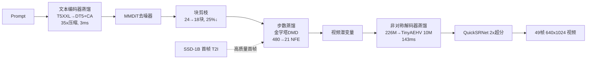

# Neodragon: Mobile Video Generation Using Diffusion Transformer

**会议**: ICLR 2026  
**OpenReview**: [https://openreview.net/forum?id=XBzIhhwv8d](https://openreview.net/forum?id=XBzIhhwv8d)  
**项目主页**: [https://qualcomm-ai-research.github.io/neodragon](https://qualcomm-ai-research.github.io/neodragon)  
**代码**: 待确认  
**领域**: 视频生成 / 端侧高效推理  
**关键词**: 视频扩散模型, Diffusion Transformer, 端侧部署, 蒸馏, 块剪枝, 步数蒸馏, DMD  

## 一句话总结
Neodragon 把一个视频 DiT（基于 Pyramidal-Flow）通过文本编码器蒸馏、非对称解码器蒸馏、MMDiT 块剪枝、以及扩展到金字塔流匹配的 DMD 步数蒸馏四套手术，端到端塞进手机/笔记本的 Qualcomm Hexagon NPU，在 ~6.7 秒内生成 49 帧 640×1024 视频，VBench 总分 81.61，刷新端侧视频生成 SOTA。

## 研究背景与动机
- **领域现状**：扩散类视频生成模型（VDM）已取代 GAN 成为主流，且架构从时空 UNet 转向 DiT，因为 DiT 在可扩展性、时间一致性与画质上更强。但前沿开源 VDM 计算量巨大，只能依赖云端推理。
- **现有痛点**：云端推理带来延迟、隐私与成本三重负担，对低带宽/资源受限地区的创作者尤其不友好。把视频生成搬到端侧能真正"民主化"这项能力，但手机的算力、内存、带宽、散热/功耗预算都极其紧张。
- **核心矛盾**：视频 DiT 的内存和算力开销与移动 NPU 的预算之间存在数量级鸿沟——例如 T5 XXL 文本编码器 4.726B 参数直接超出手机内存预算；原生 VAE 解码器虽参数不大（226M）但前向需缓存巨大的 4D 特征图，连一次前向都跑不下；初次端到端跑通时延迟高达 ~184 秒。
- **本文目标**：在不显著牺牲画质的前提下，系统性地把模型与运行时复杂度压到移动 NPU 可承受的范围，实现真正可用的端侧文生视频。
- **核心 idea**：**[把端侧化拆成四个独立的"瓶颈手术"，每一个都转化为蒸馏/剪枝问题分别求解]**——不重新设计模型，而是对 Pyramidal-Flow 基线逐个击破文本编码器、解码器、去噪主干尺寸、去噪步数四大延迟来源。

## 方法详解

### 整体框架
Neodragon 以 Pyramidal-Flow（一个金字塔式、因果的视频 DiT，去噪器为 24 块 MMDiT，从 SD3.5 初始化）为基线，按延迟瓶颈出现的顺序依次施加四套压缩手术，每套都保持生成潜空间不被破坏，最后整合成一条端到端流水线。

### 关键设计

**1. 文本编码器蒸馏：用提示词把 T5 XXL 压成 DT5+ContextAdapter。** 作者先质疑"高质量文生视频真的需要 T5 XXL 的全部容量吗"，因为短描述性提示对编码器的语义需求很浅。他们没有去对齐 T5 XXL 的原始嵌入（实验发现这样训练不稳定），而是把 MMDiT 去噪器里的 ContextEmbedder（CE，一层线性）作为冻结的 ground-truth 参照，引入一个可学的 4 层带跳连 MLP——ContextAdapter（CA），让小模型 DT5 经 CA 后产出的多模态 token 去对齐 CE(T5XXL(prompt)) 产出的 token。损失结合 MSE 与余弦距离：$L_{distil}(t,\hat t)=w_{mse}\lVert t-\hat t\rVert_2^2+w_{cd}(1-\frac{t\cdot\hat t}{|t||\hat t|})$，其中 $t=\mathrm{CE}(\mathrm{T5XXL}(\text{prompt}))$、$\hat t=\mathrm{CA}(\mathrm{DT5}(\text{prompt}))$，取 $w_{mse}=1.0,w_{cd}=0.1$。框架支持 [RM] 替换、[EM] 扩展、[TDT5] 可训 DT5、[LORA] 四种模式，全程只用 ~1.4M 纯文本提示训练，**不需要任何图像或视频数据**。最终采用 [RM]：把 4.762B 的 T5 XXL 压成 0.130B 的 DT5（35× 压缩），VBench 总分仅从 80.31 掉到 79.64，而端侧延迟仅 3ms。

**2. 非对称解码器蒸馏：冻结原编码器、换掉解码器并对齐压缩率。** 解码器虽轻但 4D 特征图缓存撑爆 NPU，作者同样把它当蒸馏问题，并假设"不同 VDM 学到的压缩视频潜空间是通用、可低成本迁移的"。框架分三步：先引入非对称性——保留原编码器产出潜变量 $z=E_{enc}(x)$，但把原解码器换成另一模型的解码器 $F_{dec}$，重建 $\hat x=F_{dec}(z)$；再最小化地增删块，把新解码器的压缩率对齐到固定编码器的 [8×8×8]；最后用 MSE+LPIPS 重建损失 $L(x,\hat x)$ 端到端微调，编码器全程冻结以保住 MMDiT 所需的潜空间（也因此省掉 KL 正则）。在 DAVIS 上各解码器变体 PSNR 普遍 >29dB，验证了潜空间通用性。部署选了最省参、最易移植的 TinyAEHV（10M，226M→10M，20× 压缩），把原本跑不动的解码做到 143ms。

**3. MMDiT 块剪枝：按多模态重要性打分，两阶段课程式微调恢复性能。** 跑通后发现 184s 里有 184s 几乎都耗在 MMDiT 去噪，于是从两方向砍——先砍模型尺寸。借鉴 SANA-1.5 但适配 MMDiT 的多模态特性：对第 $k$ 块分别计算视觉与文本 token 的重要性，定义为块输入输出 token 的余弦距离 $BI_k^v=1-\mathbb E[\frac{z_k\cdot z_{k+1}}{\lVert z_k\rVert\lVert z_{k+1}\rVert}]$、$BI_k^t$ 同理，用 100 条校准提示×5 个样本探测每个去噪步两次 CFG 的内部表示。由于视觉与文本重要性并不相关，还辅以"逐块移除看画质"的视觉判断选块。剪枝后做两阶段微调：**Stage-1** 用 ~350K 数据按原始流匹配目标微调（仅 ~300 步即收敛，再训也不涨）；**Stage-2** 引入 Full Teacher 特征匹配（视觉 token MSE + 文本 token 余弦距离 + 教师与真值双重流匹配监督，60k 步）。关键发现是 Stage-2 必须接在 Stage-1 后做课程式训练，直接做或退火加权都不行。最终 18 块（剪掉 25%）VBench 80.21，仅比 24 块的 80.31 低 0.1，单步去噪从 1.15s 降到 0.74s。

**4. 金字塔 DMD 步数蒸馏：把分布匹配蒸馏扩展到金字塔流匹配，480→21 NFE。** 砍完尺寸再砍步数。Pyramidal-Flow 把概率流分解为 $S$ 个阶段，第 $i$ 阶段在 $2^i$ 倍降采样分辨率上操作，起止噪声级 $(\sigma^i_{start},\sigma^i_{end})$，总目标 $L_{pyr\text{-}FM}=\sum_{i=0}^{S-1}L^i_{FM}$。作者把 DMD 扩展到这个金字塔流匹配目标：学生模型 $D_\theta$ 用单步 Euler 解 $\tilde z_\theta=\tilde z_\sigma-\frac{\sigma}{\sigma^i_{start}-\sigma^i_{end}}D_\theta(\tilde z_\sigma,\sigma)$ 预测干净潜变量；"假分数模型" $D_\phi$ 在学生预测的潜变量分布上训练；学生按 DMD 梯度 $\nabla_\theta L^i_{DMD}\propto(D(\tilde z_\tau,\tau)-D_\phi(\tilde z_\tau,\tau))\cdot\nabla_\theta\tilde z_\theta$ 更新，并加权使教师能更准估计的样本权重更高，外加 Cauchy 损失 $L_{teacher}=\log(1+\lVert\tilde z_\theta-\mathrm{Down}(z,2^i)\rVert_2^2)$ 提升画质。学生/假模型按 1:2 交替更新。在 4-4-4 配置下，金字塔 DMD 拿到最高 VBench 80.37，把 480 NFE 降到 84（最终 1-1-1 配置 21 NFE），去噪延迟降到 20.72s。

## 实验关键数据

### 主实验表格（VBench，[49×320×512]，与 SOTA 对比，节选）

| 平台 | 模型 | Total↑ | Quality↑ | Semantic↑ |
|---|---|---|---|---|
| Server | Wan2.1 1.3B | 83.31 | 85.23 | 75.65 |
| Server | CogVideoX 5B | 81.91 | 83.05 | 77.33 |
| Server | Pyramidal-Flow | 81.72 | 84.74 | 69.62 |
| On-device | Pyramidal-Flow†（基线复现） | 80.31 | 83.68 | 66.81 |
| On-device | Snap Mobile Video DiT | 81.45 | 83.12 | 74.76 |
| On-device | Hummingbird 16f | 81.35 | 83.73 | 71.84 |
| On-device | SnapGenV | 81.14 | 83.47 | 71.84 |
| **On-device** | **(Ours) Neodragon E2E** | **81.61** | **83.68** | **73.36** |

> Neodragon 在端侧方案里 VBench 总分最高，甚至超过自身云端基线 Pyramidal-Flow†（80.31）。

### 消融实验表格（四套手术各自效果）

| 手术 | 配置 | 参数/NFE | 延迟 | VBench Total |
|---|---|---|---|---|
| 文本编码器 | T5 XXL 基线 | 4.732B | — | 80.31 |
| 文本编码器 | DT5+CA [RM] | 0.260B (35×↓) | 3ms | 79.64 |
| 解码器 | PF 原生 | 226M | 2.496s(GPU) | 80.31 |
| 解码器 | TinyAEHV (Ours) | 10M (20×↓) | 143ms(NPU) | 80.25 |
| 块剪枝 | 24 块原始 | 2.028B | 1.15s | 80.31 |
| 块剪枝 | 18 块 Stage-2 | 1.518B (25%↓) | 0.74s | 80.21 |
| 步数蒸馏 | PF 原生 4-4-4 | 480 NFE | 118.4s | 80.31 |
| 步数蒸馏 | 金字塔 DMD 4-4-4 | 84 NFE | 20.72s | 80.37 |

### 关键发现
- **逐步降延迟轨迹**：端到端延迟从初次跑通的 ~184.2s →（块剪枝）118.6s →（步数蒸馏）25.96s →（首帧 T2I 替换 + 超分）最终 **6.7s**。
- **首帧策略救语义**：金字塔 DMD 在 1-1-1 极限低步会引入首帧色彩饱和与语义不一致，但运动平滑。改用 SSD-1B 4 步生成高质量首帧（0.82s），再用 1-1-1 流水线补后续帧运动，VBench 从 80.37 提到 **81.61**。
- **峰值内存仅 ~3.5GB**，可在 Snapdragon X Elite（笔记本）与 Snapdragon 8 Elite Gen4（手机）两类 SoC 上运行，不影响 OS 关键进程。

## 亮点与洞察
- **"瓶颈驱动"的工程叙事**：方法不是一次性提出一个新架构，而是按真实跑通过程中冒出的瓶颈顺序逐个攻克，每一步都给出端侧延迟的真实数字，可复现性与说服力强。
- **统一的蒸馏视角**：文本编码器、解码器、去噪步数三处都被框成蒸馏问题，且文本编码器蒸馏完全不用图像/视频数据，仅靠 ~1.4M 纯文本，成本极低。
- **潜空间通用性的经验证据**：非对称解码器蒸馏间接证明了不同 VDM 学到的压缩视频潜空间可低成本互迁，这对组合复用社区模型很有启发。
- **课程式剪枝微调**：Stage-1→Stage-2 的顺序不可调换，揭示了剪枝诱导的优化地形需要先用真值数据"落地"再蒸馏教师特征。

## 局限与展望
- **首帧依赖外部 T2I**：最终高分依赖 SSD-1B 生成首帧，说明金字塔 DMD 在极限低步下的首帧质量仍是短板，未端到端解决。
- **VBench 未必反映真实质量**：作者自承色彩饱和等语义伪影"未被 VBench 充分捕捉"，端侧画质评测仍待更贴近人感的指标。
- **Stage-2 直接训不收敛的机理未明**：剪枝优化地形为何只能课程式恢复，留作未来工作。
- **四套手术虽正交但工程链长**：每套都需要单独训练数据与流程，整体复现门槛偏高；与其他端侧 VDM 工作（On-device Sora、SnapGen-V 等）的组合潜力尚未探索。

## 相关工作与启发
- **端侧 UNet 系**：AMD-Hummingbird（视觉反馈剪枝）、MobileVD（500× 效率）、SnapGen-V（时序层 NAS+对抗步蒸馏）、MoViE（移动视频编辑单步蒸馏）——多基于 UNet 压缩。
- **端侧 DiT 系（尚处早期）**：On-device Sora（免训练步数缩减+token 合并）、Wu et al.（极致压缩 VAE+KD 剪枝）。Neodragon 主张自己的技术与这些并发工作正交，可组合。
- **方法基石**：Pyramidal-Flow（金字塔因果流匹配基线）、DMD（分布匹配蒸馏）、SANA-1.5（块剪枝灵感）、DistilT5、TinyAEHV、SSD-1B、QuickSRNet。

## 评分
- **新颖性**: ⭐⭐⭐⭐ —— 单项技术多为已有方法的迁移/扩展（DMD→金字塔流、SANA→MMDiT 剪枝），但把视频 DiT 完整塞进移动 NPU 的系统级集成与"瓶颈驱动"组合是扎实且首创的端侧 SOTA。
- **实验充分度**: ⭐⭐⭐⭐ —— 四套手术各有独立消融、真实 NPU 延迟、与众多云端/端侧 SOTA 的 VBench 对比、双 SoC 实测，证据链完整；仅缺更细的人评。
- **写作质量**: ⭐⭐⭐⭐ —— 按延迟瓶颈顺序组织，叙事清晰、动机自然，公式与表格扎实。
- **价值**: ⭐⭐⭐⭐ —— 端侧视频生成具明确的隐私/可及性意义，6.7s 生成 49 帧 640×1024 + 仅 3.5GB 峰值内存对实际落地极有参考价值。

<!-- RELATED:START -->

## 相关论文

- [\[ICLR 2026\] Syncphony: 用扩散 Transformer 实现音画同步的音频到视频生成](syncphony_synchronized_audio-to-video_generation_with_diffusion_transformers.md)
- [\[ICLR 2026\] EchoMotion: Unified Human Video and Motion Generation via Dual-Modality Diffusion Transformer](echomotion_unified_human_video_and_motion_generation_via_dual-modality_diffusion.md)
- [\[ICLR 2026\] SANA-Video: Efficient Video Generation with Block Linear Diffusion Transformer](sana-video_efficient_video_generation_with_block_linear_diffusion_transformer.md)
- [\[ICLR 2026\] QuantSparse: Comprehensively Compressing Video Diffusion Transformer with Model Quantization and Attention Sparsification](quantsparse_comprehensively_compressing_video_diffusion_transformer_with_model_q.md)
- [\[CVPR 2025\] Tora: Trajectory-Oriented Diffusion Transformer for Video Generation](../../CVPR2025/video_generation/tora_trajectory-oriented_diffusion_transformer_for_video_generation.md)

<!-- RELATED:END -->
