# NeRV-Diffusion: Diffuse Implicit Neural Representation for Video Synthesis

**会议**: ICLR 2026  
**OpenReview**: [https://openreview.net/forum?id=tX0cSOvBnS](https://openreview.net/forum?id=tX0cSOvBnS)  
**项目主页**: [https://nerv-diffusion.github.io/](https://nerv-diffusion.github.io/)  
**代码**: 待确认  
**领域**: 视频生成 / 隐式神经表示 / 扩散模型  
**关键词**: NeRV, INR, 视频扩散, 权重生成, 隐式 tokenizer, DiT  

## 一句话总结
把一段视频压缩成一个"小型卷积网络的权重"（即 NeRV 这种隐式神经表示 INR），再让扩散 Transformer 直接在这组高斯分布的权重 token 上去噪生成新视频——从而绕开传统视频 tokenizer 的逐帧特征图与跨帧注意力，得到更紧凑、解码更快、且分辨率/时长开销次线性增长的视频生成框架。

## 研究背景与动机
**领域现状**：视频隐式扩散模型（LDM）效果惊艳，但它们的 tokenizer 大多直接沿用图像模型，把视频编码成一帧一帧独立的特征图，忽视了帧间天然的连贯性，表示冗余。为了约束时序一致性，模型不得不堆叠**跨帧注意力**，导致参数量膨胀、计算量爆炸。

**现有痛点**：传统 tokenizer 的下采样因子是固定的，分辨率翻倍时 latent 大小会**二次方增长**；1D tokenization 虽然能得到整体性 latent，但离散 token 又牺牲了时空粒度。另一边，INR（如 NeRV）在压缩、快速解码、平滑插值上优势明显，但既有的 hypernetwork-INR 编码器只为"重建"优化，产出的权重**不服从任何分布约束**，根本无法被扩散模型生成。

**核心矛盾**：要让"生成 INR 权重"这条路走通，必须同时满足两个相互拉扯的目标——权重既要**接近高斯分布**（方便扩散平滑去噪），又要保持**高表达力**（能忠实重建多样的真实视频）。此前没有任何视频扩散模型在权重空间上成功过，因为视频比图像携带更多动态信息，扩散对去噪空间的要求也更苛刻。

**本文目标**：构建一个把视频整体表示为一组 INR 权重 token 的隐式潜空间扩散框架，既享受 LDM 的生成力，又享受 INR 的紧凑、快速解码与可插值性。

**核心 idea**：**「视频即一个专属神经网络」**——第一阶段用 hypernetwork tokenizer 把视频编成服从 N(0,1) 的权重 token，这些 token 就是一个 NeRV 解码器的卷积核，输入帧索引即可解码出整段视频；第二阶段用一个 vanilla DiT 在这组无时空结构的权重 token 上做扩散，从噪声生成新权重，再由 NeRV 渲染成视频。

## 方法详解

### 整体框架
NeRV-Diffusion 是两阶段框架：**Tokenization 阶段**训练一个隐式自编码器（NeRV-VAE），把视频从像素压成权重 token，这些 token 实例化成一个 NeRV 解码器自解码重建；**Generation 阶段**训练一个隐式扩散 Transformer，在权重 token 空间里从噪声去噪生成。整套设计的核心在于让权重 token 同时"可重建"且"可扩散"。

```mermaid
flowchart LR
    A[RGB 视频] --> B[NeRV Encoder<br/>ViT hypernetwork]
    B --> C[权重 token latent<br/>KL 约束 ~ N&#40;0,1&#41;]
    C -->|Multi-head Affine| D[NeRV Decoder<br/>实例专属卷积核]
    E[帧索引 + 时空 PE] --> D
    D --> F[重建视频]
    C -.加噪/去噪.-> G[Implicit DiT]
    G -.采样.-> C
    G --> H[生成的权重 token] --> D2[NeRV Decoder] --> I[生成视频]
```

### 关键设计

**1. NeRV-VAE：把视频编成高斯权重 token 的非对称隐式自编码器** —— 编码器 $E$ 是一个基于 ViT/FastNeRV 的 hypernetwork，给定像素输入 $x$ 产出 INR 参数 $\theta=E(x)$；解码器则是一个实例专属的 INR $D_\theta(\cdot)$，输入坐标即输出像素。由于输出权重 token 与输入 patch 没有时空对应关系，作者不直接映射，而是引入专门的 **query token** 与视频 patch 拼接后送入编码器，只保留 query 对应的输出。关键在于在编码器输出后接两层 FC 形成信息瓶颈，并施加 **KL 散度损失**把 latent 分布对齐到标准高斯，使权重 token 既紧凑又可被扩散。整体训练目标融合重建、感知与对抗损失：$L_{\mathrm{VAE}}=\|x-\tilde{x}\|^2+L_{\mathrm{LPIPS}}+L_{\mathrm{GAN}}+D_{\mathrm{KL}}(N(0,1),\tilde\theta)$。这里对抗判别器特意选**卷积**而非 Transformer，因为后者会引入跨帧闪烁伪影。

**2. Multi-head Affine + Channel-wise 权重参数化：用紧凑 latent 撑起强表达力** —— FastNeRV 原本只用 latent 去"调制"少数 INR 层的参数，在加了 KL 约束后表达力被严重限制。本文把瓶颈后的 FC 扩展成**多头仿射映射**：同一组权重 token 被复用，每个 NeRV 层配一个专属仿射头，把全部 token 映射成该层的调制参数，从而独立填充所有层——既扩大表达力又让 latent 保持紧凑（紧凑 latent 直接降低后续扩散的复杂度）。更进一步，作者抛弃"调制共享基权重"的做法，**直接把仿射后的实例专属 token 设为某组 INR 通道的卷积核本身**，其余参数 $\theta_s$ 在所有数据间共享并可训练；所有核值沿除输出通道外的维度归一化（借鉴 StyleGAN 的 demodulation）。这让生成的权重以最大自由度直接参与解码，也支持解码器之间的平滑参数插值。消融显示该参数化把 gFVD 从 Repeat 的 741 降到 570，再叠加多头仿射复用降到 **283**。

**3. 生成式 NeRV 解码器：为生成质量重塑上采样结构** —— 原版时序-query 的 NeRV 从 $R^{T\times D\times1\times1}$ 上采样到 $R^{T\times3\times H\times W}$，运动清晰但空间内容糊。作者把时间嵌入扩展成 **3D 时空位置嵌入**（时间仍是唯一 query 轴），补充几何先验并省掉原 NeRV 用于变换 1D 时间嵌入的首层 FC，使全卷积结构与多头仿射调制最佳契合。借助权重复用，解码器能在**不增加权重 token**的前提下大幅 scale up：把上采样层扩成 block（每个 block 做一次 2× 上采样并附加不改变形状的卷积），周期性结构把信息从低分辨率均匀铺到高分辨率。上采样算子选**转置卷积**（比 pixelshuffle 质量更好且只用 1/4 参数与计算），并加 **residual 侧连接**融合多尺度特征（gFVD 248→219），侧连接的额外层仍由同一组 token 调制、零新增可训练参数。

**4. Implicit DiT + 两个稳训练技巧：在无结构权重空间上去噪** —— 权重 token 没有任何时空结构，因此 Transformer 比 U-Net 更合适，且**无需时序注意力**。扩散过程为 $\theta_t=\alpha_t\theta_0+\sigma_t\epsilon$，去噪网络 $\phi$ 优化 $L_{\mathrm{IDM}}=\mathbb{E}[\|\epsilon_0-\epsilon(\epsilon_t,t)\|^2]$。作者发现隐式扩散在**早期（高噪声）时间步收敛更慢**，于是引入 **Min-SNR-γ 损失加权** $w_t=\min\{\mathrm{SNR}(t),\gamma\}$（$\mathrm{SNR}(t)=\alpha_t^2/\sigma_t^2$），避免训练过度偏向低噪声层、让各时间步均匀下降。同时引入 **scheduled sampling** 缓解曝光偏差：训练中第一次前向后，以一定概率用模型自身预测 $\tilde\theta_{t-1}=\theta_\phi(\theta_t,t)$ 作为下一次前向输入再算总损失，对齐训练与推理模式、抑制采样时的误差累积。

## 实验关键数据

### 主实验：UCF / K600 生成质量（gFVD↓）

| 数据集/设置 | 方法 | gFVD↓ |
|---|---|---|
| UCF 16f@128² | LARP-L (SOTA 非隐式) | 102 |
| UCF 16f@128² | MAGVITv2-AR | 109 |
| UCF 16f@128² | DIGAN (隐式) | 465 |
| UCF 16f@128² | **NeRV-Diffusion-L (Ours)** | **97** |
| UCF 16f@256² | HPDM-M | 143 |
| UCF 16f@256² | **NeRV-Diffusion-L** | **140** |
| UCF 128f@128² | CoordTok | 369 |
| UCF 128f@128² | **NeRV-Diffusion-L** | **366** |
| K600 16f@128² | LARP-L | 17 |
| K600 16f@128² | **NeRV-Diffusion-L** | 22 |

NeRV-Diffusion 在 UCF 上**超越所有此前隐式模型并优于多数最新非隐式模型**（含 GAN/扩散/自回归各机制），在长视频（128 帧）与高分辨率（256²）设置下同样领先或持平。

### 效率对比（A6000, bf16, batch=1）

| 模块 | 方法 | #Tokens | Latency↓ (128²/256²) | VRAM↓ (256²) |
|---|---|---|---|---|
| Decoder | SD-VAE | 4096/16384 | 0.048s/0.260s | 4.3G |
| Decoder | **NeRV-VAE-L** | **128/160** | **0.032s/0.133s** | **2.6G** |
| Generator | OmniTokenizer | 1280/5120 | -/139s | 4.5G |
| Generator | LARP-L | 1024 | 20s/- | 1.6G |
| Generator | **NeRV-Diffusion-L** | **128/160** | **6.8s/8.2s** | 2.1G |

token 数仅 128~160（比 SD-VAE 少两个数量级），解码与生成延迟显著更低，且分辨率从 128²→256² 时开销**次线性**增长。

### 消融实验（NeRV-Diffusion-S on UCF, gFVD↓）

| 设计维度 | 配置 | gFVD↓ |
|---|---|---|
| 权重参数化 | Repeat / FMM / **Channel** | 741 / 636 / **570** |
| Token 复用 | No reuse / Direct / **Multi-head affines** | 570 / 562 / **283** |
| 空间 PE | h=w=1 / **8** / 16 | 283 / **254** / 277 |
| 上采样 | PixelShuffle / **Transposed** / Bilinear | 254 / **248** / 287 |
| 侧连接 | Vanilla / **Residual** / Skips | 248 / **219** / 235 |

### 关键发现
- **多头仿射复用是最大增益点**：单它一项就把 gFVD 从 570 砍到 283，几乎腰斩。
- 重建-生成 gap 很小，说明隐式 latent 设计高效、利用充分。
- 通过插值帧索引即可做时序插值/长视频外推，无需跨帧注意力。

## 亮点与洞察
- **范式转换**：把"生成像素/特征图"换成"生成一个网络的权重"，让整段视频成为一个紧凑专属网络，从根上消除逐帧表示与跨帧注意力。
- **次线性扩展**：latent 形状正比于 INR 解码器大小、对分辨率上采样次线性——分辨率翻倍只需追加一个上采样 block，而非传统 tokenizer 的二次方增长。
- **"高斯 + 高表达力"的张力被工程化解决**：KL 瓶颈 + 多头仿射 + channel-wise 参数化三者配合，让权重既能扩散又能重建，这是此前 INR 生成卡住的核心难点。
- **可插值性免费获得**：因为所有帧共享同一组参数解码，天然具备 keyframe-residue 式的时序关联与平滑插值。

## 局限与展望
- 实验仅在 UCF-101 与 Kinetics-600 两个相对受限的 benchmark 上验证，**未涉及大规模开放域文生视频**，泛化性与文本条件生成能力尚待检验。
- 第一阶段 NeRV-VAE 仍依赖对抗训练（含感知/GAN 损失），训练稳定性与调参成本可能较高。
- 隐式扩散在高噪声步收敛慢，虽用 Min-SNR-γ 与 scheduled sampling 缓解，但属于"补丁式"修正，权重空间扩散的本质难点（无结构、分布拟合）仍有提升空间。
- 长视频（128 帧）通过帧索引插值实现而非原生密集建模，极端长程动态的一致性有待进一步评估。

## 相关工作与启发
- **INR 与视频压缩**：NeRV / FastNeRV 提供了卷积视频 INR 与 hypernetwork 编码器的基础，本文把"只为重建"的编码器改造成"可生成"。
- **INR 生成**：此前工作多在 3D NeRF 或图像 INR 上做扩散/流匹配（如 G.pt 用 Transformer 演化权重、各类 NeRF 扩散），但**视频 INR 扩散此前空白**，本文填补该空白。
- **StyleGAN 思想迁移**：多头仿射、demodulation 归一化、residual 侧连接均借鉴 StyleGAN2/3，显示生成器架构经验可有效迁移到"权重生成"任务。
- **训练技巧复用**：Min-SNR-γ 加权与 scheduled sampling 来自图像扩散/自回归领域，被成功适配到权重空间扩散，提示这类稳训练技巧具有跨空间通用性。

## 评分
- **新颖性**: ⭐⭐⭐⭐⭐ 首个在 NeRV 权重空间上做视频扩散的框架，把"视频即网络权重"这一思路真正落地，范式上有突破。
- **实验充分度**: ⭐⭐⭐⭐ 覆盖多分辨率/多时长/重建-生成-效率多维对比，消融扎实；但 benchmark 偏受限、缺开放域与文本条件验证。
- **写作质量**: ⭐⭐⭐⭐ 动机与设计动机讲得清楚，图 1/2 框架直观；细节稠密，部分模块需对照 NeRV/StyleGAN 背景才好懂。
- **价值**: ⭐⭐⭐⭐ token 数与解码/生成效率优势明显（次线性扩展、百级 token），为高分辨率长视频的高效生成提供了有竞争力的新方向。

<!-- RELATED:START -->

## 相关论文

- [\[ICLR 2026\] Geometry Forcing: Marrying Video Diffusion and 3D Representation for Consistent World Modeling](geometry_forcing_marrying_video_diffusion_and_3d_representation_for_consistent_w.md)
- [\[CVPR 2026\] CineScene: Implicit 3D as Effective Scene Representation for Cinematic Video Generation](../../CVPR2026/video_generation/cinescene_implicit_3d_as_effective_scene_representation_for_cinematic_video_gene.md)
- [\[ICLR 2026\] MoAlign: Motion-Centric Representation Alignment for Video Diffusion Models](moalign_motion-centric_representation_alignment_for_video_diffusion_models.md)
- [\[CVPR 2026\] Generative Neural Video Compression via Video Diffusion Prior](../../CVPR2026/video_generation/generative_neural_video_compression_via_video_diffusion_prior.md)
- [\[ICLR 2026\] NewtonGen: Physics-consistent and Controllable Text-to-Video Generation via Neural Newtonian Dynamics](newtongen_physics-consistent_and_controllable_text-to-video_generation_via_neura.md)

<!-- RELATED:END -->
