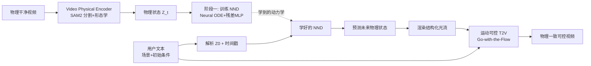

# NewtonGen: Physics-consistent and Controllable Text-to-Video Generation via Neural Newtonian Dynamics

**会议**: ICLR 2026  
**代码**: [https://github.com/pandayuanyu/NewtonGen](https://github.com/pandayuanyu/NewtonGen)  
**领域**: 视频生成 / 物理一致性  
**关键词**: 文本生成视频, 物理一致性, Neural ODE, 牛顿动力学, 运动可控生成  

## 一句话总结
NewtonGen 把一个可学习的「神经牛顿动力学（NND）」模块塞进文本生成视频的管线里——先用 Neural ODE 从极少量物理干净数据学会各类牛顿运动的潜在动力学，再把预测出的未来物理状态转成结构化光流去引导视频生成器，从而做到物理一致且参数可控的视频生成。

## 研究背景与动机
**领域现状**：以扩散模型和 DiT 为基础的文本生成视频模型（Sora、Veo3、CogVideoX、Wan 等）已经能合成视觉上极其逼真的画面，业界普遍把它们当作「世界模拟器」的雏形，期望靠 scaling law 自然涌现出对物理的理解。

**现有痛点**：这些模型只从大规模视频里学到了**外观层面的运动分布**，却没学到运动背后的动力学规律。结果就是画面好看但物理频频翻车——物体往上掉、速度方向突变、加速度不连贯，尤其在分布外（OOD）场景下崩得厉害。同时它们缺乏**精确参数控制**：你没法指定初始位置、初速度、角速度，让它在不同初始条件下生成一致的动力学。

**核心矛盾**：纯数据驱动模型偏差低、生成能力强，但物理不可信、不可控；纯物理仿真（先仿真后生成、先生成后仿真）虽然显式可控，却要人工预设每个场景的物理参数与规则，泛化性差、人力成本高。两条路各执一端，难以兼得。本文把现有的物理感知生成归纳为三类（生成后仿真 $\hat V = P(G_\psi(I))$、仿真后生成 $\hat V = G_\psi(P(I))$、带学习物理先验的生成 $\hat V = G_\psi(P_\phi(I))$），并指出第三类方法的隐患在于「假设大模型本身会物理推理」，而实际上它们的所谓物理理解也只是数据拟合。

**本文目标**：在数据驱动生成的强表达力之上，注入一个**轻量、可学习、白盒可控**的物理先验，使生成既物理一致又能精确响应用户给定的初始条件。

**核心 idea（混合范式 + 可学动力学）**：把「物理动力学推理」和「视频内容生成」解耦——用一个 Neural ODE 显式建模牛顿运动并预测未来物理状态，再让运动可控的视频生成器据此渲染外观。物理先验同时由**显式物理模型**（线性 ODE）和**物理干净数据**驱动，因此比纯隐式先验更可控、OOD 泛化更好。

## 方法详解

### 整体框架
NewtonGen 分两阶段。**阶段一（训练 NND）**：在一小批物理干净视频上训练 Neural Newtonian Dynamics，学到各类运动的潜在动力学与参数。**阶段二（可控推理）**：用户用文本同时给定场景描述与初始物理条件，系统解析出初始物理状态 $Z_0$ 与未来时间戳，喂给训练好的 NND 预测全序列物理状态，再把这些状态转成像素级光流、下采样成结构化光流，连同场景 prompt 一起送进运动可控的 T2V 生成器产出最终视频。

### 关键设计

**1. 9 维潜在物理状态：用一个统一向量装下平移/旋转/形变。** NND 不在像素空间工作，而是把每帧压成一个 9 维潜在物理状态 $Z = [x, y, v_x, v_y, \theta, \omega, s, l, a]$，其中 $x,y$ 是质心位置、$v_x,v_y$ 是速度、$\theta,\omega$ 编码旋转角与角速度、$s,l$ 是物体最短和最长维度、$a$ 是投影面积。这种设计的巧妙之处在于：单个向量就能同时刻画平移、旋转、形变等复杂行为，连 3D 运动效果都能用「位置 + 尺寸」的组合等价实现（远近变化体现为面积/尺寸的缩放）。把高维视频降到低维物理状态，使得后续动力学建模既轻量又物理可解释。

**2. 线性物理 ODE + 残差 MLP：一个框架吃下多种动力学。** 不同运动遵循不同规律——自由落体能用简单线性 ODE 描述，而阻尼摆等非线性运动不行。NND 的做法是把二阶线性 ODE 和一个残差 MLP 拼起来：线性项捕捉主导的线性动力学，残差 MLP 补上非线性与未知成分。对 $Z$ 中每个分量 $z$，动力学写成
$$a_z \ddot z + b_z \dot z + c_z z + d_z + \mathrm{MLP}(Z) = 0$$
其中 $a_z, b_z, c_z, d_z$ 是可学习的线性 ODE 参数。把所有分量的 ODE 合成自治形式后，给定初始状态 $Z_0$ 和时间 $t$，用 ODE solver `odeint` 积分即可预测未来状态：
$$Z_t = Z_0 + \int_{t_0}^{t} \mathrm{Func}\big(Z(\tau)\big)\, d\tau$$
之所以约束在二阶，是因为日常大多数运动（如飞行的球）在较短时间窗内都能用二阶动力学加足够密的锚点充分刻画。消融实验证实，正是这个残差 MLP 让圆周、抛物+旋转、阻尼振荡等非线性运动的预测误差从 0.5～0.7 量级骤降到 0.006～0.04。

**3. 仅编码器训练 + 物理干净数据：两小时学会一种运动。** 训练时采用 encoder-only 架构，不必解码回图像，只在潜在物理空间里优化，大幅省算力。具体地，Video Physical Encoder 先用分割基础模型 SAM2 拿到每帧动态区域的 mask，再通过形态学分析抽出质心、面积、长短轴、朝向，并用帧间差分算速度，量化成物理状态 $Z$。训练损失是预测状态与编码器抽出状态的 MSE：
$$\mathcal{L} = \frac{1}{T}\sum_{t=1}^{T} \big\| E_{\text{phys}}(I_t) - \mathrm{NND}_\kappa(E_{\text{phys}}(I_0), t) \big\|_2^2$$
由于缺乏高质量物理动力学数据集，作者自建了一个基于 Python 的物理仿真器，能在不同世界设定、初始条件、运动类型下渲染带精确时间戳的「物理干净」视频（运动显著、单调、无运动模糊、无背景干扰）。每种运动只需 100 段视频，单张 A100 训练约 2 小时即可。

**4. 物理状态转结构化光流：把动力学知识灌进生成器。** 阶段二的关键是怎样把 NND 的物理预测「翻译」给视频生成器。作者选用 Go-with-the-Flow 作为底座——它通过对每帧独立初始化的高斯噪声按输入光流做 warp，让相邻帧初始噪声间产生时间相关性，从而实现运动控制（相比 ControlNet/额外编码器注入轨迹或包围框的做法，它更擅长处理形变、旋转等复杂运动）。流程是：解析用户物理 prompt 得到 $Z_0$ 与时间戳 → NND 预测全帧物理状态 → 结合世界设定（场景尺寸、物体大小、最接近的简单几何形状）算出每帧近似像素级光流 → 时空下采样匹配生成器潜空间分辨率 → 连同场景 prompt 采样出最终视频。

## 实验关键数据

### 主实验表格
在 12 类运动、每类 24 个 prompt 上与 5 个 SOTA 基线对比，指标为物理不变量分数 PIS（$\mathrm{PIS} = (1 + C_\sigma/(|C_\mu|+\epsilon))^{-1}$，越接近 1 越物理一致）、背景一致性 BC、运动平滑度 MS（取自 VBench）。下表摘录代表性运动的 PIS（↑）：

| 运动类型 / 指标 | Reference | Sora | Veo3 | CogVideoX-5B | Wan2.2 | PhyT2V | **Ours** |
|---|---|---|---|---|---|---|---|
| 匀速 PIS-v | 0.9972 | 0.6548 | 0.9784 | 0.5392 | 0.6395 | 0.5349 | **0.9830** |
| 抛物 PIS-vx | 0.9988 | 0.9095 | 0.9042 | 0.7392 | 0.7747 | 0.6370 | **0.9803** |
| 抛物 PIS-ay | 0.9487 | 0.5723 | 0.7662 | 0.4230 | 0.5571 | 0.3567 | **0.8189** |
| 3D 运动 PIS-Δl | 0.7388 | 0.5013 | 0.5932 | 0.3026 | 0.4583 | 0.2911 | **0.6472** |
| 圆周 PIS-ω | 0.9933 | 0.8393 | 0.8932 | 0.7726 | 0.4677 | 0.6391 | **0.9788** |
| 形变 PIS-Δl | 0.9247 | 0.3626 | 0.3466 | 0.3550 | 0.3515 | 0.3601 | **0.5492** |

NewtonGen 在几乎所有 12 类运动上 PIS 都取得最优或次优，且 BC、MS 同样领先，运动轨迹平滑、无方向/速度突变。

### 消融实验表格
消融关注残差 MLP 与训练数据规模的影响，指标为预测物理状态与真值的归一化绝对误差（↓）：

| 配置 / 运动 | 圆周 Circ | 抛物+旋转 ParaRota | 阻尼振荡 Osci | 形变 Def |
|---|---|---|---|---|
| W/o MLP | 0.5388 | 0.7451 | 0.2275 | 0.0854 |
| Our-data10 | 0.1246 | 0.1045 | 0.2327 | 0.0555 |
| **Our-data100** | **0.0255** | **0.0064** | 0.0425 | 0.0357 |
| Our-data500 | 0.0196 | 0.0063 | 0.0694 | 0.0290 |

### 关键发现
- **残差 MLP 对非线性运动是决定性的**：去掉后圆周、抛物+旋转等误差暴涨一个数量级以上，证明纯线性 ODE 不够。
- **100 段干净数据就够**：从 data10 到 data100 提升显著，但 data100 到 data500 几乎不再变好（个别还略升），说明 NND 能从少量物理干净样本里准确推断系统动力学。
- **可迁移到真实视频**：在 PISABench 真实下落视频上训练 NND，即便有运动模糊也能学到下落动力学并泛化生成新场景，PIS-vx/PIS-ay 为 0.8485/0.6008——虽低于仿真数据（0.9803/0.8189），但验证了真实数据训练的可行性，同时也凸显仿真干净数据更省事、质量更高。

## 亮点与洞察
- **解耦「物理推理」与「外观生成」**是全文最核心的设计哲学：让 Neural ODE 专管动力学、让大生成模型专管视觉，各取所长，避免逼着生成模型同时学外观和物理。
- **白盒可控**：用户能直接指定初始位置、速度、角速度、形状、尺寸等显式物理参数，生成结果忠实反映这些设定，这是纯黑盒 T2V 做不到的。
- **轻量到离谱**：每种运动仅需 100 段视频、2 小时单卡训练，物理先验以「插件」形式注入而非重训生成器，工程上极具吸引力。
- **9 维状态 + 线性 ODE+残差 MLP 的组合**在表达力与可解释性之间取得了漂亮平衡，3D 效果用尺寸/面积等价实现的取巧很聪明。

## 局限与展望
- **只建模连续动力学**：基于连续 ODE，对多物体交互（碰撞、合并等离散事件）效果较差，作者也坦言需要未来用事件驱动或离散神经架构来补。
- **依赖前景物体可被 SAM2 干净分割**：物理状态抽取建立在分割 + 形态学之上，背景复杂、遮挡严重或多物体场景下会变难。
- **运动范围受限**：实验集中在 0–15 m/s、1–2 秒的短时运动，长时程、强外力时变的场景未验证。
- **物理干净数据的真实性 gap**：仿真数据虽干净，但与真实世界纹理/光照分布存在差距，真实视频上的 PIS 明显下滑。

## 相关工作与启发
- **与三类物理感知生成的关系**：本文归属「带学习物理先验的生成」一类，但区别在于先验由显式物理模型 + 物理干净数据共同驱动，而非寄望于大模型隐式的物理推理（如 PhyT2V 靠 LLM/VLM 多轮自我修正）。
- **从视频学物理**：NND 受 Hamiltonian/Lagrangian NN、PINN 等「从视频估计已知控制方程参数」工作启发，但用 encoder-only + 通用 Neural ODE 把多种动力学统一进一个框架，突破了以往「一种系统一个模型」的限制。
- **运动可控生成底座**：选用 Go-with-the-Flow 的结构化噪声机制，相比 ControlNet 式轨迹/框注入更擅长形变与旋转，是把物理状态落地为可控信号的关键一环。
- **启发**：把「可学习的物理 simulator」作为即插即用先验注入大生成模型，这一范式可推广到 3D 生成、机器人世界模型、可控动画等更广领域。

## 评分
- **新颖性**: ⭐⭐⭐⭐ 将可训练 Neural ODE 形式的牛顿动力学解耦注入 T2V 管线，9 维物理状态 + 线性 ODE+残差 MLP 的统一框架设计巧妙，思路清新。
- **实验充分度**: ⭐⭐⭐⭐ 覆盖 12 类运动、5 个强基线、PIS/BC/MS 多指标，含 MLP/数据规模/真实视频三组消融，较为扎实；不足是缺主流 VBench 物理类基准的大规模评测与用户研究。
- **写作质量**: ⭐⭐⭐⭐ 动机清晰、把物理感知生成的三类范式梳理得很到位，公式与框架图配合好读。
- **价值**: ⭐⭐⭐⭐ 为「物理可信 + 参数可控」的视频生成提供了轻量可复现的实用方案，对世界模型方向有启发，代码与数据开源。

<!-- RELATED:START -->

## 相关论文

- [\[ICLR 2026\] 3D Scene Prompting for Scene-Consistent Camera-Controllable Video Generation](3d_scene_prompting_for_scene-consistent_camera-controllable_video_generation.md)
- [\[NeurIPS 2025\] PhysCtrl: Generative Physics for Controllable and Physics-Grounded Video Generation](../../NeurIPS2025/video_generation/physctrl_generative_physics_for_controllable_and_physicsgrou.md)
- [\[CVPR 2026\] Phantom: Physics-Infused Video Generation via Joint Modeling of Visual and Latent Physical Dynamics](../../CVPR2026/video_generation/phantom_physics-infused_video_generation_via_joint_modeling_of_visual_and_latent.md)
- [\[ICLR 2026\] Real-Time Motion-Controllable Autoregressive Video Diffusion](real-time_motion-controllable_autoregressive_video_diffusion.md)
- [\[ICLR 2026\] NeRV-Diffusion: Diffuse Implicit Neural Representation for Video Synthesis](nerv-diffusion_diffuse_implicit_neural_representation_for_video_synthesis.md)

<!-- RELATED:END -->
