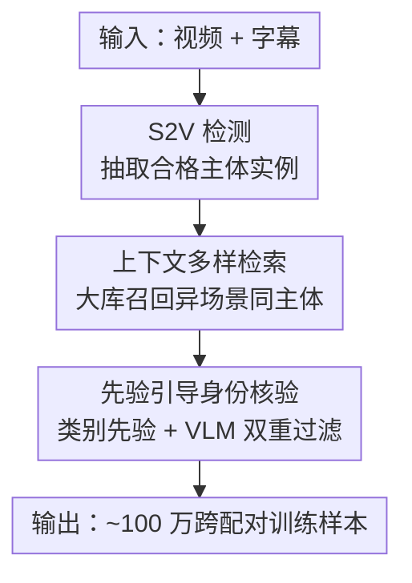

# Phantom-Data: Towards a General Subject-Consistent Video Generation Dataset

**会议**: ICLR 2026  
**OpenReview**: [https://openreview.net/forum?id=IjqKXnzUXx](https://openreview.net/forum?id=IjqKXnzUXx)  
**项目页**: [https://phantom-video.github.io/Phantom-Data/](https://phantom-video.github.io/Phantom-Data/)  
**代码**: 见项目页  
**领域**: 视频生成 / 主体一致性 / 数据集  
**关键词**: 主体一致视频生成, 跨配对数据, copy-paste, 身份一致性, 数据流水线

## 一句话总结
针对主体到视频生成（S2V）里普遍的"copy-paste"问题，本文构造了第一个通用的跨配对（cross-pair）主体一致数据集 Phantom-Data——约 100 万对身份一致样本，通过"S2V 检测 → 上下文多样检索 → 先验引导身份核验"三段式流水线，从 5300 万视频和 30 亿图像里为每个主体找到不同场景下的参考图，从而在保持身份一致的同时大幅提升文本跟随能力和画质。

## 研究背景与动机
**领域现状**：主体一致视频生成（S2V）要求模型生成的视频既跟随文本 prompt，又忠实保留参考主体（人、动物、产品、场景等）的身份。近两年这个方向进展很快，主流做法是用预训练编码器/VLM 把参考特征通过 cross-attention 注入生成骨干，或者把身份特征在 noise 空间与扩散输入拼接（如 Phantom、VACE）。

**现有痛点**：这些方法普遍存在"copy-paste 问题"——生成的视频会直接把参考帧里的主体连同它的背景、姿态一起搬过来，导致 prompt 里描述的新场景（比如"拳击台"）被忽略，画面出现 artifact、文本跟随能力差。论文 Fig.2 用一个 SOTA 模型（Kling）展示了这种"复制粘贴"现象。

**核心矛盾**：根因出在训练范式上。绝大多数方法用 **in-pair** 范式——参考主体直接从目标视频的同一片段里采样。这天然地把"主体身份"和"背景/上下文属性"纠缠在一起，模型分不清哪些该保留（身份）、哪些该丢弃（场景），于是把背景姿态也一并记住了。而现实里这些纠缠的特征常常和 prompt 描述的新动作/语义冲突。

**已有补救及其不足**：一类工作做数据归一化/增广（去背景、颜色抖动、几何变换），但变化太有限，解不开视角、运动这类复杂上下文因素；另一类引入 cross-pair 数据（参考帧和目标帧来自不同来源），思路对，但现有跨配对数据集几乎只覆盖人脸域，没法泛化到通用主体（动物、产品、风格化角色）。总之现有训练数据要么参考变化不足、要么领域多样性差。

**本文目标与切入角度**：作者要造一个"通用域 + 跨配对"的高质量数据集，围绕参考主体的三条原则——① 通用且贴合用户输入分布的主体；② 参考主体出现在与目标视频不同的上下文（背景/视角/姿态）；③ 尽管上下文变了身份仍在形状/结构/纹理上一致。**核心 idea**：与其在同一视频里采参考（in-pair），不如在 5300 万视频 + 30 亿图像的大库里跨场景检索"同一身份、不同上下文"的参考图，用数据本身把身份和上下文解耦。

## 方法详解

### 整体框架
Phantom-Data 的本质是一条**数据构造流水线**，而非新模型：输入是"视频 + 字幕"，输出是一批"参考图（异场景）↔ 目标视频"的跨配对训练样本。它分三阶段串行——先从每个视频片段里检测出合格的候选主体（S2V Detection），再到大规模检索库里召回这些主体在不同场景下的候选参考图（Contextually Diverse Retrieval），最后用先验知识 + VLM 核验把"同身份、异上下文"的配对筛出来（Prior-Based Identity Verification）。最终得到约 100 万对身份一致样本，含 3 万多个多主体场景。

### 关键设计

**1. S2V 检测：抽出"完整、独特、对得上文本"的主体实例**

这一步解决的痛点是：直接拿现成检测器的框去配对，会得到大量残缺、模糊或语义对不上的主体，污染后续配对。作者设计了五步级联：① **帧采样**——在片段 $t=0.05, 0.5, 0.95$ 三处采帧，保证时间多样；② **关键词抽取**——用 Qwen2.5 从字幕里抽名词短语（人/动物/产品）作为候选主体；③ **视觉定位**——用 Qwen2.5-VL 把每个短语对齐到帧内区域，映射到多个区域的歧义匹配直接丢掉；④ **框过滤**——只保留覆盖图像 $4\%\sim90\%$ 且至少 $128\times128$ 的框，IoU$>0.8$ 的重叠框做抑制；⑤ **视觉-语义复检**——再用 InternVL2.5-7B 按三条标准卡：**完整性**（检测器常框出残缺/裁剪的物体，而 S2V 用户给的是完整主体，残缺的剔除）、**独特性**（树、石头这类模糊通用物体排除）、**主体-文本匹配**（区域要和短语语义一致，单独再起一个 InternVL2.5 实例复评）。这套级联把"能用作参考"的主体质量提了上来。

**2. 上下文多样检索：在 30 亿图像大库里召回同身份、异场景的参考**

跨配对的核心难点是"去哪找同一主体在别的场景里的样子"。作者构建了一个大规模检索库：把训练视频里检测到的每个主体实例都登记进库，再额外灌入 LAION 的 30 亿张图像，专门给产品这类类内变化大的场景补充场景/姿态/外观多样性。检索的关键在于用**按类别定制的专家编码器**抽取"保身份、抗上下文"的嵌入——人脸用 ArcFace：$V_{face}=E_{arcface}(I_{face})$；通用物体借鉴 ObjectMate 用一致性数据微调过的 CLIP：$V_{subj}=E_{IR}(I)$；人则把通用外观和人脸特征拼接：$V_{person}=[E_{IR}(I), E_{arcface}(I_{face})]$。检索时同时卡**上下界相似度**——上界滤掉过于相似的近重复（避免又退化成 copy-paste），下界排除不同身份，正好命中"同身份但视觉上有区别"的目标区间。

**3. 先验引导身份核验：用类别先验 + VLM 把假阳性筛干净**

检索库规模太大，即便相似度落在合理区间也频繁出现假阳性，所以需要两级过滤。第一级是**类别特定先验**：非生命主体（产品）类内变化大、最难验，于是只保留带完整可识别品牌 logo（如 Nike、Audi）的实例，logo 跨场景稳定可作锚点；生命主体（人、动物）则限制候选只能来自**同一长视频的不同片段**——这样既有自然的场景/姿态变化、又能保证是同一身份。第二级是**VLM 成对核验**：对非生命物体强制颜色、包装、文字细节一致但允许背景变；对人则核验人脸身份、全身样本还要核验服装一致。同时它还卡**上下文多样性**——只留背景/场景差异足够大的配对，从源头压住 copy-paste artifact。两级过滤共同保证最终配对"身份严格一致 + 上下文充分多样"。

### 损失函数 / 训练策略
数据集本身不带新 loss；验证时用开源 Phantom-wan（基于 Wan2.1）这一主体一致生成框架，训练 13 亿参数模型，目标为 Rectified Flow，在 64 张 A100 上以 480p 数据训 30k 迭代。推理用 50 步 Euler 采样 + classifier-free guidance 解耦图像与文本条件。所有对比实验共享同一套训练/推理设置以保证公平。

## 实验关键数据

### 主实验
评测用 100 个覆盖人/动物/产品/环境/服装的测试 case（含单/多主体），从三个维度衡量：主体一致性（DINO、GPT-4o）、文本跟随（Reward-TA）、视频质量（VBench 的 Temporal/Motion/IQ/BG/Subj）。

| 训练范式 | DINO ↑ | GPT-4o ↑ | Reward-TA ↑ | IQ ↑ | BG ↑ | Subj ↑ |
|----------|--------|----------|-------------|------|------|--------|
| In-pair | 0.478 | 2.481 | 2.074 | 0.725 | 0.937 | 0.933 |
| In-pair + Data Aug | 0.473 | 2.792 | 2.427 | 0.730 | 0.932 | 0.922 |
| Face Cross-pair | 0.354 | 2.378 | 3.022 | 0.723 | 0.937 | 0.935 |
| **Ours (Phantom-Data)** | 0.416 | **3.041** | **3.827** | **0.739** | **0.948** | **0.944** |

本文在文本跟随（Reward-TA 3.827，远高于 in-pair 的 2.074）和画质多项指标上拿到 SOTA，主体一致性（DINO 0.416）虽不及 in-pair 的 0.478，但考虑到场景多样性大增，仍与 in-pair 基线相当，且明显优于只用人脸的 Face Cross-pair（0.354）。in-pair 因过拟合窄上下文，文本跟随最差；Face Cross-pair 文本跟随尚可但受限于人脸域，对通用主体身份保持弱。

### 消融实验

| 配置 | DINO ↑ | GPT-4o ↑ | Reward-TA ↑ | 说明 |
|------|--------|----------|-------------|------|
| baseline (face only) | 0.354 | 2.378 | 3.022 | 仅人脸 |
| + human | 0.401 | 2.747 | 3.726 | 加入人体主体 |
| + IP/animal | 0.416 | 2.795 | 3.407 | 加入 IP/动物 |
| + product | 0.386 | 2.662 | 3.572 | 加入产品 |
| + multi-subject | 0.418 | 2.901 | 3.512 | 加入多主体 |
| 100k 规模 | 0.408 | 3.090 | 3.796 | 小数据量 |
| 1M 规模 | 0.416 | 3.175 | 3.827 | 全量数据 |

### 关键发现
- **主体多样性**是涨点关键：从只用人脸逐步加入人体、动物、产品、多主体，主体一致性和文本跟随都持续提升，说明跨配对必须覆盖通用域而非局限人脸。
- **数据规模**同样重要：从 10 万扩到 100 万，三项指标全面提升，体现量和多样性缺一不可。
- **检索与核验**的消融（Fig.6）显示：分钟级（vs 秒级）采参考帧提供更丰富上下文；从大规模图像库检索提升召回与候选多样性；不加先验过滤会引入假阳性；VLM 核验能去掉"同脸同衣"这类难辨的误配。

## 亮点与洞察
- **把"解耦身份与上下文"从模型侧搬到数据侧**：不改架构、不加 loss，仅靠"跨场景检索同身份参考"这一数据构造思路就缓解了 copy-paste，是一种很干净的"数据即解药"范式。
- **按类别定制编码器 + 双向相似度阈值**很巧：上界防近重复退化回 copy-paste、下界防身份漂移，正好框出"同身份异场景"的甜区；人用 ArcFace+CLIP 拼接兼顾脸和衣着。
- **用品牌 logo / 同长视频不同片段当身份锚点**是接地气的工程先验：产品靠 logo 跨场景稳定、生命主体靠同视频时序保证天然变化又同一身份，规避了纯相似度检索的假阳性。
- 这套"检测 → 检索 → 先验+VLM 核验"的流水线可迁移到任何需要跨场景配对的一致性任务（如图像定制、虚拟试穿数据构造）。

## 局限与展望
- 流水线重度依赖多个大模型（Qwen2.5-VL、InternVL2.5、ArcFace、CLIP、GPT-4o 评测），构造成本高、可复现门槛不低。
- 产品类靠"完整品牌 logo"过滤，意味着无 logo 或弱品牌的产品很难进库，覆盖面受限；生命主体限定"同一长视频不同片段"也排除了跨视频的同人配对。
- 验证只在 1.3B 的 Phantom-wan / 480p 上做，更大模型、更高分辨率下的增益是否同样显著未知；测试集仅 100 case，规模偏小。
- 主体一致性（DINO）相对 in-pair 仍有下降，说明"多样性 vs 身份保真"的 trade-off 没被完全消除，未来可探索更强的身份核验或自适应阈值。

## 相关工作与启发
- **vs In-pair 范式**：in-pair 从同视频采参考，身份对齐有保证但纠缠上下文导致 copy-paste；本文用跨配对换取上下文多样性，以可控的身份一致性代价换来大幅文本跟随提升。
- **vs 数据增广（去背景/抖色/几何变换）**：增广在 in-pair 基础上加扰动，但变化有限解不开视角/运动；本文直接换不同场景的真实参考，多样性来自真实数据而非合成扰动。
- **vs Face Cross-pair（如 MovieGen 类人脸跨配对）**：它们只覆盖人脸域，对动物/产品/风格化角色泛化差；Phantom-Data 是首个开放获取、覆盖通用主体的跨配对数据集（Table 1）。

## 评分
- 新颖性: ⭐⭐⭐⭐ 首个通用域跨配对 S2V 数据集，"数据侧解耦身份-上下文"思路清晰但模块多为已有组件组合。
- 实验充分度: ⭐⭐⭐⭐ 主实验 + 多样性/规模/检索/核验多组消融齐全，但测试集偏小、只验证单一骨干。
- 写作质量: ⭐⭐⭐⭐ 动机和流水线讲得清楚，图示直观。
- 价值: ⭐⭐⭐⭐⭐ 直击 S2V 落地痛点 copy-paste，开放数据集对社区价值高。

<!-- RELATED:START -->

## 相关论文

- [\[ICLR 2026\] BindWeave: Subject-Consistent Video Generation via Cross-Modal Integration](bindweave_subject-consistent_video_generation_via_cross-modal_integration.md)
- [\[ICLR 2026\] MAGREF: Masked Guidance for Any-Reference Video Generation with Subject Disentanglement](magref_masked_guidance_for_any-reference_video_generation_with_subject_disentang.md)
- [\[ICLR 2026\] 3D Scene Prompting for Scene-Consistent Camera-Controllable Video Generation](3d_scene_prompting_for_scene-consistent_camera-controllable_video_generation.md)
- [\[ICLR 2026\] NewtonGen: Physics-consistent and Controllable Text-to-Video Generation via Neural Newtonian Dynamics](newtongen_physics-consistent_and_controllable_text-to-video_generation_via_neura.md)
- [\[CVPR 2026\] PoseAnything: General Pose-guided Video Generation with Part-aware Temporal Coherence](../../CVPR2026/video_generation/poseanything_general_pose-guided_video_generation_with_part-aware_temporal_coher.md)

<!-- RELATED:END -->
