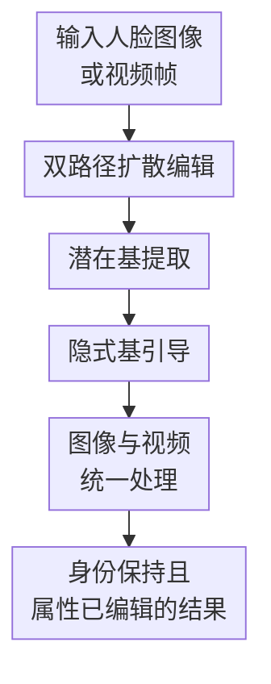

# Pixel-Perfect Puppetry: Precision-Guided Enhancement for Face Image and Video Editing

**会议**: ICLR2026  
**OpenReview**: [https://openreview.net/forum?id=8mHZWTeF3z](https://openreview.net/forum?id=8mHZWTeF3z)  
**代码**: https://github.com/yl4467/flow_edit  
**领域**: 视频生成  
**关键词**: 人脸编辑、视频编辑、扩散模型、潜空间几何、身份保持

## 一句话总结
FlowGuide 把扩散 UNet bottleneck 中由编辑条件诱导的语义方向显式抽成正交基，再用原始路径与编辑路径的基向量几何对齐度动态修正去噪噪声，从而在人脸图像和视频编辑中更精确地改目标属性，同时尽量保留身份、背景和帧间一致性。

## 研究背景与动机
**领域现状**：人脸图像编辑和人脸视频编辑都已经从早期的 GAN inversion 转向扩散模型。扩散模型在重建质量、生成稳定性和文本条件编辑上更强，因此很多方法会把输入图像或视频帧反演到噪声潜变量，再在去噪过程中引入目标属性提示，得到带有新表情、胡子、眼镜、妆容或发色的结果。

**现有痛点**：真正困难的地方不是“能不能改”，而是“只改该改的地方”。GAN 方法受 inversion 误差影响，容易丢身份或产生伪影；扩散方法虽然重建更好，但目标属性一旦进入去噪轨迹，常会顺带改变脸型、五官、肤色、背景甚至帧间细节。视频场景更敏感，因为每一帧的小偏差都会在播放时变成闪烁、不稳定或身份漂移。

**核心矛盾**：现有 guidance 多数把重建路径当作结构锚点，把编辑路径往原图附近拉回来，但这种约束通常是固定的、粗粒度的。固定约束太强时，目标属性改不动；约束太弱时，身份和非目标区域又会被一起改掉。换句话说，方法缺少一个能逐步判断“当前去噪步骤里哪些差异属于目标属性，哪些差异应该被保留”的局部尺度。

**本文目标**：作者希望在统一框架里同时处理人脸图像和视频编辑：输入原始人脸图像或视频帧，以及目标编辑条件，输出带目标属性的结果；同时满足三个约束，一是目标属性确实发生变化，二是身份和非目标内容尽量不变，三是视频帧之间不出现明显时序抖动。

**切入角度**：论文利用一个几何观察：扩散 UNet bottleneck 的潜空间在局部可以近似线性，因此编辑条件对 bottleneck 表示的影响可以看作某些语义子空间方向。若能把“原始条件”和“目标编辑条件”各自对应的局部基向量抽出来，就能用它们之间的角度关系估计当前语义变化有多大，再决定去噪时哪些区域跟随编辑路径、哪些区域回到重建路径。

**核心 idea**：用 UNet bottleneck 的条件雅可比矩阵提取属性相关的潜在基向量，并用原始基与编辑基的余弦对齐度生成动态 mask，按步修正编辑路径噪声，让扩散编辑沿目标属性方向走，而不是无约束地改整张脸。

## 方法详解
### 整体框架
FlowGuide 采用双路径扩散流程：一条是重建路径，用原始条件把输入帧从噪声潜变量还原回来，作为身份和结构基准；另一条是编辑路径，用目标条件生成带新属性的结果。两条路径在每个去噪步共享输入反演得到的高噪声起点，但在 denoising 阶段使用不同条件，随后从 UNet bottleneck 中抽取各自的潜在基，并通过基向量对齐度来修正编辑路径的噪声预测。

这个框架的关键不在于额外训练一个大模型，而是在现有扩散编辑过程中插入几何 guidance：LBE 负责找出“条件真正推动 bottleneck 变化的方向”，IBG 负责把这些方向转化为按时间步变化的空间约束。对单张图像，它控制局部属性编辑；对视频，它逐帧运行同一机制，使每帧都围绕同样的属性方向被引导，因此有助于减少帧间随机漂移。

### 关键设计
**1. 双路径扩散编辑：把身份基准和目标编辑放在同一去噪坐标系里**

论文没有直接让目标提示单独驱动生成，而是同时维护重建路径和编辑路径。输入帧 $X_0$ 先经过 DDIM 式反演得到高噪声潜变量，重建路径记作 $X^r_t$，编辑路径记作 $X^c_t$。重建路径使用原始条件，目的是在每个时间步提供“如果不编辑，这张脸应该是什么样”的参考；编辑路径使用目标条件，负责引入笑容、胡子、墨镜、妆容等属性。

这种双路径设置解决的是扩散编辑里最常见的失控问题：如果只有编辑路径，模型不知道哪些变化是必要属性、哪些变化是副作用；如果只把编辑路径强行贴近重建路径，又会把目标属性也压回去。FlowGuide 的做法是在同一时间步比较两条路径，而不是在最终图像层面事后修补，这样 correction 可以随着去噪过程逐步发生。

**2. 潜在基提取：用条件雅可比的 SVD 找到属性真正影响的局部方向**

作者基于 UNet bottleneck 局部线性的假设，把条件 $C$ 到 bottleneck 表示 $H$ 的影响写成局部线性映射 $T_C \rightarrow T_H$。如果 $J_C$ 是该映射的雅可比矩阵，那么条件空间中的方向 $v$ 会被映射到 bottleneck 切空间中的 $u = J_C v$。论文用 pullback 范数衡量某个条件方向对 bottleneck 的影响强度：

$$
\|v\|_{pb}^{2}=\langle u,u\rangle_H=v^\top J_C^\top J_C v.
$$

接下来对 $J_C=U\Lambda V^\top$ 做奇异值分解，右奇异向量 $V=\{v_1,\ldots,v_n\}$ 就对应最能引起 bottleneck 响应的局部方向。直观地说，LBE 不是直接比较整块 latent，而是在问：当前条件最主要地沿哪些语义方向推动 UNet 的中间表示？对重建条件得到 $V^r$，对编辑条件得到 $V^c$，后续 guidance 只围绕这两组基向量的关系展开。

这个设计的价值在于“去掉无关变化”。输入 latent 里混有身份、姿态、背景、光照和噪声，如果直接比较 $X^r_t$ 与 $X^c_t$，差异不一定对应目标属性。LBE 通过条件到 bottleneck 的局部响应来定义方向，更接近“编辑提示真正想改变什么”，因此后续 mask 不只是像素差异或噪声差异的硬阈值，而是带有语义方向的阈值。

**3. 隐式基引导：用基向量对齐度决定每一步允许编辑多大区域**

有了 $V^r$ 和 $V^c$ 后，FlowGuide 用余弦相似度衡量原始条件和编辑条件在潜在基上的几何对齐。论文定义的归一化角度形式可以概括为：

$$
\Phi_C(V^r,V^c)=\cos^{-1}(\phi)/\pi,
\quad
\cos(\phi)=\frac{1}{n}\sum_{i=1}^{n}\frac{v_i^r v_i^c}{\|v_i^r\|\|v_i^c\|}.
$$

这个值被用作动态 guidance 信号。若两组基很相似，说明当前条件差异不大，编辑路径不应大面积偏离重建路径；若两组基差异明显，说明目标属性开始主导，模型可以允许更大的局部变化。论文也比较了 Pearson、Spearman 和 cosine，结论是角度或秩相关比线性相关更适合描述潜空间里的几何关系，其中 cosine 在编辑强度和身份保持之间更均衡。

具体到去噪噪声，方法先比较编辑噪声 $\epsilon^c$ 与重建噪声 $\epsilon^r$ 的差异矩阵 $|\epsilon^c-\epsilon^r|$，再根据相似度选择动态分位数阈值 $\lambda$，构造 mask：

$$
M=|\epsilon^c-\epsilon^r|<\lambda,
\quad
\hat{\epsilon}=\epsilon^c+M\odot(\epsilon^r-\epsilon^c).
$$

这条公式的含义很朴素：mask 覆盖的区域用重建路径把编辑噪声拉回来，未覆盖的区域保留编辑路径的噪声。于是非目标区域更接近原脸，目标属性相关区域则保留修改自由度。相比固定 guidance，IBG 的阈值随时间步和语义基相似度变化，因此早期更保守地保结构，后期在必要区域释放细粒度属性修改。

**4. 图像与视频统一处理：逐帧共享同一类几何约束来减少时序漂移**

论文把视频看作多帧同时处理的编辑任务，每帧都经过反演、双路径去噪、LBE 和 IBG。它并不是显式建一个复杂的时序 Transformer，而是依靠“每一帧都被同样的目标属性子空间约束”来获得稳定性：如果每帧的编辑都被限制在胡子、笑容、口红等目标方向上，而身份和背景方向不断被重建路径拉住，那么帧间差异就不容易被随机扩散噪声放大。

这种选择也解释了论文为什么强调 pixel-level face editing。人脸视频里，观众对眼睛、嘴角、鼻梁、脸型的细微漂移非常敏感，普通场景视频编辑中可接受的纹理变化在人脸上会显得突兀。FlowGuide 的逐步 mask 融合实际是在每一帧做局部“刹车”：只让目标属性区域继续走编辑路径，其他区域尽量回到重建路径，从而同时服务身份保持和时序一致性。

### 一个完整示例
假设输入是一段 32 帧的人脸视频，目标是“给说话者加上微笑”。反演后，重建路径从 $X_T^r$ 出发，用原始条件逐步还原说话者原来的嘴型、脸型和背景；编辑路径从同一个噪声起点出发，用“smiling face”这类目标条件推动嘴角和面部肌肉发生变化。

在某个早期去噪步，图像仍以粗结构为主，LBE 抽到的 $V^r$ 和 $V^c$ 可能高度相似。IBG 因此选择较保守的 mask，把大部分噪声预测拉回重建路径，避免脸型、头发和背景过早被改。到了较晚去噪步，嘴部区域与笑容条件的基向量差异变大，动态阈值允许更多与嘴角、脸颊相关的局部差异保留在编辑路径里。最终结果不是整张脸“换人式”重绘，而是同一个人逐步出现目标表情。

如果目标换成“加胡子”，流程仍类似，只是目标属性的潜在方向主要集中在嘴唇上方和下巴区域。FlowGuide 不需要手工指定区域，它通过 $|\epsilon^c-\epsilon^r|$ 与基向量对齐度共同决定哪些位置应被编辑；这也是作者称其为隐式 guidance 的原因。

### 损失函数 / 训练策略
论文的主线不是训练一个新的监督损失，而是在预训练扩散模型的反演与去噪过程中加入 guidance。图像编辑实验使用预训练 Stable Diffusion 系列模型，并在 DDIM inversion 后进行双路径 denoising；视频实验对每段视频采样连续帧，按同一流程逐帧处理。关键超参实际围绕去噪步、编辑条件、相似度度量和动态分位数阈值展开。

从优化目标看，FlowGuide 的“约束”体现在噪声预测融合上，而不是额外 loss：重建路径提供 $\epsilon^r$，编辑路径提供 $\epsilon^c$，IBG 得到最终噪声 $\hat{\epsilon}$。因此它更像一个训练后几何控制器，可以嵌入现有扩散编辑流程。论文也报告了不同相似度选择的效果，说明 guidance 度量本身会显著影响编辑强度与身份保持的权衡。

## 实验关键数据

### 主实验
论文分别评估了人脸图像编辑和人脸视频编辑。图像部分在 CelebA 上选 500 张图，任务包括加墨镜、加妆、年龄变化、发色修改和微笑；指标覆盖非编辑区域质量、文本编辑对齐和原图一致性。视频部分在 HDTF 与 VoxCeleb 上各采样 20 个真实视频，每个视频取 32 连续帧，评估身份保持、目标属性变化、CLIP 分数和时序一致性。

| 任务 / 数据集 | 指标 | FlowGuide | 代表性强基线 | 结论 |
|--------|------|-----------|--------------|------|
| CelebA 图像编辑 | PSNR ↑ | 23.160 (Cosine) / 24.129 (Spearman) | h-Edit 22.078 | FlowGuide 在非编辑区域质量上超过 h-Edit，Spearman 最高，Cosine 更均衡 |
| CelebA 图像编辑 | LPIPS ↓ | 0.0965 (Cosine) / 0.0882 (Spearman) | h-Edit 0.1034 | 感知差异更小，说明身份和背景保留更稳 |
| CelebA 图像编辑 | CLIP Sim ↑ | 19.391 (Cosine) | h-Edit 19.707 / NMG 21.666 | Cosine 的文本对齐略低于部分强编辑方法，但换来更好的保真 |
| CelebA 图像编辑 | DINO Dist ↓ | 0.0166 (Cosine) | h-Edit 0.0193 | 原图一致性更好，符合身份保持目标 |
| HDTF 视频编辑 | IPR ↑ | 0.9667 | DVA 0.9244 / TCSVE 0.9413 | 身份保持率最高 |
| HDTF 视频编辑 | CLIP-Score ↑ | 0.7777 | DVA 0.7685 / StyleCLIP 0.7676 | 属性编辑对齐也保持领先 |
| VoxCeleb 视频编辑 | IPR ↑ | 0.9033 | DVA 0.8910 / TCSVE 0.8723 | 跨数据集仍保持身份优势 |
| VoxCeleb 视频编辑 | TL-ID / TG-ID ↑ | 1.0000 / 1.0000 | 多数强基线接近 1.0 | 时序身份一致性至少不输强基线 |

图像实验里，FlowGuide 的 Pearson 版本 CLIP Sim 达到 22.157，但 PSNR、LPIPS 和 DINO Dist 明显变差，说明单纯追求编辑强度会牺牲身份与结构。Cosine 版本的 PSNR 23.160、LPIPS 0.0965、SSIM 0.8448、DINO Dist 0.0166，是论文推荐的折中点；Spearman 版本保真更强，但 CLIP Sim 只有 17.831，编辑力度偏保守。

视频实验里，FlowGuide 在 HDTF 上的 IPR 为 0.9667，高于 DVA 的 0.9244 和 TCSVE 的 0.9413；在 VoxCeleb 上 IPR 为 0.9033，也高于 DVA 的 0.8910。CLIP-Score 在 HDTF 上为 0.7777，是表中最高；VoxCeleb 上为 0.7607，略低于 StyleCLIP / DVA 等个别方法，但配合更高的身份保持和满分级 TL-ID、TG-ID，整体更符合人脸视频编辑的要求。

### 消融实验
| 配置 | 关键指标 | 说明 |
|------|---------|------|
| FlowGuide | IPR 0.9510 / TACR 0.0329 / CLIP 0.7563 / TL-ID 0.9986 / TG-ID 0.9929 | 完整模型在身份保持、编辑能力和时序一致性之间最均衡 |
| w/o LBE | IPR 0.9831 / TACR 0.0331 / CLIP 0.7437 / TL-ID 0.9925 / TG-ID 0.9775 | 直接在原始 latent 上做相似度，身份看似更保守，但目标编辑能力下降 |
| w/o IBG | IPR 0.9370 / TACR 0.0337 / CLIP 0.7773 / TL-ID 0.9770 / TG-ID 0.8854 | 能找到编辑方向，但缺少空间控制，编辑更强同时身份和时序明显变差 |
| w/o both | IPR 0.8790 / TACR 0.0309 / CLIP 0.7540 / TL-ID 0.9590 / TG-ID 0.8557 | 两个核心模块都去掉后，编辑质量和时序稳定性明显崩掉 |

### 关键发现
- LBE 贡献的是“改什么”。去掉 LBE 后，方法无法从条件响应里分离属性相关方向，只能在混杂 latent 上做比较；结果虽然 IPR 可能更高，但 CLIP 分数和视觉编辑效果变弱，说明模型更像在保守重建而不是精准编辑。
- IBG 贡献的是“在哪里改”。去掉 IBG 后，模型仍知道目标属性方向，但无法把变化限制在合理区域，导致身份保持和 TG-ID 掉得很明显，视频中会更容易出现非目标区域漂移。
- 相似度曲线支持自适应阈值的必要性。论文观察到早期去噪步基向量相似度较高，约在 0.8-0.9，后期逐渐降到约 0.4-0.5；这说明编辑自由度应该随时间步变化，而不是用固定强度的 guidance 贯穿全程。
- FlowGuide 的优势更偏向高保真人脸编辑，而不是最大化文本 CLIP 分数。对人脸视频来说，这个取舍是合理的，因为身份漂移和帧间闪烁通常比“属性再强一点”更伤观感。

## 亮点与洞察
- 最大亮点是把扩散编辑的“身份保持 vs 属性修改”问题翻译成潜空间几何问题。它没有只在像素或 attention map 上打补丁，而是比较条件在 UNet bottleneck 中诱导出的局部基方向，这让 guidance 的解释性更强。
- LBE + IBG 的分工很清楚：LBE 负责语义 disentanglement，IBG 负责空间局部化。这个组合让论文的方法部分比较自洽，也让消融结果容易解释。
- 论文没有把视频一致性交给额外的大型时序模块，而是通过逐帧一致的属性方向控制来减少漂移。这对工程实现有吸引力，因为很多图像编辑模型可以更自然地扩展到视频批处理。
- 使用动态分位数阈值是一个可迁移 trick。类似思路可以用在物体编辑、医学图像局部编辑或虚拟试穿中：先估计目标条件与保留条件的语义差异，再决定哪些区域允许偏离重建路径。
- 实验呈现了一个重要提醒：CLIP 分数高不等于人脸编辑好。Pearson guidance 的文本对齐很强，但身份和结构指标变差；这说明在高敏感主体编辑里，多目标评价比单一语义对齐更可靠。

## 局限与展望
- 作者承认在高运动视频中仍可能出现过平滑，尤其当头部运动较大或局部纹理快速变化时，潜空间中的保守 guidance 可能牺牲细节锐度。
- 对硬边界配饰的编辑仍不完美，例如添加墨镜时可能出现不自然融合。原因在于扩散潜空间更擅长连续语义变化，对具有清晰几何边缘和遮挡关系的对象控制仍较难。
- 完美属性解耦并没有真正解决。训练数据中胡子、年龄、性别、妆容等属性常常相关，局部基向量也可能混入这些相关因素，因此仍会有轻微非目标变化。
- 方法依赖底层扩散模型的表达能力。如果目标属性或新领域超出预训练模型熟悉分布，FlowGuide 只能在已有 latent space 中引导，可能需要额外微调才能稳定泛化。
- 计算成本值得进一步量化。每个去噪步都要抽取条件相关的潜在基并做 guidance，虽然论文给出效率附录，但面向长视频或高分辨率视频时，如何缓存、近似或稀疏更新基向量会是实际部署关键。
- 未来可以把这种几何 guidance 和显式时序模块结合。例如在跨帧共享或平滑 $V^c$ 的基础上，再加入光流或特征轨迹约束，可能进一步降低快速运动场景中的闪烁。

## 相关工作与启发
- **vs GAN inversion / StyleCLIP / STIT**: GAN 路线通常先把真实脸投到 StyleGAN latent，再沿语义方向编辑；优点是 latent 方向可解释，缺点是 inversion 质量决定上限，视频里容易积累帧间误差。FlowGuide 继承了“语义方向”的思想，但放在扩散 UNet bottleneck 的局部几何中，重建质量和编辑泛化更适合当下扩散模型。
- **vs Edit Friendly / PnP Inversion / Noise Map Guidance**: 这些 diffusion inversion/editing 方法主要改进反演或用噪声差异约束编辑路径。FlowGuide 的区别是先通过 LBE 把条件影响投到潜在基，再用基对齐度控制噪声融合，因此不是固定地相信重建路径，也不是直接相信编辑路径。
- **vs h-Edit**: h-Edit 在图像编辑中是很强的扩散基线，PSNR 和一致性表现好。FlowGuide 的图像实验显示，Cosine / Spearman 版本能在质量和身份指标上超过 h-Edit，但 CLIP 对齐未必总是更高，说明它更偏向高保真而非强语义迁移。
- **vs RAVE / 通用视频编辑方法**: RAVE 等方法面向更广泛的场景视频编辑，允许较大的语义和纹理变化。人脸视频编辑对局部身份一致性要求更高，FlowGuide 用人脸属性的局部几何约束换取更稳定的人脸细节，这也是它在 IPR 上明显领先的主要原因。
- **启发**：这篇论文提示我们，扩散模型的中间层并不只是黑箱特征，它可以被当作局部几何对象来做控制。未来很多编辑任务或许不必重新训练专用控制器，而是可以在反演-去噪过程中估计任务相关子空间，再用几何关系生成可解释 guidance。

## 评分
- 新颖性: ⭐⭐⭐⭐☆ 把 UNet bottleneck 的局部线性、雅可比 SVD 和动态噪声 mask 串成 face image/video editing guidance，思路比较完整，但仍建立在已有 diffusion inversion 与潜空间语义分析之上。
- 实验充分度: ⭐⭐⭐⭐☆ 图像和视频都做了主实验、相似度变体和 LBE/IBG 消融，数据集覆盖 CelebA、HDTF、VoxCeleb；如果能补充更长视频、更高分辨率和真实用户偏好评测会更强。
- 写作质量: ⭐⭐⭐⭐☆ 方法主线清楚，双路径、LBE、IBG 的关系比较容易追踪；部分符号和阈值描述略有不一致，如相似度记号在不同段落中写法不完全统一，需要读者自行对齐。
- 价值: ⭐⭐⭐⭐☆ 对高保真人脸编辑很有参考价值，尤其适合需要身份保持和视频稳定性的应用；其几何 guidance 思路也可能迁移到其他需要局部可控编辑的生成任务。

<!-- RELATED:START -->

## 相关论文

- [\[ICLR 2026\] EditVerse: Unifying Image and Video Editing and Generation with In-Context Learning](editverse_unifying_image_and_video_editing_and_generation_with_in-context_learni.md)
- [\[ICLR 2026\] Controllable First-Frame-Guided Video Editing via Mask-Aware LoRA Fine-Tuning](controllable_first-frame-guided_video_editing_via_mask-aware_lora_fine-tuning.md)
- [\[ICLR 2026\] DreamSwapV: Mask-guided Subject Swapping for Any Customized Video Editing](dreamswapv_mask-guided_subject_swapping_for_any_customized_video_editing.md)
- [\[CVPR 2026\] RecEdit-Drive: 3D Reconstruction-Guided Spatiotemporal Video Editing for Autonomous Driving Scenes](../../CVPR2026/video_generation/recedit-drive_3d_reconstruction-guided_spatiotemporal_video_editing_for_autonomo.md)
- [\[ICLR 2026\] Unified In-Context Video Editing](unified_in-context_video_editing.md)

<!-- RELATED:END -->
