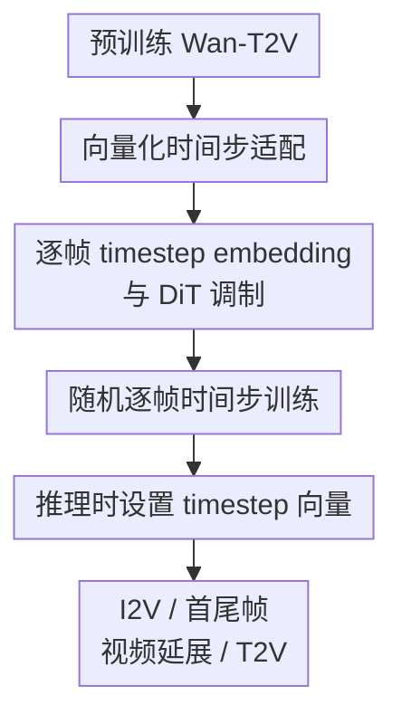

# Pusa V1.0: Unlocking Temporal Control in Pretrained Video Diffusion Models via Vectorized Timestep Adaptation

**会议**: ICLR2026  
**OpenReview**: [https://openreview.net/forum?id=4adY8FepXg](https://openreview.net/forum?id=4adY8FepXg)  
**代码**: 待确认  
**领域**: 视频生成 / 扩散模型  
**关键词**: 向量化时间步, 视频扩散, 图生视频, 时间控制, LoRA 微调

## 一句话总结
Pusa V1.0 把预训练视频扩散模型中的单一标量 timestep 改成逐帧 timestep 向量，通过非破坏式 Vectorized Timestep Adaptation 和极少量 LoRA 微调，让 Wan-T2V 在保留文生视频能力的同时零样本获得图生视频、首尾帧控制和视频延展能力，并在 VBench-I2V 上达到接近 Wan-I2V 的表现。

## 研究背景与动机
**领域现状**：主流视频扩散模型通常沿用图像扩散模型的时间变量设定：一次采样中，整个视频 clip 共用同一个标量 timestep。这个设计对文生视频足够自然，因为模型只需要让所有帧从同一噪声等级同步走向干净视频；Wan-T2V、HunyuanVideo、Mochi 等大模型基本都处在这个范式里。

**现有痛点**：一旦任务变成图生视频、给定首尾帧、视频补全或视频延展，“所有帧同步演化”就变得很僵。图生视频要求第一帧保持接近输入图像，后续帧逐步生成运动；首尾帧任务要求两端帧可以被强约束，中间帧再插值生成；视频延展又要求历史帧保持低噪声、新帧从高噪声生成。标量 timestep 无法直接表达这些不同时刻的不同噪声等级，所以常见做法只能改架构、加 mask、加图像 CLIP embedding，或者为单个任务做大规模微调。

**核心矛盾**：任务特化微调能提升某个任务，但代价是破坏预训练 T2V 模型已经学到的生成先验。以 Wan-I2V 这类路线为例，它从 Wan-T2V 改造成图生视频模型时引入额外条件机制，并需要大规模数据和算力才能重新对齐图像条件与视频运动；这种改造往往会让原始文生视频能力退化，也很难自动迁移到首尾帧、视频补全等其他时间控制任务。

**本文目标**：作者希望用一种尽量小的改动，让大规模预训练 T2V 模型学会逐帧时间控制。具体来说，它要同时满足三件事：第一，训练成本要足够低，不能重新训练一个工业级 I2V 模型；第二，改造后仍保留原 T2V 能力；第三，同一模型不经任务特化训练，就能通过不同 timestep 向量处理 I2V、start-end frames、video extension 等任务。

**切入角度**：论文继承 FVDM 的观察：视频里每一帧都可以拥有自己的扩散进度。如果把 timestep 从 $t$ 扩展为 $\tau=[\tau_1,\tau_2,\ldots,\tau_N]$，模型就能表达“第一帧干净、其余帧有噪声”“两端帧干净、中间帧有噪声”“旧片段低噪声、新片段高噪声”等时间条件。问题不在概念是否成立，而在如何把它接到一个已经训练好的大模型上，并避免向量化 timestep 带来的组合空间爆炸。

**核心 idea**：Pusa 的核心创新是用 Vectorized Timestep Adaptation 将标量 timestep embedding 替换为逐帧 timestep embedding，并只微调少量参数，让预训练视频模型在原有生成先验上“学会时间控制”，而不是为每个任务重建一套条件分支。

## 方法详解

### 整体框架
Pusa 从 Wan-T2V 这样的预训练文生视频模型出发，不改变文本条件、VAE、DiT 主干的基本生成范式，而是把原本全 clip 共用的 timestep 改成每个 latent frame 一个 timestep。训练时，它用随机逐帧 timestep 让模型见到大量异步噪声状态；推理时，只要人为设置不同帧的 timestep 或噪声等级，就能把同一模型切换到 I2V、首尾帧或视频延展等任务。

从公式上看，传统 flow matching 对整个样本使用一个 $t$，线性路径可以写成 $z_t=(1-t)z_0+tz_1$，目标速度是 $z_1-z_0$。Pusa 先把视频写成 $N$ 帧组成的矩阵 $X\in\mathbb{R}^{N\times d}$，再给每帧分配自己的时间变量 $\tau_i$：

$$
X_\tau=(1-\tau)\odot X_0+\tau\odot X_1,
$$

其中 $\tau=[\tau_1,\ldots,\tau_N]^\top$，按帧广播到 latent 特征。这样第 $i$ 帧可以处在低噪声状态，第 $j$ 帧可以仍处在高噪声状态，而模型学习的是一个共同的速度场 $v_\theta(X,\tau)$。这一步不是给模型塞一个新任务标签，而是把“每一帧现在走到扩散轨迹的哪里”变成模型能读懂的条件。

### 关键设计
**1. 向量化时间步适配：用逐帧噪声进度替代全局同步进度**

传统视频扩散模型的瓶颈在于 timestep 只有一个标量 $t$，因此所有帧必须同步去噪。Pusa 将其扩展为向量化时间变量 $\tau\in[0,1]^N$，每个分量 $\tau_i$ 表示第 $i$ 帧在 flow matching 路径上的位置。在线性插值路径下，第 $i$ 帧状态为 $x^i_{\tau_i}=(1-\tau_i)x^i_0+\tau_i x^i_1$，整段视频的训练目标仍然是简单的 $X_1-X_0$，所以方法没有把优化目标弄复杂，只是把条件变量从“全局时间”变成“逐帧时间”。

这个设计解决的是表达能力问题：I2V 可以设置第一帧接近 $\tau_1=0$，后续帧按采样 schedule 从噪声走向数据；首尾帧可以同时固定第一帧和最后一帧；视频延展可以让已有片段保持低噪声，让未来片段高噪声生成。相比为每个任务设计一个 adapter，向量化 timestep 把这些任务统一成“如何设置各帧噪声进度”的问题。

**2. 非破坏式 DiT 调制：只改时间条件入口，不重写生成先验**

Pusa 的实现重点放在 temporal conditioning 机制上。它把 timestep embedding 模块改成处理 $\tau$ 向量，输出帧级时间嵌入 $E_\tau\in\mathbb{R}^{N_1\times D}$；随后在 DiT block 内为每个 latent frame 生成对应的 scale、shift、gate 等调制参数。也就是说，第 $i$ 帧的 token 仍然走原来的 DiT 主干、文本 cross-attention 和视频生成路径，只是在 block 调制处看到自己的 $\tau_i$。

这叫“非破坏式”是因为当所有帧 timestep 相同，即 $\tau_1=\tau_2=\cdots=\tau_N=t$ 时，适配后的模型可以退化回原来的标量 timestep 行为。它没有像 Wan-I2V 那样额外加入 mask 分支和 image CLIP embedding，也不需要把 T2V 模型改造成只能做 I2V 的模型。论文的参数漂移分析也支持这一点：Wan-I2V 的改动大量落在文本编码器和 cross-attention 等生成先验相关模块上，而 Pusa 的变化更小，且主要集中在与时间动态相关的 self-attention block。

**3. 完全随机逐帧采样：用最大异步状态训练时间控制能力**

FVDM 原本使用 PTSS 来混合同步与异步 timestep，避免向量化 timestep 的训练空间过大。Pusa 的判断更激进：既然预训练 Wan-T2V 已经有很强的视频生成先验，微调阶段不必再大量采样同步 timestep 来维持 T2V 能力，而可以直接令 $p_{async}=1$，让每个 $\tau_i$ 独立从 $U[0,1]$ 中采样。

这个训练策略看似简单，但非常关键。它强迫模型在训练中见到各种“有些帧干净、有些帧还很吵”的组合，从而学会跨帧传递条件，而不是只记住一种 I2V 模板。消融结果也说明了这一点：在 900 iterations 下，完全随机采样得到 Total 87.69、I2V 94.83，优于固定 I2V 采样的 73.27 / 76.57，也优于 PTSS $p=0.2$ 和 $p=0.8$。这表明 Pusa 学到的是通用时间控制，而不是只为首帧条件做过拟合。

**4. 通过 timestep 向量做零样本任务切换：训练一次，推理时改时间表**

Pusa 的多任务能力主要发生在推理阶段。以 I2V 为例，给定输入图像 $I_0$ 后，模型先用 VAE 编码得到第一帧 latent，其他帧从高斯噪声初始化；采样时把第一帧的噪声等级固定为 0，即 $\tau^1_s=0$，其他帧跟随 scheduler 从高噪声逐步走到低噪声。Euler 更新写作 $Z_{s+1}=Z_s+\hat{U}_s\odot(\sigma_{s+1}-\sigma_s)$ 时，第一帧对应的 $\sigma$ 差为 0，因此它不会被更新，天然保持为干净条件帧。

同一逻辑可以推广到更多时间控制任务：首尾帧任务固定两端帧的 timestep，视频补全固定已知帧并让未知帧去噪，视频延展则固定已有片段、生成未来片段。这里没有额外训练一个 start-end 模型或 extension 模型，只是换了 timestep 向量的边界条件。这也是 Pusa 相比自回归视频扩散的一个优势：自回归方法天然擅长向未来延伸，但不适合同时约束首尾；Pusa 的逐帧时间表可以表达双向条件。

### 损失函数 / 训练策略
Pusa 使用 Frame-Aware Flow Matching 目标。给定真实视频 $X_0$、先验噪声 $X_1$ 和采样得到的逐帧 timestep $\tau$，先构造 $X_\tau=(1-\tau)\odot X_0+\tau\odot X_1$，再训练模型回归从数据到噪声的目标速度：

$$
\mathcal{L}_{FAFM}(\theta)=\mathbb{E}_{X_0,X_1,\tau}\left[\lVert v_\theta(X_\tau,\tau)-(X_1-X_0)\rVert_F^2\right].
$$

训练上，最终模型基于 Wan-T2V 做 LoRA 微调，使用 8 张 80GB GPU、DeepSpeed Zero2、总 batch size 为 8。数据不是人工标注的 I2V 数据，而是由 Wan-T2V 生成的 3,860 个高质量 720p 视频样本，覆盖自然场景、人类活动、镜头运动等内容。论文强调这点是为了说明：Pusa 并没有依赖海量任务特化数据，而是用与基础模型分布对齐的小规模 T2V 样本，让模型学会“逐帧时间变量”这一新接口。

超参上，作者比较了 LoRA rank、LoRA alpha、训练 iteration 和推理步数。最终主比较使用 rank 512、900 iterations、10 inference steps 的 checkpoint；10 步与 20 步性能非常接近，而推理成本更低。论文也指出 LoRA rank 不能太小，因为 I2V 不是一个局部小风格适配任务，而是需要足够容量去学习帧间时间动态。

## 实验关键数据

### 主实验
论文主实验使用 VBench-I2V 评估图生视频能力。完整测试集生成 5590 个视频，超参和消融使用 750 个视频子集。下表保留最关键的开放模型对比和直接基线 Wan-I2V，其中指标均为百分比，越高越好。

| 模型 | Total | I2V | Quality | Motion Smoothness | Dynamic Degree | I2V Subject | I2V Background | Camera Motion |
|------|-------|-----|---------|-------------------|----------------|-------------|----------------|---------------|
| Magi-1 | 89.28 | 96.12 | 82.44 | 98.68 | 68.21 | 98.39 | 99.00 | 50.85 |
| Step-Video-TI2V | 88.36 | 95.50 | 81.22 | 99.24 | 48.78 | 97.86 | 98.63 | 49.23 |
| Wan-I2V | 86.86 | 92.90 | 80.82 | 97.90 | 51.38 | 96.95 | 96.44 | 34.76 |
| Pusa | 87.32 | 94.84 | 79.80 | 98.49 | 52.60 | 97.64 | 99.24 | 29.46 |

最重要的结论不是 Pusa 在所有开放模型中绝对第一，而是它在极低训练成本下超过直接基线 Wan-I2V 的 Total，并在 I2V 条件一致性上更强。Pusa 的 I2V Background Consistency 达到 99.24，高于 Wan-I2V 的 96.44；I2V Subject Consistency 也从 96.95 提升到 97.64；Dynamic Degree 从 51.38 提升到 52.60，同时 Motion Smoothness 仍保持 98.49。也就是说，它不是靠牺牲运动平滑性换取更强运动，而是在条件保持和运动生成之间同时站住。

### 消融实验
| 配置 | Total | Quality | I2V | 说明 |
|------|-------|---------|-----|------|
| 完全随机逐帧采样（Ours） | 87.69 | 80.55 | 94.83 | 每帧 timestep 独立采样，效果最好 |
| I2V 固定采样 | 73.27 | 69.96 | 76.57 | 首帧固定干净、其他帧同步，泛化明显不足 |
| PTSS, $p=0.2$ | 84.74 | 77.60 | 91.88 | 混合异步采样有效，但不如完全随机 |
| PTSS, $p=0.8$ | 86.49 | 79.30 | 93.69 | 更高异步比例更好，仍低于完全随机 |

这组结果直接验证了训练策略：如果只按 I2V 直觉训练，模型会学到很窄的“首帧条件”模式，分数很低；PTSS 说明异步 timestep 比同步模板更有效；而完全随机逐帧采样进一步说明，预训练模型的生成先验已经足够稳定，微调阶段越充分暴露异步时间组合，越能学到通用的时间控制能力。

| 基础模型 | 设置 | Total | Quality | I2V | Dynamic Degree | Camera Motion | 说明 |
|----------|------|-------|---------|-----|----------------|---------------|------|
| Wan2.1 | $\alpha=1.4$ | 87.69 | 80.55 | 94.83 | 66.40 | 26.40 | 审美质量和动态程度更强 |
| Wan2.2 | high $\alpha=1.5$, low $\alpha=1.4$ | 87.69 | 79.89 | 95.49 | 63.60 | 51.60 | 镜头运动更明显 |

基础模型消融说明 VTA 不是只能绑定某一个 Wan 版本。Wan2.1 和 Wan2.2 得到相同 Total，但风格不同：Wan2.1 的美学和动态程度更高，Wan2.2 的 Camera Motion 从 26.40 提升到 51.60。因为微调数据相同，这些差异主要来自基础模型本身，说明 Pusa 更像一种适配范式，而不是单个模型的偶然技巧。

### 关键发现
- Pusa 的训练效率非常突出。论文声称它用约 4K 样本和约 500 美元成本达到与 Wan-I2V 接近甚至略优的 I2V 结果，而 Wan-I2V 这类任务特化路线预期需要千万级样本和十万美元级成本。
- 完全随机逐帧 timestep 是核心消融里最有说服力的一项。它不仅比固定 I2V 训练强很多，也比 PTSS 变体更强，说明模型真正学到的是可组合的时间控制接口。
- 10 inference steps 已经接近 20 steps 的效果。附录里 10 步 Total 为 87.69，20 步为 87.84，提升很小，因此默认 10 步是质量与速度之间比较合理的折中。
- 机制分析显示，Pusa 在所有采样步中都增强了后续帧对第一帧的 self-attention，而 Wan-I2V 主要在 step 0 强化首帧注意力；这能解释为什么 Pusa 更稳定地保持图像条件。
- 参数漂移分析给“非破坏式”提供了证据。Wan-I2V 的参数变化更大，并集中在生成先验相关模块；Pusa 的漂移超过一个数量级地更小，更多落在 temporal dynamics 相关的 self-attention 处。

## 亮点与洞察
- 最大亮点是把多种视频控制任务统一成 timestep 向量配置问题。图生视频、首尾帧、补全、延展在传统系统里像是四个任务，在 Pusa 里只是“哪些帧固定、哪些帧去噪、每帧噪声等级怎么排”的不同边界条件。
- 非破坏式适配的工程价值很高。很多工业视频模型最昂贵的资产不是某个 I2V 分支，而是预训练 T2V 主干里的通用视觉和运动先验；Pusa 尽量不动这些先验，只给模型增加逐帧时间接口，这比从头做任务特化微调更像“给旧模型加控制旋钮”。
- 论文很有意思的一点是：向量化 timestep 的组合空间理论上巨大，例如 16 帧就可能产生极多时间配置，但预训练 T2V 模型已经学会了相当稳健的帧生成结构。Pusa 不需要穷举组合，而是用小规模随机异步状态让模型学会利用已有先验。
- 这个思路可以迁移到视频编辑和可控生成。比如局部时间冻结、分段重绘、关键帧插值、长视频续写，都可以被表述成不同区域或不同帧的噪声进度控制；如果未来进一步扩展到空间-时间 patch 级 timestep，可能会形成更细粒度的视频编辑接口。
- 论文的机制分析也提醒我们，适配大模型时不一定要追求“大改架构”。如果目标能力能被改写成一个更合适的条件变量，那么小入口改造加参数高效微调，可能比新建分支更稳、更便宜。

## 局限与展望
- 论文主要在 VBench-I2V 和若干展示型任务上验证，首尾帧、视频补全、视频延展等零样本能力更多依赖定性结果。若要证明统一时间控制范式的完整价值，还需要为这些任务给出更系统的量化评估。
- Pusa 目前以帧级 timestep 为核心，控制粒度仍然是整帧。复杂视频编辑常常需要局部区域保持、局部区域运动或对象级时间控制，帧级时间变量无法直接表达“同一帧内某个对象先动、背景不动”的约束。
- 训练仍依赖一个强大的基础 T2V 模型。Pusa 的高效率部分来自 Wan-T2V 已有的生成先验；如果基础模型较弱、帧间建模不稳，完全随机逐帧采样是否仍然足够，论文没有展开。
- I2V 推理中固定首帧虽然能保持条件图，但也可能导致首帧与后续帧的光照、姿态或相机运动衔接不够自然。论文提到可以给首帧加入少量噪声，例如 $\tau^1_s=0.2s$，但这类条件保真与视频连贯之间的 trade-off 还需要更细调度。
- 未来可以探索更通用的 timestep 调度器：让用户用自然语言或草图指定“哪些片段保持、哪些片段变化、变化强度多少”，再自动生成对应的向量化 timestep schedule。

## 相关工作与启发
- **vs Wan-I2V**: Wan-I2V 是从 Wan-T2V 出发的任务特化 I2V 改造，加入 mask 和图像条件机制，并依赖大规模数据与算力。Pusa 同样基于 Wan-T2V，但只把 timestep 从标量扩展为向量，通过少量 LoRA 微调获得可比 I2V 性能，同时保留 T2V 和其他零样本时间控制能力。
- **vs FVDM**: FVDM 提出了 frame-aware / vectorized timestep 的基本范式，并用 PTSS 处理训练中的同步与异步 timestep。Pusa 的贡献是把这套思想扩展到工业级预训练视频模型上，提出更适配大模型的非破坏式 VTA，并展示极低成本微调可行。
- **vs 自回归视频扩散方法**: Diffusion Forcing、AR-Diffusion、Magi-1、SkyReels-V2 等自回归方法擅长长视频和顺序生成，但容易遇到误差累积、单向条件和双向约束困难。Pusa 不是逐段向前生成，而是让任意帧处在任意噪声等级，因此天然更适合首尾帧、补全、插值等双向时间条件。
- **vs 零样本 I2V / adapter 方法**: 一些方法通过重复图像、滑动噪声或外接 adapter 把 T2V 模型临时用于 I2V，但质量和鲁棒性有限。Pusa 的区别是把时间控制变成模型训练时可见的基础条件变量，所以不是纯推理 hack，也不是为单任务增加外部条件分支。

## 评分
- 新颖性: ⭐⭐⭐⭐⭐ 将向量化 timestep 作为预训练视频扩散模型的非破坏式适配接口，想法清晰且范式感强。
- 实验充分度: ⭐⭐⭐⭐☆ I2V 主实验、消融和机制分析扎实，但多任务零样本部分还可以有更多量化基准。
- 写作质量: ⭐⭐⭐⭐☆ 论文主线明确，方法和实验能对上；部分附录和表格信息较密，需要读者自己把训练策略与推理调度串起来。
- 价值: ⭐⭐⭐⭐⭐ 对低成本改造大规模视频生成模型很有参考价值，尤其适合需要保留基础模型能力又想增加时间控制的应用场景。

<!-- RELATED:START -->

## 相关论文

- [\[ICCV 2025\] EfficientMT: Efficient Temporal Adaptation for Motion Transfer in Text-to-Video Diffusion Models](../../ICCV2025/video_generation/efficientmt_efficient_temporal_adaptation_for_motion_transfer_in_text-to-video_d.md)
- [\[ICLR 2026\] TPDiff: Temporal Pyramid Video Diffusion Model](tpdiff_temporal_pyramid_video_diffusion_model.md)
- [\[CVPR 2026\] EasyOmnimatte: Taming Pretrained Inpainting Diffusion Models for End-to-End Video Layered Decomposition](../../CVPR2026/video_generation/easyomnimatte_taming_pretrained_inpainting_diffusion_models_for_end-to-end_video.md)
- [\[ICLR 2026\] Vid2World: Crafting Video Diffusion Models to Interactive World Models](vid2world_crafting_video_diffusion_models_to_interactive_world_models.md)
- [\[ICLR 2026\] Frame Guidance: Training-Free Guidance for Frame-Level Control in Video Diffusion Models](frame_guidance_training-free_guidance_for_frame-level_control_in_video_diffusion.md)

<!-- RELATED:END -->
