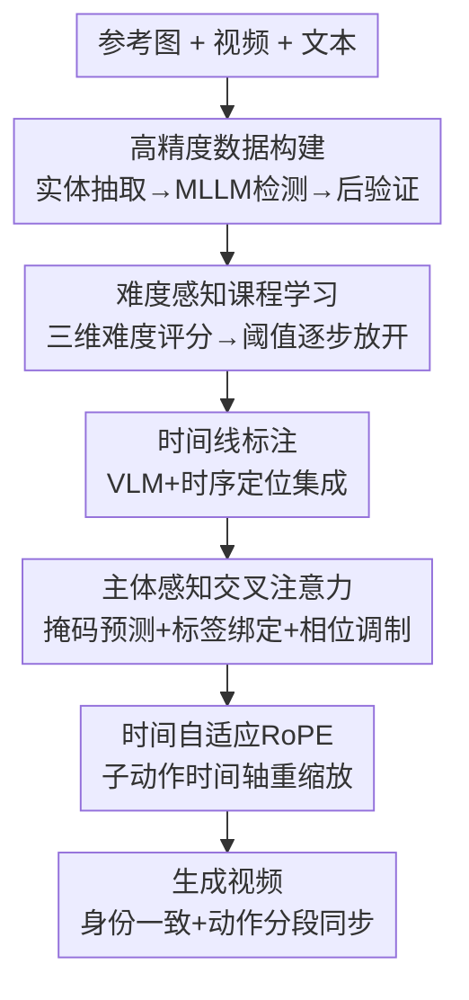

# ReactID: Synchronizing Realistic Actions and Identity in Personalized Video Generation

**会议**: ICLR 2026  
**OpenReview**: [https://openreview.net/forum?id=yn0Wu7NsTa](https://openreview.net/forum?id=yn0Wu7NsTa)  
**代码**: 无  
**领域**: 视频生成 / 扩散模型  
**关键词**: 个性化视频生成, 身份保持, 时间线条件, 课程学习, RoPE

## 一句话总结
ReactID 通过"高精度数据构建 + 难度感知课程学习 + 时间线结构化条件（含主体感知交叉注意力与时间自适应 RoPE）"三管齐下，在个性化视频生成中同时把主体身份一致性和动作真实性做上去，缓解了二者长期存在的此消彼长。

## 研究背景与动机
**领域现状**：个性化视频生成（personalized / subject-to-video）要让指定主体（某个人、某个物体）在视频里做出期望的动作，同时跨帧保持其身份。当前主流方案大多基于扩散 Transformer（DiT），通过交叉注意力或 adapter 把参考图的身份信息注入生成过程。

**现有痛点**：这些方法始终卡在一个"身份一致性 vs 动作真实性"的天平上——为了把身份贴牢，模型容易退化成"复制粘贴"（copy-paste），主体像贴图一样僵在画面里，动作变得死板甚至重复堆叠；反过来强调动作动态，又会让主体长相漂移、出现伪影。

**核心矛盾**：作者把这种失衡拆成三个相互纠缠的根因。其一是**主体-视频对齐不准**——传统标注管线产出的主体框残缺、错位、身份关联错误，模型学到的身份表征本身就不可靠。其二是**训练不稳定**——不同样本难度差异大：大而清晰的"易样本"诱导模型走 copy-paste 捷径，小而多变的"难样本"虽然逼模型动用预训练的运动先验、却拖慢收敛；无差别混训导致收敛模式紊乱。其三是**动作建模太粗**——只有一整段 monolithic 文本提示、缺乏细粒度时间标注，模型自然偏向监督更明确的身份特征，把运动模式晾在一边，于是动作僵硬。

**本文目标**：从数据、训练、动作建模三个层面协同改造，让身份和动作"同步"做好，而不是顾此失彼。

**切入角度**：与其在网络结构上做单点 trick，不如把整条管线的三处瓶颈逐一对症修。

**核心 idea**：用"高精度主体标注 + 由易到难的课程 + 带时间戳的结构化时间线条件"替换"噪声标注 + 无差别混训 + 单段文本"，从而把身份和细粒度动作同时锚定到正确的主体上。

## 方法详解

### 整体框架
ReactID 不是单一模块，而是一套覆盖"数据—训练—建模"的协同框架，底座为 Wan2.1-T2V-1.3B。给定一张或多张参考图与一段（或多段）描述，它要生成主体身份保真、动作自然、且能按时间线分段执行多动作的视频。整体可以这样转：先用一条高精度管线构建 ReactID-Data，把每个主体准确地"框-分割-命名"出来；训练时按样本难度排序，用由易到难的课程逐步放开难样本，既不过拟合易样本也不欠拟合难样本；建模时把单段文本升级成"带时间戳的子动作时间线"，并在 DiT block 里插入一个**主体同步模块**，内含主体感知交叉注意力（把子动作绑定到正确主体）和时间自适应 RoPE（让注意力对不同动作时长保持不变）。推理时若只给单段自然语言，则用 LLM 当"时间规划器"自动展开成时间线。

### 关键设计

**1. ReactID-Data：高精度主体标注管线，根治"主体-视频对齐不准"**

针对第一个根因——传统标注框残缺、身份关联错——作者构建了一条自动化高精度管线。它从 HD-VG-130M、OpenHumanVid 等公开集起 2000 万视频的池子，先经场景切分、转码、去字幕、质量过滤、主体中心 caption 等预处理。关键在**实体抽取的精细化**：直接用 NER（如 SpaCy）配预设词表会得到粗粒度实体，两个不同的人都被笼统标成"a person"，无法区分实例。ReactID 先用 1200 词的自建词表（caption 名词 + ImageNet/COCO/LVIS 等图像数据集标签）把实体分成"生命体/非生命体"两类：非生命体直接保留；生命体则交给视觉语言模型逐一生成细粒度描述标签，得到"穿红衣的人""坐在长椅上的人"这种能区分实例的标签。随后用 MLLM 检测器 Florence-2 把实体词定位成边界框，并在 SigLIP 特征空间用跨模态距离做后验证，再用 SAM 出分割掩码；对"human"实体还额外用 InsightFace 抽人脸框与掩码以支持人脸身份保持。这条"实体抽取 → MLLM 检测 → 后验证"的链路保证了主体-视频对应关系可靠，从源头喂给模型干净的监督。

**2. 难度感知课程学习：用三维难度评分把"易样本捷径"和"难样本不收敛"一起治住**

第二个根因是样本难度参差导致训练不稳。作者把"难度"量化成三个线索的加权和 $D_{overall} = \lambda_{sub}D_{sub} + \lambda_{app}D_{app} + \lambda_{sam}D_{sam}$。**主体尺寸难度** $D_{sub}$ 用主体掩码占整段视频像素的比例反向定义：主体越小占比越低、$D_{sub}$ 越接近 1，即 $D_{sub} = 1 - (NHW)^{-1}\sum_n\sum_i\sum_j \mathbb{1}\{M_n(i,j)=1\}$。**外观相似度难度** $D_{app}$ 用参考图与视频中各主体区域特征的平均余弦相似度反向定义（一般主体用 DINOv2、人脸用 ArcFace），相似度越低难度越高。**采样策略难度** $D_{sam}$ 区分 intra-clip（参考图直接取自同段视频，光照背景一致，简单，$D_{sam}=0$）与 inter-clip（参考图来自不同片段，变化大，难，$D_{sam}=1$）。训练时设难度阈值 $\tau$，只用 $D_{overall}\le\tau$ 的样本；按难度分位数把训练步按 4:2:1:1 切成四阶段，每过一阶段 $\tau$ 跳到下一个分位数。这样由易到难逐步引入难样本，既稳收敛又避免易样本上的 copy-paste 过拟合。论文里 $\tau$ 从 0.53 逐步升到 0.67、1.44、1.84，inter-clip 参考比例同步从 0% 调到 11%、33%。

**3. 时间线结构化条件与主体感知交叉注意力：把子动作精确绑定到对的主体**

第三个根因是单段文本无法表达细粒度时间动态。ReactID 先为采样出的 120 万 subject-to-video 对构建**时间线标注**——用 Qwen2.5-VL-72B 做初始事件时序定位，再用 UniMD、TFVTG 两个视觉时序定位模型各给一套时间戳，最后用 InternVideo2 当打分模型从三套标注里选最优。每个子动作带精确起止时间和文字描述。把这些注入扩散模型靠的是 DiT block 里的**主体同步模块**。其中**主体感知交叉注意力**先用基于注意力的掩码预测器估每个主体的掩码（取参考图 token 与视频 token 的交叉注意力图喂 MLP，用真值掩码的 focal loss 监督，并平均最后 5 个 DiT block 的结果提升精度），再做**标签绑定**：给落在某主体掩码内的视频 token 与对应的时间线提示分配同一个数值标签（如"红衣女" token 配标签 α、"紫衣女"配 β、背景配区别标签），并用标签相关的相位调制 $\tilde{q}_i = q_i e^{l_i\theta_0},\ \tilde{k}_j = k_j e^{l_j\theta_0}$，让注意力偏置 $\tilde{q}_i^\top\tilde{k}_j$ 在标签 $l_i=l_j$ 时取最大。于是同标签的主体 token 与子动作提示牢牢对齐、异标签软分离，保证每段子动作的文本语义被正确路由到对应主体，而不会张冠李戴。

**4. 时间自适应 RoPE：让注意力偏置对子动作时长不变，消除转场错位**

仅有空间层面的主体绑定还不够，时间维度上也得让子动作和主体对得上。原始时间 RoPE 用绝对帧号构造位置嵌入，隐含假设所有子动作等长。可现实里子动作时长差异大：某帧 $f$ 明明属于较长的前一个子动作，但它到后续短子动作中点的距离反而更近，于是 vanilla RoPE 会让它对短子动作分配过多注意力偏置，造成转场边界附近的时序错位和动作突变。作者提出**时间自适应 RoPE**，在构造时间 RoPE 时把时间轴按子动作重缩放，使其对时长不变：对落在第 $n$ 个区间 $[f^{start}_n, f^{end}_n]$ 的帧号 $f$，重缩放后的索引为 $f' = (f - f^{start}_n)/(f^{end}_n - f^{start}_n)\cdot T + (n-1)\cdot T$，其中 $T$ 是把每个子动作拉到统一时长的预设常数。这样每个子动作都被归一到等长区间，注意力偏置回到合理分配，转场更平滑。

### 损失函数 / 训练策略
基座 Wan2.1-T2V-1.3B，训练 10k 步、全局 batch 32，AdamW、学习率 $1\times10^{-5}$、500 步 warmup，8×A100 共 1464 GPU 小时（单步约 65.8 秒）。主体掩码预测用 focal loss 对真值掩码监督；难度权重 $\lambda_{sub},\lambda_{app},\lambda_{sam}$ 经验设为 0.5、1、1。推理用 50 步去噪、CFG=5.0，生成 5 秒视频约 316 秒；单段提示场景下用 LLM 把提示展开成时间线。

## 实验关键数据

### 主实验
在 OpenS2V-Eval（180 对）与自建 ReactID-Eval-SEQ（120 对，含 40 人 + 20 动物的多动作序列）上评测，指标含 Aesthetics、Motion Smoothness、Motion Amplitude、FaceSim、GmeScore、NexusScore、NaturalScore，归一聚合为 TotalScore。

| 数据集 / 场景 | 指标 | ReactID | 最强基线 | 提升 |
|--------|------|------|----------|------|
| OpenS2V-Eval 单主体域 | TotalScore | 56.04% | Phantom-1.3B 54.50% | +1.54% |
| OpenS2V-Eval 人物域 | TotalScore | 62.17% | Phantom-1.3B 60.00% | +2.17% |
| ReactID-Eval-SEQ（多动作序列） | TotalScore | 54.42% | Phantom-1.3B 51.40% | +3.02% |

ReactID 的 Motion Amplitude 显著高于各基线（如人物域 40.79% vs Phantom 14.09%），动作幅度更大更自然；FaceSim 略低于 Phantom，作者归因于更大运动幅度带来的运动模糊，是身份-动作权衡的合理代价。用户研究（25 人、50 对样本、5 分制）中 ReactID 在主体一致性 3.90、动作自然度 4.00、文本对齐 3.47、整体质量 3.42 上全面领先。

### 消融实验

| 配置 | TotalScore | 说明 |
|------|---------|------|
| Full Curriculum | 54.42% | 完整课程学习 |
| w/o $D_{sub}$ | 53.35% | 去主体尺寸线索 |
| w/o $D_{app}$ | 53.76% | 去外观相似度线索 |
| w/o $D_{sam}$ | 52.68% | 去采样策略线索（掉点最多） |
| Random Expansion | 51.39% | 无难度引导地扩样本 |
| Full Data Training | 51.54% | 直接全量训练 |

主体感知交叉注意力上，Uniform 标签策略反而优于 Adaptive（TotalScore 相关指标全面更好），作者推测自适应标签的注意区域与生成所需区域错位，统一标签更鲁棒；标签值取更分散的 $(\alpha,\beta)=(2,20)$ 优于 $(0,1)$。时间自适应 RoPE 上 TARoPE（$T=2$）在 CLIP-T 0.247、TVA 2.71、TC 2.38 上优于 vanilla RoPE 与纯 attention mask。标注质量对比中 ReactID 时间线 F1 0.78（优于 Qwen 0.71、TFVTG 0.57），掩码 P.Rate 54%（优于 SAM 31%、LISA 15%）。

### 关键发现
- 三个难度线索里去掉**采样策略 $D_{sam}$** 掉点最多（54.42%→52.68%），说明 intra/inter-clip 的难度调度对避免 copy-paste、逼模型学真本事最关键。
- 无难度引导的 Random Expansion（51.39%）甚至略低于 Full Data Training（51.54%），印证课程学习的价值不在"用更多数据"而在"按正确难度顺序喂"。
- 主体标签"统一 + 取分散值"反直觉地优于自适应标签，提示在身份保持上鲁棒的硬绑定比精细但可能错位的软加权更可靠。

## 亮点与洞察
- **把一个建模难题拆成数据/训练/建模三处独立可修的瓶颈**：身份-动作权衡这种"系统病"很难靠单模块治好，ReactID 的诊断式拆解是可复用的工程方法论。
- **难度评分三维量化 + 分位数课程调度**：把"哪些样本诱发 copy-paste"具体到尺寸/相似度/采样三个可计算的量，比拍脑袋设课程更有依据，可迁移到其他个性化生成任务。
- **相位调制做标签绑定**：用 $e^{l\theta_0}$ 的相位让同标签 query-key 内积最大，是把"路由"嵌进注意力的轻量手段，避免显式 mask 硬切，对多主体场景尤其优雅。
- **时间自适应 RoPE 的"等长重缩放"**：用一个简单的归一化公式把不等长子动作拉齐，直击 vanilla RoPE 在转场边界的注意力错配，是即插即用的时序对齐 trick。

## 局限与展望
- FaceSim 略逊于 copy-paste 倾向更强的 Phantom，说明大幅度运动与人脸保真之间的权衡尚未被完全消除，运动模糊仍会拖累身份相似度。
- 整条管线依赖多个外部大模型（Florence-2、SAM、SigLIP、Qwen2.5-VL-72B、UniMD、TFVTG、InterVideo2），数据构建成本高，标注质量受这些模型上限约束。
- 基座仅为 1.3B 的 Wan2.1，生成 5 秒视频需 316 秒，分辨率/时长扩展性与更大基座上的表现待验证。
- 时间线规划在单提示推理时交给 LLM，规划质量与时间戳合理性会直接影响最终动作同步，论文未深入分析规划失败的传播效应。

## 相关工作与启发
- **vs Phantom / VACE / Concat-ID**：这些 DiT 基线靠交叉注意力或拼接注入身份，在多动作序列与运动幅度上偏弱、易 copy-paste；ReactID 用时间线条件 + 主体同步模块把动作和主体显式对齐，多动作序列 TotalScore 高 3.02%。
- **vs DreamVideo / CustomCrafter（UNet 时代）**：早期工作解耦主体与运动学习或微调自注意力做免调定制，但多限于单主体、需测试时调优；ReactID 是 tuning-free 的多主体、多动作框架。
- **vs ReVersion / DreamRelation（关系定制）**：它们把定制从外观扩到关系/交互，ReactID 则把重心放在"细粒度动作的时间线精确控制 + 身份保真"的协同。

## 评分
- 新颖性: ⭐⭐⭐⭐ 时间线条件 + 主体同步模块（相位调制 + 时间自适应 RoPE）是有针对性的新组合
- 实验充分度: ⭐⭐⭐⭐ 三套评测集 + 多维消融 + 用户研究 + 标注质量对比，较扎实
- 写作质量: ⭐⭐⭐⭐ 三根因到三对策的逻辑清晰，公式与图配合到位
- 价值: ⭐⭐⭐⭐ 数据集 + 框架双重贡献，对个性化视频生成社区有较强实用价值

<!-- RELATED:START -->

## 相关论文

- [\[CVPR 2026\] Lynx: Towards High-Fidelity Personalized Video Generation](../../CVPR2026/video_generation/lynx_towards_high-fidelity_personalized_video_generation.md)
- [\[ICLR 2026\] LumosX: Relate Any Identities with Their Attributes for Personalized Video Generation](lumosx_relate_any_identities_with_their_attributes_for_personalized_video_genera.md)
- [\[CVPR 2026\] Stand-In: A Lightweight and Plug-and-Play Identity Control for Video Generation](../../CVPR2026/video_generation/stand-in_a_lightweight_and_plug-and-play_identity_control_for_video_generation.md)
- [\[ICML 2026\] OLAF-World: Orienting Latent Actions for Video World Modeling](../../ICML2026/video_generation/olaf-world_orienting_latent_actions_for_video_world_modeling.md)
- [\[CVPR 2026\] ConsID-Gen: View-Consistent and Identity-Preserving Image-to-Video Generation](../../CVPR2026/video_generation/consid-gen_view-consistent_and_identity-preserving_image-to-video_generation.md)

<!-- RELATED:END -->
