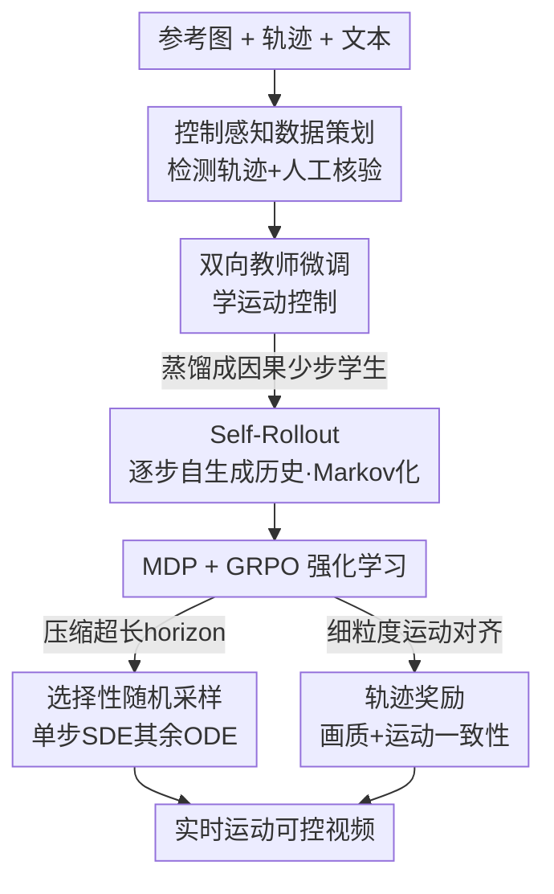

# Real-Time Motion-Controllable Autoregressive Video Diffusion

**会议**: ICLR 2026  
**OpenReview**: [https://openreview.net/forum?id=4Q55RwYte9](https://openreview.net/forum?id=4Q55RwYte9)  
**代码**: 项目页 https://kesenzhao.github.io/AR-Drag.github.io/  
**领域**: 视频生成 / 扩散模型  
**关键词**: 自回归视频扩散, 运动可控生成, 实时生成, 强化学习, GRPO

## 一句话总结
本文提出 AR-Drag——首个用强化学习增强的少步自回归图生视频（I2V）扩散模型，通过 Self-Rollout 保持马尔可夫性、用选择性随机采样压缩超长决策链，再配上基于轨迹的奖励把 GRPO 引入视频生成，在仅 1.3B 参数下实现了 0.44s 首帧延迟、且画质与运动可控性都超过现有双向运动可控模型。

## 研究背景与动机

**领域现状**：当前主流的可控视频扩散模型（VDM）几乎清一色基于**双向** DiT——所有帧一起去噪，未来帧的信息可以反过来影响过去帧。Tora、DragAnything、DragNUWA、MagicMotion 这些运动可控方法都是这种设计。

**现有痛点**：双向设计天然不适合实时交互。因为要一次性联合生成整段视频，所以必须等**所有**控制信号都给定后才能开始去噪，导致延迟极高（Tora 要 176s、5B 的 MagicMotion 甚至 1426s），更没法在视频展开过程中随时调整随时间演化的运动指令。自回归（AR）VDM 逐帧生成、天然契合实时控制，但现有 AR VDM 大多只做文生视频（T2V），要么只支持位姿、相机这种简单控制信号，要么在更难的 I2V 场景里因为误差累积而画质退化、出现运动伪影——尤其是少步模型。

**核心矛盾**：要把强化学习（RL）这种"试错探索、能泛化到训练分布之外"的能力引入 AR 视频生成（用来对抗误差累积、扩大控制动作空间），却卡在三道坎上：(1) 标准 AR VDM 训练时条件于**真实**历史帧（teacher forcing），推理时却条件于**自己生成**的帧，这种 train–test mismatch 破坏了 RL 所需的马尔可夫性（MDP）；(2) 视频生成的决策链长度 = 去噪步数 × 帧数，是个**超长 horizon**，逐步全程注入随机性会让回报方差爆炸；(3) 缺少针对可控视频生成、能细粒度评估运动对齐的奖励模型。

**本文目标 / 核心 idea**：构建一个少步、实时、运动可控的 AR I2V 模型，并第一次把 GRPO 成功用上去。切入角度是——既然 GRPO 要 MDP + 随机 rollout，那就分别用 **Self-Rollout**（训练时严格按推理那样逐步自生成历史，"Markov 化"训练）和 **selective stochasticity**（只在随机抽中的一个去噪步用 SDE、其余步走确定性 ODE）补齐这两个前提，再加一个**基于轨迹的奖励**收尾。

## 方法详解

### 整体框架

AR-Drag 分两步走。**Step 1** 先造一个具备基础运动控制能力的实时 AR 基座模型：先策划带控制信号的视频数据，在 Wan2.1-1.3B-I2V 上微调一个**双向教师**学会运动控制，再把它蒸馏成**少步因果学生**（双向注意力换成因果注意力，用 DMD + 对抗损失，每帧只需 N（实现里 N=3）步去噪即可实时推理）；蒸馏过程中引入 **Self-Rollout**，让训练严格对齐 AR 推理、从而"Markov 化"训练，为 Step 2 的 RL 铺路。**Step 2** 把 AR 视频生成形式化成 MDP，用 GRPO 优化：Self-Rollout 提供马尔可夫性、ODE→SDE 转换提供随机性，二者合起来满足 GRPO 的前提；再用 **selective stochastic sampling** 把超长 horizon 的方差压下去，配合一个评估画质 + 运动对齐的复合奖励来优化策略。

控制信号方面，第 $m$ 帧用三路信号 $c_m$：轨迹嵌入 $c^{traj}_m$（把原始坐标热力图过 VAE 编码器）、文本嵌入 $c^{text}$（正负 prompt，全帧共享）、以及仅在首帧（$m{=}0$）注入的参考图嵌入 $c^{ref}$（VAE + CLIP 编码），其余帧用高斯噪声占位。

### 关键设计

**1. Self-Rollout：用逐步自生成历史把 AR 训练"Markov 化"**

这一步直击痛点 (1)：标准 AR VDM 训练用 teacher forcing，每步都条件于真实过去帧，推理时却条件于模型自己的输出，既造成曝光偏差又破坏 RL 需要的马尔可夫性。Self-Rollout 维护一个 KV memory cache 存放此前已去噪的帧作为因果上下文，训练时让所有帧**从纯噪声逐帧顺序去噪**。记第 $m$ 帧第 $n$ 个去噪步的状态为 $x_{m,n}$：对每帧随机采一个去噪步 $n$，从 $x_{m,0}$ 逐步去噪到 $x_{m,n}$，在此处算 DMD 损失（Eq. 5）和对抗损失；然后**继续逐步**从 $x_{m,n}$ 去噪到 $x_{m,N}$，用生成的干净帧 $x_{m,N}$ 更新 KV cache。这样后续帧条件的是自生成的 KV cache 而非真实历史。和 Self-Forcing 的关键区别在于：Self-Forcing 更新 KV cache 时把 $x_{m,n}\!\to\!x_{m,N}$ 的去噪轨迹**塌缩成单步**，因而仍偏离推理、仍违反 MDP；Self-Rollout 坚持完整逐步 ancestral sampling、和推理动态一模一样，从而真正消除 train–inference 分布失配，提供干净的序列决策过程供 GRPO 直接优化。消融里去掉 Self-Rollout 后 FID 从 28.98 暴涨到 38.13、FVD 187→354，正说明它对维持画质和马尔可夫性不可或缺。

**2. 视频生成的 MDP 形式化 + GRPO**

要用 GRPO，先得把 AR 视频去噪写成 MDP。状态 $s_{m,n}\triangleq(c_m, t_n, X_{m,n})$，其中视频快照 $X_{m,n}$ 由"已生成的干净帧 $x_{<m,N}$ + 正在去噪的 $x_{m,n}$ + 尚未处理的噪声帧 $x_{>m,0}$"三部分拼成；动作 $a_{m,n}\triangleq x_{m,n+1}$ 即下一去噪状态，由 VDM 策略 $p_\theta$ 采样（随机性来自 ODE→SDE）。转移分两类：帧内确定性转移、帧去噪完成（$n{=}N$）时跳到下一帧初始状态。奖励**只在每帧去噪完成时给**：$R(x_{m,N},c_m)=\mathbb{1}[n{=}N]\cdot(R_{quality}+R_{motion})$。然后把 GRPO 推广到 AR 视频：采一组 $G$ 个视频及其轨迹，用组内奖励归一化算优势 $\hat A^{(i)}_{m,n}=\frac{R-\text{mean}}{\text{std}}$，再用带重要性比裁剪 + KL 正则的目标 $L_{GRPO}$ 优化。这套形式化是 RL 能落到逐帧逐步去噪上的骨架。

**3. 选择性随机采样：用单步 SDE 把超长 horizon 的方差压住**

直击痛点 (2)：GRPO 需要随机性来估优势、做探索，随机性靠 ODE→SDE 转换引入（Eq. 4）。但 AR 视频的马尔可夫链极长（步数 × 帧数），如果**每个**去噪步都做 SDE 采样，轨迹回报方差会爆炸，需要的 rollout 数 $G$ 飙升、成本不可承受。解法很克制：每帧只**随机选一个**去噪步 $\tilde n$ 走 SDE，其余步全部走确定性 ODE solver。这样既注入了足够的随机性供 RL 探索，又把有效 horizon 缩短 5–20 倍、保持计算高效，第一次让 GRPO 在自回归视频扩散上稳定可训。

**4. 基于轨迹的复合奖励：把"画得真"和"动得准"一起拉满**

直击痛点 (3)：缺少面向可控视频的奖励。本文设计复合奖励 $R=R_{quality}+R_{motion}$。画质项用 LAION 美学质量预测器 $f_{AQ}$（给每帧打 1–5 分美学分）：$R_{quality}(x_{m,N})=f_{AQ}(x_{m,N})$。运动项先用 Co-Tracker 从生成帧估出物体轨迹 $\hat c^{traj}_m$，再和真实轨迹比对：$R_{motion}=\lambda\max(0,\,\alpha-\|\hat c^{traj}_m-c^{traj}_m\|_2^2)$，其中 $\alpha$ 是偏置、$\lambda$ 是缩放系数。用基于检测轨迹的 hinge 式奖励，能对复杂运动信号做细粒度约束，正是 MagicMotion 这种没用 RL 的方法在精细控制上吃亏的地方。

### 损失函数 / 训练策略

Step 1 用扩展了控制信号的流匹配目标 $L_{FM}(\theta)=\mathbb{E}_{t,x_t}[\|v_\theta(c,t,x_t)-v\|_2^2]$ 微调教师，蒸馏学生时叠加 DMD 损失（最小化 $\mathbb{E}_t[\text{KL}(p_{\theta,t}\|p_{data,t})]$）与对抗损失。Step 2 用 $L_{GRPO}$ 做 RL 后训练。实现上以 Wan2.1-1.3B-I2V 为基座、3 步逐帧去噪，KV cache 固定存 7 帧（超出则淘汰最旧帧），AdamW、lr=1e-5、8×H20；不用 LoRA（怕长尾性能退化）。评测自建 206 段、涵盖多样轨迹与场景的 benchmark。

## 实验关键数据

### 主实验

| 方法 | 延迟(s)↓ | FID↓ | FVD↓ | 美学↑ | 运动平滑↑ | 运动一致↑ |
|------|---------|------|------|-------|-----------|-----------|
| DragNUWA | 94.26 | 36.31 | 376.39 | 3.30 | 0.9759 | 3.71 |
| DragAnything | 68.76 | 38.13 | 367.74 | 3.22 | 0.9811 | 3.63 |
| Tora | 176.51 | 32.84 | 283.43 | 3.86 | 0.9855 | 3.97 |
| MagicMotion (5B) | 1426.37 | 30.04 | 230.53 | 4.01 | 0.9871 | 3.95 |
| Self-Forcing | 0.95 | 34.47 | 315.87 | 3.70 | 0.9920 | 4.06 |
| **AR-Drag (1.3B)** | **0.44** | **28.98** | **187.49** | **4.07** | **0.9948** | **4.37** |

AR-Drag 在**全部六项指标上都最好**：延迟 0.44s 不到 Tora 的 1%、是 Self-Forcing（0.95s，它一次去噪 3 帧）的不到一半；FID/FVD 最低、美学最高，运动平滑与一致性也最优。尤其它以 1.3B 参数反超 5B 的 MagicMotion，原因正是后者没用 RL、细粒度控制能力受限。

### 消融实验

| 配置 | 延迟(s)↓ | FID↓ | FVD↓ | 美学↑ | 运动平滑↑ | 运动一致↑ |
|------|---------|------|------|-------|-----------|-----------|
| **AR-Drag (完整)** | 0.44 | 28.98 | 187.49 | 4.07 | 0.9948 | 4.37 |
| w/o RL（基座） | 0.44 | 31.65 | 210.35 | 3.92 | 0.9926 | 4.12 |
| Initial model（Wan2.1 原始） | 45.72 | 35.94 | 303.16 | 3.84 | 0.9915 | 3.22 |
| Teacher model（双向多步） | 45.64 | 29.38 | 151.46 | 4.15 | 0.9941 | 4.36 |
| w/o Self-Rollout | 0.44 | 38.13 | 353.75 | 3.38 | 0.9904 | 4.02 |

### 关键发现
- **Self-Rollout 是最关键的一环**：去掉后 FID 28.98→38.13、FVD 187→354，画质严重退化、出现明显伪影，因为破坏了马尔可夫性、放大了 train–test 失配。
- **RL 后训练实打实涨点**：w/o RL 时 FID 28.98→31.65、运动一致 4.37→4.12；RL 鼓励探索，能补出参考图里缺失的细节（如脚部）、还缓解了 w/o RL 那种色彩过饱和。
- **以小搏大**：AR-Drag（学生）在 FID、美学、运动平滑/一致上追平甚至超过双向多步**教师**（FID 28.98 vs 29.38），但延迟从 45.64s 砍到 0.44s——证明 RL 让少步因果学生突破了 DMD 蒸馏的上界。

## 亮点与洞察
- **把 GRPO 第一次搬进自回归视频生成**：核心洞察是"GRPO 落不了地不是因为算法，而是 AR VDM 既不满足 MDP 又 horizon 太长"，于是对症下两味药——Self-Rollout 补马尔可夫性、selective stochasticity 压方差，思路清晰且可迁移到其他长链序列生成的 RL。
- **Self-Rollout vs Self-Forcing 的"一步之差"很巧妙**：同样用自生成历史，区别只在 KV cache 更新时是"逐步走完"还是"塌缩成一步"，但这一步决定了能否严格符合推理动态、能否接 RL——是个小而关键的修正。
- **选择性随机采样**这个 trick 通用：凡是"长决策链 + 需要随机探索"的扩散式 RL，都可以借鉴"只在一步注入 SDE 随机性、其余确定性"来把方差和成本压下去。

## 局限与展望
- 奖励里画质用通用美学预测器、运动用 Co-Tracker 估轨迹，奖励质量受这些现成模型上界制约；美学分对"好不好看"的刻画偏粗。
- 自建 206 段 benchmark 规模有限，运动一致性指标本身又复用了自家奖励模型，存在一定自指风险。
- KV cache 只存 7 帧，超长视频的远距离一致性、以及更密集/多物体并发轨迹下的表现，文中未充分压力测试。
- 仍是 1.3B 小模型，画质上界相对受限；放大到更大基座后这套 RL 配方是否同样稳定有待验证。

## 相关工作与启发
- **vs Self-Forcing**：两者都用自生成上下文对抗曝光偏差，但 Self-Forcing 把去噪轨迹塌缩成单步更新 KV cache，仍违反 MDP；AR-Drag 的 Self-Rollout 逐步走完、严格符合链式法则，因而能接 GRPO，画质和控制都更好（FID 28.98 vs 34.47，延迟 0.44 vs 0.95）。
- **vs Tora / MagicMotion（双向）**：它们靠双向 DiT + 轨迹条件，画质不差但延迟动辄上百到上千秒、无法实时调整；AR-Drag 用因果少步 + RL，在延迟降两三个数量级的同时反超其运动可控性。
- **vs DanceGRPO / FlowGRPO**：这两者把 GRPO 用在双向 flow-matching 的文生图上；本文把它推广到更难的 AR I2V 视频设定，并补上了视频特有的 MDP 形式化与超长 horizon 难题的解法。

## 评分
- 新颖性: ⭐⭐⭐⭐⭐ 首个 RL 增强的少步 AR I2V 运动可控扩散，Self-Rollout + 选择性随机采样把 GRPO 首次落到视频生成。
- 实验充分度: ⭐⭐⭐⭐ 主表六指标全胜 + 系统消融，但 benchmark 偏小、运动指标部分自指。
- 写作质量: ⭐⭐⭐⭐ MDP 形式化与两步流程交代清楚，公式完整。
- 价值: ⭐⭐⭐⭐⭐ 0.44s 实时 + 1.3B 小模型反超 5B，对交互式可控视频生成实用价值高。

<!-- RELATED:START -->

## 相关论文

- [\[ICLR 2026\] MotionStream: Real-Time Video Generation with Interactive Motion Controls](motionstream_real-time_video_generation_with_interactive_motion_controls.md)
- [\[ICLR 2026\] LongLive: Real-time Interactive Long Video Generation](longlive_real-time_interactive_long_video_generation.md)
- [\[CVPR 2025\] Teller: Real-Time Streaming Audio-Driven Portrait Animation with Autoregressive Motion Generation](../../CVPR2025/video_generation/teller_real-time_streaming_audio-driven_portrait_animation_with_autoregressive_m.md)
- [\[NeurIPS 2025\] Autoregressive Adversarial Post-Training for Real-Time Interactive Video Generation](../../NeurIPS2025/video_generation/autoregressive_adversarial_posttraining_for_realtime_interac.md)
- [\[CVPR 2026\] U-Mind: A Unified Framework for Real-Time Multimodal Interaction with Audiovisual Generation](../../CVPR2026/video_generation/u-mind_a_unified_framework_for_real-time_multimodal_interaction_with_audiovisual.md)

<!-- RELATED:END -->
