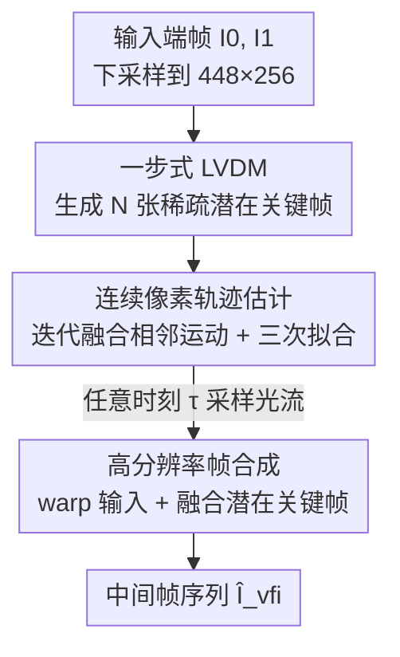

# Realtime Video Frame Interpolation Using One-Step Diffusion Sampling

**会议**: ICLR 2026  
**OpenReview**: [https://openreview.net/forum?id=OiWyf1BNtC](https://openreview.net/forum?id=OiWyf1BNtC)  
**代码**: 见项目页（论文中提及，未给出明确仓库链接）  
**领域**: 视频生成 / 扩散模型 / 视频插帧  
**关键词**: 视频插帧, 潜在视频扩散, 一步采样, 连续像素轨迹, 实时

## 一句话总结
RDVFI 把视频插帧里"用扩散模型直接画中间帧"改成"用一步扩散只生成几张稀疏潜在关键帧、再由这些关键帧拟合出高阶连续像素轨迹去 warp 输入像素"，从而在 1024×576 上跑到 17 FPS 的实时速度（比 SOTA 快约 44×），同时把大运动场景下的鬼影/形变压到最低。

## 研究背景与动机
**领域现状**：视频插帧（VFI）要在两张给定端帧之间补出任意时刻的中间帧。主流做法是估计中间帧到输入帧的光流，再把输入像素 warp 过去。运动建模上，早期用线性/二次等低阶刚性先验，后来转向数据驱动的非参数光流估计；最近一批 SOTA（GI、FCVG、Wan）干脆把 VFI 重新表述成基于潜在视频扩散模型（LVDM）的条件生成问题，直接生成中间帧像素。

**现有痛点**：基于 LVDM 直接生成中间帧的方法有两个硬伤。其一是"像素保真偏置"——它们的训练目标是逐像素重建，优化的是局部纹理逼近而非全局运动一致性，于是在剧烈、非刚性运动下产生鬼影、物体形变这类结构性 artifact。其二是计算太重——为了补出高频细节，扩散需要多步迭代采样，开销巨大；而现有蒸馏加速一旦减少采样步数，反而会在复杂运动上放大这些结构性 artifact。

**核心矛盾**：让扩散模型同时负责"运动"和"纹理"是矛盾的。纹理需要密集多步采样才能画清楚，但插帧任务里中间帧的外观其实已经几乎都摆在两张输入帧里了——真正缺的是"怎么把输入像素搬到中间时刻"的运动信息。把这两件事捆在一个生成目标里，既拖慢速度又让运动不准。

**本文目标**：把"运动生成"和"高分辨率渲染"解耦，让扩散只管运动、warp 只管像素，既要准又要快到实时。

**切入角度**：作者观察到——如果让 LVDM 只生成少量稀疏关键帧、并用它们去确定一条高阶连续像素轨迹的系数，那么扩散建模的对象就从"高频纹理"退化成"低频运动结构"，而运动结构对采样步数远不敏感，一步采样就够。

**核心 idea**：用一步式 LVDM 生成稀疏潜在关键帧 → 关键帧确定高阶连续像素轨迹 → 轨迹采样出光流 warp 输入像素，从而把扩散的负担从"画帧"变成"定运动"。

## 方法详解

### 整体框架
给定两张端帧 $I_0, I_1$，RDVFI 要合成任意时刻 $\tau_j \in (0,1)$ 的中间帧序列 $\{\hat I_{\tau_j}\}_{j=1}^{L}$。整条管线分两个阶段：**Phase 1 在固定的较低分辨率（如 448×256）上估计连续像素轨迹**，**Phase 2 在高分辨率（如 1024×576）上做帧合成**。关键的省时点在于：扩散和轨迹估计都跑在低分辨率、少帧、低频运动上，只有最后 warp + 融合这步才上到全分辨率，而这步是轻量网络。

具体地，Phase 1 先把输入下采样，用一步式 LVDM 生成 $N$ 张稀疏潜在关键帧 $\{\hat z_{k_i}\}_{i=1}^{N}$；这些关键帧当作时间锚点，喂给连续像素轨迹估计器，迭代融合出从输入帧到各关键帧的光流，再用三次卷积插值拟合成一条对任意时刻都可采样的连续轨迹。Phase 2 在每个插值时刻 $\tau_j$ 上采样这条轨迹得到稠密光流，warp 输入帧得到双向 warp 帧，再融合潜在关键帧补上光流表达不了的外观变化（动态纹理、光照、遮挡），输出高分辨率中间帧。

### 关键设计

**1. 一步式潜在视频扩散：只生成稀疏关键帧、只建模运动**

这一设计针对"扩散直接画帧又慢又在大运动上崩"的痛点。RDVFI 不让 LVDM 像 Wan/FCVG 那样多步采样出所有中间帧，而是只用**一步采样**生成少数几张（实验中 $N=7$）潜在关键帧 $\hat z_{k_i}$。底层 LVDM 沿用标准 v-prediction 训练：把干净潜帧加噪成 $z_t = \alpha_t z + \sigma_t \epsilon_t$，去噪网络 $F_\theta(z_t; t, z_0, z_1)$ 以两张输入潜帧为条件预测速度 $v_t = \alpha_t \epsilon_t - \sigma_t z$，目标为 $L_\theta(t) = \lVert F_\theta(z_t; t, z_0, z_1) - v_t \rVert$。之所以一步就够，是因为这些关键帧只用来"定运动"而非"补细节"：插帧任务里中间帧的外观早已蕴含在两张输入里，扩散只需提供"像素怎么从输入挪到中间时刻"的结构信息，而结构信息缺少高频成分、对采样步数不敏感。又因为关键帧数 $N$ 远小于插值帧数 $L$、且生成的运动可任意缩放分辨率，LVDM 可固定在一个较小的时空分辨率上采样，既进一步提速也让扩散训练更稳。

**2. 高阶连续像素轨迹：迭代融合小运动拟合大运动**

这一设计针对低阶/非参数运动建模"抓不住大而非线性运动"的痛点。RDVFI 把像素轨迹定义为映射 $\{f_{0\to\tau}, f_{1\to\tau}\}$，把输入像素偏移索引到任意 $\tau$。为了在大位移下保持精度，它不直接回归长程光流，而是把端帧间的复杂运动**拆成相邻帧之间又小又好估的分量再迭代融合**：先估相邻关键帧间运动 $f_{k_i\to k_{i+1}} = \varphi_1(\hat z_{k_i}, \hat z_{k_{i+1}})$，再递归融合出输入帧到各关键帧的光流 $f_{0\to k_{i+1}} = \varphi_2(f_{0\to k_i}, f_{k_i\to k_{i+1}}, z_0, \hat z_{k_{i+1}})$，其中 $\varphi_1, \varphi_2$ 是卷积网络，反向轨迹用同一套权重从 $\tau=1$ 往 $\tau=0$ 估。最后用三次卷积（cubic convolution）把这些关键帧光流拟合成对所有插值时刻都可采样的**高阶**连续函数。每次迭代只更新一小段易估的增量偏移，因此比"从头直接回归长程光流"的直接估计基线更能稳健地解大尺度运动——这也是消融里 "Direct Warping"（去掉迭代融合改成逐关键帧从头回归）掉点最多的原因。

**3. 帧合成模块：warp 输入像素再融合关键帧补外观**

这一设计解决"光流只能搬像素、搬不出新出现的外观"的问题。如 Algorithm 1，对每个 $\tau_j$ 先从连续轨迹采样光流 $\{f_{0\to\tau_j}, f_{1\to\tau_j}\}$ warp 出双向中间帧 $\{I_{0\to\tau_j}, I_{1\to\tau_j}\}$；与传统非生成方法直接融合 warp 帧不同，RDVFI 还会找到夹住 $\tau_j$ 的相邻关键帧 $z_{k_i}, z_{k_{i+1}}$，把它们也 warp 到 $\tau_j$ 得到 $\{z_{k_i\to\tau_j}, z_{k_{i+1}\to\tau_j}\}$，最后用网络 $\varphi_s(\cdot)$ 把 warp 帧和 warp 后的潜在关键帧一起融合成带细节的高分辨率中间帧。引入潜在关键帧是为了补上动态纹理、光照变化、遮挡这些纯光流 warp 无法表达的外观变化，让生成在保速度的同时不丢细节。

### 损失函数 / 训练策略
RDVFI 分两阶段训练。**阶段一：运动引导解码（Motion-guided Decoding）**——冻结其余、训练连续像素轨迹估计器把给定潜在关键帧解码成准光流。因缺真值光流，这步用插值帧上的重建损失做无监督学习：$L_{rec}(\hat I_{rec}, I) = w_1 L_{lpips}(I, \hat I_{rec}) + w_2 \lVert I - \hat I_{rec} \rVert_2$，权重 $w_1=0.2, w_2=1$。**阶段二：一步扩散训练**——冻结轨迹估计器与合成网络，只更新 LVDM；为稳定不直接从纯噪声学，而是随机采 $t \in (0,T)$ 并随训练步线性抬高采样下界。总目标在潜空间重建损失外再加上插值帧重建损失：$L_{vfi}(I, \hat I_{vfi}) = \lambda_1 L_\theta(t) + \lambda_2 L_{rec}(\hat I_{vfi}, I)$，$\lambda_1=1.0, \lambda_2=0.5$。由于运动引导解码内含轨迹估计，这个像素空间重建项实际充当了一个**隐式运动正则**，逼迫扩散生成"能准确还原跨帧运动"的潜帧——这正是它比标准纯像素重建目标更能保运动一致性的关键。两版骨干分别基于 1.5B SVD（RDVFI-U）与 Wan2.1-Fun-1.3B-InP（RDVFI-D），8×A100-80G，阶段一 400K、阶段二 800K 迭代。

## 实验关键数据

### 主实验
三个基准（DAVIS-7 / FCVG / 自采 Pixels），指标越低越好：

| 数据集 | 指标 | RDVFI-D | 次优 | 说明 |
|--------|------|---------|------|------|
| DAVIS-7 | FVD↓ | 189.37 | 201.49 (RDVFI-U) | 优于所有基线 |
| FCVG | FVD↓ | 197.86 | 214.45 (Wan) | 比 Wan 低约 8% |
| FCVG | FID↓ | 19.98 | 28.52 (Wan) | 大幅领先 |
| Pixels | FVD↓ | 119.21 | 129.33 (RDVFI-U) | 最优 |

RDVFI-D 因骨干更强（DiT/Wan）整体优于 SVD 版 RDVFI-U；图像扩散类（LDMVFI、MoMo）在复杂运动下鬼影严重，直接生成类（GI、Wan）则有结构性退化。

### 效率对比（FCVG 数据集，×24 插值，1024×576）

| 方法 | 显存(GB) | 单帧耗时(s) | FVD↓ |
|------|---------|------------|------|
| Wan（前 SOTA 视频扩散） | 18.0 | 2.579 | 214.45 |
| FCVG | 27.6 | 14.381 | 225.48 |
| GI | 23.5 | 29.613 | 282.22 |
| RDVFI-U | 14.2 | 0.137 | 217.72 |
| RDVFI-D | 13.1 | **0.057** | **197.86** |

RDVFI-D 0.057s/帧 ≈ 17 FPS，是最快、最省显存的扩散插帧方法；唯一更快的是非生成的 RIFE（0.025s），但 RIFE 处理不了大复杂运动。

### 消融实验

| 配置 | LPIPS↓ | FID↓ | FVD↓ | 说明 |
|------|--------|------|------|------|
| Direct Warping | 0.287 | 42.33 | 327.11 | 去迭代融合、逐帧从头回归 |
| L loss | 0.269 | 33.29 | 281.37 | 只留潜空间损失 |
| L+P-L2 loss | 0.251 | 29.37 | 267.42 | 去像素感知损失 |
| RDVFI-D（Full） | 0.224 | 23.71 | 209.38 | 完整模型 |

分辨率消融显示：因扩散固定在低分辨率采样，576→1024→1280 时 RDVFI-D 运行时仅 55.3→58.0→63.5 ms 几乎不变，而 one-step Wan 是 103→268→314 ms 随分辨率暴涨。

### 关键发现
- 去掉迭代运动融合（Direct Warping）掉点最猛（FVD 327 vs 209），说明"拆小运动再融合"是大运动精度的核心。
- 像素空间损失链条（L → L+P-L2 → Full）逐级补回，验证隐式运动正则的重要性。
- 人评：25 人 10 组对比，76.9%（运动）/75.7%（整体）选 RDVFI-D 为最佳，约为次优 Wan 的 5 倍。

## 亮点与洞察
- **把扩散从"画帧"降级为"定运动"**：这是全文最 aha 的一招——一旦扩散只负责低频运动结构，一步采样的合理性就天然成立，省掉了蒸馏、辅助网络等一切加速包袱。
- **解耦"运动生成 ↔ 高分辨率渲染"带来分辨率不变的耗时**：扩散固定在低分辨率、warp 才上高分辨率，使得高分辨率输入几乎不增加扩散开销，这对实际部署极有价值。
- **重建损失当隐式运动正则**：因为解码链路里嵌了轨迹估计，逐像素重建损失反过来约束的是运动而非纹理，这个"借壳"思路可迁移到其他"生成中间表示再渲染"的任务。

## 局限与展望
- **依赖足够重叠区域**：方法靠 warp 输入像素，需要两端帧含一致物体且有足够重叠；7 帧跳变、重叠极小甚至主体已变时，无法估出连贯光流，插帧严重退化（作者在失败案例中明示）。
- **关键帧数是超参**：$N=7$ 为经验设定，对更长时间跨度或更剧烈运动是否够用未充分探讨。
- **外观补全受限于 warp 范式**：全新出现、无法从任一输入帧搬运的内容（大遮挡解除、全新物体）仍是结构性短板。

## 相关工作与启发
- **vs Wan / GI（直接生成中间帧）**: 它们用多步 LVDM 直接画所有插值帧，受"像素保真偏置"困扰、运动不连贯且慢；RDVFI 同骨干（RDVFI-D vs Wan）只生成稀疏关键帧定运动，FVD/FID 更好且快约 44×。
- **vs FCVG（线性运动控制）**: FCVG 用线性插值的稀疏匹配引导运动，把扩散当"着色器"，牺牲了运动生成能力、在非线性运动（如下落男孩）上崩坏；RDVFI 用高阶连续轨迹保留并增强运动表达。
- **vs Motion-I2V（解耦光流与帧生成）**: 二者都解耦运动，但 Motion-I2V 用独立 LVDM 估光流，随时间距离增大光流退化、拿不到训练真值；RDVFI 通过迭代融合 + 无监督重建损失绕开了长程光流真值的难题。

## 评分
- 新颖性: ⭐⭐⭐⭐⭐ 首个用高阶连续像素轨迹 + 一步 LVDM 解 VFI 运动的工作，重构了扩散在插帧中的角色
- 实验充分度: ⭐⭐⭐⭐⭐ 三基准 + 效率 + 分辨率/网络/训练消融 + 25 人人评，覆盖完整
- 写作质量: ⭐⭐⭐⭐ 动机与方法清晰，图 2/3/4 把轨迹思想讲透，部分符号略密
- 价值: ⭐⭐⭐⭐⭐ 首个实时（17 FPS）LVDM 插帧，把生成式插帧推到可部署

<!-- RELATED:START -->

## 相关论文

- [\[ICLR 2026\] Towards One-Step Causal Video Generation via Adversarial Self-Distillation](towards_one-step_causal_video_generation_via_adversarial_self-distillation.md)
- [\[CVPR 2026\] Towards Holistic Modeling for Video Frame Interpolation with Auto-regressive Diffusion Transformers](../../CVPR2026/video_generation/towards_holistic_modeling_for_video_frame_interpolation_with_auto-regressive_dif.md)
- [\[ICLR 2026\] Arbitrary Generative Video Interpolation](arbitrary_generative_video_interpolation.md)
- [\[ICLR 2026\] Frame Guidance: Training-Free Guidance for Frame-Level Control in Video Diffusion Models](frame_guidance_training-free_guidance_for_frame-level_control_in_video_diffusion.md)
- [\[AAAI 2026\] Phased One-Step Adversarial Equilibrium for Video Diffusion Models](../../AAAI2026/video_generation/phased_one-step_adversarial_equilibrium_for_video_diffusion_models.md)

<!-- RELATED:END -->
