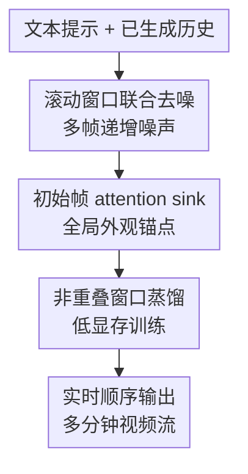

# Rolling Forcing: Autoregressive Long Video Diffusion in Real Time

**会议**: ICLR2026  
**OpenReview**: [https://openreview.net/forum?id=IAyzXjbfwo](https://openreview.net/forum?id=IAyzXjbfwo)  
**代码**: 待确认  
**领域**: 视频生成 / 长视频扩散 / 实时流式生成  
**关键词**: 长视频生成、流式视频扩散、自回归生成、误差累积、attention sink  

## 一句话总结
Rolling Forcing 把逐帧自回归视频扩散改成可滚动的多帧联合去噪，并用初始帧 attention sink 锚住全局外观，从而在单卡上以接近 16 FPS 实时生成多分钟长视频，同时显著压低长期误差累积。

## 研究背景与动机
**领域现状**：现代视频扩散模型已经能生成质量很高的短片段，但主流的双向视频扩散通常一次性看完整个时间窗口，适合离线生成，不适合交互式 world model、神经游戏引擎或 XR 场景里的实时流式输出。实时应用要求视频帧按时间顺序不断吐出，用户或下游系统看到一帧就能立刻消费这一帧，不能等整段视频都采样完再统一展示。

**现有痛点**：为了满足流式约束，CausVid、Self Forcing 这类方法会把双向视频扩散蒸馏成快速的因果自回归生成器。问题是，严格因果的逐帧预测会让每一帧都依赖前面模型自己生成的帧，前面的小瑕疵会被下一帧继续继承，几十秒以后就变成明显的颜色漂移、背景变形、主体崩坏或运动不自然。另一类长视频方法会先规划远处关键帧再补中间帧，但这种乱序生成破坏了流式系统必须遵守的顺序输出。

**核心矛盾**：实时流式视频生成同时要求“顺序输出”和“长期稳定”。如果完全按因果链逐帧生成，顺序性强但误差会沿时间传播；如果允许未来帧参与规划，长期一致性更好，却不能保证每一帧按时发出。历史帧加噪能缓解训练和推理的分布差异，但会牺牲干净历史参考，导致局部连贯性变差。

**本文目标**：作者希望在不改变 Wan2.1 这类基础视频扩散模型架构的前提下，把短窗口视频扩散蒸馏成一个可实时运行的自回归长视频生成器。具体目标包括：单卡实时吞吐、亚秒级稳定延迟、多分钟生成、短期运动连续、长期色调和背景不漂移，以及训练阶段不需要昂贵的长视频数据。

**切入角度**：论文的观察是，严格逐帧去噪把所有局部错误都提前“定稿”了；如果当前帧和接下来若干帧能在一个小窗口里共同去噪，局部错误就有机会在输出前被邻近帧互相修正。同时，视频最开头的若干帧天然包含主体、场景、色调和白平衡等全局信息，如果能像流式 LLM 的 attention sink 一样长期保留它们，后续帧就有一个稳定锚点。

**核心 idea**：用“滚动窗口联合去噪 + 初始帧 attention sink + 非重叠窗口蒸馏”替代严格逐帧自回归去噪，在保持顺序输出和实时延迟的同时抑制长视频误差累积。

## 方法详解

### 整体框架
Rolling Forcing 仍然是自回归视频扩散：系统每次向前滚动一个时间步，输出当前干净帧，并把新的高噪声帧追加到窗口末尾。不同之处在于，它不是只对一个当前帧去噪，而是在长度为 $T$ 的滚动去噪窗口里同时处理多个连续帧；这些帧拥有从低到高递增的噪声等级，并在窗口内部使用双向注意力互相修正。

整体可以理解成三层记忆加一个滚动窗口：最近的干净帧 KV cache 提供短期时间上下文，初始帧 KV cache 作为长期全局锚点，当前窗口负责把一串不同噪声等级的帧联合往更干净的方向推一步。训练时，作者用 DMD 蒸馏把 Wan2.1-T2V-1.3B 变成 5 步快速生成器，并只对一部分互不重叠的滚动窗口回传梯度，让扩大的窗口能在 80G GPU 上训练。

推理时，第 $i$ 个滚动窗口包含 $x_i,\ldots,x_{i+T-1}$。窗口里的帧带有 $t_1,\ldots,t_T$ 这些递增噪声等级，模型一次前向预测所有帧的干净版本，再通过前向扩散过程 $\Psi$ 把它们推到下一组更低噪声等级。窗口最前面的帧达到 $t_0=0$ 后被输出，剩余帧继续留在窗口中，末尾追加一个新的高斯噪声帧。

### 关键设计
**1. 滚动窗口联合去噪：让当前帧在定稿前被邻近未来帧修正**

Self Forcing 的严格逐帧去噪可以写成 $x^i_{t_{j-1}}=\Psi(G_\theta(x^i_{t_j},t_j,x^{<i}_0),t_{j-1})$，当前帧只能看干净历史，不能和正在生成的邻近帧互相调整。这样一来，前一帧的噪声、伪影或颜色偏差会成为后一帧的条件，误差沿链条传播，很难在后面自然消失。

Rolling Forcing 把单帧去噪扩展成窗口去噪，核心分布写成 $p_\theta(x^{i:i+T-1}_{t_{0:T-1}}\mid x^{i:i+T-1}_{t_{1:T}},x^{<i}_0)$。窗口内部的连续帧使用双向注意力，且噪声等级沿时间递增：靠前帧更接近输出，靠后帧还更噪。每次滚动只输出最前面的干净帧，其余帧保留为下一轮的中间状态。这个安排既没有打破顺序输出，又让当前帧在输出前接受后续短期运动趋势的约束，因此比单帧定稿更不容易把局部错误固化进历史。

窗口长度原则上等于去噪步数 $T$。普通视频扩散常有几十步，窗口会太大；论文通过 DMD few-step distillation 把 $T$ 降到 5，并把每个 chunk 设为 3 个 latent frames，所以实际滚动窗口是 15 个 latent frames。这是实时性的关键：窗口足够长，可以互相修正；窗口又足够短，单卡可以在稳定阶段达到 15.79 FPS 和 0.76 秒延迟。

**2. 初始帧 attention sink：用开头几帧锁住长期色调和场景身份**

仅保留最近历史可以维护短期连贯，但长视频里很多漂移不是局部运动问题，而是全局属性慢慢偏掉：曝光、色调、背景布局、主体身份都会在几十秒后发生变化。Rolling Forcing 因此把初始 $L_{glo}$ 帧的 KV 状态常驻为 global context，把最近 $L_{tem}$ 帧的 KV 状态作为 temporal context，并让 $L_{tem}+L_{glo}+L_{win}=L_{bidirectional}$，即总注意力窗口仍匹配教师模型原本能处理的长度。

这个 attention sink 不是简单地把第一帧一直塞进缓存。Wan2.1 这类 DiT 使用 RoPE，相对位置偏移如果随视频长度不断增大，会超过训练时见过的范围，引发画面跳回初始帧、闪烁或运动异常。作者的做法是缓存 global context 的 key states 时先不施加 RoPE；到每次生成时，再把它们动态放到 temporal context 前面的位置 $i-L_{tem}-L_{glo}:i-L_{tem}-1$。这样初始帧在内容上仍是全局锚点，在位置编码上却总是像“刚好位于最近历史之前”的上下文，避免 RoPE offset 爆掉。

附录的动态 RoPE 分析说明了这个细节的重要性：固定在 0 到 $L_{glo}-1$ 会造成强烈 jumping artifact；和 temporal context 重叠会产生闪烁；放进 denoising window 会让输出趋于静态；放到窗口之后会诱导不自然运动。最终采用的位置策略本质上是在“保留全局内容”和“维持训练内相对位置”之间做了一个很精确的工程折中。

**3. 非重叠窗口蒸馏：让扩展窗口能训练，同时继续暴露给自生成历史**

Rolling Forcing 训练仍使用 DMD loss，把学生生成分布和教师数据分布对齐。直接问题是：滚动窗口一次预测 $T$ 个帧，如果对每个起点窗口都回传梯度，query size 和梯度显存都会变成 Self Forcing 的约 $T$ 倍；论文估计若完全去掉子集梯度策略，显存可能从 80G 级别膨胀到约 400G，几乎不可训练。

作者随机采样一个偏移 $j\sim Uniform\{0,\ldots,T-1\}$，只对满足 $i\equiv j\pmod T$ 的窗口开启梯度。这些窗口互不重叠，但合在一起仍覆盖完整视频，因此每轮训练只需要约 $\lceil N/T\rceil$ 个带梯度前向。更重要的是，训练时输入窗口和历史帧都来自模型自己一路滚动生成的结果，而不是完全干净的 ground truth 历史，这延续了 Self Forcing 缓解 exposure bias 的优点。

单独使用 Rolling Forcing 训练也会带来一个新问题：DMD 所看到的视频由不同噪声等级的窗口输出拼接而成，不同位置的清晰度和运动状态可能不自然。论文因此采用混合训练策略，以 50% 概率使用 Self Forcing 目标、50% 概率使用 Rolling Forcing 目标。Self Forcing 分支像一个运动自然性正则项，帮助模型保持合理相机运动；Rolling Forcing 分支则让模型学会在扩展窗口里联合去噪和控制长期漂移。

### 一个完整示例
假设系统要根据提示词“一个长板手沿山路下坡并穿过树林”实时生成 2 分钟视频。开始时，模型先初始化前 $T-1$ 个中间噪声状态，并生成开头若干帧；这些初始帧的 KV 被保存为 global context，记录了人物、道路、光照和画面风格。

到了第 40 秒，当前窗口可能包含 5 个去噪阶段的 chunk：最前面的 chunk 已经接近干净，马上要输出；后面的 chunk 仍带有更高噪声，但已经粗略包含接下来运动方向。Rolling Forcing 一次前向让这几个 chunk 互相看见：如果最前帧的滑板姿态和后面运动趋势不一致，窗口内部注意力可以在输出前修正它；如果画面色温开始偏移，global context 的初始帧 KV 会提供早期外观锚点；如果最近几帧出现连续转弯，temporal context 会维持短期运动惯性。

前向结束后，系统只把窗口最前面的干净 chunk 发给用户显示，剩余 chunk 通过 $\Psi$ 调整到下一轮所需噪声等级，末尾再追加一个纯高斯噪声 chunk。于是输出仍是一帧接一帧的实时视频流，但每个被显示的帧都已经在一个小的未来局部窗口中被共同修正过。

### 损失函数 / 训练策略
论文采用 Wan2.1-T2V-1.3B 作为基础模型，先用 causal attention masking 和 16k ODE solution pairs 做初始化，再进行 3,000 步 Rolling Forcing 训练。训练 prompts 来自过滤并由 LLM 扩展的 VidProM；生成分辨率为 832 × 480，帧率 16 FPS，基础视频长度 5 秒。

训练目标沿用 DMD。直观地说，DMD 用教师数据分布的 score $s_{data}$ 和学生生成分布的 score $s_{gen}$ 之差来近似反向 KL 的梯度，使学生少步生成结果接近教师模型的平滑数据分布。论文中的梯度形式为 $\nabla_\theta L_{DMD}\approx-E_t\int(s_{data}-s_{gen})\frac{dG_\theta(\epsilon)}{d\theta}d\epsilon$；这里关键不是公式本身，而是它不需要真实视频标注，可以让学生在自生成历史条件下训练。

具体超参上，作者设置 $T=5$，每个 chunk 含 3 个 latent frames，训练 temporal window 为 27 个 latent frames，batch size 为 8。生成器 $G_\theta$ 使用 AdamW，学习率 $1.5\times10^{-6}$；fake score $s_{gen}$ 学习率 $4.0\times10^{-7}$；每 5 步 fake score 更新后更新一次生成器。推理阶段只使用 Rolling Forcing 范式，不再混合 Self Forcing。

## 实验关键数据

### 主实验
论文在 200 个随机采样的 MovieGen prompts 上评测 30 秒视频，统一使用 16 FPS、832 × 480 分辨率。指标来自 VBench，包括 temporal flickering、subject consistency、background consistency、motion smoothness、aesthetic quality、imaging quality；同时用首尾 5 秒 imaging quality 的绝对差 $\Delta Quality_{Drift}$ 衡量误差累积。

| 方法 | 参数量 | 吞吐 FPS ↑ | 延迟 s ↓ | Subject ↑ | Background ↑ | Imaging ↑ | $\Delta Quality_{Drift}$ ↓ |
|------|--------|------------|----------|-----------|--------------|-----------|-----------------------------|
| FramePack | 13B | 0.92 | 65 | 91.65 | 93.55 | 65.20 | 3.45 |
| CausVid | 1.3B | 15.38 | 0.78 | 87.99 | 89.99 | 66.38 | 2.18 |
| Self Forcing | 1.3B | 15.38 | 0.78 | 86.48 | 90.29 | 68.68 | 1.66 |
| Rolling Forcing | 1.3B | 15.79 | 0.76 | 92.80 | 93.71 | 70.75 | 0.01 |

30 秒主表里，Rolling Forcing 的优势很集中：吞吐和延迟略优于同规模 distilled causal baseline，但更关键的是漂移指标几乎归零。它的 subject consistency、background consistency 和 imaging quality 也同时更高，说明不是靠牺牲画质来换稳定，而是在长期一致性和单帧质量上都有收益。

论文还补充了 2 分钟长视频评测，更贴近“长视频流”的真实目标。

| 方法 | Temp. ↑ | Subj. ↑ | Back. ↑ | Aes. ↑ | Img. ↑ | Dyn. ↑ | $\Delta Quality_{Drift}$ ↓ |
|------|---------|---------|---------|--------|--------|--------|-----------------------------|
| CausVid | 96.67 | 84.69 | 89.53 | 62.16 | 63.62 | 52.08 | 3.35 |
| Self Forcing | 97.44 | 71.95 | 88.73 | 50.66 | 60.03 | 51.02 | 14.4 |
| w/o RF training | 96.87 | 84.38 | 91.93 | 58.61 | 66.55 | 56.75 | 1.39 |
| Rolling Forcing | 96.90 | 91.47 | 95.29 | 65.21 | 68.96 | 57.14 | 0.49 |

2 分钟结果里，Self Forcing 的 drift 放大到 14.4，说明严格因果链在更长时间上确实会崩得更明显；Rolling Forcing 仍保持 0.49 的 drift，并在 subject、background、aesthetic、imaging 和 dynamic degree 上取得最好结果。

### 消融实验
| 配置 | Temporal ↑ | Subject ↑ | Background ↑ | Motion ↑ | Aesthetic ↑ | Imaging ↑ | $\Delta Quality_{Drift}$ ↓ | 说明 |
|------|------------|-----------|--------------|----------|-------------|-----------|-----------------------------|------|
| w/o RF inference | 95.45 | 86.01 | 89.94 | 97.36 | 57.59 | 65.19 | 5.53 | 推理不用滚动窗口，长期漂移明显变大 |
| w/o RF training | 95.91 | 87.50 | 90.86 | 98.05 | 60.41 | 69.24 | 0.89 | 训练和推理都回到逐帧范式，稳定性和一致性下降 |
| w/o SF training | 90.83 | 83.27 | 88.14 | 95.63 | 55.30 | 62.00 | 1.62 | 去掉混合训练里的 SF 正则后，相机运动和整体质量变差 |
| w/o attention sink | 97.53 | 83.22 | 87.99 | 98.56 | 58.99 | 67.30 | 4.63 | 没有初始帧全局锚点，主体和背景一致性大幅下降 |
| Ours full | 97.61 | 92.80 | 93.71 | 98.70 | 62.39 | 70.75 | 0.01 | 三个设计合用时质量和漂移控制最佳 |

### 关键发现
- 滚动窗口不只是训练 trick，也是推理时抑制漂移的核心机制；w/o RF inference 的漂移从 0.01 变成 5.53，是消融里最直接的失败模式之一。
- attention sink 对长期主体和背景稳定非常关键；去掉它后 temporal flickering 仍高，但 subject consistency 从 92.80 掉到 83.22，说明短期平滑不等于长期身份一致。
- 混合训练里的 Self Forcing 目标主要稳定自然运动；只用 Rolling Forcing 训练会导致 temporal、motion、aesthetic 和 imaging 全面下降。
- 附录 full VBench 显示，Rolling Forcing 在 30 秒 946 prompts 的质量总分为 84.08，高于 CausVid 的 80.89 和 Self Forcing 的 81.39；语义总分 69.78 也略高于 Self Forcing 的 69.17。
- 人类偏好实验也支持定量结论：在误差累积控制和总体质量两个维度，Rolling Forcing 得票都明显高于对比方法。

## 亮点与洞察
- **把“未来信息”压缩进仍可流式的局部窗口**：论文没有用规划式长视频生成那种先生成远处关键帧的方案，而是让当前帧只和一个很短的滚动窗口内未来中间状态交互。这种未来信息很弱，却足以修正局部运动和外观错误，同时不破坏顺序输出。
- **attention sink 从语言流式推理迁移到视频生成很自然**：视频开头几帧像 prompt prefix 一样承载全局身份信息，长期保留它们的 KV 比反复重算长历史更便宜。真正巧妙的是动态 RoPE，否则这个看似简单的缓存会因为相对位置外推而制造新的伪影。
- **训练策略服务于工程可行性，而不是单纯追求形式完整**：非重叠窗口只对部分窗口回传梯度，理论上引入训练和推理差异，但换来了可训练的显存规模。实验上这个折中很有效，说明长视频生成里“训练覆盖完整轨迹”有时比“每个窗口都精确监督”更重要。
- **实时长视频的评价必须看漂移而不只是平均质量**：Self Forcing 的单帧 imaging quality 并不低，但 2 分钟 drift 非常高。论文用首尾 5 秒质量差和分段 CLIP score 把长期退化显式量化，这对后续实时世界模型评测很有参考价值。

## 局限与展望
- 作者承认，global context 只保存开头几帧，temporal context 只保存最近几帧，中间很长一段历史离开缓存后就被丢弃。因此模型对“中途出现过但后来暂时离开画面”的对象或事件没有真正记忆，未来可以结合层级记忆、检索式视频缓存或对象级状态表示。
- 训练成本仍然不低。Rolling window 扩大了注意力窗口，DMD loss 本身也耗显存；虽然非重叠窗口让 80G GPU 可训练，但扩展到更大基础模型、更高分辨率或更长上下文时仍可能遇到瓶颈。
- rolling diffusion window 可能增加交互场景里的响应延迟，因为当前帧定稿前已经部分预生成了后续帧。如果用户突然改 prompt，系统需要处理已经在窗口中的未来状态。论文附录展示了 prompt 修改时可以丢弃旧 cross-attention cache，但更理想的方案可能是在交互高频阶段切到逐帧模式，稳定播放阶段再切回 Rolling Forcing。
- 实验主要基于 Wan2.1-T2V-1.3B 和文本到视频设置，尚不清楚对更大闭源模型、视频到视频、可控角色一致性或多主体交互任务是否同样稳定。
- 社会影响上，实时长视频生成降低了交互式内容生产门槛，也会提高实时伪造视频流和长时误导内容的风险。部署时需要配套水印、内容审核和滥用检测。

## 相关工作与启发
- **vs Self Forcing**: Self Forcing 通过在训练时条件于自生成历史来缓解 exposure bias，但推理仍是严格逐帧因果链。Rolling Forcing 保留自生成历史训练，同时在推理中加入滚动窗口联合去噪，因此更能控制长期误差累积。
- **vs CausVid**: CausVid 将慢速双向视频扩散蒸馏成快速自回归模型，解决实时性问题，但没有专门处理长时间漂移。Rolling Forcing 可以看作在 CausVid / Self Forcing 这一 distilled causal 路线上的长程稳定性增强。
- **vs Diffusion Forcing / SkyReels-V2**: Diffusion Forcing 通过给历史帧加不同噪声来减少模型对干净历史的依赖，但这会削弱时间一致性。Rolling Forcing 不污染已输出的干净历史，而是在当前窗口内使用不同噪声等级的未定稿帧进行联合修正。
- **vs planning generation / FramePack**: FramePack 这类方法用非顺序方式生成或打包上下文，能利用更宽的时间信息，但不适合严格实时流式输出。Rolling Forcing 的优势是每次仍输出当前最前帧，系统语义上始终是在线生成。
- **对后续工作的启发**: 这篇论文提示长视频生成不一定要无限扩展全历史注意力；更可行的方向可能是“短期滚动窗口 + 少量全局锚点 + 可学习记忆”。类似思想可以迁移到实时 3D 场景生成、交互式仿真、长音频扩散或多模态 agent 的连续视觉想象。

## 评分
- 新颖性: ⭐⭐⭐⭐⭐ 将 rolling diffusion、few-step distillation 和 attention sink 组合进严格流式视频生成，问题切得很准，设计也不是简单拼接。
- 实验充分度: ⭐⭐⭐⭐⭐ 主实验、30 秒和 2 分钟长视频、消融、full VBench、人类偏好和 RoPE 分析都覆盖到了，证据链比较完整。
- 写作质量: ⭐⭐⭐⭐☆ 方法叙述清楚，图和算法帮助很大；但 DMD 训练细节较密，读者需要熟悉 Self Forcing / CausVid 背景才能完全跟上。
- 价值: ⭐⭐⭐⭐⭐ 实时长视频扩散是 world model 和交互式生成的重要基础能力，本文给出了质量、延迟和训练可行性都比较平衡的一条路线。

<!-- RELATED:START -->

## 相关论文

- [\[ICLR 2026\] Real-Time Motion-Controllable Autoregressive Video Diffusion](real-time_motion-controllable_autoregressive_video_diffusion.md)
- [\[ICLR 2026\] LongLive: Real-time Interactive Long Video Generation](longlive_real-time_interactive_long_video_generation.md)
- [\[CVPR 2026\] Endless World: Real-Time 3D-Aware Long Video Generation](../../CVPR2026/video_generation/endless_world_real-time_3d-aware_long_video_generation.md)
- [\[ICLR 2026\] MotionStream: Real-Time Video Generation with Interactive Motion Controls](motionstream_real-time_video_generation_with_interactive_motion_controls.md)
- [\[ICML 2026\] Light Forcing: Accelerating Autoregressive Video Diffusion via Sparse Attention](../../ICML2026/video_generation/light_forcing_accelerating_autoregressive_video_diffusion_via_sparse_attention.md)

<!-- RELATED:END -->
