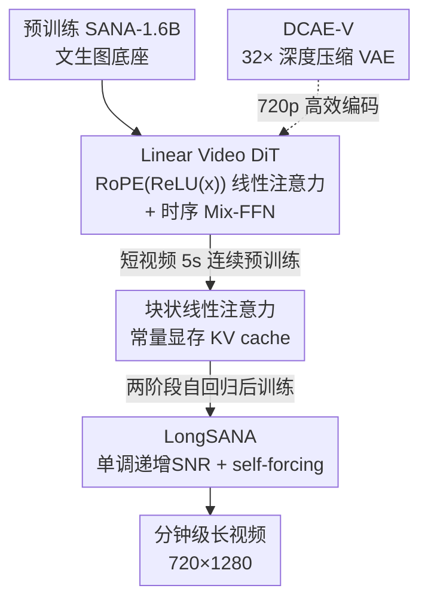

# SANA-Video: Efficient Video Generation with Block Linear Diffusion Transformer

**会议**: ICLR 2026  
**OpenReview**: [https://openreview.net/forum?id=mzAchylAtf](https://openreview.net/forum?id=mzAchylAtf)  
**论文**: [Project Page](https://nvlabs.github.io/Sana/Video/)  
**代码**: https://github.com/NVlabs/Sana (有)  
**领域**: 视频生成 / 扩散模型 / 线性注意力 / 高效推理  
**关键词**: 视频扩散, 线性注意力, 自回归长视频, KV cache, 深度压缩 VAE

## 一句话总结
SANA-Video 用线性注意力替换视频 DiT 里的全注意力把复杂度从 $O(N^2)$ 降到 $O(N)$，又借线性注意力的累加性质设计了「常量显存」的块状自回归 KV cache，让一个 2B 小模型能在 64 张 H100 上花 12 天（仅 MovieGen 1% 成本）训出能生成 720×1280、分钟级长视频的模型，且在 VBench 上与 Wan2.1-14B 持平、推理快 16×。

## 研究背景与动机
**领域现状**：当前主流视频生成模型（Wan、Veo3、Kling、Seedance 等）几乎都用标准的全注意力 DiT，靠堆参数和算力换质量。

**现有痛点**：视频是「token 极度密集」的任务——用 Wan 14B 生成一段 5 秒 720p 视频要处理 7.5 万个 token，在 H100 上跑 32 分钟。全注意力的 $O(N^2)$ 复杂度让训练成本和推理延迟都高到离谱，普通研究者和边缘设备根本玩不起。

**核心矛盾**：更糟的是「长视频」这条路被卡死。要做超过 10 秒的视频必须用块状自回归 + KV cache，但全注意力的 KV cache 显存随历史 token 数线性增长（每个新 token 要 $O(N \times D)$ 显存和算力）。于是 MAGI-1、SkyReels-V2、Self-Forcing 这些方法只能把注意力窗口砍成局部范围来稳住显存，代价是丢掉全局上下文，长视频的时序一致性变差。

**本文目标**：做一个既高质量、高分辨率，又算得快、能在云端和边缘（甚至 RTX 5090）上跑、还能稳定生成分钟级长视频的小扩散模型。

**切入角度**：作者注意到线性注意力在 token 量巨大时天然有效率优势，而且因果线性注意力的「累加状态」可以被改写成一个固定大小的全局记忆——这正好同时解决「短视频太慢」和「长视频显存爆炸」两个问题。

**核心 idea**：把视频 DiT 的所有注意力都换成 ReLU 线性注意力（$O(N)$），再利用线性注意力的累加可分解性，把因果 KV cache 压成一个 $O(D^2)$ 的常量显存状态，从而在固定显存下保留全局上下文、支持无限长自回归生成。

## 方法详解

### 整体框架
SANA-Video 的核心是一条「从图像模型继承、逐步改造成高效长视频模型」的链路。它先拿预训练好的 SANA-1.6B 文生图模型当底座，把里面的全注意力换成带 3D RoPE 的线性注意力、在 Mix-FFN 里加时序卷积，得到 **Linear Video DiT**；这个 DiT 先做短视频（5 秒）的连续预训练，再通过「块状因果线性注意力 + 常量显存 KV cache」改造成支持自回归的版本（即 LongSANA），最后用两阶段自回归后训练（单调递增 SNR 采样 + 改进的 self-forcing）把它打磨成能生成分钟级长视频的模型。此外为了让 720p 也跑得快，作者把 DCAE 微调成视频 VAE（DCAE-V）做 32 倍空间压缩。整套 pipeline 输入文本（T2V）或「首帧+文本」（I2V），输出高分辨率长视频。

### 关键设计

**1. Linear Video DiT：用 RoPE(ReLU(x)) 把线性注意力搬进视频域**

视频 token 太多，全注意力 $O(N^2)$ 是最大瓶颈，所以作者把 DiT 所有注意力都换成 SANA 的 ReLU 线性注意力，复杂度降到 $O(N)$，720p 上直接快 4×。但线性注意力搬到视频有两个坑。第一个坑是位置编码：作者要加 3D RoPE 来建模时空关系，关键在于**先 ReLU 再 RoPE**，即 $\text{RoPE}(\phi(Q_i))$ 而不是 $\phi(\text{RoPE}(Q_i))$——因为如果先做 RoPE，ReLU 核会把 RoPE 编进去的位置信息过滤掉，而后做 RoPE 能得到更稀疏、更聚焦局部的注意力图。可直接对 Q/K 做 RoPE 又会破坏 ReLU 输出的非负性，导致线性注意力公式的分母可能变成零、训练数值不稳。作者的解法是只在分子上对 Q、K 加 RoPE，**分母里去掉 Q 或 K 的 RoPE**，保证分母恒正：

$$O_i = \frac{\text{RoPE}(\phi(Q_i)) \left( \sum_{j=1}^{N} \text{RoPE}(\phi(K_j))^T V_j \right)}{\phi(Q_i) \left( \sum_{j=1}^{N} \phi(K_j)^T \right)}$$

第二个坑是线性注意力比 softmax 注意力更「弥散」、不擅长抓局部细节。作者沿用 SANA 用卷积补局部性的思路，在 Mix-FFN 末尾加一条带 shortcut 的 **1D 时序卷积**，专门沿时间轴聚合局部特征，提升运动连续性和一致性；shortcut + 零初始化让新加的层在训练早期几乎不扰动预训练权重，从而能高效复用图像模型。

**2. 块状线性注意力 + 常量显存 KV cache：把全局历史压成一个固定大小的状态**

这是长视频不爆显存的核心。全注意力的因果 KV cache 每个新 token 要 $O(N \times D)$ 显存，历史越长越吃不消，逼得别人只能砍成局部窗口、丢全局信息。作者发现因果线性注意力可以重写成累加形式：对第 $i$ 个 token，输出只依赖前面所有 token 的**状态累加和** $\sum_{j=1}^{i-1} S_j$（其中 $S_j = \phi(K_j)^T V_j \in \mathbb{R}^{D \times D}$）和**键累加和** $\sum_{j=1}^{i-1} \phi(K_j)^T \in \mathbb{R}^{D \times 1}$。

$$O_i = \frac{\phi(Q_i)\left(\sum_{j=1}^{i-1} S_j + S_i\right)}{\phi(Q_i)\left(\sum_{j=1}^{i-1}\phi(K_j)^T + \phi(K_i)^T\right)}$$

也就是说，只要缓存这两个累加量，新 token 只需算自己的 $S_i$，**显存和单 token 计算都固定在 $O(D^2)$**，与历史长度无关（对比全注意力 $O(N \times D)$、局部注意力 $O(W \times D)$，因为 $N > W \gg D$，线性注意力效率最优且仍保留全局记忆）。为了让 Mix-FFN 也能因果地长视频运行，作者还做了 **Block Causal Mix-FFN**：训练时给每块末尾补一个全零 token 防止后续块信息泄漏，并缓存每块最后一帧（Token$_{-1}$）拼到下一块前面，喂给 kernel size 3 的因果时序卷积。整套块状线性 DiT 只维护「注意力状态累加和 + 键累加和 + 上一块末帧」这一份固定缓存。

**3. LongSANA 两阶段自回归后训练：单调递增 SNR 采样 + 改进 self-forcing**

有了常量显存 KV cache 还不够，要把 5 秒模型变成能稳定生成分钟级视频的自回归模型，得解决两个训练问题。第一阶段是**自回归块训练**，作者提出单调递增 SNR 采样器：随机挑一个块用 SNR 采样器采一个 timestep，其余块通过传播概率采样，保证所有块的 timestep 单调递增（后面的块 timestep 更大）。这么做一是采样空间比随机 timestep 小得多、收敛更快效果更好，二是对随机块用 SNR 采样保证每个块都被充分训练。第二阶段针对**曝光偏差**（exposure bias）：训练时条件块是 ground truth，推理时却是自己生成的内容，误差会累积。Self-Forcing 想解决但受全注意力显存限制只能用 5 秒局部窗口；LongLive 虽探索到 1 分钟但仍困在带 sink 的局部注意力。SANA-Video 因为块状线性注意力支持小而恒定显存的全局 KV cache，可以把 self-forcing 扩展到**全局注意力下自生成更长视频（如 1 分钟）**，让训练和推理的条件信号对齐得更好、时序一致性更佳。

**4. DCAE-V 深度压缩视频 VAE：让 720p 也跑得动**

即使有线性注意力，720p 生成仍比 480p 慢 2.3×，瓶颈在 token 数。作者把 DCAE 微调成视频版 DCAE-V，做空间下采样 $F=32$、时序 $T=4$、通道 $C=32$ 的深度压缩。两个巧思：一是 32 个 latent 通道和预训练 T2I 模型对齐，能从图像模型快速适配收敛更快；二是相比并发的 Wan2.2-5B（同样 32× 压缩但要预测 192 维 latent，对小模型太难），DCAE-V 只需预测 32 维，更适合小扩散模型。在 Panda-70M 重建上 DCAE-V 与 Wan/LTX 等 SOTA VAE 相当，却让 720p 5 秒视频只要 36 秒（比 Wan2.1-14B 快 53×，比同压缩比的 Wan2.2-5B 快 3.2×）。

### 损失函数 / 训练策略
训练目标用 Rectified Flow + SNR 采样器，预测速度场：$\mathbb{E}_{c,t,x^0}\|u(x^t \mid t,c;\theta) - v(x)\|^2$。整体走「VAE 适配 → 从 T2I 连续预训练（低分辨率短视频到高分辨率长视频的 coarse-to-fine）→ 自回归块训练 → self-forcing 后训练 → 人类偏好数据 SFT」的多阶段流程。T2I/T2V/I2V 在一个统一框架里联合训练，I2V 靠把首帧噪声置零实现、无需改模型。数据侧用强 VLM 当视频 captioner 产出 80–100 词的细粒度描述，并对每个数据源设计专门过滤准则。

## 实验关键数据

### 主实验
VBench 评测（480×832×81 视频测延迟，H100 BF16）：

| 任务 | 模型 | 参数 | 延迟(s) | Total↑ | Semantic/I2V↑ |
|------|------|------|---------|--------|----------------|
| T2V | Wan2.1-14B | 14B | 484 | 83.69 | 76.11 |
| T2V | Wan2.1-1.3B | 1.3B | 103 | 83.31 | 75.65 |
| T2V | Open-Sora-2.0 | 14B | 465 | 84.34 | 80.12 |
| T2V | **SANA-Video** | 2B | **60** | 83.71 | **81.35** |
| I2V | Wan2.1-14B | 14B | 493 | 86.86 | 92.90 |
| I2V | **SANA-Video** | 2B | **60** | **88.02** | **96.40** |

720×1280×81 上 SANA-Video 延迟仅 36 秒，Total 84.05，而 Wan2.1-14B 要 1897 秒、Wan2.2-5B 要 116 秒——延迟最低且语义分（81.73）远超对手。

### 消融实验
VBench 上逐项消融（Table 5）：

| 配置 | Total↑ | Quality↑ | Semantic↑ | 说明 |
|------|--------|----------|-----------|------|
| w/o Temporal Conv | 80.94 | 82.63 | 74.18 | 去掉时序卷积 |
| w/ Temporal Conv | 81.71 | 83.10 | 76.15 | 语义 +1.97 |
| w/o 3D RoPE | 81.19 | 82.68 | 75.22 | 去掉 3D RoPE |
| w/ 3D RoPE | 82.79 | 83.89 | 78.38 | 语义 +3.16 |
| Random Steps | 82.00 | 83.13 | 77.51 | 随机 timestep |
| Increasing Steps | 83.70 | 84.43 | 80.78 | 单调递增 SNR，语义 +3.27 |

长视频自回归对比（Table 6）：SANA-Video Total 83.70，优于 CausVid（81.20）和 SkyReels-V2（82.67），与 Self-Forcing（84.31）相当——而后者只能局部注意力、长度受限。

### 关键发现
- **3D RoPE 与单调递增 SNR 采样贡献最大**：两者各让语义分提升约 3 分，远超时序卷积，说明位置编码摆放方式和自回归训练的 timestep 调度是质量关键。
- **线性注意力的效率优势随分辨率放大**：480p 提速 2×、720p 提速 4×，分辨率越高越划算，正好契合视频这种高 token 任务。
- **小模型靠常量显存吃下长视频**：块状线性注意力在 480×832 上随长度增加显存恒定在 7.2GB，而因果全注意力到 60s 就 OOM。
- **NVFP4 量化**：用 SVDQuant 量化到 NVFP4 后，RTX 5090 上 5 秒 720p 从 71 秒降到 29 秒（2.4× 加速），且只选择性量化部分层以保语义质量。

## 亮点与洞察
- **把「累加可分解」当成长视频的钥匙**：因果线性注意力的输出只依赖历史状态的累加和，作者据此把整段历史压成 $O(D^2)$ 的固定状态——这是同时解决「短视频慢」和「长视频显存爆」的一石二鸟，比起别人砍局部窗口保住了全局上下文。
- **RoPE 与 ReLU 的顺序之争**：先 ReLU 再 RoPE、且分母去掉 RoPE，这个看似微小的工程选择既保了局部性又保了数值稳定，是把线性注意力真正落地到视频的关键细节，可迁移到其他用线性/核注意力的生成模型。
- **从图像模型「免费」起步**：零初始化 + shortcut 让新加的时序模块不破坏预训练 T2I 权重，把视频训练成本压到 MovieGen 的 1%，对算力有限的团队极具参考价值。

## 局限与展望
- **质量分仍略逊大模型**：SANA-Video 的 Quality Score（84.35/79.65）在部分对比里低于 Wan2.1-14B，它赢在语义对齐和效率，纯画质上小模型仍有差距。
- **线性注意力的表达上限**：ReLU 线性注意力靠卷积补局部性，对极复杂运动/长程依赖是否够用、会不会在更长视频上累积漂移，论文用 self-forcing 缓解但未给出超长（>1 分钟）的系统评测。
- **DCAE-V 高压缩的取舍**：128× 压缩比下重建 PSNR/LPIPS 略逊低压缩 VAE，高压缩换效率可能在细节丰富场景损失保真度。

## 相关工作与启发
- **vs Self-Forcing / LongLive**：都在解曝光偏差，但它们受全注意力显存限制只能用局部窗口（5 秒或带 sink 的局部注意力），SANA-Video 靠常量显存线性 KV cache 把 self-forcing 扩到全局注意力、自生成 1 分钟，训练推理条件对齐更好。
- **vs Wan / MAGI-1 / SkyReels-V2**：它们用全注意力 + 线性增长的 KV cache，靠堆参数换质量、长视频靠砍窗口；SANA-Video 用 2B 小模型 + 线性注意力，在 VBench 上持平甚至反超，延迟快 8–16×。
- **vs Wan2.2-5B（同 32× 压缩）**：Wan2.2-VAE 要预测 192 维 latent，对小模型太难；DCAE-V 只预测 32 维且和 T2I latent 对齐，收敛更快、推理快 3.2×。

## 评分
- 新颖性: ⭐⭐⭐⭐⭐ 把因果线性注意力的累加性质做成常量显存全局 KV cache，是长视频生成的一个干净而有力的新视角
- 实验充分度: ⭐⭐⭐⭐ VBench 主实验、消融、长视频对比、量化部署都覆盖，但超长视频和画质上限的系统评测略欠
- 写作质量: ⭐⭐⭐⭐ 公式推导清晰、动机层层递进，图表把效率优势讲得直观
- 价值: ⭐⭐⭐⭐⭐ 1% 训练成本 + 边缘可部署 + 分钟级长视频，把高质量视频生成的门槛大幅拉低

<!-- RELATED:START -->

## 相关论文

- [\[ICLR 2026\] BLADE: Block-Sparse Attention Meets Step Distillation for Efficient Video Generation](blade_block-sparse_attention_meets_step_distillation_for_efficient_video_generat.md)
- [\[ICLR 2026\] VMoBA: Mixture-of-Block Attention for Video Diffusion Models](vmoba_mixture-of-block_attention_for_video_diffusion_models.md)
- [\[ICLR 2026\] Neodragon: Mobile Video Generation Using Diffusion Transformer](neodragon_mobile_video_generation_using_diffusion_transformer.md)
- [\[CVPR 2026\] Attention Surgery: An Efficient Recipe to Linearize Your Video Diffusion Transformer](../../CVPR2026/video_generation/attention_surgery_an_efficient_recipe_to_linearize_your_video_diffusion_transfor.md)
- [\[ICLR 2026\] BWCache: Accelerating Video Diffusion Transformers through Block-Wise Caching](bwcache_accelerating_video_diffusion_transformers_through_block-wise_caching.md)

<!-- RELATED:END -->
