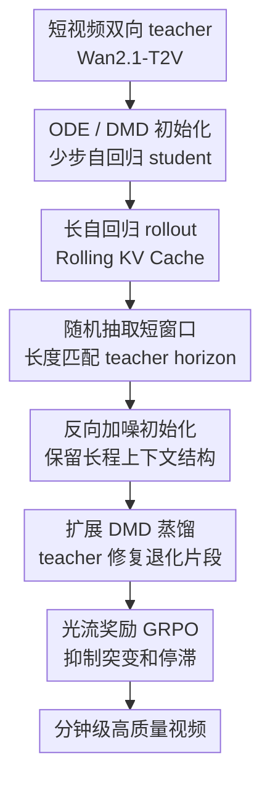

# Self-Forcing++: Towards Minute-Scale High-Quality Video Generation

**会议**: ICLR 2026  
**OpenReview**: [https://openreview.net/forum?id=DzvPiqh23f](https://openreview.net/forum?id=DzvPiqh23f)  
**论文**: [https://openreview.net/forum?id=DzvPiqh23f](https://openreview.net/forum?id=DzvPiqh23f)  
**代码**: 有项目页，论文中给出 long-horizon demo；代码未在缓存中明确列出  
**领域**: 视频生成 / 长视频生成  
**关键词**: 长视频生成, 自回归视频扩散, 分布匹配蒸馏, Rolling KV Cache, 视觉稳定性

## 一句话总结
Self-Forcing++把短视频双向扩散 teacher 用作“短窗口纠错器”，在 student 自己生成的长视频轨迹上随机抽取退化片段做扩展 DMD 训练，并配合 rolling KV cache 与光流奖励，让 1.3B 自回归视频模型从 5 秒扩展到 100 秒乃至 4 分钟级生成，同时显著缓解过曝、变暗、停滞和误差累积。

## 研究背景与动机
**领域现状**：高质量文生视频模型大多基于 DiT 或类似的双向扩散架构，Sora、Wan、HunyuanVideo、Veo 等模型已经把短视频的视觉质量推到很高水平。但这类模型通常一次性处理固定长度的视频 token，既不天然支持流式生成，也很难在推理时把时间轴无成本地拉长，所以常见输出长度仍集中在 5 到 10 秒。

**现有痛点**：为了生成长视频，近年的一条路线是把双向扩散模型改造成自回归 streaming generator：模型每次生成一个 frame/chunk，并通过 KV cache 复用历史上下文。CausVid、Self-Forcing 等方法已经证明这种路线能做到高吞吐、低延迟，但长时间 rollout 时会出现两个很具体的问题：CausVid 依赖重算 overlapping frames 来保连续性，容易逐渐过曝；Self-Forcing 虽然缓解了过曝，却仍只在 teacher 能覆盖的短窗口内训练，超过 5 秒后常出现运动停滞、画面变暗或语义逐步崩塌。

**核心矛盾**：瓶颈不只是“teacher 只能生成 5 秒”。更深层的矛盾是训练和推理的时域分布不一致：训练时 student 只看短视频、且每一帧都能得到密集 teacher 监督；推理时 student 要靠自己的历史 KV cache 一直滚动到几十秒甚至几分钟，早期小误差会在连续 latent 空间里累积，最后变成曝光漂移、运动坍缩和结构退化。

**本文目标**：作者想解决的是长时长视频生成中的 horizon scaling 问题：不重新收集长视频数据，不要求 teacher 本身生成长视频，也不靠 overlapping frame 反复重算，而是让一个自回归 student 学会在自己已经退化的长 rollout 状态上恢复质量、延续运动，并保持可流式推理。

**切入角度**：论文的关键观察很实用：短视频 teacher 虽然只能直接生成 5 秒片段，但它训练过大量真实视频，仍然知道“一个局部短窗口看起来是否像合理视频”。换句话说，长视频中的任意连续短片段都可以看作长视频分布的一个 marginal sample；如果 student 先自己滚出很长的视频，再从里面抽短窗口交给 teacher 纠错，teacher 的短窗口知识就能反向修补 student 的长时域误差。

**核心 idea**：Self-Forcing++用“长 rollout + 随机短窗口 teacher 纠错”代替“只在前 5 秒 teacher forcing”，把 student 暴露到自己真实推理时会遇到的退化状态，并把 teacher 的局部恢复能力蒸馏回 student。

## 方法详解
### 整体框架
Self-Forcing++建立在 Wan2.1-T2V-1.3B、CausVid 和 Self-Forcing 的自回归化路线之上：先把双向视频扩散 teacher 蒸馏/初始化成少步自回归 student，再让 student 用 rolling KV cache 生成远超 teacher horizon 的长视频。训练的核心不是要求 teacher 生成长视频，而是从 student 自己生成的长视频中随机抽取一个 teacher 能处理的短窗口，把这个窗口反向加噪后分别送入 student 和 teacher，用扩展 DMD 对齐二者分布；如果仍有长程运动突变，再用基于光流的 GRPO 奖励做平滑性微调。

把它看成训练闭环会更清楚：student 先按推理方式真的滚到 $N$ 帧，其中 $N \gg M$，$M$ 是 teacher 可靠覆盖的短视频长度；随后在 $1$ 到 $N-K+1$ 之间均匀采样一个起点，取出长度为 $K$ 的窗口，通常 $K$ 与 teacher 的 5 秒训练 horizon 对齐；最后在这个窗口上做噪声回注和分布匹配。这样，训练分布里出现的不是干净、短、被 teacher 全程监督的片段，而是 student 在长时间自回归中实际会走到的带误差状态。

### 关键设计
**1. 超出 teacher horizon 的自生成长轨迹：让训练遇到推理时才会出现的错误**

Self-Forcing 的问题不是它完全不会自回归，而是训练时几乎只处理 teacher 能覆盖的前 $M$ 帧，推理时却要连续生成远长于 $M$ 的视频。Self-Forcing++直接把训练 horizon 拉到 $N$ 帧，让 student 用自己的 rolling KV cache 生成长视频候选；这些候选里会自然包含累积误差，例如运动越来越慢、亮度漂移、画面局部退化或主体逐渐僵住。作者没有把这些错误当成失败样本丢掉，而是把它们当成最有价值的训练状态。

这个设计的好处是把“长视频失败模式”从推理阶段提前搬进训练阶段。teacher 不需要会生成 100 秒视频，只需要在某个短窗口里判断并修复 student 当前的局部退化；student 则在反复被纠正后学会从这些退化状态中恢复。相比只缩短 attention window 或给 KV cache 加随机噪声，这种做法暴露的是模型真实 rollout 产生的错误分布，因此更贴近最终使用场景。

**2. 反向加噪初始化：在保留视频上下文的前提下让 teacher 介入纠错**

如果长视频窗口直接从纯随机噪声开始去让 teacher 生成，那么这个噪声和前文已经生成的内容没有关系，等于把局部片段从长视频上下文里切断。Self-Forcing++反过来做：先拿 student 已经生成好的 clean latent，再按扩散噪声日程把噪声加回去，构造 teacher 和 student 都能处理的 noisy state。缓存中的公式写作：给定 student 生成的干净轨迹 $\{x_i\}_{i=1}^N$，在 timestep $t$ 上构造

$$
x_{i,t} = (1 - \sigma_t)x_{i,0} + \sigma_t\epsilon,
$$

其中 $\epsilon \sim \mathcal{N}(0, I)$，$x_{i,0}$ 来自上一去噪状态与 student 噪声预测的组合。直观地说，这一步不是重新抽一个与视频无关的噪声，而是把已经包含长程上下文的 latent “退回”到某个噪声水平。

这样做有两个效果。第一，teacher 看到的窗口仍然来自 student 的长视频上下文，所以纠错目标与前后内容对齐；第二，teacher 的强项正是从 noisy latent 恢复局部视频分布，反向加噪给了它一个合适的介入点。论文强调，类似加噪技巧过去也用于短视频蒸馏或无真实数据训练，但本文把它用来维持长视频的时间一致性，这是动机上的差别。

**3. 扩展 DMD：把短视频 teacher 变成滑动窗口式局部纠错器**

Self-Forcing++的核心训练目标是 Extended Distribution Matching Distillation。student 生成长度为 $N$ 的长 rollout 后，训练过程随机选择一个长度为 $K$ 的连续窗口，其中 $K$ 通常等于 teacher 可可靠建模的短视频 horizon。然后在该窗口上比较 student 分布 $p^S_{\theta,t}$ 与 teacher 分布 $p^T_t$ 的 KL 差异，近似梯度可以概括为：

$$
\nabla_\theta L^{\mathrm{extended}}_{\mathrm{DMD}}
= \mathbb{E}_{t, i}\left[\nabla_\theta \mathrm{KL}\left(p^S_{\theta,t}(z) \| p^T_t(z)\right)\right],
$$

其中 $i \sim \mathrm{Unif}\{1, \ldots, N-K+1\}$ 表示随机窗口起点。这个随机窗口机制很关键：如果只纠正开头，模型仍会在后半段崩；如果总是偏向早期窗口，也容易学成“短视频更好、长视频变慢”。主实验选择均匀采样，让 teacher 的短窗口知识均匀覆盖长视频的各个时间位置。

从分布角度看，作者把任意连续短片段视作长视频分布的 marginal。teacher 不必知道整个 100 秒剧情怎么展开，只要能把每个抽到的短片段往真实视频局部分布推回去，student 就会逐步减少误差累积。消融里 Beta(1,2) 采样虽然能得到更高 text alignment，但动态程度明显下降，说明过度偏向早期片段会让模型更容易停滞；均匀窗口采样在长程运动上更稳。

**4. Rolling KV Cache 与光流 GRPO：把训练和推理的缓存状态对齐，并补上长程平滑性**

CausVid 推理时使用 KV cache，但为了保证一致性还要重算 overlapping frames，这既破坏了流式效率，也容易造成过曝。Self-Forcing 在训练中仍有固定 cache 与推理 rolling cache 的差异，只能通过 mask 第一帧等技巧缓解。Self-Forcing++更直接：训练 rollout 和推理生成都使用 rolling KV cache，模型训练时看到的缓存更新方式就是部署时的缓存更新方式，因此不需要重算重叠帧，也不需要额外 latent frame masking。

rolling cache 解决了训练-推理缓存错位，但长视频还可能出现另一类问题：由于窗口式注意力或稀疏历史记忆，物体可能突然出现/消失，场景切换过快，或者运动幅度出现尖峰。论文进一步引入 GRPO，用相邻帧光流幅值作为运动连续性的 proxy reward。对一组生成结果计算奖励 $r_i$ 后，用组内相对优势 $A_i=(r_i-\mathrm{mean}(r))/\mathrm{std}(r)$ 更新模型；优化目标采用带 clipping 的重要性权重 $\rho_{t,i}=\pi_\theta(a_{t,i}|s_{t,i})/\pi_{\theta_{old}}(a_{t,i}|s_{t,i})$。这一步不是主方法的唯一支柱，但能进一步压低光流尖峰，让长视频的转场和运动更自然。

### 一个完整示例
假设 prompt 是“一条热带鱼在珊瑚礁中游动”，teacher 模型最多可靠生成 5 秒。传统 Self-Forcing 训练时只会让 student 在前 5 秒范围内对齐 teacher，因此 student 推理到 30 秒、50 秒后，画面可能仍保留鱼和珊瑚的大体结构，却逐渐变成静止、变暗或曝光漂移。

Self-Forcing++训练时会先让 student 按真实推理方式一路生成到 100 秒，例如得到 $N$ 帧 latent。一次训练迭代中，它可能随机抽到第 62 秒到第 67 秒的窗口。这个窗口已经包含前 60 多秒累积下来的错误，但仍大体保持“鱼在珊瑚礁中”的结构。方法先把这段 latent 反向加噪到某个 diffusion timestep，再让 teacher 和 student 分别对这个 noisy window 给出分布/score，并用扩展 DMD 把 student 往 teacher 认为更像真实视频的方向拉。

下一次迭代可能抽到第 12 秒到第 17 秒，或者第 83 秒到第 88 秒。久而久之，student 学到的不只是“前 5 秒怎么好看”，而是“长 rollout 中任意位置出现轻微退化时如何恢复视觉质量和运动”。如果鱼突然停住或场景跳变导致光流幅值异常，GRPO 的光流奖励还会把这种不连续生成往更平滑的方向推。

### 损失函数 / 训练策略
训练流程分为初始化和长 horizon 对齐两段。初始化阶段沿用 CausVid/Self-Forcing 系列思路：先把原始双向 teacher 蒸馏成少步 generator，再用 teacher 采样的 ODE trajectory 训练带 causal attention 的 student，使其具备自回归生成能力。缓存中给出的 ODE 训练目标是让 student 输出接近 teacher trajectory：

$$
L_{ode}=\mathbb{E}_{x,t}\left[\left\|G_\phi(\{x^{(i)}_{t_i}\}_{i=1}^{N}, \{t_i\}_{i=1}^{N}) - \{x^{(i)}_{teacher}\}_{i=1}^{N}\right\|^2\right].
$$

主训练阶段使用 8 张 H100 80GB，batch size 为 8，训练长度可到 100 秒，完整训练约 48 H100 GPU days。模型采用 Wan2.1-T2V-1.3B 作为 teacher 和基础模型，使用与 Self-Forcing 类似的 VidProM prompt 数据，训练中因为使用 backward noise initialization，不需要真实长视频数据。主要超参包括 denoising steps $1000,750,500,250$，generator learning rate 为 $2\times10^{-6}$，critic learning rate 为 $4\times10^{-7}$，generator/critic update ratio 为 5，AdamW 的 $\beta_1=0$、$\beta_2=0.999$，rolling KV cache window 默认 21 个 latent frames，并从 200 epochs 后启用 EMA。

作者还研究了 gradient step 的选择。主方法只在最后一个 denoising step 启用梯度，这会牺牲一点 framewise quality 或 visual stability 的局部优势，但显著提高 dynamic degree；如果像 Self-Forcing 那样均匀采样梯度步，模型会更贴近 teacher，却更容易变成运动较慢的视频。这个取舍与论文目标一致：长视频不只要单帧好看，还要能持续运动。

## 实验关键数据

### 主实验
主实验覆盖两个设置：一是 VBench 标准 5 秒短视频，二是使用 MovieGen 128 prompts 评估 50/75/100 秒长视频。作者特别指出，VBench Long 的 framewise quality 在长视频里会偏爱过曝或退化帧，因此主要用新增的 Visual Stability 观察长视频质量，同时仍报告 framewise quality 作为参考。

| 场景 | 方法 | Text Alignment | Temporal Quality | Dynamic Degree | Visual Stability | Framewise Quality |
|------|------|----------------|------------------|----------------|------------------|------------------|
| 50s | CausVid | 25.25 | 89.34 | 37.35 | 40.47 | 61.56 |
| 50s | Self-Forcing | 24.77 | 88.17 | 34.35 | 40.12 | 61.06 |
| 50s | SkyReels-V2 | 23.73 | 88.78 | 39.15 | 60.41 | 54.13 |
| 50s | Ours | 26.37 | 91.03 | 55.36 | 90.94 | 60.82 |
| 100s | CausVid | 24.41 | 89.06 | 34.60 | 39.21 | 61.01 |
| 100s | Self-Forcing | 22.00 | 87.39 | 26.41 | 32.03 | 58.25 |
| 100s | SkyReels-V2 | 22.05 | 88.80 | 38.75 | 56.72 | 50.48 |
| 100s | Ours | 26.04 | 90.87 | 54.12 | 84.22 | 60.66 |

| 短视频设置 | 方法 | #Params | Throughput (FPS) | Total Score | Quality Score | Semantic Score |
|------------|------|---------|------------------|-------------|---------------|----------------|
| 5s | Wan2.1 | 1.3B | 0.78 | 84.67 | 85.69 | 80.60 |
| 5s | CausVid | 1.3B | 17.0 | 82.46 | 83.61 | 77.84 |
| 5s | Self-Forcing | 1.3B | 17.0 | 83.00 | 83.71 | 80.14 |
| 5s | Ours | 1.3B | 17.0 | 83.11 | 83.79 | 80.37 |

从表里可以看到，Self-Forcing++在 5 秒短视频上没有牺牲质量，Total Score 和 Semantic Score 仍略高于 Self-Forcing；真正的差异出现在长视频。50 秒时，Visual Stability 从 Self-Forcing 的 40.12 提到 90.94，Dynamic Degree 从 34.35 提到 55.36；100 秒时，Self-Forcing 的动态程度进一步掉到 26.41，而本文仍保持 54.12。注意 CausVid 和 Self-Forcing 的 temporal quality 分数并不低，但论文解释这是因为停滞视频在旧指标里反而显得“时间一致”，所以必须结合 dynamic degree 和 visual stability 看。

### 消融实验
| 配置 | 评估长度 | Text Alignment | Temporal Quality | Dynamic Degree | Visual Stability | 说明 |
|------|----------|----------------|------------------|----------------|------------------|------|
| Self-Forcing | 50s | 24.77 | 88.17 | 34.35 | 40.12 | 只在短 horizon 上训练，长 rollout 误差累积明显 |
| Attn-15 | 50s | - | - | - | 44.69 | 缩短训练 attention window，有小幅缓解 |
| Attn-12 | 50s | - | - | - | 42.19 | 改善有限且上下文更少 |
| Attn-9 | 50s | - | - | - | 52.50 | 最好但仍远低于本文 |
| 10s Horizon | 50s | 25.36 | 88.78 | 35.91 | 50.78 | 只把训练 horizon 翻倍仍不够 |
| Beta Sampling | 50s | 26.65 | 90.14 | 45.66 | 86.25 | 偏向早期窗口，对齐高但运动变慢 |
| Uniform Sampling / Ours | 50s | 26.37 | 91.03 | 55.36 | 90.94 | 均匀覆盖长视频各位置，动态最好 |

| GRPO 设置 | 观察指标 | w/o GRPO | w/ GRPO | 结论 |
|-----------|----------|----------|---------|------|
| 光流幅值曲线 | 局部尖峰 | 明显尖峰 | 明显抑制 | GRPO 减少突兀转场和运动跳变 |
| 光流方差窗口 | 长程平滑性 | 更不稳定 | 更平滑 | 光流奖励能补足 rolling window 带来的长程不连续 |
| 训练预算扩展 | 最长高质量生成 | 1x 仅短片较弱 | 25x 可到 255s | 训练预算越大，长 horizon 能力越强 |

这些消融说明几个容易误判的点。第一，简单缩短 attention window 只是让模型在短片里模拟更多 cache 状态，不能替代真实长 rollout 的错误暴露。第二，只把 horizon 从 5 秒扩到 10 秒有帮助，但不足以覆盖 50 秒或 100 秒中出现的丰富失败模式。第三，窗口采样分布会影响运动：Beta 采样更关注早期窗口，text alignment 甚至更高，但 dynamic degree 低于均匀采样。第四，GRPO 不是解决画质退化的主因，但对突然场景跳变和光流尖峰很有用。

### 关键发现
- Self-Forcing++最核心的收益来自“student 长 rollout 上的随机窗口蒸馏”。它让 teacher 的短视频知识覆盖到长视频时间轴各处，而不是只在前 5 秒提供监督。
- Visual Stability 比 VBench 的 framewise quality 更适合长视频。论文展示 VBench 可能给过曝或退化帧较高图像/审美分数，因此作者用 Gemini-2.5-Pro 评估曝光稳定和退化程度，并通过人工标注验证排序相关性。
- 训练预算存在明显 scaling 现象。ODE 初始化只能生成低质量短片，1x 预算类似 Self-Forcing 的长程失败；4x 能维持语义主体，8x 背景和主体细节更好，20x 能稳定超过 50 秒，25x 可生成约 255 秒视频且质量损失很小。
- 本文方法仍保持 17 FPS 的自回归推理吞吐，不需要 CausVid 式 overlapping frame recomputation。50 秒视频在单张 H100 80GB 上约 50 秒生成，占用约 22GB 显存。

## 亮点与洞察
- 把短视频 teacher 重新解释成“局部纠错器”是最漂亮的地方。它绕开了 teacher 不会生成长视频的硬限制，但没有浪费 teacher 对真实视频局部分布的强先验。
- 反向加噪初始化很关键，因为它给 teacher 一个合法的扩散修复入口，同时不切断 student 长视频上下文。如果直接从随机噪声开始，训练窗口和前文内容会脱节，长程一致性反而更差。
- 论文对 benchmark 偏差的讨论很有价值。长视频生成里，“看起来时间一致”可能只是画面停住了，“framewise quality 高”可能只是过曝帧被旧评价器误判为亮丽；Visual Stability 把曝光和退化显式纳入评价，更接近真实观感。
- 训练预算 scaling 的结果提示，自回归视频生成并不一定必须依赖大规模真实长视频数据。只要训练分布能覆盖 self-rollout 失败状态，短视频模型的局部知识也可以被放大到分钟级 horizon。
- 对其他生成任务也有启发：当强 teacher 只能覆盖短上下文时，可以让 student 先在长上下文里暴露错误，再把任意短窗口送回 teacher 修正。这一范式可能迁移到交互世界模型、长音频生成或长序列动作生成。

## 局限与展望
- 训练成本仍然高。完整训练使用 8 张 H100、约 48 H100 GPU days，虽然无需真实长视频数据，但 self-rollout 训练本身比 teacher-forcing 慢，普通实验室复现压力不小。
- 长期记忆仍不是彻底解决。作者承认模型继承了 Self-Forcing 和 Wan2.1-T2V-1.3B 的限制，长时间被遮挡的物体可能发生内容漂移，说明 rolling KV cache 还不能替代显式长期记忆。
- 目前的 GRPO 奖励主要关注光流连续性。光流能抑制突变，但不能完全评价语义一致、人物身份保持、事件逻辑连贯等更高层次长程问题。
- Visual Stability 依赖 Gemini-2.5-Pro 这类 MLLM 评估器，虽然作者做了人工验证，但评估成本、模型版本变化和 prompt 设计都会影响可复现性。未来如果能有开源、稳定、专门面向长视频退化的评估器会更好。
- 方法受基础模型位置编码长度限制。论文能生成 4 分 15 秒，是接近 Wan2.1 支持 latent span 的上限；再往上扩展仍需要更强的长位置建模或分层记忆机制。

## 相关工作与启发
- **vs CausVid**: CausVid把双向 teacher 蒸馏成自回归视频生成器，并用 block causal attention 与 KV cache 加速推理，但为了保持连续性依赖 overlapping frames recomputation，长视频里容易过曝。Self-Forcing++不重算重叠帧，而是在训练中用 rolling KV cache 长 rollout 对齐推理状态。
- **vs Self-Forcing**: Self-Forcing的关键贡献是把训练和推理分布拉近，缓解 CausVid 的过曝问题，但训练 horizon 仍受 teacher 5 秒窗口限制。Self-Forcing++进一步把 student 滚到 50/100 秒，并在自生成长轨迹上随机抽窗口让 teacher 纠错，直接处理误差累积。
- **vs SkyReels-V2 / MAGI-1**: SkyReels-V2 和 MAGI-1 属于 diffusion forcing 或 progressive chunk denoising 路线，通过带不同噪声水平的上下文支持长视频，理论上有更强长期记忆，但训练噪声组合复杂且长视频中仍会过曝或结构退化。本文证明，干净上下文自回归模型只要训练方式正确，也可以做到很强的 long horizon 稳定性。
- **vs RIFLEx**: RIFLEx是 training-free 的位置编码外推方法，主要缓解长度外推和重复运动问题；Self-Forcing++是训练框架，目标是让模型学会修复长 rollout 中的质量退化。二者关注点不同，未来可能互补。
- **启发**: 对长视频生成而言，评价指标必须区分“真的连贯运动”和“静止导致的伪一致”。后续工作做长时域生成时，最好同时报告运动强度、曝光/退化稳定性、语义一致性和人工/MLLM 评估，而不是只依赖旧的短视频 benchmark 聚合分数。

## 评分
- 新颖性: ⭐⭐⭐⭐⭐ 把短视频 teacher 作为长 rollout 的随机窗口纠错器，思路简单但非常抓住自回归长视频的核心误差来源。
- 实验充分度: ⭐⭐⭐⭐⭐ 覆盖 5s、50s、75s、100s、255s 和 4 分钟级案例，主实验、消融、指标偏差分析和训练预算 scaling 都比较完整。
- 写作质量: ⭐⭐⭐⭐ 方法主线清楚，图和表支撑充分；少量公式符号与段落排版略密，但不影响理解。
- 价值: ⭐⭐⭐⭐⭐ 对长视频生成很有实际价值，尤其是“不需要长视频 teacher/数据集”这一点降低了扩展 horizon 的概念门槛。

<!-- RELATED:START -->

## 相关论文

- [\[ICCV 2025\] DH-FaceVid-1K: A Large-Scale High-Quality Dataset for Face Video Generation](../../ICCV2025/video_generation/dh-facevid-1k_a_large-scale_high-quality_dataset_for_face_video_generation.md)
- [\[CVPR 2026\] EasyV2V: A High-quality Instruction-based Video Editing Framework](../../CVPR2026/video_generation/easyv2v_a_high-quality_instruction-based_video_editing_framework.md)
- [\[ICLR 2026\] Towards One-Step Causal Video Generation via Adversarial Self-Distillation](towards_one-step_causal_video_generation_via_adversarial_self-distillation.md)
- [\[CVPR 2026\] Scaling Instruction-Based Video Editing with a High-Quality Synthetic Dataset](../../CVPR2026/video_generation/scaling_instruction-based_video_editing_with_a_high-quality_synthetic_dataset.md)
- [\[ICLR 2026\] Rolling Forcing: Autoregressive Long Video Diffusion in Real Time](rolling_forcing_autoregressive_long_video_diffusion_in_real_time.md)

<!-- RELATED:END -->
