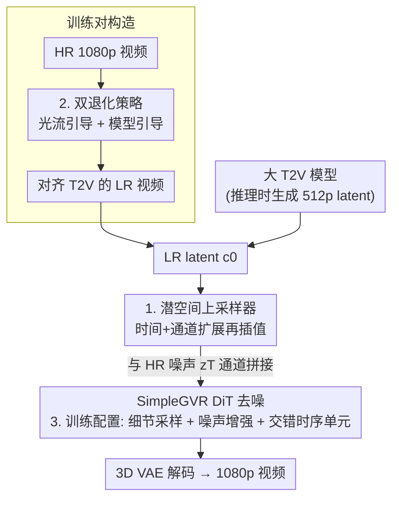

# SimpleGVR: A Simple Baseline for Latent-Cascaded Generative Video Super-Resolution

**会议**: ICLR 2026  
**OpenReview**: [https://openreview.net/forum?id=ZnwBhBZhFb](https://openreview.net/forum?id=ZnwBhBZhFb)  
**代码**: 无（项目页提供视觉对比）  
**领域**: 视频生成 / 视频超分 / 扩散模型  
**关键词**: 级联视频生成, 潜空间超分, 退化建模, Rectified Flow, 长视频

## 一句话总结
SimpleGVR 把级联文生视频里的超分（VSR）阶段整体搬进潜空间，用一个"潜空间上采样器"消除冗余的解码/重编码，再用两套贴合 AIGC 特性的退化策略 + 三项训练优化，让一个轻量扩散 VSR 在 AIGC100 上全面超越现有方法，并让"512p + 超分"的级联方案在质量和速度上都打过端到端直出 1080p。

## 研究背景与动机

**领域现状**：当前高分辨率文生视频（T2V）主流走"级联"路线——先用一个强大的大 T2V 模型生成低分辨率视频（抓住语义和运动），再接一个轻量 VSR 模型补细节、升到 1080p。因为大 DiT 的全自注意力计算量随分辨率二次增长，单阶段直出 1080p 代价过高，级联是公认的高效折中。

**现有痛点**：作者观察到现有级联工作把"基模型"和"VSR 模型"当成两个松耦合的部件硬拼，存在两个具体问题。其一是**像素空间接口低效**：基模型输出的 latent 先被 VAE 解码成像素视频，再做视频级插值放大，然后又重新编码回 latent 喂给 VSR——这一来一回的解码/重编码纯属冗余开销，拖慢推理。其二是**退化策略不匹配**：VSR 一般用简单下采样核或两阶段退化方案训练，后者对真实低质视频有效，但用到 AIGC 内容上会产生严重伪影、甚至破坏深度感，因为大 T2V 的输出根本不像真实退化视频。

**核心矛盾**：基模型和 VSR 之间隔着一层"像素空间"，既浪费算力又制造分布鸿沟——VSR 训练时见到的退化（真实模糊/噪声/压缩）和推理时真正要修复的退化（T2V 输出的颜色串扰、运动模糊）是两回事。

**本文目标**：(1) 让 VSR 直接在 latent 上工作，砍掉解码/重编码；(2) 让 VSR 的训练数据真正贴合上游 T2V 输出的退化特性；(3) 在长视频、细节重建上把这个轻量模型调到可用。

**切入角度**：既然基模型本就在 latent 空间生成，VSR 也应该留在 latent 空间——但简单插值放大 LR latent 会丢局部细节，需要一个能保结构的潜空间上采样器；而退化要"模仿 T2V 自己的输出"，就该用 T2V 自己来造训练对。

**核心 idea**：把整条 VSR 流程放进潜空间（潜空间上采样器做条件注入）+ 用两套面向 AIGC 的退化（光流引导 + 模型引导）造对齐的训练对 + 三项训练配置兜底，做成一个"简单但强"的级联超分基线。

## 方法详解

### 整体框架
SimpleGVR 是一个轻量的扩散式 VSR 模型，整体建立在预训练 3D VAE 定义的潜空间上，采用 Rectified Flow（线性插值 $z_t=(1-t)z_0+t\epsilon$）训练。推理时，大 T2V 模型先产出一个 512p 的低分辨率 latent $c_0$；SimpleGVR 用**潜空间上采样器**把 $c_0$ 放大并保留版式结构，得到条件 latent $c$，再与一份随机初始化的高分辨率高斯噪声 $z_T$ 沿通道维拼接，喂进 DiT 块迭代去噪，最后把 $z_0$ 解码成 1080p 视频——全程不经过像素空间，省掉了"解码→插值→重编码"。

训练侧的关键是造出"贴合 T2V 输出"的 LR–HR 训练对：HR 视频经 VAE 得 $z_0$，LR 分支则由**两套退化策略**合成（光流引导退化模拟颜色串扰与运动模糊；模型引导退化用大 T2V 自身部分去噪生成），再编码为条件 latent $c_0$。两条支路各自注入不同强度的噪声（LR 分支噪声强度落在 $[0.3,0.6]$），训练 DiT 预测速度场。此外**三项训练配置**（细节感知时间步采样、噪声增强区间、交错时序单元）保证细节重建质量和长视频可处理。

### 关键设计

**1. 潜空间上采样器 + 通道拼接：在 latent 里保住版式再注入条件**

第一个痛点是像素空间接口冗余。SimpleGVR 选择让条件 latent $c_t$ 和噪声 latent $z_t$ 在 latent 内对齐，而通道拼接（channel concatenation）比 ControlNet、token 拼接都更省。但难点在于：$c_t$ 是 VAE 压缩后的低分辨率特征，直接双线性插值放大会丢局部细节、还会在时序上产生帧间信号混叠。作者的解法是一个**潜空间上采样器**：先用两个 3D 残差块**同时扩展通道维和时间维**，再做双线性插值，最后再用两个 3D 残差块把通道和时间维压回与 $z_t$ 匹配，即

$$x_t=\text{patchify}\big([z_t,\ \text{Res3D}(\text{Res3D}(\text{bilinear}(\text{Res3D}(\text{Res3D}(c_t)))))]_{\text{channel-dim}}\big).$$

其中最关键的是**插值前的时间维扩展**——让扩展后 latent 的每一帧都对应到 RGB 空间的一帧，从而避免空间放大时的帧间信号混叠。消融里专门对比了"只扩通道不扩时间（3D ResBlocks + latent 插值）"这个变体，证明少了时间扩展就保不住版式和语义；而相比单纯 latent 插值，先升到高维再插值能更准确地融合结构与运动，比 token 拼接也更好地保留版式信息。

**2. 双退化策略：用 T2V 自己的"毛病"造训练对**

第二个痛点是退化不匹配。作者先观察基 T2V 的输出（图 4）：它不像真实低质视频那样有严重模糊/噪声/压缩，而是两种**与运动耦合**的特征——帧间颜色串扰（前一帧的色相蹭进当前帧）和局部运动模糊。常规退化模型造不出这种效果，于是提出两条互补策略。**光流引导退化**用 DIS 光流估计相邻帧运动场：在大运动区域引入随机椭圆图样引导采样，把前一帧对应位置的色相按距离加权混进当前帧，模拟颜色串扰；同一运动场又生成自适应的分块模糊核（核的大小、朝向由局部运动向量决定），只在运动区域、沿运动方向施加模糊，静态区域保持锐利。**模型引导退化**受 SDEdit 启发：把 1080p 下采到 512p、编码成 $c_0$，按比例 $\alpha$ 混入高斯噪声，再用大 T2V 部分去噪生成 $\hat c_0$——$\alpha$ 越大越靠近 T2V 分布但结构对齐越弱，作者取 $\alpha\in[0.3,0.4]$ 在真实感和保真度间平衡。两套策略让训练对真正反映 T2V 输出的分布，VSR 才学到"从 T2V 输出域映到高质视频"的正确映射。

**3. 三项训练配置：把细节、噪声强度、长视频一次性补齐**

光有架构和退化还不够用，作者再补三项配置。其一是**细节感知时间步采样器**：用 DCT 提取每个去噪步预测干净信号 $\hat z_t^0$ 的高频系数 $H(\hat z_t^0)$，跨时间步求两两差得到"细节变化曲线"，发现细节增益主要发生在高/中噪声区、低噪声区几乎不贡献；于是把该曲线归一化成概率分布，训练时按此偏置采样时间步（推理仍均匀取步），比均匀采样更能重建高频细节。其二是**噪声增强区间**：LR 分支注入噪声的强度是关键超参，太大（$0.6\sim0.9$）模型会无视输入全局结构、形状色彩跑偏，太小（$0.0\sim0.3$）则过度忠实于有瑕疵的输入、无法纠正结构错误，只有中间区间 $0.3\sim0.6$ 能在"增强细节"和"纠正结构"间取得平衡。其三是**交错时序单元**：77 帧全注意力显存吃不消，于是先在 17 帧短片上训练，再用 Swin 风格的交错窗口扩到长序列——偶数块把序列沿时间切成四个不重叠窗口做注意力，奇数块把窗口沿时间轴平移半个窗宽以便跨窗信息交换，从而高效处理长视频又保住长程依赖。

### 损失函数 / 训练策略
训练沿用 Rectified Flow 的 Conditional Flow Matching 目标：$L_{\text{CFM}}=\mathbb{E}_{t,\epsilon,z_0}\big[\|(z_1-z_0)-v_\Theta(z_t,t,c_{\text{text}})\|_2^2\big]$，回归速度场 $v_\Theta$。整条训练分三阶段：① 从预训练 1B T2V 初始化，在 17 帧输入上用 RealBasicVSR 退化造对，训 20K 步；② 在 30K 条用本文退化策略合成的数据上微调 10K 步；③ 在前两阶段数据基础上，用交错时序单元把时序范围扩到 77 帧再微调 5K 步。全程用细节感知采样器、LR 分支噪声取自 $[0.3,0.6]$；16 卡、总 batch 32、AdamW、学习率 $5\times10^{-5}$，10% 概率替换为空文本以增强鲁棒性。

## 实验关键数据

### 主实验
测试集为自建 AIGC100（100 段 T2V 生成视频，无 GT 参考）与 VBench110；指标用 MUSIQ / CLIPIQA / MANIQA / DOVER 等无参考质量指标 + VBench 综合指标 + 光流 warping 误差 $E^*_{\text{warp}}$ 评时序一致性。

| 数据集 | 指标 | 本文 | 之前最佳 | 说明 |
|--------|------|------|----------|------|
| AIGC100 | MUSIQ | **62.35** | 60.34 (DOVE) | 单帧感知质量最高 |
| AIGC100 | CLIPIQA | **0.6768** | 0.6179 (SeedVR2) | 大幅领先 |
| AIGC100 | MANIQA | **0.4956** | 0.4591 (RealBasicVSR) | 最高 |
| AIGC100 | DOVER-Overall | **71.34** | 67.76 (STAR) | 整体视频质量最高 |
| AIGC100 | VBench 平均分 | **84.63** | 84.40 (MGLD) | 综合最高 |

### 消融实验

| 配置 | DOVER-Overall | 说明 |
|------|---------------|------|
| 上采样器 + 通道拼接（本文） | **61.25** | 完整注入方案 |
| 潜空间插值 + 通道拼接 | 59.34 | 多出一只耳朵等版式漂移 |
| Token 拼接 | 58.03 | 尾部不自然伪影 |
| 3D ResBlocks + 插值（只扩通道） | 59.43 | 缺时间扩展，保不住版式 |

| 退化设置（逐步叠加） | DOVER-Overall | MUSIQ |
|------|---------------|-------|
| 仅 RealBasicVSR 退化 | 61.25 | 62.06 |
| + 光流引导退化 | 63.41 | 61.89 |
| + 模型引导退化 | **69.64** | 62.19 |

时间步采样器消融（17 帧、20K 步）：均匀采样 DOVER-Overall 68.94 → 细节感知采样 **69.64**。

### 关键发现
- **模型引导退化贡献最大**：在光流退化基础上再叠加模型引导退化，DOVER-Overall 从 63.41 跳到 69.64，是各退化里增益最显著的一步——说明"用 T2V 自身造退化"比手工模拟运动伪影更能对齐上游分布。
- **时间维扩展不可省**：上采样器只扩通道不扩时间（59.43）明显差于同时扩时间（61.25），印证了"插值前时间扩展防帧间混叠"这一核心论断。
- **级联打过端到端**：相同大 T2V 下，"512p + SimpleGVR"级联方案在 AIGC100 上 DOVER-Overall 71.34 vs 端到端直出 1080p 的 62.32，且核心 DiT 处理时间从 950s 降到 283s——质量更好、速度快约 3.4×。
- **噪声强度有甜区**：LR 分支噪声增强落在 $0.3\sim0.6$ 才能兼顾"纠正结构错误"和"保住全局版式"，过大过小都翻车。

## 亮点与洞察
- **"留在 latent 里"这一刀切得很干净**：把 VSR 整条流程搬进潜空间，直接消掉解码/重编码这对冗余操作，是级联效率提升的关键，也顺带让条件注入可以用最省的通道拼接。
- **退化建模"以毒攻毒"**：与其费力手工模拟 T2V 的颜色串扰/运动模糊，不如直接拿 T2V 自己部分去噪来造退化（模型引导退化），让训练分布天然对齐推理分布——这个思路可迁移到任何"修复某生成模型自身输出"的任务。
- **细节感知采样器有据可依**：用 DCT 高频系数随时间步的变化曲线来决定采样概率，把"哪些时间步在补细节"量化出来，而不是拍脑袋设采样分布，是个可复用的诊断+优化技巧。
- **Swin 式交错时序单元**把短视频模型平滑扩到长视频，训练/推理都用，工程上很实用。

## 局限与展望
- 作者承认 50 步推理仍有冗余，未来要压缩推理步数提速（当前 283s 仍非实时）。
- 退化策略里的若干超参（$\alpha\in[0.3,0.4]$、噪声区间 $[0.3,0.6]$、椭圆/模糊核参数）是经验调出来的，是否随不同基 T2V 模型迁移、需不需要重调，文中未充分讨论。
- 评测全用无参考指标（无 GT），AIGC100 又是自建测试集，绝对数值的横向可比性需谨慎；不同方法在不同 VBench 子项上互有高低，平均分领先幅度（84.63 vs 84.40）其实不大。
- 方法强绑定"先有一个大 T2V 输出 latent"的级联设定，对非级联或换 VAE/换 latent 空间的场景适配性未知。

## 相关工作与启发
- **vs FlashVideo**：同为级联架构，但 FlashVideo 的条件 latent $c_0$ 来自"上采过的 LR 视频"，SimpleGVR 的 $c_0$ 直接来自原始 LR 视频并在 latent 内用上采样器处理，省掉像素空间往返；视觉上 SimpleGVR 细节更真实。
- **vs RealBasicVSR / 两阶段退化方案**：它们面向真实低质视频的退化（模糊/噪声/压缩），用到 AIGC 内容上会产生伪影；本文用光流引导 + 模型引导退化专门对齐 T2V 输出的颜色串扰与运动模糊。
- **vs SeedVR / STAR / DOVE 等 VSR**：这些方法多在像素空间或松耦合接口上做超分，SimpleGVR 强调"全程 latent + 与上游紧耦合"，在 AIGC100 的感知质量指标上全面领先。
- **vs SDEdit**：模型引导退化借鉴了 SDEdit"加噪再部分去噪"的思路，但目的相反——不是编辑图像，而是用生成模型主动制造贴合自身分布的退化样本。

## 评分
- 新颖性: ⭐⭐⭐⭐ 潜空间上采样器 + 模型引导退化的组合切中级联 VSR 的两大痛点，思路清晰
- 实验充分度: ⭐⭐⭐⭐ 主结果 + 多组消融 + 端到端对比都有，但全靠无参考指标和自建测试集
- 写作质量: ⭐⭐⭐⭐ 动机—方法—验证逻辑顺，图表配套；部分超参选择交代偏经验
- 价值: ⭐⭐⭐⭐ 给级联视频超分立了个"简单但强"的可复现基线，工程实用性强

<!-- RELATED:START -->

## 相关论文

- [\[CVPR 2026\] VSRELL: A Simple Baseline for Video Super-Resolution and Enhancement in Low-Light Environment](../../CVPR2026/video_generation/vsrell_a_simple_baseline_for_video_super-resolution_and_enhancement_in_low-light.md)
- [\[ICML 2026\] LuVe: Latent-Cascaded Ultra-High-Resolution Video Generation with Dual Frequency Experts](../../ICML2026/video_generation/luve_latent-cascaded_ultra-high-resolution_video_generation_with_dual_frequency_.md)
- [\[ICLR 2026\] Generative View Stitching](generative_view_stitching.md)
- [\[ICLR 2026\] Arbitrary Generative Video Interpolation](arbitrary_generative_video_interpolation.md)
- [\[CVPR 2026\] Compressed-Domain-Aware Online Video Super-Resolution](../../CVPR2026/video_generation/compressed-domain-aware_online_video_super-resolution.md)

<!-- RELATED:END -->
