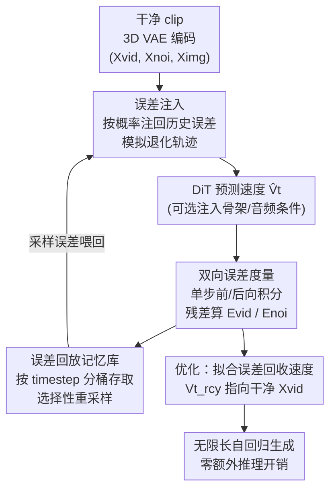

# Stable Video Infinity：用「误差回收」实现无限长视频生成

**会议**: ICLR 2026  
**OpenReview**: [https://openreview.net/forum?id=X96Ei9n34a](https://openreview.net/forum?id=X96Ei9n34a)  
**项目页**: [https://stable-video-infinity.github.io/homepage/](https://stable-video-infinity.github.io/homepage/)  
**领域**: 视频生成 / 扩散模型  
**关键词**: 长视频生成, 误差累积, 流匹配, 自回归生成, LoRA 微调

## 一句话总结
针对长视频自回归生成中「训练假设干净输入、测试却条件于自己生成的含误差帧」这一根本鸿沟，本文提出 Error-Recycling Fine-Tuning：把 DiT 自己犯的误差收集进记忆库、再注回干净输入去模拟退化轨迹，逼模型主动纠错，从而以零额外推理开销把视频从几秒拉到「无限长」，并在一致/创意/条件三类基准上取得 SOTA。

## 研究背景与动机

**领域现状**：视频 Diffusion Transformer（DiT，如 Wan、Hunyuan）已能生成逼真、时序连贯的短视频，但普遍卡在约 5 秒长度。要做更长的视频，主流是自回归地「用上一段生成的最后几帧当参考图，接着生成下一段」。

**现有痛点**：这种自回归会引发 **误差累积（drifting）**——一旦条件于含误差的历史帧，预测误差会逐段复合放大，导致画质、运动稳定性、语义可控性渐进崩坏。现有缓解方案分三类：① 改噪声调度器降低对历史帧的依赖；② 用干净参考图做帧锚定；③ 改采样策略（如 masked-noise guidance、anti-drifting sampling）。但它们都只是**缓解而非纠正**误差，于是有两个硬伤：长度仍受限（一般 10 秒到约 1 分钟），且只能在单一 prompt 下外推，画面同质、动作重复，无法做需要频繁换场的故事片或小时级演示。

**核心矛盾**：作者点出真正的病根不只是「误差会累积」，而是**训练与测试之间的假设鸿沟（hypothesis gap）**——训练时流匹配假设历史轨迹是干净无误差的（见到的是 clean data），而测试时模型自回归地条件于自己生成的、带误差的输出。一个反直觉现象佐证了这点：误差造成的伪影（模糊、偏色）本质上就是图像复原领域常见的退化类型，按理 14B 的大 DiT 应该轻松搞定，可它们反而对这些误差极度脆弱、快速崩溃——因为它从没在训练里见过含误差的输入。

**本文目标**：不治标（缓解误差影响）而治本（让模型主动纠正误差本身），把视频长度从秒级推到无限，同时支持逐段 prompt 控制和音频/骨架等多模态条件。

**切入角度**：对比生成式 DiT 和复原式 DiT——后者训练和测试都假设含误差输入，因而天生鲁棒。那么只要让生成式 DiT 在训练时也「见到」自己将来会犯的误差，就能解锁它本就具备的复原能力。

**核心 idea**：把 DiT 自己生成的误差「回收」成监督信号（recycling self-generated errors as supervisory prompts），通过自回归的误差反馈，逼模型学会识别并纠正自己的错误。

## 方法详解

### 整体框架

SVI 的核心是 **Error-Recycling Fine-Tuning（ERFT，误差回收微调）**：一个闭环的 LoRA 微调流程，只用 300–6k 段短视频就能把现成视频 DiT 改造成能无限延长的版本，且推理阶段零额外开销。

整条管线围绕「制造误差 → 度量误差 → 存取误差 → 用误差监督」展开。给定一段干净视频 clip，先用 3D VAE 编码出干净视频 latent $X_{vid}$、噪声 $X_{noi}$ 和参考图 latent $X_{img}$；然后（a）按概率把记忆库里采样出的历史误差注入这三者，得到含误差输入 $\tilde X_{vid}, \tilde X_{noi}, \tilde X_{img}$，人为打破「干净训练」假设；（b）让 DiT 在含误差输入上预测速度 $\hat V_t$，再用**单步双向积分**廉价地近似出预测 latent 并算出本次误差；（c）把算出的误差按 timestep 动态存进**回放记忆库**，供下一轮重采样。最后用一个指向干净 latent 的「误差回收速度」$V_t^{rcy}$ 作监督目标优化 LoRA。三步首尾相接，形成闭环。

### 关键设计

**1. 误差注入：把测试时才出现的退化提前搬进训练**

这一步直接针对「训练只见干净输入、测试却条件于含误差帧」的核心矛盾。作者把测试时会出现的两类误差——单段预测误差 $E$ 和跨段条件误差——对应地设计成三种可注入误差 $E_{vid}, E_{noi}, E_{img}$，从记忆库采样后按概率注回干净输入：

$$\tilde X_{vid} = X_{vid} + I_{vid}\cdot E_{vid},\quad \tilde X_{noi} = X_{noi} + I_{noi}\cdot E_{noi},\quad \tilde X_{img} = X_{img} + I_{img}\cdot E_{img}$$

其中 $I_*=1$ 的概率为 $p_*$、否则为 0，用随机开关模拟「误差可能在任意推理 timestep 以任意组合出现」的复杂性。关键巧思是保留 $p=0.5$ 的概率仍用干净输入，让模型既学纠错、又不丢失原本的生成能力。注入后得到含误差噪声 latent $\tilde X_t = t\tilde X_{vid} + (1-t)\tilde X_{noi}$，与含误差参考图拼接后送入 DiT。这一注入从根上破掉了式（1）的干净假设，是弥合鸿沟的源头。此外该步可顺带挂上控制信号：空间类条件 $C_{vis}$（如骨架）在 token 输入处逐元素相加，嵌入类条件 $C_{emb}$（如文本、音频）经专门的交叉注意力层注入，于是同一框架能扩展成 SVI-Talk、SVI-Dance 等一族模型。

**2. 双向误差度量：单步积分廉价地算出「这次错了多少」**

注入误差后还要知道模型这次到底偏了多少，但解完整 ODE 代价过高。作者用**单步双向积分**近似预测：以含误差 latent $\tilde X_t$ 和预测速度 $\hat V_t$ 为起点，前向积分得到视频 latent $\hat X_{vid}=\tilde X_t+\int_t^1 V_s\,ds$，后向积分得到条件噪声 $\hat X_{noi}^{img}=\tilde X_t-\int_0^t V_s\,ds$；同样对**误差回收速度** $V_t^{rcy}$（定义为始终指向干净 $X_{vid}$、与历史轨迹和当前状态无关的「理想速度」）积分得到 $X_{vid}^{rcy}, X_{noi}^{rcy}$。误差就是二者残差，统一写成 $E_{vid}=\hat X_{vid}-X_{vid}^{rcy}$、$E_{noi}=\hat X_{noi}^{img}-X_{noi}^{rcy}$、$E_{img}=\mathrm{Unif}_T(E_{vid})$。论文进一步按「无注入 / 起点注入 / 终点注入」三种情形展开，分别对应初始单段预测误差、跨段条件误差、以及二者累积的退化场景，证明该统一公式都成立。这样既避开了 ODE 全解的开销，又能在任意 timestep 拿到可回收的真实误差。

**3. 误差回放记忆库：按 timestep 分桶存取，让误差分布贴近测试**

算出的误差需要被复用才能形成闭环。作者把 $E_{vid}, E_{noi}$ 分别存进两个记忆库 $B_{vid}, B_{noi}$，并按 timestep 对齐分桶：训练 timestep 通常 $N_{tra}=1000$，先离散对齐到测试用的 $N_{test}=50$ 个网格，每个误差按最近网格存进对应槽位。为对抗单卡样本少导致的更新慢，借鉴联邦学习做**跨机收集 warmup**；为控内存设上限 $Z=500$，桶满时按 L2 距离替换掉最相似的旧误差以保多样性。取用时则做**选择性重采样**：$E_{vid}$ 从 timestep 对齐的桶 $B_{vid,n}$ 均匀采（退化类型与采样步强相关）；$E_{noi}$ 同步从 $B_{noi,n}$ 采（噪声与 latent 的对偶性）；而 $E_{img}$ 跨所有 timestep 从视频库采——因为参考图是跨段自回归里「上一段生成帧当下一段参考」，误差是整条轨迹积分累积的，得用跨步采样模拟这种复杂性。三类误差各按其物理角色取样，让训练分布精准逼近测试分布。

### 损失函数 / 训练策略

最终优化目标是让 DiT 从含误差输入预测出指向干净 latent 的误差回收速度 $V_t^{rcy}=X_{vid}-\tilde X_{noi}$：

$$L_{SVI} = \mathbb{E}_{\tilde X_{vid}, \tilde X_{noi}, \tilde X_{img}, C, t}\,\big\|u(\tilde X_t, \tilde X_{img}, C, t;\theta) - V_t^{rcy}\big\|^2$$

只训练 LoRA（数据轻、可灵活切换），不动主干。三类误差注入概率为 $E_{img}, E_{vid}, E_{noi}$ 分别约 0.9、0.9、0.01。由于纠错能力直接学进权重，推理时无需任何额外步骤或开销。

## 实验关键数据

在三类基准（一致 consistent / 创意 creative / 条件 conditional）上评测，核心指标取自 Vbench++（6 个），条件生成另用 Sync-C/Sync-D/FVD/PSNR/SSIM。

### 主实验

一致性视频生成（单 prompt、50 秒与 250 秒超长），SVI-Shot 在大多数核心指标上最优：

| 设置 | 指标 | SVI-Shot | FramePack | Wan 2.1 |
|------|------|----------|-----------|---------|
| 50 秒 | Scenes Consistency | **98.13%** | 93.08% | 87.03% |
| 50 秒 | Subject Consistency | **98.19%** | 94.72% | 92.45% |
| 250 秒超长 | Scenes Consistency | **97.50%** | 79.37% | 80.00% |
| 250 秒超长 | Subject Consistency | **97.89%** | 86.64% | 87.27% |

关键看**超长退化幅度**：从 50 秒延到 250 秒，Wan 2.1 和 FramePack 的 Subject Consistency 分别掉 7.03% 和 13.71%，而 SVI 仅掉 0.63%，几乎不退化。条件生成同样领先：

| 任务 | 指标 | SVI | 次优 |
|------|------|------|------|
| 音频长对话（300 秒） | Sync-C ↑ / FVD ↓ | **6.12 / 390** | MultiTalk 1.26 / 520 |
| 骨架长舞蹈（50 秒） | PSNR ↑ / FVD ↓ | **20.01 / 299** | UniAnimate-DiT 18.97 / 337 |

创意生成（带换场的 prompt stream）上，现有长视频方法基本全部失败（无法生成片级换场），SVI-Film 能端到端按故事线生成并保持一致性与合理动态。

### 消融实验

逐项去掉三类误差注入（Table 4）：

| 配置 | Scene Cons. | Subject Cons. | Background Qual. | 说明 |
|------|-------------|---------------|------------------|------|
| Wan 2.1（基线） | 66.73% | 82.83% | 43.95% | 无 ERFT |
| SVI w/o $E_{img}$ | 73.82% | 84.21% | 49.58% | 去图像误差，掉最多 |
| SVI w/o $E_{noi}$ | 94.22% | 94.87% | 59.80% | 去噪声误差，影响小 |
| SVI w/o $E_{vid}$ | 93.56% | 95.01% | 58.99% | 去 latent 误差 |
| SVI full | **94.69%** | **95.39%** | **61.88%** | 完整 |

### 关键发现
- **图像误差 $E_{img}$ 贡献最大**：去掉它 Scene Consistency 从 94.69% 暴跌到 73.82%，印证了跨段条件误差（上一段生成帧当下一段参考）才是长视频崩坏的主因，必须重点建模。
- $E_{noi}$ 注入概率仅 0.01 却仍保留，体现噪声-latent 对偶性是理论完整性需要，但对最终质量影响最小。
- SVI 随视频变长几乎不退化（Fig. 5），而对照方法随长度明显下滑，说明「主动纠错」比「缓解依赖」在长程上更稳。

## 亮点与洞察
- **把误差当资产而非负担**：传统思路是想方设法躲开误差，本文反过来主动收集、回放、注入误差当监督信号，呼应了开篇 Henry Ford 的「失败是更聪明地重来的机会」——这种「误差回收」的视角很有迁移价值。
- **训练-测试假设鸿沟的精准诊断**：把长视频崩坏从「误差累积」这一表象，重新归因到生成式 DiT 与复原式 DiT 在训练假设上的本质差异，这个 reframing 让解法自然浮现（让生成模型也见到含误差输入）。
- **单步双向积分的工程巧思**：用一步前/后向积分近似预测、以残差算误差，绕开 ODE 全解，让误差度量的代价可控，是把理论目标落地为可训练流程的关键。
- **零额外推理开销 + 模型族扩展**：纠错能力直接学进 LoRA 权重，推理不加任何步骤；同一框架挂不同条件即可派生 SVI-Shot/Film/Talk/Dance，工程上很友好。

## 局限与展望
- 误差回放记忆库设了上限 $Z=500$ 并靠跨机 warmup，记忆库的容量与更新策略可能影响误差多样性，对超大规模训练的扩展性还需验证。
- 三类误差注入概率（0.9/0.9/0.01）是经验设定，未见对这些超参的系统敏感性分析，换主干或换任务时可能需重调。
- 评测主要依赖 Vbench++ 等自动指标，长程视频的语义连贯与叙事质量缺少大规模人评佐证。
- 单步积分是对真实多步 ODE 轨迹的近似，在误差极端剧烈的场景下近似误差是否会引入偏置，论文未深入讨论。

## 相关工作与启发
- **vs 改噪声调度器（如 FramePack 之外的 noise modification）**: 它们改噪声调度降低对历史帧依赖，本质仍是缓解；本文直接在训练里注入并纠正误差，治本而非治标，超长退化幅度从两位数降到 0.63%。
- **vs 帧锚定（StreamingT2V）**: 用干净参考图当锚来稀释误差影响，但只能单 prompt 外推、画面同质；SVI 支持 prompt stream 换场，能做创意故事片。
- **vs anti-drifting 采样（FramePack）**: 在采样阶段抑制漂移，不改训练假设；SVI 从训练阶段弥合假设鸿沟，且推理零额外开销，超长一致性显著更高。
- **vs 复原式 DiT**: 复原 DiT 天生在含误差输入上训练，本文正是借鉴这一点，把生成 DiT 也暴露在自生成误差下，解锁其潜在复原能力。

## 评分
- 新颖性: ⭐⭐⭐⭐⭐ 「回收自生成误差当监督」的视角新颖，对长视频崩坏的归因重构很有洞察。
- 实验充分度: ⭐⭐⭐⭐ 三类基准 + 多模态条件 + 误差项消融较全面，但缺人评与超参敏感性分析。
- 写作质量: ⭐⭐⭐⭐ 理论推导（两类误差、双向积分）清晰，图示到位。
- 价值: ⭐⭐⭐⭐⭐ 零额外推理开销实现无限长生成，且可扩展成模型族，实用价值高。

<!-- RELATED:START -->

## 相关论文

- [\[CVPR 2026\] Video Generation with Stable Transparency via Shiftable RGB-A Distribution Learner](../../CVPR2026/video_generation/video_generation_with_stable_transparency_via_shiftable_rgb-a_distribution_learn.md)
- [\[CVPR 2026\] Infinity-RoPE: Action-Controllable Infinite Video Generation Emerges From Autoregressive Self-Rollout](../../CVPR2026/video_generation/infinity-rope_action-controllable_infinite_video_generation_emerges_from_autoreg.md)
- [\[NeurIPS 2025\] Stable Cinemetrics: Structured Taxonomy and Evaluation for Professional Video Generation](../../NeurIPS2025/video_generation/stable_cinemetrics_structured_taxonomy_and_evaluation_for_professional_video_gen.md)
- [\[ICML 2026\] Attention Sparsity is Input-Stable: Training-Free Sparse Attention for Video Generation via Offline Sparsity Profiling and Online QK Co-Clustering](../../ICML2026/video_generation/attention_sparsity_is_input-stable_training-free_sparse_attention_for_video_gene.md)
- [\[ICLR 2026\] Streaming Autoregressive Video Generation via Diagonal Distillation](streaming_autoregressive_video_generation_via_diagonal_distillation.md)

<!-- RELATED:END -->
