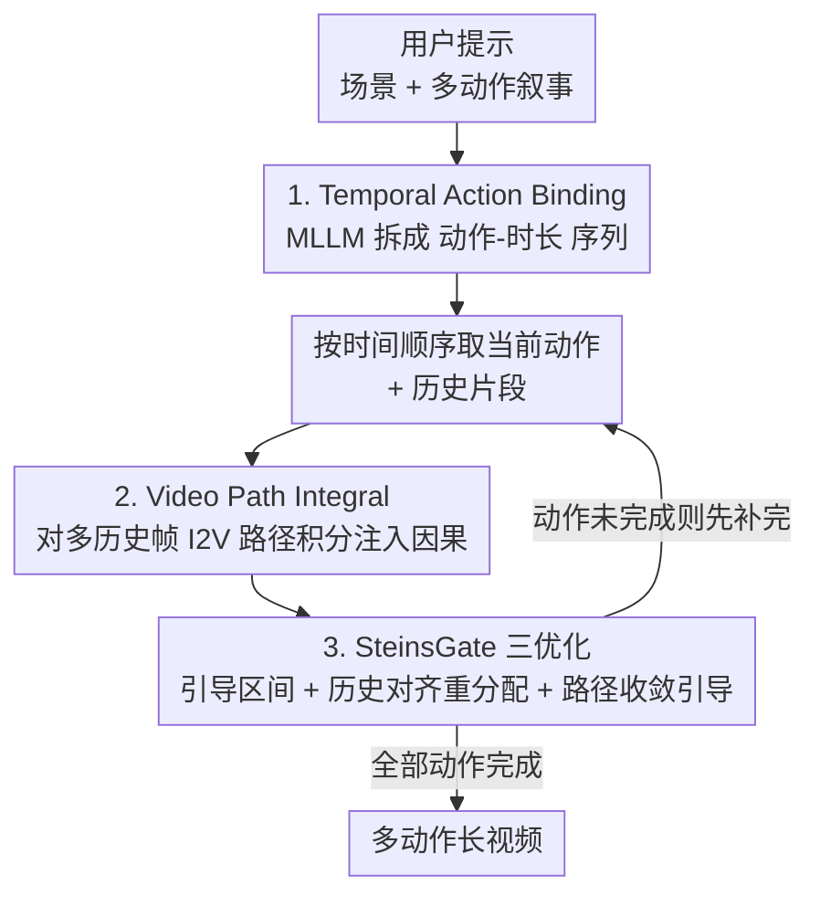

# SteinsGate: 用路径积分为扩散模型注入因果性以生成长视频

**会议**: ICLR 2026  
**OpenReview**: [https://openreview.net/forum?id=8WS5nDWIWE](https://openreview.net/forum?id=8WS5nDWIWE)  
**代码**: 无  
**领域**: 视频生成 / 扩散模型 / 长视频  
**关键词**: 长视频生成, 时序因果, 路径积分, 自回归视频续写, 推理时引导

## 一句话总结
本文提出 InstructVC 框架与其推理时实例 SteinsGate，用 MLLM 把长提示拆成「动作—时长」序列做细粒度时序控制，再用一个全新的 **Video Path Integral**（视频路径积分）把预训练 TI2V 扩散模型在推理时改造成"历史感知"的自回归续写模型，从而生成动作连贯、过渡自然的多动作长视频。

## 研究背景与动机

**领域现状**：当前主流视频扩散模型（Wan、CogVideoX、Mochi 等 DiT 架构）只能生成几秒的短片，离真实叙事所需的长度差得很远。要做长视频，现有路线分两类：一是 **temporal expanding**（扩大 token 容量、频域分解，如 FreeLong），但只能边际延长；二是 **temporal decomposition**（把长视频拆成短片段），又分 temporal co-denoising（重叠区域同步去噪、强制相邻片段相关）和 I2V-AR（只用上一段最后一帧自回归续写）。

**现有痛点**：这些方法都**不建模时序因果**。co-denoising 只强制相邻片段"相关"而非"因果"，两段独立生成、在重叠区动作方向可能完全冲突；I2V-AR 只看最后一帧，丢掉了之前片段的运动动态，导致动作反向、时序断裂。更糟的是，它们只建模相邻片段的局部依赖，忽略全局因果规划，多动作时会出现动作缺失、顺序错乱。

**核心矛盾**：视频本质上是**有时序、有因果**的序列，但扩散模型把视频当作"3D 图像"来处理，空间域的局部到全局引导技巧（如 Reconstruction Guidance）**无法迁移到时间域**——即使生成视频能完美重建历史帧，续写部分仍与历史脱节，说明时序结构没有被正确建模。

**本文目标**：把长视频生成重新表述为一个**翻译任务**——像文本翻译那样，按源文本的逻辑顺序自回归地生成目标视频，显式要求跨动作的时序因果与连续性。它分解为两个子问题：(1) 细粒度时序控制（每个动作放到因果时间轴上、给出时长）；(2) 自然的长期模拟（按时间顺序续写，前一个动作没做完就先补完）。

**切入角度**：I2V 模型天然具有**空间—时间解耦**特性——它把运动注入首帧、再向前传播空间信息。作者由此想到：与其只用一帧，不如**对多个历史帧的 I2V 路径做积分**，让与历史一致的轨迹相互增强、不一致的被稀释，从而把时间信息也传播进续写。

**核心 idea**：用「Temporal Action Binding（MLLM 拆动作）+ Video Path Integral（路径积分注入因果）」在**推理时**给预训练扩散模型加上时序因果，无需训练即插即用。

## 方法详解

### 整体框架

SteinsGate 是 InstructVC 框架的推理时实例。给定用户提示 $P=[c_{txt}, c_{img}, \{a_i\}_{i=1}^N]$（场景描述、可选首帧、有序动作描述），整个流程分两阶段：**第一阶段像"演员"**，用 MLLM 把提示规划成带时长的动作剧本（Temporal Action Binding）；**第二阶段像"摄影"**，按剧本沿时间轴自回归地把每个动作渲染成视频（Causal Video Continuation）。第二阶段的因果性靠核心技术 Video Path Integral 实现，再叠加三个工程优化（即 SteinsGate）让它高效可用。整体把"文本叙事"按因果顺序翻译成"视频叙事"。

### 关键设计

**1. Temporal Action Binding：用 MLLM 把长提示拆成带时长的因果动作序列**

针对"现有方法假设所有提示等时长、导致动作被跳过/重复/不完整"的痛点，本文让 MLLM 充当时序动作绑定的执行器：把用户提示扩写并分解成「场景+角色描述」加上「一串动作—时长对」$\{(a_i, d_i)\}$，把笼统的动作解耦成全局因果的动作序列。直接用 MLLM 会幻觉——分解出的动作序列语言上通顺，但物理上不合理、偏离 TI2V 基座的训练数据分布，造成 OOD 提示和差画质。为此采用 **in-context learning**：从视频密集字幕数据集（MinT 等，提供真实动作序列与时长）取多动作示例喂给 MLLM，引导它用世界知识做更真实的绑定。给动作绑定显式时长——就像游戏里按住方向键控制精确移动——能减少幻觉、实现细粒度时序控制，为后续因果续写打基础。

**2. Video Path Integral：对多个历史帧的 I2V 路径做积分以传播时序因果**

这是全文的核心。要建模视频序列联合分布，按链式法则并做一阶马尔可夫近似得 $p(z_{1:N})\approx\prod_{i=1}^N p(z_i\mid z_{i-1})$，又因相邻片段共享重叠历史区 $z_h$，简化为 $p_\theta(z_i\mid z_{i-1})\approx p_\theta(z_i\mid z_h)$。直接把它当成"空间逆问题"用 Reconstruction Guidance（沿梯度 $\nabla_{z_t}\log p(z_h|z_t)=\nabla_{z_t}\|z_h-\hat z_h\|_2^2$ 重建历史区）行不通——能重建历史却续写脱节。作者的解法是定义 I2V 模型从某历史帧出发产生的视频分布为 **I2V Video Path**，并在多步采样中对所有历史帧的 I2V 向量场做积分：

$$v_\theta(z_t, t\mid z_h)=\int_{i=0}^{H} w_t(v_\theta)\,\hat v_\theta(z_t,t\mid x_i)\,dx_i \approx \sum_{j=1}^{K} w_t(v_\theta)\,\hat v_\theta(z_t,t\mid x_j)$$

其中 $\{x_j\}_{j=1}^K$ 是出于帧率与效率从 $H$ 个历史帧里蒙特卡洛采样的子集，$\hat v_\theta$ 是把生成轨迹中对应历史段替换成带噪真实历史 $z_h^t$ 后预测的速度（给图像条件补上动态/时间信息）。妙处在于**时间的嵌套结构**：从历史帧 $x_j$ 出发的 I2V 路径已经隐含了 $x_{j+1}$ 之后的路径，对所有历史帧积分时，与整段历史一致（即满足时序因果）的轨迹会相互增强，不一致的会被逐渐稀释——这与量子物理中的路径积分同构，正确宏观轨迹上路径相长、错误路径相消。从概率/采样两个视角看，历史条件分布被近似为各帧条件分布之积，从而可用组合式生成（$\nabla_{z_t}\log p(z_i^t\mid z_h)\approx\sum_j\nabla_{z_t}\log p(z_i^t\mid x_j)$）来采样，把 I2V 从 Image-to-Video 扩展成 History-to-Future。

**3. SteinsGate 三项优化：让路径积分高效、对齐历史、降低估计误差**

Video Path Integral 需要反复算速度、且组合式生成有估计误差，本文加三个即插即用的增强。**(a) Guidance Interval（引导区间）**：只在高噪声阶段（视觉结构与运动主要被决定的时期，$t\le t_{mid}$，通常 $t_{mid}=0.3$）施加路径积分，后期细化阶段直接用最后一帧的 I2V 向量场，从而把推理时间砍半还几乎不掉点。**(b) History-aligned Redistribution（历史对齐重分配）**：不同历史帧的 I2V 路径与历史的重叠长度不同，作者用 **Motion-Aware History Shifting** 按"预测历史轨迹"与"真实历史"的运动相似度加权，$w_t(v_\theta(z_t,t\mid x_j))=\cos\text{-sim}\langle m^{v_\theta}_{j:H}, m^{z_H}_{j:H}\rangle$，其中运动向量 $m_{j:H}=z_{j+1:H}-z_{j:H-1}$，避免静态区域和重叠长度差异的干扰，把中间分布偏向与历史一致的方向。**(c) Path Convergence Guidance（路径收敛引导）**：借鉴 AutoGuidance，把"最后一帧 I2V 速度（无因果）"当弱模型、"路径积分结果"当强模型，用其差值 $v_{pcg}=v_\theta(z_t\mid z_h)-v_\theta(z_t\mid x_{last})$ 做由弱到强的引导。最终采样速度结合 CFG：

$$v_\theta^*=\begin{cases} v_\theta^{last}+w_1 v_{pcg}+w_2\big(v_\theta(z_t\mid x_{last})-v_\theta(z_t\mid x_{last},\varnothing)\big) & t\le t_{mid}\\[4pt] v_\theta^{last}+w_2\big(v_\theta(z_t\mid x_{last})-v_\theta(z_t\mid x_{last},\varnothing)\big) & t> t_{mid}\end{cases}$$

其中 $w_1,w_2$ 通常取 1.5 与 5.0。续写过程遵循 ODE：$dz_t=v_\theta^*(z_t,z_h,x_{1:K})\,dt$，$z_0=\epsilon\sim\mathcal N(0,I)$。

### 一个完整示例

以历史提示「男人用右手伸向黑色杯子并平稳举起」生成历史视频，接着续写两条提示「男人慢慢啜一口，再轻轻放回桌面」「右手收回后，男人继续在笔记本上打字」。SteinsGate 先用 MLLM 把它绑成带时长的动作序列；续写时 Video Path Integral 从历史轨迹（手已经举到嘴边）出发积分，发现"放回桌面"这条与历史运动方向一致的路径被增强，于是先**完成当前未完动作**（喝完、放回），再平滑过渡到"打字"。对比之下 I2V-AR 只看最后一帧常把运动方向判反，SDEdit/RG-Flow 则在历史与续写之间产生跳变。

## 实验关键数据

### 主实验
基座为 WanVideo 2.1；基准 InstructVC Benchmark 由 MinT、StoryBench 的密集字幕扩写而成，并用 VBench 短提示扩充。指标：CSCV（Clip Similarity Coefficient of Variation，衡量过渡平滑度）、Motion Smoothness（VBench，运动是否平滑合理）、Text-Image Alignment（CLIP 相似度）。

| 方法 | 类型 | CSCV↑ | Motion Smoothness↑ | Text-Image Align↑ |
|------|------|-------|--------------------|--------------------|
| DiTCtrl | 时序协同去噪 | 0.76 | 0.93 | 0.31 |
| SkyReel-V2 | 训练式 diffusion-forcing | 0.83 | 0.96 | 0.34 |
| MAGI-1 | 训练式 diffusion-forcing | 0.82 | 0.96 | 0.33 |
| FIFO | 免训练 | 0.71 | 0.89 | 0.29 |
| **SteinsGate** | **推理时（本文）** | **0.82** | **0.97** | 0.32 |

SteinsGate 作为**免训练推理时**方法，CSCV/Motion Smoothness 已逼近甚至持平昂贵的训练式 diffusion-forcing 模型（SkyReel-V2、MAGI-1），并明显优于其它免训练方法（FIFO、DiTCtrl）。

### 消融实验

| 配置 | CSCV↑ | Motion Smoothness↑ | 说明 |
|------|-------|--------------------|------|
| SteinsGate（Full） | 0.82 | 0.97 | 完整模型 |
| w/o VPI | 0.74 | 0.94 | 去掉路径积分（退回 I2V-AR），掉点最多 |
| w/o GI | 0.81 | 0.97 | 去引导区间，性能几乎不变但推理变慢一倍 |
| w/o HR | 0.79 | 0.95 | 去历史对齐重分配 |
| w/o PCG | 0.78 | 0.96 | 去路径收敛引导 |

### 关键发现
- **Video Path Integral 是性能主力**：去掉它（w/o VPI，退化成 I2V-AR）CSCV 从 0.82 跌到 0.74、Motion Smoothness 从 0.97 跌到 0.94，验证了"对多历史帧路径积分"才是注入时序因果的关键。
- **Guidance Interval 是纯效率优化**：去掉它（w/o GI）指标几乎不变（0.81/0.97），但推理时间翻倍——说明只在高噪声阶段做路径积分能"近乎免费"地省一半算力。
- **Temporal Action Binding 决定时序控制**：把多动作提示直接拼接、时长均分（w/o Action Binding）会跳过或错排动作、造成断裂，凸显 MLLM 做动作—时长绑定的必要性。
- SteinsGate 还保留了基座模型能力，能生成动画、CG 电影等多种风格的长视频。

## 亮点与洞察
- **把量子物理的路径积分搬进视频扩散**：用"路径相长/相消"的直觉解释为什么对多历史帧积分能筛出与历史因果一致的轨迹，是一个非常优雅的类比，也给"时间嵌套结构"提供了可计算的实现。
- **诊断出空间引导不能迁移到时间域**：作者明确指出"能完美重建历史帧 ≠ 时序结构正确"，这个 negative 观察本身就很有价值，澄清了把视频当 3D 图像的根本局限。
- **完全推理时、即插即用**：无需训练就能把任意预训练 TI2V 扩散模型改造成因果自回归续写器，工程上极易落地；其"弱模型（最后一帧 I2V）→ 强模型（路径积分）做弱到强引导"的思路可迁移到其它需要注入约束的扩散采样任务。

## 局限与展望
- 作者承认的主要局限是**长期一致性**：本文聚焦时序因果连续，保持长程一致性依赖于选取合适的历史长度，这本身是个高难度方向。
- 自己发现的局限：Video Path Integral 需对 $K$ 个历史帧重复算速度，即便有 Guidance Interval，开销仍高于单纯 I2V-AR；$K$、$t_{mid}$、$w_1/w_2$ 等超参对效果敏感但论文未给系统的敏感性分析。
- 评测主要用 CSCV/Motion Smoothness/CLIP 等代理指标 + 定性对比，缺乏大规模人评；InstructVC Benchmark 由模型扩写提示构成，与真实创作分布的差距未充分讨论。

## 相关工作与启发
- **vs temporal co-denoising（DiTCtrl/Gen-L-Video）**：它们对重叠区同步去噪只强制"相关"，本文用路径积分强制"因果"，避免相邻片段动作方向冲突。
- **vs I2V-AR**：它只条件于最后一帧、丢失历史动态，本文对多历史帧积分把时间信息也传播进续写，解决运动反向问题。
- **vs Reconstruction Guidance / SDEdit（空间引导）**：它们把续写当空间逆问题，能重建历史却时序脱节；本文证明时间域需要专门的路径积分式引导。
- **vs 训练式 diffusion-forcing（SkyReel-V2/MAGI-1）**：它们要训练，本文是免训练推理时方法，却能达到可比的过渡平滑度与运动质量。

## 评分
- 新颖性: ⭐⭐⭐⭐⭐ 路径积分注入时序因果的视角新颖且自洽，对"空间引导不可迁移到时间域"的诊断很有洞见
- 实验充分度: ⭐⭐⭐⭐ 主结果 + 完整消融到位，但缺人评与超参敏感性分析
- 写作质量: ⭐⭐⭐⭐ 物理类比讲得清楚，公式完整；部分推导细节放在附录
- 价值: ⭐⭐⭐⭐⭐ 免训练即插即用，可直接增强任意预训练视频扩散模型做长视频

<!-- RELATED:START -->

## 相关论文

- [\[ICLR 2026\] Stable Video Infinity：用「误差回收」实现无限长视频生成](stable_video_infinity_infinite-length_video_generation_with_error_recycling.md)
- [\[ICLR 2026\] NarrLV: Towards a Comprehensive Narrative-Centric Evaluation for Long Video Generation](narrlv_towards_a_comprehensive_narrative-centric_evaluation_for_long_video_gener.md)
- [\[ICLR 2026\] Mixture of Contexts for Long Video Generation](mixture_of_contexts_for_long_video_generation.md)
- [\[ICLR 2026\] LongLive: Real-time Interactive Long Video Generation](longlive_real-time_interactive_long_video_generation.md)
- [\[ICLR 2026\] Dual-IPO: Dual-Iterative Preference Optimization for Text-to-Video Generation](dual-ipo_dual-iterative_preference_optimization_for_text-to-video_generation.md)

<!-- RELATED:END -->
