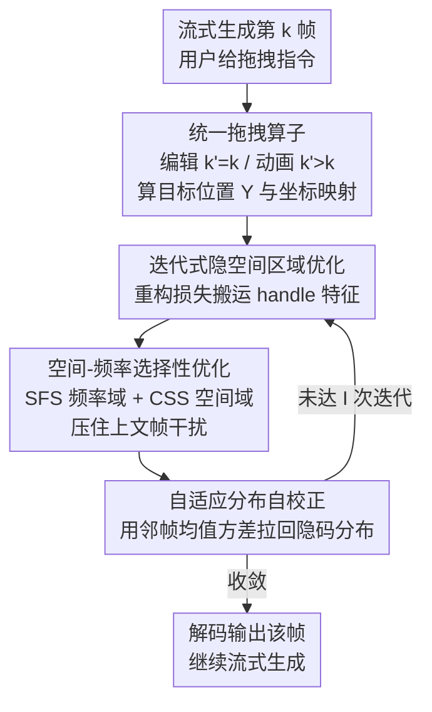

# Streaming Drag-Oriented Interactive Video Manipulation: Drag Anything, Anytime!

**会议**: ICLR 2026  
**OpenReview**: [https://openreview.net/forum?id=UtL0hIjENO](https://openreview.net/forum?id=UtL0hIjENO)  
**代码**: https://github.com/junbao-zhou/DragStream  
**领域**: 视频生成 / 交互式视频编辑 / 扩散模型  
**关键词**: 流式视频生成, 拖拽操作, 自回归扩散, 免训练, 隐空间漂移

## 一句话总结
本文提出 REVEL 任务——让用户在自回归视频扩散模型流式生成的过程中"随时拖、拖任意物体"，并给出一个免训练方法 DragStream，用"自适应分布自校正"压住拖拽累积导致的隐空间漂移、用"空间-频率选择性优化"压住上文帧的干扰，在不微调模型的前提下实现高质量的流式拖拽式编辑与动画。

## 研究背景与动机

**领域现状**：自回归视频扩散模型（autoregressive VDM）已能逐帧、流式地把视频生成出来，并配合 KV cache 加速推理；与此同时，拖拽（drag）因为粒度细、交互直观，成了控制视频生成的主流信号之一（DragVideo、SG-I2V、Tora 等）。

**现有痛点**：但"流式生成"和"拖拽控制"这两条线几乎没有合到一起。已有拖拽方法要么只能编辑已生成好的离线视频帧（DragVideo），要么只能按轨迹把图片"动画化"（SG-I2V、Tora），用户无法在生成进行时随时介入；而且这些方法对拖拽操作本身的定义也不统一——有的只支持平移、不支持绕中心旋转，有的不让用户指定"是要编辑这一帧还是要由它生成后续帧"。要支持流式细粒度拖拽，最直接的办法是拿大规模拖拽数据去微调 VDM，但那需要数百乃至上千 H100 GPU 小时，对资源受限场景不现实。

**核心矛盾**：作者把流式拖拽难做的根因落到两个具体观察上。其一，**隐空间分布漂移**：拖拽是对隐变量的扰动，在自回归逐帧推进中这些扰动会不断累积，使隐编码的均值/方差/极值显著偏离原始分布，最终把拖拽过程"卡死"，甚至让物体颜色、类别等属性发生意外改变。其二，**上文帧干扰**：流式生成强依赖前几帧的视觉线索（KV cache），但 handle 点附近的上文特征会误导后续生成，比如在兔子身上长出重复的耳朵、在车上产生伪影，让画面变得不自然。

**本文目标**：在不微调模型、即插即用接入现有自回归 VDM 的前提下，让用户能在生成途中对任意内容做平移/形变/2D 与 3D 旋转的拖拽，同时把上述两个失效模式都摁住。

**切入角度**：既然两大障碍分别来自"隐编码统计量漂了"和"上文信息既有用又有害"，那就不去改模型权重，而是在每一步迭代式隐空间优化里直接对隐编码做统计校正、对上文特征做选择性利用——这是一条纯推理期、免训练的路。

**核心 idea**：把流式拖拽统一成"编辑 + 动画"两类操作，用邻帧统计量把漂移拉回原分布（ADSR），再在频率域和空间域上选择性地传播上文线索（SFSO），从而免训练地实现"随时拖、拖任意物体"。

## 方法详解

### 整体框架
DragStream 解决的是这样一个场景：用户在流式生成观察到第 $k$ 帧 $\Gamma_k$，给出拖拽指令 $U^k=\{E^k, C^k\}$，其中 $E^k$ 是要拖的 handle 区域、$C^k$ 是对应指令（含指示符 $\eta^k$ 决定"编辑还是动画"、操作类型 $\zeta^k_i$、以及含 handle 点/目标点/旋转中心的 $O^k_i$）。一个关键约定是：若是**编辑**（Editing），被操作的帧 $k'=k$，相当于对当前帧自引导地重去噪；若是**动画**（Animation），$k'>k$，相当于用当前帧的扰动特征去跨帧引导新帧的去噪。

整条流水线围绕"迭代式隐空间区域优化"展开：先把噪声隐码 $z^{k'}_T$ 去噪到某个中间步 $z^{k'}_{T'}$，从 DiT 去噪器多层抽取参考特征 $F(z^{k'}_{T'})$（注意力里用到上文帧的 KV cache）；根据用户指令把 handle 区域 $H^k_i$ 在特征图上算出拖拽后的目标位置 $Y^{k'}_i$ 和坐标映射 $\Pi_{H^k_i\to Y^{k'}_i}$（旋转用 $\mathrm{Rot}$、平移用 $\mathrm{Trans}$）；然后用一个总损失 $\mathcal{L}_{Tot}$ 反复优化 $z^{k'}_{T'}$，把 handle 特征"搬"到目标位置、同时锁住不可编辑区域。**ADSR 和 SFSO 就嵌在这个迭代优化里**——前者在每次迭代后校正隐码分布，后者在抽取参考特征和回传梯度时做频率/空间选择。

### 关键设计

**1. 统一的拖拽算子与迭代式隐空间区域优化：把"编辑/动画 × 平移/形变/旋转"收进一套优化目标**

针对现有方法"拖拽定义不统一、且离线/轨迹两条路互不相容"的痛点，本文先在任务层面把拖拽统一为"对视频帧做编辑或动画，两者都支持用户指定的平移、形变、2D/3D 旋转"，再用一个统一的优化过程去实现它。具体地，对 handle 区域 $H^k_i$，先按指令算出它被拖拽后的目标掩码与坐标映射：旋转时 $\mathrm{Rot}(H^k_i, c^k_i, \theta=\angle p^{k'}_i c^k_i p^k_i)$ 绕中心 $c^k_i$ 转 $\theta$ 角，否则 $\mathrm{Trans}(H^k_i, \vartheta=p^{k'}_i-p^k_i)$ 平移 $\vartheta$。优化目标是

$$\mathcal{L}_{Tot}=\underbrace{\|F(z^{k'}_{T'})*Y^{k'}_i - F_{ref}(z^{k}_{T'})[\Pi_{H^k_i\to Y^{k'}_i}]*Y^{k'}_i\|_1}_{\mathcal{L}_{Rec}} + \underbrace{\|F(z^{k'}_{T'})*M^{k'} - F_{init}(z^{k'}_{T'})*M^{k'}\|_1}_{\mathcal{L}_{Cst}}$$

其中重构项 $\mathcal{L}_{Rec}$ 把"原 handle 区域的（被干预调整过的）参考特征"重建到目标位置，约束项 $\mathcal{L}_{Cst}$ 用二值掩码 $M^{k'}$ 锁住不可编辑区域。编辑时参考特征取自当前帧（自引导），动画时取自第 $k$ 帧并去引导新帧 $k'$ 的去噪（跨帧引导），从而把两种看似不同的需求落进同一套迭代优化里。

**2. 自适应分布自校正（ADSR）：用邻帧统计量把漂移的隐码拉回原分布**

这一设计直接针对 Challenge 1——拖拽扰动在自回归推进中累积，使隐码均值/方差大幅偏移、把拖拽过程卡死并改变物体属性。作者观察到：相邻帧本应处于相近的隐分布，于是把第 $k'$ 帧之前一段邻近隐码 $\{z^i_{T'}\}_{i=k'-L_n-1:k'-1}$ 的均值 $\bar{\mu}_{T'}$ 与标准差 $\bar{\sigma}_{T'}$ 记录下来，在每次迭代优化之后对当前隐码做一次分布对齐：

$$\hat{z}^{k'}_{T'}=\frac{\mathrm{Iter\_optim}(z^{k'}_{T'}, U^k)-\mu^{k'}_{T'}}{\sigma^{k'}_{T'}}*\bar{\sigma}_{T'}+\bar{\mu}_{T'}$$

即先用当前帧自身的 $\mu^{k'}_{T'},\sigma^{k'}_{T'}$ 做标准化、再用邻帧统计量 $\bar{\sigma}_{T'},\bar{\mu}_{T'}$ 还原。这样每一步都把隐码的一阶/二阶统计量重新对齐到"未被拖拽污染"的邻帧水平，既不需要训练，又能稳稳压住累积漂移，避免拖到一半物体变色/变类。

**3. 空间-频率选择性优化（SFSO）：既要吃上文信息又要躲它的干扰**

针对 Challenge 2——上文帧线索既是必需的条件又会误导生成，SFSO 在频率域和空间域两路做选择。频率域上提出**可切换频率选择（SFS）**：高频信息细节丰富但带噪、易诱发伪影，低频信息稳健但缺细节，于是在构造参考特征的 $L$ 层自注意力里，把当前与缓存的 KV 拼接后送进巴特沃斯滤波器，**截止频率 $\omega$ 从一组候选 $\{\omega_i\}$ 里随机切换**：

$$\{\bar{K}^k_{l_i}, \bar{V}^k_{l_i}\}=\mathrm{IFFT}(\mathrm{Butterw}(\mathrm{FFT}(\{\bar{K}^k_{l_i}, \bar{V}^k_{l_i}\}), \omega=\mathrm{Random}(\omega_1,...,\omega_N)))$$

随机切换让不同频段的上文信息都能经由重构损失传到隐码，同时防止高频长期主导而产生伪影。空间域上提出**关键性驱动的空间选择（CSS）**：用一张随到编辑中心 $(x_c,y_c)$ 距离衰减的高斯图 $G^{k'}$ 去加权回传的梯度，

$$z^{k'}_{T'}\leftarrow z^{k'}_{T'}-G^{k'}\frac{\partial \mathcal{L}_{Tot}}{\partial z^{k'}_{T'}},\quad G^{k'}[x,y]=\exp\!\left(-\Big(\tfrac{(x-x_c)^2}{2\sigma_x^2}+\tfrac{(y-y_c)^2}{2\sigma_y^2}\Big)\right)$$

其中 $\sigma_x=\tfrac{W}{2}\alpha,\sigma_y=\tfrac{H}{2}\alpha$ 由 handle 最小外接矩形的宽高决定（$\alpha=1$）。这样梯度集中在真正要拖的关键区域、不去过度优化背景，进一步减少不自然内容。SFS 与 CSS 合起来即"先选频段、再选空间位置"，把上文信息的价值留下、把干扰滤掉。

### 损失函数 / 训练策略
方法完全**免训练**，无需任何参数更新，全部发生在推理期的迭代式隐空间优化中。核心目标即上面的 $\mathcal{L}_{Tot}=\mathcal{L}_{Rec}+\mathcal{L}_{Cst}$：重构项负责把 handle 特征搬到目标位置，约束项负责锁住不可编辑区域。迭代次数 $I$ 是主要超参，实验取 $I=4$；CSS 高斯展宽系数 $\alpha=1$；SFS 的截止频率在一组候选中随机切换。

## 实验关键数据

由于 REVEL 是全新任务，没有现成方法可比，作者把两个免训练方法 SG-I2V 与 DragVideo 适配到 REVEL 上作为基线。评测指标为 ObjMC（物体运动控制精度，越低越好）、DAI（拖拽精度相关，越低越好）、FVD 与 FID（视频/图像质量，越低越好）。

### 主实验

| 指标（↓） | SG-I2V | DragVideo | DragStream（本文） |
|--------|--------|-----------|------|
| ObjMC | 44.19 | 49.69 | **23.05** |
| FVD | 936.89 | 561.45 | **552.39** |
| FID | 33.59 | 25.02 | **23.72** |
| DAI | 0.08 | 0.09 | **0.05** |

四项指标全面领先：FID/FVD 最低说明画质更好，ObjMC/DAI 最低说明拖拽更精准。可视化上，DragStream 相比两个基线更好地保住了物体外观与结构，畸变、伪影和拖拽失败都更少。

### 消融实验

| 配置 | 结论 |
|------|------|
| w/o ADSR, SFSO | 性能最差，两个核心组件都拿掉时下降最明显 |
| w/ ADSR | 加回 ADSR 后明显回升，但去掉 SFSO 仍有显著差距 |
| w/ ADSR + SFS | 仅用频率选择，弱于完整 SFSO |
| w/ ADSR + CSS | 仅用空间选择，弱于完整 SFSO |
| Full（ADSR+SFS+CSS） | 全配置最佳 |

运行时分析（H20 GPU，RF 为每帧耗时）：

| 迭代数 $I$ | RF | ObjMC（↓） | DAI（↓） |
|------|------|--------|--------|
| 0（基线） | 0.17s | 90.39 | 0.133 |
| 2 | 0.24s | 27.67 | 0.054 |
| 3 | 0.27s | 24.55 | 0.053 |
| 4（本文） | 0.30s | **23.05** | **0.051** |

### 关键发现
- ADSR 与 SFSO 都不可或缺，二者同时去掉时掉点最严重；SFSO 里 SFS 与 CSS 单用都不如合用，说明频率选择与空间选择互补。
- 截止频率 $\omega$ 太大或太小都掉点，**随机切换（Switch）反而最好**——既吃到上文信息又不让高频主导拖拽。
- 迭代次数只需 $I=4$ 即可，相比基线每帧仅多 0.13s；降到 $I=2/3$ 还能再提速，且仍明显优于不用 DragStream 的基线。
- 在遮挡-再现、长视频等复杂流式场景下仍能稳定拖拽，得益于 VDM 在大规模数据上学到的遮挡/场景转换先验。

## 亮点与洞察
- **把"流式 + 拖拽"这件没人统一做的事先定义清楚再解**：作者先提出 REVEL 任务并把拖拽统一为"编辑/动画 × 平移/形变/2D-3D 旋转"，再用一套迭代优化覆盖，任务定义本身就是贡献。
- **ADSR 的统计量校正非常朴素却切中要害**：用邻帧均值/方差对隐码做标准化-还原，零训练成本就把自回归累积漂移这一"卡死拖拽"的元凶摁住，这种"分布对齐"思路可迁移到任何会发生隐空间累积漂移的流式生成任务。
- **频率随机切换是个聪明的折中**：与其纠结固定截止频率，不如在高/低频之间随机切换，让重构损失把各频段信息都吸收进来，同时避免高频长期主导——对所有"上文既有用又有害"的条件生成都有启发。
- **即插即用、免训练**：整套方法不动模型权重，可直接嫁接到现有自回归 VDM，每帧额外开销低至 0.13s。

## 局限与展望
- 作者承认在**高度不合理、物理上不可能**的拖拽指令下会失败（如不合理的过度拉伸、违背物理的拖动），因为这类指令与 VDM 从大规模数据学到的先验强烈冲突。
- 评测**缺少与微调类强基线的直接对比**：基线只有两个被适配过来的免训练方法（SG-I2V、DragVideo），看不出和"花上千 GPU 小时微调"的方法相比差距多大。
- 长视频里自回归的**累积误差仍是开放问题**，本文只是"仍能有效拖拽"，未根治误差累积。
- ADSR 假设邻帧分布相近，在镜头剧烈切换/快速转场时这一前提可能不成立，校正反而可能拉偏，值得进一步分析。

## 相关工作与启发
- **vs DragVideo**：DragVideo 只支持对已生成视频做拖拽式编辑、不支持把帧动画化、也不支持 2D 旋转；本文统一了编辑与动画、支持平移/形变/2D-3D 旋转，且面向流式场景。
- **vs SG-I2V / Tora**：二者是轨迹引导的视频生成，只能让物体沿轨迹运动、由 VDM 渲染，用户无法指定"绕中心转某角度/编辑形状"这类细粒度操作，更不支持流式介入。
- **vs StreamDiffusion / StreamDiT 等流式生成**：这些方法靠文本/相机/姿态条件做流式控制，且多需从头训练或微调，几乎不支持细粒度拖拽；本文走免训练路线、专攻流式拖拽。
- **vs DragNeXt**：复用了其拖拽操作格式 $U^k=\{E^k,C^k\}$，但 DragNeXt 不支持流式编辑，本文补上了"随时拖"的流式能力。

## 评分
- 新颖性: ⭐⭐⭐⭐⭐ 首次提出并统一定义"流式拖拽式视频操作"任务，并给出免训练解法。
- 实验充分度: ⭐⭐⭐⭐ 指标全面领先、消融与运行时分析到位，但缺与微调强基线的对比。
- 写作质量: ⭐⭐⭐⭐ 两大挑战与两大组件一一对应、逻辑清晰，公式偏密集。
- 价值: ⭐⭐⭐⭐⭐ 即插即用、免训练，对交互式视频生成的落地很实用。

<!-- RELATED:START -->

## 相关论文

- [\[ICLR 2026\] Geometry-aware 4D Video Generation for Robot Manipulation](geometry-aware_4d_video_generation_for_robot_manipulation.md)
- [\[ICLR 2026\] Streaming Autoregressive Video Generation via Diagonal Distillation](streaming_autoregressive_video_generation_via_diagonal_distillation.md)
- [\[ICLR 2026\] Learning Video Generation for Robotic Manipulation with Collaborative Trajectory Control](learning_video_generation_for_robotic_manipulation_with_collaborative_trajectory.md)
- [\[ICLR 2026\] MIMIC: Mask-Injected Manipulation Video Generation with Interaction Control](mimic_mask-injected_manipulation_video_generation_with_interaction_control.md)
- [\[ICLR 2026\] LongLive: Real-time Interactive Long Video Generation](longlive_real-time_interactive_long_video_generation.md)

<!-- RELATED:END -->
