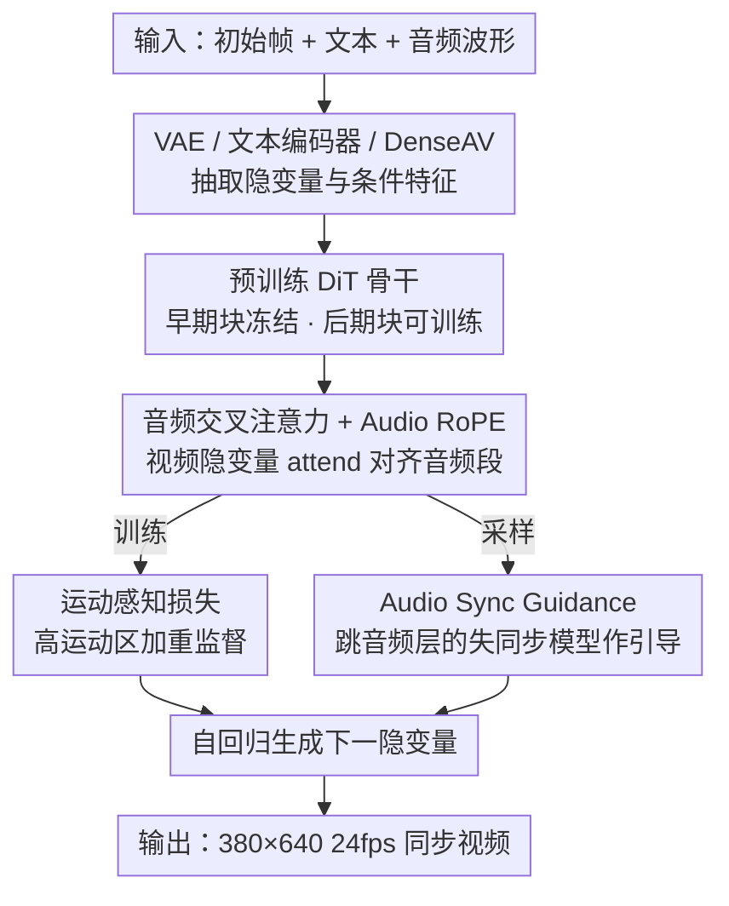

# Syncphony: 用扩散 Transformer 实现音画同步的音频到视频生成

**会议**: ICLR 2026  
**OpenReview**: [https://openreview.net/forum?id=sG8dGZMaub](https://openreview.net/forum?id=sG8dGZMaub)  
**代码**: 项目页 https://jibin86.github.io/syncphony_project_page （承诺开源代码、模型与评测工具）  
**领域**: 视频生成 / 扩散模型 / 多模态  
**关键词**: 音频到视频生成、音画同步、扩散 Transformer、运动感知损失、采样引导

## 一句话总结
Syncphony 在预训练 DiT 视频骨干上插入音频交叉注意力，配合「运动感知损失」强化高运动区域的监督、「Audio Sync Guidance」在采样时放大音频影响，生成 380×640、24fps、与音频精确同步的视频，并提出 CycleSync 这一基于视频反推音频的同步度量。

## 研究背景与动机
**领域现状**：文本到视频（T2V）和图像到视频（I2V）在画质和时序连贯性上进步神速，但它们都难以精确控制"动作什么时候发生、以什么节奏发生"。文本天然缺乏时间戳（"狗叫"没说叫几声、什么节奏），图像只是某一时刻的静态快照。音频则与视频共享同一条时间轴，天然携带"什么时候、第几次"的时序线索——保龄球何时撞瓶、机枪何时射击，音频里全都写着，因此音频是做时序可控视频生成的理想条件。

**现有痛点**：现有音频到视频（A2V）方法的同步都很粗。一类靠音频幅度调制交叉注意力权重（Lee et al.），幅度根本传不了音频的语义和时序结构；一类把音频嵌入投影到文本空间再喂给 T2V（TempoTokens、Yariv），这种"音频→文本→运动"的间接映射是时序表达力的瓶颈；AVSyncD 直接往 Stable Diffusion 的 T2I 骨干里塞音频层，但受限于 T2I 的空间分辨率、时序建模能力浅，还要从零训练时序层（6fps、256×256），导致闪烁、饱和等连贯性崩坏。

**核心矛盾**：即使条件齐全，扩散/流模型常用的 MSE 目标也不足以学到精确的运动时机和合适的运动幅度——MSE 把所有时空区域一视同仁，只要整体画面接近真值，"延迟的开枪动作"或"幅度不足的撞击"误差依然很低，模型会把没对齐的预测误判为成功。

**本文目标**：在保持高画质的前提下，让视频运动与多样音频精确同步，并提供一个能在高帧率、真实场景下可靠衡量同步度的指标。

**切入角度**：① 不再间接映射，而是用交叉注意力把音频特征**直接**注入视觉生成过程；② 不从零训时序层，而是站在强时序建模的预训练视频骨干（Pyramid Flow 自回归 DiT）肩上；③ 既然 MSE 监督太均匀，就在**真值运动大的区域**加重监督。

**核心 idea**：在预训练 DiT 上加音频交叉注意力 + RoPE，用"运动感知损失"把学习信号聚焦到高运动区，再用"跳过音频层的失同步模型"作为采样引导来放大音频影响。

## 方法详解

### 整体框架
Syncphony 接收三个输入：一张初始帧、一段文本提示、一段音频波形。初始帧经 VAE 编码成隐变量 $z_0$，作为自回归生成后续视频隐变量 $\{z_l\}_{l=1}^{L}$ 的起点；文本特征由预训练编码器（T5/CLIP）抽取，音频特征 $\{a_i\}$ 由 DenseAV 音频编码器抽取。骨干是一个自回归扩散 Transformer，逐块（chunk）地基于"上一块 + 文本"去噪生成下一块视频隐变量。

关键在于 Transformer 块被划成两组：**早期块冻结**（主管空间结构与语义保真），**后期块可训练**（主管时序动态与运动细化）。文本通过所有块的联合自注意力注入；而音频交叉注意力层**只插在后期块**里，置于联合自注意力之前，让每个视频隐变量去 attend 它对齐的那段音频，实现细粒度同步。训练时用运动感知损失把误差权重压到高运动区；采样时用 Audio Sync Guidance 放大音频驱动的运动；音频条件还配了 Audio RoPE 注入相对时间信息。

### 关键设计

**1. 音频交叉注意力 + Audio RoPE：把音频时序直接刻进运动**

针对"间接映射传不了时序"这个痛点，Syncphony 放弃了幅度调制和音频→文本投影，转而在后期 Transformer 块里、联合自注意力之前插入一层音频交叉注意力：视频隐变量作 query，音频段作 key/value，让每个隐变量直接 attend 到与它时间对齐的局部音频。为了让"对齐"落到实处，作者对 query（视频）和 key（音频）施加共享的 Rotary Positional Embedding（Audio RoPE），把相对时间信息注入到注意力里——这样两个模态在相对位置空间里对齐，运动事件和声音事件的时间间隔被显式编码。直接注入 + 相对位置对齐，使得音频里复杂、细密的时序结构能真正传递到运动，而不是被压成一个粗糙的幅度标量或语义文本。

**2. 运动感知损失（Motion-aware Loss）：把监督压到"该动的地方"**

针对 MSE 一视同仁、无法惩罚错误运动时机的痛点，作者提出按真值运动幅度对损失加权。观察发现：相邻帧之间的隐变量差异往往与音频事件相关，哪怕原始帧里看不清运动（如机枪射击）。于是损失定义为基础项加运动加权项：

$$L = \|\hat{\epsilon}_t - \epsilon_t^{GT}\|^2 + \lambda \sum_{l=2}^{L} \left\|(\hat{\epsilon}_t^{(l)} - \epsilon_t^{GT(l)}) \odot (z_{clean}^{GT(l)} - z_{clean}^{GT(l-1)})\right\|^2$$

其中第二项用相邻帧真值隐变量之差 $z_{clean}^{GT(l)} - z_{clean}^{GT(l-1)}$ 作为"运动幅度"权重（$\odot$ 为逐元素相乘），$\lambda=1$。这样动态区域的预测误差被加重惩罚、静止区域几乎不变，逼模型学准运动的时机和强度。关键的设计取舍是：**不用音频强度本身当权重，而用真值运动幅度**——因为音频和运动不是严格一一对齐（狮子先动再吼、保龄球先滚再撞），用运动幅度加权能让模型学到自然的同步模式而非僵硬假设"声音峰=运动峰"；同时因为权重来自运动强度本身，模型会自然区分"与音频因果相关的运动"和无关的相机/背景运动。

**3. Audio Sync Guidance（ASG）：用"失同步模型"反向放大音频**

针对"音频线索常常微弱、模型拿不准要不要反映到运动里"的痛点，ASG 在采样时跑两个共享视觉骨干的分支：一个是音频交叉注意力开启的 **full model**，一个是仅把这些音频层禁用的 **off-sync model**。作者发现 off-sync 模型输出在视觉上和 full model 几乎一样、但失去了同步——因此两者预测之差恰好**隔离出了"同步成分"**。把这个差按强度 $w$ 加回 full model 的输出，就放大了音频的影响：

$$\tilde{\epsilon}_\theta^w(z_t) = \epsilon_\theta(z_t) + w\left(\epsilon_\theta(z_t) - \epsilon_\theta^{\text{off-sync}}(z_t)\right)$$

与传统 classifier-free guidance 不同，CFG 需要丢掉条件并显式训练 null 条件（对音频而言"训练无音频场景"很难）；ASG 改为**只跳过音频层本身**而不丢掉音频条件，因此**无需额外训练**就能在保持画质的同时增强音画对齐。实验中 $w=2$ 是同步与画质的最佳折中。

**4. CycleSync：用视频反推音频来量同步**

针对旧指标的缺陷——RelSync/AlignSync 要降到 6fps（丢时序分辨率）、AV-Align 假设音视频峰一一对应（现实里锤子撞击前就开始动、声响时才停，无法泛化）——作者提出 CycleSync：把生成视频喂给一个预训练的视频到音频（V2A）模型反推出音频 $\hat{a}=f_{v2a}(\hat{v})$，再比较反推音频与原音频的 onset 峰集合。设 $A$、$\hat{A}$ 分别为原音频与反推音频的峰集，在时间容差 $\delta$ 下做一一匹配得到匹配数 $I$，分数取两峰集的 IoU：

$$\text{CycleSync} = \frac{I}{|A| + |\hat{A}| - I}$$

它衡量的是"生成视频里的运动线索是否足以重建原音频的时间结构"，因此支持高帧率、也能容忍真实场景中运动与声音的非严格对齐。实验表明 CycleSync 对时间错位远比旧指标敏感，且与人类偏好相关性最高。

### 损失函数 / 训练策略
总损失即上面的运动感知损失（基础 MSE + 运动加权项，$\lambda=1$）。骨干用预训练 Pyramid Flow Video 模型，仅微调后期块并在其中插入音频交叉注意力（通过层级敏感性分析确定：早期层管空间/语义、后期层管时序/运动）。视频最长 5 秒、24fps、380×640，音频 16kHz。训练时从视频不同时间段随机采片段以提升对多样音画对齐的泛化；评测时每个视频取三段 2 秒片段。仅用 4 张 RTX 3090（24GB）训练。

## 实验关键数据

### 主实验
在 AVSync15 与 TheGreatestHits 两个音画同步数据集上评测。可视质量用 FID/FVD，语义对齐用 IT（图文，CLIP）和 IA（图音，ImageBind），同步用 CycleSync，外加 150 段视频的用户研究（同步 Sync / 画质 IQ / 帧一致性 FC）。

| 数据集 | 模型 | FID ↓ | FVD ↓ | IA ↑ | CycleSync ↑ |
|--------|------|------|------|------|------|
| AVSync15 | AVSyncD | 9.2 | 491.5 | 35.23 | 16.38±1.38 |
| AVSync15 | Pyramid Flow (微调) | 8.5 | 294.6 | - | 12.34±1.14 |
| AVSync15 | **Ours** | **8.5** | **293.1** | **37.02** | **16.48±1.28** |
| AVSync15 | Groundtruth | - | - | 37.06 | 22.15±1.8 |
| TheGreatestHits | AVSyncD | 6.8 | 327.8 | 12.35 | 9.89±0.84 |
| TheGreatestHits | **Ours** | 6.7 | **166.2** | **13.83** | **16.18±1.26** |
| TheGreatestHits | Groundtruth | - | - | 14.68 | 15.99±1.5 |

在两个数据集上 Syncphony 都在同步精度上领先，同时 FID/FVD 更低（时序更连贯）。用户研究中本文在同步、画质、帧一致性三项均显著被偏好（如 AVSync15 上 Sync 222 vs AVSyncD 78）。值得注意的是在 TheGreatestHits 上本文的 CycleSync 甚至**超过真值**——作者解释为生成视频的运动比真值更聚焦于音频事件（真值常含悬停、背景噪声等离事件运动），说明模型对音频线索更敏感。

### 消融实验

| 配置 | FID ↓ | FVD ↓ | CycleSync ↑ | 说明 |
|------|------|------|------|------|
| w/o 运动感知损失 | 8.4 | 305.9 | 15.18±1.48 | 去掉运动加权，同步最差 |
| Full w/o ASG | 8.5 | 299.1 | 15.31±1.49 | 有运动损失但采样无引导 |
| Full w/ ASG (w=1) | 8.5 | 294.2 | 15.94±1.56 | 引导偏弱 |
| Full w/ ASG (w=2) | 8.5 | 293.1 | **16.48±1.28** | 同步与画质最佳折中 |
| Full w/ ASG (w=4) | 8.7 | 298.3 | 16.26±1.4 | 同步略增但运动过夸张、FVD 变差 |

### 关键发现
- **运动感知损失贡献最大**：去掉它 CycleSync 从 16.48 掉到 15.18，且可视化显示模型常无法在音频起止点正确触发/终止运动；它把学习信号选择性放大到高运动点，专门提升运动的幅度与时机精度。
- **ASG 的引导强度有甜点**：$w=2$ 同步最好且画质稳定；$w=4$ 同步只有边际增益却引入过夸张运动（如青蛙鼓气、后坐力夸张），FVD 升高。
- **CycleSync 的有效性**：在受控时间偏移下，CycleSync 比 AV-Align/RelSync/AlignSync 对错位敏感得多，且与人类偏好相关性最高（旧指标相关性弱甚至为负）。

## 亮点与洞察
- **"失同步模型"作引导很巧**：通过只禁用音频层、不丢条件，得到一个视觉相似但失同步的弱模型，两者之差正好隔离出"同步成分"，免训练就能放大音画对齐——这是对 Spatiotemporal Skip Guidance 思路在音频维度上的漂亮迁移。
- **用真值运动而非音频强度加权**，绕开了"声音峰=运动峰"的错误假设，承认运动可先于或滞后于声音，这种"软对齐"哲学贯穿全文（也体现在 CycleSync 的容差匹配上）。
- **CycleSync 的"循环"思路可复用**：用一个反向模型（V2A）把生成结果映回条件空间再比对，是评估跨模态同步的通用范式，可迁移到其他"条件→生成→反推条件"的一致性度量。
- 站在强预训练视频骨干上、只微调后期块，用 4 张 3090 就训出 24fps 高分辨率同步视频，工程性价比高。

## 局限与展望
- **运动加权不显式区分音频相关运动**（作者承认）：损失按真值运动幅度加权，但没在监督层面专门挑出"与音频相关"的运动；在高度动态场景里，更有选择性的运动代理（如前景/动作感知加权）可能进一步提升鲁棒性。
- **依赖 V2A 模型质量**：CycleSync 的可靠性受限于所用预训练 V2A 模型，反推音频本身的误差会传导到分数（论文在附录讨论了 CycleSync 的局限）。
- **聚焦非语音通用运动**：明确不处理语音/唇形同步（与 talking head 模型互补），适用范围限于一般视觉运动事件。
- **分辨率/时长仍受骨干约束**：380×640、最长 5 秒，受 Pyramid Flow 骨干能力限制。

## 相关工作与启发
- **vs AVSyncD（Zhang et al. 2024）**：AVSyncD 往 T2I 骨干注入音频层、从零训时序层（6fps/256×256），易闪烁饱和、时序浅；本文站在强时序的预训练 DiT 视频骨干上，画质和同步双赢，且 ASG 无需额外训练。
- **vs TempoTokens / Yariv et al.**：他们把音频投影到文本空间再喂 T2V，间接映射丢失细粒度时序；本文用音频交叉注意力直接注入。
- **vs Lee et al. (2023)**：他们用音频幅度调制注意力权重，幅度传不了语义和时序结构；本文用完整音频特征 + RoPE 编码相对时间。
- **vs Spatiotemporal Skip Guidance（Hyung et al. 2025）**：他们跳过视觉敏感层构造弱模型提质量，但 T2V 里视觉与语义纠缠难以选择性跳过；本文改为跳音频交叉注意力层，天然解耦，专做同步引导。

## 评分
- 新颖性: ⭐⭐⭐⭐ 音频交叉注意力+RoPE 是常规组合，但运动感知损失、ASG（跳音频层引导）、CycleSync 三件套构成有机且新颖的同步方案。
- 实验充分度: ⭐⭐⭐⭐ 两数据集 + 多指标 + 用户研究 + 受控错位分析 + 完整消融，CycleSync 自身的有效性也做了验证。
- 写作质量: ⭐⭐⭐⭐ 动机清晰、图示到位，损失公式在原文有重复排版但语义一致。
- 价值: ⭐⭐⭐⭐ 同步 A2V 的实用方案 + 一个可复用的同步度量，承诺开源代码模型评测工具。

<!-- RELATED:START -->

## 相关论文

- [\[ICLR 2026\] Neodragon: Mobile Video Generation Using Diffusion Transformer](neodragon_mobile_video_generation_using_diffusion_transformer.md)
- [\[ICLR 2026\] EchoMotion: Unified Human Video and Motion Generation via Dual-Modality Diffusion Transformer](echomotion_unified_human_video_and_motion_generation_via_dual-modality_diffusion.md)
- [\[ICLR 2026\] QuantSparse: Comprehensively Compressing Video Diffusion Transformer with Model Quantization and Attention Sparsification](quantsparse_comprehensively_compressing_video_diffusion_transformer_with_model_q.md)
- [\[ICLR 2026\] SANA-Video: Efficient Video Generation with Block Linear Diffusion Transformer](sana-video_efficient_video_generation_with_block_linear_diffusion_transformer.md)
- [\[ICLR 2026\] JavisDiT: Joint Audio-Video Diffusion Transformer with Hierarchical Spatio-Temporal Prior Synchronization](javisdit_joint_audio-video_diffusion_transformer_with_hierarchical_spatio-tempor.md)

<!-- RELATED:END -->
