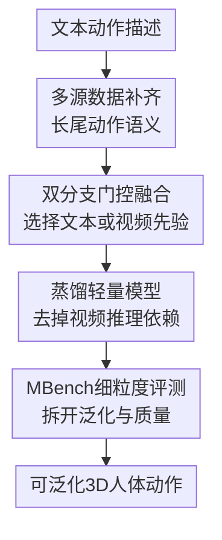

# The Quest for Generalizable Motion Generation: Data, Model, and Evaluation

**会议**: ICLR 2026  
**OpenReview**: [https://openreview.net/forum?id=KNke6Pkq4o](https://openreview.net/forum?id=KNke6Pkq4o)  
**代码**: 有（论文承诺公开代码、数据与 benchmark）  
**领域**: 视频生成 / 3D人体动作生成  
**关键词**: 文本到动作生成, 人体动作生成, 视频生成先验, 多源动作数据, 动作评测  

## 一句话总结
这篇论文围绕“可泛化的 3D 人体动作生成”同时补数据、改模型和重做评测：用 ViGen 的开放世界语义先验扩充 MoGen 的长尾动作覆盖，再用双分支门控 DiT 与蒸馏版 ViMoGen-light 把这种先验转成可用的文本到动作生成能力，并用 MBench 更细地验证泛化、对齐和动作质量。

## 研究背景与动机
**领域现状**：文本到 3D 人体动作生成已经有 MDM、MotionDiffuse、T2M-GPT、MoMask、MotionLCM 等一批方法，标准 benchmark 上的 FID、R-Precision 等指标也在不断刷新。它们大多依赖 HumanML3D、KIT-ML、AMASS/BABEL 派生数据这类光学 MoCap 或经过人工整理的动作-文本对，优点是动作干净、身体动力学可靠，生成结果在常见室内动作上比较稳。

**现有痛点**：真正卡住这个方向的不是“能不能生成一个会走路的人”，而是模型遇到长尾、户外、职业、体育、复合行为时很容易退化。标准 MoCap 数据成本高、采集场景受限，动作语义主要集中在简单移动、坐下、挥手、蹲起等动作；而网页视频或视频生成模型虽然覆盖了冲浪、射箭、杂技、职业操作等丰富行为，但用视觉 MoCap 抽出来的 3D 动作会有抖动、脚滑、全局轨迹漂移等问题。

**核心矛盾**：MoGen 的高质量先验和 ViGen 的开放世界泛化先验分别在不同数据源里。前者物理可信但语义窄，后者语义宽但动作信号噪声大；如果只拿视频生成结果当最终动作，会有明显质量问题，如果只在 MoCap 上训练，又学不到大量长尾行为。

**本文目标**：作者把问题拆成三件事。第一，构建一个既有高质量 MoCap 又有视频长尾语义的数据集；第二，设计一个模型，在每个样本上判断该信任文本到动作分支还是视频动作参考分支；第三，建立比传统 FID 更能看出泛化能力和 prompt 对齐问题的评测体系。

**切入角度**：论文的关键观察是，视频生成模型已经在“人类行为的语义空间”里见过极其丰富的组合，很多 MoGen 没见过的动作，ViGen 可以先生成一个大致对齐的视频。即便这个视频转出来的 3D 动作不够干净，它仍然提供了“这个动作大概是什么姿态、什么时序、哪些肢体在动”的参考。

**核心 idea**：用视频生成模型提供长尾语义与粗动作先验，用 MoCap 数据提供高保真身体动力学，再通过自适应双分支扩散 Transformer 在两者之间选择和融合。

## 方法详解

### 整体框架
ViMoGen 不是只提出一个网络模块，而是一套围绕泛化能力重新组织的动作生成框架。它先构建 ViMoGen-228K，把光学 MoCap、真实视频抽取动作、合成视频抽取动作放到统一 SMPL-X 表示中；再训练一个基于 flow matching 的 DiT 模型，让文本条件、噪声动作 token、视频动作 token 在门控块里交互；最后用 MBench 从泛化、文本一致性和动作质量三个轴评估模型是否真的学会了开放世界动作。

推理时，完整 ViMoGen 会先根据文本 prompt 调用离线文本到视频模型，生成一个人类动作视频，再用视觉 MoCap 得到参考动作 token。如果视觉语言模型判断视频和文本语义对齐，就走 Motion-to-Motion 分支，把视频动作作为参考并修正成更干净的 3D 动作；如果视频先验不可靠，就回退到 Text-to-Motion 分支，直接根据文本和 MoCap 先验生成动作。为了避免推理时必须生成视频，作者还训练 ViMoGen-light，用完整 ViMoGen 作为 teacher 生成合成动作，再把泛化能力蒸馏到只依赖文本的轻量学生模型里。

### 关键设计
**1. 多源数据补齐：用 MoCap 保质量，用视频来源补语义长尾**

ViMoGen-228K 的第一层贡献是把动作生成的训练分布从“小而干净”推向“大而可控”。作者没有简单把所有视频抽取动作都塞进训练集，而是把数据分成三类：171,542 个高质量光学 MoCap 文本-动作对、41,971 个真实视频派生文本-视频-动作三元组、14,723 个合成视频派生三元组。光学 MoCap 负责给模型稳定的身体动力学、接触关系和低噪声关节轨迹；真实视频负责补充户外、体育、职业任务等常见 MoCap 数据缺失的行为；合成视频则用可控 prompt 主动覆盖更长尾的动作描述。

这里的关键不是“数据更多”这么简单，而是数据源之间承担不同角色。真实视频从 10M 级人类视频里经过级联过滤，只保留约 1% 左右更适合视觉 MoCap 的片段，尽量减少抖动、遮挡和严重轨迹误差；合成视频则反过来利用 ViGen 的可控性，让视频尽量满足单人、全身、稳定镜头、干净背景等视觉 MoCap 友好条件。换句话说，论文把视频生成模型当成一个“动作语义采样器”，而不是无条件相信它产出的每一帧。

**2. 双分支门控融合：按样本判断视频先验该不该被信任**

ViMoGen 的网络主体是 flow-matching Diffusion Transformer。干净动作序列 $x_0 \in \mathbb{R}^{N \times D}$，噪声 $\epsilon \sim \mathcal{N}(0, I)$，时间步 $t \in [0,1]$，前向插值写成 $x_t=(1-t)\epsilon+t x_0$，模型学习预测速度场 $v_t=x_0-\epsilon$。训练目标是让 $f_\theta(x_t,t,c)$ 逼近这个速度场，即最小化 $\mathbb{E}[\lVert f_\theta(x_t,t,c)-v_t\rVert_2^2]$。这里 $c$ 不再只是文本 embedding，而是可能包含文本 token 和视频动作 token 的多模态条件。

每个融合块有共享的 self-attention 与 FFN，大约 66% 的 DiT 参数由 T2M 和 M2M 两个分支共享，差异主要在 cross-attention。T2M 分支让动作 token attend 到文本 embedding，适合 MoCap 覆盖充分、需要稳定动作质量的提示；M2M 分支让动作 token attend 到视频动作 token，适合 ViGen 已经给出语义正确但略有噪声的长尾行为。推理时用 VLM 做二分类对齐检查：视频与文本对齐则启用 M2M，否则回退 T2M。这个门控机制解决的是一个很具体的问题：视频先验有时是宝贵线索，有时是污染源，不能固定使用或固定丢弃。

训练阶段作者没有在线调用视频生成模型，而是用带噪 ground-truth motion 模拟视觉 MoCap 误差来构造 $z_{video}$。噪声包括随机 corruption、jitter simulation 和 temporal dropout，并且会 mask 掉视频动作 token 中不可靠的全局平移，迫使 M2M 分支主要学习局部姿态动力学。这一点很关键，因为单目视觉 MoCap 最容易错的往往不是“手大概在挥”，而是世界坐标里的根轨迹和脚地接触。

**3. 蒸馏轻量模型：把昂贵的视频生成先验压进纯文本动作模型**

完整 ViMoGen 的上限较高，但推理链路包含文本到视频、视觉 MoCap、VLM 判断和动作生成，成本明显高于普通 text-to-motion 模型。ViMoGen-light 的设计目标是保留 ViGen 带来的泛化收益，同时去掉推理时的视频生成依赖。作者先从语言资源中抽取高频动词和动作短语，再用语义聚类与 LLM 扩展构造 14,000 个新 prompt，例如 breakdancing、jousting 这类标准 MoCap 数据很少覆盖的动作。

随后，完整 ViMoGen 作为 teacher，为这些合成 prompt 生成高质量动作，ViMoGen-light 作为 student 只用 T2M 分支和标准 flow matching 目标学习这些样本。这样学生模型在推理时只需要文本，就能间接继承 teacher 从视频生成模型和双分支结构中获得的语义覆盖。它不是简单的模型压缩，而是把“视频模型知道哪些动作长什么样”转移到一个普通动作生成器里。

**4. MBench细粒度评测：把泛化、对齐和动作质量拆开看**

传统 motion generation 评测常把性能压成 FID、R-Precision 或分布距离，容易掩盖两个问题：模型可能生成了很平滑但完全不符合长尾 prompt 的动作，也可能 prompt 对齐不错但脚滑和身体穿透很严重。MBench 因此把评测拆成三大类九个维度：Motion Generalizability、Motion-Condition Consistency，以及 Motion Quality 下的 temporal quality 和 frame-wise quality。

泛化维度专门使用开放世界词汇和长尾动作描述，关注模型是否能越过训练集里常见的 action label；一致性维度让 VLM 先描述渲染出的动作，再从 10 个候选动作标签中选择最匹配项；质量维度则量化 jitter、foot floating、foot sliding、body penetration、pose naturalness 等具体物理或姿态问题。作者还做了人类偏好标注，验证自动指标与人类判断的相关性。这个 benchmark 的价值在于，它能解释模型到底强在哪里，而不是只告诉读者一个混合分数。

### 一个完整示例
假设输入 prompt 是“一个人先射箭，然后返回屋内并扑倒在沙发上”。传统 MoCap 训练集可能只覆盖“走路”“坐下”“挥手”这些局部动作，很难把“射箭 + 回屋 + 扑倒到沙发”组合成合理时序。完整 ViMoGen 会先让文本到视频模型生成一个包含这些行为的视频，再用 CameraHMR/SMPLest-X 之类视觉 MoCap 模型抽取粗 3D 动作。

如果 VLM 判断视频确实体现了射箭、移动和扑倒这几个关键阶段，模型就走 M2M 分支：视频动作 token 提供姿态阶段和动作顺序，DiT 负责把视觉 MoCap 的抖动、脚滑和轨迹误差修成更自然的 SMPL-X 动作。如果视频生成失败，比如人物扭曲、射箭动作缺失或扑倒变成不相关动作，门控会切回 T2M 分支，由文本 embedding 和 MoCap 训练出的稳健动力学直接生成。对长尾动作来说，这个例子说明了本文的核心策略：先借视频模型探索语义空间，再由动作模型决定是否采纳。

### 损失函数 / 训练策略
训练目标基于 rectified flow。对每个动作序列，模型从噪声到真实动作之间学习一条线性传输路径，损失写作 $\mathcal{L}=\mathbb{E}_{x_0,\epsilon,t,c}[\lVert f_\theta(x_t,t,c)-v_t\rVert_2^2]$。动作表示使用 SMPL-X 相关的 276 维逐帧向量，包含 root translation、root rotation、joint rotations、joint locations 和 joint velocities。

训练策略上，ViMoGen 对不同数据源采用不同分支激活倾向。人工标注或高质量 MoCap 数据更多使用 T2M 分支，以保证文本动作对齐和动作质量；大规模自动标注数据更鼓励 M2M 分支，以吸收视频侧的语义泛化。实现细节里，HumanML3D 样本采用约 80% T2M / 20% M2M，其他数据约 40% T2M / 60% M2M。合成数据还会加权，以强调其长尾语义覆盖。

ViMoGen-light 的训练更像蒸馏后的常规 text-to-motion 训练：teacher 先为 14,000 个语义多样 prompt 生成动作，student 只接收文本条件，用同样的 flow matching 目标学习。这样它牺牲了一部分完整 ViMoGen 的自适应能力，但换来更低推理成本。

## 实验关键数据

### 主实验
论文的主实验在 MBench 上比较 ViMoGen、ViMoGen-light 和多种 SOTA text-to-motion 模型。最关键的结论是，完整 ViMoGen 在文本动作一致性和泛化能力上显著领先，ViMoGen-light 在不调用视频生成模型的情况下仍能达到或接近强基线泛化水平。

| 模型 | Motion-Condition Consistency ↑ | Motion Generalizability ↑ | Jitter Degree ↓ | Dynamic Degree ↑ | Foot Sliding ↓ | 结论 |
|------|-------------------------------|----------------------------|-----------------|------------------|----------------|------|
| MDM | 0.42 | 0.51 | 0.0136 | 0.0376 | 0.0136 | 早期扩散模型，泛化一般 |
| T2M-GPT | 0.39 | 0.38 | 0.0156 | 0.0349 | 0.0156 | 离散 token 方法在长尾 prompt 上较弱 |
| MotionLCM | 0.48 | 0.55 | 0.0218 | 0.0439 | 0.0202 | 最强基线之一，但质量指标有明显抖动/脚滑 |
| MoMask | 0.38 | 0.44 | 0.0147 | 0.0396 | 0.0147 | 标准 benchmark 强，开放语义不占优 |
| MotionDiffuse | 0.44 | 0.42 | 0.0111 | 0.0289 | 0.0063 | 动作平滑，但泛化有限 |
| ViMoGen | 0.53 | 0.68 | 0.0108 | 0.0251 | 0.0064 | 一致性和泛化最强，动作更稳定 |
| ViMoGen-light | 0.47 | 0.55 | 0.0129 | 0.0294 | 0.0051 | 去掉视频推理后仍保留较强泛化 |

从表中可以看到，ViMoGen 的 Generalizability 从最强基线 MotionLCM 的 0.55 提升到 0.68，这是本文最核心的实验支撑。它的 Dynamic Degree 不最高，作者解释为训练数据中有更多复杂但全局移动较小的动作，例如系鞋带、坐姿操作等，因此不能简单把动态强度低理解成质量差。

论文还在 HumanML3D 标准 benchmark 上做了补充实验，把 ViMoGen-light 架构接入 MLD 框架，验证网络结构本身并非只在新数据和新 benchmark 上有效。

| 方法 | R-Precision Top-1 ↑ | R-Precision Top-2 ↑ | R-Precision Top-3 ↑ | FID ↓ | Multimodal Dist ↓ | MultiModality ↑ |
|------|---------------------|---------------------|---------------------|-------|--------------------|------------------|
| MLD | 0.481 | 0.673 | 0.772 | 0.473 | 3.196 | 2.413 |
| MotionLCM | 0.502 | 0.698 | 0.798 | 0.304 | 3.012 | 2.259 |
| MoMask | 0.521 | 0.713 | 0.807 | 0.045 | 2.958 | 1.241 |
| MLD + ViMoGen-light | 0.542 | 0.733 | 0.825 | 0.114 | 2.826 | 1.973 |

这个结果说明 ViMoGen-light 在标准数据集上能明显改善文本-动作对齐，Top-1 R-Precision 达到 0.542，Multimodal Distance 降到 2.826。FID 虽然不如 MoMask 的 0.045，但比原始 MLD 低很多，说明语义对齐提升没有以严重牺牲动作分布质量为代价。

### 消融实验
分支选择消融直接支撑了“不要固定相信视频，也不要完全丢掉视频”的设计。视频生成 baseline 本身有较好语义但抖动和脚滑明显；T2M-only 质量稳定但泛化不足；M2M-only 有视频语义收益但容易继承视觉 MoCap 噪声；adaptive gating 同时拿到最高一致性和泛化。

| 分支选择策略 | Motion-Condition Consistency ↑ | Motion Generalizability ↑ | Jitter Degree ↓ | Foot Sliding ↓ | 说明 |
|--------------|--------------------------------|----------------------------|-----------------|----------------|------|
| Video Generation Baseline | 0.51 | 0.58 | 0.0193 | 0.0161 | 直接用视频抽动作，语义有用但质量差 |
| T2M Only | 0.46 | 0.54 | 0.0111 | 0.0039 | 质量最好之一，但长尾语义不足 |
| M2M Only | 0.51 | 0.59 | 0.0145 | 0.0113 | 用视频参考提升语义，但噪声偏多 |
| Adaptive Gating | 0.53 | 0.68 | 0.0108 | 0.0064 | 按样本选择分支，综合表现最好 |

数据组成消融显示，多源数据的收益是逐步累加的，尤其是合成视频数据虽然只有 14K，却把泛化分数从 0.50 推到 0.55。

| 训练数据 | Clip 数量 | Motion-Condition Consistency ↑ | Motion Generalizability ↑ | Foot Sliding ↓ | 说明 |
|----------|-----------|--------------------------------|----------------------------|----------------|------|
| HumanML3D | 89K | 0.41 | 0.44 | 0.0032 | 标准高质量数据，语义覆盖窄 |
| + Other Optical MoCap Data | 83K | 0.44 | 0.48 | 0.0033 | 扩大高质量 MoCap 先验 |
| + Visual MoCap Data | 42K | 0.43 | 0.50 | 0.0042 | 引入真实世界语义，但质量稍有代价 |
| + Synthetic Video Data | 14K | 0.47 | 0.55 | 0.0051 | 小规模长尾语义带来最大泛化增益 |

文本编码器消融也很清楚：CLIP 在开放世界动作描述上不够强，T5-XXL 在一致性和质量之间最平衡，MLLM 对泛化有帮助但 body penetration 等质量指标更差。提示风格实验则发现，用更长、更像视频描述的文本训练，再在测试时接收简洁 motion-style prompt，反而得到最好的综合表现，说明丰富文本可以作为有效语义增强。

### 关键发现
- ViGen 先验真正提升的是开放世界语义泛化，而不是单纯让动作更平滑；MBench 上 0.68 的泛化分数是全文最重要的数字。
- Adaptive gating 比单分支更关键，因为视频生成模型在 backflip、windsurfing 等动作上能给出好先验，但在 sudden movement 或复杂翻转中也会扭曲失败。
- 合成视频数据规模不大，却对泛化贡献很大，说明动作生成数据的瓶颈很大一部分是“语义覆盖”，不是只靠更多常见 MoCap clip 就能解决。
- ViMoGen-light 的价值在落地侧：它保留了 teacher 的一部分长尾知识，但推理不再需要文本到视频模型，成本和延迟更接近普通 MoGen。
- 传统 benchmark 与 MBench 的关注点不同。HumanML3D 上的强结果说明架构有效，但 MBench 才更直接检验本文声称的 generalizable motion generation。

## 亮点与洞察
- **把 ViGen 当作语义先验而非最终答案**：论文没有把视频生成结果直接当 motion generation 的解，而是把它转成可选择、可修正的动作参考。这比“先生成视频再抽骨架”的朴素 pipeline 更稳，因为它承认视觉 MoCap 和视频生成都会失败。
- **数据构建思路很实用**：MoCap、真实视频、合成视频三种来源各补一块短板，尤其是合成视频被用来主动覆盖长尾语义，而不是只做花哨 demo。
- **门控机制对应了真实错误模式**：很多动作生成系统失败不是平均失败，而是某些 prompt 下视频先验很好、某些 prompt 下完全崩坏。按 instance 选择 T2M/M2M，比训练一个永远融合两边的模型更符合实际。
- **评测比方法本身更有长期价值**：MBench 把 motion quality 和 text fidelity 拆开，可以让后续论文更准确地报告自己到底解决了“动作好看”还是“prompt 真跟得上”。
- **蒸馏路线给了工程出口**：完整 ViMoGen 适合研究和高质量生成，ViMoGen-light 更接近可部署模型，这让论文不只停在“借大视频模型很强”的结论上。

## 局限与展望
- 作者明确指出当前方法只处理单人动作生成，不支持多人交互、人物-物体精细接触或复杂场景约束。对真实动画和机器人任务来说，多人互动和物体接触往往是更难也更重要的部分。
- M2M 分支仍依赖视频生成和视觉 MoCap 的初始质量。对于高动态体操翻转、急停转身、摔倒等动作，如果视频先验本身发生身体扭曲，M2M 很难完全修正。
- 训练数据中视觉 MoCap 仍会带来脚滑、足底接触不准、全局轨迹漂移等噪声，论文通过 mask 全局平移和后处理减轻，但没有根本解决接触物理建模。
- MBench 的 VLM 评测虽然经过人类相关性验证，但它本身也可能继承 VLM 对动作视频理解的偏差；特别是细微动作风格、身体重心变化、接触质量等维度，自动评测仍未必完全可靠。
- 未来可以把接触感知 MoCap、物理约束、运动控制器和场景几何引入 ViMoGen，让视频先验不只提供“像什么动作”，还提供可执行、可接触、可控制的动作轨迹。

## 相关工作与启发
- **vs HumanML3D / AMASS / BABEL**: 这些数据提供了可靠的动作质量和文本对齐基础，但规模和语义覆盖有限。ViMoGen-228K 的优势是同时保留 172K 高质量 MoCap，并补入 56K 视频派生三元组来覆盖长尾行为。
- **vs Motion-X / MotionMillion**: 视频派生动作数据更容易扩展，但质量不均、视觉 MoCap 误差明显。本文比单纯扩数据更进一步，用门控 M2M/T2M 模型决定何时使用视频动作参考。
- **vs MDM / MotionDiffuse / MotionLCM**: 这些扩散或一致性模型在常规 text-to-motion 上很强，但主要学习 motion dataset 内的分布。ViMoGen 的差异是显式引入 ViGen 的开放世界语义先验。
- **vs T2M-GPT / MoMask**: 离散 token 或 masked modeling 方法在 HumanML3D 上有很强结果，但开放词汇 prompt 下容易受训练集动作标签限制。本文通过 T5-XXL、多源数据和蒸馏提升复杂文本理解。
- **vs DNO / video-to-motion optimization 方法**: 这类方法常把视频模型作为外部优化目标，推理慢且受视频质量影响大。ViMoGen 把视频动作参考整合进扩散 Transformer，并用 adaptive gating 降低坏视频先验的负面影响。

## 评分
- 新颖性: ⭐⭐⭐⭐⭐ 数据、模型和评测三线一起推进，尤其是把 ViGen 作为可选择动作先验的思路很清晰。  
- 实验充分度: ⭐⭐⭐⭐⭐ 主实验、分支消融、数据消融、文本编码器、prompt 风格、HumanML3D 补充实验都覆盖到了。  
- 写作质量: ⭐⭐⭐⭐☆ 论文结构完整、数字充分，但方法和数据部分信息量很大，部分实现细节需要读 appendix 才能完全复现。  
- 价值: ⭐⭐⭐⭐⭐ 对 motion generation 社区很有参考价值，因为它把“泛化能力”从口号落到了数据源、模型路由和 benchmark 设计上。

<!-- RELATED:START -->

## 相关论文

- [\[ICLR 2026\] Phantom-Data: Towards a General Subject-Consistent Video Generation Dataset](phantom-data_towards_a_general_subject-consistent_video_generation_dataset.md)
- [\[ICML 2025\] Data-Juicer Sandbox: A Feedback-Driven Suite for Multimodal Data-Model Co-development](../../ICML2025/video_generation/data-juicer_sandbox_a_feedback-driven_suite_for_multimodal_data-model_co-develop.md)
- [\[ICLR 2026\] NarrLV: Towards a Comprehensive Narrative-Centric Evaluation for Long Video Generation](narrlv_towards_a_comprehensive_narrative-centric_evaluation_for_long_video_gener.md)
- [\[ICLR 2026\] VideoPhy-2: A Challenging Action-Centric Physical Commonsense Evaluation in Video Generation](videophy-2_a_challenging_action-centric_physical_commonsense_evaluation_in_video.md)
- [\[ICLR 2026\] Lumos-1: On Autoregressive Video Generation with Discrete Diffusion from a Unified Model Perspective](lumos-1_on_autoregressive_video_generation_with_discrete_diffusion_from_a_unifie.md)

<!-- RELATED:END -->
