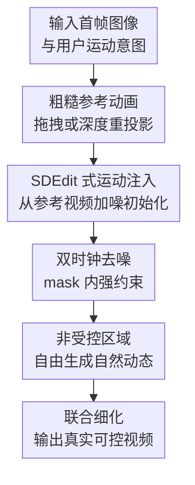

# Time-to-Move: Training-Free Motion-Controlled Video Generation via Dual-Clock Denoising

**会议**: ICLR2026  
**OpenReview**: [https://openreview.net/forum?id=OxO9OSYVw5](https://openreview.net/forum?id=OxO9OSYVw5)  
**代码**: 待确认  
**领域**: 视频生成  
**关键词**: 运动可控视频生成, 图像到视频扩散, 免训练控制, 双时钟去噪, 外观控制

## 一句话总结
Time-to-Move 把用户用拖拽或深度重投影得到的粗糙动画当作运动草图，通过首帧图像锚定外观，并在采样时对受控区域和非受控区域使用不同噪声时钟，从而在不训练、不改 backbone 的情况下实现精确运动与像素级外观控制。

## 研究背景与动机
**领域现状**：扩散式视频生成已经能合成画质较高、时序较连贯的视频，图像到视频模型还可以用单张首帧固定主体外观和场景身份。用户如果只想“让这张图里的物体动起来”，I2V 比纯文本到视频更接近真实创作流程，因为外观已经由首帧给定，模型主要需要补出后续动态。

**现有痛点**：真正困难的是运动控制。文本 prompt 可以说“船向右移动”或“镜头向前推进”，但很难精确指定哪个局部移动、移动到哪里、沿什么路径、背景该如何自然响应。已有基于轨迹、光流、bbox 或 motion token 的方法通常需要针对特定视频生成器做微调，计算成本高，而且一旦换成新的 I2V backbone，控制模块往往要重新适配。

**核心矛盾**：用户需要的是一个既精确又轻量的控制接口。精确意味着受控区域必须贴合指定运动；轻量意味着不能为每个 backbone 重训模型；真实感又要求未指定区域不能机械保持静止，而要根据运动自然生成尾流、遮挡、反射或相机视差。这三者在单一控制强度下很难同时满足。

**本文目标**：作者希望构建一个 training-free、plug-and-play 的采样过程，让任意图像到视频扩散模型都能读懂粗糙运动参考。这个过程需要同时支持局部物体运动、相机运动，以及运动过程中颜色、形状或插入物体等外观变化。

**切入角度**：论文借鉴 SDEdit 的思想：粗糙编辑结果不必真实，只要在合适噪声层级注入，就能作为结构先验引导生成。把这个思想搬到视频里，粗糙参考视频可以承担“运动草图”的角色；但视频中不同区域的约束强度不同，所以需要比单一 SDEdit timestep 更细的区域化采样机制。

**核心 idea**：把粗糙参考动画加噪后作为运动初始化，用首帧 I2V conditioning 保住身份，再用 dual-clock denoising 在 mask 内强对齐参考、mask 外弱约束生成自然动态。

## 方法详解
Time-to-Move 的方法很克制：它不训练控制网络，也不改模型结构，而是只改采样时如何初始化和如何在每一步混合受控区域。它把用户控制拆成三类输入：首帧图像 $I$、粗糙参考视频 $V^w$、以及逐帧二值 mask $M$。输出是一个既保留首帧身份、又遵循用户运动的视频 $x_0$。

### 整体框架
整体流程可以理解为“先做一个很丑但意图清楚的动画，再让 I2V 模型把它洗成真实视频”。用户先通过 cut-and-drag、旋转缩放、颜色修改，或者深度估计后的相机重投影，生成一个 warped reference video。这个参考视频通常有撕裂、孔洞、背景冻结等明显问题，但它明确告诉模型对象应该出现在哪些位置、相机大致怎么动、哪些像素外观应被保留或改变。

随后，TTM 将参考视频在较弱约束时钟 $t_{weak}$ 上加噪并启动反向扩散；在 $t_{strong}\le t<t_{weak}$ 的阶段，每一步都把 mask 内区域替换为参考视频在同一噪声层级下的版本，而 mask 外区域交给模型自由去噪。到达 $t_{strong}$ 后停止替换，让整段视频共同细化，消除前景和背景之间的拼接痕迹。

这个框架的关键在于，首帧图像和粗糙视频承担不同角色。首帧图像负责身份、纹理和整体外观锚定；粗糙视频负责几何位置、运动路径和可选的像素级外观变化。这样即使参考动画本身很粗糙，模型也能利用 I2V backbone 的生成先验把它变成自然视频。

### 关键设计
**1. 粗糙参考动画：把用户意图变成模型能读的运动草图**

TTM 不要求用户提供高质量参考视频，而是接受“可交互地产生的粗糙动画”。局部物体控制时，用户在首帧中选中目标区域，得到初始 mask $M_0$，再拖拽这块区域形成逐帧 mask $M$ 和位移轨迹。系统把首帧中的前景 sprite 按轨迹、旋转、缩放等变换渲染到背景上，空洞用最近邻方式简单填补。相机控制时，系统用单目深度估计把首帧反投影成点云，再按目标相机路径重投影出参考序列。

这个参考动画不追求真实感，甚至可以有遮挡孔洞和不自然拼接；它真正有价值的是保留用户指定的时空结构。与只给轨迹或光流相比，完整参考帧还携带像素外观，因此不仅能说“物体移动到这里”，也能说“移动时变成这个颜色”“这里插入一顶帽子”或“云的形状按这个轮廓展开”。

**2. SDEdit 式运动注入：用加噪参考视频规定早期动态**

论文把 SDEdit 从图像编辑迁移到视频运动控制。SDEdit 的直觉是：把一个粗糙编辑结果加噪到某个中间 timestep，再让扩散模型去噪，模型会保留粗糙布局，同时补足真实细节。TTM 对视频做同样的事：把 warped video $V^w$ 加噪到 $t^*$，以 $x_{t^*}\sim q(x_{t^*}\mid V^w)$ 作为采样起点。

如果直接用文本到视频模型，这一步会丢失首帧身份，因为模型只看到被严重加噪的参考视频，细节无法可靠保住。TTM 因此选择 I2V backbone，将干净首帧 $I$ 作为条件，采样过程写成 $x_0\sim p_\theta(x_0\mid x_{t^*}, I)$。运动由加噪参考注入，外观由首帧锚定，两者的分工使方法能在不训练的情况下同时追踪路径和保留身份。

**3. 双时钟去噪：对受控区域强跟随，对其他区域留自由度**

单一 timestep 会带来明显 trade-off。若噪声太小，视频会过度贴合粗糙参考，背景可能冻结，拖动船时船尾水花不会跟着变化；若噪声太大，模型生成更自然，但受控物体可能偏离轨迹。TTM 的 dual-clock denoising 用两个时钟拆开这个矛盾：$t_{strong}$ 用于 mask 内强对齐，$t_{weak}$ 用于 mask 外弱约束。

具体更新可以写成：

$$
x_{t-1}\leftarrow (1-M)\odot \hat{x}_{t-1}(x_t,t,I)+M\odot x^w_{t-1}.
$$

这里 $\hat{x}_{t-1}$ 是 I2V denoiser 预测，$x^w_{t-1}$ 是 warped reference 加噪到 $t-1$ 的版本。在 $t_{strong}\le t<t_{weak}$ 时，mask 内不断被参考视频覆盖，确保目标区域跟随指定运动；mask 外不被硬覆盖，可以生成合理背景运动、遮挡变化和局部细节。到 $t=t_{strong}$ 后，全部区域一起标准去噪，避免最终视频像硬拼贴。

**4. 全帧条件带来的联合运动与外观控制**

很多运动控制方法只使用稀疏点轨迹、bbox 或光流，它们能描述位移，却很难准确描述颜色、形状和新增对象。TTM 的参考信号是完整视频帧，所以 mask 内除了位置之外还可以包含像素级外观指令。论文展示了变色变形、物体插入、局部形状控制等例子：例如让变色龙沿指定轨迹移动，同时从绿色逐渐变成紫色。

这个设计也解释了为什么 TTM 比“文本描述外观变化 + motion flow”更稳定。文本里的“变成紫色”是全局、模糊、容易被模型忽略的条件；参考视频里的紫色像素是局部、逐帧、空间对齐的条件。由于 dual-clock 在受控区域强制保留参考信号，模型更容易把外观变化和运动变化绑定在同一个对象上。

### 一个完整示例
假设用户有一张小船在水面的首帧图像，希望小船沿弧线向右前方移动。用户先用 polygon 或分割器选中船体，系统得到第一帧 mask；然后用户拖拽船体，GUI 插值出每一帧的位置，并把船体 sprite 渲染到对应位置。此时得到的粗糙视频里，小船确实沿弧线移动，但背景水面可能是复制出来的，船尾尾流也不真实。

采样开始时，TTM 把这段粗糙视频加噪到 $t_{weak}$。在早期去噪阶段，mask 外水面由 I2V 模型自由生成，所以它可以根据船的运动补出波纹和尾流，而不是照搬静态背景；mask 内船体则在每一步被 noisy warped reference 覆盖，防止模型把船放到别的位置。到 $t_{strong}$ 后，覆盖停止，模型统一细化整段视频，使船体边界、水面反射和尾流连接自然起来。

相机控制也类似。用户选择一张室内图像后，系统估计深度、反投影点云，再沿指定相机路径重投影出粗糙视角变化。重投影会有孔洞和撕裂，但它准确表达相机路径。TTM 用这些帧引导 I2V 模型生成更真实的相机运动，并用模型先验修复深度 warping 产生的空洞。

### 损失函数 / 训练策略
TTM 没有训练损失，这是论文的核心卖点之一。它不新增训练数据，不微调 LoRA，不训练 ControlNet，也不需要为某个 backbone 学习 motion encoder。所有控制都发生在推理采样阶段。

需要调的只有少量采样超参，主要是 $t_{weak}$ 与 $t_{strong}$。论文在 SVD 上使用 $(t_{weak},t_{strong})=(36,25)$，在 CogVideoX 上使用 $(46,41)$。消融显示，较小的 $t_{strong}$ 通常会增强运动贴合、降低 CoTracker distance，但可能稍微降低成像质量；较大的 $t_{weak}$ 会增加动态程度。整体趋势是平滑的，说明方法不是只靠某个脆弱参数点工作。

效率上，TTM 不增加额外模型前向，也不引入反复重采样循环。它只是从 $t_{weak}<T$ 的中间噪声层级开始采样，并在若干步中做 mask blending，因此运行成本接近标准 I2V 采样，有时还会因为跳过更高噪声段而略快。

## 实验关键数据

### 主实验
论文在三个设置中评估 TTM：物体运动控制、相机运动控制、联合运动与外观编辑。物体运动使用 MC-Bench，比较训练型方法 DragAnything、MotionPro、Go-With-the-Flow，以及免训练 SG-I2V；相机运动使用 DL3DV-10K 子集，比较 GWTF，并用真实视频帧作为参照。

| 设置 | 方法 | 是否免训练 | 关键运动指标 | 视觉质量指标 | 结论 |
|------|------|------------|--------------|--------------|------|
| MC-Bench / SVD | DragAnything | 否 | CTD 10.645 | Imaging 0.554 | 动态强但伪影和形变明显 |
| MC-Bench / SVD | SG-I2V | 是 | CTD 5.796 | Imaging 0.621 | 轨迹误差低，但常引入整体相机共动 |
| MC-Bench / SVD | MotionPro | 否 | CTD 8.685 | Imaging 0.617 | 质量较稳，但需要训练 |
| MC-Bench / SVD | TTM | 是 | CTD 7.967 | Imaging 0.617 | 在免训练前提下接近或超过训练方法 |
| MC-Bench / CogVideoX | GWTF γ=0.5 | 否 | CTD 27.844 | Imaging 0.539 | 大运动下容易扭曲 |
| MC-Bench / CogVideoX | TTM | 是 | CTD 13.665 | Imaging 0.579 | 运动贴合和视频质量均更好 |

在 SVD 组，TTM 的质量指标基本追平 MotionPro，同时比 DragAnything 更少形变；SG-I2V 的 CTD 更低，但论文指出它常通过整个背景跟随物体移动来获得较低轨迹误差，因此 BG-Obj CTD 明显偏低。CogVideoX 组更能体现 TTM 的优势：相对 GWTF，TTM 的 CoTracker distance 大幅降低，Subject Consistency、Background Consistency、Motion Smoothness 和 Imaging Quality 也更高。

| 设置 | 方法 | MSE ↓ | FID ↓ | LPIPS ↓ | SSIM ↑ | Optical flow ↓ |
|------|------|-------|-------|---------|--------|----------------|
| DL3DV 相机控制 | GWTF γ=0.5 | 0.033 | 25.990 | 0.371 | 0.526 | 76.714 |
| DL3DV 相机控制 | GWTF γ=0.7 | 0.042 | 28.483 | 0.370 | 0.410 | 81.738 |
| DL3DV 相机控制 | 直接 warped reference | 0.025 | 33.443 | 0.339 | 0.560 | 65.494 |
| DL3DV 相机控制 | TTM | 0.022 | 21.966 | 0.332 | 0.586 | 60.558 |

相机运动实验中，TTM 在所有列出的指标上都达到最好或接近最好。相对最佳 GWTF 变体，像素 MSE 从 0.033 降到 0.022，FID 从 25.990 降到 21.966，光流误差也更低，说明它不仅贴近目标相机路径，也比粗糙深度重投影更真实。

### 消融实验
| 配置 | CoTracker distance ↓ | Dynamic degree ↑ | Imaging quality ↑ | 说明 |
|------|----------------------|------------------|-------------------|------|
| 单时钟 $t_{weak},t_{weak}$ | 27.316 | 0.265 | 0.623 | 约束太弱，运动跟随差 |
| 单时钟 $t_{strong},t_{strong}$ | 5.528 | 0.353 | 0.620 | mask 贴合强，但非受控区域易冻结 |
| RePaint 风格 $t_{weak},0$ | 2.923 | 0.404 | 0.576 | 轨迹很准，但整体不自然 |
| 背景完全不约束 $T,t_{strong}$ | 9.228 | 0.430 | 0.615 | 容易出现复制和偏移 |
| TTM 双时钟 $t_{weak},t_{strong}$ | 7.967 | 0.427 | 0.617 | 在贴合、动态和质量之间折中最好 |

### 关键发现
- 单纯把 SDEdit 搬到视频里不够，因为同一噪声强度无法同时满足前景强控制和背景自然响应。
- RePaint 式持续覆盖 mask 能让轨迹误差极低，但视觉质量明显下降，说明“贴合参考”本身不是目标，真实视频需要让受控区域也在后期共同细化。
- TTM 对 mask 误差比较稳健。论文对 mask 做不同尺寸的 erosion 和 dilation，CoTracker distance、Dynamic degree、Imaging quality 变化都很小，符合真实用户粗略标注的使用场景。
- 参数敏感性消融显示 $t_{weak}$ 与 $t_{strong}$ 周围的趋势平滑，方法不依赖极窄的调参窗口。
- TTM 已在 SVD、CogVideoX 和 WAN 2.2 上展示过，说明它确实更像采样层面的通用策略，而不是某个模型的私有插件。

## 亮点与洞察
- 最有价值的洞察是“粗糙动画足够当控制信号”。很多可控生成工作试图学习精细 motion representation，TTM 反而利用用户能直观产生的粗糙视频，把控制接口做得更接近创作软件。
- 双时钟去噪把 SDEdit 的单一强度扩展成空间异质强度，这个设计很简单，却准确击中了视频控制中的核心矛盾：该死死跟随的地方要跟随，该自由发挥的地方要自由。
- 论文没有把外观控制另做一个模块，而是自然利用 full-frame reference。只要参考视频包含像素级变化，motion control 和 appearance control 就可以共用同一套机制。
- 与训练型方法相比，TTM 的现实意义很强。视频生成 backbone 更新很快，给每个新模型重训控制模块成本巨大；采样层面的 plug-and-play 方法更容易跟上新模型。
- 这篇论文也提醒我们，评价运动控制时不能只看目标点误差。SG-I2V 这类方法可能通过相机共动降低物体轨迹误差，但用户真正想要的是物体相对背景运动正确，因此 BG-Obj CTD 这样的解耦指标很重要。

## 局限与展望
- 方法仍需要为不同 backbone 选择合适的 $t_{weak}$ 和 $t_{strong}$。虽然消融显示稳定区间不窄，但真实产品中仍需要自动化调参或根据任务自适应选择时钟。
- TTM 的身份保持依赖首帧可见内容。对于后来才进入画面的物体、被大遮挡后重新出现的结构，首帧无法提供足够锚点，模型只能依靠生成先验补全。
- 局部运动需要较完整的对象 mask。论文证明对粗糙 mask 鲁棒，但如果用户只给一个点、一个箭头或非常局部的涂抹，TTM 不像某些训练型轨迹方法那样天然支持。
- 相机运动控制依赖单目深度估计和点云重投影。若深度估计错误，粗糙参考视频的几何结构会偏，TTM 可能把错误路径当作控制目标。
- 当前 dual-clock 是二值 mask 与两个时钟的版本。未来可以扩展到多区域、多时钟、soft mask 或连续噪声 schedule，让不同对象、阴影、反射、遮挡边界拥有更细粒度控制。
- 长视频和复杂 articulated motion 仍未充分解决。拖拽 sprite 对刚性或近似刚性目标很方便，但对人体、动物肢体和多物体交互，粗糙参考动画本身可能需要更强的编辑工具。

## 相关工作与启发
- **vs SDEdit**: SDEdit 说明粗糙图像编辑可以通过加噪去噪变真实，TTM 的贡献是把这个思想迁移到视频运动，并解决单一 timestep 不适合区域差异的问题。
- **vs Go-With-the-Flow**: GWTF 通过 warped noise 实现运动控制，但需要对模型做大量训练。TTM 同样追求 backbone-agnostic，却直接利用参考视频和采样混合，因此免训练、适配更轻。
- **vs MotionPro / DragAnything**: 这些方法学习专门的轨迹或区域控制模块，在指定 backbone 上有效，但训练成本和迁移成本更高。TTM 的优势是通用性，劣势是依赖用户能构造出可用的 warped reference。
- **vs SG-I2V**: SG-I2V 也是免训练 I2V 控制，但更依赖特定层的注意力替换与优化，且容易诱发不期望的相机共动。TTM 用显式 reference video 与区域化去噪控制，更容易表达局部运动和外观变化。
- **vs 运动迁移方法**: 运动迁移需要已有 driving video，适合把一个视频的动态迁到另一张图上。TTM 不需要真实参考视频，用户用拖拽、深度重投影或简单 GUI 就能生成控制信号，更适合交互式创作。

## 评分
- 新颖性: ⭐⭐⭐⭐ 用粗糙参考视频做免训练控制并不复杂，但 dual-clock denoising 对视频运动控制的矛盾抓得很准，设计简洁有效。
- 实验充分度: ⭐⭐⭐⭐ 物体运动、相机运动、外观控制和多 backbone 都覆盖到了，消融也能解释设计必要性；不过外观控制主要还是定性展示。
- 写作质量: ⭐⭐⭐⭐ 论文主线清楚，图 2 和图 3 对理解方法很有帮助；部分实现细节和交互工具细节需要读附录才能完整复现。
- 价值: ⭐⭐⭐⭐⭐ 对快速迭代的视频生成生态来说，免训练、近乎零额外成本、可跨 backbone 的控制方法很实用，也给后续区域化采样控制提供了清晰范式。

<!-- RELATED:START -->

## 相关论文

- [\[CVPR 2026\] FlowMotion: Training-Free Flow Guidance for Video Motion Transfer](../../CVPR2026/video_generation/flowmotion_training-free_flow_guidance_for_video_motion_transfer.md)
- [\[ICLR 2026\] Dual-IPO: Dual-Iterative Preference Optimization for Text-to-Video Generation](dual-ipo_dual-iterative_preference_optimization_for_text-to-video_generation.md)
- [\[ICLR 2026\] LightCtrl: Training-free Controllable Video Relighting](lightctrl_training-free_controllable_video_relighting.md)
- [\[ICLR 2026\] EchoMotion: Unified Human Video and Motion Generation via Dual-Modality Diffusion Transformer](echomotion_unified_human_video_and_motion_generation_via_dual-modality_diffusion.md)
- [\[ICML 2026\] MotiMotion: Motion-Controlled Video Generation with Visual Reasoning](../../ICML2026/video_generation/motimotion_motion-controlled_video_generation_with_visual_reasoning.md)

<!-- RELATED:END -->
