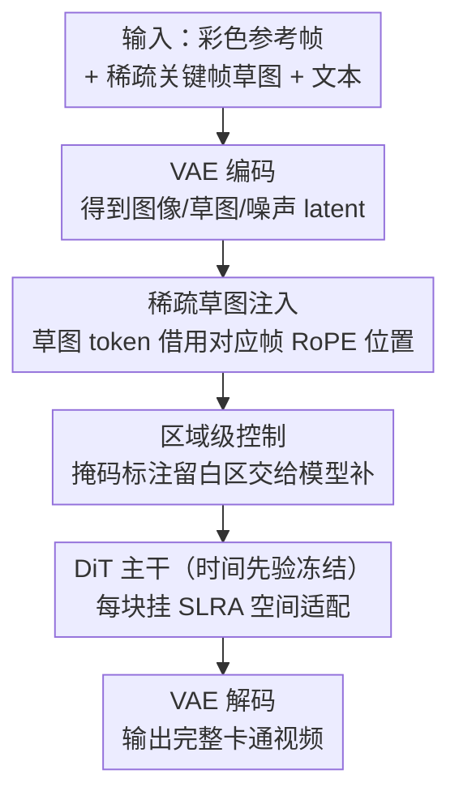

# ToonComposer: Streamlining Cartoon Production with Generative Post-Keyframing

**会议**: ICLR 2026  
**OpenReview**: [https://openreview.net/forum?id=28VE0XXyAa](https://openreview.net/forum?id=28VE0XXyAa)  
**论文**: [Project Page](https://lg-li.github.io/project/tooncomposer)  
**代码**: 见项目页（暂未公开仓库）  
**领域**: 视频生成 / 扩散模型  
**关键词**: 卡通生成, 后关键帧, 稀疏草图注入, DiT 适配, 低秩适配器

## 一句话总结
ToonComposer 把传统卡通制作里割裂的「补间（inbetweening）」和「上色（colorization）」两个阶段合并成一个统一的生成式「后关键帧（post-keyframing）」阶段，只需一张彩色参考帧 + 极少量关键帧草图，就能用一个 DiT 视频基础模型直接生成完整的高质量卡通视频，质量、运动一致性和效率都超过此前的两阶段方法。

## 研究背景与动机
**领域现状**：传统卡通/动画制作分为关键帧（keyframing）、补间、上色三个阶段。关键帧是艺术家创意所在，但补间和上色是高度重复、劳动密集的体力活——几秒动画就要画上百张帧。近年生成模型（ToonCrafter、AniDoc、LVCD 等）开始自动化这两步。

**现有痛点**：现有方法各有硬伤。补间类方法（ToonCrafter）难以从稀疏草图里插出大幅度运动，往往要求密集的多个关键帧才能补出流畅动作；上色类方法（AniDoc、LVCD）则要求**逐帧**草图，对艺术家来说工作量依然巨大。更糟的是，这两步被当作**串行的两个独立阶段**处理，前一阶段插出的草图一旦不准，误差会累积到上色阶段，产生伪影、质量下降。

**核心矛盾**：补间和上色其实高度相互依赖——两者本质上都在沿着关键帧/参考帧之间的**对应关系**做搜索与插值，机制是相通的。把它们硬拆成两步，既制造了冗余（要求密集草图），又制造了跨阶段误差累积。

**本文目标**：用一个统一的生成阶段同时完成补间 + 上色，让模型一次性联合利用关键帧草图和彩色参考帧的信息，从而（1）支持稀疏输入（最少一张草图 + 一张彩色帧），（2）避免跨阶段误差累积，（3）解放艺术家只画关键帧。

**切入角度**：直接复用现代视频基础模型（Wan 2.1）的强生成先验。但要把这类模型用于后关键帧有两个新难点：① 基础模型只支持文本/首帧这类**弱条件**，缺乏在**指定时间位置**精确注入稀疏草图的机制；② 旧的卡通域适配（ToonCrafter）依赖 UNet 里空间层和时间层**结构解耦**，可以只调空间层、冻结时间层，但现代 DiT 用的是**时空全耦合注意力**，层级冻结策略失效，硬调会破坏预训练的时间运动先验。

**核心 idea**：提出「后关键帧」范式，并为它设计两件关键武器——**稀疏草图注入机制**（在 token 序列里给草图配上对应时间位置的 RoPE 编码，实现任意时间戳精确控制）+ **空间低秩适配器 SLRA**（把适配限制在空间维度，给 DiT 换上卡通外观的同时不动它的时间先验）。

## 方法详解

### 整体框架
ToonComposer 以一个图生视频（I2V）的 DiT 基础模型（Wan 2.1，提供 1.3B / 14B 两档）为骨架，把后关键帧任务形式化为：给定一张彩色参考帧 $f_1$ 和一张位于时间位置 $j$ 的草图帧 $s_j$，直接生成 $K$ 帧卡通视频 $\{\hat f_k\}_{k=1}^{K} = G_\theta(f_1, s_j, e_{\text{text}})$。整条管线只跑**一次推理**就出最终成片，而非旧方法的「先插密集草图、再上色」两段式。

输入端，彩色参考帧和草图分别过 VAE Encoder 变成条件图像 latent / 条件草图 latent，噪声视频 latent 也准备好；草图经稀疏草图注入并入 token 序列，再送进 N 个堆叠的 DiT Block。每个 DiT Block 在原始的时空自注意力旁挂一个 SLRA 残差分支，负责卡通域的空间适配；时间先验由冻结的主干保留。最后经投影/反 patch 化 + VAE Decoder 解码成卡通视频。整个流程里只有稀疏草图注入的投影头、SLRA 和少量映射是可训练的，主干基本冻结。

### 关键设计

**1. 后关键帧范式：把补间与上色合并成一个生成阶段**

针对「两阶段串行导致误差累积 + 要求密集草图」这个根本痛点，作者不再把补间、上色当两个模型串起来，而是直接定义一个统一的后关键帧阶段：模型一次性吃进彩色参考帧和稀疏关键帧草图，联合做运动插值与上色。其依据是两步在机制上本就相通——都在沿关键帧间的对应关系做搜索/插值。合并的好处是双向的：一方面联合利用草图与色彩信息、不再有「插出的草图喂给上色器」这种跨阶段错误传播；另一方面只需一张草图 + 一张彩色帧就能起步，把艺术家从逐帧描线里解放出来，只保留最有创意的关键帧设计。这是全文的范式层创新，后面两个设计是为落地它而生。

**2. 稀疏草图注入：让草图在指定时间戳上精确控制**

基础 I2V DiT 只会把条件图像沿**通道维**和噪声 latent 拼接，本质是弱条件，没法表达「这张草图属于第 $j$ 帧、要在那个时间位置上精确生效」。本文改走**序列维**注入：先用一个额外投影头把条件草图 latent 编码成与模型 latent 维度兼容的草图 token $s'_j$，再做**位置编码映射**——直接借用第 $j$ 帧视频 token 的 RoPE 编码贴到草图 token 上，让它在每次注意力前都带着「我属于第 $j$ 帧」的时间身份，然后沿序列维和视频 token 拼接参与注意力。前向写作

$$\hat\epsilon = \epsilon_\theta\Big(\big[\{z_k^{(t)}\}_{k=1}^{K},\ \text{pad}(\{f'_{ic}\}_{c=1}^{C})\big]_c,\ \{s'_{in}\}_{n=1}^{N}\Big]_s,\ e_{\text{text}},\ t\Big),$$

其中 $\{s'_{in}\}_{n=1}^{N}$ 是 $N$ 张草图、$\{f'_{ic}\}_{c=1}^{C}$ 是 $C$ 张彩色参考帧，$[\cdot,\cdot]_s$ 表示沿 token 序列维拼接。这个设计天然支持「任意数量、任意时间位置」的多草图/多参考帧输入：运动简单时给一张草图，运动复杂时多给几张以加强控制。相比通道拼接，序列维 + 位置映射的方式不改动原噪声 latent 的结构，最大限度避免破坏预训练视频先验。作者还额外引入一个**位置感知残差**，带可调强度 $\alpha$，推理时把 $\alpha$ 从 1.0 降到 0.5 可允许生成结果对草图轻微偏离（如让嘴形更自然），在「忠实草图」和「自然连贯」之间给艺术家一个旋钮。

**3. 空间低秩适配器 SLRA：只换卡通外观、不动时间先验**

DiT 的 3D 全注意力把空间和时间表征缠在一起，无法像 UNet 那样「冻结时间层、只调空间层」做卡通域适配，直接全调又会破坏宝贵的时间运动先验。SLRA 的做法是给每个自注意力模块加一个**被约束在空间维度**的低秩残差分支：

$$h_{\text{res}} = \big[\text{attn}_{\tilde W}\big([h W_{\text{down}}]_{\text{reshape}}\big) W_{\text{up}}\big]_{\text{resume}},$$

其中 $W_{\text{down}}\in\mathbb{R}^{D\times D'}$、$W_{\text{up}}\in\mathbb{R}^{D'\times D}$ 是可训练的降维/升维矩阵，$D'\ll D$；$\tilde W=\{W_Q,W_K,W_V,W_O\}$ 是 SLRA 内部注意力的投影矩阵。关键在 reshape：它把时空 token 重排成 $\mathbb{R}^{(K+N)\times(H\times W)\times D'}$，使内部注意力**只在每帧的空间维 $H\times W$ 上独立计算**，再 resume 还原序列形状。这样信息传播被显式限制在空间维度，时间维原封不动。与 vanilla LoRA 给所有线性层加残差、隐式同时改空间和时间不同，SLRA 把适配精准锁在「外观」上，因此既能把基础模型的画风调成卡通，又保住了平滑过渡所依赖的时间先验。消融里 SLRA 全面优于 LoRA、纯时间适配（TO）、时空混合适配（ST）和退化的线性适配（LA）。

**4. 区域级控制：允许草图在空间上也稀疏**

艺术家有时只想画前景、把背景交给模型。若直接在草图里留白，模型会把空白当成「无纹理区域」，生成出扁平死板的画面（如一节纯蓝、没有细节的火车）。区域级控制让留白变成「请你根据上下文补」：训练时给草图帧 $s_{in}$ 随机加掩码 $m_{in}\in\{0,1\}^{H\times W}$（$m_{in}(i,j)=0$ 表示该处没画草图），并把掩码作为额外通道拼进编码 $\tilde s'_{in}=[E(s_{in}),\,m_{in}]_c$，让模型学会在被掩区域**根据上下文/文本重建合理内容**。推理时艺术家用画笔圈出留白区、赋值 $m_{in}$，模型就能据关键帧、草图和掩码自动补出合理运动（如让圈出区域的火车动起来）。它与时间维的稀疏关键帧互补——前者让输入在**时间上稀疏**，区域级控制让输入在**空间上稀疏**，进一步降低绘制负担。

### 损失函数 / 训练策略
模型按 Rectified Flow 当作条件扩散训练，预测从 logit-normal 分布采样的时间步 $t$ 处的速度 $v_t$。记输入为 $x_{in}=\big[[\{z_k^{(t)}\}_{k=1}^{K},\text{pad}(\{f'_{ic}\}_{c=1}^{C})]_c,\{\tilde s'_{in}\}_{n=1}^{N}\big]_s$，干净视频 latent 为 $z_0$，目标为最小化速度预测误差

$$\mathcal{L}=\mathbb{E}_{z_0,\eta,t}\big[\,\|v_t-\epsilon_\theta(x_{in},e_{\text{text}},t)\|_2^2\,\big],$$

其中 $\eta$ 是高斯噪声，$v_t$ 由 $\{z_k^{(t)}\}-\eta$ 导出。基础模型为 Wan 2.1（1.3B 与 14B 各一版），在自建 PKData 上训练 10 个 epoch，有效 batch size 16，AdamW，学习率 $10^{-5}$，SLRA 内部维度 $D'$ 默认 144，用 ZeRO stage-2 省显存。

## 实验关键数据

### 主实验
作者在两个基准上评测：合成基准（用草图模型从卡通电影帧自动生成草图，有 GT，用 LPIPS/DISTS/CLIP 等参考型指标）和自建 **PKBench**（30 个原创场景，含彩色参考帧、文本、专业艺术家手绘的首尾草图，刻意作为分布外的真实场景测试，用 VBench 无参考指标）。对比的是 AniDoc、LVCD、ToonCrafter 等两阶段方法。

合成基准结果（数值越好越优）：

| 方法 | LPIPS↓ | DISTS↓ | CLIP↑ | 主体一致↑ | 运动平滑↑ | 美学质量↑ |
|------|--------|--------|-------|-----------|-----------|-----------|
| AniDoc | 0.3734 | 0.5461 | 0.8665 | 0.9067 | 0.9798 | 0.4962 |
| LVCD | 0.3910 | 0.5505 | 0.8428 | 0.8316 | 0.9810 | 0.4984 |
| ToonCrafter | 0.3830 | 0.5571 | 0.8463 | 0.8075 | 0.9550 | 0.5035 |
| **ToonComposer (1.3B)** | **0.1698** | 0.1097 | 0.9292 | 0.9243 | 0.9889 | 0.5576 |
| **ToonComposer (14B)** | 0.1785 | **0.0926** | **0.9449** | **0.9451** | 0.9886 | **0.5999** |

DISTS 从对手的 ~0.55 骤降到 0.09–0.11，感知质量的差距非常悬殊。真实手绘基准 PKBench：

| 方法 | 主体一致↑ | 运动平滑↑ | 背景一致↑ | 美学质量↑ |
|------|-----------|-----------|-----------|-----------|
| AniDoc | 0.9456 | 0.9842 | 0.9664 | 0.6611 |
| LVCD | 0.8653 | 0.9724 | 0.9394 | 0.6479 |
| ToonCrafter | 0.8567 | 0.9674 | 0.9343 | 0.6822 |
| **ToonComposer (14B)** | **0.9509** | **0.9910** | **0.9681** | **0.7345** |

在分布外的真实手绘草图上仍全指标领先，美学质量优势尤其明显（0.73 vs 对手 0.65–0.68）。

### 消融实验
SLRA 适配策略对比（合成基准）：

| 配置 | 适配范围 | 用注意力 | LPIPS↓ | DISTS↓ | CLIP↑ |
|------|----------|----------|--------|--------|-------|
| **SLRA (Ours)** | 空间 | 是 | **0.1874** | **0.0955** | **0.9634** |
| TO 仅时间 | 时间 | 是 | 0.1956 | 0.1109 | 0.9581 |
| ST 时空混合 | 混合 | 是 | 0.1977 | 0.1068 | 0.9587 |
| LA 线性适配 | 混合 | 否 | 0.2030 | 0.1091 | 0.9589 |
| LoRA | 混合 | 否 | 0.1922 | 0.1082 | 0.9628 |

模块消融（稀疏草图注入 / 位置编码映射 / 位置感知残差）：

| 稀疏草图注入 | 位置映射 | 位置感知残差 | LPIPS↓ | DISTS↓ | CLIP↑ |
|:---:|:---:|:---:|--------|--------|-------|
| ✓ | ✓ | ✓ | **0.1874** | **0.0955** | **0.9634** |
| ✗ | ✓ | ✓ | 0.2534 | 0.1398 | 0.9493 |
| ✓ | ✗ | ✓ | 0.2893 | 0.1659 | 0.9286 |
| ✓ | ✓ | ✗ | 0.2293 | 0.1097 | 0.9308 |

### 关键发现
- **位置编码映射是稀疏草图注入的命门**：去掉它（草图 token 失去时间身份）DISTS 从 0.0955 恶化到 0.1659，是模块消融里掉得最狠的一项，印证了「让草图知道自己属于哪一帧」对处理任意时间戳稀疏输入的必要性。
- **空间约束优于一切混合/全量适配**：SLRA（仅空间）全面胜过 TO（仅时间）、ST（时空混合）、LA（线性）和 LoRA。即使把 LoRA 的 rank 调到 24 以匹配 SLRA 参数量，它仍因「无差别地同时改时空、破坏时间先验」而落后——说明赢点不在参数量，而在把适配精准锁在空间维度。
- **把草图换成通道拼接会崩**：用传统通道拼接替换序列维注入后所有指标显著下降（LPIPS 0.1874→0.2534），因为通道拼接改动了原噪声 latent 结构、扰乱了预训练视频先验。
- **位置感知残差给可控性留旋钮**：$\alpha$ 从 1.0 调到 0.5 可让生成对草图轻微偏离（如自然化嘴形），在忠实与自然之间柔性权衡。

## 亮点与洞察
- **把「补间 + 上色」重新理解为同一件事**：作者点出两步都在沿关键帧对应关系做插值，从而合并成单阶段，既消除跨阶段误差累积、又把密集逐帧草图降到稀疏关键帧，是范式层面的洞察而非堆模块。
- **SLRA 是「UNet 时代空间-only 调参」在 DiT 时代的等价替身**：旧方法靠结构解耦冻结时间层，DiT 全耦合后这条路断了；SLRA 用 reshape 把内部注意力强行约束到空间维，巧妙地在全耦合架构里复现了「只动外观、不动运动」的效果，这个 reshape 技巧可迁移到任何想在 DiT 上做受限域适配的场景。
- **时间稀疏（稀疏关键帧）+ 空间稀疏（区域级控制）正交互补**：两个维度的稀疏化叠加，最大化地把艺术家从重复劳动里抽离，产品思维很到位。
- **自建 PKBench 用真人手绘草图做分布外评测**：而非只用算法合成草图自评，更贴近真实生产，评测设计诚实。

## 局限与展望
- 强依赖一个强大的视频基础模型（Wan 2.1）及其时间先验，方法本质是「在好底座上做受限适配」，底座能力上限即方法上限；换到更弱的视频模型上效果未知。
- 训练数据 PKData（37K 卡通片段）的草图用四个 CNN 草图模型 + 自训的 IC-Sketcher 合成，与真人手绘风格仍有差距；虽然 PKBench 显示泛化尚可，但极端个性化画风下的鲁棒性待考。
- 论文未给出推理速度/显存的量化对比，14B 版的实用部署成本（尤其长视频）值得关注；1.3B 版在部分指标（如 LPIPS）反而略优，二者取舍缺乏更系统的分析。
- 区域级控制依赖训练时随机掩码学到的「上下文补全」能力，对大面积留白或语义复杂留白区的可靠性边界论文未深入。

## 相关工作与启发
- **vs ToonCrafter**：ToonCrafter 基于 UNet、靠冻结时间层做空间-only 卡通适配，且补间/上色仍偏两段式，难处理稀疏草图下的大运动；本文搬到 DiT 全耦合架构，用 SLRA 复现空间-only 适配、用单阶段后关键帧消除误差累积，稀疏输入下质量大幅领先。
- **vs AniDoc / LVCD**：二者是纯上色方法，要求**密集逐帧草图**，且要先靠别的模型插出密集草图再上色（典型两阶段误差累积）；本文一次推理同时补间 + 上色，只要稀疏关键帧。
- **vs 通用 I2V DiT（Wan）**：Wan 只支持文本/首帧弱条件，无法在指定时间位置精确注入草图；本文用序列维草图注入 + RoPE 位置映射补上了「任意时间戳精确控制」这块能力。
- **vs LoRA / ControlNet 式适配**：ControlNet/IP-Adapter 注入视觉条件但不解决「时空全耦合下如何只调空间」；LoRA 无差别调所有线性层会扰乱时间先验。SLRA 的空间约束式低秩适配提供了一个针对视频域适配更克制、更对症的范式。

## 评分
- 新颖性: ⭐⭐⭐⭐⭐ 后关键帧范式 + SLRA 在 DiT 全耦合架构上复现「空间-only 适配」，思路和落地都有原创性。
- 实验充分度: ⭐⭐⭐⭐ 合成 + 真人手绘双基准、模块/适配双消融齐全，但缺速度/显存量化与 1.3B↔14B 系统取舍分析。
- 写作质量: ⭐⭐⭐⭐⭐ 动机推导清晰，把两阶段合并的依据和两大难点讲得很透。
- 价值: ⭐⭐⭐⭐⭐ 直击卡通工业最耗人力的环节，稀疏输入 + 区域级控制对真实生产很实用。

<!-- RELATED:START -->

## 相关论文

- [\[ICLR 2026\] Generative View Stitching](generative_view_stitching.md)
- [\[ICLR 2026\] Arbitrary Generative Video Interpolation](arbitrary_generative_video_interpolation.md)
- [\[CVPR 2026\] LinVideo: A Post-Training Framework towards O(n) Attention in Efficient Video Generation](../../CVPR2026/video_generation/linvideo_a_post-training_framework_towards_on_attention_in_efficient_video_gener.md)
- [\[ICLR 2026\] Light-X: Generative 4D Video Rendering with Camera and Illumination Control](light-x_generative_4d_video_rendering_with_camera_and_illumination_control.md)
- [\[ICLR 2026\] SimpleGVR: A Simple Baseline for Latent-Cascaded Generative Video Super-Resolution](simplegvr_a_simple_baseline_for_latent-cascaded_generative_video_super-resolutio.md)

<!-- RELATED:END -->
