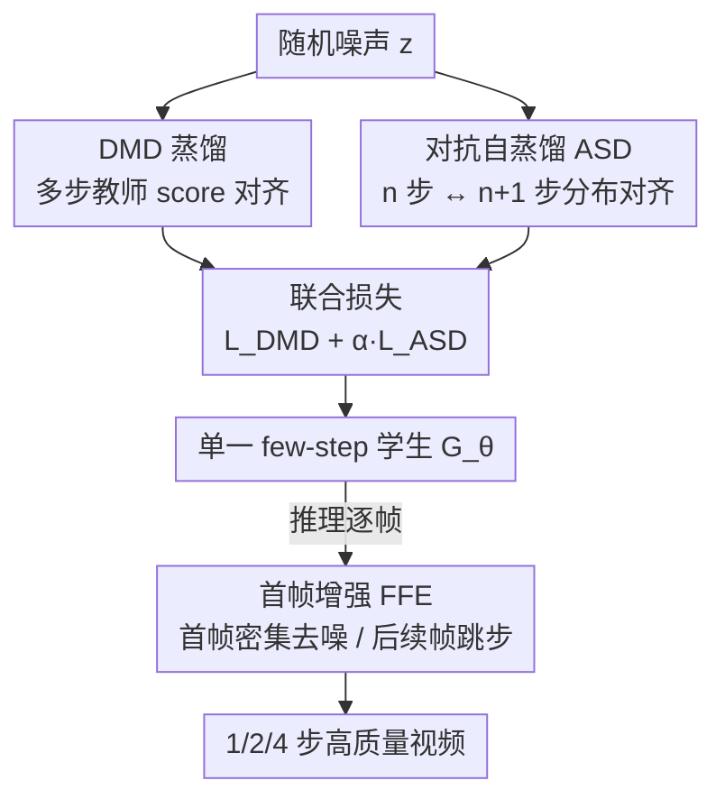

# Towards One-Step Causal Video Generation via Adversarial Self-Distillation

**会议**: ICLR 2026  
**OpenReview**: [https://openreview.net/forum?id=P3O0fNmnWa](https://openreview.net/forum?id=P3O0fNmnWa)  
**代码**: https://github.com/BigAandSmallq/SAD.git (有)  
**领域**: 视频生成 / 扩散模型 / 蒸馏加速  
**关键词**: 因果视频生成, 蒸馏, 对抗自蒸馏, 极少步推理, 首帧增强

## 一句话总结
针对因果视频扩散模型在 1~2 步极少步生成时质量崩坏的问题，本文在 DMD 蒸馏框架上提出对抗自蒸馏（ASD）——用判别器把学生模型的 $n$ 步输出和 $n{+}1$ 步输出在分布上对齐，再配合推理期的首帧增强（FFE）策略，单个蒸馏模型就能在 1/2/4 步多种设置下都保持高质量，在 VBench 上超越 SOTA。

## 研究背景与动机
**领域现状**：当前高质量视频生成有两条主线。扩散模型用双向注意力一次性去噪整段视频，时序一致性好但必须联合合成整段、无法逐帧交互；自回归模型逐帧生成、支持因果交互，但严重依赖前序帧导致误差累积。近期的混合范式（CausVid、Self Forcing 等）把时序建模做成自回归、空间去噪做成扩散，兼顾两者优点，却也继承了多步迭代去噪的效率瓶颈——每生成一帧都要跑多步去噪，推理很慢。

**现有痛点**：蒸馏是加速扩散的主流手段，把多步教师压成几步学生。但现有蒸馏目标基本都是把"几步学生"直接对齐到"多步教师"的预测分布。当学生只跑 1~2 步时，它和多步教师之间的语义/统计鸿沟变得过大，直接对齐训练极不稳定，质量急剧退化。换句话说：**步数越少，要跨越的鸿沟越大**，这正是极少步蒸馏的本质难点。

**核心矛盾**：监督信号只有"远处的多步教师"这一个锚点，学生跨度太大时这个锚点反而成了不稳定的牵引；同时一个 DMD 蒸馏出来的学生只对某个固定步数最优（4 步就只擅长 4 步），换步数还得重新蒸馏，缺乏灵活性。

**本文目标**：(1) 让极少步（尤其 1 步）的因果视频生成质量可用；(2) 单个模型灵活支持多种推理步数，免去为每个步数反复蒸馏。

**切入角度**：作者的关键观察是——与其让学生去够"远处的教师"，不如让学生先对齐"近处的自己"。$n$ 步和 $n{+}1$ 步只差一步，分布鸿沟小得多，作为额外监督既平滑又信息量足（既含教师的全局知识，又含学生自身局部一致的行为）。另一个观察是因果生成里首帧无任何上下文、对质量最敏感，而后续帧冗余度高、可以省步。

**核心 idea**：用"$n$ 步↔$n{+}1$ 步"的对抗自蒸馏代替"学生↔多步教师"的单一对齐，再叠加"首帧多去噪、后续帧跳步"的非均匀推理策略。

## 方法详解

### 整体框架
方法分**训练**和**推理**两条线。训练时学生在标准 DMD 蒸馏（被多步教师的 score 监督）之上，额外引入一条自监督：同一个学生模型分别跑 $n$ 步和 $n{+}1$ 步得到两份生成结果，加噪后送进判别器 $D_n$，用相对配对 GAN 目标把这两份相邻步数的分布对齐，让 ASD 损失和 DMD 损失联合优化生成器。生成器 $G_\theta$、生成数据的 score 估计器（teaching assistant）、判别器 $D_n$ 三者交替更新。推理时不再对所有帧用同样步数，而是给首帧分配密集去噪（≥4 步）、给后续帧大幅跳步（1~2 步），即首帧增强（FFE）。最终一个蒸馏模型即可灵活支持 1/2/4 步等多种设置。

### 关键设计

**1. 对抗自蒸馏 ASD：用相邻步数的自对齐代替遥远的师生对齐**

这一设计直接针对"学生只跑 1~2 步、离多步教师太远导致训练不稳"的痛点。作者不再只让学生去逼近多步教师，而是让同一个学生模型自己跑 $n$ 步得到 $G^n_\theta(z_1)$、跑 $n{+}1$ 步得到 $G^{n+1}_\theta(z_2)$，把这两份输出加噪后交给判别器 $D_n$ 判别，用相对配对 GAN（RpGAN）目标把它们在分布层面拉到不可区分。ASD 损失为

$$L_{\text{ASD}}(\theta,\psi)=\mathbb{E}_{z_1,z_2}\big[f\big(D^n_\psi(\Psi(G^n_\theta(z_1)))-D^n_\psi(\Psi(G^{n+1}_\theta(z_2)))\big)\big],$$

其中 $f(t)=-\log(1+e^{-t})$，$\Psi$ 是加噪过程，生成器 $G^n_\theta$ 最大化该损失、判别器 $D^n_\psi$ 最小化它。训练时每步随机采一个 $n\in\{1,\dots,N\}$，让模型在所有相邻步数对上都被约束。最终生成器用 $L_{\text{total}}=L_{\text{DMD}}+\alpha\cdot L_{\text{ASD}}$ 联合优化。

之所以有效有两点：其一，相邻两步的分布鸿沟远小于"几步 vs 多步"的鸿沟，监督更平滑、训练更稳；其二，$n$ 步学生同时拿到了"教师轨迹的全局知识"和"$n{+}1$ 步自身局部一致行为"两路信号，比只盯教师信息量更足。判别器实现上很省：不同 $n$ 的 $D_n$ 共享同一 backbone（复用冻结的 fake score 函数），只把第 $n$ 维输出 logit 当作 $D_n$ 的判别输出，几乎不增加参数。

**2. 步数统一的单模型：一次蒸馏支持多种推理步数**

DMD 的一大软肋是不灵活——蒸出来的学生只对某个固定步数最优，4 步和 2 步得各蒸一次。ASD 因为约束的是"任意相邻步数对"的分布一致，天然让同一个学生在 1/2/4 步下都保持自洽。这意味着部署时一个模型就能根据资源/时延需求动态切换步数（速度-质量权衡），无需为每个步数反复重蒸馏。这一性质不是额外加的模块，而是 ASD 跨步对齐目标的直接副产物，但它正是论文"灵活性"卖点的来源，因此单列说明。

**3. 首帧增强 FFE：把去噪预算非均匀地分给最关键的首帧**

这一设计针对因果生成特有的误差传播问题。作者实测预测 $\hat{x}_0$ 在不同去噪步数下的余弦相似度矩阵（图 4）发现：首帧在各步之间相似度很低，说明每一步去噪都重要、信息高度不冗余；而后续帧步间相似度高、冗余大，适合少步预测。根因在于首帧没有任何上下文、要从零合成初始状态，一旦有瑕疵会沿因果链一路传播污染整段视频。

基于此，FFE 在推理时给首帧分配密集去噪（至少 4 步），给后续帧用大跳步（1~2 步即可）。这样既把计算预算压在刀刃上、保住整体保真度，又让平均步数维持在极低水平。消融显示 FFE 对 1 步生成尤其关键，单独加 FFE 就能把 1 步总分抬到甚至超过原始 2 步的水平。

### 损失函数 / 训练策略
生成器联合优化 $L_{\text{total}}=L_{\text{DMD}}+\alpha\cdot L_{\text{ASD}}$；生成数据 score 函数（TA 模型）用标准扩散去噪损失 $L^\phi_{\text{gen}}=\lVert\epsilon^\phi_{\text{gen}}(x_t,t)-\epsilon\rVert_2^2$ 在学生生成的数据上微调；判别器用 ASD 损失更新。三者交替训练。整体基于 Self Forcing 的因果蒸馏范式，backbone 为 Wan2.1-T2V-1.3B（Flow Matching），用 CausVid 的非对称初始化协议稳定早期因果训练；对抗目标采用 RpGAN + R1/R2 正则（沿用 R3GAN）；训练用 4 步去噪 schedule，推理时叠加跳步策略。

## 实验关键数据

### 主实验
VBench 上与同参数量、同分辨率的开源 T2V 模型对比，步数从 64 到 1。带 FFE 的 $n$ 步记作 $n^*$，†为在 1/2 步设置下重训的版本。

| 设置 | 模型 | 去噪步数 | Total | Quality | Semantic |
|------|------|---------|-------|---------|----------|
| 多步 | Wan2.1 | 50 | 84.26 | 85.30 | 80.09 |
| 多步 | SkyReels-V2 | 30 | 82.67 | 84.70 | 74.53 |
| 4 步 | CausVid | 4 | 81.20 | 84.05 | 69.80 |
| 4 步 | Self Forcing | 4 | 84.31 | 85.07 | 81.28 |
| 4 步 | **本文** | 4 | **84.38** | 85.16 | 81.25 |
| 2 步 | Self Forcing† | 2 | 83.49 | 84.20 | 80.62 |
| 2 步 | **本文** | $2^*$ | **84.32** | 85.15 | 81.02 |
| 1 步 | Self Forcing† | 1 | 80.62 | 81.19 | 78.35 |
| 1 步 | **本文** | $1^*$ | **83.89** | 84.55 | 81.24 |

亮点：1 步设置下本文比专门重训的 Self Forcing 总分高 **3.27** 分；用约 8%/13% 的 Wan2.1/SkyReels 去噪步数就达到更优视觉效果。用户研究中本文 1 步、2 步对 Self Forcing 分别取得 **96%、62%** 的偏好率。

### 消融实验
2 步与 1 步生成下逐项消融（无 FFE 的步数即均匀步数）：

| ASD | FFE | 1步 Total | 1步 Semantic | 2步 Total |
|-----|-----|-----------|--------------|-----------|
| × | × | 78.13 | 69.31 | 82.61 |
| ✓ | × | 80.65 | 76.15 | 83.28 |
| × | ✓ | 83.04 | 79.95 | 83.80 |
| ✓ | ✓ | 83.89 | 81.24 | 84.32 |

### 关键发现
- **ASD 单独贡献**：1 步生成总分 +2.52、语义分 +6.84，说明跨相邻步对齐显著稳住了极少步训练。
- **FFE 单独贡献更猛**：1 步生成总分 +4.19、语义分 +10.64，单加 FFE 就让 1 步质量超过原始 2 步——印证"首帧是误差传播源头"的判断。
- **两者互补**：ASD 改训练、FFE 改推理，叠加后在所有步数下都最优；定性上去掉 ASD 的变体在 $2^*$ 设置 t=5s 出现背景漂移/人物模糊，$1^*$ 设置 t=2.5s 就严重糊化。

## 亮点与洞察
- **"对齐近处的自己"而非"远处的教师"**：把蒸馏的监督锚点从遥远的多步教师换成相邻一步的自身输出，是个很轻巧但击中要害的视角——分布鸿沟小、监督平滑、还白拿一路自蒸馏信号。
- **跨步对齐换来步数无关的单模型**：因为约束的是任意相邻步数对，灵活支持多步数成了免费副产物，部署时一个权重应对所有时延预算，省掉反复重蒸馏，工程价值很高。
- **用相似度矩阵把"首帧最关键"量化出来**：FFE 不是拍脑袋，而是用 $\hat{x}_0$ 步间余弦相似度证明首帧低冗余、后续帧高冗余，再据此非均匀分配预算——这种"先测冗余再分预算"的思路可迁移到其他自回归/因果生成的步数调度。
- **判别器零额外参数**：不同 $n$ 的 $D_n$ 共享 backbone、只取第 $n$ 维 logit，复用冻结 fake score，省参省算。

## 局限与展望
- 实验只在 Wan2.1-1.3B 这一 backbone、VBench 这一基准上验证，更大模型/更长视频上的可扩展性未知。
- FFE 给首帧固定至少 4 步是基于经验观察，步数分配是手工设定而非自适应，不同内容（如首帧本就简单的场景）可能并非最优。
- ASD 引入判别器和对抗训练，相比纯 DMD 增加了训练复杂度与不稳定风险，超参 $\alpha$ 的敏感性论文未充分讨论。
- 横向比较时不同模型步数/分辨率不完全一致，分数对比需带 caveat，不宜只看绝对数值。

## 相关工作与启发
- **vs DMD / DMD2**：DMD 把几步学生对齐到多步教师，本文沿用 DMD 作为基础但额外加一条"$n$↔$n{+}1$ 步"的对抗自对齐，解决了 DMD 在极少步下不稳、且单模型只对固定步数最优的问题。
- **vs ADD / UFOGen / SDXL-Lightning / LADD**：这些对抗蒸馏要么让学生最终输出逼近真实数据，要么对齐学生与教师的中间去噪态；本文对齐的是学生自身相邻步数的输出，监督来源不同、且天然支持多步数。
- **vs Self Forcing / CausVid**：本文以 Self Forcing 训练范式 + CausVid 初始化为基底，但在极少步（1/2 步）场景下通过 ASD+FFE 显著超越它们重训的少步版本。

## 评分
- 新颖性: ⭐⭐⭐⭐ 把蒸馏监督锚点从师生改成相邻步自蒸馏，视角新颖且自然带来步数灵活性。
- 实验充分度: ⭐⭐⭐⭐ VBench 多步对比 + 用户研究 + 清晰消融，但 backbone/基准较单一。
- 写作质量: ⭐⭐⭐⭐ 动机推导清楚，图 1/图 4 把核心直觉和观察可视化得很到位。
- 价值: ⭐⭐⭐⭐ 单模型支持多步数 + 极少步可用，对实时/交互式视频生成的落地很实用。

<!-- RELATED:START -->

## 相关论文

- [\[ICML 2026\] AAD-1: Asymmetric Adversarial Distillation for One-Step Autoregressive Video Generation](../../ICML2026/video_generation/aad-1_asymmetric_adversarial_distillation_for_one-step_autoregressive_video_gene.md)
- [\[ICLR 2026\] Streaming Autoregressive Video Generation via Diagonal Distillation](streaming_autoregressive_video_generation_via_diagonal_distillation.md)
- [\[ICLR 2026\] Realtime Video Frame Interpolation Using One-Step Diffusion Sampling](realtime_video_frame_interpolation_using_one-step_diffusion_sampling.md)
- [\[AAAI 2026\] Phased One-Step Adversarial Equilibrium for Video Diffusion Models](../../AAAI2026/video_generation/phased_one-step_adversarial_equilibrium_for_video_diffusion_models.md)
- [\[ICML 2025\] Diffusion Adversarial Post-Training for One-Step Video Generation](../../ICML2025/video_generation/diffusion_adversarial_post-training_for_one-step_video_generation.md)

<!-- RELATED:END -->
