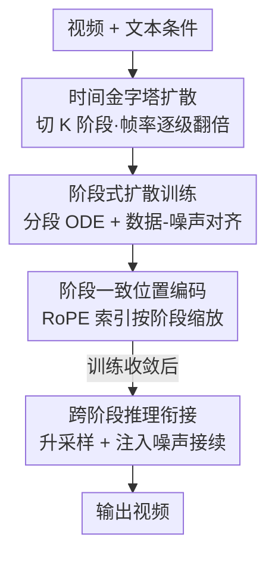

# TPDiff: Temporal Pyramid Video Diffusion Model

**会议**: ICLR 2026  
**OpenReview**: [https://openreview.net/forum?id=Eg3KqoI9tS](https://openreview.net/forum?id=Eg3KqoI9tS)  
**领域**: 视频生成 / 扩散模型  
**关键词**: 视频扩散、时间金字塔、训练加速、数据-噪声对齐、阶段式扩散

## 一句话总结
TPDiff 把视频扩散的去噪过程切成多个阶段、让帧率沿去噪逐级翻倍（只有最后一阶段跑满帧率），再配一套统一支持 DDIM 与 flow matching 的「阶段式扩散」训练法，在不掉生成质量的前提下把训练成本砍掉约一半、推理提速 1.5×。

## 研究背景与动机
**领域现状**：当下最强的视频扩散模型（Sora、Kling 等）靠 DiT + 注意力联合建模时空分布，效果惊艳，但注意力对序列长度是二次复杂度，视频又把序列拉得很长，导致训练和推理代价高得离谱，而且随着对长视频的需求增加，代价还会继续膨胀。

**现有痛点**：已有的提效路线各有硬伤。级联框架（Show-1、Lavie）先在低分辨率建模再超分，会累积误差、还显著拖慢推理；SimDA 用 3D 卷积换注意力虽然快，但牺牲了注意力的可扩展性；最近的 pyramid flow 提出「空间金字塔」——早期去噪步用低分辨率、后期逐渐升到全分辨率，思路很对，但它只在 flow matching 上验证过、用自回归方式生成拖慢推理，而且完全没碰**时间维度**的金字塔。

**核心矛盾**：视频是高度冗余的模态（相邻帧差异极小），且扩散反向过程本质上是熵递减的——去噪早期 latent 信噪比低、信息量少、帧间时序关系很弱。也就是说，在去噪早期维持满帧率纯属浪费算力，但 vanilla 扩散框架被「全程固定帧率」死死锁住，没法把这部分冗余省下来。

**本文目标**：（1）让帧率沿去噪过程递增、只在最后阶段满帧；（2）找到一种能统一支持不同扩散形式（DDIM/flow matching）训练多阶段模型的方法；（3）保证不退化生成质量。

**切入角度**：既然冗余主要在「帧的时间密度」上、而且早期去噪阶段本就不需要精细时序，那就把「空间金字塔」搬到时间轴，做**时间金字塔**——用单个模型处理不同帧率，避免像旧方法那样额外训一个时序插值网络。

**核心 idea**：把扩散过程沿时间轴切成 K 个阶段、帧率逐阶段翻倍，再用「阶段式扩散 + 数据-噪声对齐」把多阶段训练统一成一个可解的分段概率流 ODE 问题。

## 方法详解

### 整体框架
TPDiff 的输入是文本/图像条件，输出是视频；与固定帧率的 vanilla 视频扩散不同，它沿去噪方向让帧率逐级上升。具体把去噪过程切成 $K$ 个阶段 $\{[t_k, t_{k-1})\}$，第 $k$ 阶段的帧率降为原始的 $\frac{1}{2^{k-1}}$，只有最后一阶段在满帧率运行——平均序列长度被大幅压缩，注意力的二次代价随之骤降。

整条管线要解决三个工程问题：阶段之间帧率不同，怎么用**一个**模型统一训练（阶段式扩散）；不同扩散形式（DDIM 曲线 ODE 路径 / flow matching 直线路径）怎么用同一套推导覆盖（数据-噪声对齐让分段 ODE 近似确定）；升采样后帧的位置索引错位怎么修（阶段一致位置编码）；以及推理时相邻阶段如何无缝衔接（跨阶段推理）。下面的框架图给出鸟瞰，四个贡献模块的排列顺序与后面「关键设计」一一对应。

### 关键设计

**1. 时间金字塔扩散：让帧率沿去噪过程逐级翻倍，只在最后阶段满帧**

这是全文的地基，直接针对「早期去噪不需要满帧」这一观察。作者把去噪过程切成 $K$ 个阶段 $\{[t_k,t_{k-1})\}_{k=K}^{1}$，第 $k$ 阶段帧率是原始的 $\frac{1}{2^{k-1}}$：去噪刚开始（高熵、信噪比低）时帧率最低，越接近 $t=0$ 帧率越高，最后一阶段才跑满帧率做精细刻画。进入新阶段时，新增的帧先由已有帧做时间插值得到初值，再继续去噪。关键在于**用单个模型**学所有阶段的数据分布，而不像 Lavie/Show-1 那样额外训一个时序插值网络。这样平均序列长度被压短：生成长度 $T$ 的视频时，注意力的平均代价从 $T^2$ 降到约 $\frac{1}{3}(T^2+(\frac{T}{2})^2+(\frac{T}{4})^2)\approx 0.44T^2$，几乎砍半，训练和推理同时受益。

**2. 阶段式扩散训练：用分段概率流 ODE + 数据-噪声对齐统一不同扩散形式**

vanilla 扩散并不支持多阶段训练，难点在于：每个阶段需要拿到「阶段内的目标」（DDIM 里是 $\epsilon$、flow matching 里是 $\frac{dx_t}{dt}$）和阶段内的中间 latent $x_t$。作者先用统一扩散形式 $x_t=\gamma_t x_0 + \sigma_t \epsilon$ 把两类框架抽象在一起（不约束 $\gamma_t,\sigma_t$ 的参数化），再借 DPM-Solver 把任意两点关系套到当前阶段，得到中间 latent 关于阶段起点 $\hat{x}_{s_k}$ 的表达式：

$$x_t = \frac{\gamma_t}{\gamma_{s_k}}\hat{x}_{s_k} - \gamma_t \int_{\lambda_{s_k}}^{\lambda_t} e^{-\lambda}\epsilon(x_{t_\lambda},t_\lambda)\, d\lambda$$

这个积分里 $\epsilon$ 一般不是常数，没法直接闭式求解。作者的破题点是**数据-噪声对齐**：训练前先为每段视频预先指定目标噪声分布，用匈牙利匹配（`scipy.optimize.linear_sum_assignment`，一行代码）最小化视频-噪声对的总距离，把噪声采样限制在最近的窄范围内。这样 ODE 路径在训练时近似确定，阶段内 $\epsilon_k$ 可视为常数，积分坍缩成闭式：

$$\epsilon_k = \frac{\frac{\hat{x}_{e_k}}{\gamma_{e_k}} - \frac{\hat{x}_{s_k}}{\gamma_{s_k}}}{\frac{\sigma_{e_k}}{\gamma_{e_k}} - \frac{\sigma_{s_k}}{\gamma_{s_k}}}$$

于是可以像 vanilla 扩散一样用 $x_t$ 和 $\epsilon_k$ 算 loss 优化模型。因为推导不限定 $\gamma_t,\sigma_t$，DDIM（代入 $\gamma_t=\sqrt{\bar\alpha_t},\sigma_t=\sqrt{1-\bar\alpha_t}$，曲线路径）和 flow matching（每阶段当成一个完整的线性 flow，$x_t=(1-t')\hat{x}_{e_k}+t'\hat{x}_{s_k}$）都能套用。值得注意的一点是：$\epsilon_k$ 指向的是**当前阶段的终点**而非最终目标，缩短了中间点到目标的距离，因此加速收敛——这也是训练提速的主因之一。论文还点明，若把每阶段当成完整 DDIM 过程则模型不收敛，因为单个模型很难同时拟合多条曲线 ODE 轨迹；pyramid flow 恰恰漏掉了数据-噪声对齐，导致先验分布方差增大、收敛受阻。

**3. 阶段一致位置编码：让同一帧跨阶段拿到相同 RoPE 索引**

作者用 RoPE 做位置编码，但直接用会出问题：每个阶段升采样后帧数翻倍、位置索引被重排，导致同一帧在不同阶段的位置编码错位，结果模型只敢生成小幅度运动。修法是给每帧索引乘一个**与阶段相关的缩放因子**，保证同一帧跨阶段拿到一致的位置编码。设过程分 $m$ 阶段，第 $i$ 阶段第 $n$ 帧的编码为：

$$PE_i(n) = \begin{cases} \text{RoPE}(n\cdot 2^{(m-i)}), & n>1 \\ \text{RoPE}(n), & \text{否则} \end{cases}$$

每阶段第一帧共享、不缩放。位置编码对齐后，模型能捕捉大幅度运动，显著提升时序动态度（dynamic degree）。

**4. 跨阶段推理衔接：升采样并注入噪声把相邻阶段接上**

训练完后每阶段都用标准采样器解反向 ODE，但阶段切换处需要小心处理连续性。作者在一个阶段结束时，先把终点 $\hat{x}_{e_k}$ 沿时间维插值升采样翻倍帧率，再缩放并注入额外随机噪声，使其分布匹配训练时下一阶段起点 $\hat{x}_{s_{k-1}}$。在最简单的最近邻升采样、并弱化噪声影响的情形下：

$$\hat{x}_{s_{k-1}} = \frac{\sqrt{2}\gamma_{s_k}}{\sigma_{s_k}+\sqrt{2}\gamma_{s_k}}\,\text{Up}(\hat{x}_{e_k}) + \frac{\sqrt{2}\sigma_t}{2}n',\quad n'\sim\mathcal{N}\!\left(0,\begin{bmatrix}1&-1\\-1&1\end{bmatrix}\right)$$

这一步保证了相邻阶段在分布上对齐、避免帧率切换处的断裂，也是阶段式训练能在推理时无缝复用的前提。

### 损失函数 / 训练策略
训练目标与 vanilla 扩散一致，只是把目标换成阶段内的量：flow matching 用 $\ell=\|v_\theta(x_t)-v_k\|^2$（$v_k=\hat{x}_{s_k}-\hat{x}_{e_k}$），DDIM 用 $\ell=\|\epsilon_\theta(x_t)-\epsilon_k\|^2$。每步随机采样阶段 $k$、阶段内时间步 $t$、并采样与 $x_0$ 对齐的噪声 $\epsilon'$，算出 $\hat{x}_{s_k},\hat{x}_{e_k}$ 后求 loss 反传。所有实验阶段数设为 3、各阶段均匀划分，基于 NVIDIA H100 训练。

## 实验关键数据

实验在 DDIM 与 flow matching 上各实现一套：基于 SD1.5（按 AnimateDiff 扩成视频模型，DDIM）、MiniFlux（微调成 MiniFlux-vid，flow matching），并用 LoRA 在预训练 Wan 上验证泛化。数据集为 OpenVID1M，质量用 VBench 指标，效率看 FVD–GPU 小时收敛曲线和平均推理时间。

### 主实验（生成质量，VBench Total Score）

| 模型 | 参数量 | 框架 | Total ↑ | 说明 |
|------|--------|------|---------|------|
| AnimateDiff | 1.8B | vanilla | 80.27 | 基线 |
| AnimateDiff - Ours | 1.8B | TPDiff | **80.76** | 同架构不掉点反升 |
| MiniFlux-vid - Vanilla | 9B | vanilla | 81.54 | 基线 |
| MiniFlux-vid - Ours | 9B | TPDiff | **81.95** | 时序指标（OC/DD）提升明显 |
| Wan | 1.3B | vanilla | 84.26 | 预训练模型 |
| Wan - Ours | 1.3B | TPDiff(LoRA) | **84.33** | LoRA 微调即泛化 |

训练上，DDIM 提速 2.11×、flow matching 提速 2.16×（FVD–GPU 小时收敛曲线）；推理上整体 1.5× 量级。

### 推理效率（Table 3，Timestep=30）

| 模型 | 方法 | 延迟(s) ↓ | 加速 |
|------|------|-----------|------|
| MiniFlux-vid | Vanilla | 20.79 | — |
| MiniFlux-vid | Ours | 12.18 | 1.71× |
| AnimateDiff | Vanilla | 6.01 | — |
| AnimateDiff | Ours | 4.04 | 1.49× |
| Wan | Vanilla | 50.52 | — |
| Wan | Ours | 27.76 | 1.82× |

### 消融实验（Table 2，TS=VBench Total Score）

| 配置 | 对齐 | TS ↑ | 训练加速 | 推理加速 |
|------|------|------|----------|----------|
| 3 阶段 1-1-1（默认） | 是 | 80.76 | 2.16× | 1.49× |
| 3 阶段 1-1-1 | 否 | 79.16 | 1.75× | 1.49× |
| 4 阶段 1-1-1-1 | 是 | 80.14 | 1.82× | 1.65× |
| 5 阶段 1-1-1-1-1 | 是 | 80.03 | 1.71× | 1.74× |
| 3 阶段 2-1-1（早期多步） | 是 | 79.82 | 1.92× | 1.62× |
| 3 阶段 1-1-2（后期多步） | 是 | **80.94** | 1.62× | 1.36× |
| 降帧 4-2（早期激进） | 是 | 80.65 | 2.01× | 1.54× |
| 降帧 2-4（后期激进） | 是 | 80.18 | 1.76× | 1.68× |

### 关键发现
- **数据-噪声对齐贡献最大**：去掉对齐后 TS 从 80.76 掉到 79.16、训练加速也从 2.16× 退到 1.75×，证明它是稳住跨帧率分段去噪轨迹的关键。
- **后期精细化更重要**：把更多去噪步分给最后阶段（1-1-2）拿到最高 TS（80.94），而把步数堆到最早阶段（2-1-1）反而掉质量——印证「高帧率精修不可省」。
- **训练加速与推理加速存在 trade-off**：阶段越多（4/5 阶段）后期有效序列更短、推理更快（1.65×/1.74×），但训练收敛更慢；降帧率越激进（rate=4）推理最快（1.79×）却牺牲训练效率（1.38×）和时序保真。
- **零样本长视频外推**：固定长度训练的模型，无需重训或改结构就能生成更长视频，作者归因于训练时每阶段不同时间分辨率天然让模型见过多帧率轨迹。

## 亮点与洞察
- **把「空间金字塔」搬到时间轴**：pyramid flow 在分辨率上做金字塔，TPDiff 看穿视频冗余主要在帧间、且早期去噪时序关系弱，于是在帧率上做金字塔——这个迁移既自然又抓住了视频模态的本质冗余。
- **数据-噪声对齐让分段 ODE 闭式可解**：一行 `linear_sum_assignment` 把随机噪声匹配到最近的数据，使阶段内 $\epsilon_k$ 近似常数、积分坍缩成闭式，几乎零额外开销却同时稳住收敛——这是「让多阶段训练统一可解」的钥匙。
- **不限定 $\gamma_t,\sigma_t$ 的统一推导**：让同一套训练框架无缝覆盖 DDIM（曲线路径）和 flow matching（直线路径），可即插即用扩展到各种视频生成框架，工程通用性强。
- **可迁移思路**：「沿去噪过程让某种分辨率/密度逐级升高」可推广到音频、3D、点云等同样高冗余的模态；数据-噪声对齐稳定 ODE 路径的技巧也能用到其他需要确定性轨迹的扩散加速场景。

## 局限与展望
- **阶段切换处依赖近似衔接**：跨阶段升采样 + 注入噪声只在最近邻升采样、弱化噪声的简化情形给出闭式，更复杂的插值/噪声情形需要附录推导，可能在某些帧率跳变下引入伪影。
- **降帧策略需手调**：阶段数、各阶段步数分配、降帧率（均匀 vs 非均匀）都对质量/效率的 trade-off 敏感，论文给的是经验最优（3 阶段均匀），缺乏自动选择机制。
- **质量提升幅度有限**：相对各 vanilla 基线，VBench Total 多在 +0.1~0.5 区间，主要卖点是效率而非质量，绝对质量仍受底座模型上限约束。
- **改进方向**：可探索把阶段划分/降帧率做成可学习或随内容自适应；把数据-噪声对齐扩展到更精细的分组匹配，进一步逼近确定性 ODE。

## 相关工作与启发
- **vs pyramid flow（空间金字塔）**：pyramid flow 沿去噪升分辨率，但只验证了 flow matching、用自回归拖慢推理、且漏掉数据-噪声对齐导致先验方差大。TPDiff 改在时间轴做金字塔，统一覆盖 DDIM/flow matching，并用对齐稳住收敛、非自回归推理更快。
- **vs 级联框架（Show-1 / Lavie）**：它们靠额外的时序插值/超分网络多级生成，会累积误差、推理更慢；TPDiff 用单个模型处理所有帧率，无需额外网络。
- **vs SimDA（卷积换注意力）**：SimDA 牺牲注意力的可扩展性换效率；TPDiff 保留注意力架构、靠缩短平均序列长度降二次代价，更契合 DiT 的 scaling 优势。
- **vs 视频理解里的时间金字塔（SlowFast / TPN）**：那些方法在输入级用多帧率金字塔做理解，TPDiff 首次把时间金字塔思想引入视频**生成**的去噪过程。

## 评分
- 新颖性: ⭐⭐⭐⭐⭐ 把时间金字塔引入视频生成去噪过程，并用数据-噪声对齐统一多扩散形式的分段 ODE 训练，思路清晰且原创。
- 实验充分度: ⭐⭐⭐⭐ DDIM/flow matching/LoRA(Wan) 三套底座 + VBench + 收敛曲线 + 多维消融，较完整；但质量提升幅度偏小、缺与 pyramid flow 的直接同设定对比。
- 写作质量: ⭐⭐⭐⭐ 推导严谨、动机链条清楚，部分公式（如跨阶段衔接）需结合附录才完整。
- 价值: ⭐⭐⭐⭐⭐ 训练降本约一半、推理 1.5×，且即插即用可迁移到多种视频扩散框架，对降低视频生成训练门槛有实际意义。

<!-- RELATED:START -->

## 相关论文

- [\[ICLR 2026\] Model Already Knows the Best Noise: Bayesian Active Noise Selection via Attention in Video Diffusion Model](model_already_knows_the_best_noise_bayesian_active_noise_selection_via_attention.md)
- [\[ICLR 2026\] Lumos-1: On Autoregressive Video Generation with Discrete Diffusion from a Unified Model Perspective](lumos-1_on_autoregressive_video_generation_with_discrete_diffusion_from_a_unifie.md)
- [\[ICLR 2026\] JavisDiT: Joint Audio-Video Diffusion Transformer with Hierarchical Spatio-Temporal Prior Synchronization](javisdit_joint_audio-video_diffusion_transformer_with_hierarchical_spatio-tempor.md)
- [\[ICLR 2026\] QuantSparse: Comprehensively Compressing Video Diffusion Transformer with Model Quantization and Attention Sparsification](quantsparse_comprehensively_compressing_video_diffusion_transformer_with_model_q.md)
- [\[ICLR 2026\] Any-to-Bokeh: Arbitrary-Subject Video Refocusing with Video Diffusion Model](any-to-bokeh_arbitrary-subject_video_refocusing_with_video_diffusion_model.md)

<!-- RELATED:END -->
