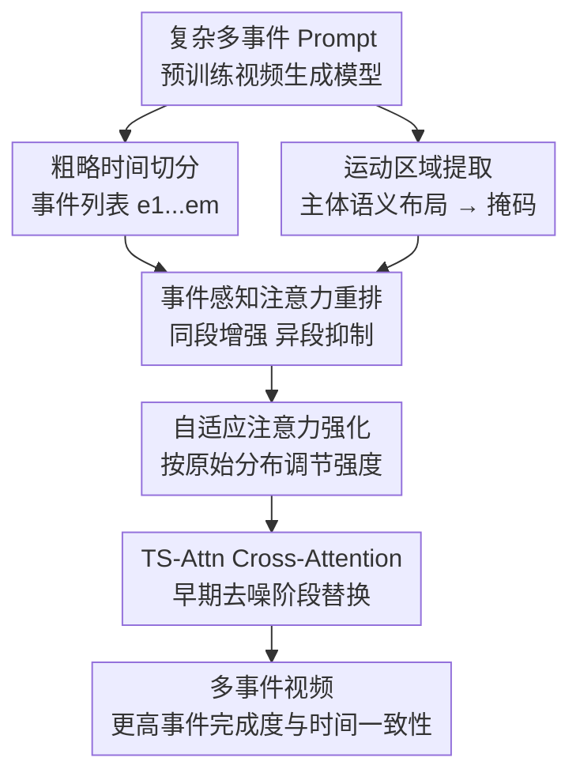

# TS-Attn: Temporal-wise Separable Attention for Multi-Event Video Generation

**会议**: ICLR2026  
**OpenReview**: [https://openreview.net/forum?id=QixNhagZ9t](https://openreview.net/forum?id=QixNhagZ9t)  
**代码**: https://github.com/Hong-yu-Zhang/TS-Attn  
**领域**: 视频生成 / 多事件视频生成  
**关键词**: 多事件视频生成, 时间对齐, 交叉注意力, 训练无关控制, 文生视频  

## 一句话总结
TS-Attn 提出一种训练无关的时序可分离交叉注意力机制，在预训练视频生成模型的早期去噪阶段重新分配动作区域与事件词之间的注意力，从而在单次复杂提示词推理中同时提升多事件完成度、时间顺序和视频一致性。

## 研究背景与动机
**领域现状**：近两年的文生视频模型已经能生成高质量、较稳定的短视频，尤其在单一动作或单一场景描述上表现不错。随着 DiT、3D attention 和大规模视频数据的发展，Wan、CogVideoX、HunyuanVideo 等基础模型可以处理更长、更复杂的自然语言提示词，因此多事件视频生成看起来像是一个自然延伸：用户希望一句话描述“先发生 A，再发生 B，最后发生 C”，模型直接生成完整视频。

**现有痛点**：真正困难的是“多事件”并不只是更长的 prompt。已有方法大致有两条路：一类把复杂描述拆成多个短 prompt，分段生成再拼接，这样每段动作更容易做对，但片段之间容易主体漂移、背景跳变，推理时间也会随事件数成倍增长；另一类把完整复杂 prompt 一次喂给大模型，整体画面更连贯，却常出现某个事件被漏掉、动作顺序错乱，或者多个动词同时作用在同一帧上的 temporal hallucination。

**核心矛盾**：这篇论文把问题归因到交叉注意力里的时间错配与事件耦合。对于一个包含多个动作的 prompt，视频 token 在不同时间段本应分别关注对应事件，但 vanilla cross-attention 往往让多个动作词在同一批运动区域上同时响应，或者让当前帧的主体区域没有真正对齐当前应发生的动作。于是模型虽然读到了全局 prompt，却没有把“哪个动作该在什么时候作用到哪个区域”落实到去噪过程里。

**本文目标**：作者希望保留单 prompt 推理带来的全局一致性，同时补上多 prompt 方法擅长的动作可控性。更具体地说，方法要解决三个子问题：先找到每帧里真正和运动相关的主体区域；再把不同时间段的视频 token 与对应事件词绑定起来；最后避免这种注意力干预过硬，导致背景一致性被破坏或转场不自然。

**切入角度**：作者观察到视频运动信息主要在去噪早期形成，并且 cross-attention 已经隐含了主体、动作和文本 token 的关联。与其重新训练模型或额外训练时间标注数据，不如直接在推理时改写早期 cross-attention 的 logits，让动作区域更关注同时间段的事件词，并抑制其他事件词的串扰。

**核心 idea**：TS-Attn 用“运动区域掩码 + 事件感知注意力调制”替代早期去噪阶段的原始交叉注意力，把多事件 prompt 中的事件条件沿时间维度拆开注入，从而让单次生成也具备更清晰的事件顺序感。

## 方法详解

### 整体框架
TS-Attn 是一个插入式注意力机制，不改变模型权重，也不需要重新训练。它运行在预训练视频生成模型的 cross-attention 层，主要作用于早期去噪步骤：先根据主体 token 的语义布局提取运动相关区域，再根据 prompt 中的事件列表和粗略时间段，对这些运动区域里的视频 token 施加事件感知的 attention bias 与 reinforcement。

整体上，输入是一条包含多个事件的复杂 prompt，以及视频生成模型当前去噪阶段的视频 query 与文本 key；输出仍是 cross-attention map，只是运动区域内的注意力分布被重新排布为“当前时间段更看当前事件，其他事件影响变弱”。这样既避免了多段推理的拼接成本，又尽量不破坏单 prompt 生成的全局一致性。

时间切分本身不是本文最重的贡献。论文尝试了用户输入、GPT-4o-mini 规划和均匀切分，结果差异很小，说明 TS-Attn 只需要粗粒度的事件区间，而不是精确到帧的时间戳。默认实现使用 GPT-4o-mini 从 prompt 中解析事件并给出区间，但如果没有外部 API，均匀切分也能工作。

### 关键设计
**1. 运动区域提取：只在真正承载动作的主体区域改注意力**

多事件错配通常发生在运动主体附近，而不是整张画面的所有 token 都需要被强行改写。TS-Attn 先用 prompt 里的主体词 $s$ 去索引 cross-attention 中对应的文本 token，并把视频 query $Q \in \mathbb{R}^{N \times d}$ 与文本 key $K \in \mathbb{R}^{M \times d}$ 的相似度投影成主体语义图 $A_s$：$A_s = \mathrm{Mean}(I_s(QK^\top / \sqrt{d}))$。这里 $I_s(\cdot)$ 表示取出主体词相关的注意力位置，$A_s$ 可以理解为“哪些视频 token 在看这个主体”。

接着，方法用 $A_s$ 的均值作为自适应阈值，得到二值运动区域掩码 $M_s = F_K(I(A_s \ge \mathrm{Mean}(A_s)))$，其中 $F_K$ 是 kernel size 为 3 的腐蚀操作，用来去掉零散噪声并收紧边界。这个设计的关键不在于分割出精确前景，而在于把后续注意力调制限制在主体运动区域内：如果对背景 token 也施加强 bias，模型容易出现背景闪烁、场景突变；只调主体区域则更像是在纠正“动作该落在哪里”，而不是重写整段视频。

**2. 事件感知注意力重排：让每个时间段的视频 token 主要关注自己的事件**

在拿到事件列表 $[e_1, e_2, ..., e_m]$ 与对应视频 query 分段 $[Q_1, Q_2, ..., Q_m]$ 后，TS-Attn 对第 $i$ 个时间段的运动区域视频 token 施加一个 bias：对当前事件 $e_i$ 的文本 token 加正偏置，对其他事件 $e_j, j \ne i$ 的文本 token 加负偏置，其余背景描述或上下文词不动。论文把正负偏置定义为 $b_i^+ = \max(Q_iK^\top) - \mathrm{mean}(Q_iK^\top)$ 与 $b_i^- = \min(Q_iK^\top) - \mathrm{mean}(Q_iK^\top)$，再按文本 token 是否属于对应事件写入 $B(Q_i, K)$。

这个 bias 的好处是软性的：它不是把非当前事件彻底 mask 掉，而是在原始注意力 logits 上重新拉开差距。多事件视频里，一个动作从前一段过渡到后一段时，画面仍需要保留主体、背景和语义上下文；硬切会让视频像拼接片段。TS-Attn 的重排则只是在运动区域内提高“当前动作词”的竞争力，同时降低其他动作词的串扰，因此更适合保持连续动作和物理转场。

**3. 自适应注意力强化：原始注意力越平，干预越强**

仅有 attention rearrangement 还不够，因为不同 prompt、不同模型、不同层的原始注意力分布强弱差异很大。如果当前事件词本来已经很突出，就不需要过度放大；如果分布很平，动作词之间混在一起，bias 就要更强。TS-Attn 因此引入 reinforcement factor $R(Q, K)$，先计算原始注意力探针 $p_i = \mathrm{Softmax}(Q_iK^\top / \sqrt{d})$，再归一化为 $p_i' = (p_i - p_i^{\min}) / (p_i^{\max} - p_i^{\min} + \epsilon)$。

对于当前事件，强化因子是 $r_i^+ = r_{\min} + (1 - p_i') \cdot (r_{\max} - r_{\min})$；对于其他事件，负向强化因子是 $r_i^- = r_{\min} + p_i' \cdot (r_{\max} - r_{\min})$。论文设置 $r_{\min}=1, r_{\max}=1.5$。直观说，如果当前事件的注意力本来很弱，就给它更大正向增强；如果非当前事件在这个时间段本来很强，就更用力压下去。最终调制形式是 $A = \mathrm{softmax}((QK^\top + M_s \odot R(Q,K) \odot B(Q,K))/\sqrt{d})$，其中 $M_s$ 保证改动只发生在运动区域。

**4. 多主体累加调制：把每个主体和自己的事件序列分别绑定**

主文为了说明方便以单主体为例，但附录给出多主体扩展。对于 prompt 中的主体列表 $[s_1, s_2, ..., s_m]$，TS-Attn 分别提取每个主体的运动掩码 $M_{s_i}$，并根据该主体对应事件生成 $B_{s_i}(Q,K)$ 与 $R_{s_i}(Q,K)$，最后把所有主体的调制项求和后加入 logits：$A = \mathrm{softmax}((QK^\top + \sum_i M_{s_i} \odot R_{s_i}(Q,K) \odot B_{s_i}(Q,K))/\sqrt{d})$。

这个扩展让方法不仅能处理“猫先看、再蘸、再拿出”这类单主体多动作，也能处理多个主体各自执行事件的复杂场景。实现上作者强调不会为每个主体重复计算整张 attention matrix，而是按主体索引所需位置来构造 bias，因此多主体场景的额外开销接近单主体版本。

### 一个完整示例
假设 prompt 是“a cat watches a bowl, then dips its paw into the water, then takes it out”。普通 cross-attention 可能让 watch、dips、takes out 三个动词在中间帧同时响应猫的区域，导致模型生成一段含混动作：猫一直在附近动，但看不出清楚的先后顺序。

TS-Attn 会先从主体词 “cat” 的 attention map 中得到猫所在的运动区域掩码。随后，时间切分模块把视频粗略分成三段：第一段对应 watch，第二段对应 dips，第三段对应 takes it out。进入早期去噪时，第一段猫区域的视频 token 会被加上指向 watch token 的正 bias，并压低 dips、takes out；第二段则反过来增强 dips，压低 watch 和 takes out；第三段增强 takes out。由于背景词、场景词没有被强行切断，视频仍能保持同一只猫、同一个碗和连续场景，只是动作条件被按时间重新绑定。

### 损失函数 / 训练策略
TS-Attn 没有新的训练损失，也不更新模型参数。它是纯推理时的 cross-attention 替换机制，主要插入到视频生成模型早期去噪阶段，因为论文观察到运动信息主要在早期形成。T2V 实验中，TS-Attn 应用于前 20% 的去噪步骤；I2V 实验中，为了增强图像条件下的动作控制，使用前 40% 的去噪步骤。

基础推理配置保持原模型设置，包括去噪步数、scheduler 和分辨率。实验覆盖 CogVideoX、Wan2.1、Wan2.2 等不同架构，说明该方法依赖的是通用 cross-attention 接口，而不是某个模型的专用训练技巧。时间分段默认由 GPT-4o-mini 给出，平均耗时约 2.65 秒；论文也验证均匀分段与人工分段的差异不大，因此实际部署时可以按成本选择分段策略。

## 实验关键数据

### 主实验
论文主要在 StoryEval-Bench 上评估多事件 T2V。该 benchmark 含 423 条 prompt，覆盖 human、animal、object、retrieval、creative、easy、hard 等类别，每条 prompt 包含 2-4 个事件。评估器使用 GPT-4o 和 LLaVA-OV-Chat-72B，指标关注事件完整性、时间准确性和主体一致性。

| 模型 / 配置 | Human | Animal | Object | Retrieval | Creative | Easy | Hard | Average |
|--------|------:|------:|------:|------:|------:|------:|------:|------:|
| Wan2.2-A14B | 51.2% | 46.7% | 44.9% | 54.8% | 34.8% | 60.3% | 34.0% | 48.3% |
| Wan2.2-A14B + TS-Attn | 60.4% | 53.6% | 52.0% | 63.0% | 45.3% | 70.5% | 44.3% | 56.2% |
| Wan2.1-14B | 41.4% | 37.2% | 31.9% | 45.2% | 21.9% | 53.8% | 24.6% | 37.6% |
| Wan2.1-14B + TS-Attn | 54.7% | 50.0% | 45.1% | 62.1% | 35.2% | 64.5% | 38.7% | 50.2% |
| CogVideoX-5B | 17.1% | 16.4% | 14.0% | 16.0% | 7.4% | 35.4% | 4.6% | 16.4% |
| CogVideoX-5B + TS-Attn | 28.0% | 25.4% | 21.7% | 32.9% | 13.9% | 45.7% | 9.9% | 25.8% |

I2V 没有现成的多事件 benchmark，作者构造了 StoryEval-Bench-I2V：先用 GPT-4o 把原视频 prompt 改写为“事件开始前的初始状态描述”，再用 Qwen-Image 合成首帧，并人工从 3 个随机种子中选择最合适图像，最终得到 423 对图文样本。

| 模型 / 配置 | Human | Animal | Object | Retrieval | Creative | Easy | Hard | Average |
|--------|------:|------:|------:|------:|------:|------:|------:|------:|
| Wan2.2-I2V-A14B | 48.4% | 49.3% | 43.1% | 50.3% | 34.4% | 57.8% | 39.1% | 47.5% |
| Wan2.2-I2V-A14B + TS-Attn | 58.3% | 53.2% | 50.4% | 63.0% | 36.5% | 64.0% | 43.8% | 54.4% |
| Wan2.1-I2V-14B | 43.8% | 33.9% | 36.0% | 42.1% | 29.8% | 44.4% | 31.9% | 37.0% |
| Wan2.1-I2V-14B + TS-Attn | 46.0% | 38.8% | 43.3% | 44.9% | 32.0% | 54.2% | 32.6% | 42.6% |
| CogVideoX-I2V-5B | 21.0% | 18.8% | 17.5% | 23.3% | 10.0% | 35.8% | 9.9% | 19.6% |
| CogVideoX-I2V-5B + TS-Attn | 28.2% | 28.8% | 23.5% | 35.1% | 16.5% | 44.3% | 15.9% | 28.3% |

### 消融实验
| 配置 | Wan2.2-A14B Avg | Wan2.1-14B Avg | CogVideoX-5B Avg | 说明 |
|------|------:|------:|------:|------|
| Baseline | 48.3% | 37.6% | 16.4% | 原始 cross-attention，不做多事件时序调制 |
| + EAM | 51.9% | 46.4% | 22.9% | 只加入事件感知注意力调制，已经明显提升事件响应 |
| + EAM & MRE | 56.2% | 50.2% | 25.8% | 完整 TS-Attn，加入运动区域提取后进一步避免背景干扰 |

更细的 EAM 子模块消融显示，attention rearrangement 是核心贡献。以 Wan2.2-A14B 为例，完整 TS-Attn 的 Avg 为 56.2%；去掉 attention rearrangement 后只剩 49.4%，几乎退化为普通事件 token 增强；去掉 attention reinforcement 后 Avg 为 53.5%，仍有提升但不如完整方法。这说明真正重要的是按时间重新分配事件注意力，reinforcement 更像是根据原始注意力强弱进行自适应校准。

| 配置 | Wan2.2 Easy | Wan2.2 Hard | Wan2.2 Avg | CogVideoX Easy | CogVideoX Hard | CogVideoX Avg |
|------|------:|------:|------:|------:|------:|------:|
| w/o Attention Rearrangement | 63.1% | 36.8% | 49.4% | 38.2% | 5.9% | 18.8% |
| w/o Attention Reinforcement | 67.4% | 41.2% | 53.5% | 41.8% | 8.4% | 23.6% |
| TS-Attn | 70.5% | 44.3% | 56.2% | 45.7% | 9.9% | 25.8% |

### 关键发现
- TS-Attn 对不同模型规模和架构都有效：Wan2.1-14B 的 StoryEval-Bench 平均分从 37.6% 到 50.2%，CogVideoX-5B 从 16.4% 到 25.8%，说明它不是只适配某个强基座模型的 prompt trick。
- 运动区域提取对稳定性很关键：只做 EAM 已经能提升，但加入 MRE 后，Wan2.2-A14B 又从 51.9% 提到 56.2%，这和论文的可视化结论一致，即不限制区域会引入背景闪烁和场景突变。
- 推理效率优势明显：在单张 A100 上，Wan2.2-A14B 为 846 秒，加入 TS-Attn 后为 863 秒，约 2% 额外开销；同一基座上的 MEVG 和 DiTCtrl 分别为 2453 秒和 2749 秒，因为它们需要多段或多提示词推理。
- 时间切分不需要很精确：Wan2.2-A14B 上均匀切分、人工输入、GPT-4o-mini 分别得到 55.3%、56.8%、56.2% Avg，差距很小，说明 soft attention redistribution 能容忍粗略区间甚至部分重叠。

## 亮点与洞察
- 这篇论文最有价值的地方是把多事件失败原因定位到“事件词与运动区域的时间维度耦合”，而不是泛泛地说模型不理解长 prompt。这个诊断让改法很直接：不训练新模型，只在 cross-attention logits 上按时间重排。
- TS-Attn 的干预很克制。它不对整张 latent 做硬 mask，而是先找主体运动区域，再对事件词做软性正负 bias，因此比多 prompt 拼接更容易保持同一场景、同一主体和连续转场。
- 训练无关是一个很实用的优势。多事件视频生成常受限于带时间戳的高质量数据，本文绕开数据构造与后训练成本，直接复用现有开源模型，适合作为基础模型推理栈里的插件。
- 时间切分实验很有启发：精确时间标注并不是主要瓶颈，粗略告诉模型“这段大概对应哪个事件”就足够产生明显收益。这提示后续多事件控制可以把重点放在注意力绑定和区域定位，而不是追求昂贵的帧级事件标签。
- 该思想可以迁移到其他生成任务，例如多步骤图像编辑、多对象视频编辑或具身任务视频生成。只要能确定“哪个区域/对象在什么时候应该响应哪个条件”，类似的区域约束 + 条件重排都可能发挥作用。

## 局限与展望
- TS-Attn 依赖 prompt 中主体与事件的可解析性。如果描述里主体省略、代词复杂、多个主体共享动作，或者事件边界非常模糊，基于文本 token 的索引和粗略分段可能会出错。
- 方法主要调制 cross-attention，因此对模型本身完全不会某类动作、物理交互或长程状态保持的情况，提升会有限。它能把已有能力按时间用得更准，但不能凭空补出模型没有学到的动作动力学。
- 运动区域掩码来自主体 attention map，并不是真正的视频分割。主体很小、遮挡严重、背景与主体语义混杂时，掩码可能不够准；虽然腐蚀操作能去噪，但也可能漏掉细粒度动作部位。
- 实验主要依赖 GPT-4o / LLaVA verifier 与人工辅助观察，自动评估多事件视频仍有不确定性。特别是动作完成度、物理合理性和时间顺序，评估器可能受 prompt 表述和视觉模型能力影响。
- 后续可以把 TS-Attn 与更强的事件解析器、对象跟踪或自监督运动区域估计结合，让主体-事件绑定更可靠；也可以研究在长视频模型中跨 clip 传播事件状态，避免每段只局部对齐。

## 相关工作与启发
- **vs MEVG / DiTCtrl**: MEVG、DiTCtrl 属于多 prompt 或多段推理范式，通过分解复杂 prompt 来提升单段动作可控性，但推理时间大幅增加，片段之间也容易出现一致性问题。TS-Attn 保留单 prompt 单次生成，只改 cross-attention 分布，因此效率和全局一致性更好。
- **vs VideoTetris / TALC**: 这类方法强调用局部/全局 cross-attention 或时间对齐 caption 控制不同片段，但在无训练扩展到多事件任务时，硬条件或局部分段可能破坏视频 latent 分布。TS-Attn 的软重排更轻量，也更贴近预训练模型原有生成过程。
- **vs MinT / ShotAdapter**: MinT 和 ShotAdapter 依赖时间戳数据或 post-training，让模型学习多事件/多镜头生成能力。TS-Attn 不需要重新训练，因此迁移到新模型更方便；代价是它的上限仍受基座模型已有动作生成能力限制。
- **vs 普通长 prompt 直接生成**: 强基座模型用完整 prompt 能维持较好画面一致性，但容易遗漏事件。TS-Attn 可以看作给长 prompt 增加了一层显式的时间注意力路由，让事件词不再在所有帧里混杂竞争。

## 评分
- 新颖性: ⭐⭐⭐⭐ 训练无关 attention control 并非全新方向，但把运动区域、事件时序和自适应重排组合到多事件视频生成上，问题定位清楚且设计很贴题。
- 实验充分度: ⭐⭐⭐⭐ T2V/I2V、多模型、多评估器、效率和消融都覆盖到了；不足是自动 verifier 仍难完全替代严格人工评测。
- 写作质量: ⭐⭐⭐⭐ 论文结构清晰，公式和模块对应关系比较直观，附录补充了多主体、I2V benchmark 和更多消融；部分实现细节如事件解析鲁棒性还可以再展开。
- 价值: ⭐⭐⭐⭐⭐ 作为无需训练、低开销、可插入现有视频生成模型的多事件控制方法，实用价值很高，也为后续时序注意力控制提供了清晰方向。

<!-- RELATED:START -->

## 相关论文

- [\[CVPR 2026\] SwitchCraft: Training-Free Multi-Event Video Generation with Attention Controls](../../CVPR2026/video_generation/switchcraft_training-free_multi-event_video_generation_with_attention_controls.md)
- [\[CVPR 2026\] TempoControl: Temporal Attention Guidance for Text-to-Video Models](../../CVPR2026/video_generation/tempocontrol_temporal_attention_guidance_for_text-to-video_models.md)
- [\[CVPR 2025\] Mind the Time: Temporally-Controlled Multi-Event Video Generation](../../CVPR2025/video_generation/mind_the_time_temporally-controlled_multi-event_video_generation.md)
- [\[ICLR 2026\] Astraea: A Token-wise Acceleration Framework for Video Diffusion Transformers](astraea_a_token-wise_acceleration_framework_for_video_diffusion_transformers.md)
- [\[ICLR 2026\] DSA: Efficient Inference For Video Generation Models via Distributed Sparse Attention](dsa_efficient_inference_for_video_generation_models_via_distributed_sparse_atten.md)

<!-- RELATED:END -->
