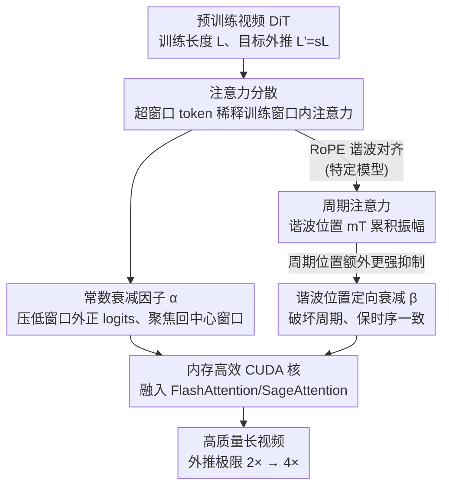

# UltraViCo: Breaking Extrapolation Limits in Video Diffusion Transformers

**会议**: ICLR 2026  
**OpenReview**: [https://openreview.net/forum?id=fLLCmC53u9](https://openreview.net/forum?id=fLLCmC53u9)  
**项目页**: [https://thu-ml.github.io/UltraViCo.github.io/](https://thu-ml.github.io/UltraViCo.github.io/)  
**代码**: 见项目页  
**领域**: 视频生成 / 扩散模型  
**关键词**: 视频长度外推, 注意力分散, RoPE, training-free, 扩散 Transformer

## 一句话总结
本文发现视频扩散 Transformer 在超出训练长度生成时出现的"周期性重复"和"通用质量退化"两种失败都源于同一个机制——**注意力分散**（超窗口的新 token 稀释了训练窗口内学到的注意力分布），并据此提出 training-free、即插即用的 UltraViCo：对窗口外 token 的注意力 logits 乘一个常数衰减因子，把外推极限从 2× 推到 4×（4× 下动态度和成像质量分别比前最优高 233% 和 40.5%）。

## 研究背景与动机
**领域现状**：以 DiT 为骨干的文生视频模型（Wan、HunyuanVideo、CogVideoX 等）已能合成高保真视频，但它们都在一个**固定的最大序列长度**上训练（如 5 秒），一旦要求模型一次前向生成超过训练时长的视频——即"视频长度外推"（video length extrapolation）——就会明显崩坏。这里强调的是模型**内在的单次前向**生成长视频的能力，与 FreeNoise / FIFO-Diffusion 等推理时滑窗拼接的方案正交。

**现有痛点**：外推时存在两种失败模式。其一是**周期性内容重复**：某些模型（HunyuanVideo、CogVideoX）会把一小段画面无限循环；其二是**通用的质量退化**：空间细节变糊、时间动态僵死（画面"冻住"），这在所有模型上都出现。两者都随外推倍率增大而加剧。

**核心矛盾**：以往工作（如 RIFLEx）只从**位置编码（RoPE）的周期性**去解释和修复重复，却忽略了质量退化，因此外推能力有限（普遍卡在 2×~3× 就崩）。作者认为位置编码只是**间接**因素——它通过扰动 query/key 来影响注意力；真正直接决定"上下文如何被聚合到输出"的是**注意力图本身**。把视角从位置编码挪到注意力图，才有可能同时解释两种失败。

**本文目标**：回答三个问题——为什么周期重复只在特定模型出现？质量退化的根因是什么？这两个看似独立的失败背后是否有统一原因？

**切入角度**：直接分析外推时的注意力图 $P\in\mathbb{R}^{L'\times L'}$。作者发现：当一个修复"重复"的干预手段被施加后，**视频质量也意外变好了**——这条线索把两种失败串到了一起。

**核心 idea**：两种失败统一于"注意力分散"；只要把超出训练窗口的 token 的注意力**压低、让注意力重新聚焦回训练窗口**，就能同时治好重复和退化，而且无需训练。

## 方法详解

### 整体框架
UltraViCo 的逻辑是一条"先诊断、再开药"的链路：先通过注意力图分析定位**周期重复**的成因（RoPE 谐波 → 周期注意力 → 周期输出），再发现修复重复的干预同时改善质量，从而把质量退化也归因到**注意力分散**这一统一机制；最后给出一个对窗口外 token 注意力 logits 乘衰减因子的简单修正，并配一个内存高效 CUDA 实现，使其能在长序列大模型上落地。输入是一个已训练好的视频 DiT（训练长度 $L$）和目标外推长度 $L'=sL$，输出是质量与动态都不崩的长视频，全程**不改权重、不微调**。

### 关键设计

**1. 注意力分散：把两种失败统一到一个根因**

这是全文的诊断基石，针对的是"重复"和"质量退化"长期被当成两个独立问题、各打各的局面。作者先拆解重复：在 4× 外推的注意力图 $P$ 上，HunyuanVideo 表现出两条性质——**行向周期性** $P_{i,j}\approx P_{i,j+T}$（$T$ 是观测到的重复周期）和 RoPE 带来的**相对位置不变性** $P_{i,j}\approx P_{i+p,j+p}$；两者叠加可推出整行也周期重复 $P_{i+T,j}\approx P_{i,j}$，于是 $O_{i+T}=\sum_j P_{i+T,j}V_j\approx\sum_j P_{i,j}V_j=O_i$，输出在像素空间表现为内容循环。

关键转折在于：作者**屏蔽掉谐波对齐位置 $mT$ 的 token** 来打断周期，结果不仅重复消失，**画质也同步变好**。对比注意力图发现，这个干预把原本弥散的注意力重新**集中回中心训练窗口**——因为屏蔽谐波峰后 softmax 重归一化会按比例抬高剩余分数、锐化分布。由此得到统一假设：外推时新增的窗口外 token **稀释**了训练窗口内学到的注意力（即注意力分散），空间上让模型被迫去看遥远帧而无法聚焦细节（变糊），时间上把局部运动和无关运动混在一起（变静）。一个受控实验进一步证实：**逐步屏蔽窗口外注意力分数、强迫注意力中心化，成像质量和动态度单调上升**。至此"周期重复 = 注意力分散被组织成周期形态的特例"，根因收敛为一个。

**2. 谐波 RoPE 频率：解释"为什么只有某些模型会重复"**

针对的是第一个反常现象——重复只在 HunyuanVideo / CogVideoX 出现，Wan 不会。作者构造一个跨层、跨头、跨 query 位置取期望的**统计行注意力** $\bar S(\Delta t)$（$\Delta t$ 为同空间位置、相隔的潜在帧数），它可被分解为 RoPE 频率的三角函数线性组合：

$$\bar S(\Delta t)=\sum_{i=0}^{d/2-1} a_i\cos(\phi_i\Delta t+b_i)+C$$

其中 $\{\phi_i\}$ 是 RoPE 频率，$a_i,b_i,C$ 由 query/key 统计决定（$b_i$ 通常近 0）。命题 1 给出周期性判据：当且仅当所有 $\phi_i/\phi_{N-1}\in\mathbb{N}^+$（构成一组谐波）时，$\bar S$ 才是周期为 $T_{N-1}=2\pi/\phi_{N-1}$ 的周期函数，且在谐波对齐位置 $\Delta t=mT_{N-1}$ 处各频率振幅相干叠加、取到最大值。HunyuanVideo 恰好满足谐波条件，最大振幅频率 $\phi_3$ 及其谐波在对齐位置累积，单一主成分贡献了总振幅的 **79.6%**，于是注意力强周期化；Wan 的频率非谐波对齐、频谱弥散（最大频率仅占 31.6%），因而无明显周期。这把"模型相关的重复"精确归因到 RoPE 频率是否谐波对齐。

**3. 常数衰减因子 α + 谐波位置定向衰减 β：一招同治两病**

这是真正的"药"，针对注意力分散。UltraViCo 给注意力 logits $S_{ij}$ 乘一个位置相关衰减 $\lambda_{ij}$ 得到修正 $S'_{ij}=\lambda_{ij}\cdot S_{ij}$：

$$\lambda_{ij}=\begin{cases}1,& |i-j|\le L/2 \ \text{或}\ S_{ij}<0\\ \alpha,& \text{否则}\end{cases}$$

窗口内（$|i-j|\le L/2$）保持 1，不动模型学到的核心动态；窗口外只压**正** logits（$\alpha<1$），因为负 logits 乘 $\alpha<1$ 反而会把它抬高、起反效果。作者试过线性、抛物线等衰减形状，发现常数形式就够了——**关键在于区分窗口内/外，而非衰减曲线的形状**。

但对会周期重复的模型，谐波对齐位置 $mT$ 吸引了不成比例的高注意力，若对所有窗口外 token 一视同仁地用小 $\alpha$，会过度压制有用上下文、伤害时序一致性。于是对这些"危险位置"施加**更强的衰减** $\beta<\alpha$：

$$\lambda_{ij}=\begin{cases}1,& |i-j|\le L/2\ \text{或}\ S_{ij}<0\\ \beta,& (i,j)\in P_{\text{risk}}\\ \alpha,& \text{否则}\end{cases}$$

其中 $P_{\text{risk}}=\{(i,j)\mid mT-\gamma\le i-j\le mT+\gamma,\ m\in\mathbb{Z}\}$ 是谐波对齐位置 $\pm\gamma$ 帧的邻域。这样既把注意力拉回可靠的窗口内上下文（治退化），又精准消掉虚假周期模式（治重复），两种失败一并解决。实现上取 $\alpha=0.9$；HunyuanVideo 取 $\gamma=4$、$\beta$ 在 3× 时 0.6、4× 时 0.8。

**4. 内存高效 CUDA 核：让方法在长序列上真能跑**

UltraViCo 需要改注意力 logits，但标准 PyTorch 注意力在长序列下不可行：3× 外推下 HunyuanVideo 约 200K token，显式构造 $200\text{K}\times200\text{K}$ 的 bf16 注意力掩码要 >80GB 显存，直接 OOM。作者把衰减逻辑融入基于 Triton 的 FlashAttention 和 SageAttention——它们的 online-softmax 形式天然避免显式掩码矩阵，从而得到可扩展、省显存的实现，让 UltraViCo 能用在大视频模型上。这一步虽是工程性的，但没有它整个方法无法落地。

## 实验关键数据

### 主实验
在 HunyuanVideo、Wan2.1-1.3B、CogVideoX-5B 上，用 VBench 采样 100 个 prompt，指标为成像质量（Qual.）、动态度（Dyn.）、整体一致性（Over.）、Consistency（Consist.）、NoRepeat 分数（NoRe.，越高越不重复）及用户排名（User，越低越好）。下表为 HunyuanVideo 在 3× / 4× 外推下的对比（节选）：

| 设置 | 方法 | NoRe.↑ | Dyn.↑ | Qual.↑ | Over.↑ | User↓ |
|------|------|--------|-------|--------|--------|-------|
| 训练长度参考 | Normal. | – | 71 | 69.31 | 26.81 | – |
| 3× | RIFLEx | 73.97 | 17 | 50.57 | 21.22 | 4.67 |
| 3× | **Ours** | **100.0** | **62** | **65.00** | **26.45** | **1.02** |
| 4× | RIFLEx | 52.84 | 11 | 41.02 | 16.47 | 4.69 |
| 4× | **Ours** | **99.87** | **42** | **66.54** | **24.52** | **1.02** |

在 Wan2.1-1.3B（无重复，故省 NoRepeat）上，4× 外推时各 baseline 普遍坍缩为静态视频（Dynamic Degree ≤ 12），UltraViCo 恢复到 47；3× 时同样从 baseline 的个位数动态度恢复到 46。作者据此宣称把实用外推极限从 **2× 推到 4×**，并在 4× 上比前最优方法把 Dynamic Degree、Imaging Quality 分别提升 **233%** 和 **40.5%**。

### 消融实验

| 配置 | 关键发现 | 说明 |
|------|---------|------|
| 衰减形状（常数 / 线性 / 抛物线） | 差异很小 | 说明关键是"区分窗口内外"，而非曲线形状，常数足矣 |
| 衰减强度 α | $\alpha=0.9$ 最佳 | $\alpha$ 过小伤一致性（如车的备胎消失），$\alpha$ 过大收益有限 |
| α / β 敏感性 | $\alpha\ge0.9$、$\beta\ge0.6$ 稳定 | 此区间内质量/动态提升而一致性接近 baseline；低于阈值一致性骤降 |
| 屏蔽比例（中心聚焦程度） | 单调正相关 | 屏蔽窗口外越多、注意力越集中，质量与动态单调变好（验证分散即根因） |

### 关键发现
- 把"修重复"的干预（屏蔽谐波位置）施加后，画质同步变好——这是发现"注意力分散是统一根因"的关键反常线索。
- 衰减曲线形状几乎不重要，重要的是有没有区分训练窗口内/外，说明方法的有效性来自"注意力是否聚焦回窗口"这一核心机制，而非精细调参。
- UltraViCo 与滑窗、FreeNoise、FIFO-Diffusion 等长视频方法正交：把它叠加上去（6× 外推生成 30 秒视频、相当于扩 3× 训练窗口）能稳定提升长程时序一致性而不损其他指标。
- 可零成本迁移到下游：基于 VACE，在可控生成和视频编辑上同样实现 3× 外推。

## 亮点与洞察
- **统一视角是最大亮点**：把"周期重复"和"质量退化"两个原本各自为战的问题归结为同一个"注意力分散"，且证明前者只是后者被 RoPE 谐波组织成周期形态的特例——一个根因解释两类现象，干净且有说服力。
- **从位置编码视角切换到注意力视角**：作者论证 RoPE 只是间接因素、注意力图才是直接决定输出聚合的量，这个视角转换是方法能同时治两病的前提，也是相比 RIFLEx 的根本差异。
- **极简且 training-free**：核心修正就是给窗口外正 logits 乘个常数 $\alpha$，无需训练、即插即用，却把外推极限翻倍，性价比极高。
- **谐波 RoPE 频率分析可迁移**：用统计行注意力 $\bar S(\Delta t)$ 的三角分解 + 谐波判据来判断"某模型会不会周期重复"，这套频域分析工具可借鉴到其他基于 RoPE 的长序列外推诊断。

## 局限与展望
- 衰减阈值用的是硬截断（$|i-j|\le L/2$ 为窗口内），窗口边界处的 token 取舍偏机械，对窗口外略有用的远程上下文是"一刀切"压制，可能在需要长程依赖的内容上偏保守。
- 谐波位置定向衰减需要知道周期 $T$ 与 $\gamma,\beta$ 等额外超参，且要先判断模型是否谐波对齐；对未知模型需要先做频域分析，自动化程度有限。
- 实验主要在 3×~4×（叠加长视频方法时到 6×）验证，更激进的外推（如 10×+）是否仍只靠常数衰减就稳，文中未充分探讨。
- 评测以 VBench 子集 + 10 人用户研究为主，规模偏小；动态度等指标的大幅相对提升建立在 baseline 几乎静态的低基数上，需结合可视化理解。

## 相关工作与启发
- **vs RIFLEx**：RIFLEx 从位置编码周期性出发只修"重复"，忽略质量退化，外推能力有限；本文从注意力图出发，证明重复只是注意力分散的特例，用同一个衰减机制同治两病，因此能从 2× 推到 4×。
- **vs PI / NTK / YaRN / TASR 等 RoPE 外推法**：这些方法改的是位置编码的频率/插值（间接作用于 query/key），在视频外推 3× 以上普遍坍缩为静态；本文直接作用于注意力 logits，保持流畅运动。
- **vs FreeNoise / FIFO-Diffusion / 滑窗等长视频方案**：那些是推理时拼接、外部调度，本文增强的是模型**单次前向**的内在长序列能力，二者正交且可叠加——把 UltraViCo 叠到它们之上能进一步提升长程一致性。

## 评分
- 新颖性: ⭐⭐⭐⭐⭐ 把两类外推失败统一到"注意力分散"并给出谐波频域解释，视角新且根因扎实
- 实验充分度: ⭐⭐⭐⭐ 覆盖三模型、多外推倍率、与下游任务/长视频方法的正交叠加，但评测集与用户研究规模偏小
- 写作质量: ⭐⭐⭐⭐⭐ 诊断—假设—验证—方法的逻辑链清晰，注意力分析与公式推导到位
- 价值: ⭐⭐⭐⭐⭐ training-free、即插即用、把实用外推极限翻倍，并能迁移到可控生成/编辑，落地价值高

<!-- RELATED:START -->

## 相关论文

- [\[ICML 2025\] RIFLEx: A Free Lunch for Length Extrapolation in Video Diffusion Transformers](../../ICML2025/video_generation/riflex_a_free_lunch_for_length_extrapolation_in_video_diffusion_transformers.md)
- [\[ICLR 2026\] BWCache: Accelerating Video Diffusion Transformers through Block-Wise Caching](bwcache_accelerating_video_diffusion_transformers_through_block-wise_caching.md)
- [\[CVPR 2025\] PatchVSR: Breaking Video Diffusion Resolution Limits with Patch-Wise Video Super-Resolution](../../CVPR2025/video_generation/patchvsr_breaking_video_diffusion_resolution_limits_with_patch-wise_video_super-.md)
- [\[ICLR 2026\] FastVMT: Eliminating Redundancy in Video Motion Transfer](fastvmt_eliminating_redundancy_in_video_motion_transfer.md)
- [\[CVPR 2026\] VMonarch: Efficient Video Diffusion Transformers with Structured Attention](../../CVPR2026/video_generation/vmonarch_efficient_video_diffusion_transformers_with_structured_attention.md)

<!-- RELATED:END -->
